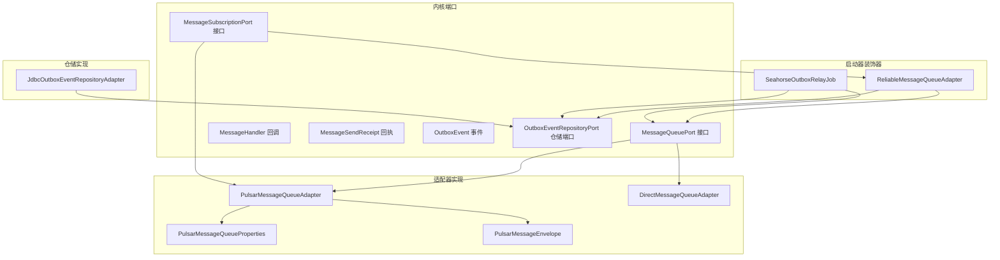
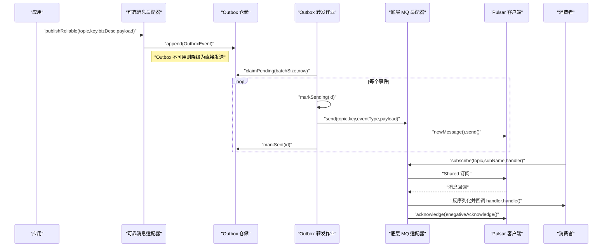
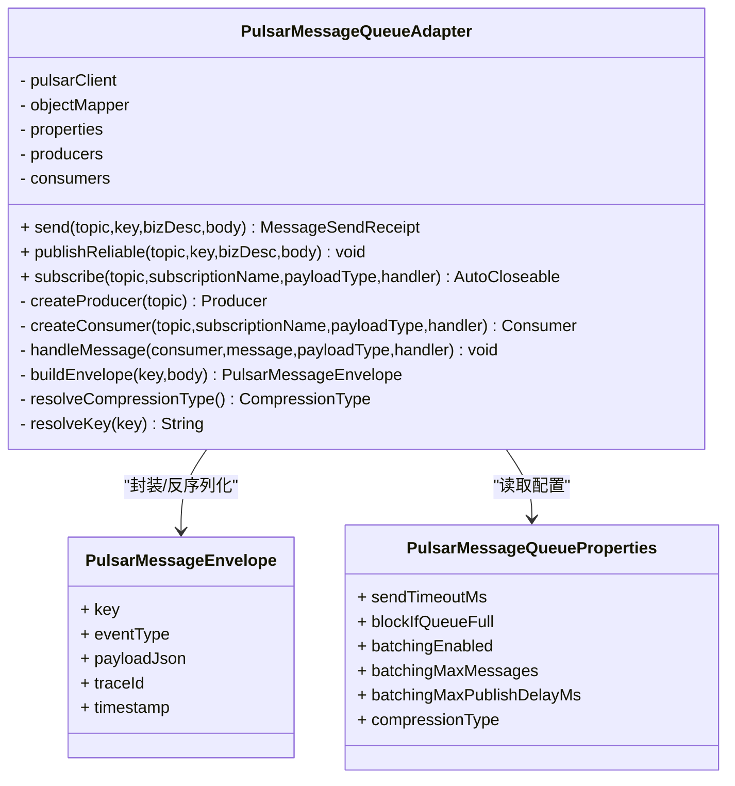
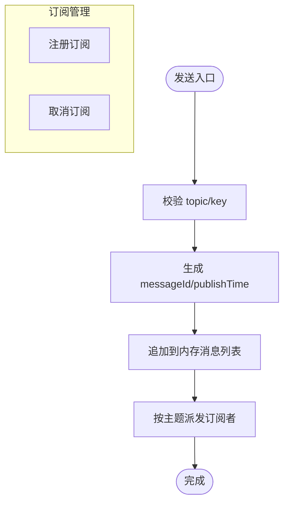
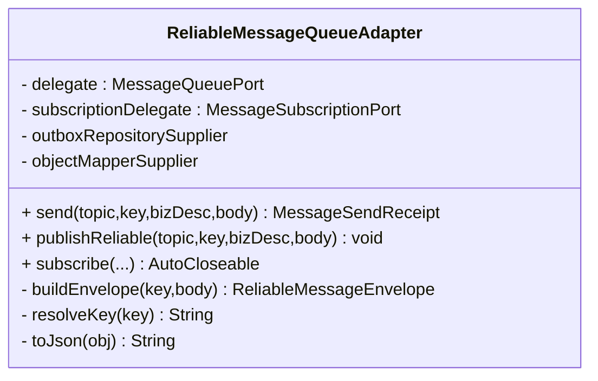
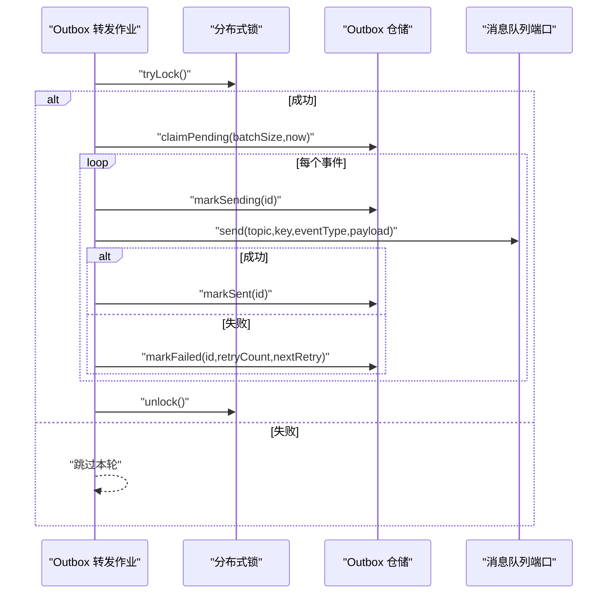
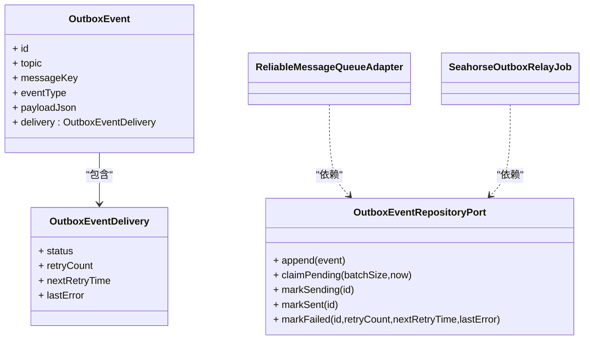
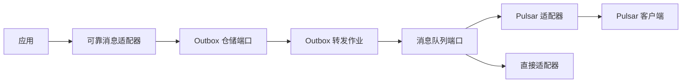

# 消息队列适配器

<cite>
**本文引用的文件**
- [PulsarMessageQueueAdapter.java](file://seahorse-agent-adapter-mq-pulsar/src/main/java/com/miracle/ai/seahorse/agent/adapters/mq/pulsar/PulsarMessageQueueAdapter.java)
- [PulsarMessageQueueProperties.java](file://seahorse-agent-adapter-mq-pulsar/src/main/java/com/miracle/ai/seahorse/agent/adapters/mq/pulsar/PulsarMessageQueueProperties.java)
- [PulsarMessageEnvelope.java](file://seahorse-agent-adapter-mq-pulsar/src/main/java/com/miracle/ai/seahorse/agent/adapters/mq/pulsar/PulsarMessageEnvelope.java)
- [DirectMessageQueueAdapter.java](file://seahorse-agent-adapter-mq-direct/src/main/java/com/miracle/ai/seahorse/agent/adapters/mq/direct/DirectMessageQueueAdapter.java)
- [ReliableMessageQueueAdapter.java](file://seahorse-agent-spring-boot-starter/src/main/java/com/miracle/ai/seahorse/agent/adapters/spring/mq/ReliableMessageQueueAdapter.java)
- [SeahorseOutboxRelayJob.java](file://seahorse-agent-spring-boot-starter/src/main/java/com/miracle/ai/seahorse/agent/adapters/spring/mq/SeahorseOutboxRelayJob.java)
- [MessageQueuePort.java](file://seahorse-agent-kernel/src/main/java/com/miracle/ai/seahorse/agent/ports/outbound/mq/MessageQueuePort.java)
- [MessageSubscriptionPort.java](file://seahorse-agent-kernel/src/main/java/com/miracle/ai/seahorse/agent/ports/outbound/mq/MessageSubscriptionPort.java)
- [MessageHandler.java](file://seahorse-agent-kernel/src/main/java/com/miracle/ai/seahorse/agent/ports/outbound/mq/MessageHandler.java)
- [MessageSendReceipt.java](file://seahorse-agent-kernel/src/main/java/com/miracle/ai/seahorse/agent/ports/outbound/mq/MessageSendReceipt.java)
- [OutboxEvent.java](file://seahorse-agent-kernel/src/main/java/com/miracle/ai/seahorse/agent/ports/outbound/mq/OutboxEvent.java)
- [OutboxEventRepositoryPort.java](file://seahorse-agent-kernel/src/main/java/com/miracle/ai/seahorse/agent/ports/outbound/mq/OutboxEventRepositoryPort.java)
- [JdbcOutboxEventRepositoryAdapter.java](file://seahorse-agent-adapter-repository-jdbc/src/main/java/com/miracle/ai/seahorse/agent/adapters/repository/jdbc/JdbcOutboxEventRepositoryAdapter.java)
- [DirectMessageQueueAdapterTests.java](file://seahorse-agent-adapter-mq-direct/src/test/java/com/miracle/ai/seahorse/agent/adapters/mq/direct/DirectMessageQueueAdapterTests.java)
</cite>

## 目录
1. [简介](#简介)
2. [项目结构](#项目结构)
3. [核心组件](#核心组件)
4. [架构总览](#架构总览)
5. [组件详解](#组件详解)
6. [依赖关系分析](#依赖关系分析)
7. [性能考量](#性能考量)
8. [故障排查指南](#故障排查指南)
9. [结论](#结论)
10. [附录](#附录)

## 简介
本文件面向消息队列适配器的技术文档，重点覆盖两类适配器：Apache Pulsar 消息队列适配器与“直接”消息队列适配器，并结合“可靠消息适配器装饰器”与“Outbox 转发作业”，系统阐述消息发送与接收、可靠投递保障、序列化机制、消息分组与分区策略、负载均衡、配置参数、性能调优、故障恢复、幂等性与死信队列、监控告警以及高并发下的可靠性与性能保障。

## 项目结构
消息队列适配器相关模块分布于多个子工程中，遵循“内核端口 + 适配器实现 + 启动器装饰器”的分层设计：
- 内核端口：定义消息发送、订阅、处理回调、发送回执、Outbox 事件与仓储端口等抽象。
- Pulsar 适配器：基于 Apache Pulsar 客户端实现发送、订阅、ACK/NACK、压缩、批处理等能力。
- 直连适配器：进程内直连实现，用于本地开发与测试，不依赖外部 Broker。
- 可靠消息装饰器：对底层 MQ 适配器进行包装，支持 Outbox 模式可靠发布。
- Outbox 转发作业：周期性从 Outbox 读取待发事件并投递到底层 MQ。
- JDBC Outbox 仓储适配器：持久化 Outbox 事件，支撑可靠投递与重试。

**图表来源**
- [PulsarMessageQueueAdapter.java:45-229](file://seahorse-agent-adapter-mq-pulsar/src/main/java/com/miracle/ai/seahorse/agent/adapters/mq/pulsar/PulsarMessageQueueAdapter.java#L45-L229)
- [PulsarMessageQueueProperties.java:25-91](file://seahorse-agent-adapter-mq-pulsar/src/main/java/com/miracle/ai/seahorse/agent/adapters/mq/pulsar/PulsarMessageQueueProperties.java#L25-L91)
- [PulsarMessageEnvelope.java:23-75](file://seahorse-agent-adapter-mq-pulsar/src/main/java/com/miracle/ai/seahorse/agent/adapters/mq/pulsar/PulsarMessageEnvelope.java#L23-L75)
- [DirectMessageQueueAdapter.java:39-131](file://seahorse-agent-adapter-mq-direct/src/main/java/com/miracle/ai/seahorse/agent/adapters/mq/direct/DirectMessageQueueAdapter.java#L39-L131)
- [ReliableMessageQueueAdapter.java:41-143](file://seahorse-agent-spring-boot-starter/src/main/java/com/miracle/ai/seahorse/agent/adapters/spring/mq/ReliableMessageQueueAdapter.java#L41-L143)
- [SeahorseOutboxRelayJob.java:41-113](file://seahorse-agent-spring-boot-starter/src/main/java/com/miracle/ai/seahorse/agent/adapters/spring/mq/SeahorseOutboxRelayJob.java#L41-L113)
- [OutboxEvent.java:28-184](file://seahorse-agent-kernel/src/main/java/com/miracle/ai/seahorse/agent/ports/outbound/mq/OutboxEvent.java#L28-L184)
- [OutboxEventRepositoryPort.java:28-39](file://seahorse-agent-kernel/src/main/java/com/miracle/ai/seahorse/agent/ports/outbound/mq/OutboxEventRepositoryPort.java#L28-L39)
- [JdbcOutboxEventRepositoryAdapter.java:57-89](file://seahorse-agent-adapter-repository-jdbc/src/main/java/com/miracle/ai/seahorse/agent/adapters/repository/jdbc/JdbcOutboxEventRepositoryAdapter.java#L57-L89)

**章节来源**
- [PulsarMessageQueueAdapter.java:45-229](file://seahorse-agent-adapter-mq-pulsar/src/main/java/com/miracle/ai/seahorse/agent/adapters/mq/pulsar/PulsarMessageQueueAdapter.java#L45-L229)
- [DirectMessageQueueAdapter.java:39-131](file://seahorse-agent-adapter-mq-direct/src/main/java/com/miracle/ai/seahorse/agent/adapters/mq/direct/DirectMessageQueueAdapter.java#L39-L131)
- [ReliableMessageQueueAdapter.java:41-143](file://seahorse-agent-spring-boot-starter/src/main/java/com/miracle/ai/seahorse/agent/adapters/spring/mq/ReliableMessageQueueAdapter.java#L41-L143)
- [SeahorseOutboxRelayJob.java:41-113](file://seahorse-agent-spring-boot-starter/src/main/java/com/miracle/ai/seahorse/agent/adapters/spring/mq/SeahorseOutboxRelayJob.java#L41-L113)

## 核心组件
- Pulsar 消息队列适配器：提供发送、可靠发布、订阅、ACK/NACK、消息信封封装、压缩与批处理等能力。
- 直接消息队列适配器：进程内直连实现，适合本地开发与测试，不依赖外部 Broker。
- 可靠消息适配器装饰器：对底层 MQ 适配器进行包装，支持 Outbox 模式可靠发布；当 Outbox 仓储不可用时降级为直接发送并记录告警。
- Outbox 转发作业：周期性拉取 Outbox 待发事件，解析并投递到底层 MQ，失败时按指数步进延迟重试。
- Outbox 事件与仓储端口：定义可靠投递所需的数据模型与仓储操作契约。
- JDBC Outbox 仓储适配器：基于 JDBC 实现 Outbox 事件的持久化与状态推进。

**章节来源**
- [PulsarMessageQueueAdapter.java:45-229](file://seahorse-agent-adapter-mq-pulsar/src/main/java/com/miracle/ai/seahorse/agent/adapters/mq/pulsar/PulsarMessageQueueAdapter.java#L45-L229)
- [DirectMessageQueueAdapter.java:39-131](file://seahorse-agent-adapter-mq-direct/src/main/java/com/miracle/ai/seahorse/agent/adapters/mq/direct/DirectMessageQueueAdapter.java#L39-L131)
- [ReliableMessageQueueAdapter.java:41-143](file://seahorse-agent-spring-boot-starter/src/main/java/com/miracle/ai/seahorse/agent/adapters/spring/mq/ReliableMessageQueueAdapter.java#L41-L143)
- [SeahorseOutboxRelayJob.java:41-113](file://seahorse-agent-spring-boot-starter/src/main/java/com/miracle/ai/seahorse/agent/adapters/spring/mq/SeahorseOutboxRelayJob.java#L41-L113)
- [OutboxEvent.java:28-184](file://seahorse-agent-kernel/src/main/java/com/miracle/ai/seahorse/agent/ports/outbound/mq/OutboxEvent.java#L28-L184)
- [OutboxEventRepositoryPort.java:28-39](file://seahorse-agent-kernel/src/main/java/com/miracle/ai/seahorse/agent/ports/outbound/mq/OutboxEventRepositoryPort.java#L28-L39)
- [JdbcOutboxEventRepositoryAdapter.java:57-89](file://seahorse-agent-adapter-repository-jdbc/src/main/java/com/miracle/ai/seahorse/agent/adapters/repository/jdbc/JdbcOutboxEventRepositoryAdapter.java#L57-L89)

## 架构总览
消息发送路径（可靠发布）：应用通过可靠消息适配器发起可靠发布，事件被写入 Outbox；后台作业周期性拉取并投递至底层 MQ；消费者侧使用订阅端口注册处理器，收到消息后执行业务逻辑并自动 ACK；异常时触发 NACK 或 Outbox 失败推进与延迟重试。

**图表来源**
- [ReliableMessageQueueAdapter.java:70-86](file://seahorse-agent-spring-boot-starter/src/main/java/com/miracle/ai/seahorse/agent/adapters/spring/mq/ReliableMessageQueueAdapter.java#L70-L86)
- [SeahorseOutboxRelayJob.java:78-104](file://seahorse-agent-spring-boot-starter/src/main/java/com/miracle/ai/seahorse/agent/adapters/spring/mq/SeahorseOutboxRelayJob.java#L78-L104)
- [PulsarMessageQueueAdapter.java:126-154](file://seahorse-agent-adapter-mq-pulsar/src/main/java/com/miracle/ai/seahorse/agent/adapters/mq/pulsar/PulsarMessageQueueAdapter.java#L126-L154)
- [MessageSubscriptionPort.java:25-28](file://seahorse-agent-kernel/src/main/java/com/miracle/ai/seahorse/agent/ports/outbound/mq/MessageSubscriptionPort.java#L25-L28)

## 组件详解

### Pulsar 消息队列适配器
- 发送流程
  - 构建消息信封：包含 key、事件类型、payload JSON、traceId、时间戳。
  - 获取/创建生产者：按 topic 缓存生产者实例，启用批处理、压缩、超时与阻塞策略。
  - 发送消息：设置 key 与信封值，返回发送回执。
- 订阅流程
  - 创建消费者：Shared 订阅模式，注册消息监听器。
  - 消息处理：反序列化 payload，调用业务 handler；成功 ACK，异常 NACK。
- 分组与分区
  - 使用消息 key 进行路由，确保同 key 的消息进入同一分区以维持顺序。
- 可靠性
  - ACK/NACK 自动处理；异常时 NACK 触发重试。
- 序列化
  - 使用 Jackson 将对象序列化为 JSON 字符串，作为 payload 存储。
- 配置项
  - 发送超时、阻塞队列满策略、批处理开关与阈值、最大批延迟、压缩类型。

**图表来源**
- [PulsarMessageQueueAdapter.java:45-229](file://seahorse-agent-adapter-mq-pulsar/src/main/java/com/miracle/ai/seahorse/agent/adapters/mq/pulsar/PulsarMessageQueueAdapter.java#L45-L229)
- [PulsarMessageEnvelope.java:23-75](file://seahorse-agent-adapter-mq-pulsar/src/main/java/com/miracle/ai/seahorse/agent/adapters/mq/pulsar/PulsarMessageEnvelope.java#L23-L75)
- [PulsarMessageQueueProperties.java:25-91](file://seahorse-agent-adapter-mq-pulsar/src/main/java/com/miracle/ai/seahorse/agent/adapters/mq/pulsar/PulsarMessageQueueProperties.java#L25-L91)

**章节来源**
- [PulsarMessageQueueAdapter.java:65-154](file://seahorse-agent-adapter-mq-pulsar/src/main/java/com/miracle/ai/seahorse/agent/adapters/mq/pulsar/PulsarMessageQueueAdapter.java#L65-L154)
- [PulsarMessageEnvelope.java:23-75](file://seahorse-agent-adapter-mq-pulsar/src/main/java/com/miracle/ai/seahorse/agent/adapters/mq/pulsar/PulsarMessageEnvelope.java#L23-L75)
- [PulsarMessageQueueProperties.java:25-91](file://seahorse-agent-adapter-mq-pulsar/src/main/java/com/miracle/ai/seahorse/agent/adapters/mq/pulsar/PulsarMessageQueueProperties.java#L25-L91)

### 直接消息队列适配器
- 发送流程
  - 生成消息 ID，记录发布时间，将消息追加到内存列表。
  - 立即向订阅者广播派发（类型匹配或 JSON 转换）。
- 订阅流程
  - 注册订阅，按主题维护订阅列表；取消订阅时移除。
- 适用场景
  - 本地开发、单体部署、测试环境；不保证跨进程/跨实例的可靠性。
- 性能特征
  - 无网络开销，低延迟；但仅限进程内。

**图表来源**
- [DirectMessageQueueAdapter.java:46-95](file://seahorse-agent-adapter-mq-direct/src/main/java/com/miracle/ai/seahorse/agent/adapters/mq/direct/DirectMessageQueueAdapter.java#L46-L95)

**章节来源**
- [DirectMessageQueueAdapter.java:39-131](file://seahorse-agent-adapter-mq-direct/src/main/java/com/miracle/ai/seahorse/agent/adapters/mq/direct/DirectMessageQueueAdapter.java#L39-L131)
- [DirectMessageQueueAdapterTests.java:29-39](file://seahorse-agent-adapter-mq-direct/src/test/java/com/miracle/ai/seahorse/agent/adapters/mq/direct/DirectMessageQueueAdapterTests.java#L29-L39)

### 可靠消息适配器装饰器
- 功能
  - 普通发送透传到底层 MQ。
  - 可靠发布：若 Outbox 仓储可用，则写入 Outbox；否则记录告警并降级为直接发送。
- 关键点
  - 事件信封构建与序列化。
  - key 解析与默认值生成。
  - ObjectMapper 供应器容错。

**图表来源**
- [ReliableMessageQueueAdapter.java:41-143](file://seahorse-agent-spring-boot-starter/src/main/java/com/miracle/ai/seahorse/agent/adapters/spring/mq/ReliableMessageQueueAdapter.java#L41-L143)

**章节来源**
- [ReliableMessageQueueAdapter.java:70-86](file://seahorse-agent-spring-boot-starter/src/main/java/com/miracle/ai/seahorse/agent/adapters/spring/mq/ReliableMessageQueueAdapter.java#L70-L86)

### Outbox 转发作业
- 功能
  - 周期性拉取 Outbox 中待发事件，标记为发送中，投递到底层 MQ，成功则标记已发送，失败按步进延迟重试。
- 锁与并发
  - 使用分布式锁避免重复执行。
- 配置
  - 批大小、固定延迟、初始延迟等。

**图表来源**
- [SeahorseOutboxRelayJob.java:75-111](file://seahorse-agent-spring-boot-starter/src/main/java/com/miracle/ai/seahorse/agent/adapters/spring/mq/SeahorseOutboxRelayJob.java#L75-L111)

**章节来源**
- [SeahorseOutboxRelayJob.java:41-113](file://seahorse-agent-spring-boot-starter/src/main/java/com/miracle/ai/seahorse/agent/adapters/spring/mq/SeahorseOutboxRelayJob.java#L41-L113)

### Outbox 事件与仓储端口
- Outbox 事件模型
  - 包含 id、topic、messageKey、eventType、payloadJson 与投递状态（状态、重试次数、下次重试时间、最后错误）。
- 仓储端口契约
  - 追加、认领待发、标记发送中、标记已发送、标记失败。

**图表来源**
- [OutboxEvent.java:28-184](file://seahorse-agent-kernel/src/main/java/com/miracle/ai/seahorse/agent/ports/outbound/mq/OutboxEvent.java#L28-L184)
- [OutboxEventRepositoryPort.java:28-39](file://seahorse-agent-kernel/src/main/java/com/miracle/ai/seahorse/agent/ports/outbound/mq/OutboxEventRepositoryPort.java#L28-L39)
- [ReliableMessageQueueAdapter.java:70-86](file://seahorse-agent-spring-boot-starter/src/main/java/com/miracle/ai/seahorse/agent/adapters/spring/mq/ReliableMessageQueueAdapter.java#L70-L86)
- [SeahorseOutboxRelayJob.java:82-111](file://seahorse-agent-spring-boot-starter/src/main/java/com/miracle/ai/seahorse/agent/adapters/spring/mq/SeahorseOutboxRelayJob.java#L82-L111)

**章节来源**
- [OutboxEvent.java:28-184](file://seahorse-agent-kernel/src/main/java/com/miracle/ai/seahorse/agent/ports/outbound/mq/OutboxEvent.java#L28-L184)
- [OutboxEventRepositoryPort.java:28-39](file://seahorse-agent-kernel/src/main/java/com/miracle/ai/seahorse/agent/ports/outbound/mq/OutboxEventRepositoryPort.java#L28-L39)

## 依赖关系分析
- 松耦合设计
  - 内核仅依赖抽象端口，适配器实现可替换。
  - 可靠消息装饰器与 Outbox 作业解耦于具体 MQ 与存储实现。
- 关键依赖链
  - 应用 → 可靠消息适配器 → Outbox 仓储/底层 MQ。
  - Outbox 转发作业 → Outbox 仓储 → 底层 MQ。
  - Pulsar 适配器 → Pulsar 客户端 → Broker。

**图表来源**
- [ReliableMessageQueueAdapter.java:49-94](file://seahorse-agent-spring-boot-starter/src/main/java/com/miracle/ai/seahorse/agent/adapters/spring/mq/ReliableMessageQueueAdapter.java#L49-L94)
- [SeahorseOutboxRelayJob.java:50-73](file://seahorse-agent-spring-boot-starter/src/main/java/com/miracle/ai/seahorse/agent/adapters/spring/mq/SeahorseOutboxRelayJob.java#L50-L73)
- [PulsarMessageQueueAdapter.java:47-51](file://seahorse-agent-adapter-mq-pulsar/src/main/java/com/miracle/ai/seahorse/agent/adapters/mq/pulsar/PulsarMessageQueueAdapter.java#L47-L51)
- [MessageQueuePort.java:23-28](file://seahorse-agent-kernel/src/main/java/com/miracle/ai/seahorse/agent/ports/outbound/mq/MessageQueuePort.java#L23-L28)

**章节来源**
- [MessageQueuePort.java:23-28](file://seahorse-agent-kernel/src/main/java/com/miracle/ai/seahorse/agent/ports/outbound/mq/MessageQueuePort.java#L23-L28)
- [MessageSubscriptionPort.java:25-28](file://seahorse-agent-kernel/src/main/java/com/miracle/ai/seahorse/agent/ports/outbound/mq/MessageSubscriptionPort.java#L25-L28)

## 性能考量
- Pulsar 发送优化
  - 批处理：开启批量发送，设置最大消息数与最大延迟，平衡吞吐与延迟。
  - 压缩：选择 LZ4 等高效压缩算法降低带宽占用。
  - 超时与阻塞：合理设置发送超时与队列满阻塞策略，避免背压导致丢弃。
  - 分区与键：利用 key 保证同业务键消息进入同一分区，提升顺序性与局部性。
- 直连适配器
  - 仅适用于本地与测试，生产环境建议使用 Pulsar。
- 可靠发布
  - Outbox 批量大小与调度间隔需权衡延迟与资源占用。
  - 失败重试采用步进延迟，避免风暴重试。
- 监控与可观测性
  - 建议结合 Micrometer 适配器采集 MQ 相关指标（发送速率、积压、重试次数等）。

[本节为通用性能建议，无需特定文件引用]

## 故障排查指南
- 发送失败
  - Pulsar：检查生产者创建与发送异常堆栈；确认 Broker 可达性与主题权限。
  - 直连：检查 topic 校验与订阅是否存在。
- 订阅异常
  - Pulsar：确认 Shared 订阅是否正确创建；查看 ACK/NACK 行为与重试策略。
  - 直连：确认订阅注册与类型匹配。
- 可靠发布
  - Outbox 仓储不可用：可靠发布会降级为直接发送并记录告警，需检查仓储 Bean 是否注入。
  - Outbox 转发作业：检查分布式锁、批次大小、重试延迟与日志错误。
- 数据一致性
  - Outbox 状态推进：确认 markSending/markSent/markFailed 的事务性与幂等性。

**章节来源**
- [PulsarMessageQueueAdapter.java:110-124](file://seahorse-agent-adapter-mq-pulsar/src/main/java/com/miracle/ai/seahorse/agent/adapters/mq/pulsar/PulsarMessageQueueAdapter.java#L110-L124)
- [ReliableMessageQueueAdapter.java:72-77](file://seahorse-agent-spring-boot-starter/src/main/java/com/miracle/ai/seahorse/agent/adapters/spring/mq/ReliableMessageQueueAdapter.java#L72-L77)
- [SeahorseOutboxRelayJob.java:92-111](file://seahorse-agent-spring-boot-starter/src/main/java/com/miracle/ai/seahorse/agent/adapters/spring/mq/SeahorseOutboxRelayJob.java#L92-L111)

## 结论
本项目通过清晰的端口抽象与多层适配器实现，提供了从本地直连到生产级 Pulsar 的完整消息队列解决方案。可靠发布通过 Outbox 与转发作业实现最终一致与重试控制，配合 ACK/NACK 与批处理/压缩等优化手段，在高并发场景下兼顾可靠性与性能。生产环境建议使用 Pulsar 适配器与 Outbox 持久化，结合分布式锁与合理的批处理策略，确保系统的可扩展与稳定性。

[本节为总结性内容，无需特定文件引用]

## 附录

### 配置参数与调优要点
- Pulsar 发送配置
  - 发送超时：影响发送阻塞与失败判定。
  - 队列满阻塞：避免丢消息但可能放大背压。
  - 批处理：消息数与最大延迟决定吞吐与延迟折中。
  - 压缩类型：LZ4 为默认推荐。
- 可靠发布
  - Outbox 批次大小：根据资源与延迟目标调整。
  - 调度间隔：固定延迟与初始延迟控制刷新频率。
  - 重试策略：最大延迟与步进延迟防止风暴重试。

**章节来源**
- [PulsarMessageQueueProperties.java:27-89](file://seahorse-agent-adapter-mq-pulsar/src/main/java/com/miracle/ai/seahorse/agent/adapters/mq/pulsar/PulsarMessageQueueProperties.java#L27-L89)
- [SeahorseOutboxRelayJob.java:44-73](file://seahorse-agent-spring-boot-starter/src/main/java/com/miracle/ai/seahorse/agent/adapters/spring/mq/SeahorseOutboxRelayJob.java#L44-L73)

### 幂等性与死信队列
- 幂等性
  - 建议在业务层基于消息 key 或去重表实现幂等消费，避免重复处理。
- 死信队列
  - 可在 Pulsar 层面配置死信主题与最大重试次数，将无法处理的消息转移至死信队列以便人工干预。

[本节为通用实践建议，无需特定文件引用]

### 监控与告警
- 指标采集
  - 发送速率、积压消息数、重试次数、NACK 比例、批处理效率。
- 告警策略
  - 积压持续增长、重试比例过高、Outbox 转发失败率上升等触发告警。

[本节为通用实践建议，无需特定文件引用]