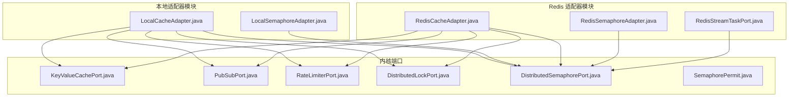
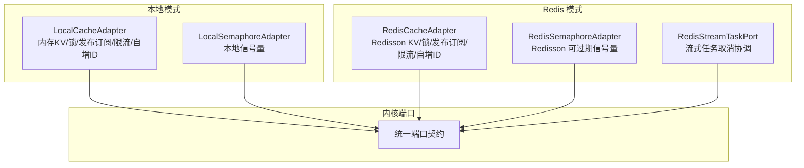
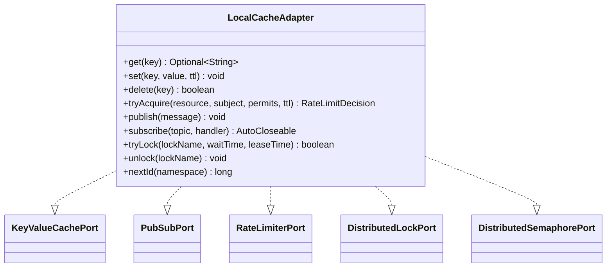
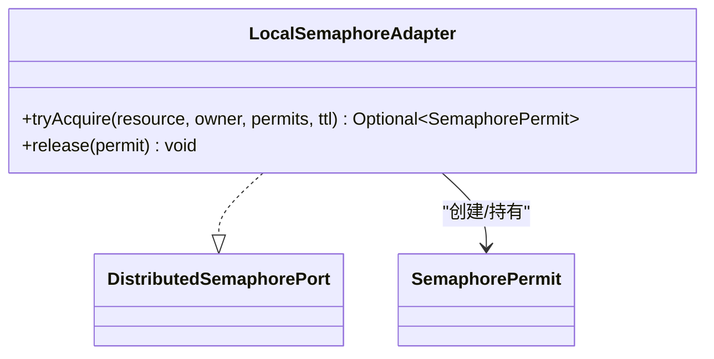
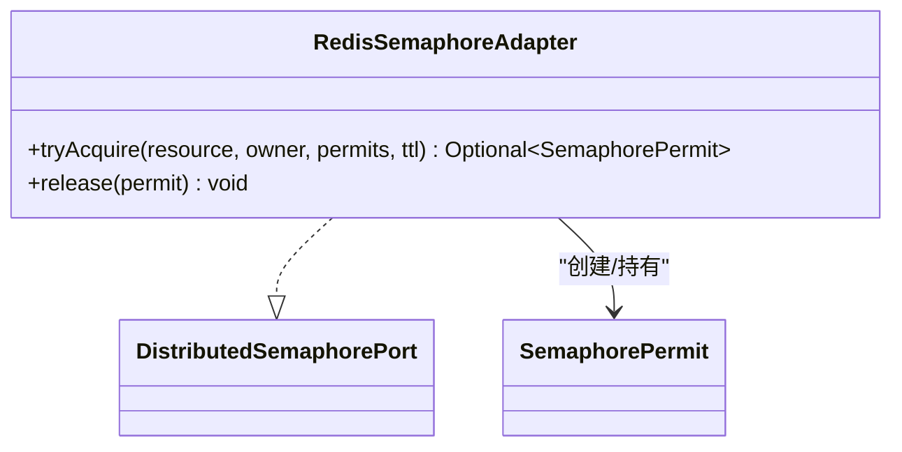
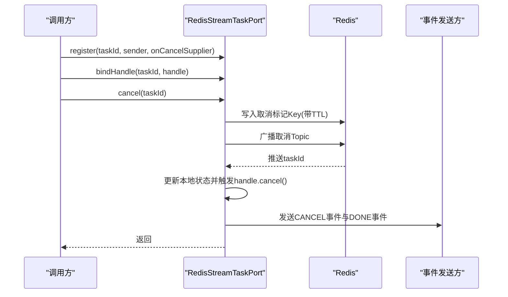
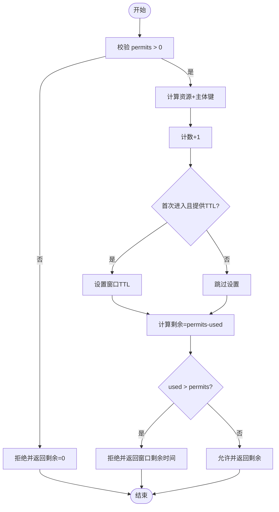
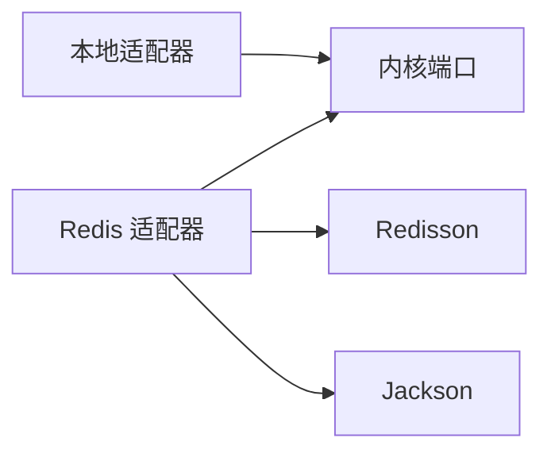

# 缓存适配器

<cite>
**本文引用的文件**
- [LocalCacheAdapter.java](file://seahorse-agent-adapter-cache-local/src/main/java/com/miracle/ai/seahorse/agent/adapters/cache/local/LocalCacheAdapter.java)
- [LocalSemaphoreAdapter.java](file://seahorse-agent-adapter-cache-local/src/main/java/com/miracle/ai/seahorse/agent/adapters/cache/local/LocalSemaphoreAdapter.java)
- [RedisCacheAdapter.java](file://seahorse-agent-adapter-cache-redis/src/main/java/com/miracle/ai/seahorse/agent/adapters/cache/redis/RedisCacheAdapter.java)
- [RedisSemaphoreAdapter.java](file://seahorse-agent-adapter-cache-redis/src/main/java/com/miracle/ai/seahorse/agent/adapters/cache/redis/RedisSemaphoreAdapter.java)
- [RedisStreamTaskPort.java](file://seahorse-agent-adapter-cache-redis/src/main/java/com/miracle/ai/seahorse/agent/adapters/cache/redis/RedisStreamTaskPort.java)
- [KeyValueCachePort.java](file://seahorse-agent-kernel/src/main/java/com/miracle/ai/seahorse/agent/ports/outbound/cache/KeyValueCachePort.java)
- [PubSubPort.java](file://seahorse-agent-kernel/src/main/java/com/miracle/ai/seahorse/agent/ports/outbound/cache/PubSubPort.java)
- [PubSubMessage.java](file://seahorse-agent-kernel/src/main/java/com/miracle/ai/seahorse/agent/ports/outbound/cache/PubSubMessage.java)
- [RateLimiterPort.java](file://seahorse-agent-kernel/src/main/java/com/miracle/ai/seahorse/agent/ports/outbound/cache/RateLimiterPort.java)
- [DistributedLockPort.java](file://seahorse-agent-kernel/src/main/java/com/miracle/ai/seahorse/agent/ports/outbound/coordination/DistributedLockPort.java)
- [DistributedSemaphorePort.java](file://seahorse-agent-kernel/src/main/java/com/miracle/ai/seahorse/agent/ports/outbound/coordination/DistributedSemaphorePort.java)
- [SemaphorePermit.java](file://seahorse-agent-kernel/src/main/java/com/miracle/ai/seahorse/agent/ports/outbound/coordination/SemaphorePermit.java)
- [pom.xml（本地适配器）](file://seahorse-agent-adapter-cache-local/pom.xml)
- [pom.xml（Redis 适配器）](file://seahorse-agent-adapter-cache-redis/pom.xml)
</cite>

## 目录
1. [简介](#简介)
2. [项目结构](#项目结构)
3. [核心组件](#核心组件)
4. [架构总览](#架构总览)
5. [详细组件分析](#详细组件分析)
6. [依赖分析](#依赖分析)
7. [性能考虑](#性能考虑)
8. [故障排查指南](#故障排查指南)
9. [结论](#结论)
10. [附录](#附录)

## 简介
本文件面向“缓存适配器”的技术文档，系统阐述两类适配器：本地内存适配器与 Redis 适配器。内容涵盖：
- 缓存接口的统一抽象与实现边界
- 分布式锁与信号量的实现机制与差异
- 缓存配置要点、过期策略与内存管理
- 性能优化建议、故障转移方案与监控指标
- 不同环境下的适配器选型与一致性保障

## 项目结构
缓存适配器位于独立模块中，分别提供本地与 Redis 两种实现，均通过统一的端口接口对外暴露能力。

图示来源
- [LocalCacheAdapter.java:44-167](file://seahorse-agent-adapter-cache-local/src/main/java/com/miracle/ai/seahorse/agent/adapters/cache/local/LocalCacheAdapter.java#L44-L167)
- [LocalSemaphoreAdapter.java:33-66](file://seahorse-agent-adapter-cache-local/src/main/java/com/miracle/ai/seahorse/agent/adapters/cache/local/LocalSemaphoreAdapter.java#L33-L66)
- [RedisCacheAdapter.java:48-195](file://seahorse-agent-adapter-cache-redis/src/main/java/com/miracle/ai/seahorse/agent/adapters/cache/redis/RedisCacheAdapter.java#L48-L195)
- [RedisSemaphoreAdapter.java:41-161](file://seahorse-agent-adapter-cache-redis/src/main/java/com/miracle/ai/seahorse/agent/adapters/cache/redis/RedisSemaphoreAdapter.java#L41-L161)
- [RedisStreamTaskPort.java:41-179](file://seahorse-agent-adapter-cache-redis/src/main/java/com/miracle/ai/seahorse/agent/adapters/cache/redis/RedisStreamTaskPort.java#L41-L179)
- [KeyValueCachePort.java:26-33](file://seahorse-agent-kernel/src/main/java/com/miracle/ai/seahorse/agent/ports/outbound/cache/KeyValueCachePort.java#L26-L33)
- [PubSubPort.java:25-43](file://seahorse-agent-kernel/src/main/java/com/miracle/ai/seahorse/agent/ports/outbound/cache/PubSubPort.java#L25-L43)
- [RateLimiterPort.java:27-44](file://seahorse-agent-kernel/src/main/java/com/miracle/ai/seahorse/agent/ports/outbound/cache/RateLimiterPort.java#L27-L44)
- [DistributedLockPort.java:25-43](file://seahorse-agent-kernel/src/main/java/com/miracle/ai/seahorse/agent/ports/outbound/coordination/DistributedLockPort.java#L25-L43)
- [DistributedSemaphorePort.java:28-48](file://seahorse-agent-kernel/src/main/java/com/miracle/ai/seahorse/agent/ports/outbound/coordination/DistributedSemaphorePort.java#L28-L48)
- [SemaphorePermit.java:30-43](file://seahorse-agent-kernel/src/main/java/com/miracle/ai/seahorse/agent/ports/outbound/coordination/SemaphorePermit.java#L30-L43)

章节来源
- [pom.xml（本地适配器）:18-24](file://seahorse-agent-adapter-cache-local/pom.xml#L18-L24)
- [pom.xml（Redis 适配器）:18-32](file://seahorse-agent-adapter-cache-redis/pom.xml#L18-L32)

## 核心组件
- 统一缓存端口：提供键值读取、写入、删除能力，支持 TTL。
- 统一发布订阅端口：提供发布与订阅能力，支持自动关闭取消订阅。
- 统一限流端口：按资源+主体维度进行令牌计数与剩余计算，支持窗口 TTL。
- 分布式锁端口：提供 tryLock/unlock 能力。
- 分布式信号量端口：提供可过期许可申请与释放，携带 owner 与过期时间。

章节来源
- [KeyValueCachePort.java:26-33](file://seahorse-agent-kernel/src/main/java/com/miracle/ai/seahorse/agent/ports/outbound/cache/KeyValueCachePort.java#L26-L33)
- [PubSubPort.java:25-43](file://seahorse-agent-kernel/src/main/java/com/miracle/ai/seahorse/agent/ports/outbound/cache/PubSubPort.java#L25-L43)
- [RateLimiterPort.java:27-44](file://seahorse-agent-kernel/src/main/java/com/miracle/ai/seahorse/agent/ports/outbound/cache/RateLimiterPort.java#L27-L44)
- [DistributedLockPort.java:25-43](file://seahorse-agent-kernel/src/main/java/com/miracle/ai/seahorse/agent/ports/outbound/coordination/DistributedLockPort.java#L25-L43)
- [DistributedSemaphorePort.java:28-48](file://seahorse-agent-kernel/src/main/java/com/miracle/ai/seahorse/agent/ports/outbound/coordination/DistributedSemaphorePort.java#L28-L48)
- [SemaphorePermit.java:30-43](file://seahorse-agent-kernel/src/main/java/com/miracle/ai/seahorse/agent/ports/outbound/coordination/SemaphorePermit.java#L30-L43)

## 架构总览
两类适配器均实现相同的端口契约，从而在不改变上层调用的前提下，实现“本地内存”与“Redis 分布式”两种运行模式的无缝切换。

图示来源
- [LocalCacheAdapter.java:44-167](file://seahorse-agent-adapter-cache-local/src/main/java/com/miracle/ai/seahorse/agent/adapters/cache/local/LocalCacheAdapter.java#L44-L167)
- [LocalSemaphoreAdapter.java:33-66](file://seahorse-agent-adapter-cache-local/src/main/java/com/miracle/ai/seahorse/agent/adapters/cache/local/LocalSemaphoreAdapter.java#L33-L66)
- [RedisCacheAdapter.java:48-195](file://seahorse-agent-adapter-cache-redis/src/main/java/com/miracle/ai/seahorse/agent/adapters/cache/redis/RedisCacheAdapter.java#L48-L195)
- [RedisSemaphoreAdapter.java:41-161](file://seahorse-agent-adapter-cache-redis/src/main/java/com/miracle/ai/seahorse/agent/adapters/cache/redis/RedisSemaphoreAdapter.java#L41-L161)
- [RedisStreamTaskPort.java:41-179](file://seahorse-agent-adapter-cache-redis/src/main/java/com/miracle/ai/seahorse/agent/adapters/cache/redis/RedisStreamTaskPort.java#L41-L179)

## 详细组件分析

### 本地缓存适配器（LocalCacheAdapter）
- 实现能力
  - 键值缓存：get/set/delete，带过期判断与清理
  - 限流：基于原子计数器与窗口 TTL 的令牌桶式限流
  - 发布订阅：内存级订阅列表，同步回调处理
  - 分布式锁：基于集合的本地互斥（单 JVM 可用）
  - ID 生成：按命名空间自增
- 关键设计
  - 使用并发容器保证线程安全
  - 过期采用“惰性检查”，读取时判断过期并清理
  - 订阅采用复制数组以支持并发遍历与安全移除
  - 锁采用集合去重，tryLock 返回布尔值表示是否获得
- 复杂度与性能
  - 读写为 O(1)，订阅遍历为 O(n)（n 为订阅者数量）
  - 适合单机或单实例场景，多实例间不可见

图示来源
- [LocalCacheAdapter.java:44-167](file://seahorse-agent-adapter-cache-local/src/main/java/com/miracle/ai/seahorse/agent/adapters/cache/local/LocalCacheAdapter.java#L44-L167)
- [KeyValueCachePort.java:26-33](file://seahorse-agent-kernel/src/main/java/com/miracle/ai/seahorse/agent/ports/outbound/cache/KeyValueCachePort.java#L26-L33)
- [PubSubPort.java:25-43](file://seahorse-agent-kernel/src/main/java/com/miracle/ai/seahorse/agent/ports/outbound/cache/PubSubPort.java#L25-L43)
- [RateLimiterPort.java:27-44](file://seahorse-agent-kernel/src/main/java/com/miracle/ai/seahorse/agent/ports/outbound/cache/RateLimiterPort.java#L27-L44)
- [DistributedLockPort.java:25-43](file://seahorse-agent-kernel/src/main/java/com/miracle/ai/seahorse/agent/ports/outbound/coordination/DistributedLockPort.java#L25-L43)
- [DistributedSemaphorePort.java:28-48](file://seahorse-agent-kernel/src/main/java/com/miracle/ai/seahorse/agent/ports/outbound/coordination/DistributedSemaphorePort.java#L28-L48)

章节来源
- [LocalCacheAdapter.java:44-167](file://seahorse-agent-adapter-cache-local/src/main/java/com/miracle/ai/seahorse/agent/adapters/cache/local/LocalCacheAdapter.java#L44-L167)

### 本地信号量适配器（LocalSemaphoreAdapter）
- 实现能力
  - 本地信号量：尝试获取指定数量许可；释放不做实际操作
  - 默认不限制总量，仅提供“本地可用”的占位实现
- 设计要点
  - 通过记录许可对象与过期时间，便于上层流程使用
  - 适合仅依赖信号量端口但无需跨节点同步的场景

图示来源
- [LocalSemaphoreAdapter.java:33-66](file://seahorse-agent-adapter-cache-local/src/main/java/com/miracle/ai/seahorse/agent/adapters/cache/local/LocalSemaphoreAdapter.java#L33-L66)
- [DistributedSemaphorePort.java:28-48](file://seahorse-agent-kernel/src/main/java/com/miracle/ai/seahorse/agent/ports/outbound/coordination/DistributedSemaphorePort.java#L28-L48)
- [SemaphorePermit.java:30-43](file://seahorse-agent-kernel/src/main/java/com/miracle/ai/seahorse/agent/ports/outbound/coordination/SemaphorePermit.java#L30-L43)

章节来源
- [LocalSemaphoreAdapter.java:33-66](file://seahorse-agent-adapter-cache-local/src/main/java/com/miracle/ai/seahorse/agent/adapters/cache/local/LocalSemaphoreAdapter.java#L33-L66)

### Redis 缓存适配器（RedisCacheAdapter）
- 实现能力
  - 键值缓存：基于 Redisson 的 RBucket，支持 TTL 设置与删除
  - 限流：基于 RAtomicLong 的自增计数，首次进入设置窗口 TTL
  - 发布订阅：基于 RTopic，序列化/反序列化消息
  - 分布式锁：基于 RLock，支持等待时间与租约时间
  - ID 生成：基于 RAtomicLong 自增
- 关键设计
  - 统一键前缀，避免命名冲突
  - TTL 为负或空时，不设置过期（持久）
  - 订阅使用 Redisson 的监听器 ID，支持移除
  - 锁释放仅对当前线程持有的锁有效

图示来源
- [RedisCacheAdapter.java:48-195](file://seahorse-agent-adapter-cache-redis/src/main/java/com/miracle/ai/seahorse/agent/adapters/cache/redis/RedisCacheAdapter.java#L48-L195)
- [KeyValueCachePort.java:26-33](file://seahorse-agent-kernel/src/main/java/com/miracle/ai/seahorse/agent/ports/outbound/cache/KeyValueCachePort.java#L26-L33)
- [PubSubPort.java:25-43](file://seahorse-agent-kernel/src/main/java/com/miracle/ai/seahorse/agent/ports/outbound/cache/PubSubPort.java#L25-L43)
- [RateLimiterPort.java:27-44](file://seahorse-agent-kernel/src/main/java/com/miracle/ai/seahorse/agent/ports/outbound/cache/RateLimiterPort.java#L27-L44)
- [DistributedLockPort.java:25-43](file://seahorse-agent-kernel/src/main/java/com/miracle/ai/seahorse/agent/ports/outbound/coordination/DistributedLockPort.java#L25-L43)
- [DistributedSemaphorePort.java:28-48](file://seahorse-agent-kernel/src/main/java/com/miracle/ai/seahorse/agent/ports/outbound/coordination/DistributedSemaphorePort.java#L28-L48)

章节来源
- [RedisCacheAdapter.java:48-195](file://seahorse-agent-adapter-cache-redis/src/main/java/com/miracle/ai/seahorse/agent/adapters/cache/redis/RedisCacheAdapter.java#L48-L195)

### Redis 信号量适配器（RedisSemaphoreAdapter）
- 实现能力
  - 使用 Redisson 的可过期信号量，支持为每个许可分配唯一 ID
  - 通过临时存储许可 ID 列表，确保 release 阶段能精确释放对应许可
- 关键设计
  - 首次获取时将资源许可数提升至最大值，避免阻塞
  - 许可 ID 列表随许可对象过期时间写入 Redis，便于后续释放
  - 异常中断时回滚已获取的许可 ID

图示来源
- [RedisSemaphoreAdapter.java:41-161](file://seahorse-agent-adapter-cache-redis/src/main/java/com/miracle/ai/seahorse/agent/adapters/cache/redis/RedisSemaphoreAdapter.java#L41-L161)
- [DistributedSemaphorePort.java:28-48](file://seahorse-agent-kernel/src/main/java/com/miracle/ai/seahorse/agent/ports/outbound/coordination/DistributedSemaphorePort.java#L28-L48)
- [SemaphorePermit.java:30-43](file://seahorse-agent-kernel/src/main/java/com/miracle/ai/seahorse/agent/ports/outbound/coordination/SemaphorePermit.java#L30-L43)

章节来源
- [RedisSemaphoreAdapter.java:41-161](file://seahorse-agent-adapter-cache-redis/src/main/java/com/miracle/ai/seahorse/agent/adapters/cache/redis/RedisSemaphoreAdapter.java#L41-L161)

### Redis 流式任务协调端口（RedisStreamTaskPort）
- 实现能力
  - 注册/绑定/查询/取消流式任务，支持跨节点广播取消
  - 本地维护任务状态，同时通过 Redis Key 与 Topic 协调远端状态
- 关键设计
  - 使用专用 Key 前缀与 Topic 名称，避免冲突
  - 取消 TTL 控制取消标记的存活时间
  - 本地状态与远端状态一致化：收到取消广播后更新本地并通知发送方完成事件

图示来源
- [RedisStreamTaskPort.java:41-179](file://seahorse-agent-adapter-cache-redis/src/main/java/com/miracle/ai/seahorse/agent/adapters/cache/redis/RedisStreamTaskPort.java#L41-L179)

章节来源
- [RedisStreamTaskPort.java:41-179](file://seahorse-agent-adapter-cache-redis/src/main/java/com/miracle/ai/seahorse/agent/adapters/cache/redis/RedisStreamTaskPort.java#L41-L179)

### 限流算法流程（本地与 Redis）

图示来源
- [LocalCacheAdapter.java:77-98](file://seahorse-agent-adapter-cache-local/src/main/java/com/miracle/ai/seahorse/agent/adapters/cache/local/LocalCacheAdapter.java#L77-L98)
- [RedisCacheAdapter.java:88-103](file://seahorse-agent-adapter-cache-redis/src/main/java/com/miracle/ai/seahorse/agent/adapters/cache/redis/RedisCacheAdapter.java#L88-L103)

## 依赖分析
- 本地适配器
  - 仅依赖内核端口，无外部中间件依赖，适合本地开发与单实例部署
- Redis 适配器
  - 依赖 Redisson 与 Jackson，用于序列化与分布式原语
  - 提供跨节点的缓存、锁、发布订阅与信号量能力

图示来源
- [pom.xml（本地适配器）:18-24](file://seahorse-agent-adapter-cache-local/pom.xml#L18-L24)
- [pom.xml（Redis 适配器）:18-32](file://seahorse-agent-adapter-cache-redis/pom.xml#L18-L32)

章节来源
- [pom.xml（本地适配器）:18-24](file://seahorse-agent-adapter-cache-local/pom.xml#L18-L24)
- [pom.xml（Redis 适配器）:18-32](file://seahorse-agent-adapter-cache-redis/pom.xml#L18-L32)

## 性能考虑
- 本地适配器
  - 读写为 O(1)，订阅遍历成本与订阅者数量线性相关
  - 适合低延迟、单实例场景；多实例需切换 Redis 适配器
- Redis 适配器
  - 网络往返决定延迟，建议批量/合并请求减少 RTT
  - TTL 设置合理，避免过多过期键导致内存压力
  - 发布订阅使用 Redisson 监听器，注意订阅数量与内存占用
  - 信号量许可 ID 存储与释放需关注键数量与过期策略
- 通用建议
  - 对热点键设置合理 TTL，避免无限增长
  - 限流窗口大小与 QPS 匹配，避免频繁过期重置
  - 使用连接池与合适的超时参数，避免阻塞

## 故障排查指南
- 常见问题
  - 订阅未生效：确认 subscribe 返回的 AutoCloseable 已正确持有并在不再需要时关闭
  - 限流误判：检查 permits 是否为正数，TTL 是否正确传入
  - 锁无法释放：确认 unlock 调用与 tryLock 对应，且当前线程持有
  - 信号量释放失败：确认许可对象 owner/resource/permits 正确，且未过期
- 诊断步骤
  - 核查端口实现是否被正确注册到端口注册表
  - 检查 Redis 连接状态与网络延迟
  - 观察键空间与订阅数量，避免过度膨胀
  - 对于流式任务取消，确认 Topic 与 Key 前缀未被其他模块污染

章节来源
- [LocalCacheAdapter.java:100-137](file://seahorse-agent-adapter-cache-local/src/main/java/com/miracle/ai/seahorse/agent/adapters/cache/local/LocalCacheAdapter.java#L100-L137)
- [RedisCacheAdapter.java:105-139](file://seahorse-agent-adapter-cache-redis/src/main/java/com/miracle/ai/seahorse/agent/adapters/cache/redis/RedisCacheAdapter.java#L105-L139)
- [RedisSemaphoreAdapter.java:64-74](file://seahorse-agent-adapter-cache-redis/src/main/java/com/miracle/ai/seahorse/agent/adapters/cache/redis/RedisSemaphoreAdapter.java#L64-L74)

## 结论
- 本地适配器提供轻量、低延迟的单机能力，适合开发与单实例部署
- Redis 适配器提供跨节点的一致性与高可用，适合生产环境
- 通过统一端口抽象，可在不修改上层逻辑的情况下切换适配器
- 建议根据部署规模与一致性需求选择适配器，并结合 TTL、窗口大小与监控指标持续优化

## 附录

### 缓存配置选项与过期策略
- TTL 语义
  - 为空或非正值：不过期（持久）
  - 为正值：按毫秒设置过期
- 键前缀
  - 本地：内部使用命名空间前缀
  - Redis：统一前缀区分 cache/lock/pubsub/ratelimit/id/semaphore/stream
- 序列化
  - 发布订阅消息使用 JSON 序列化，异常时抛出非法参数异常

章节来源
- [LocalCacheAdapter.java:139-151](file://seahorse-agent-adapter-cache-local/src/main/java/com/miracle/ai/seahorse/agent/adapters/cache/local/LocalCacheAdapter.java#L139-L151)
- [RedisCacheAdapter.java:51-57](file://seahorse-agent-adapter-cache-redis/src/main/java/com/miracle/ai/seahorse/agent/adapters/cache/redis/RedisCacheAdapter.java#L51-L57)
- [RedisCacheAdapter.java:145-159](file://seahorse-agent-adapter-cache-redis/src/main/java/com/miracle/ai/seahorse/agent/adapters/cache/redis/RedisCacheAdapter.java#L145-L159)

### 分布式锁与信号量实现对比
- 分布式锁
  - 本地：基于集合的互斥（单 JVM），适合本地开发
  - Redis：基于 RLock，支持等待与租约，跨节点有效
- 信号量
  - 本地：默认不限总量，仅提供许可对象
  - Redis：基于可过期信号量，许可 ID 持久化，支持精确释放

章节来源
- [LocalCacheAdapter.java:118-125](file://seahorse-agent-adapter-cache-local/src/main/java/com/miracle/ai/seahorse/agent/adapters/cache/local/LocalCacheAdapter.java#L118-L125)
- [RedisCacheAdapter.java:122-138](file://seahorse-agent-adapter-cache-redis/src/main/java/com/miracle/ai/seahorse/agent/adapters/cache/redis/RedisCacheAdapter.java#L122-L138)
- [LocalSemaphoreAdapter.java:36-51](file://seahorse-agent-adapter-cache-local/src/main/java/com/miracle/ai/seahorse/agent/adapters/cache/local/LocalSemaphoreAdapter.java#L36-L51)
- [RedisSemaphoreAdapter.java:54-74](file://seahorse-agent-adapter-cache-redis/src/main/java/com/miracle/ai/seahorse/agent/adapters/cache/redis/RedisSemaphoreAdapter.java#L54-L74)

### 环境选型与一致性保障
- 本地适配器
  - 适用：单机开发、单实例部署
  - 一致性：仅 JVM 内可见，多实例间不共享
- Redis 适配器
  - 适用：多实例、集群、云原生部署
  - 一致性：基于 Redis 的原子操作与发布订阅，跨节点一致
- 一致性建议
  - 优先使用 Redis 适配器保证多实例一致性
  - 对于强一致场景，结合业务补偿与幂等设计

### 监控指标建议
- 缓存命中率与未命中率
- 限流拒绝率与窗口剩余时间分布
- 订阅者数量与消息处理延迟
- Redisson 连接池使用情况与命令耗时
- 信号量许可获取/释放成功率与平均耗时