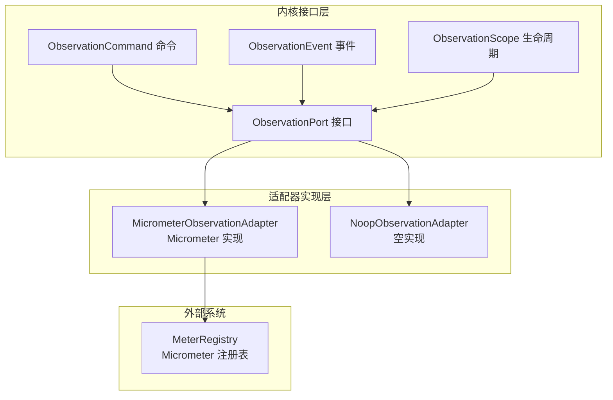
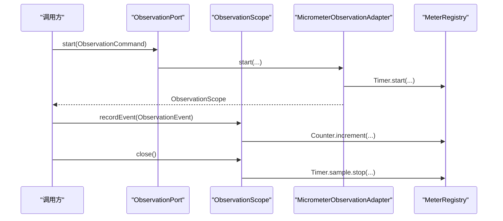
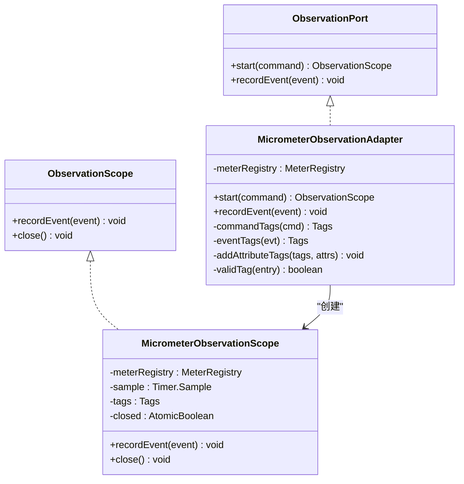
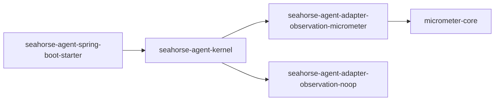

# 观测性适配器

<cite>
**本文引用的文件**
- [MicrometerObservationAdapter.java](file://seahorse-agent-adapter-observation-micrometer/src/main/java/com/miracle/ai/seahorse/agent/adapters/observation/micrometer/MicrometerObservationAdapter.java)
- [NoopObservationAdapter.java](file://seahorse-agent-adapter-observation-noop/src/main/java/com/miracle/ai/seahorse/agent/adapters/observation/noop/NoopObservationAdapter.java)
- [ObservationPort.java](file://seahorse-agent-kernel/src/main/java/com/miracle/ai/seahorse/agent/ports/outbound/observation/ObservationPort.java)
- [ObservationCommand.java](file://seahorse-agent-kernel/src/main/java/com/miracle/ai/seahorse/agent/ports/outbound/observation/ObservationCommand.java)
- [ObservationEvent.java](file://seahorse-agent-kernel/src/main/java/com/miracle/ai/seahorse/agent/ports/outbound/observation/ObservationEvent.java)
- [ObservationScope.java](file://seahorse-agent-kernel/src/main/java/com/miracle/ai/seahorse/agent/ports/outbound/observation/ObservationScope.java)
- [ObservationPortWrapper.java](file://seahorse-agent-kernel/src/main/java/com/miracle/ai/seahorse/agent/kernel/plugin/wrapper/ObservationPortWrapper.java)
- [application.properties](file://seahorse-agent-spring-boot-starter/src/main/resources/application.properties)
- [pom.xml（Micrometer 观测适配器）](file://seahorse-agent-adapter-observation-micrometer/pom.xml)
</cite>

## 目录
1. [引言](#引言)
2. [项目结构](#项目结构)
3. [核心组件](#核心组件)
4. [架构总览](#架构总览)
5. [组件详解](#组件详解)
6. [依赖关系分析](#依赖关系分析)
7. [性能考量](#性能考量)
8. [故障排查指南](#故障排查指南)
9. [结论](#结论)
10. [附录](#附录)

## 引言
本文件面向“观测性适配器”的技术文档，聚焦于 Micrometer 观测性适配器与空实现（Noop）观测性适配器的设计与实现。内容涵盖指标采集、性能监控、可观测性数据上报机制；监控指标的分类、标签管理与聚合策略；观测性配置参数、采样策略与数据导出方法；以及与告警、日志关联和分布式追踪的集成思路。同时给出在不同环境下的适配器选择建议与性能优化策略。

## 项目结构
观测性适配器位于独立模块中，通过 SPI 接口与内核解耦，支持在任意运行时注入 MeterRegistry 进行 Micrometer 指标上报，并提供空实现用于无观测场景或测试环境。

图示来源
- [ObservationPort.java:25-42](file://seahorse-agent-kernel/src/main/java/com/miracle/ai/seahorse/agent/ports/outbound/observation/ObservationPort.java#L25-L42)
- [MicrometerObservationAdapter.java:42-137](file://seahorse-agent-adapter-observation-micrometer/src/main/java/com/miracle/ai/seahorse/agent/adapters/observation/micrometer/MicrometerObservationAdapter.java#L42-L137)
- [NoopObservationAdapter.java:28-55](file://seahorse-agent-adapter-observation-noop/src/main/java/com/miracle/ai/seahorse/agent/adapters/observation/noop/NoopObservationAdapter.java#L28-L55)

章节来源
- [ObservationPort.java:25-42](file://seahorse-agent-kernel/src/main/java/com/miracle/ai/seahorse/agent/ports/outbound/observation/ObservationPort.java#L25-L42)
- [MicrometerObservationAdapter.java:42-137](file://seahorse-agent-adapter-observation-micrometer/src/main/java/com/miracle/ai/seahorse/agent/adapters/observation/micrometer/MicrometerObservationAdapter.java#L42-L137)
- [NoopObservationAdapter.java:28-55](file://seahorse-agent-adapter-observation-noop/src/main/java/com/miracle/ai/seahorse/agent/adapters/observation/noop/NoopObservationAdapter.java#L28-L55)

## 核心组件
- 观测端口接口：定义观测生命周期与事件记录能力，作为统一抽象。
- 观测命令与事件：封装观测上下文（名称、租户、属性）与事件元信息（名称、发生时间、属性）。
- Micrometer 适配器：将观测命令与事件映射到 Micrometer 的计数器与计时器，支持标签化与聚合。
- Noop 适配器：空实现，不产生任何副作用，适合禁用观测或测试场景。
- 观测包装器：固定观测适配器在插件包装链中的顺序位置，确保被正确加载。

章节来源
- [ObservationPort.java:25-42](file://seahorse-agent-kernel/src/main/java/com/miracle/ai/seahorse/agent/ports/outbound/observation/ObservationPort.java#L25-L42)
- [ObservationCommand.java:30-39](file://seahorse-agent-kernel/src/main/java/com/miracle/ai/seahorse/agent/ports/outbound/observation/ObservationCommand.java#L30-L39)
- [ObservationEvent.java:31-41](file://seahorse-agent-kernel/src/main/java/com/miracle/ai/seahorse/agent/ports/outbound/observation/ObservationEvent.java#L31-L41)
- [ObservationScope.java:23-35](file://seahorse-agent-kernel/src/main/java/com/miracle/ai/seahorse/agent/ports/outbound/observation/ObservationScope.java#L23-L35)
- [MicrometerObservationAdapter.java:42-137](file://seahorse-agent-adapter-observation-micrometer/src/main/java/com/miracle/ai/seahorse/agent/adapters/observation/micrometer/MicrometerObservationAdapter.java#L42-L137)
- [NoopObservationAdapter.java:28-55](file://seahorse-agent-adapter-observation-noop/src/main/java/com/miracle/ai/seahorse/agent/adapters/observation/noop/NoopObservationAdapter.java#L28-L55)
- [ObservationPortWrapper.java:27-43](file://seahorse-agent-kernel/src/main/java/com/miracle/ai/seahorse/agent/kernel/plugin/wrapper/ObservationPortWrapper.java#L27-L43)

## 架构总览
观测适配器采用“接口 + SPI + 可插拔实现”的架构设计，内核仅依赖抽象接口，运行时通过依赖注入或自动装配选择具体实现。Micrometer 适配器直接对接 Micrometer 注册表，生成两类核心指标：持续时间（Timer）与事件计数（Counter），并以标签进行维度化聚合。

图示来源
- [ObservationPort.java:34-41](file://seahorse-agent-kernel/src/main/java/com/miracle/ai/seahorse/agent/ports/outbound/observation/ObservationPort.java#L34-L41)
- [ObservationScope.java:30-34](file://seahorse-agent-kernel/src/main/java/com/miracle/ai/seahorse/agent/ports/outbound/observation/ObservationScope.java#L30-L34)
- [MicrometerObservationAdapter.java:56-134](file://seahorse-agent-adapter-observation-micrometer/src/main/java/com/miracle/ai/seahorse/agent/adapters/observation/micrometer/MicrometerObservationAdapter.java#L56-L134)

## 组件详解

### Micrometer 观测适配器
- 设计要点
  - 不依赖 Spring Boot 自动配置，通过构造函数注入 MeterRegistry 即可工作。
  - 将观测命令映射为计时器采样，将事件映射为计数器增量。
  - 使用标签对观测维度进行聚合，包括观测名、租户、自定义属性等。
  - 作用域关闭时才停止计时器，避免重复关闭与竞态。

- 指标与标签
  - 持续时间指标：基于 Timer.builder(...)，标签包含 observation、tenant 与 attributes 中的有效键值。
  - 事件指标：基于 Counter.builder(...)，标签包含 event 与 attributes 中的有效键值。
  - 属性校验：仅接受非空键且值非空的属性作为标签，防止无效标签污染。

- 生命周期与并发
  - 作用域内部使用原子布尔标记避免重复关闭。
  - 事件记录在作用域内时，会合并作用域标签与事件标签，保证维度一致性。

- 关键路径参考
  - 启动观测与构建标签：[MicrometerObservationAdapter.java:56-88](file://seahorse-agent-adapter-observation-micrometer/src/main/java/com/miracle/ai/seahorse/agent/adapters/observation/micrometer/MicrometerObservationAdapter.java#L56-L88)
  - 事件记录与标签合并：[MicrometerObservationAdapter.java:117-124](file://seahorse-agent-adapter-observation-micrometer/src/main/java/com/miracle/ai/seahorse/agent/adapters/observation/micrometer/MicrometerObservationAdapter.java#L117-L124)
  - 作用域关闭与计时器停止：[MicrometerObservationAdapter.java:126-134](file://seahorse-agent-adapter-observation-micrometer/src/main/java/com/miracle/ai/seahorse/agent/adapters/observation/micrometer/MicrometerObservationAdapter.java#L126-L134)

图示来源
- [ObservationPort.java:25-42](file://seahorse-agent-kernel/src/main/java/com/miracle/ai/seahorse/agent/ports/outbound/observation/ObservationPort.java#L25-L42)
- [ObservationScope.java:23-35](file://seahorse-agent-kernel/src/main/java/com/miracle/ai/seahorse/agent/ports/outbound/observation/ObservationScope.java#L23-L35)
- [MicrometerObservationAdapter.java:42-137](file://seahorse-agent-adapter-observation-micrometer/src/main/java/com/miracle/ai/seahorse/agent/adapters/observation/micrometer/MicrometerObservationAdapter.java#L42-L137)

章节来源
- [MicrometerObservationAdapter.java:42-137](file://seahorse-agent-adapter-observation-micrometer/src/main/java/com/miracle/ai/seahorse/agent/adapters/observation/micrometer/MicrometerObservationAdapter.java#L42-L137)

### 空实现观测适配器
- 设计要点
  - 返回共享的空作用域实例，所有操作均为无操作（no-op）。
  - 适用于禁用观测或在测试环境中屏蔽观测开销。

- 关键路径参考
  - 返回空作用域与空事件处理：[NoopObservationAdapter.java:32-53](file://seahorse-agent-adapter-observation-noop/src/main/java/com/miracle/ai/seahorse/agent/adapters/observation/noop/NoopObservationAdapter.java#L32-L53)

章节来源
- [NoopObservationAdapter.java:28-55](file://seahorse-agent-adapter-observation-noop/src/main/java/com/miracle/ai/seahorse/agent/adapters/observation/noop/NoopObservationAdapter.java#L28-L55)

### 观测命令与事件模型
- 命令模型
  - 包含观测名称、租户 ID、属性映射；构造时对名称进行校验，对租户与属性做空值保护。
- 事件模型
  - 包含事件名称、发生时间、属性映射；构造时对名称进行校验，默认时间戳为当前时间。

- 关键路径参考
  - 命令模型与校验：[ObservationCommand.java:30-39](file://seahorse-agent-kernel/src/main/java/com/miracle/ai/seahorse/agent/ports/outbound/observation/ObservationCommand.java#L30-L39)
  - 事件模型与校验：[ObservationEvent.java:31-41](file://seahorse-agent-kernel/src/main/java/com/miracle/ai/seahorse/agent/ports/outbound/observation/ObservationEvent.java#L31-L41)

章节来源
- [ObservationCommand.java:30-39](file://seahorse-agent-kernel/src/main/java/com/miracle/ai/seahorse/agent/ports/outbound/observation/ObservationCommand.java#L30-L39)
- [ObservationEvent.java:31-41](file://seahorse-agent-kernel/src/main/java/com/miracle/ai/seahorse/agent/ports/outbound/observation/ObservationEvent.java#L31-L41)

### 观测包装器与加载顺序
- 包装器职责
  - 固定观测适配器在插件包装链中的顺序，确保在正确的阶段被加载与使用。
- 默认实现
  - 观测端口注解声明默认实现名为 noop，便于在未显式装配时启用空实现。

- 关键路径参考
  - 包装器顺序与名称：[ObservationPortWrapper.java:27-43](file://seahorse-agent-kernel/src/main/java/com/miracle/ai/seahorse/agent/kernel/plugin/wrapper/ObservationPortWrapper.java#L27-L43)
  - 端口默认实现注解：[ObservationPort.java:25-26](file://seahorse-agent-kernel/src/main/java/com/miracle/ai/seahorse/agent/ports/outbound/observation/ObservationPort.java#L25-L26)

章节来源
- [ObservationPortWrapper.java:27-43](file://seahorse-agent-kernel/src/main/java/com/miracle/ai/seahorse/agent/kernel/plugin/wrapper/ObservationPortWrapper.java#L27-L43)
- [ObservationPort.java:25-26](file://seahorse-agent-kernel/src/main/java/com/miracle/ai/seahorse/agent/ports/outbound/observation/ObservationPort.java#L25-L26)

## 依赖关系分析
- 适配器与内核
  - Micrometer 适配器依赖内核的观测接口与命令/事件模型。
  - Noop 适配器同样依赖内核接口，但不引入外部依赖。
- 外部依赖
  - Micrometer 适配器依赖 micrometer-core，用于计时器与计数器的创建与注册。
- 配置与运行
  - 通过 application.properties 设置内核运行模式，适配器本身不依赖 Spring Boot 自动装配。

图示来源
- [pom.xml（Micrometer 观测适配器）:18-28](file://seahorse-agent-adapter-observation-micrometer/pom.xml#L18-L28)
- [application.properties:1-2](file://seahorse-agent-spring-boot-starter/src/main/resources/application.properties#L1-L2)

章节来源
- [pom.xml（Micrometer 观测适配器）:18-28](file://seahorse-agent-adapter-observation-micrometer/pom.xml#L18-L28)
- [application.properties:1-2](file://seahorse-agent-spring-boot-starter/src/main/resources/application.properties#L1-L2)

## 性能考量
- 指标开销
  - Micrometer 适配器在 start/close 时创建/停止计时器，在 recordEvent 时进行计数器增量，属于轻量级操作。
  - 标签数量与键值长度会影响注册表的内存占用与查询效率，应控制标签基数。
- 并发与线程安全
  - 作用域内部使用原子布尔避免重复关闭，减少竞态风险。
- 采样与聚合
  - Micrometer 支持多种聚合方式（直方图、摘要等），可通过注册表配置进行调优。
- 环境选择
  - 生产环境优先使用 Micrometer 适配器并接入集中式监控系统。
  - 测试或开发环境可使用 Noop 适配器降低开销。

## 故障排查指南
- 常见问题
  - 观测指标缺失：确认是否正确注入 MeterRegistry，以及是否选择了正确的适配器实现。
  - 标签异常：检查属性键值是否为空，Micrometer 适配器会过滤无效标签。
  - 作用域未关闭：确保在生命周期结束时调用 close，否则计时器不会停止。
- 定位步骤
  - 检查端口默认实现与包装器顺序，确保适配器被正确加载。
  - 在 Micrometer 侧验证指标名称与标签是否符合预期。
- 相关路径参考
  - 适配器默认实现与包装器顺序：[ObservationPort.java:25-26](file://seahorse-agent-kernel/src/main/java/com/miracle/ai/seahorse/agent/ports/outbound/observation/ObservationPort.java#L25-L26), [ObservationPortWrapper.java:27-43](file://seahorse-agent-kernel/src/main/java/com/miracle/ai/seahorse/agent/kernel/plugin/wrapper/ObservationPortWrapper.java#L27-L43)
  - 标签有效性与过滤：[MicrometerObservationAdapter.java:98-102](file://seahorse-agent-adapter-observation-micrometer/src/main/java/com/miracle/ai/seahorse/agent/adapters/observation/micrometer/MicrometerObservationAdapter.java#L98-L102)

章节来源
- [ObservationPort.java:25-26](file://seahorse-agent-kernel/src/main/java/com/miracle/ai/seahorse/agent/ports/outbound/observation/ObservationPort.java#L25-L26)
- [ObservationPortWrapper.java:27-43](file://seahorse-agent-kernel/src/main/java/com/miracle/ai/seahorse/agent/kernel/plugin/wrapper/ObservationPortWrapper.java#L27-L43)
- [MicrometerObservationAdapter.java:98-102](file://seahorse-agent-adapter-observation-micrometer/src/main/java/com/miracle/ai/seahorse/agent/adapters/observation/micrometer/MicrometerObservationAdapter.java#L98-L102)

## 结论
观测性适配器通过统一接口与可插拔实现，实现了与 Micrometer 的无缝对接与灵活切换。Micrometer 适配器提供高可用的指标采集与标签化聚合能力，Noop 适配器则满足禁用观测或测试场景的需求。结合合理的标签策略、采样配置与导出方法，可在不同环境下获得稳定、可扩展的可观测性支撑。

## 附录

### 指标与标签管理
- 指标类别
  - 持续时间：Timer，用于观测流程耗时分布与统计。
  - 事件计数：Counter，用于记录独立事件的发生频次。
- 标签维度
  - 必填维度：observation（观测名）、event（事件名）。
  - 可选维度：tenant（租户）、attributes（自定义键值）。
- 聚合策略
  - 通过标签组合形成多维聚合视图，支持按观测名、租户、业务属性等维度进行分组统计。

章节来源
- [MicrometerObservationAdapter.java:44-102](file://seahorse-agent-adapter-observation-micrometer/src/main/java/com/miracle/ai/seahorse/agent/adapters/observation/micrometer/MicrometerObservationAdapter.java#L44-L102)

### 配置参数与导出方法
- 配置参数
  - 内核运行模式：通过 application.properties 设置内核模式。
  - Micrometer 注册表：通过构造注入 MeterRegistry，无需 Spring Boot 自动装配。
- 导出方法
  - 将 MeterRegistry 与目标监控系统（如 Prometheus、InfluxDB、CloudWatch 等）集成，实现指标导出与可视化。

章节来源
- [application.properties:1-2](file://seahorse-agent-spring-boot-starter/src/main/resources/application.properties#L1-L2)
- [pom.xml（Micrometer 观测适配器）:18-28](file://seahorse-agent-adapter-observation-micrometer/pom.xml#L18-L28)

### 告警集成、日志关联与分布式追踪
- 告警集成
  - 基于指标阈值（如 p95/p99 延迟、错误率）设置告警规则，结合标签维度定位问题。
- 日志关联
  - 在日志中携带观测上下文（如 observation、tenant、attributes），便于日志与指标关联分析。
- 分布式追踪
  - 可在观测命令中注入 TraceId/SpanId 等上下文信息，结合分布式追踪系统（如 Jaeger、Zipkin）实现端到端链路观测。

[本节为概念性说明，不直接分析具体源码文件]