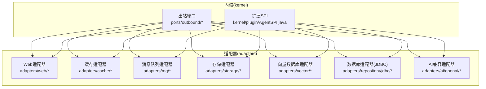
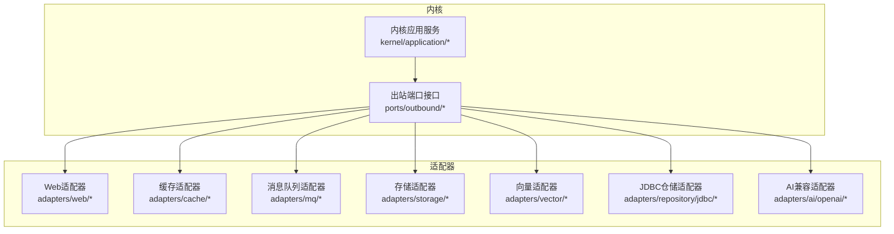
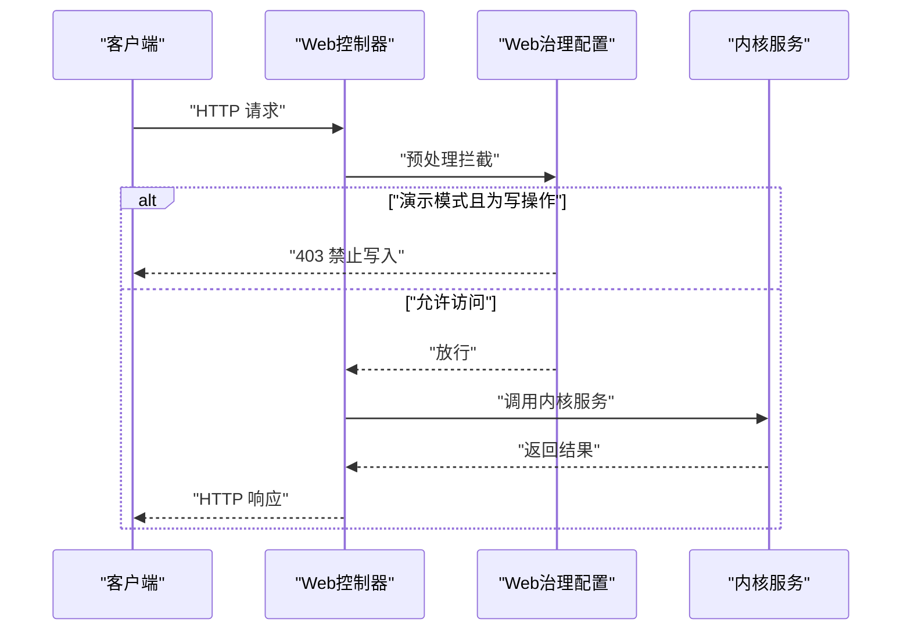
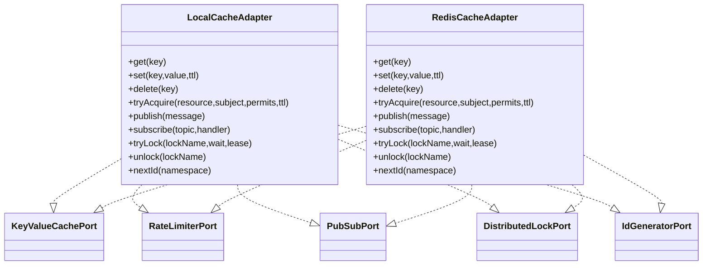
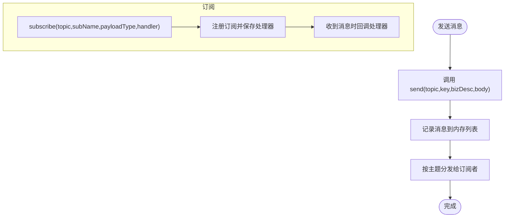
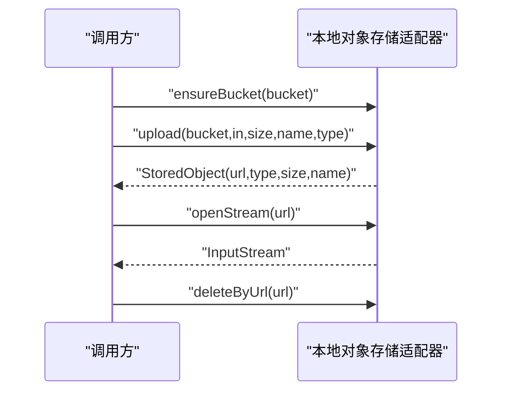
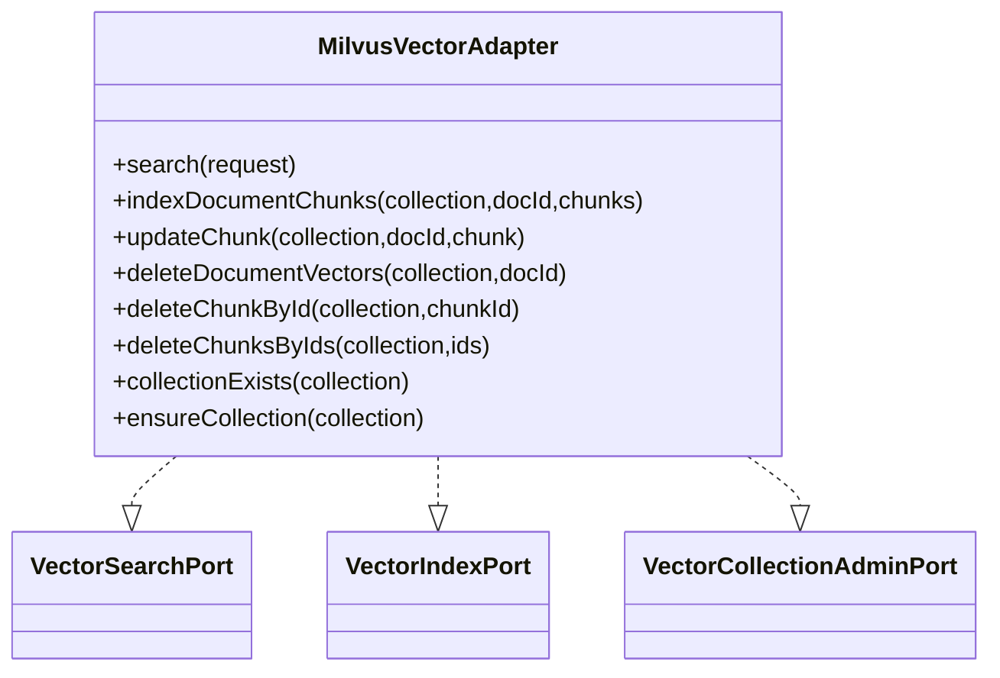
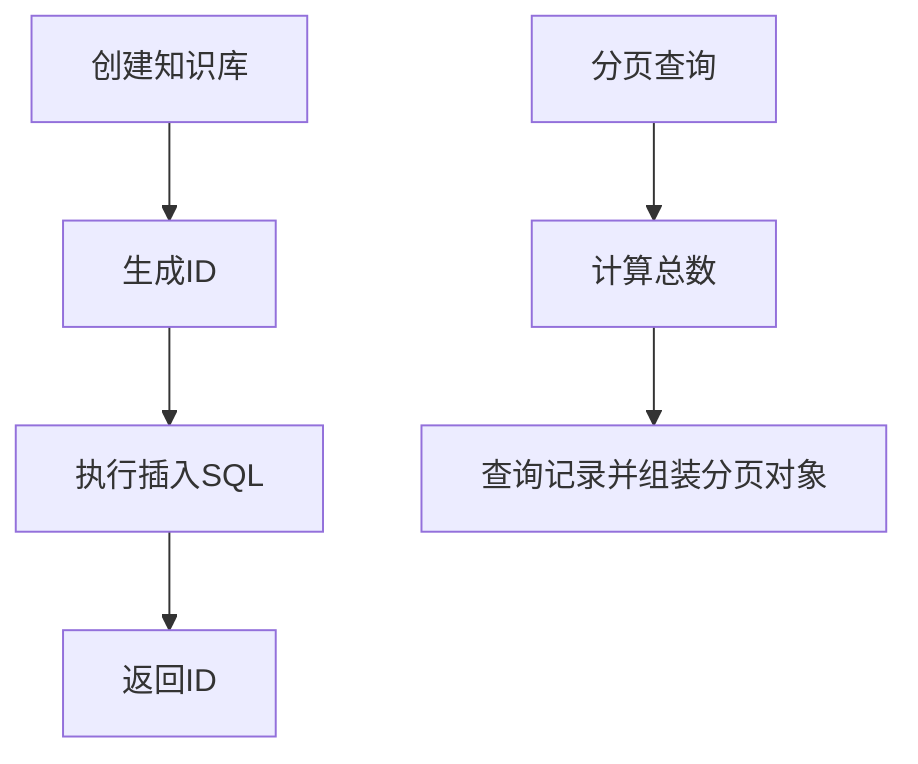
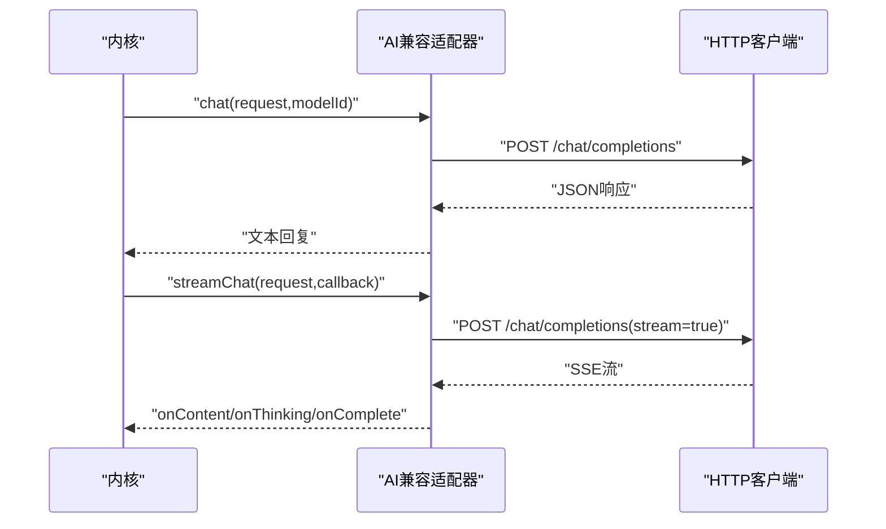
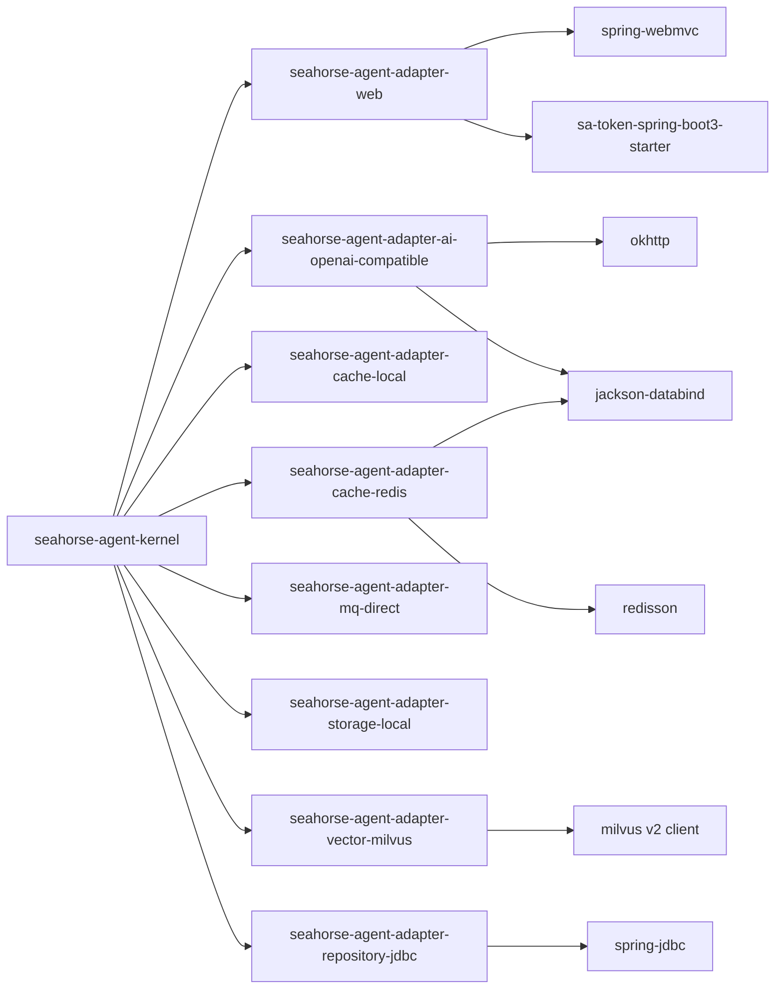

# 适配器模块

<cite>
**本文引用的文件**
- [seahorse-agent-kernel/pom.xml](file://seahorse-agent-kernel/pom.xml)
- [seahorse-agent-adapter-web/pom.xml](file://seahorse-agent-adapter-web/pom.xml)
- [seahorse-agent-adapter-ai-openai-compatible/pom.xml](file://seahorse-agent-adapter-ai-openai-compatible/pom.xml)
- [seahorse-agent-adapter-cache-local/pom.xml](file://seahorse-agent-adapter-cache-local/pom.xml)
- [seahorse-agent-adapter-cache-redis/pom.xml](file://seahorse-agent-adapter-cache-redis/pom.xml)
- [seahorse-agent-adapter-mq-direct/pom.xml](file://seahorse-agent-adapter-mq-direct/pom.xml)
- [seahorse-agent-adapter-storage-local/pom.xml](file://seahorse-agent-adapter-storage-local/pom.xml)
- [seahorse-agent-adapter-vector-milvus/pom.xml](file://seahorse-agent-adapter-vector-milvus/pom.xml)
- [seahorse-agent-adapter-repository-jdbc/pom.xml](file://seahorse-agent-adapter-repository-jdbc/pom.xml)
- [seahorse-agent-kernel/src/main/java/com/miracle/ai/seahorse/agent/kernel/plugin/AgentSPI.java](file://seahorse-agent-kernel/src/main/java/com/miracle/ai/seahorse/agent/kernel/plugin/AgentSPI.java)
- [seahorse-agent-adapter-web/src/main/java/com/miracle/ai/seahorse/agent/adapters/web/SeahorseWebGovernanceConfiguration.java](file://seahorse-agent-adapter-web/src/main/java/com/miracle/ai/seahorse/agent/adapters/web/SeahorseWebGovernanceConfiguration.java)
- [seahorse-agent-adapter-ai-openai-compatible/src/main/java/com/miracle/ai/seahorse/agent/adapters/ai/openai/OpenAiCompatibleModelAdapter.java](file://seahorse-agent-adapter-ai-openai-compatible/src/main/java/com/miracle/ai/seahorse/agent/adapters/ai/openai/OpenAiCompatibleModelAdapter.java)
- [seahorse-agent-adapter-cache-local/src/main/java/com/miracle/ai/seahorse/agent/adapters/cache/local/LocalCacheAdapter.java](file://seahorse-agent-adapter-cache-local/src/main/java/com/miracle/ai/seahorse/agent/adapters/cache/local/LocalCacheAdapter.java)
- [seahorse-agent-adapter-cache-redis/src/main/java/com/miracle/ai/seahorse/agent/adapters/cache/redis/RedisCacheAdapter.java](file://seahorse-agent-adapter-cache-redis/src/main/java/com/miracle/ai/seahorse/agent/adapters/cache/redis/RedisCacheAdapter.java)
- [seahorse-agent-adapter-mq-direct/src/main/java/com/miracle/ai/seahorse/agent/adapters/mq/direct/DirectMessageQueueAdapter.java](file://seahorse-agent-adapter-mq-direct/src/main/java/com/miracle/ai/seahorse/agent/adapters/mq/direct/DirectMessageQueueAdapter.java)
- [seahorse-agent-adapter-storage-local/src/main/java/com/miracle/ai/seahorse/agent/adapters/storage/local/LocalObjectStorageAdapter.java](file://seahorse-agent-adapter-storage-local/src/main/java/com/miracle/ai/seahorse/agent/adapters/storage/local/LocalObjectStorageAdapter.java)
- [seahorse-agent-adapter-vector-milvus/src/main/java/com/miracle/ai/seahorse/agent/adapters/vector/milvus/MilvusVectorAdapter.java](file://seahorse-agent-adapter-vector-milvus/src/main/java/com/miracle/ai/seahorse/agent/adapters/vector/milvus/MilvusVectorAdapter.java)
- [seahorse-agent-adapter-repository-jdbc/src/main/java/com/miracle/ai/seahorse/agent/adapters/repository/jdbc/JdbcKnowledgeBaseRepositoryAdapter.java](file://seahorse-agent-adapter-repository-jdbc/src/main/java/com/miracle/ai/seahorse/agent/adapters/repository/jdbc/JdbcKnowledgeBaseRepositoryAdapter.java)
</cite>

## 目录
1. [引言](#引言)
2. [项目结构](#项目结构)
3. [核心组件](#核心组件)
4. [架构总览](#架构总览)
5. [详细组件分析](#详细组件分析)
6. [依赖关系分析](#依赖关系分析)
7. [性能考量](#性能考量)
8. [故障排查指南](#故障排查指南)
9. [结论](#结论)
10. [附录](#附录)

## 引言
本文件面向 Seahorse Agent 适配器模块，系统性梳理各类适配器的设计模式与实现原理，覆盖 Web 适配器、缓存适配器（本地/Redis）、消息队列适配器（进程内直连/Pulsar）、存储适配器（本地/S3）、向量数据库适配器（Milvus/pgvector/空实现）以及数据库适配器（JDBC）。文档解释适配器与核心内核通过“出站端口”进行解耦协作的方式，说明如何通过端口接口实现功能扩展，并提供使用示例、最佳实践、性能优化技巧与故障排查方法，最后给出开发新适配器以支持第三方服务集成的指导。

## 项目结构
适配器模块采用按功能域分包的组织方式：kernel 提供框架内核与端口契约，各适配器模块在各自子目录下实现具体端口，资源目录中包含 META-INF 下的端口注册清单，用于运行时自动装配。

图表来源
- [seahorse-agent-kernel/src/main/java/com/miracle/ai/seahorse/agent/kernel/plugin/AgentSPI.java:35-50](file://seahorse-agent-kernel/src/main/java/com/miracle/ai/seahorse/agent/kernel/plugin/AgentSPI.java#L35-L50)

章节来源
- [seahorse-agent-kernel/pom.xml:1-67](file://seahorse-agent-kernel/pom.xml#L1-L67)
- [seahorse-agent-adapter-web/pom.xml:1-64](file://seahorse-agent-adapter-web/pom.xml#L1-L64)
- [seahorse-agent-adapter-ai-openai-compatible/pom.xml:1-34](file://seahorse-agent-adapter-ai-openai-compatible/pom.xml#L1-L34)
- [seahorse-agent-adapter-cache-local/pom.xml:1-26](file://seahorse-agent-adapter-cache-local/pom.xml#L1-L26)
- [seahorse-agent-adapter-cache-redis/pom.xml:1-34](file://seahorse-agent-adapter-cache-redis/pom.xml#L1-L34)
- [seahorse-agent-adapter-mq-direct/pom.xml:1-131](file://seahorse-agent-adapter-mq-direct/pom.xml#L1-L131)
- [seahorse-agent-adapter-storage-local/pom.xml:1-129](file://seahorse-agent-adapter-storage-local/pom.xml#L1-L129)
- [seahorse-agent-adapter-vector-milvus/pom.xml:1-319](file://seahorse-agent-adapter-vector-milvus/pom.xml#L1-L319)
- [seahorse-agent-adapter-repository-jdbc/pom.xml:1-251](file://seahorse-agent-adapter-repository-jdbc/pom.xml#L1-L251)

## 核心组件
- 出站端口：内核定义了覆盖模型、缓存、消息队列、存储、向量、知识库、观察等领域的出站端口，适配器实现这些端口以对接外部系统。
- 扩展SPI：通过 AgentSPI 注解标识可被内核识别的扩展点，默认扩展名与是否必需项可配置。
- 端口注册：适配器在资源目录 META-INF 下提供端口实现清单，便于运行时装配。

章节来源
- [seahorse-agent-kernel/src/main/java/com/miracle/ai/seahorse/agent/kernel/plugin/AgentSPI.java:35-50](file://seahorse-agent-kernel/src/main/java/com/miracle/ai/seahorse/agent/kernel/plugin/AgentSPI.java#L35-L50)

## 架构总览
适配器通过实现内核定义的端口接口，向内核提供能力扩展；内核通过端口调用适配器，实现与外部系统的解耦。Web 适配器负责 HTTP 入口与治理；缓存适配器提供键值缓存、发布订阅、分布式锁与限流；消息队列适配器提供消息发送与订阅；存储适配器提供对象存储能力；向量适配器提供向量检索、索引与集合管理；JDBC 适配器提供知识库等实体的持久化访问。

图表来源
- [seahorse-agent-adapter-web/src/main/java/com/miracle/ai/seahorse/agent/adapters/web/SeahorseWebGovernanceConfiguration.java:40-92](file://seahorse-agent-adapter-web/src/main/java/com/miracle/ai/seahorse/agent/adapters/web/SeahorseWebGovernanceConfiguration.java#L40-L92)
- [seahorse-agent-adapter-ai-openai-compatible/src/main/java/com/miracle/ai/seahorse/agent/adapters/ai/openai/OpenAiCompatibleModelAdapter.java:60-82](file://seahorse-agent-adapter-ai-openai-compatible/src/main/java/com/miracle/ai/seahorse/agent/adapters/ai/openai/OpenAiCompatibleModelAdapter.java#L60-L82)
- [seahorse-agent-adapter-cache-local/src/main/java/com/miracle/ai/seahorse/agent/adapters/cache/local/LocalCacheAdapter.java:44-51](file://seahorse-agent-adapter-cache-local/src/main/java/com/miracle/ai/seahorse/agent/adapters/cache/local/LocalCacheAdapter.java#L44-L51)
- [seahorse-agent-adapter-cache-redis/src/main/java/com/miracle/ai/seahorse/agent/adapters/cache/redis/RedisCacheAdapter.java:48-63](file://seahorse-agent-adapter-cache-redis/src/main/java/com/miracle/ai/seahorse/agent/adapters/cache/redis/RedisCacheAdapter.java#L48-L63)
- [seahorse-agent-adapter-mq-direct/src/main/java/com/miracle/ai/seahorse/agent/adapters/mq/direct/DirectMessageQueueAdapter.java:39-44](file://seahorse-agent-adapter-mq-direct/src/main/java/com/miracle/ai/seahorse/agent/adapters/mq/direct/DirectMessageQueueAdapter.java#L39-L44)
- [seahorse-agent-adapter-storage-local/src/main/java/com/miracle/ai/seahorse/agent/adapters/storage/local/LocalObjectStorageAdapter.java:34-47](file://seahorse-agent-adapter-storage-local/src/main/java/com/miracle/ai/seahorse/agent/adapters/storage/local/LocalObjectStorageAdapter.java#L34-L47)
- [seahorse-agent-adapter-vector-milvus/src/main/java/com/miracle/ai/seahorse/agent/adapters/vector/milvus/MilvusVectorAdapter.java:56-74](file://seahorse-agent-adapter-vector-milvus/src/main/java/com/miracle/ai/seahorse/agent/adapters/vector/milvus/MilvusVectorAdapter.java#L56-L74)
- [seahorse-agent-adapter-repository-jdbc/src/main/java/com/miracle/ai/seahorse/agent/adapters/repository/jdbc/JdbcKnowledgeBaseRepositoryAdapter.java:40-40](file://seahorse-agent-adapter-repository-jdbc/src/main/java/com/miracle/ai/seahorse/agent/adapters/repository/jdbc/JdbcKnowledgeBaseRepositoryAdapter.java#L40-L40)

## 详细组件分析

### Web 适配器
- 功能特性
  - 提供 Spring MVC 控制器与本地 SSE 支持，封装聊天、会话、知识库、意图树、查询映射、仪表盘、用户、反馈、插件、RAG 跟踪等控制器。
  - 提供 Web 治理配置，支持演示模式下的只读限制与字符集设置。
- 适用场景
  - 快速搭建前端交互入口，本地开发与演示环境。
- 配置要点
  - 通过属性启用/禁用演示模式，拦截写操作请求并返回统一错误响应。
- 使用示例
  - 在启动类所在工程引入适配器模块后，控制器即自动暴露 REST 接口；演示模式下对非认证路径的写操作会被拒绝。
- 最佳实践
  - 生产环境关闭演示模式；确保响应字符集与内容类型正确设置；对敏感接口增加鉴权层。

图表来源
- [seahorse-agent-adapter-web/src/main/java/com/miracle/ai/seahorse/agent/adapters/web/SeahorseWebGovernanceConfiguration.java:68-91](file://seahorse-agent-adapter-web/src/main/java/com/miracle/ai/seahorse/agent/adapters/web/SeahorseWebGovernanceConfiguration.java#L68-L91)

章节来源
- [seahorse-agent-adapter-web/src/main/java/com/miracle/ai/seahorse/agent/adapters/web/SeahorseWebGovernanceConfiguration.java:40-92](file://seahorse-agent-adapter-web/src/main/java/com/miracle/ai/seahorse/agent/adapters/web/SeahorseWebGovernanceConfiguration.java#L40-L92)

### 缓存适配器（本地/Redis）
- 功能特性
  - 键值缓存：支持 get/set/delete，带 TTL 过期控制。
  - 发布订阅：支持主题订阅与消息分发。
  - 分布式锁：基于本地集合或 Redisson 实现 tryLock/unlock。
  - 速率限制：基于原子计数与 TTL 的令牌桶式限流。
  - ID 生成：基于命名空间的自增 ID。
- 适用场景
  - 本地开发与单机部署使用本地适配器；多节点部署使用 Redis/Redisson 适配器。
- 配置要点
  - 本地适配器不跨 JVM 可见；Redis 适配器需提供 RedissonClient。
- 使用示例
  - 通过端口注入缓存能力，在业务流程中进行键值缓存、限流与分布式锁保护。
- 最佳实践
  - 限流参数与 TTL 合理设置；Redis 适配器注意序列化一致性；发布订阅注意消息幂等处理。

图表来源
- [seahorse-agent-adapter-cache-local/src/main/java/com/miracle/ai/seahorse/agent/adapters/cache/local/LocalCacheAdapter.java:44-130](file://seahorse-agent-adapter-cache-local/src/main/java/com/miracle/ai/seahorse/agent/adapters/cache/local/LocalCacheAdapter.java#L44-L130)
- [seahorse-agent-adapter-cache-redis/src/main/java/com/miracle/ai/seahorse/agent/adapters/cache/redis/RedisCacheAdapter.java:48-143](file://seahorse-agent-adapter-cache-redis/src/main/java/com/miracle/ai/seahorse/agent/adapters/cache/redis/RedisCacheAdapter.java#L48-L143)

章节来源
- [seahorse-agent-adapter-cache-local/src/main/java/com/miracle/ai/seahorse/agent/adapters/cache/local/LocalCacheAdapter.java:44-167](file://seahorse-agent-adapter-cache-local/src/main/java/com/miracle/ai/seahorse/agent/adapters/cache/local/LocalCacheAdapter.java#L44-L167)
- [seahorse-agent-adapter-cache-redis/src/main/java/com/miracle/ai/seahorse/agent/adapters/cache/redis/RedisCacheAdapter.java:48-195](file://seahorse-agent-adapter-cache-redis/src/main/java/com/miracle/ai/seahorse/agent/adapters/cache/redis/RedisCacheAdapter.java#L48-L195)

### 消息队列适配器（进程内直连/Pulsar）
- 功能特性
  - 进程内直连：无外部 Broker，适合本地开发与测试，提供同步分发与订阅。
  - 可靠投递：提供可靠投递接口，实际实现与直连一致（示例）。
- 适用场景
  - 本地开发、单体部署或测试环境；生产环境建议使用 Pulsar 等专业消息中间件。
- 配置要点
  - 订阅时需指定主题、订阅名称与载荷类型。
- 使用示例
  - 发送消息到指定主题，立即触发已订阅处理器；或注册订阅以异步消费。
- 最佳实践
  - 生产环境务必使用具备持久化与事务保障的消息中间件；直连适配器不保证消息可靠性。

图表来源
- [seahorse-agent-adapter-mq-direct/src/main/java/com/miracle/ai/seahorse/agent/adapters/mq/direct/DirectMessageQueueAdapter.java:39-78](file://seahorse-agent-adapter-mq-direct/src/main/java/com/miracle/ai/seahorse/agent/adapters/mq/direct/DirectMessageQueueAdapter.java#L39-L78)

章节来源
- [seahorse-agent-adapter-mq-direct/src/main/java/com/miracle/ai/seahorse/agent/adapters/mq/direct/DirectMessageQueueAdapter.java:39-131](file://seahorse-agent-adapter-mq-direct/src/main/java/com/miracle/ai/seahorse/agent/adapters/mq/direct/DirectMessageQueueAdapter.java#L39-L131)

### 存储适配器（本地/S3）
- 功能特性
  - 本地对象存储：基于文件系统，支持上传、打开流、删除、桶确保。
  - URL 规范：统一前缀与路径校验，防止目录穿越。
- 适用场景
  - 本地开发与测试；生产环境建议使用 S3 兼容对象存储。
- 配置要点
  - 根目录可配置；默认桶名与文件名生成策略。
- 使用示例
  - 上传文件返回存储对象信息，后续可通过 URL 打开或删除。
- 最佳实践
  - 严格校验输入路径，防止目录穿越；生产环境使用高可用对象存储。

图表来源
- [seahorse-agent-adapter-storage-local/src/main/java/com/miracle/ai/seahorse/agent/adapters/storage/local/LocalObjectStorageAdapter.java:49-86](file://seahorse-agent-adapter-storage-local/src/main/java/com/miracle/ai/seahorse/agent/adapters/storage/local/LocalObjectStorageAdapter.java#L49-L86)

章节来源
- [seahorse-agent-adapter-storage-local/src/main/java/com/miracle/ai/seahorse/agent/adapters/storage/local/LocalObjectStorageAdapter.java:34-129](file://seahorse-agent-adapter-storage-local/src/main/java/com/miracle/ai/seahorse/agent/adapters/storage/local/LocalObjectStorageAdapter.java#L34-L129)

### 向量数据库适配器（Milvus/pgvector/空实现）
- 功能特性
  - Milvus：实现向量检索、索引、集合管理，遵循固定字段约定，支持插入、更新、删除、集合存在性检查与创建。
  - pgvector：提供与 PostgreSQL 的向量扩展对接（同端口契约）。
  - 空实现：占位适配器，满足编译与运行时装配需求。
- 适用场景
  - RAG 场景的向量检索与索引管理；根据团队技术栈选择 Milvus 或 pgvector。
- 配置要点
  - 维度、度量类型、索引参数等通过属性配置；集合名解析与默认集合回退。
- 使用示例
  - 将文档分块向量化后批量插入；检索时传入查询向量与 topK。
- 最佳实践
  - 向量维度与度量类型需与嵌入模型一致；合理设置索引参数与一致性级别。

图表来源
- [seahorse-agent-adapter-vector-milvus/src/main/java/com/miracle/ai/seahorse/agent/adapters/vector/milvus/MilvusVectorAdapter.java:56-170](file://seahorse-agent-adapter-vector-milvus/src/main/java/com/miracle/ai/seahorse/agent/adapters/vector/milvus/MilvusVectorAdapter.java#L56-L170)

章节来源
- [seahorse-agent-adapter-vector-milvus/src/main/java/com/miracle/ai/seahorse/agent/adapters/vector/milvus/MilvusVectorAdapter.java:56-319](file://seahorse-agent-adapter-vector-milvus/src/main/java/com/miracle/ai/seahorse/agent/adapters/vector/milvus/MilvusVectorAdapter.java#L56-L319)

### 数据库适配器（JDBC）
- 功能特性
  - 知识库仓储：提供创建、分页查询、名称唯一性校验、文档存在性判断、更新与删除等操作。
  - SQL 设计：使用 JdbcTemplate 执行原生 SQL，含分页、聚合统计与时间戳维护。
- 适用场景
  - 基于关系型数据库的知识库管理；可扩展至其他实体仓储。
- 配置要点
  - DataSource 注入；SQL 中的字段与表名需与数据库结构一致。
- 使用示例
  - 创建知识库并返回 ID；分页查询并统计文档数量。
- 最佳实践
  - 注意 SQL 注入防护与字段长度限制；分页大小限制在安全范围内。

图表来源
- [seahorse-agent-adapter-repository-jdbc/src/main/java/com/miracle/ai/seahorse/agent/adapters/repository/jdbc/JdbcKnowledgeBaseRepositoryAdapter.java:102-143](file://seahorse-agent-adapter-repository-jdbc/src/main/java/com/miracle/ai/seahorse/agent/adapters/repository/jdbc/JdbcKnowledgeBaseRepositoryAdapter.java#L102-L143)

章节来源
- [seahorse-agent-adapter-repository-jdbc/src/main/java/com/miracle/ai/seahorse/agent/adapters/repository/jdbc/JdbcKnowledgeBaseRepositoryAdapter.java:40-251](file://seahorse-agent-adapter-repository-jdbc/src/main/java/com/miracle/ai/seahorse/agent/adapters/repository/jdbc/JdbcKnowledgeBaseRepositoryAdapter.java#L40-L251)

### AI 兼容适配器（OpenAI 兼容）
- 功能特性
  - 支持聊天、流式聊天、嵌入、重排序、模型发现、令牌计数与健康检查。
  - 通过 HTTP 客户端调用兼容 /chat/completions、/embeddings、/rerank 等端点。
- 适用场景
  - 对接多种兼容 OpenAI 协议的大模型服务（如百炼、SiliconFlow 等）。
- 配置要点
  - 基础 URL、API Key、默认模型与支持模型列表通过属性配置。
- 使用示例
  - 构造 ChatRequest 并调用 chat/streamChat 获取回复；调用 embed/rerank 获取向量与相关性分数。
- 最佳实践
  - 正确处理 SSE 流式数据；对异常与非成功状态码进行降级处理；合理设置超时与重试。

图表来源
- [seahorse-agent-adapter-ai-openai-compatible/src/main/java/com/miracle/ai/seahorse/agent/adapters/ai/openai/OpenAiCompatibleModelAdapter.java:84-98](file://seahorse-agent-adapter-ai-openai-compatible/src/main/java/com/miracle/ai/seahorse/agent/adapters/ai/openai/OpenAiCompatibleModelAdapter.java#L84-L98)
- [seahorse-agent-adapter-ai-openai-compatible/src/main/java/com/miracle/ai/seahorse/agent/adapters/ai/openai/OpenAiCompatibleModelAdapter.java:207-243](file://seahorse-agent-adapter-ai-openai-compatible/src/main/java/com/miracle/ai/seahorse/agent/adapters/ai/openai/OpenAiCompatibleModelAdapter.java#L207-L243)

章节来源
- [seahorse-agent-adapter-ai-openai-compatible/src/main/java/com/miracle/ai/seahorse/agent/adapters/ai/openai/OpenAiCompatibleModelAdapter.java:60-383](file://seahorse-agent-adapter-ai-openai-compatible/src/main/java/com/miracle/ai/seahorse/agent/adapters/ai/openai/OpenAiCompatibleModelAdapter.java#L60-L383)

## 依赖关系分析
- 内核模块提供基础依赖（Jackson、SLF4J、Lombok），适配器模块按需引入内核与第三方依赖。
- Web 适配器依赖 Spring WebMVC 与 Sa-Token；AI 兼容适配器依赖 OkHttp 与 Jackson；Redis 缓存适配器依赖 Redisson 与 Jackson；向量适配器依赖 Milvus 客户端；JDBC 适配器依赖 Spring JDBC。

图表来源
- [seahorse-agent-kernel/pom.xml:25-41](file://seahorse-agent-kernel/pom.xml#L25-L41)
- [seahorse-agent-adapter-web/pom.xml:18-32](file://seahorse-agent-adapter-web/pom.xml#L18-L32)
- [seahorse-agent-adapter-ai-openai-compatible/pom.xml:18-32](file://seahorse-agent-adapter-ai-openai-compatible/pom.xml#L18-L32)
- [seahorse-agent-adapter-cache-redis/pom.xml:18-32](file://seahorse-agent-adapter-cache-redis/pom.xml#L18-L32)
- [seahorse-agent-adapter-vector-milvus/pom.xml:1-319](file://seahorse-agent-adapter-vector-milvus/pom.xml#L1-L319)
- [seahorse-agent-adapter-repository-jdbc/pom.xml:1-251](file://seahorse-agent-adapter-repository-jdbc/pom.xml#L1-L251)

章节来源
- [seahorse-agent-kernel/pom.xml:25-41](file://seahorse-agent-kernel/pom.xml#L25-L41)
- [seahorse-agent-adapter-web/pom.xml:18-32](file://seahorse-agent-adapter-web/pom.xml#L18-L32)
- [seahorse-agent-adapter-ai-openai-compatible/pom.xml:18-32](file://seahorse-agent-adapter-ai-openai-compatible/pom.xml#L18-L32)
- [seahorse-agent-adapter-cache-redis/pom.xml:18-32](file://seahorse-agent-adapter-cache-redis/pom.xml#L18-L32)
- [seahorse-agent-adapter-vector-milvus/pom.xml:1-319](file://seahorse-agent-adapter-vector-milvus/pom.xml#L1-L319)
- [seahorse-agent-adapter-repository-jdbc/pom.xml:1-251](file://seahorse-agent-adapter-repository-jdbc/pom.xml#L1-L251)

## 性能考量
- 网络与序列化
  - AI 兼容适配器使用连接池与流式 SSE 处理，减少内存占用；Jackson/Gson 序列化开销可控，建议复用对象。
- 缓存与限流
  - 本地缓存适合单机场景；Redis 缓存适合多节点；合理设置 TTL 与限流阈值，避免热点击穿。
- 消息队列
  - 直连适配器仅用于本地测试；生产环境使用具备持久化与事务保障的消息中间件。
- 向量检索
  - 向量维度与度量类型需与嵌入模型一致；索引参数（如 HNSW 的 M/efConstruction）影响检索性能与精度。
- 数据库
  - JDBC 仓储注意分页大小上限与 SQL 聚合开销；必要时添加索引与物化视图。

## 故障排查指南
- Web 治理
  - 演示模式下写操作被拒绝：检查属性开关与拦截规则；确认白名单路径。
- 缓存
  - Redis 适配器报序列化异常：检查消息体与编码；确保 ObjectMapper 配置一致。
  - 本地缓存过期不生效：确认 TTL 设置与当前时间比较逻辑。
- 消息队列
  - 订阅未触发：确认主题与载荷类型匹配；检查订阅注册与处理器绑定。
- 存储
  - 本地存储 URL 校验失败：检查 URL 前缀与相对路径规范化；避免目录穿越。
- 向量
  - 维度不匹配：核对嵌入维度与属性配置；Milvus 插入前进行维度校验。
- JDBC
  - SQL 执行异常：核对表结构与字段类型；检查分页边界与空值处理。

章节来源
- [seahorse-agent-adapter-web/src/main/java/com/miracle/ai/seahorse/agent/adapters/web/SeahorseWebGovernanceConfiguration.java:68-91](file://seahorse-agent-adapter-web/src/main/java/com/miracle/ai/seahorse/agent/adapters/web/SeahorseWebGovernanceConfiguration.java#L68-L91)
- [seahorse-agent-adapter-cache-redis/src/main/java/com/miracle/ai/seahorse/agent/adapters/cache/redis/RedisCacheAdapter.java:145-159](file://seahorse-agent-adapter-cache-redis/src/main/java/com/miracle/ai/seahorse/agent/adapters/cache/redis/RedisCacheAdapter.java#L145-L159)
- [seahorse-agent-adapter-mq-direct/src/main/java/com/miracle/ai/seahorse/agent/adapters/mq/direct/DirectMessageQueueAdapter.java:116-128](file://seahorse-agent-adapter-mq-direct/src/main/java/com/miracle/ai/seahorse/agent/adapters/mq/direct/DirectMessageQueueAdapter.java#L116-L128)
- [seahorse-agent-adapter-storage-local/src/main/java/com/miracle/ai/seahorse/agent/adapters/storage/local/LocalObjectStorageAdapter.java:108-118](file://seahorse-agent-adapter-storage-local/src/main/java/com/miracle/ai/seahorse/agent/adapters/storage/local/LocalObjectStorageAdapter.java#L108-L118)
- [seahorse-agent-adapter-vector-milvus/src/main/java/com/miracle/ai/seahorse/agent/adapters/vector/milvus/MilvusVectorAdapter.java:266-274](file://seahorse-agent-adapter-vector-milvus/src/main/java/com/miracle/ai/seahorse/agent/adapters/vector/milvus/MilvusVectorAdapter.java#L266-L274)
- [seahorse-agent-adapter-repository-jdbc/src/main/java/com/miracle/ai/seahorse/agent/adapters/repository/jdbc/JdbcKnowledgeBaseRepositoryAdapter.java:179-200](file://seahorse-agent-adapter-repository-jdbc/src/main/java/com/miracle/ai/seahorse/agent/adapters/repository/jdbc/JdbcKnowledgeBaseRepositoryAdapter.java#L179-L200)

## 结论
Seahorse Agent 适配器模块通过清晰的端口契约与 SPI 扩展机制，实现了与外部系统的松耦合集成。不同适配器针对特定领域提供高内聚实现，既满足本地开发与演示需求，又可平滑迁移到生产环境。遵循本文的最佳实践与排错指引，可有效提升系统稳定性与性能。

## 附录
- 开发新适配器步骤
  - 定义/实现目标端口接口（参考现有适配器）。
  - 在资源目录 META-INF 下提供端口实现清单，声明实现类与端口类型。
  - 编写单元测试覆盖关键路径；在演示/测试环境中验证行为。
  - 在生产环境评估性能与可靠性，必要时引入外部中间件或云服务。