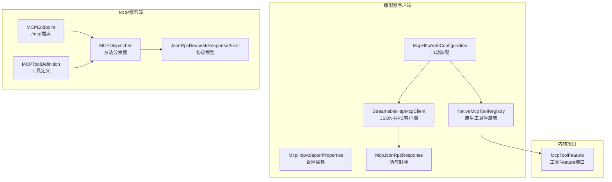
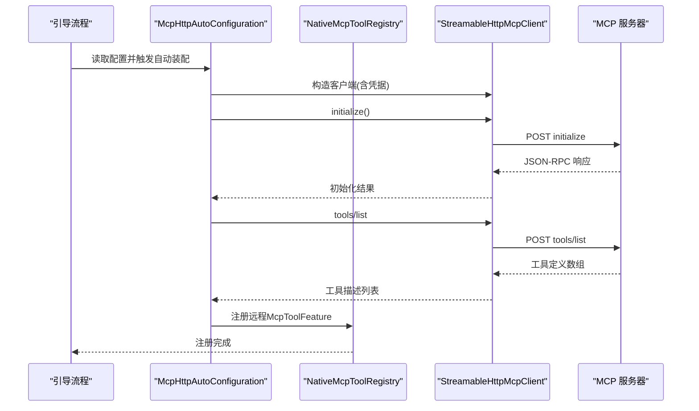
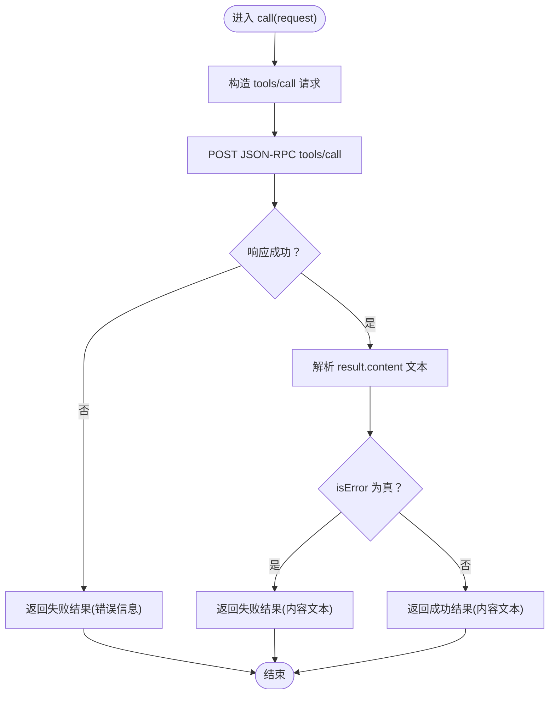
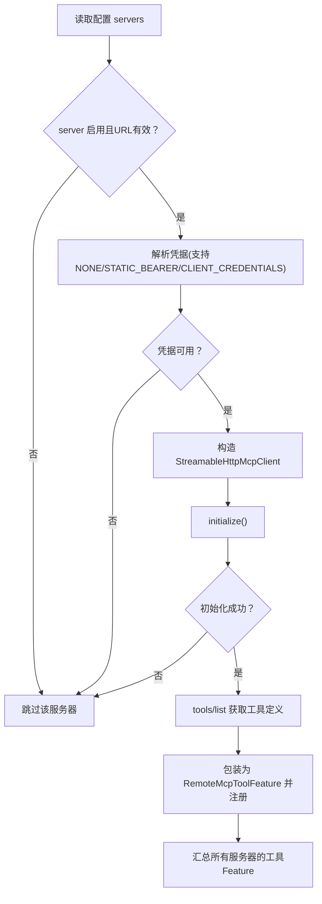
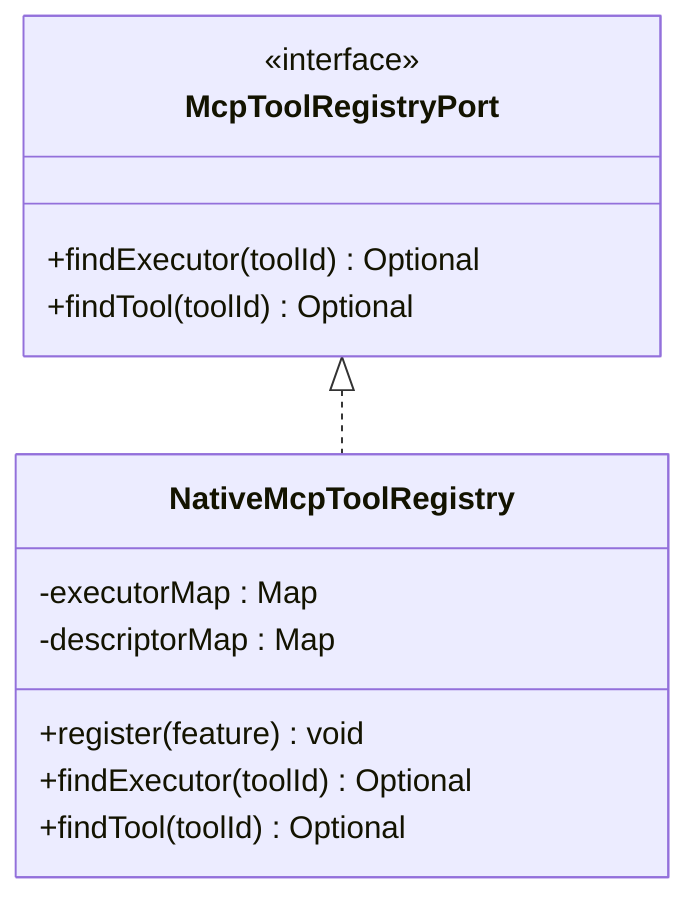
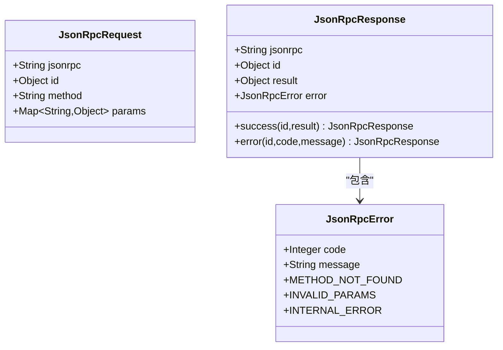
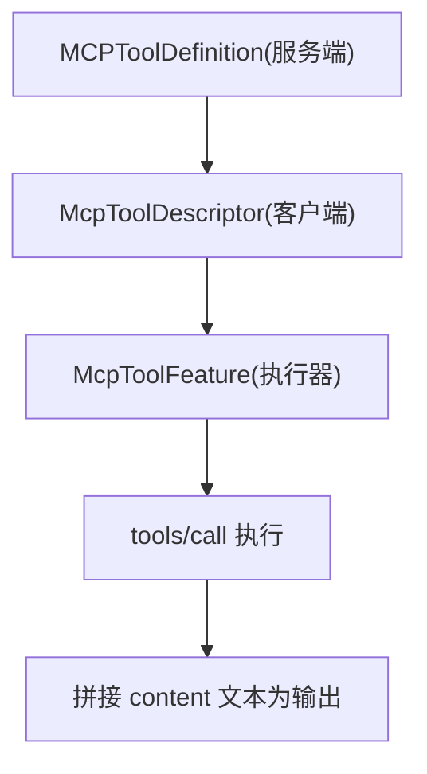
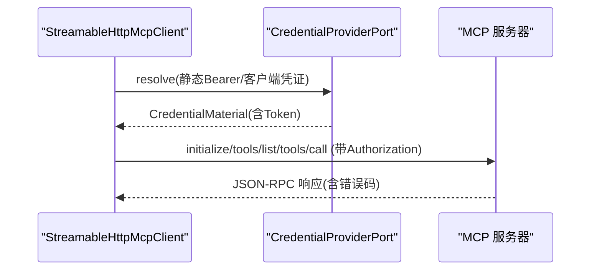
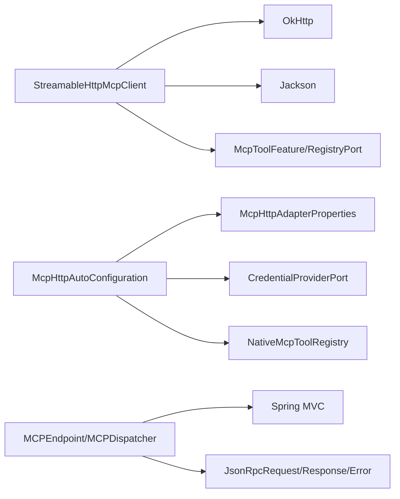

# MCP适配器

<cite>
**本文引用的文件**
- [StreamableHttpMcpClient.java](file://seahorse-agent-adapter-mcp-http/src/main/java/com/miracle/ai/seahorse/agent/adapters/mcp/http/StreamableHttpMcpClient.java)
- [McpHttpAutoConfiguration.java](file://seahorse-agent-adapter-mcp-http/src/main/java/com/miracle/ai/seahorse/agent/adapters/mcp/http/McpHttpAutoConfiguration.java)
- [McpHttpAdapterProperties.java](file://seahorse-agent-adapter-mcp-http/src/main/java/com/miracle/ai/seahorse/agent/adapters/mcp/http/McpHttpAdapterProperties.java)
- [NativeMcpToolRegistry.java](file://seahorse-agent-adapter-mcp-http/src/main/java/com/miracle/ai/seahorse/agent/adapters/mcp/http/NativeMcpToolRegistry.java)
- [McpJsonRpcResponse.java](file://seahorse-agent-adapter-mcp-http/src/main/java/com/miracle/ai/seahorse/agent/adapters/mcp/http/McpJsonRpcResponse.java)
- [McpToolFeature.java](file://seahorse-agent-kernel/src/main/java/com/miracle/ai/seahorse/agent/kernel/feature/mcp/McpToolFeature.java)
- [MCPToolDefinition.java](file://seahorse-agent-mcp-server/src/main/java/com/miracle/ai/seahorse/agent/adapters/mcp/server/core/MCPToolDefinition.java)
- [JsonRpcRequest.java](file://seahorse-agent-mcp-server/src/main/java/com/miracle/ai/seahorse/agent/adapters/mcp/server/protocol/JsonRpcRequest.java)
- [JsonRpcResponse.java](file://seahorse-agent-mcp-server/src/main/java/com/miracle/ai/seahorse/agent/adapters/mcp/server/protocol/JsonRpcResponse.java)
- [JsonRpcError.java](file://seahorse-agent-mcp-server/src/main/java/com/miracle/ai/seahorse/agent/adapters/mcp/server/protocol/JsonRpcError.java)
- [MCPEndpoint.java](file://seahorse-agent-mcp-server/src/main/java/com/miracle/ai/seahorse/agent/adapters/mcp/server/endpoint/MCPEndpoint.java)
- [MCPDispatcher.java](file://seahorse-agent-mcp-server/src/main/java/com/miracle/ai/seahorse/agent/adapters/mcp/server/endpoint/MCPDispatcher.java)
- [McpHttpAutoConfigurationCredentialTests.java](file://seahorse-agent-adapter-mcp-http/src/test/java/com/miracle/ai/seahorse/agent/adapters/mcp/http/McpHttpAutoConfigurationCredentialTests.java)
- [MCPDispatcherTests.java](file://seahorse-agent-mcp-server/src/test/java/com/miracle/ai/seahorse/agent/adapters/mcp/server/endpoint/MCPDispatcherTests.java)
</cite>

## 目录
1. [引言](#引言)
2. [项目结构](#项目结构)
3. [核心组件](#核心组件)
4. [架构总览](#架构总览)
5. [详细组件分析](#详细组件分析)
6. [依赖分析](#依赖分析)
7. [性能考虑](#性能考虑)
8. [故障排查指南](#故障排查指南)
9. [结论](#结论)
10. [附录](#附录)

## 引言
本技术文档聚焦于MCP适配器，系统性阐述HTTP MCP适配器的实现架构、工具调用机制与安全机制，并对比本地工具注册与HTTP工具调用的差异与选型原则。文档同时给出MCP协议的JSON-RPC实现要点（请求格式、响应结构、错误处理）、配置项与超时/重试建议、以及扩展与自定义工具开发的最佳实践。

## 项目结构
MCP适配器相关代码主要分布在以下模块：
- 适配器（客户端）：HTTP MCP客户端、自动装配、属性配置、原生工具注册表、远程工具特性包装
- 内核接口：MCP工具Feature与注册表端口
- MCP服务端：JSON-RPC协议模型、端点与分发器

**图表来源**
- [StreamableHttpMcpClient.java:46-332](file://seahorse-agent-adapter-mcp-http/src/main/java/com/miracle/ai/seahorse/agent/adapters/mcp/http/StreamableHttpMcpClient.java#L46-L332)
- [McpHttpAutoConfiguration.java:49-213](file://seahorse-agent-adapter-mcp-http/src/main/java/com/miracle/ai/seahorse/agent/adapters/mcp/http/McpHttpAutoConfiguration.java#L49-L213)
- [McpHttpAdapterProperties.java:28-195](file://seahorse-agent-adapter-mcp-http/src/main/java/com/miracle/ai/seahorse/agent/adapters/mcp/http/McpHttpAdapterProperties.java#L28-L195)
- [NativeMcpToolRegistry.java:31-77](file://seahorse-agent-adapter-mcp-http/src/main/java/com/miracle/ai/seahorse/agent/adapters/mcp/http/NativeMcpToolRegistry.java#L31-L77)
- [McpToolFeature.java:25-62](file://seahorse-agent-kernel/src/main/java/com/miracle/ai/seahorse/agent/kernel/feature/mcp/McpToolFeature.java#L25-L62)
- [MCPEndpoint.java:28-31](file://seahorse-agent-mcp-server/src/main/java/com/miracle/ai/seahorse/agent/adapters/mcp/server/endpoint/MCPEndpoint.java#L28-L31)
- [MCPDispatcher.java:33-35](file://seahorse-agent-mcp-server/src/main/java/com/miracle/ai/seahorse/agent/adapters/mcp/server/endpoint/MCPDispatcher.java#L33-L35)
- [JsonRpcRequest.java:26-56](file://seahorse-agent-mcp-server/src/main/java/com/miracle/ai/seahorse/agent/adapters/mcp/server/protocol/JsonRpcRequest.java#L26-L56)
- [JsonRpcResponse.java:24-83](file://seahorse-agent-mcp-server/src/main/java/com/miracle/ai/seahorse/agent/adapters/mcp/server/protocol/JsonRpcResponse.java#L24-L83)
- [JsonRpcError.java:24-57](file://seahorse-agent-mcp-server/src/main/java/com/miracle/ai/seahorse/agent/adapters/mcp/server/protocol/JsonRpcError.java#L24-L57)
- [MCPToolDefinition.java:28-96](file://seahorse-agent-mcp-server/src/main/java/com/miracle/ai/seahorse/agent/adapters/mcp/server/core/MCPToolDefinition.java#L28-L96)

**章节来源**
- [McpHttpAutoConfiguration.java:49-213](file://seahorse-agent-adapter-mcp-http/src/main/java/com/miracle/ai/seahorse/agent/adapters/mcp/http/McpHttpAutoConfiguration.java#L49-L213)
- [McpHttpAdapterProperties.java:28-195](file://seahorse-agent-adapter-mcp-http/src/main/java/com/miracle/ai/seahorse/agent/adapters/mcp/http/McpHttpAdapterProperties.java#L28-L195)
- [NativeMcpToolRegistry.java:31-77](file://seahorse-agent-adapter-mcp-http/src/main/java/com/miracle/ai/seahorse/agent/adapters/mcp/http/NativeMcpToolRegistry.java#L31-L77)
- [McpToolFeature.java:25-62](file://seahorse-agent-kernel/src/main/java/com/miracle/ai/seahorse/agent/kernel/feature/mcp/McpToolFeature.java#L25-L62)
- [MCPEndpoint.java:28-31](file://seahorse-agent-mcp-server/src/main/java/com/miracle/ai/seahorse/agent/adapters/mcp/server/endpoint/MCPEndpoint.java#L28-L31)
- [MCPDispatcher.java:33-35](file://seahorse-agent-mcp-server/src/main/java/com/miracle/ai/seahorse/agent/adapters/mcp/server/endpoint/MCPDispatcher.java#L33-L35)
- [JsonRpcRequest.java:26-56](file://seahorse-agent-mcp-server/src/main/java/com/miracle/ai/seahorse/agent/adapters/mcp/server/protocol/JsonRpcRequest.java#L26-L56)
- [JsonRpcResponse.java:24-83](file://seahorse-agent-mcp-server/src/main/java/com/miracle/ai/seahorse/agent/adapters/mcp/server/protocol/JsonRpcResponse.java#L24-L83)
- [JsonRpcError.java:24-57](file://seahorse-agent-mcp-server/src/main/java/com/miracle/ai/seahorse/agent/adapters/mcp/server/protocol/JsonRpcError.java#L24-L57)
- [MCPToolDefinition.java:28-96](file://seahorse-agent-mcp-server/src/main/java/com/miracle/ai/seahorse/agent/adapters/mcp/server/core/MCPToolDefinition.java#L28-L96)

## 核心组件
- HTTP MCP JSON-RPC客户端：负责initialize、tools/list、tools/call三类方法的封包与调用，统一错误处理，解析content文本为工具输出。
- 自动装配与配置：根据配置加载远程MCP服务器，解析凭据，构建客户端并发现远程工具，注册为McpToolFeature。
- 原生工具注册表：聚合本地与远程工具Feature，按toolId提供执行器与描述，支持覆盖策略。
- 内核接口：McpToolFeature抽象工具能力，暴露descriptor与执行端口；McpToolRegistryPort提供查询能力。
- MCP服务端协议：定义JSON-RPC请求/响应/错误模型，提供/mcp端点与方法分发。

**章节来源**
- [StreamableHttpMcpClient.java:46-332](file://seahorse-agent-adapter-mcp-http/src/main/java/com/miracle/ai/seahorse/agent/adapters/mcp/http/StreamableHttpMcpClient.java#L46-L332)
- [McpHttpAutoConfiguration.java:49-213](file://seahorse-agent-adapter-mcp-http/src/main/java/com/miracle/ai/seahorse/agent/adapters/mcp/http/McpHttpAutoConfiguration.java#L49-L213)
- [NativeMcpToolRegistry.java:31-77](file://seahorse-agent-adapter-mcp-http/src/main/java/com/miracle/ai/seahorse/agent/adapters/mcp/http/NativeMcpToolRegistry.java#L31-L77)
- [McpToolFeature.java:25-62](file://seahorse-agent-kernel/src/main/java/com/miracle/ai/seahorse/agent/kernel/feature/mcp/McpToolFeature.java#L25-L62)
- [JsonRpcRequest.java:26-56](file://seahorse-agent-mcp-server/src/main/java/com/miracle/ai/seahorse/agent/adapters/mcp/server/protocol/JsonRpcRequest.java#L26-L56)
- [JsonRpcResponse.java:24-83](file://seahorse-agent-mcp-server/src/main/java/com/miracle/ai/seahorse/agent/adapters/mcp/server/protocol/JsonRpcResponse.java#L24-L83)
- [JsonRpcError.java:24-57](file://seahorse-agent-mcp-server/src/main/java/com/miracle/ai/seahorse/agent/adapters/mcp/server/protocol/JsonRpcError.java#L24-L57)

## 架构总览
下图展示MCP适配器在系统中的位置与交互：客户端侧通过HTTP JSON-RPC与服务端通信，自动装配负责凭据解析与工具发现，注册表向内核暴露统一的工具查询与执行接口。

**图表来源**
- [McpHttpAutoConfiguration.java:102-140](file://seahorse-agent-adapter-mcp-http/src/main/java/com/miracle/ai/seahorse/agent/adapters/mcp/http/McpHttpAutoConfiguration.java#L102-L140)
- [StreamableHttpMcpClient.java:102-142](file://seahorse-agent-adapter-mcp-http/src/main/java/com/miracle/ai/seahorse/agent/adapters/mcp/http/StreamableHttpMcpClient.java#L102-L142)
- [NativeMcpToolRegistry.java:65-75](file://seahorse-agent-adapter-mcp-http/src/main/java/com/miracle/ai/seahorse/agent/adapters/mcp/http/NativeMcpToolRegistry.java#L65-L75)

## 详细组件分析

### HTTP MCP JSON-RPC 客户端
- 职责：封装initialize、tools/list、tools/call三类方法；自动附加/mcp路径；统一封装错误；解析content文本为工具输出。
- 凭据：支持静态Bearer Token，从CredentialMaterial注入Authorization头。
- 错误处理：序列化失败、HTTP异常、非成功状态、RPC error字段均转换为统一错误字符串。
- 结果解析：从result.content数组拼接文本作为最终输出；若isError为真则标记为失败。

**图表来源**
- [StreamableHttpMcpClient.java:150-164](file://seahorse-agent-adapter-mcp-http/src/main/java/com/miracle/ai/seahorse/agent/adapters/mcp/http/StreamableHttpMcpClient.java#L150-L164)
- [StreamableHttpMcpClient.java:236-258](file://seahorse-agent-adapter-mcp-http/src/main/java/com/miracle/ai/seahorse/agent/adapters/mcp/http/StreamableHttpMcpClient.java#L236-L258)

**章节来源**
- [StreamableHttpMcpClient.java:46-332](file://seahorse-agent-adapter-mcp-http/src/main/java/com/miracle/ai/seahorse/agent/adapters/mcp/http/StreamableHttpMcpClient.java#L46-L332)
- [McpJsonRpcResponse.java:22-33](file://seahorse-agent-adapter-mcp-http/src/main/java/com/miracle/ai/seahorse/agent/adapters/mcp/http/McpJsonRpcResponse.java#L22-L33)

### 自动装配与凭据解析
- 条件装配：基于NativeMcpEnabledCondition启用；在凭证自动配置之后、内核自动配置之前生效。
- 凭据来源：优先使用CredentialProviderPort解析；支持NONE、STATIC_BEARER、CLIENT_CREDENTIALS三种模式；USER_DELEGATED不支持。
- 超时配置：通过OkHttpClient.callTimeout应用到HTTP客户端。
- 工具发现：遍历配置的服务器，逐个初始化并拉取工具列表，包装为McpToolFeature注册到NativeMcpToolRegistry。

**图表来源**
- [McpHttpAutoConfiguration.java:102-140](file://seahorse-agent-adapter-mcp-http/src/main/java/com/miracle/ai/seahorse/agent/adapters/mcp/http/McpHttpAutoConfiguration.java#L102-L140)
- [McpHttpAutoConfiguration.java:142-189](file://seahorse-agent-adapter-mcp-http/src/main/java/com/miracle/ai/seahorse/agent/adapters/mcp/http/McpHttpAutoConfiguration.java#L142-L189)
- [McpHttpAutoConfiguration.java:189-211](file://seahorse-agent-adapter-mcp-http/src/main/java/com/miracle/ai/seahorse/agent/adapters/mcp/http/McpHttpAutoConfiguration.java#L189-L211)

**章节来源**
- [McpHttpAutoConfiguration.java:49-213](file://seahorse-agent-adapter-mcp-http/src/main/java/com/miracle/ai/seahorse/agent/adapters/mcp/http/McpHttpAutoConfiguration.java#L49-L213)
- [McpHttpAdapterProperties.java:28-195](file://seahorse-agent-adapter-mcp-http/src/main/java/com/miracle/ai/seahorse/agent/adapters/mcp/http/McpHttpAdapterProperties.java#L28-L195)

### 原生工具注册表
- 聚合本地与远程McpToolFeature，维护两个映射：executorMap与descriptorMap。
- 查找：按toolId返回执行器与描述；重复toolId时后注册覆盖。
- 作用：对内核暴露统一的McpToolRegistryPort，屏蔽工具来源差异。

**图表来源**
- [NativeMcpToolRegistry.java:31-77](file://seahorse-agent-adapter-mcp-http/src/main/java/com/miracle/ai/seahorse/agent/adapters/mcp/http/NativeMcpToolRegistry.java#L31-L77)

**章节来源**
- [NativeMcpToolRegistry.java:31-77](file://seahorse-agent-adapter-mcp-http/src/main/java/com/miracle/ai/seahorse/agent/adapters/mcp/http/NativeMcpToolRegistry.java#L31-L77)

### MCP协议的JSON-RPC实现
- 请求模型：包含jsonrpc、id、method、params字段。
- 响应模型：包含jsonrpc、id、result/error；提供success/error工厂方法。
- 错误模型：包含标准错误码与消息，如METHOD_NOT_FOUND、INVALID_PARAMS、INTERNAL_ERROR。
- 服务端端点：提供/mcp端点接收JSON-RPC请求与通知，方法分发器根据method路由到对应处理器。

**图表来源**
- [JsonRpcRequest.java:26-56](file://seahorse-agent-mcp-server/src/main/java/com/miracle/ai/seahorse/agent/adapters/mcp/server/protocol/JsonRpcRequest.java#L26-L56)
- [JsonRpcResponse.java:24-83](file://seahorse-agent-mcp-server/src/main/java/com/miracle/ai/seahorse/agent/adapters/mcp/server/protocol/JsonRpcResponse.java#L24-L83)
- [JsonRpcError.java:24-57](file://seahorse-agent-mcp-server/src/main/java/com/miracle/ai/seahorse/agent/adapters/mcp/server/protocol/JsonRpcError.java#L24-L57)

**章节来源**
- [JsonRpcRequest.java:26-56](file://seahorse-agent-mcp-server/src/main/java/com/miracle/ai/seahorse/agent/adapters/mcp/server/protocol/JsonRpcRequest.java#L26-L56)
- [JsonRpcResponse.java:24-83](file://seahorse-agent-mcp-server/src/main/java/com/miracle/ai/seahorse/agent/adapters/mcp/server/protocol/JsonRpcResponse.java#L24-L83)
- [JsonRpcError.java:24-57](file://seahorse-agent-mcp-server/src/main/java/com/miracle/ai/seahorse/agent/adapters/mcp/server/protocol/JsonRpcError.java#L24-L57)
- [MCPEndpoint.java:28-31](file://seahorse-agent-mcp-server/src/main/java/com/miracle/ai/seahorse/agent/adapters/mcp/server/endpoint/MCPEndpoint.java#L28-L31)
- [MCPDispatcher.java:33-35](file://seahorse-agent-mcp-server/src/main/java/com/miracle/ai/seahorse/agent/adapters/mcp/server/endpoint/MCPDispatcher.java#L33-L35)

### 工具定义、参数提取与执行结果处理
- 工具定义：服务端以MCPToolDefinition描述工具，包含toolId、description、parameters及requireUserId等。
- 参数提取：客户端将远端工具schema映射为McpToolDescriptor，提取参数描述、类型、是否必填、枚举值等。
- 执行结果：客户端将result.content数组拼接为文本作为工具输出；若isError为真则视为失败。

**图表来源**
- [MCPToolDefinition.java:28-96](file://seahorse-agent-mcp-server/src/main/java/com/miracle/ai/seahorse/agent/adapters/mcp/server/core/MCPToolDefinition.java#L28-L96)
- [StreamableHttpMcpClient.java:260-322](file://seahorse-agent-adapter-mcp-http/src/main/java/com/miracle/ai/seahorse/agent/adapters/mcp/http/StreamableHttpMcpClient.java#L260-L322)

**章节来源**
- [MCPToolDefinition.java:28-96](file://seahorse-agent-mcp-server/src/main/java/com/miracle/ai/seahorse/agent/adapters/mcp/server/core/MCPToolDefinition.java#L28-L96)
- [StreamableHttpMcpClient.java:260-322](file://seahorse-agent-adapter-mcp-http/src/main/java/com/miracle/ai/seahorse/agent/adapters/mcp/http/StreamableHttpMcpClient.java#L260-L322)

### 安全机制：认证、授权与访问控制
- 认证：支持静态Bearer Token（STATIC_BEARER）与客户端凭证（CLIENT_CREDENTIALS）两种模式；USER_DELEGATED不支持。
- 授权：通过scope、audience、resource等参数在客户端凭证模式下声明权限范围。
- 访问控制：服务端端点/MCP端点接收请求，方法分发器根据method进行路由；错误码用于表达方法不存在、参数非法、内部错误等。

**图表来源**
- [McpHttpAutoConfiguration.java:142-189](file://seahorse-agent-adapter-mcp-http/src/main/java/com/miracle/ai/seahorse/agent/adapters/mcp/http/McpHttpAutoConfiguration.java#L142-L189)
- [StreamableHttpMcpClient.java:204-211](file://seahorse-agent-adapter-mcp-http/src/main/java/com/miracle/ai/seahorse/agent/adapters/mcp/http/StreamableHttpMcpClient.java#L204-L211)
- [JsonRpcError.java:33-45](file://seahorse-agent-mcp-server/src/main/java/com/miracle/ai/seahorse/agent/adapters/mcp/server/protocol/JsonRpcError.java#L33-L45)

**章节来源**
- [McpHttpAutoConfiguration.java:142-189](file://seahorse-agent-adapter-mcp-http/src/main/java/com/miracle/ai/seahorse/agent/adapters/mcp/http/McpHttpAutoConfiguration.java#L142-L189)
- [StreamableHttpMcpClient.java:204-211](file://seahorse-agent-adapter-mcp-http/src/main/java/com/miracle/ai/seahorse/agent/adapters/mcp/http/StreamableHttpMcpClient.java#L204-L211)
- [JsonRpcError.java:33-45](file://seahorse-agent-mcp-server/src/main/java/com/miracle/ai/seahorse/agent/adapters/mcp/server/protocol/JsonRpcError.java#L33-L45)

### 本地工具注册与HTTP工具调用的差异与选择原则
- 本地工具：直接以McpToolFeature形式注册，执行器与描述在本地内存中，延迟低、可控性强。
- HTTP工具：通过HTTP JSON-RPC从远端MCP服务器发现并注册，适合跨服务、跨语言或动态扩展场景。
- 选择原则：若工具能力稳定且与Agent同进程，优先本地；若需共享能力、集中治理或动态扩展，优先HTTP工具。

**章节来源**
- [NativeMcpToolRegistry.java:31-77](file://seahorse-agent-adapter-mcp-http/src/main/java/com/miracle/ai/seahorse/agent/adapters/mcp/http/NativeMcpToolRegistry.java#L31-L77)
- [McpToolFeature.java:25-62](file://seahorse-agent-kernel/src/main/java/com/miracle/ai/seahorse/agent/kernel/feature/mcp/McpToolFeature.java#L25-L62)

### MCP工具开发指南：定义规范与参数验证
- 工具定义规范：服务端应提供稳定的MCPToolDefinition，包含toolId、description、parameters（含类型、是否必填、枚举值等）。
- 参数验证：客户端将inputSchema映射为McpToolDescriptor，利用required与enum约束进行参数校验。
- 输出规范：工具执行结果应包含content数组，客户端将其拼接为最终文本输出。

**章节来源**
- [MCPToolDefinition.java:28-96](file://seahorse-agent-mcp-server/src/main/java/com/miracle/ai/seahorse/agent/adapters/mcp/server/core/MCPToolDefinition.java#L28-L96)
- [StreamableHttpMcpClient.java:260-322](file://seahorse-agent-adapter-mcp-http/src/main/java/com/miracle/ai/seahorse/agent/adapters/mcp/http/StreamableHttpMcpClient.java#L260-L322)

### 配置选项、超时设置与重试机制
- 配置项：启用开关、调用超时、服务器列表（名称、URL、启用、认证类型、租户ID、客户端ID/密钥引用、作用域、受众、资源等）。
- 超时设置：通过OkHttpClient.callTimeout应用到HTTP客户端。
- 重试机制：当前实现未内置重试逻辑，建议在上层或网关层实现指数退避重试策略。

**章节来源**
- [McpHttpAdapterProperties.java:28-195](file://seahorse-agent-adapter-mcp-http/src/main/java/com/miracle/ai/seahorse/agent/adapters/mcp/http/McpHttpAdapterProperties.java#L28-L195)
- [McpHttpAutoConfiguration.java:87-89](file://seahorse-agent-adapter-mcp-http/src/main/java/com/miracle/ai/seahorse/agent/adapters/mcp/http/McpHttpAutoConfiguration.java#L87-L89)

### 扩展方法与自定义工具开发最佳实践
- 扩展点：新增McpToolFeature实现，注册到NativeMcpToolRegistry即可被内核发现与调度。
- 最佳实践：保持toolId唯一；参数定义清晰、必要时提供枚举值；输出结构化、可解析；错误信息明确可诊断；对敏感参数进行最小化暴露。

**章节来源**
- [NativeMcpToolRegistry.java:65-75](file://seahorse-agent-adapter-mcp-http/src/main/java/com/miracle/ai/seahorse/agent/adapters/mcp/http/NativeMcpToolRegistry.java#L65-L75)
- [McpToolFeature.java:25-62](file://seahorse-agent-kernel/src/main/java/com/miracle/ai/seahorse/agent/kernel/feature/mcp/McpToolFeature.java#L25-L62)

## 依赖分析
- 客户端依赖OkHttp与Jackson进行HTTP与JSON处理；依赖内核的McpToolFeature与注册表端口。
- 自动装配依赖凭证提供者与属性配置；在特定条件与顺序下生效。
- 服务端依赖Spring MVC提供/mcp端点，方法分发器根据方法名路由。

**图表来源**
- [StreamableHttpMcpClient.java:20-44](file://seahorse-agent-adapter-mcp-http/src/main/java/com/miracle/ai/seahorse/agent/adapters/mcp/http/StreamableHttpMcpClient.java#L20-L44)
- [McpHttpAutoConfiguration.java:20-47](file://seahorse-agent-adapter-mcp-http/src/main/java/com/miracle/ai/seahorse/agent/adapters/mcp/http/McpHttpAutoConfiguration.java#L20-L47)
- [MCPEndpoint.java:20-26](file://seahorse-agent-mcp-server/src/main/java/com/miracle/ai/seahorse/agent/adapters/mcp/server/endpoint/MCPEndpoint.java#L20-L26)
- [JsonRpcRequest.java:20-25](file://seahorse-agent-mcp-server/src/main/java/com/miracle/ai/seahorse/agent/adapters/mcp/server/protocol/JsonRpcRequest.java#L20-L25)

**章节来源**
- [StreamableHttpMcpClient.java:20-44](file://seahorse-agent-adapter-mcp-http/src/main/java/com/miracle/ai/seahorse/agent/adapters/mcp/http/StreamableHttpMcpClient.java#L20-L44)
- [McpHttpAutoConfiguration.java:20-47](file://seahorse-agent-adapter-mcp-http/src/main/java/com/miracle/ai/seahorse/agent/adapters/mcp/http/McpHttpAutoConfiguration.java#L20-L47)
- [MCPEndpoint.java:20-26](file://seahorse-agent-mcp-server/src/main/java/com/miracle/ai/seahorse/agent/adapters/mcp/server/endpoint/MCPEndpoint.java#L20-L26)
- [JsonRpcRequest.java:20-25](file://seahorse-agent-mcp-server/src/main/java/com/miracle/ai/seahorse/agent/adapters/mcp/server/protocol/JsonRpcRequest.java#L20-L25)

## 性能考虑
- 超时控制：通过OkHttpClient.callTimeout限制单次调用耗时，避免阻塞。
- 连接复用：使用OkHttp的连接池减少TCP握手开销。
- 结果解析：content文本拼接为最终输出，避免不必要的中间结构转换。
- 降级策略：当远程MCP服务器不可用或工具发现失败时，注册表为空，内核走仅KB检索的降级路径。

**章节来源**
- [McpHttpAutoConfiguration.java:87-89](file://seahorse-agent-adapter-mcp-http/src/main/java/com/miracle/ai/seahorse/agent/adapters/mcp/http/McpHttpAutoConfiguration.java#L87-L89)
- [McpHttpAutoConfiguration.java:136-139](file://seahorse-agent-adapter-mcp-http/src/main/java/com/miracle/ai/seahorse/agent/adapters/mcp/http/McpHttpAutoConfiguration.java#L136-L139)

## 故障排查指南
- 凭据问题：检查CredentialProvider是否可用、静态Bearer引用是否正确、客户端凭证的clientId/secretRef/tenantId/scopes等配置。
- 连接问题：确认服务器URL末尾是否包含/mcp、网络连通性、证书与代理配置。
- 响应问题：查看JSON-RPC错误码与消息，定位方法不存在、参数非法或内部错误。
- 日志告警：关注initialize与tools/list失败的日志，以及HTTP状态码与序列化异常信息。

**章节来源**
- [McpHttpAutoConfigurationCredentialTests.java:37-85](file://seahorse-agent-adapter-mcp-http/src/test/java/com/miracle/ai/seahorse/agent/adapters/mcp/http/McpHttpAutoConfigurationCredentialTests.java#L37-L85)
- [MCPDispatcherTests.java:1-25](file://seahorse-agent-mcp-server/src/test/java/com/miracle/ai/seahorse/agent/adapters/mcp/server/endpoint/MCPDispatcherTests.java#L1-L25)
- [StreamableHttpMcpClient.java:185-234](file://seahorse-agent-adapter-mcp-http/src/main/java/com/miracle/ai/seahorse/agent/adapters/mcp/http/StreamableHttpMcpClient.java#L185-L234)

## 结论
MCP适配器通过HTTP JSON-RPC实现了与远端MCP服务器的标准化交互，结合自动装配与原生注册表，为内核提供了统一的工具发现与执行能力。其设计强调安全性（凭据解析与Bearer Token）、可扩展性（远程工具动态发现）与可观测性（统一错误封装）。在实际部署中，建议结合超时控制与重试策略，确保稳定性与性能的平衡。

## 附录
- 相关测试用例参考：凭据解析与自动装配行为验证。
- 端口接口资源文件：McpToolRegistryPort与McpParameterExtractionPort的SPI定义。

**章节来源**
- [McpHttpAutoConfigurationCredentialTests.java:37-85](file://seahorse-agent-adapter-mcp-http/src/test/java/com/miracle/ai/seahorse/agent/adapters/mcp/http/McpHttpAutoConfigurationCredentialTests.java#L37-L85)
- [MCPDispatcherTests.java:1-25](file://seahorse-agent-mcp-server/src/test/java/com/miracle/ai/seahorse/agent/adapters/mcp/server/endpoint/MCPDispatcherTests.java#L1-L25)