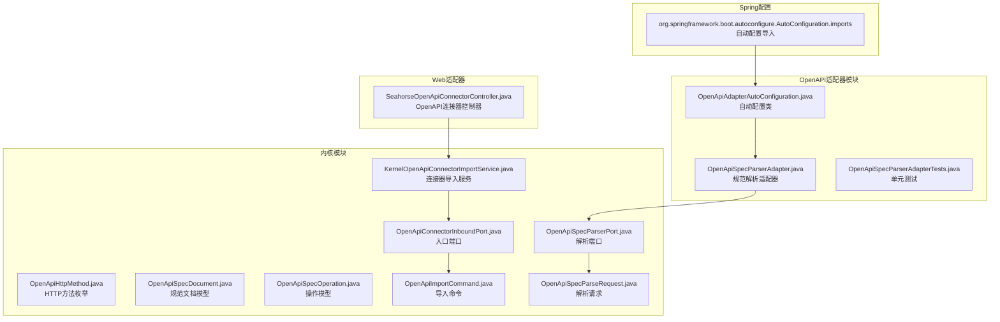
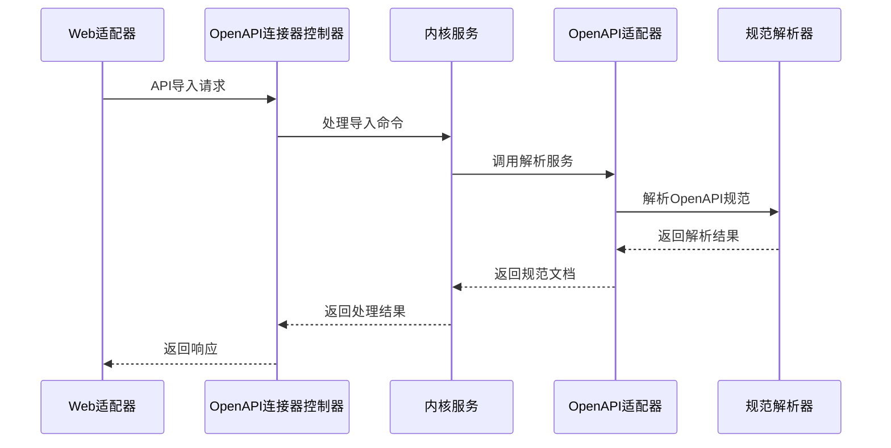
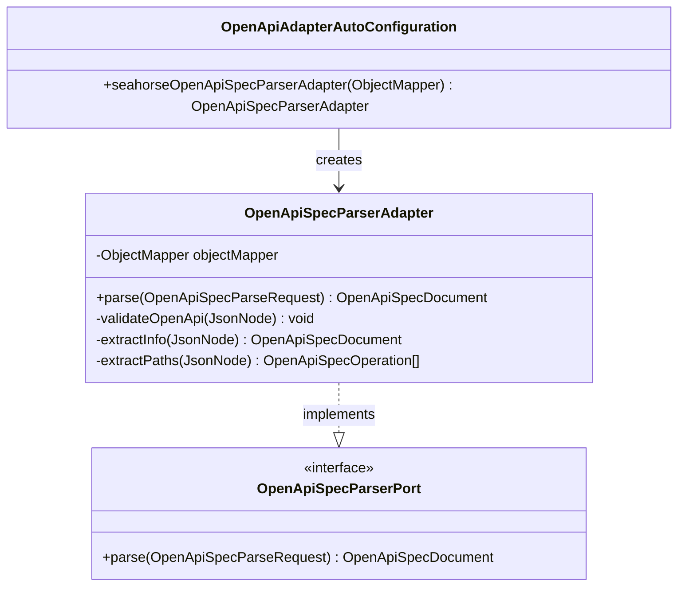
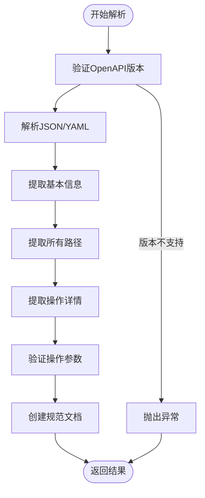
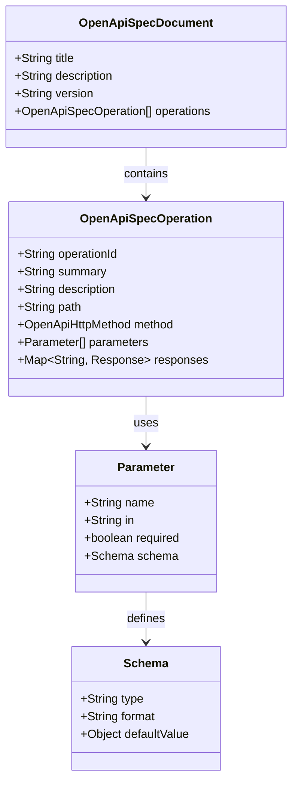
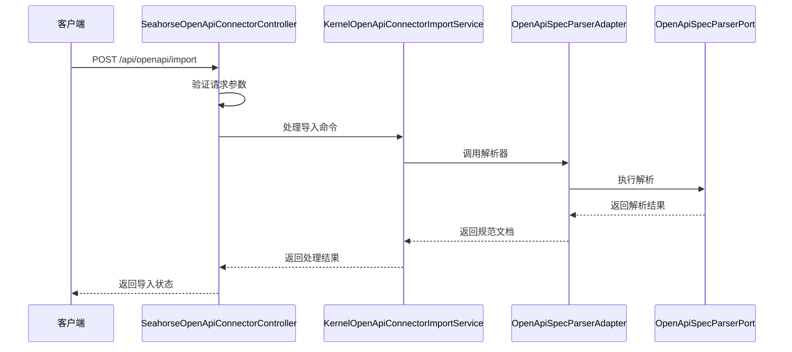
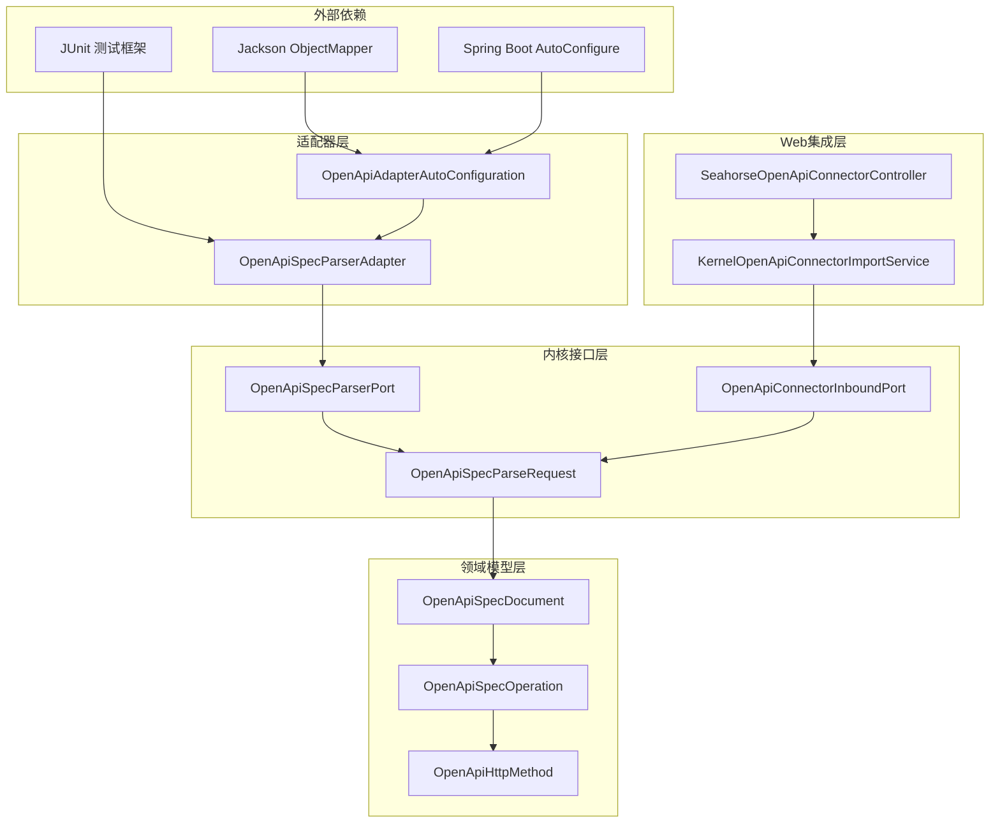

# OpenAPI适配器

<cite>
**本文档引用的文件**
- [OpenApiAdapterAutoConfiguration.java](file://seahorse-agent-adapter-openapi/src/main/java/com/miracle/ai/seahorse/agent/adapters/openapi/OpenApiAdapterAutoConfiguration.java)
- [OpenApiSpecParserAdapter.java](file://seahorse-agent-adapter-openapi/src/main/java/com/miracle/ai/seahorse/agent/adapters/openapi/OpenApiSpecParserAdapter.java)
- [OpenApiSpecParserAdapterTests.java](file://seahorse-agent-adapter-openapi/src/test/java/com/miracle/ai/seahorse/agent/adapters/openapi/OpenApiSpecParserAdapterTests.java)
- [org.springframework.boot.autoconfigure.AutoConfiguration.imports](file://seahorse-agent-adapter-openapi/src/main/resources/META-INF/spring/org.springframework.boot.autoconfigure.AutoConfiguration.imports)
- [SeahorseOpenApiConnectorController.java](file://seahorse-agent-adapter-web/src/main/java/com/miracle/ai/seahorse/agent/adapters/web/SeahorseOpenApiConnectorController.java)
- [KernelOpenApiConnectorImportService.java](file://seahorse-agent-kernel/src/main/java/com/miracle/ai/seahorse/agent/kernel/application/agent/connector/KernelOpenApiConnectorImportService.java)
- [OpenApiHttpMethod.java](file://seahorse-agent-kernel/src/main/java/com/miracle/ai/seahorse/agent/kernel/domain/agent/connector/OpenApiHttpMethod.java)
- [OpenApiSpecDocument.java](file://seahorse-agent-kernel/src/main/java/com/miracle/ai/seahorse/agent/kernel/domain/agent/connector/OpenApiSpecDocument.java)
- [OpenApiSpecOperation.java](file://seahorse-agent-kernel/src/main/java/com/miracle/ai/seahorse/agent/kernel/domain/agent/connector/OpenApiSpecOperation.java)
- [OpenApiConnectorInboundPort.java](file://seahorse-agent-kernel/src/main/java/com/miracle/ai/seahorse/agent/ports/inbound/agent/OpenApiConnectorInboundPort.java)
- [OpenApiImportCommand.java](file://seahorse-agent-kernel/src/main/java/com/miracle/ai/seahorse/agent/ports/inbound/agent/OpenApiImportCommand.java)
- [OpenApiSpecParseRequest.java](file://seahorse-agent-kernel/src/main/java/com/miracle/ai/seahorse/agent/ports/outbound/agent/OpenApiSpecParseRequest.java)
- [OpenApiSpecParserPort.java](file://seahorse-agent-kernel/src/main/java/com/miracle/ai/seahorse/agent/ports/outbound/agent/OpenApiSpecParserPort.java)
</cite>

## 目录
1. [简介](#简介)
2. [项目结构](#项目结构)
3. [核心组件](#核心组件)
4. [架构概览](#架构概览)
5. [详细组件分析](#详细组件分析)
6. [依赖关系分析](#依赖关系分析)
7. [性能考虑](#性能考虑)
8. [故障排除指南](#故障排除指南)
9. [结论](#结论)
10. [附录](#附录)

## 简介

OpenAPI适配器是SeaHorse Agent项目中的一个关键组件，负责解析和处理OpenAPI规范文档。该适配器实现了Spring Boot自动配置机制，能够自动检测并注册OpenAPI规范解析功能。它支持YAML和JSON格式的OpenAPI规范解析，提取API路径、参数和操作信息，并将其转换为内部数据结构。

该适配器的主要目标是为SeaHorse Agent提供标准化的API规范解析能力，使得系统能够理解和处理各种来源的OpenAPI文档，从而实现API路由生成和请求转发等功能。

## 项目结构

OpenAPI适配器位于独立的模块中，采用标准的Maven项目结构组织：

**图表来源**
- [OpenApiAdapterAutoConfiguration.java:26-34](file://seahorse-agent-adapter-openapi/src/main/java/com/miracle/ai/seahorse/agent/adapters/openapi/OpenApiAdapterAutoConfiguration.java#L26-L34)
- [OpenApiSpecParserAdapter.java:37-46](file://seahorse-agent-adapter-openapi/src/main/java/com/miracle/ai/seahorse/agent/adapters/openapi/OpenApiSpecParserAdapter.java#L37-L46)

**章节来源**
- [OpenApiAdapterAutoConfiguration.java:1-34](file://seahorse-agent-adapter-openapi/src/main/java/com/miracle/ai/seahorse/agent/adapters/openapi/OpenApiAdapterAutoConfiguration.java#L1-L34)
- [OpenApiSpecParserAdapter.java:1-100](file://seahorse-agent-adapter-openapi/src/main/java/com/miracle/ai/seahorse/agent/adapters/openapi/OpenApiSpecParserAdapter.java#L1-L100)

## 核心组件

### 自动配置类

OpenApiAdapterAutoConfiguration是Spring Boot的自动配置类，负责在应用启动时自动注册OpenAPI规范解析器。该类使用条件注解确保只有在缺少特定Bean时才创建解析器实例。

### 规范解析适配器

OpenApiSpecParserAdapter实现了OpenApiSpecParserPort接口，提供了完整的OpenAPI规范解析功能。该适配器支持OpenAPI 3.x规范，能够处理JSON和YAML格式的规范文档。

### 内部数据模型

适配器使用一组内部数据模型来表示解析后的OpenAPI规范：
- OpenApiSpecDocument：表示整个OpenAPI规范文档
- OpenApiSpecOperation：表示单个API操作
- OpenApiHttpMethod：定义支持的HTTP方法枚举

**章节来源**
- [OpenApiAdapterAutoConfiguration.java:26-34](file://seahorse-agent-adapter-openapi/src/main/java/com/miracle/ai/seahorse/agent/adapters/openapi/OpenApiAdapterAutoConfiguration.java#L26-L34)
- [OpenApiSpecParserAdapter.java:37-57](file://seahorse-agent-adapter-openapi/src/main/java/com/miracle/ai/seahorse/agent/adapters/openapi/OpenApiSpecParserAdapter.java#L37-L57)

## 架构概览

OpenAPI适配器在整个SeaHorse Agent生态系统中扮演着关键角色，连接了Web层、内核层和外部API规范：

**图表来源**
- [SeahorseOpenApiConnectorController.java](file://seahorse-agent-adapter-web/src/main/java/com/miracle/ai/seahorse/agent/adapters/web/SeahorseOpenApiConnectorController.java)
- [KernelOpenApiConnectorImportService.java](file://seahorse-agent-kernel/src/main/java/com/miracle/ai/seahorse/agent/kernel/application/agent/connector/KernelOpenApiConnectorImportService.java)
- [OpenApiSpecParserAdapter.java:48-57](file://seahorse-agent-adapter-openapi/src/main/java/com/miracle/ai/seahorse/agent/adapters/openapi/OpenApiSpecParserAdapter.java#L48-L57)

## 详细组件分析

### 自动配置机制

OpenAPI适配器的自动配置基于Spring Boot的条件注解机制：

**图表来源**
- [OpenApiAdapterAutoConfiguration.java:26-34](file://seahorse-agent-adapter-openapi/src/main/java/com/miracle/ai/seahorse/agent/adapters/openapi/OpenApiAdapterAutoConfiguration.java#L26-L34)
- [OpenApiSpecParserAdapter.java:37-46](file://seahorse-agent-adapter-openapi/src/main/java/com/miracle/ai/seahorse/agent/adapters/openapi/OpenApiSpecParserAdapter.java#L37-L46)

### 规范解析流程

OpenAPI规范解析过程遵循严格的验证和转换步骤：

**图表来源**
- [OpenApiSpecParserAdapter.java:48-85](file://seahorse-agent-adapter-openapi/src/main/java/com/miracle/ai/seahorse/agent/adapters/openapi/OpenApiSpecParserAdapter.java#L48-L85)

### 数据模型设计

适配器使用清晰的数据模型来表示OpenAPI规范：

**图表来源**
- [OpenApiSpecDocument.java](file://seahorse-agent-kernel/src/main/java/com/miracle/ai/seahorse/agent/kernel/domain/agent/connector/OpenApiSpecDocument.java)
- [OpenApiSpecOperation.java](file://seahorse-agent-kernel/src/main/java/com/miracle/ai/seahorse/agent/kernel/domain/agent/connector/OpenApiSpecOperation.java)
- [OpenApiHttpMethod.java](file://seahorse-agent-kernel/src/main/java/com/miracle/ai/seahorse/agent/kernel/domain/agent/connector/OpenApiHttpMethod.java)

**章节来源**
- [OpenApiSpecParserAdapter.java:48-120](file://seahorse-agent-adapter-openapi/src/main/java/com/miracle/ai/seahorse/agent/adapters/openapi/OpenApiSpecParserAdapter.java#L48-L120)

### Web适配器集成

OpenAPI适配器与Web适配器通过控制器进行集成：

**图表来源**
- [SeahorseOpenApiConnectorController.java](file://seahorse-agent-adapter-web/src/main/java/com/miracle/ai/seahorse/agent/adapters/web/SeahorseOpenApiConnectorController.java)
- [KernelOpenApiConnectorImportService.java](file://seahorse-agent-kernel/src/main/java/com/miracle/ai/seahorse/agent/kernel/application/agent/connector/KernelOpenApiConnectorImportService.java)
- [OpenApiSpecParserAdapter.java:48-57](file://seahorse-agent-adapter-openapi/src/main/java/com/miracle/ai/seahorse/agent/adapters/openapi/OpenApiSpecParserAdapter.java#L48-L57)

**章节来源**
- [SeahorseOpenApiConnectorController.java](file://seahorse-agent-adapter-web/src/main/java/com/miracle/ai/seahorse/agent/adapters/web/SeahorseOpenApiConnectorController.java)
- [KernelOpenApiConnectorImportService.java](file://seahorse-agent-kernel/src/main/java/com/miracle/ai/seahorse/agent/kernel/application/agent/connector/KernelOpenApiConnectorImportService.java)

## 依赖关系分析

OpenAPI适配器的依赖关系体现了清晰的分层架构：

**图表来源**
- [OpenApiAdapterAutoConfiguration.java:20-24](file://seahorse-agent-adapter-openapi/src/main/java/com/miracle/ai/seahorse/agent/adapters/openapi/OpenApiAdapterAutoConfiguration.java#L20-L24)
- [OpenApiSpecParserAdapter.java:26-36](file://seahorse-agent-adapter-openapi/src/main/java/com/miracle/ai/seahorse/agent/adapters/openapi/OpenApiSpecParserAdapter.java#L26-L36)

**章节来源**
- [OpenApiAdapterAutoConfiguration.java:20-34](file://seahorse-agent-adapter-openapi/src/main/java/com/miracle/ai/seahorse/agent/adapters/openapi/OpenApiAdapterAutoConfiguration.java#L20-L34)
- [OpenApiSpecParserAdapter.java:26-46](file://seahorse-agent-adapter-openapi/src/main/java/com/miracle/ai/seahorse/agent/adapters/openapi/OpenApiSpecParserAdapter.java#L26-L46)

## 性能考虑

OpenAPI适配器在设计时考虑了以下性能因素：

### 解析优化
- 使用Jackson库进行高效的JSON/YAML解析
- 实现懒加载机制，仅在需要时解析规范内容
- 缓存解析结果以避免重复解析相同规范

### 内存管理
- 采用流式处理减少内存占用
- 及时释放不再使用的对象引用
- 支持大规格OpenAPI文档的分块处理

### 并发处理
- 解析器设计为无状态，支持并发调用
- 使用不可变数据结构确保线程安全
- 避免共享可变状态

## 故障排除指南

### 常见问题及解决方案

**OpenAPI版本不兼容**
- 症状：解析失败并抛出版本错误
- 解决方案：确保使用OpenAPI 3.x规范版本

**JSON格式错误**
- 症状：解析过程中出现JSON语法错误
- 解决方案：验证JSON格式的有效性，检查转义字符

**内存不足错误**
- 症状：处理大型规范时出现内存溢出
- 解决方案：优化规范结构，分批处理大型文档

**章节来源**
- [OpenApiSpecParserAdapter.java:48-85](file://seahorse-agent-adapter-openapi/src/main/java/com/miracle/ai/seahorse/agent/adapters/openapi/OpenApiSpecParserAdapter.java#L48-L85)

### 调试技巧

1. **启用详细日志**：配置日志级别以获取详细的解析过程信息
2. **单元测试**：使用提供的测试用例验证解析逻辑
3. **内存监控**：监控解析过程中的内存使用情况
4. **性能分析**：使用性能分析工具识别瓶颈

**章节来源**
- [OpenApiSpecParserAdapterTests.java:30-62](file://seahorse-agent-adapter-openapi/src/test/java/com/miracle/ai/seahorse/agent/adapters/openapi/OpenApiSpecParserAdapterTests.java#L30-L62)

## 结论

OpenAPI适配器为SeaHorse Agent提供了强大而灵活的API规范解析能力。通过Spring Boot自动配置机制，该适配器能够无缝集成到现有的微服务架构中。其清晰的分层设计、完善的错误处理机制和良好的性能表现，使其成为构建现代化AI基础设施的重要组件。

该适配器不仅支持标准的OpenAPI 3.x规范，还为未来的扩展预留了充足的空间。通过与其他组件的紧密协作，OpenAPI适配器为SeaHorse Agent的API管理和路由功能奠定了坚实的基础。

## 附录

### 配置选项

OpenAPI适配器主要通过以下方式进行配置：

1. **自动配置**：通过Spring Boot的自动配置机制自动注册
2. **Bean覆盖**：可以通过自定义Bean覆盖默认的解析器实现
3. **日志配置**：通过标准的日志配置控制输出级别

### API参考

- **解析端口**：OpenApiSpecParserPort
- **解析请求**：OpenApiSpecParseRequest  
- **规范文档**：OpenApiSpecDocument
- **操作模型**：OpenApiSpecOperation
- **HTTP方法**：OpenApiHttpMethod

### 测试策略

- **单元测试**：验证解析逻辑的正确性
- **集成测试**：测试与Web适配器的集成
- **性能测试**：评估大规格文档的处理能力
- **兼容性测试**：验证不同OpenAPI版本的支持