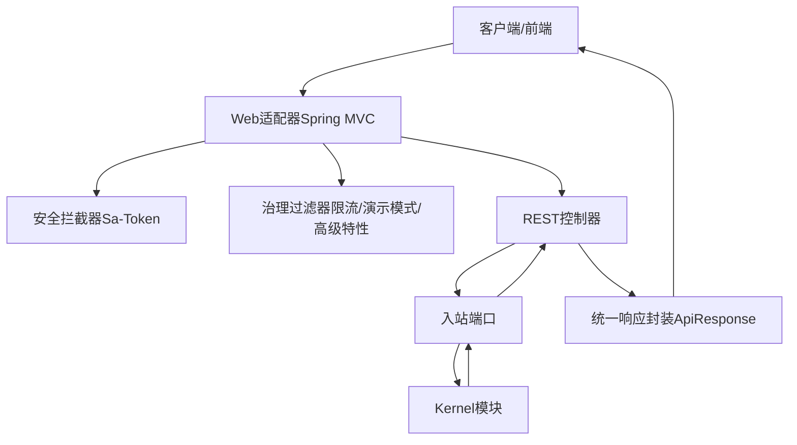
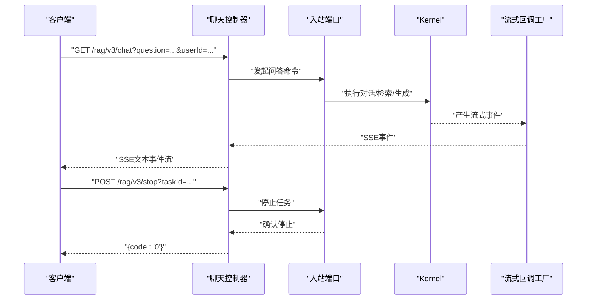
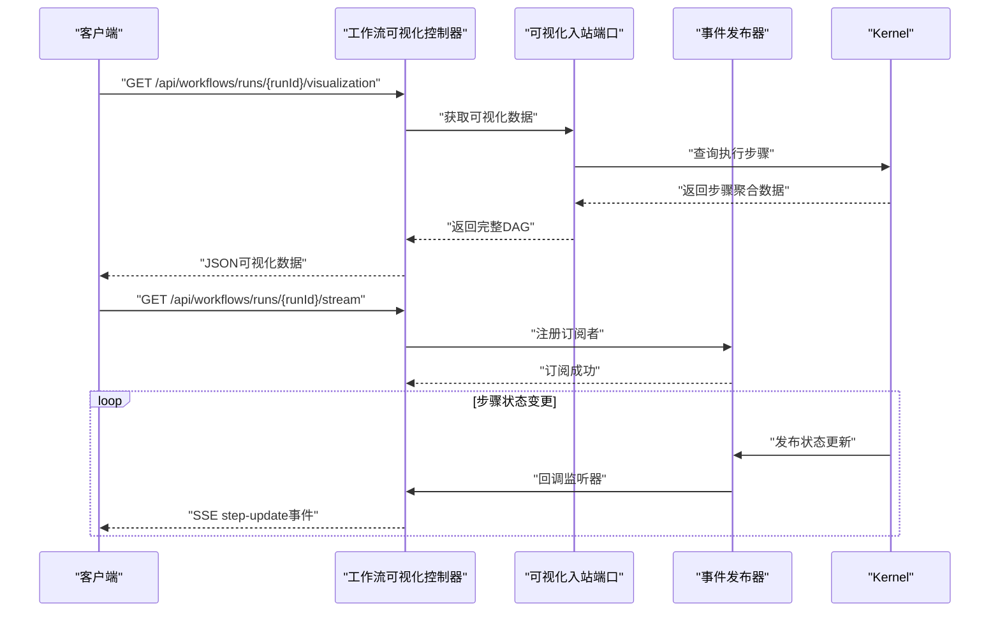
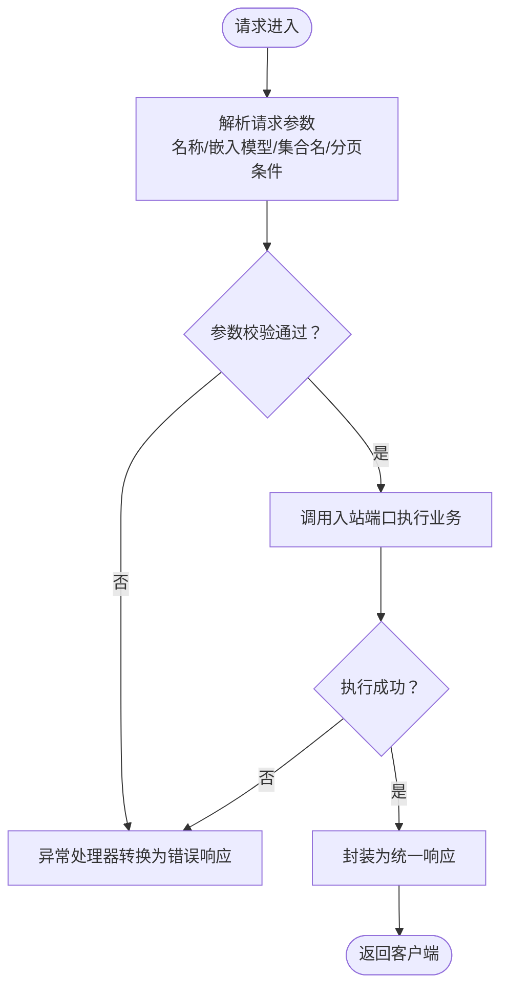
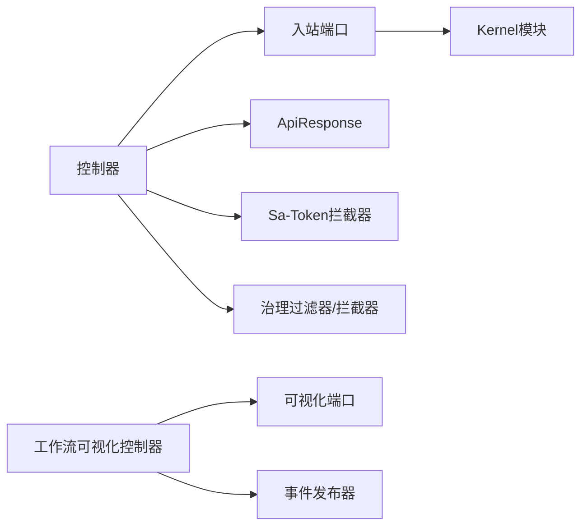

# Web适配器

<cite>
**本文引用的文件**
- [pom.xml](file://seahorse-agent-adapter-web/pom.xml)
- [Web 适配器.md](file://docs/zh/content/后端系统/适配器模块/Web 适配器.md)
- [API 接口文档.md](file://docs/zh/content/API 接口文档/API 接口文档.md)
- [SeahorseChatController.java](file://seahorse-agent-adapter-web/src/main/java/com/miracle/ai/seahorse/agent/adapters/web/SeahorseChatController.java)
- [SeahorseConversationController.java](file://seahorse-agent-adapter-web/src/main/java/com/miracle/ai/seahorse/agent/adapters/web/SeahorseConversationController.java)
- [SeahorseKnowledgeBaseController.java](file://seahorse-agent-adapter-web/src/main/java/com/miracle/ai/seahorse/agent/adapters/web/SeahorseKnowledgeBaseController.java)
- [SeahorseKnowledgeChunkController.java](file://seahorse-agent-adapter-web/src/main/java/com/miracle/ai/seahorse/agent/adapters/web/SeahorseKnowledgeChunkController.java)
- [SeahorseAuthController.java](file://seahorse-agent-adapter-web/src/main/java/com/miracle/ai/seahorse/agent/adapters/web/SeahorseAuthController.java)
- [SeahorseWorkflowVisualizationController.java](file://seahorse-agent-adapter-web/src/main/java/com/miracle/ai/seahorse/agent/adapters/web/SeahorseWorkflowVisualizationController.java)
- [ApiResponse.java](file://seahorse-agent-adapter-web/src/main/java/com/miracle/ai/seahorse/agent/adapters/web/ApiResponse.java)
- [ApiResponses.java](file://seahorse-agent-adapter-web/src/main/java/com/miracle/ai/seahorse/agent/adapters/web/ApiResponses.java)
- [RateLimitFilter.java](file://seahorse-agent-adapter-web/src/main/java/com/miracle/ai/seahorse/agent/adapters/web/RateLimitFilter.java)
- [AdvancedFeatureGate.java](file://seahorse-agent-adapter-web/src/main/java/com/miracle/ai/seahorse/agent/adapters/web/AdvancedFeatureGate.java)
- [AdvancedFeatureDisabledException.java](file://seahorse-agent-adapter-web/src/main/java/com/miracle/ai/seahorse/agent/adapters/web/AdvancedFeatureDisabledException.java)
- [SaTokenCurrentUserAdapter.java](file://seahorse-agent-adapter-web/src/main/java/com/miracle/ai/seahorse/agent/adapters/web/SaTokenCurrentUserAdapter.java)
- [SaTokenServiceAdapter.java](file://seahorse-agent-adapter-web/src/main/java/com/miracle/ai/seahorse/agent/adapters/web/SaTokenServiceAdapter.java)
- [ChatStreamCallbackFactoryPort.java](file://seahorse-agent-adapter-web/src/main/java/com/miracle/ai/seahorse/agent/adapters/web/ChatStreamCallbackFactoryPort.java)
- [ResearchSseBridge.java](file://seahorse-agent-adapter-web/src/main/java/com/miracle/ai/seahorse/agent/adapters/web/ResearchSseBridge.java)
- [ProductMode.java](file://seahorse-agent-adapter-web/src/main/java/com/miracle/ai/seahorse/agent/adapters/web/ProductMode.java)
- [SeahorseAccessDecisionController.java](file://seahorse-agent-adapter-web/src/main/java/com/miracle/ai/seahorse/agent/adapters/web/SeahorseAccessDecisionController.java)
- [SeahorseAgentDefinitionController.java](file://seahorse-agent-adapter-web/src/main/java/com/miracle/ai/seahorse/agent/adapters/web/SeahorseAgentDefinitionController.java)
- [SeahorseAgentRunController.java](file://seahorse-agent-adapter-web/src/main/java/com/miracle/ai/seahorse/agent/adapters/web/SeahorseAgentRunController.java)
- [SeahorseAgentArtifactController.java](file://seahorse-agent-adapter-web/src/main/java/com/miracle/ai/seahorse/agent/adapters/web/SeahorseAgentArtifactController.java)
- [SeahorseAgentToolBindingController.java](file://seahorse-agent-adapter-web/src/main/java/com/miracle/ai/seahorse/agent/adapters/web/SeahorseAgentToolBindingController.java)
- [SeahorseAgentFactoryController.java](file://seahorse-agent-adapter-web/src/main/java/com/miracle/ai/seahorse/agent/adapters/web/SeahorseAgentFactoryController.java)
- [SeahorseAgentRolloutController.java](file://seahorse-agent-adapter-web/src/main/java/com/miracle/ai/seahorse/agent/adapters/web/SeahorseAgentRolloutController.java)
- [SeahorseAgentHandoffController.java](file://seahorse-agent-adapter-web/src/main/java/com/miracle/ai/seahorse/agent/adapters/web/SeahorseAgentHandoffController.java)
- [SeahorseAgentEvalController.java](file://seahorse-agent-adapter-web/src/main/java/com/miracle/ai/seahorse/agent/adapters/web/SeahorseAgentEvalController.java)
- [SeahorseApprovalController.java](file://seahorse-agent-adapter-web/src/main/java/com/miracle/ai/seahorse/agent/adapters/web/SeahorseApprovalController.java)
- [SeahorseAuditEventController.java](file://seahorse-agent-adapter-web/src/main/java/com/miracle/ai/seahorse/agent/adapters/web/SeahorseAuditEventController.java)
- [SeahorseContextPackController.java](file://seahorse-agent-adapter-web/src/main/java/com/miracle/ai/seahorse/agent/adapters/web/SeahorseContextPackController.java)
- [SeahorseConversationAttachmentController.java](file://seahorse-agent-adapter-web/src/main/java/com/miracle/ai/seahorse/agent/adapters/web/SeahorseConversationAttachmentController.java)
- [SeahorseCostUsageController.java](file://seahorse-agent-adapter-web/src/main/java/com/miracle/ai/seahorse/agent/adapters/web/SeahorseCostUsageController.java)
- [SeahorseDashboardController.java](file://seahorse-agent-adapter-web/src/main/java/com/miracle/ai/seahorse/agent/adapters/web/SeahorseDashboardController.java)
- [SeahorseDocumentRefreshController.java](file://seahorse-agent-adapter-web/src/main/java/com/miracle/ai/seahorse/agent/adapters/web/SeahorseDocumentRefreshController.java)
- [SeahorseKnowledgeDocumentController.java](file://seahorse-agent-adapter-web/src/main/java/com/miracle/ai/seahorse/agent/adapters/web/SeahorseKnowledgeDocumentController.java)
- [SeahorseUserController.java](file://seahorse-agent-adapter-web/src/main/java/com/miracle/ai/seahorse/agent/adapters/web/SeahorseUserController.java)
- [AiModelConfigController.java](file://seahorse-agent-adapter-web/src/main/java/com/miracle/ai/seahorse/agent/adapters/web/AiModelConfigController.java)
- [KnowledgeBaseCreateRequest.java](file://seahorse-agent-adapter-web/src/main/java/com/miracle/ai/seahorse/agent/adapters/web/KnowledgeBaseCreateRequest.java)
- [KnowledgeBaseUpdateRequest.java](file://seahorse-agent-adapter-web/src/main/java/com/miracle/ai/seahorse/agent/adapters/web/KnowledgeBaseUpdateRequest.java)
- [KnowledgeDocumentPageRequest.java](file://seahorse-agent-adapter-web/src/main/java/com/miracle/ai/seahorse/agent/adapters/web/KnowledgeDocumentPageRequest.java)
- [KnowledgeChunkCreateRequest.java](file://seahorse-agent-adapter-web/src/main/java/com/miracle/ai/seahorse/agent/adapters/web/KnowledgeChunkCreateRequest.java)
- [KnowledgeChunkUpdateRequest.java](file://seahorse-agent-adapter-web/src/main/java/com/miracle/ai/seahorse/agent/adapters/web/KnowledgeChunkUpdateRequest.java)
- [ConversationUpdateRequest.java](file://seahorse-agent-adapter-web/src/main/java/com/miracle/ai/seahorse/agent/adapters/web/ConversationUpdateRequest.java)
- [AgentRunStartRequest.java](file://seahorse-agent-adapter-web/src/main/java/com/miracle/ai/seahorse/agent/adapters/web/AgentRunStartRequest.java)
- [AgentToolBindingReplaceRequest.java](file://seahorse-agent-adapter-web/src/main/java/com/miracle/ai/seahorse/agent/adapters/web/AgentToolBindingReplaceRequest.java)
- [AuthLoginRequest.java](file://seahorse-agent-adapter-web/src/main/java/com/miracle/ai/seahorse/agent/adapters/web/AuthLoginRequest.java)
- [WorkflowVisualizationInboundPort.java](file://seahorse-agent-kernel/src/main/java/com/miracle/ai/seahorse/agent/ports/inbound/workflow/WorkflowVisualizationInboundPort.java)
- [KernelWorkflowVisualizationService.java](file://seahorse-agent-kernel/src/main/java/com/miracle/ai/seahorse/agent/kernel/application/workflow/KernelWorkflowVisualizationService.java)
- [WorkflowEventPublisher.java](file://seahorse-agent-kernel/src/main/java/com/miracle/ai/seahorse/agent/kernel/application/workflow/WorkflowEventPublisher.java)
- [ExecutionStepAggregate.java](file://seahorse-agent-kernel/src/main/java/com/miracle/ai/seahorse/agent/kernel/domain/agent/workflow/ExecutionStepAggregate.java)
- [SeahorseAgentApplication.java](file://seahorse-agent-bootstrap/src/main/java/com/miracle/ai/seahorse/agent/SeahorseAgentApplication.java)
- [application.properties](file://seahorse-agent-bootstrap/src/main/resources/application.properties)
</cite>

## 目录
1. [简介](#简介)
2. [项目结构](#项目结构)
3. [核心组件](#核心组件)
4. [架构总览](#架构总览)
5. [详细组件分析](#详细组件分析)
6. [依赖关系分析](#依赖关系分析)
7. [性能考量](#性能考量)
8. [故障排查指南](#故障排查指南)
9. [结论](#结论)
10. [附录](#附录)

## 简介
本文件面向SeaHorse Agent的Web适配器，系统性阐述其在整体架构中的角色定位、RESTful控制器实现、请求响应处理机制、Web端口接口设计与数据模型，以及与Kernel模块的交互方式。重点覆盖认证、聊天、知识库、会话、工作流可视化等控制器的功能分工，统一响应封装与异常处理策略，安全与治理（限流、演示模式、高级特性开关）机制，并提供使用示例、最佳实践与扩展建议。

## 项目结构
Web适配器以Spring MVC控制器为核心，围绕"入站端口"对接Kernel模块的服务能力，提供统一的REST接口与安全治理、异常处理、限流与演示模式控制。控制器按业务域划分，形成清晰的职责边界；同时通过统一响应封装与异常处理器，保证对外接口的一致性与可维护性。

```mermaid
graph TB
subgraph "Web层"
AUTH["认证控制器<br/>SeahorseAuthController"]
CHAT["聊天控制器<br/>SeahorseChatController"]
CONV["会话控制器<br/>SeahorseConversationController"]
KB["知识库控制器<br/>SeahorseKnowledgeBaseController"]
DOC["文档控制器<br/>SeahorseKnowledgeDocumentController"]
CHUNK["分块控制器<br/>SeahorseKnowledgeChunkController"]
USER["用户控制器<br/>SeahorseUserController"]
DASH["仪表盘控制器<br/>SeahorseDashboardController"]
ADMIN_AI["AI配置控制器<br/>AiModelConfigController"]
AGENT_DEF["代理定义控制器<br/>SeahorseAgentDefinitionController"]
AGENT_RUN["代理运行控制器<br/>SeahorseAgentRunController"]
AGENT_TOOL["工具绑定控制器<br/>SeahorseAgentToolBindingController"]
AGENT_FACTORY["代理工厂控制器<br/>SeahorseAgentFactoryController"]
AGENT_ROLL["发布与上线控制器<br/>SeahorseAgentRolloutController"]
AGENT_HAND["交接控制器<br/>SeahorseAgentHandoffController"]
AGENT_EVAL["评估控制器<br/>SeahorseAgentEvalController"]
ACCESS["访问决策控制器<br/>SeahorseAccessDecisionController"]
APPROVAL["审批控制器<br/>SeahorseApprovalController"]
AUDIT["审计事件控制器<br/>SeahorseAuditEventController"]
CP["上下文包控制器<br/>SeahorseContextPackController"]
ATTACH["会话附件控制器<br/>SeahorseConversationAttachmentController"]
COST["成本用量控制器<br/>SeahorseCostUsageController"]
DOC_REFRESH["文档刷新控制器<br/>SeahorseDocumentRefreshController"]
WORKFLOW_VIS["工作流可视化控制器<br/>SeahorseWorkflowVisualizationController"]
SEC["安全拦截器<br/>SaToken相关适配"]
EX["异常处理器<br/>统一异常映射"]
GOV["治理过滤器/拦截器<br/>限流/演示模式/高级特性"]
end
AUTH --> SEC
CHAT --> SEC
CONV --> SEC
KB --> SEC
DOC --> SEC
CHUNK --> SEC
USER --> SEC
DASH --> SEC
ADMIN_AI --> SEC
AGENT_DEF --> SEC
AGENT_RUN --> SEC
AGENT_TOOL --> SEC
AGENT_FACTORY --> SEC
AGENT_ROLL --> SEC
AGENT_HAND --> SEC
AGENT_EVAL --> SEC
ACCESS --> SEC
APPROVAL --> SEC
AUDIT --> SEC
CP --> SEC
ATTACH --> SEC
COST --> SEC
DOC_REFRESH --> SEC
WORKFLOW_VIS --> SEC
CHAT --> EX
CONV --> EX
KB --> EX
DOC --> EX
CHUNK --> EX
USER --> EX
DASH --> EX
ADMIN_AI --> EX
AGENT_DEF --> EX
AGENT_RUN --> EX
AGENT_TOOL --> EX
AGENT_FACTORY --> EX
AGENT_ROLL --> EX
AGENT_HAND --> EX
AGENT_EVAL --> EX
ACCESS --> EX
APPROVAL --> EX
AUDIT --> EX
CP --> EX
ATTACH --> EX
COST --> EX
DOC_REFRESH --> EX
WORKFLOW_VIS --> EX
CHAT --> GOV
CONV --> GOV
KB --> GOV
DOC --> GOV
CHUNK --> GOV
USER --> GOV
DASH --> GOV
ADMIN_AI --> GOV
AGENT_DEF --> GOV
AGENT_RUN --> GOV
AGENT_TOOL --> GOV
AGENT_FACTORY --> GOV
AGENT_ROLL --> GOV
AGENT_HAND --> GOV
AGENT_EVAL --> GOV
ACCESS --> GOV
APPROVAL --> GOV
AUDIT --> GOV
CP --> GOV
ATTACH --> GOV
COST --> GOV
DOC_REFRESH --> GOV
WORKFLOW_VIS --> GOV
```

图示来源
- [API 接口文档.md:39-76](file://docs/zh/content/API 接口文档/API 接口文档.md#L39-L76)

章节来源
- [API 接口文档.md:36-76](file://docs/zh/content/API 接口文档/API 接口文档.md#L36-L76)
- [pom.xml:1-64](file://seahorse-agent-adapter-web/pom.xml#L1-L64)

## 核心组件
- 聊天控制器：提供流式问答接口与任务停止接口，内置速率限制与SSE超时配置。
- 知识库控制器：提供知识库的增删改查与分页查询、切片策略查询。
- 会话控制器：提供会话列表、重命名、删除、消息列表查询。
- 认证控制器：提供登录、登出接口，依赖入站认证端口。
- 工作流可视化控制器：提供工作流运行的完整可视化接口与实时状态流式推送。
- 安全配置：基于Sa-Token的全局拦截器，排除鉴权与错误路径。
- 异常处理：统一返回code/message结构，按异常类型映射HTTP状态码。
- 用户上下文适配：支持Spring与Sa-Token两种当前用户解析方式。
- 流式回调工厂：抽象出基于SSE的流式回调创建。
- 治理与安全：限流过滤器、演示模式、高级特性开关与禁用异常。

章节来源
- [Web 适配器.md:84-380](file://docs/zh/content/后端系统/适配器模块/Web 适配器.md#L84-L380)
- [SeahorseChatController.java:1-133](file://seahorse-agent-adapter-web/src/main/java/com/miracle/ai/seahorse/agent/adapters/web/SeahorseChatController.java#L1-L133)
- [SeahorseWorkflowVisualizationController.java:1-111](file://seahorse-agent-adapter-web/src/main/java/com/miracle/ai/seahorse/agent/adapters/web/SeahorseWorkflowVisualizationController.java#L1-L111)
- [ChatStreamCallbackFactoryPort.java:1-34](file://seahorse-agent-adapter-web/src/main/java/com/miracle/ai/seahorse/agent/adapters/web/ChatStreamCallbackFactoryPort.java#L1-L34)

## 架构总览
Web适配器通过REST控制器暴露统一接口，控制器内部通过"入站端口"与Kernel模块交互，完成业务编排与数据处理。所有请求均经过安全拦截与治理过滤，异常统一由异常处理器转换为标准响应格式。

图示来源
- [API 接口文档.md:39-76](file://docs/zh/content/API 接口文档/API 接口文档.md#L39-L76)
- [ApiResponse.java](file://seahorse-agent-adapter-web/src/main/java/com/miracle/ai/seahorse/agent/adapters/web/ApiResponse.java)

## 详细组件分析

### 认证控制器（SeahorseAuthController）
- 职责：提供登录、登出接口，依赖入站认证端口完成身份验证与令牌签发。
- 请求参数：登录请求体包含用户名与密码。
- 响应封装：统一返回code/data结构。
- 安全集成：与Sa-Token拦截器配合，确保受保护资源的安全访问。

章节来源
- [SeahorseAuthController.java](file://seahorse-agent-adapter-web/src/main/java/com/miracle/ai/seahorse/agent/adapters/web/SeahorseAuthController.java)
- [AuthLoginRequest.java](file://seahorse-agent-adapter-web/src/main/java/com/miracle/ai/seahorse/agent/adapters/web/AuthLoginRequest.java)
- [ApiResponse.java](file://seahorse-agent-adapter-web/src/main/java/com/miracle/ai/seahorse/agent/adapters/web/ApiResponse.java)

### 聊天控制器（SeahorseChatController）
- 职责：提供流式问答接口与任务停止接口；内置速率限制与SSE超时配置。
- 流式回调：通过ChatStreamCallbackFactoryPort抽象SSE事件发送。
- 请求参数：问题文本、会话ID、用户ID、是否深度思考等。
- 响应：SSE文本事件流，支持中断与续传。

图示来源
- [SeahorseChatController.java:1-133](file://seahorse-agent-adapter-web/src/main/java/com/miracle/ai/seahorse/agent/adapters/web/SeahorseChatController.java#L1-L133)
- [ChatStreamCallbackFactoryPort.java:1-34](file://seahorse-agent-adapter-web/src/main/java/com/miracle/ai/seahorse/agent/adapters/web/ChatStreamCallbackFactoryPort.java#L1-L34)
- [ResearchSseBridge.java](file://seahorse-agent-adapter-web/src/main/java/com/miracle/ai/seahorse/agent/adapters/web/ResearchSseBridge.java)

章节来源
- [SeahorseChatController.java:1-133](file://seahorse-agent-adapter-web/src/main/java/com/miracle/ai/seahorse/agent/adapters/web/SeahorseChatController.java#L1-L133)
- [ChatStreamCallbackFactoryPort.java:1-34](file://seahorse-agent-adapter-web/src/main/java/com/miracle/ai/seahorse/agent/adapters/web/ChatStreamCallbackFactoryPort.java#L1-L34)

### 工作流可视化控制器（SeahorseWorkflowVisualizationController）
- 职责：提供工作流运行的完整可视化接口与实时状态流式推送。
- 可视化接口：GET /api/workflows/runs/{runId}/visualization，返回完整的DAG结构（节点+边）。
- 实时流接口：GET /api/workflows/runs/{runId}/stream，通过SSE推送步骤状态变更事件。
- 事件模型：支持step-update事件，包含runId、stepId、status等关键信息。
- 超时配置：SSE连接超时时间为5分钟。
- 错误处理：当服务不可用时返回error事件并完成连接。

图示来源
- [SeahorseWorkflowVisualizationController.java:57-110](file://seahorse-agent-adapter-web/src/main/java/com/miracle/ai/seahorse/agent/adapters/web/SeahorseWorkflowVisualizationController.java#L57-L110)
- [WorkflowVisualizationInboundPort.java:30-63](file://seahorse-agent-kernel/src/main/java/com/miracle/ai/seahorse/agent/ports/inbound/workflow/WorkflowVisualizationInboundPort.java#L30-L63)
- [WorkflowEventPublisher.java:39-140](file://seahorse-agent-kernel/src/main/java/com/miracle/ai/seahorse/agent/kernel/application/workflow/WorkflowEventPublisher.java#L39-L140)

章节来源
- [SeahorseWorkflowVisualizationController.java:1-111](file://seahorse-agent-adapter-web/src/main/java/com/miracle/ai/seahorse/agent/adapters/web/SeahorseWorkflowVisualizationController.java#L1-L111)
- [WorkflowVisualizationInboundPort.java:1-63](file://seahorse-agent-kernel/src/main/java/com/miracle/ai/seahorse/agent/ports/inbound/workflow/WorkflowVisualizationInboundPort.java#L1-L63)
- [WorkflowEventPublisher.java:1-140](file://seahorse-agent-kernel/src/main/java/com/miracle/ai/seahorse/agent/kernel/application/workflow/WorkflowEventPublisher.java#L1-L140)

### 知识库控制器（SeahorseKnowledgeBaseController）
- 职责：知识库的创建、更新、删除、详情查询、分页查询与切片策略查询。
- 操作者标识：从请求头X-User-Id获取操作人。
- 参数与返回：统一返回code/data字段，成功时code=0。

图示来源
- [SeahorseKnowledgeBaseController.java:1-108](file://seahorse-agent-adapter-web/src/main/java/com/miracle/ai/seahorse/agent/adapters/web/SeahorseKnowledgeBaseController.java#L1-L108)
- [KnowledgeBaseCreateRequest.java:1-25](file://seahorse-agent-adapter-web/src/main/java/com/miracle/ai/seahorse/agent/adapters/web/KnowledgeBaseCreateRequest.java#L1-L25)
- [KnowledgeBaseUpdateRequest.java](file://seahorse-agent-adapter-web/src/main/java/com/miracle/ai/seahorse/agent/adapters/web/KnowledgeBaseUpdateRequest.java)

章节来源
- [SeahorseKnowledgeBaseController.java:1-108](file://seahorse-agent-adapter-web/src/main/java/com/miracle/ai/seahorse/agent/adapters/web/SeahorseKnowledgeBaseController.java#L1-L108)

### 会话控制器（SeahorseConversationController）
- 职责：会话列表、重命名、删除、消息列表查询。
- 用户ID解析优先级：参数 > 请求头X-User-Id > 默认值。
- 参数与返回：统一返回code/data结构。

章节来源
- [SeahorseConversationController.java:1-27](file://seahorse-agent-adapter-web/src/main/java/com/miracle/ai/seahorse/agent/adapters/web/SeahorseConversationController.java#L1-L27)
- [ConversationUpdateRequest.java](file://seahorse-agent-adapter-web/src/main/java/com/miracle/ai/seahorse/agent/adapters/web/ConversationUpdateRequest.java)

### 其他业务控制器概览
- 文档控制器：知识库文档的分页查询与更新。
- 分块控制器：知识分块的批量与单条管理。
- 用户控制器：用户相关接口。
- 仪表盘控制器：系统指标与概览。
- AI配置控制器：管理员维度的模型配置查询与更新。
- 代理系列控制器：定义、运行、制品、工具绑定、工厂、发布/上线、交接、评估、审批、审计、上下文包、会话附件、成本用量、文档刷新等。

章节来源
- [SeahorseKnowledgeDocumentController.java](file://seahorse-agent-adapter-web/src/main/java/com/miracle/ai/seahorse/agent/adapters/web/SeahorseKnowledgeDocumentController.java)
- [SeahorseKnowledgeChunkController.java:1-26](file://seahorse-agent-adapter-web/src/main/java/com/miracle/ai/seahorse/agent/adapters/web/SeahorseKnowledgeChunkController.java#L1-L26)
- [SeahorseUserController.java](file://seahorse-agent-adapter-web/src/main/java/com/miracle/ai/seahorse/agent/adapters/web/SeahorseUserController.java)
- [SeahorseDashboardController.java](file://seahorse-agent-adapter-web/src/main/java/com/miracle/ai/seahorse/agent/adapters/web/SeahorseDashboardController.java)
- [AiModelConfigController.java:34-96](file://seahorse-agent-adapter-web/src/main/java/com/miracle/ai/seahorse/agent/adapters/web/AiModelConfigController.java#L34-L96)
- [SeahorseAgentDefinitionController.java:35-125](file://seahorse-agent-adapter-web/src/main/java/com/miracle/ai/seahorse/agent/adapters/web/SeahorseAgentDefinitionController.java#L35-L125)
- [SeahorseAgentRunController.java](file://seahorse-agent-adapter-web/src/main/java/com/miracle/ai/seahorse/agent/adapters/web/SeahorseAgentRunController.java)
- [SeahorseAgentArtifactController.java:43-84](file://seahorse-agent-adapter-web/src/main/java/com/miracle/ai/seahorse/agent/adapters/web/SeahorseAgentArtifactController.java#L43-L84)
- [SeahorseAgentToolBindingController.java](file://seahorse-agent-adapter-web/src/main/java/com/miracle/ai/seahorse/agent/adapters/web/SeahorseAgentToolBindingController.java)
- [SeahorseAgentFactoryController.java:38-70](file://seahorse-agent-adapter-web/src/main/java/com/miracle/ai/seahorse/agent/adapters/web/SeahorseAgentFactoryController.java#L38-L70)
- [SeahorseAgentRolloutController.java](file://seahorse-agent-adapter-web/src/main/java/com/miracle/ai/seahorse/agent/adapters/web/SeahorseAgentRolloutController.java)
- [SeahorseAgentHandoffController.java](file://seahorse-agent-adapter-web/src/main/java/com/miracle/ai/seahorse/agent/adapters/web/SeahorseAgentHandoffController.java)
- [SeahorseAgentEvalController.java:37-125](file://seahorse-agent-adapter-web/src/main/java/com/miracle/ai/seahorse/agent/adapters/web/SeahorseAgentEvalController.java#L37-L125)
- [SeahorseAccessDecisionController.java:28-41](file://seahorse-agent-adapter-web/src/main/java/com/miracle/ai/seahorse/agent/adapters/web/SeahorseAccessDecisionController.java#L28-L41)
- [SeahorseApprovalController.java](file://seahorse-agent-adapter-web/src/main/java/com/miracle/ai/seahorse/agent/adapters/web/SeahorseApprovalController.java)
- [SeahorseAuditEventController.java](file://seahorse-agent-adapter-web/src/main/java/com/miracle/ai/seahorse/agent/adapters/web/SeahorseAuditEventController.java)
- [SeahorseContextPackController.java](file://seahorse-agent-adapter-web/src/main/java/com/miracle/ai/seahorse/agent/adapters/web/SeahorseContextPackController.java)
- [SeahorseConversationAttachmentController.java](file://seahorse-agent-adapter-web/src/main/java/com/miracle/ai/seahorse/agent/adapters/web/SeahorseConversationAttachmentController.java)
- [SeahorseCostUsageController.java](file://seahorse-agent-adapter-web/src/main/java/com/miracle/ai/seahorse/agent/adapters/web/SeahorseCostUsageController.java)
- [SeahorseDocumentRefreshController.java](file://seahorse-agent-adapter-web/src/main/java/com/miracle/ai/seahorse/agent/adapters/web/SeahorseDocumentRefreshController.java)

## 依赖关系分析
- 控制器到端口：控制器通过"入站端口"与Kernel交互，端口定义位于Kernel模块，Web适配器仅实现控制器与响应封装。
- 统一响应：所有控制器返回统一的ApiResponse结构，便于前端与网关处理。
- 安全与治理：Sa-Token拦截器负责认证授权；限流、演示模式、高级特性开关由治理过滤器/拦截器实现。
- 上下文适配：SaTokenCurrentUserAdapter与SaTokenServiceAdapter提供用户上下文解析能力。
- 工作流可视化：通过WorkflowVisualizationInboundPort获取可视化数据，通过WorkflowEventPublisher实现事件驱动的实时推送。

图示来源
- [ApiResponse.java](file://seahorse-agent-adapter-web/src/main/java/com/miracle/ai/seahorse/agent/adapters/web/ApiResponse.java)
- [SaTokenCurrentUserAdapter.java](file://seahorse-agent-adapter-web/src/main/java/com/miracle/ai/seahorse/agent/adapters/web/SaTokenCurrentUserAdapter.java)
- [SaTokenServiceAdapter.java](file://seahorse-agent-adapter-web/src/main/java/com/miracle/ai/seahorse/agent/adapters/web/SaTokenServiceAdapter.java)
- [RateLimitFilter.java](file://seahorse-agent-adapter-web/src/main/java/com/miracle/ai/seahorse/agent/adapters/web/RateLimitFilter.java)
- [AdvancedFeatureGate.java](file://seahorse-agent-adapter-web/src/main/java/com/miracle/ai/seahorse/agent/adapters/web/AdvancedFeatureGate.java)
- [WorkflowVisualizationInboundPort.java:30-63](file://seahorse-agent-kernel/src/main/java/com/miracle/ai/seahorse/agent/ports/inbound/workflow/WorkflowVisualizationInboundPort.java#L30-L63)
- [WorkflowEventPublisher.java:39-140](file://seahorse-agent-kernel/src/main/java/com/miracle/ai/seahorse/agent/kernel/application/workflow/WorkflowEventPublisher.java#L39-L140)

章节来源
- [ApiResponse.java](file://seahorse-agent-adapter-web/src/main/java/com/miracle/ai/seahorse/agent/adapters/web/ApiResponse.java)
- [SaTokenCurrentUserAdapter.java](file://seahorse-agent-adapter-web/src/main/java/com/miracle/ai/seahorse/agent/adapters/web/SaTokenCurrentUserAdapter.java)
- [SaTokenServiceAdapter.java](file://seahorse-agent-adapter-web/src/main/java/com/miracle/ai/seahorse/agent/adapters/web/SaTokenServiceAdapter.java)
- [RateLimitFilter.java](file://seahorse-agent-adapter-web/src/main/java/com/miracle/ai/seahorse/agent/adapters/web/RateLimitFilter.java)
- [AdvancedFeatureGate.java](file://seahorse-agent-adapter-web/src/main/java/com/miracle/ai/seahorse/agent/adapters/web/AdvancedFeatureGate.java)
- [WorkflowVisualizationInboundPort.java:1-63](file://seahorse-agent-kernel/src/main/java/com/miracle/ai/seahorse/agent/ports/inbound/workflow/WorkflowVisualizationInboundPort.java#L1-L63)
- [WorkflowEventPublisher.java:1-140](file://seahorse-agent-kernel/src/main/java/com/miracle/ai/seahorse/agent/kernel/application/workflow/WorkflowEventPublisher.java#L1-L140)

## 性能考量
- 流式传输：聊天接口采用SSE事件流，降低长连接延迟与内存占用。
- 速率限制：聊天控制器内置速率限制与SSE超时配置，避免过载。
- 演示模式：ProductMode用于控制演示环境下的行为差异，便于压测与演示。
- 限流策略：RateLimitFilter提供统一限流入口，可根据业务维度进行精细化控制。
- 工作流流式推送：SSE连接超时时间为5分钟，适合长时间运行的工作流监控。

章节来源
- [SeahorseChatController.java:1-133](file://seahorse-agent-adapter-web/src/main/java/com/miracle/ai/seahorse/agent/adapters/web/SeahorseChatController.java#L1-L133)
- [SeahorseWorkflowVisualizationController.java:45](file://seahorse-agent-adapter-web/src/main/java/com/miracle/ai/seahorse/agent/adapters/web/SeahorseWorkflowVisualizationController.java#L45)
- [ProductMode.java](file://seahorse-agent-adapter-web/src/main/java/com/miracle/ai/seahorse/agent/adapters/web/ProductMode.java)
- [RateLimitFilter.java](file://seahorse-agent-adapter-web/src/main/java/com/miracle/ai/seahorse/agent/adapters/web/RateLimitFilter.java)

## 故障排查指南
- 统一异常映射：异常处理器将异常转换为统一的code/message响应，便于前端识别与提示。
- 高级特性禁用：当高级特性被禁用时抛出AdvancedFeatureDisabledException，需检查开关配置。
- 安全拦截：若出现401/403，请检查Sa-Token拦截器配置与登录态有效性。
- 限流触发：若出现429，请检查限流阈值与维度配置。
- 工作流可视化：当服务不可用时，SSE会返回error事件；检查WorkflowVisualizationInboundPort和WorkflowEventPublisher的可用性。

章节来源
- [Web 适配器.md:84-380](file://docs/zh/content/后端系统/适配器模块/Web 适配器.md#L84-L380)
- [AdvancedFeatureDisabledException.java](file://seahorse-agent-adapter-web/src/main/java/com/miracle/ai/seahorse/agent/adapters/web/AdvancedFeatureDisabledException.java)
- [SeahorseWorkflowVisualizationController.java:63-88](file://seahorse-agent-adapter-web/src/main/java/com/miracle/ai/seahorse/agent/adapters/web/SeahorseWorkflowVisualizationController.java#L63-L88)

## 结论
Web适配器以清晰的控制器分层与统一的响应封装，实现了与Kernel模块的松耦合交互；通过Sa-Token与治理过滤器构建了完善的安全与治理体系；结合SSE流式传输与限流策略，兼顾了实时性与稳定性。新增的工作流可视化控制器进一步增强了系统的可观测性与用户体验，为复杂任务的执行过程提供了直观的可视化展示与实时状态监控能力。

## 附录

### API接口清单与使用示例
- 聊天
  - GET /rag/v3/chat
    - 参数：question（必填）、conversationId（选填）、userId（选填，默认default）、deepThinking（选填，默认false）
    - 返回：SSE文本事件流
    - 示例：curl -N "http://host/rag/v3/chat?question=你好&userId=admin"
  - POST /rag/v3/stop
    - 参数：taskId（必填）
    - 返回：{"code":"0"}
    - 示例：curl -X POST "http://host/rag/v3/stop?taskId=xxx"
- 知识库
  - POST /knowledge-base
    - 请求头：X-User-Id（选填）
    - 请求体：name、embeddingModel、collectionName
    - 返回：{"code":"0","data":"kb-uuid"}
  - PUT /knowledge-base/{kb-id}
  - DELETE /knowledge-base/{kb-id}
  - GET /knowledge-base/{kb-id}
  - GET /knowledge-base
    - 参数：current（选填，默认1）、size（选填，默认10）、name（选填）
  - GET /knowledge-base/chunk-strategies
- 会话
  - GET /conversations
    - 参数：userId（选填），或请求头X-User-Id（选填）
  - PUT /conversations/{conversationId}
    - 请求体：title
  - DELETE /conversations/{conversationId}
  - GET /conversations/{conversationId}/messages
- 认证
  - POST /auth/login
    - 请求体：username、password
    - 返回：{"code":"0","data":"token"}
  - POST /auth/logout
    - 返回：{"code":"0"}
- 工作流可视化
  - GET /api/workflows/runs/{runId}/visualization
    - 返回：包含nodes和edges的完整DAG结构
    - 示例：curl "http://host/api/workflows/runs/run-123/visualization"
  - GET /api/workflows/runs/{runId}/stream
    - 返回：SSE事件流，事件类型为step-update
    - 示例：curl -N "http://host/api/workflows/runs/run-123/stream"

章节来源
- [Web 适配器.md:347-380](file://docs/zh/content/后端系统/适配器模块/Web 适配器.md#L347-L380)
- [SeahorseWorkflowVisualizationController.java:60](file://seahorse-agent-adapter-web/src/main/java/com/miracle/ai/seahorse/agent/adapters/web/SeahorseWorkflowVisualizationController.java#L60)
- [SeahorseWorkflowVisualizationController.java:76](file://seahorse-agent-adapter-web/src/main/java/com/miracle/ai/seahorse/agent/adapters/web/SeahorseWorkflowVisualizationController.java#L76)

### 最佳实践
- 使用统一响应封装：所有接口返回ApiResponse，便于前端统一处理。
- 明确用户上下文：优先从参数注入用户ID，其次从请求头X-User-Id，最后使用默认值。
- 合理配置限流：根据业务QPS与资源容量设定限流阈值，避免突发流量冲击。
- 安全优先：启用Sa-Token拦截器，严格区分公开与受保护接口。
- 演示与生产分离：通过ProductMode切换演示与生产行为，避免演示环境误操作影响生产。
- 工作流监控：合理使用工作流可视化接口，结合SSE实现实时状态监控与用户体验优化。

章节来源
- [Web 适配器.md:84-380](file://docs/zh/content/后端系统/适配器模块/Web 适配器.md#L84-L380)
- [ProductMode.java](file://seahorse-agent-adapter-web/src/main/java/com/miracle/ai/seahorse/agent/adapters/web/ProductMode.java)
- [SeahorseWorkflowVisualizationController.java:76](file://seahorse-agent-adapter-web/src/main/java/com/miracle/ai/seahorse/agent/adapters/web/SeahorseWorkflowVisualizationController.java#L76)

### 扩展方法
- 新增控制器：遵循现有分层与命名规范，新增REST控制器与对应请求/响应类。
- 新增入站端口：在Kernel模块定义新端口，Web适配器通过端口调用实现业务能力。
- 安全与治理：通过Sa-Token与治理过滤器扩展权限与限流策略。
- 流式能力：复用ChatStreamCallbackFactoryPort与ResearchSseBridge，保持SSE一致性。
- 工作流扩展：基于WorkflowVisualizationInboundPort和WorkflowEventPublisher扩展更多可视化场景。

章节来源
- [SeahorseChatController.java:1-133](file://seahorse-agent-adapter-web/src/main/java/com/miracle/ai/seahorse/agent/adapters/web/SeahorseChatController.java#L1-L133)
- [ResearchSseBridge.java](file://seahorse-agent-adapter-web/src/main/java/com/miracle/ai/seahorse/agent/adapters/web/ResearchSseBridge.java)
- [WorkflowVisualizationInboundPort.java:30-63](file://seahorse-agent-kernel/src/main/java/com/miracle/ai/seahorse/agent/ports/inbound/workflow/WorkflowVisualizationInboundPort.java#L30-L63)
- [WorkflowEventPublisher.java:39-140](file://seahorse-agent-kernel/src/main/java/com/miracle/ai/seahorse/agent/kernel/application/workflow/WorkflowEventPublisher.java#L39-L140)

### 配置与部署参考
- 应用启动：SeahorseAgentApplication作为Spring Boot入口。
- 配置文件：application.properties用于基础配置项。
- 适配器模块：seahorse-agent-adapter-web提供Web层能力。
- 工作流事件发布器：通过自动配置提供WorkflowEventPublisher Bean。

章节来源
- [SeahorseAgentApplication.java](file://seahorse-agent-bootstrap/src/main/java/com/miracle/ai/seahorse/agent/SeahorseAgentApplication.java)
- [application.properties](file://seahorse-agent-bootstrap/src/main/resources/application.properties)
- [pom.xml:1-64](file://seahorse-agent-adapter-web/pom.xml#L1-L64)
- [WorkflowEventPublisher.java:99-103](file://seahorse-agent-spring-boot-starter/src/main/java/com/miracle/ai/seahorse/agent/adapters/spring/SeahorseAgentRagWorkflowAutoConfiguration.java#L99-L103)