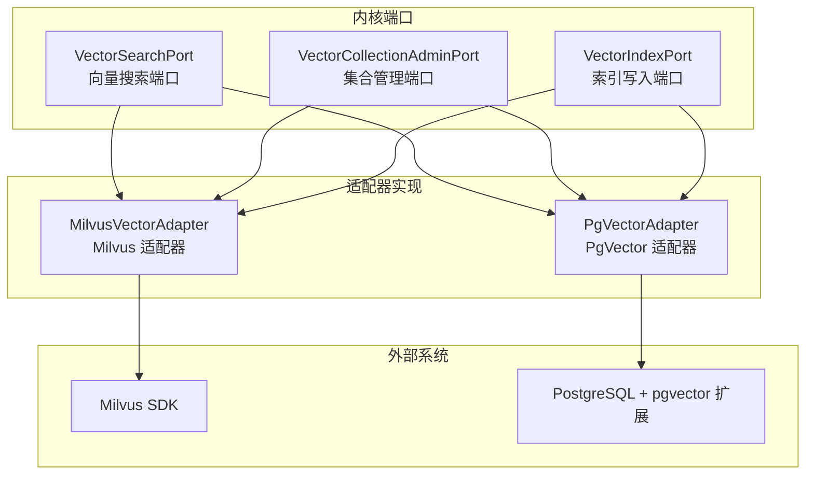
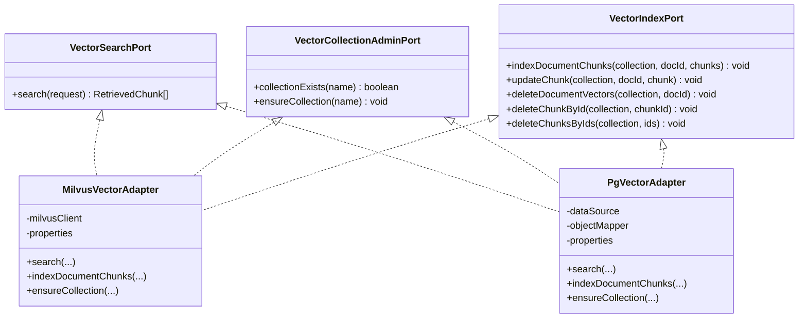
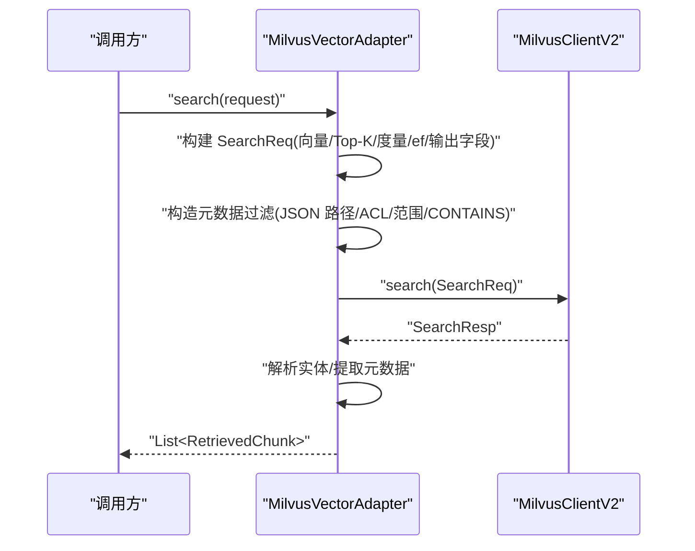
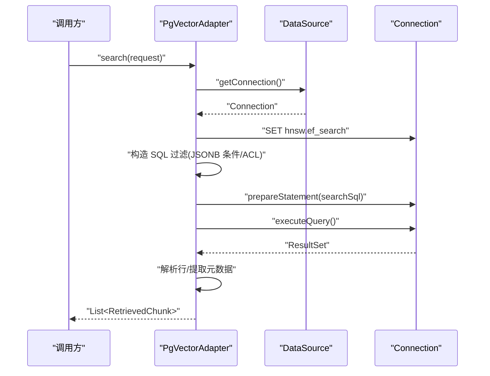
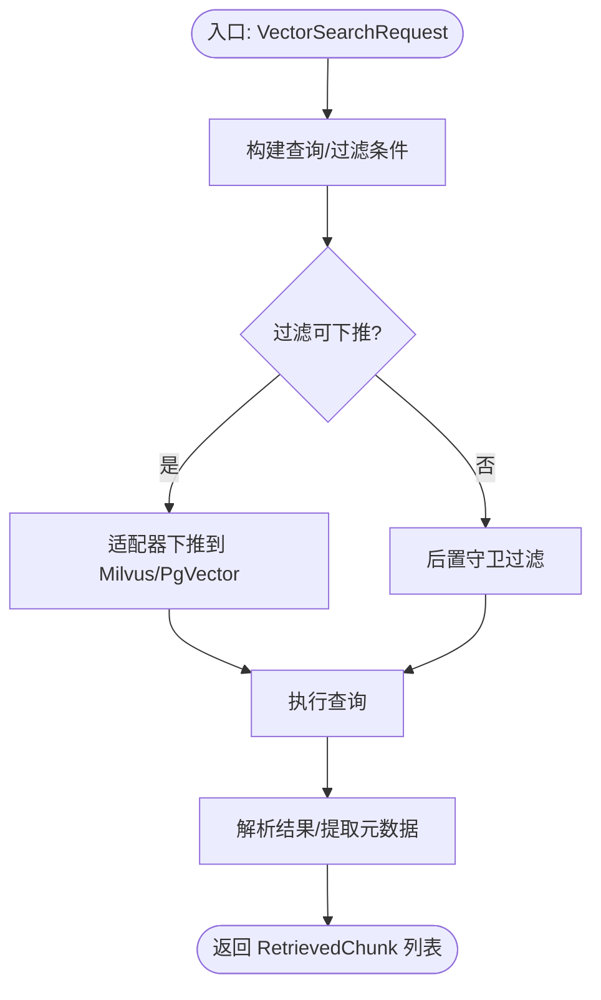
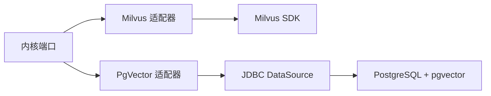

# 向量数据库适配器

<cite>
**本文引用的文件**
- [VectorSearchPort.java](file://seahorse-agent-kernel/src/main/java/com/miracle/ai/seahorse/agent/ports/outbound/vector/VectorSearchPort.java)
- [VectorCollectionAdminPort.java](file://seahorse-agent-kernel/src/main/java/com/miracle/ai/seahorse/agent/ports/outbound/vector/VectorCollectionAdminPort.java)
- [VectorIndexPort.java](file://seahorse-agent-kernel/src/main/java/com/miracle/ai/seahorse/agent/ports/outbound/vector/VectorIndexPort.java)
- [MilvusVectorAdapter.java](file://seahorse-agent-adapter-vector-milvus/src/main/java/com/miracle/ai/seahorse/agent/adapters/vector/milvus/MilvusVectorAdapter.java)
- [MilvusVectorProperties.java](file://seahorse-agent-adapter-vector-milvus/src/main/java/com/miracle/ai/seahorse/agent/adapters/vector/milvus/MilvusVectorProperties.java)
- [PgVectorAdapter.java](file://seahorse-agent-adapter-vector-pgvector/src/main/java/com/miracle/ai/seahorse/agent/adapters/vector/pgvector/PgVectorAdapter.java)
- [PgVectorProperties.java](file://seahorse-agent-adapter-vector-pgvector/src/main/java/com/miracle/ai/seahorse/agent/adapters/vector/pgvector/PgVectorProperties.java)
- [MilvusVectorAdapterTests.java](file://seahorse-agent-adapter-vector-milvus/src/test/java/com/miracle/ai/seahorse/agent/adapters/vector/milvus/MilvusVectorAdapterTests.java)
- [PgVectorAdapterTests.java](file://seahorse-agent-adapter-vector-pgvector/src/test/java/com/miracle/ai/seahorse/agent/adapters/vector/pgvector/PgVectorAdapterTests.java)
</cite>

## 目录
1. [简介](#简介)
2. [项目结构](#项目结构)
3. [核心组件](#核心组件)
4. [架构总览](#架构总览)
5. [详细组件分析](#详细组件分析)
6. [依赖分析](#依赖分析)
7. [性能考虑](#性能考虑)
8. [故障排查指南](#故障排查指南)
9. [结论](#结论)
10. [附录](#附录)

## 简介
本技术文档面向向量数据库适配器，系统阐述 Milvus 与 PgVector 两种适配器的实现架构、性能特征与最佳实践。文档重点包括：
- 向量搜索端口接口设计：向量插入、相似度搜索与索引管理
- 企业级 Milvus 适配器的分布式能力、高可用与大规模向量处理
- 轻量级 PgVector 适配器与 PostgreSQL 的深度集成优势
- 相似度计算与索引策略选择原则
- 配置优化指南与向量数据预处理、批量导入、实时更新最佳实践

## 项目结构
向量数据库适配器采用“端口隔离 + 适配器实现”的分层设计，核心端口位于 kernel 模块，具体适配器分别位于独立模块中，便于按需替换与扩展。

**图表来源**
- [VectorSearchPort.java:30-39](file://seahorse-agent-kernel/src/main/java/com/miracle/ai/seahorse/agent/ports/outbound/vector/VectorSearchPort.java#L30-L39)
- [VectorCollectionAdminPort.java:25-41](file://seahorse-agent-kernel/src/main/java/com/miracle/ai/seahorse/agent/ports/outbound/vector/VectorCollectionAdminPort.java#L25-L41)
- [VectorIndexPort.java:30-73](file://seahorse-agent-kernel/src/main/java/com/miracle/ai/seahorse/agent/ports/outbound/vector/VectorIndexPort.java#L30-L73)
- [MilvusVectorAdapter.java:72-95](file://seahorse-agent-adapter-vector-milvus/src/main/java/com/miracle/ai/seahorse/agent/adapters/vector/milvus/MilvusVectorAdapter.java#L72-L95)
- [PgVectorAdapter.java:60-81](file://seahorse-agent-adapter-vector-pgvector/src/main/java/com/miracle/ai/seahorse/agent/adapters/vector/pgvector/PgVectorAdapter.java#L60-L81)

**章节来源**
- [VectorSearchPort.java:24-39](file://seahorse-agent-kernel/src/main/java/com/miracle/ai/seahorse/agent/ports/outbound/vector/VectorSearchPort.java#L24-L39)
- [VectorCollectionAdminPort.java:20-41](file://seahorse-agent-kernel/src/main/java/com/miracle/ai/seahorse/agent/ports/outbound/vector/VectorCollectionAdminPort.java#L20-L41)
- [VectorIndexPort.java:24-73](file://seahorse-agent-kernel/src/main/java/com/miracle/ai/seahorse/agent/ports/outbound/vector/VectorIndexPort.java#L24-L73)

## 核心组件
- 向量搜索端口：定义统一的向量检索接口，屏蔽底层数据库差异。
- 集合管理端口：封装集合存在性检查与确保创建逻辑，避免直接依赖具体 SDK。
- 索引写入端口：抽象批量/单条向量索引的新增、更新、删除操作，统一入库链路。

这些端口被 Milvus 与 PgVector 适配器共同实现，形成可插拔的向量存储后端。

**章节来源**
- [VectorSearchPort.java:24-39](file://seahorse-agent-kernel/src/main/java/com/miracle/ai/seahorse/agent/ports/outbound/vector/VectorSearchPort.java#L24-L39)
- [VectorCollectionAdminPort.java:20-41](file://seahorse-agent-kernel/src/main/java/com/miracle/ai/seahorse/agent/ports/outbound/vector/VectorCollectionAdminPort.java#L20-L41)
- [VectorIndexPort.java:24-73](file://seahorse-agent-kernel/src/main/java/com/miracle/ai/seahorse/agent/ports/outbound/vector/VectorIndexPort.java#L24-L73)

## 架构总览
适配器通过统一端口对接不同向量数据库，内部实现分别封装各自 SDK/SQL 方言，确保上层应用与配置驱动的可替换性。

**图表来源**
- [MilvusVectorAdapter.java:72-95](file://seahorse-agent-adapter-vector-milvus/src/main/java/com/miracle/ai/seahorse/agent/adapters/vector/milvus/MilvusVectorAdapter.java#L72-L95)
- [PgVectorAdapter.java:60-81](file://seahorse-agent-adapter-vector-pgvector/src/main/java/com/miracle/ai/seahorse/agent/adapters/vector/pgvector/PgVectorAdapter.java#L60-L81)
- [VectorSearchPort.java:30-39](file://seahorse-agent-kernel/src/main/java/com/miracle/ai/seahorse/agent/ports/outbound/vector/VectorSearchPort.java#L30-L39)
- [VectorCollectionAdminPort.java:25-41](file://seahorse-agent-kernel/src/main/java/com/miracle/ai/seahorse/agent/ports/outbound/vector/VectorCollectionAdminPort.java#L25-L41)
- [VectorIndexPort.java:30-73](file://seahorse-agent-kernel/src/main/java/com/miracle/ai/seahorse/agent/ports/outbound/vector/VectorIndexPort.java#L30-L73)

## 详细组件分析

### Milvus 适配器
- 实现要点
  - 固定集合字段约定：id/content/metadata/embedding，保障默认 RAG 行为一致性
  - 搜索请求构建：向量字段、Top-K、度量类型、搜索参数 ef、输出字段
  - 元数据过滤：系统字段与表达式过滤下推至 Milvus JSON 路径，含 ACL 数组交集、NE 安全兜底、数组 CONTAINS 等
  - 集合与索引：Schema 字段、HNSW 索引参数（M、efConstruction、mmap）、一致性级别
  - 数据写入：批量插入、单条 upsert、按 docId/ChunkId 删除
  - 输入校验：维度匹配、空向量保护、集合名/文本非空约束

**图表来源**
- [MilvusVectorAdapter.java:97-111](file://seahorse-agent-adapter-vector-milvus/src/main/java/com/miracle/ai/seahorse/agent/adapters/vector/milvus/MilvusVectorAdapter.java#L97-L111)
- [MilvusVectorAdapter.java:193-206](file://seahorse-agent-adapter-vector-milvus/src/main/java/com/miracle/ai/seahorse/agent/adapters/vector/milvus/MilvusVectorAdapter.java#L193-L206)
- [MilvusVectorAdapter.java:208-222](file://seahorse-agent-adapter-vector-milvus/src/main/java/com/miracle/ai/seahorse/agent/adapters/vector/milvus/MilvusVectorAdapter.java#L208-L222)

- 性能与特性
  - HNSW 索引与 ef 控制：通过配置项调节召回与延迟权衡
  - mmap 支持：可选内存映射提升加载性能
  - 一致性级别：bounded 保证近实时一致性
  - JSON 元数据：支持复杂过滤与 ACL 下推，兼顾安全与灵活性

- 配置要点
  - 维度、度量类型、内容字段最大长度、HNSW 参数、搜索 ef
  - 默认集合名与内容截断策略

**章节来源**
- [MilvusVectorAdapter.java:66-95](file://seahorse-agent-adapter-vector-milvus/src/main/java/com/miracle/ai/seahorse/agent/adapters/vector/milvus/MilvusVectorAdapter.java#L66-L95)
- [MilvusVectorAdapter.java:193-206](file://seahorse-agent-adapter-vector-milvus/src/main/java/com/miracle/ai/seahorse/agent/adapters/vector/milvus/MilvusVectorAdapter.java#L193-L206)
- [MilvusVectorAdapter.java:224-263](file://seahorse-agent-adapter-vector-milvus/src/main/java/com/miracle/ai/seahorse/agent/adapters/vector/milvus/MilvusVectorAdapter.java#L224-L263)
- [MilvusVectorAdapter.java:363-378](file://seahorse-agent-adapter-vector-milvus/src/main/java/com/miracle/ai/seahorse/agent/adapters/vector/milvus/MilvusVectorAdapter.java#L363-L378)
- [MilvusVectorProperties.java:22-41](file://seahorse-agent-adapter-vector-milvus/src/main/java/com/miracle/ai/seahorse/agent/adapters/vector/milvus/MilvusVectorProperties.java#L22-L41)

### PgVector 适配器
- 实现要点
  - 使用 PostgreSQL + pgvector 扩展，封装 ::vector 与距离函数
  - 搜索 SQL：设置 hnsw.ef_search，使用 embedding <=> ?::vector 计算余弦距离并排序
  - 元数据过滤：系统字段与表达式下推为 JSONB 条件，含 ACL 数组交集、IS DISTINCT FROM 兜底
  - 集合与索引：表存在性检查、自动创建表与 HNSW 索引
  - 写入：批量 upsert（ON CONFLICT），支持单条更新与多 ID 删除

**图表来源**
- [PgVectorAdapter.java:83-96](file://seahorse-agent-adapter-vector-pgvector/src/main/java/com/miracle/ai/seahorse/agent/adapters/vector/pgvector/PgVectorAdapter.java#L83-L96)
- [PgVectorAdapter.java:179-199](file://seahorse-agent-adapter-vector-pgvector/src/main/java/com/miracle/ai/seahorse/agent/adapters/vector/pgvector/PgVectorAdapter.java#L179-L199)
- [PgVectorAdapter.java:291-295](file://seahorse-agent-adapter-vector-pgvector/src/main/java/com/miracle/ai/seahorse/agent/adapters/vector/pgvector/PgVectorAdapter.java#L291-L295)

- 性能与特性
  - 与数据库共治：利用 PostgreSQL 连接池、事务与索引，适合已有 Postgres 基础设施
  - HNSW 索引：基于向量列的余弦距离索引，ef_search 可调
  - JSONB 元数据：支持灵活过滤与 ACL 下推，参数化避免注入风险

- 配置要点
  - 表名、向量维度
  - 自动建表与索引初始化

**章节来源**
- [PgVectorAdapter.java:60-81](file://seahorse-agent-adapter-vector-pgvector/src/main/java/com/miracle/ai/seahorse/agent/adapters/vector/pgvector/PgVectorAdapter.java#L60-L81)
- [PgVectorAdapter.java:179-199](file://seahorse-agent-adapter-vector-pgvector/src/main/java/com/miracle/ai/seahorse/agent/adapters/vector/pgvector/PgVectorAdapter.java#L179-L199)
- [PgVectorAdapter.java:297-306](file://seahorse-agent-adapter-vector-pgvector/src/main/java/com/miracle/ai/seahorse/agent/adapters/vector/pgvector/PgVectorAdapter.java#L297-L306)
- [PgVectorProperties.java:22-37](file://seahorse-agent-adapter-vector-pgvector/src/main/java/com/miracle/ai/seahorse/agent/adapters/vector/pgvector/PgVectorProperties.java#L22-L37)

### 端口接口设计与数据流
- 搜索流程：请求经端口进入适配器，构建查询条件与过滤表达式，调用底层存储，解析结果返回
- 索引流程：入库时批量写入/更新，支持按文档或单条删除
- 集合管理：检查是否存在，不存在则创建，确保索引参数与模式一致

**图表来源**
- [VectorSearchPort.java:30-39](file://seahorse-agent-kernel/src/main/java/com/miracle/ai/seahorse/agent/ports/outbound/vector/VectorSearchPort.java#L30-L39)
- [MilvusVectorAdapter.java:363-378](file://seahorse-agent-adapter-vector-milvus/src/main/java/com/miracle/ai/seahorse/agent/adapters/vector/milvus/MilvusVectorAdapter.java#L363-L378)
- [PgVectorAdapter.java:360-377](file://seahorse-agent-adapter-vector-pgvector/src/main/java/com/miracle/ai/seahorse/agent/adapters/vector/pgvector/PgVectorAdapter.java#L360-L377)

**章节来源**
- [VectorSearchPort.java:24-39](file://seahorse-agent-kernel/src/main/java/com/miracle/ai/seahorse/agent/ports/outbound/vector/VectorSearchPort.java#L24-L39)
- [VectorIndexPort.java:24-73](file://seahorse-agent-kernel/src/main/java/com/miracle/ai/seahorse/agent/ports/outbound/vector/VectorIndexPort.java#L24-L73)
- [VectorCollectionAdminPort.java:20-41](file://seahorse-agent-kernel/src/main/java/com/miracle/ai/seahorse/agent/ports/outbound/vector/VectorCollectionAdminPort.java#L20-L41)

## 依赖分析
- 适配器与端口：Milvus 与 PgVector 适配器均实现三个核心端口，解耦上层与底层实现
- 外部依赖：Milvus 适配器依赖 Milvus SDK；PgVector 适配器依赖 JDBC DataSource 与 PostgreSQL
- 过滤下推：两套适配器均对系统字段与表达式进行安全下推，避免用户输入直接拼接底层语法

**图表来源**
- [MilvusVectorAdapter.java:43-55](file://seahorse-agent-adapter-vector-milvus/src/main/java/com/miracle/ai/seahorse/agent/adapters/vector/milvus/MilvusVectorAdapter.java#L43-L55)
- [PgVectorAdapter.java:40-52](file://seahorse-agent-adapter-vector-pgvector/src/main/java/com/miracle/ai/seahorse/agent/adapters/vector/pgvector/PgVectorAdapter.java#L40-L52)

**章节来源**
- [MilvusVectorAdapter.java:43-55](file://seahorse-agent-adapter-vector-milvus/src/main/java/com/miracle/ai/seahorse/agent/adapters/vector/milvus/MilvusVectorAdapter.java#L43-L55)
- [PgVectorAdapter.java:40-52](file://seahorse-agent-adapter-vector-pgvector/src/main/java/com/miracle/ai/seahorse/agent/adapters/vector/pgvector/PgVectorAdapter.java#L40-L52)

## 性能考虑
- 相似度与索引策略
  - Milvus：HNSW 索引，M/efConstruction 控制索引质量与构建成本；cosine/inner_product/l2 可按场景选择
  - PgVector：HNSW 索引（向量列余弦 op），hnsw.ef_search 影响召回与延迟
- 查询性能调优
  - Top-K 与 ef/ef_search：增大可提升召回但增加延迟
  - 过滤下推：尽量使用系统字段与可编译表达式，减少后置过滤
  - 批量写入：入库阶段优先批量 upsert，降低往返开销
- 存储与容量
  - 内容字段截断与元数据序列化：避免超长字段与大对象影响写入性能
  - 索引参数：根据向量规模与硬件资源调整 HNSW 参数

[本节为通用性能建议，无需特定文件引用]

## 故障排查指南
- 常见问题定位
  - 空向量或维度不匹配：适配器会进行严格校验，检查 embedding 与配置维度一致
  - 集合/表不存在：通过集合管理端口 ensureCollection/collectionExists 确认初始化
  - 过滤表达式异常：确认字段键名符合规则，避免非法字符
- 单元测试参考
  - Milvus：验证 ACL 下推、NE 兜底、数组 CONTAINS、ef 配置、Schema 与索引参数
  - PgVector：验证 ACL 下推（数组交集+标量兼容）、NE 兜底、LIKE CONTAINS、JSONB 键存在

**章节来源**
- [MilvusVectorAdapterTests.java:55-130](file://seahorse-agent-adapter-vector-milvus/src/test/java/com/miracle/ai/seahorse/agent/adapters/vector/milvus/MilvusVectorAdapterTests.java#L55-L130)
- [PgVectorAdapterTests.java:53-106](file://seahorse-agent-adapter-vector-pgvector/src/test/java/com/miracle/ai/seahorse/agent/adapters/vector/pgvector/PgVectorAdapterTests.java#L53-L106)

## 结论
- Milvus 适配器提供企业级分布式能力与高性能 HNSW 检索，适合大规模向量场景
- PgVector 适配器与 PostgreSQL 深度集成，适合已有数据库基础设施与中小规模场景
- 通过统一端口与严格的过滤下推，系统在安全性与可维护性方面具备良好平衡

[本节为总结性内容，无需特定文件引用]

## 附录

### 向量相似度与索引策略选择原则
- 场景导向
  - 高召回优先：增大 ef/ef_search、Top-K
  - 低延迟优先：减小 ef/ef_search、Top-K
- 度量类型
  - 文本相似：余弦距离通常效果稳定
  - 特征分布：内积/点积与 L2 视具体嵌入范式而定
- 索引参数
  - HNSW：M 控制连边宽度，efConstruction 控制构建质量，mmap 提升加载

[本节为通用指导，无需特定文件引用]

### 配置优化指南
- 维度设置
  - 与 Embedding 模型输出一致，避免运行时报错
- 索引类型选择
  - Milvus：HNSW 为主，结合 ef/efConstruction 与 mmap
  - PgVector：HNSW（向量余弦 op）
- 查询性能调优
  - 合理设置 Top-K 与 ef/ef_search
  - 优先使用系统字段与可编译表达式进行过滤下推

**章节来源**
- [MilvusVectorProperties.java:22-41](file://seahorse-agent-adapter-vector-milvus/src/main/java/com/miracle/ai/seahorse/agent/adapters/vector/milvus/MilvusVectorProperties.java#L22-L41)
- [PgVectorProperties.java:22-37](file://seahorse-agent-adapter-vector-pgvector/src/main/java/com/miracle/ai/seahorse/agent/adapters/vector/pgvector/PgVectorProperties.java#L22-L37)

### 向量数据预处理、批量导入与实时更新最佳实践
- 预处理
  - 维度校验与归一化（视模型要求）
  - 元数据清洗与键名规范化
- 批量导入
  - Milvus：批量 insert/upsert
  - PgVector：批量 upsert（ON CONFLICT）
- 实时更新
  - 单条 update/insert
  - 按文档删除后重新导入，或按 chunkId 精确更新

**章节来源**
- [MilvusVectorAdapter.java:114-133](file://seahorse-agent-adapter-vector-milvus/src/main/java/com/miracle/ai/seahorse/agent/adapters/vector/milvus/MilvusVectorAdapter.java#L114-L133)
- [PgVectorAdapter.java:98-125](file://seahorse-agent-adapter-vector-pgvector/src/main/java/com/miracle/ai/seahorse/agent/adapters/vector/pgvector/PgVectorAdapter.java#L98-L125)