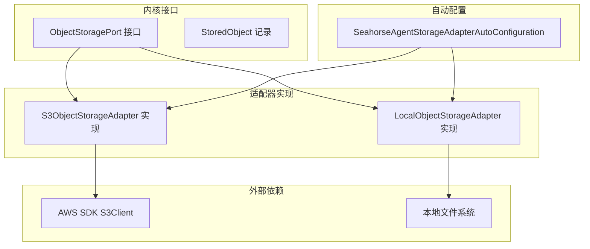
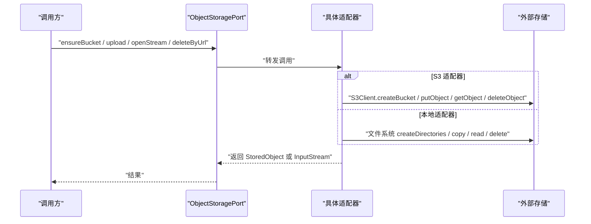
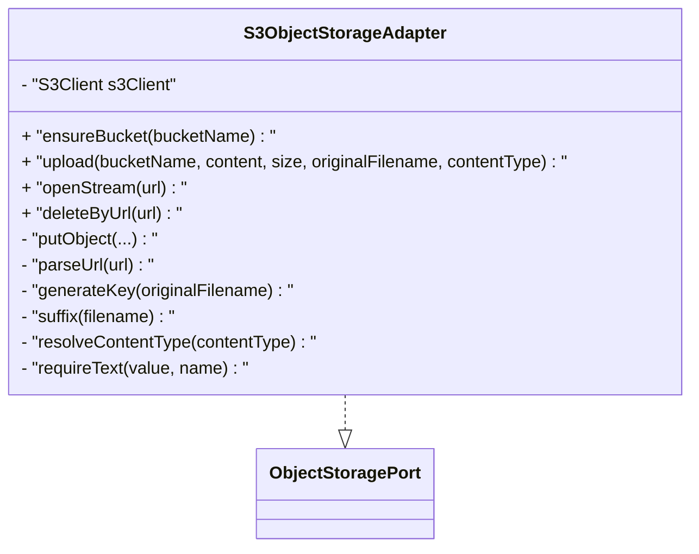
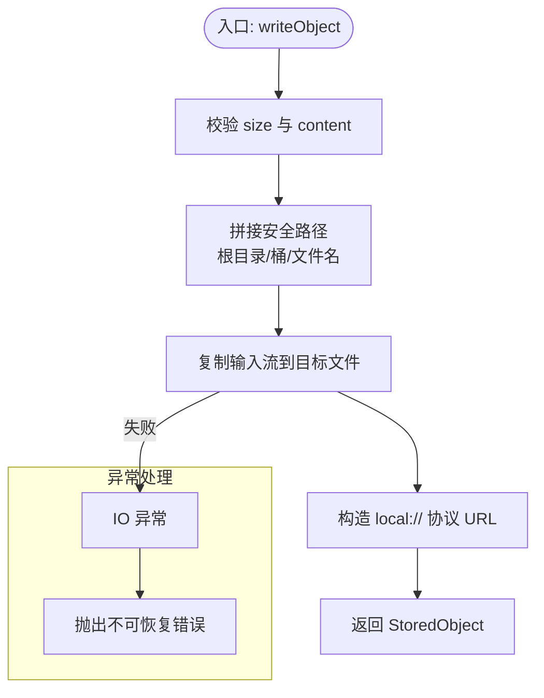
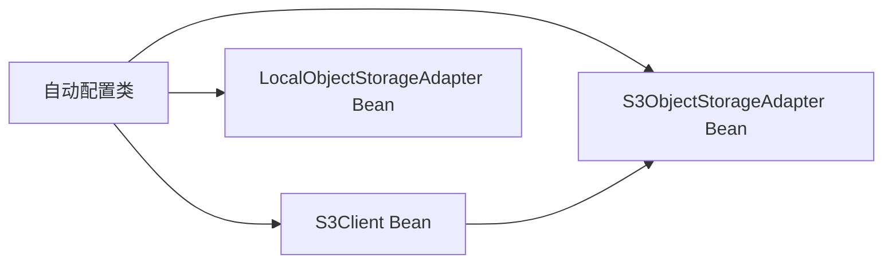
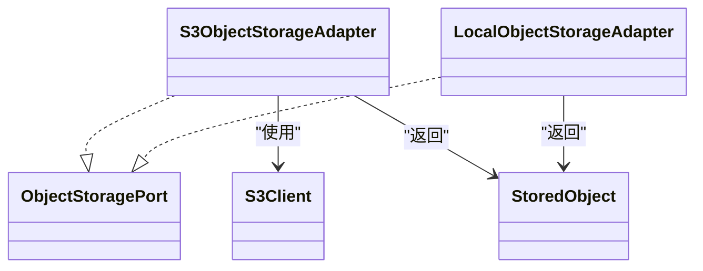

# 存储适配器

<cite>
**本文引用的文件**
- [S3ObjectStorageAdapter.java](file://seahorse-agent-adapter-storage-s3/src/main/java/com/miracle/ai/seahorse/agent/adapters/storage/s3/S3ObjectStorageAdapter.java)
- [LocalObjectStorageAdapter.java](file://seahorse-agent-adapter-storage-local/src/main/java/com/miracle/ai/seahorse/agent/adapters/storage/local/LocalObjectStorageAdapter.java)
- [ObjectStoragePort.java](file://seahorse-agent-kernel/src/main/java/com/miracle/ai/seahorse/agent/ports/outbound/storage/ObjectStoragePort.java)
- [StoredObject.java](file://seahorse-agent-kernel/src/main/java/com/miracle/ai/seahorse/agent/ports/outbound/storage/StoredObject.java)
- [SeahorseAgentStorageAdapterAutoConfiguration.java](file://seahorse-agent-spring-boot-starter/src/main/java/com/miracle/ai/seahorse/agent/adapters/spring/SeahorseAgentStorageAdapterAutoConfiguration.java)
- [application.properties](file://seahorse-agent-spring-boot-starter/src/main/resources/application.properties)
- [ObjectStoragePortTests.java](file://seahorse-agent-tests/src/test/java/com/miracle/ai/seahorse/agent/kernel/ports/outbound/storage/ObjectStoragePortTests.java)
</cite>

## 目录
1. [引言](#引言)
2. [项目结构](#项目结构)
3. [核心组件](#核心组件)
4. [架构总览](#架构总览)
5. [详细组件分析](#详细组件分析)
6. [依赖关系分析](#依赖关系分析)
7. [性能考量](#性能考量)
8. [故障排查指南](#故障排查指南)
9. [结论](#结论)
10. [附录](#附录)

## 引言
本文件面向开发者与运维人员，系统化梳理存储适配器的设计与实现，重点覆盖两类适配器：S3 对象存储适配器与本地文件系统适配器。文档从接口设计、实现原理、配置方法、安全与性能优化、成本与故障恢复等方面进行深入说明，并提供可视化图示帮助理解。

## 项目结构
存储适配器位于独立模块中，遵循“内核接口 + 适配器实现 + 自动配置”的分层组织方式：
- 内核接口定义于 kernel 模块，统一抽象对象存储能力（上传、下载、删除、桶/目录确保）。
- 适配器分别在 local 与 s3 两个模块中实现，绑定到同一接口。
- Spring Boot 自动配置模块负责根据属性装配 S3 客户端与选择适配器 Bean。

图表来源
- [ObjectStoragePort.java:25-55](file://seahorse-agent-kernel/src/main/java/com/miracle/ai/seahorse/agent/ports/outbound/storage/ObjectStoragePort.java#L25-L55)
- [StoredObject.java:28-28](file://seahorse-agent-kernel/src/main/java/com/miracle/ai/seahorse/agent/ports/outbound/storage/StoredObject.java#L28-L28)
- [S3ObjectStorageAdapter.java:37-145](file://seahorse-agent-adapter-storage-s3/src/main/java/com/miracle/ai/seahorse/agent/adapters/storage/s3/S3ObjectStorageAdapter.java#L37-L145)
- [LocalObjectStorageAdapter.java:34-122](file://seahorse-agent-adapter-storage-local/src/main/java/com/miracle/ai/seahorse/agent/adapters/storage/local/LocalObjectStorageAdapter.java#L34-L122)
- [SeahorseAgentStorageAdapterAutoConfiguration.java:49-99](file://seahorse-agent-spring-boot-starter/src/main/java/com/miracle/ai/seahorse/agent/adapters/spring/SeahorseAgentStorageAdapterAutoConfiguration.java#L49-L99)

章节来源
- [ObjectStoragePort.java:25-55](file://seahorse-agent-kernel/src/main/java/com/miracle/ai/seahorse/agent/ports/outbound/storage/ObjectStoragePort.java#L25-L55)
- [SeahorseAgentStorageAdapterAutoConfiguration.java:49-99](file://seahorse-agent-spring-boot-starter/src/main/java/com/miracle/ai/seahorse/agent/adapters/spring/SeahorseAgentStorageAdapterAutoConfiguration.java#L49-L99)

## 核心组件
- 对象存储端口接口：定义统一能力集，包括 ensureBucket、upload、reliableUpload、openStream、deleteByUrl。
- 存储对象记录：封装上传后的对象元信息（URL、类型、大小、原始文件名）。
- S3 适配器：基于 AWS SDK 的 S3Client 实现，支持桶创建、对象上传、下载、删除与 URL 解析。
- 本地适配器：基于本地文件系统实现，支持目录确保、对象写入、流式读取、删除与路径安全解析。
- 自动配置：依据配置属性动态装配 S3Client 与选择适配器 Bean；支持本地与 S3 两种类型。

章节来源
- [ObjectStoragePort.java:25-55](file://seahorse-agent-kernel/src/main/java/com/miracle/ai/seahorse/agent/ports/outbound/storage/ObjectStoragePort.java#L25-L55)
- [StoredObject.java:28-28](file://seahorse-agent-kernel/src/main/java/com/miracle/ai/seahorse/agent/ports/outbound/storage/StoredObject.java#L28-L28)
- [S3ObjectStorageAdapter.java:37-145](file://seahorse-agent-adapter-storage-s3/src/main/java/com/miracle/ai/seahorse/agent/adapters/storage/s3/S3ObjectStorageAdapter.java#L37-L145)
- [LocalObjectStorageAdapter.java:34-122](file://seahorse-agent-adapter-storage-local/src/main/java/com/miracle/ai/seahorse/agent/adapters/storage/local/LocalObjectStorageAdapter.java#L34-L122)
- [SeahorseAgentStorageAdapterAutoConfiguration.java:49-99](file://seahorse-agent-spring-boot-starter/src/main/java/com/miracle/ai/seahorse/agent/adapters/spring/SeahorseAgentStorageAdapterAutoConfiguration.java#L49-L99)

## 架构总览
下图展示调用链与依赖关系：上层业务通过 ObjectStoragePort 调用，S3 或本地适配器完成具体操作；Spring 自动配置根据属性决定是否创建 S3Client 并注入对应适配器。

图表来源
- [ObjectStoragePort.java:25-55](file://seahorse-agent-kernel/src/main/java/com/miracle/ai/seahorse/agent/ports/outbound/storage/ObjectStoragePort.java#L25-L55)
- [S3ObjectStorageAdapter.java:47-96](file://seahorse-agent-adapter-storage-s3/src/main/java/com/miracle/ai/seahorse/agent/adapters/storage/s3/S3ObjectStorageAdapter.java#L47-L96)
- [LocalObjectStorageAdapter.java:49-91](file://seahorse-agent-adapter-storage-local/src/main/java/com/miracle/ai/seahorse/agent/adapters/storage/local/LocalObjectStorageAdapter.java#L49-L91)

## 详细组件分析

### 对象存储端口接口设计
- 能力边界清晰：确保桶/目录存在、上传、可靠上传（默认委托给普通上传）、打开流、按 URL 删除。
- 可扩展性：默认 ensureBucket 与 reliableUpload 为空实现或委托，仅在适配器具备真实能力时覆盖。
- 元数据承载：通过 StoredObject 返回 URL、类型、大小与原始文件名，便于上层使用。

章节来源
- [ObjectStoragePort.java:25-55](file://seahorse-agent-kernel/src/main/java/com/miracle/ai/seahorse/agent/ports/outbound/storage/ObjectStoragePort.java#L25-L55)
- [StoredObject.java:28-28](file://seahorse-agent-kernel/src/main/java/com/miracle/ai/seahorse/agent/ports/outbound/storage/StoredObject.java#L28-L28)

### S3 对象存储适配器
- 桶管理：ensureBucket 支持幂等创建，捕获已归属当前账户与已存在但非归属的异常，保证行为可预测。
- 上传流程：生成唯一键（保留原始后缀），设置内容类型，调用 S3Client.putObject，返回包含 s3:// 协议 URL 的 StoredObject。
- 下载与删除：parseUrl 解析 s3:// 协议，提取桶与键，分别调用 getObject 与 deleteObject。
- URL 规范：统一以 s3://<bucket>/<key> 形式返回，便于跨模块传递与持久化。
- 关键实现要点：
  - 键生成：基于 UUID 与原始文件后缀组合，避免冲突并保留类型信息。
  - 内容类型：若未指定则回退为二进制类型，确保客户端可正确处理。
  - 参数校验：对空值与负数大小进行防御式检查。

图表来源
- [S3ObjectStorageAdapter.java:37-145](file://seahorse-agent-adapter-storage-s3/src/main/java/com/miracle/ai/seahorse/agent/adapters/storage/s3/S3ObjectStorageAdapter.java#L37-L145)
- [ObjectStoragePort.java:25-55](file://seahorse-agent-kernel/src/main/java/com/miracle/ai/seahorse/agent/ports/outbound/storage/ObjectStoragePort.java#L25-L55)

章节来源
- [S3ObjectStorageAdapter.java:47-145](file://seahorse-agent-adapter-storage-s3/src/main/java/com/miracle/ai/seahorse/agent/adapters/storage/s3/S3ObjectStorageAdapter.java#L47-L145)

### 本地对象存储适配器
- 目录管理：ensureBucket 创建根目录下的安全路径，支持默认桶名与路径规范化。
- 上传流程：生成随机文件名（UUID + 原始文件名片段），写入目标路径，返回 local:// 协议 URL 的 StoredObject。
- 流式读取：openStream 基于 URL 解析定位文件，异常时抛出不可恢复错误。
- 删除操作：deleteByUrl 删除文件，不存在时忽略。
- 路径安全：resolveUrl 校验 URL 前缀与相对路径规范化，防止目录穿越逃逸根目录。
- 默认行为：未显式设置根目录时，默认使用系统临时目录下的子目录。

图表来源
- [LocalObjectStorageAdapter.java:82-100](file://seahorse-agent-adapter-storage-local/src/main/java/com/miracle/ai/seahorse/agent/adapters/storage/local/LocalObjectStorageAdapter.java#L82-L100)

章节来源
- [LocalObjectStorageAdapter.java:49-122](file://seahorse-agent-adapter-storage-local/src/main/java/com/miracle/ai/seahorse/agent/adapters/storage/local/LocalObjectStorageAdapter.java#L49-L122)

### 配置方法与自动装配
- 类型选择：通过属性选择适配器类型（local 或 s3），默认优先 S3。
- S3 客户端参数：
  - 区域：region（默认 us-east-1）
  - 终端节点：endpoint（可选，用于兼容 MinIO 等）
  - 凭据：access-key 与 secret-key（可选，静态凭据提供者）
  - 路径风格访问：开启 pathStyleAccessEnabled（兼容部分对象存储服务）
- 本地适配器参数：
  - 根目录：seahorse-agent.adapters.storage.local.root（默认为系统临时目录下的子目录）

图表来源
- [SeahorseAgentStorageAdapterAutoConfiguration.java:51-97](file://seahorse-agent-spring-boot-starter/src/main/java/com/miracle/ai/seahorse/agent/adapters/spring/SeahorseAgentStorageAdapterAutoConfiguration.java#L51-L97)

章节来源
- [SeahorseAgentStorageAdapterAutoConfiguration.java:51-97](file://seahorse-agent-spring-boot-starter/src/main/java/com/miracle/ai/seahorse/agent/adapters/spring/SeahorseAgentStorageAdapterAutoConfiguration.java#L51-L97)
- [application.properties:1-8](file://seahorse-agent-spring-boot-starter/src/main/resources/application.properties#L1-L8)

## 依赖关系分析
- 适配器与接口：S3 与本地适配器均实现 ObjectStoragePort，解耦上层业务与底层存储。
- 外部依赖：S3 适配器依赖 AWS SDK S3Client；本地适配器依赖 Java NIO 文件系统。
- 自动装配条件：基于属性与类存在性进行条件装配，避免冲突并支持多适配器共存。

图表来源
- [ObjectStoragePort.java:25-55](file://seahorse-agent-kernel/src/main/java/com/miracle/ai/seahorse/agent/ports/outbound/storage/ObjectStoragePort.java#L25-L55)
- [S3ObjectStorageAdapter.java:37-45](file://seahorse-agent-adapter-storage-s3/src/main/java/com/miracle/ai/seahorse/agent/adapters/storage/s3/S3ObjectStorageAdapter.java#L37-L45)
- [LocalObjectStorageAdapter.java:34-47](file://seahorse-agent-adapter-storage-local/src/main/java/com/miracle/ai/seahorse/agent/adapters/storage/local/LocalObjectStorageAdapter.java#L34-L47)
- [StoredObject.java:28-28](file://seahorse-agent-kernel/src/main/java/com/miracle/ai/seahorse/agent/ports/outbound/storage/StoredObject.java#L28-L28)

章节来源
- [ObjectStoragePort.java:25-55](file://seahorse-agent-kernel/src/main/java/com/miracle/ai/seahorse/agent/ports/outbound/storage/ObjectStoragePort.java#L25-L55)
- [S3ObjectStorageAdapter.java:37-45](file://seahorse-agent-adapter-storage-s3/src/main/java/com/miracle/ai/seahorse/agent/adapters/storage/s3/S3ObjectStorageAdapter.java#L37-L45)
- [LocalObjectStorageAdapter.java:34-47](file://seahorse-agent-adapter-storage-local/src/main/java/com/miracle/ai/seahorse/agent/adapters/storage/local/LocalObjectStorageAdapter.java#L34-L47)

## 性能考量
- 并发上传
  - S3 适配器：上传采用单对象 putObject，适合小到中等文件；大文件建议使用 S3 SDK 的分段上传（Multi-Part Upload）以提升吞吐与可靠性。
  - 本地适配器：文件写入为顺序 IO，可通过批量任务与合适的缓冲策略优化。
- 断点续传
  - S3 适配器：默认未实现断点续传；如需，可在上层业务中结合分段上传与进度记录实现。
  - 本地适配器：默认不支持断点续传，可在外层引入重试与校验机制。
- 缓存机制
  - 本地适配器：可利用文件系统缓存与 JVM 缓存减少重复读取；注意缓存失效与一致性。
  - S3 适配器：可在外层引入对象级缓存（如内存/Redis）与预热策略。
- 传输优化
  - S3 适配器：启用路径风格访问以兼容多种对象存储；合理设置超时与重试策略。
  - 本地适配器：避免频繁小文件写入，合并写入或使用临时文件再原子移动。

[本节为通用性能建议，不直接分析具体文件]

## 故障排查指南
- 常见错误与定位
  - S3：桶已存在但非当前账户拥有会触发状态异常；URL 非 s3:// 会被拒绝；负 size 抛出非法参数异常。
  - 本地：URL 不以 local:// 开头或解析后逃逸根目录会触发非法参数异常；IO 异常导致写入/读取/删除失败。
- 可观测性与测试
  - 接口默认行为：reliableUpload 默认委托 upload，单元测试验证了该行为。
- 建议排查步骤
  - 核对配置属性与环境变量（类型、区域、终端节点、凭据）。
  - 检查网络连通性与 IAM 权限。
  - 查看日志中的异常堆栈与参数校验信息。
  - 对大文件场景评估是否需要分段上传或调整缓冲区大小。

章节来源
- [S3ObjectStorageAdapter.java:47-145](file://seahorse-agent-adapter-storage-s3/src/main/java/com/miracle/ai/seahorse/agent/adapters/storage/s3/S3ObjectStorageAdapter.java#L47-L145)
- [LocalObjectStorageAdapter.java:64-122](file://seahorse-agent-adapter-storage-local/src/main/java/com/miracle/ai/seahorse/agent/adapters/storage/local/LocalObjectStorageAdapter.java#L64-L122)
- [ObjectStoragePortTests.java:30-66](file://seahorse-agent-tests/src/test/java/com/miracle/ai/seahorse/agent/kernel/ports/outbound/storage/ObjectStoragePortTests.java#L30-L66)

## 结论
本存储适配器体系通过统一接口屏蔽底层差异，S3 适配器提供云原生能力与可扩展的分段上传基础，本地适配器提供简单可靠的文件系统能力。配合自动配置与属性驱动，可在不同环境中快速切换与部署。建议在生产中结合分段上传、缓存与重试策略优化性能，并完善权限与备份方案以保障安全与可用性。

[本节为总结性内容，不直接分析具体文件]

## 附录

### 接口与实现一览
- ObjectStoragePort：统一能力定义（确保桶、上传、可靠上传、打开流、删除）。
- StoredObject：上传结果元数据载体。
- S3ObjectStorageAdapter：S3 实现，支持桶创建、对象上传/下载/删除、URL 解析与内容类型处理。
- LocalObjectStorageAdapter：本地实现，支持目录确保、对象写入/读取/删除、路径安全解析。

章节来源
- [ObjectStoragePort.java:25-55](file://seahorse-agent-kernel/src/main/java/com/miracle/ai/seahorse/agent/ports/outbound/storage/ObjectStoragePort.java#L25-L55)
- [StoredObject.java:28-28](file://seahorse-agent-kernel/src/main/java/com/miracle/ai/seahorse/agent/ports/outbound/storage/StoredObject.java#L28-L28)
- [S3ObjectStorageAdapter.java:37-145](file://seahorse-agent-adapter-storage-s3/src/main/java/com/miracle/ai/seahorse/agent/adapters/storage/s3/S3ObjectStorageAdapter.java#L37-L145)
- [LocalObjectStorageAdapter.java:34-122](file://seahorse-agent-adapter-storage-local/src/main/java/com/miracle/ai/seahorse/agent/adapters/storage/local/LocalObjectStorageAdapter.java#L34-L122)