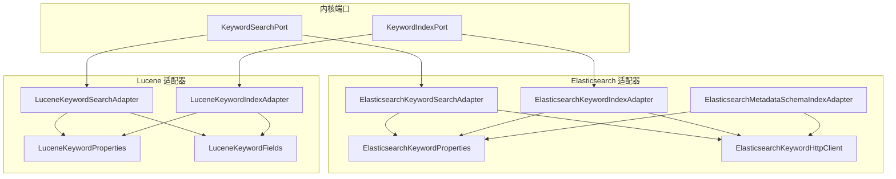
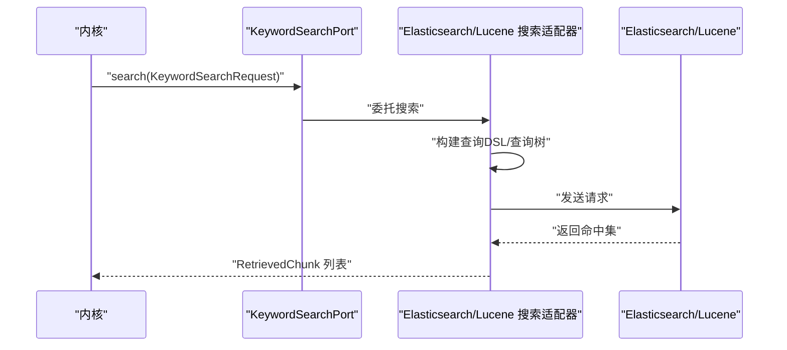
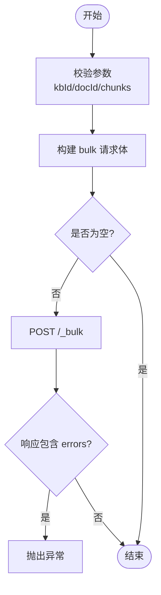
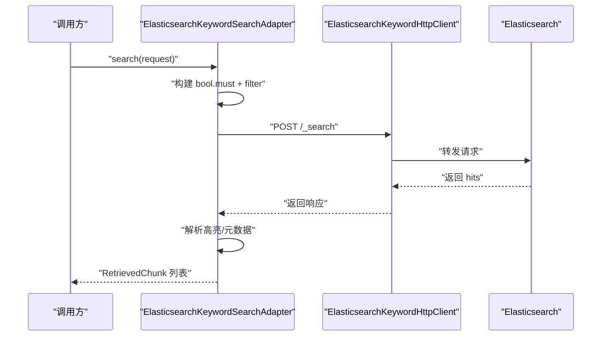
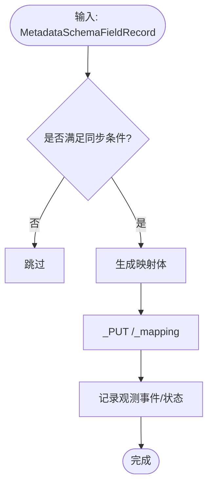
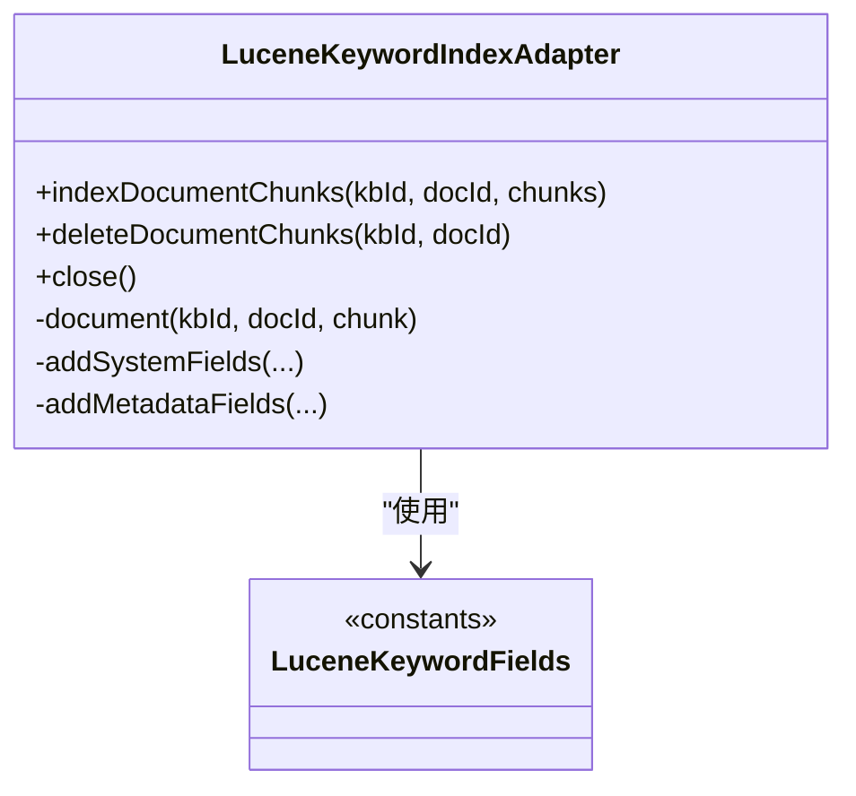
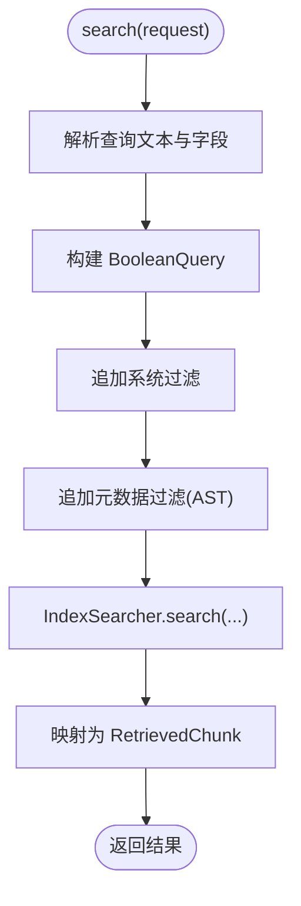
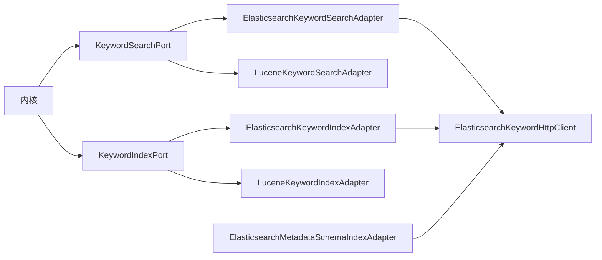

# 搜索适配器

<cite>
**本文引用的文件**
- [ElasticsearchKeywordIndexAdapter.java](file://seahorse-agent-adapter-search-elasticsearch/src/main/java/com/miracle/ai/seahorse/agent/adapters/search/elasticsearch/ElasticsearchKeywordIndexAdapter.java)
- [ElasticsearchKeywordSearchAdapter.java](file://seahorse-agent-adapter-search-elasticsearch/src/main/java/com/miracle/ai/seahorse/agent/adapters/search/elasticsearch/ElasticsearchKeywordSearchAdapter.java)
- [ElasticsearchMetadataSchemaIndexAdapter.java](file://seahorse-agent-adapter-search-elasticsearch/src/main/java/com/miracle/ai/seahorse/agent/adapters/search/elasticsearch/ElasticsearchMetadataSchemaIndexAdapter.java)
- [ElasticsearchKeywordProperties.java](file://seahorse-agent-adapter-search-elasticsearch/src/main/java/com/miracle/ai/seahorse/agent/adapters/search/elasticsearch/ElasticsearchKeywordProperties.java)
- [ElasticsearchKeywordHttpClient.java](file://seahorse-agent-adapter-search-elasticsearch/src/main/java/com/miracle/ai/seahorse/agent/adapters/search/elasticsearch/ElasticsearchKeywordHttpClient.java)
- [LuceneKeywordIndexAdapter.java](file://seahorse-agent-adapter-search-lucene/src/main/java/com/miracle/ai/seahorse/agent/adapters/search/lucene/LuceneKeywordIndexAdapter.java)
- [LuceneKeywordSearchAdapter.java](file://seahorse-agent-adapter-search-lucene/src/main/java/com/miracle/ai/seahorse/agent/adapters/search/lucene/LuceneKeywordSearchAdapter.java)
- [LuceneKeywordProperties.java](file://seahorse-agent-adapter-search-lucene/src/main/java/com/miracle/ai/seahorse/agent/adapters/search/lucene/LuceneKeywordProperties.java)
- [LuceneKeywordFields.java](file://seahorse-agent-adapter-search-lucene/src/main/java/com/miracle/ai/seahorse/agent/adapters/search/lucene/LuceneKeywordFields.java)
- [KeywordSearchPort.java](file://seahorse-agent-kernel/src/main/java/com/miracle/ai/seahorse/agent/ports/outbound/keyword/KeywordSearchPort.java)
- [KeywordIndexPort.java](file://seahorse-agent-kernel/src/main/java/com/miracle/ai/seahorse/agent/ports/outbound/keyword/KeywordIndexPort.java)
- [ElasticsearchKeywordIndexAdapterTests.java](file://seahorse-agent-adapter-search-elasticsearch/src/test/java/com/miracle/ai/seahorse/agent/adapters/search/elasticsearch/ElasticsearchKeywordIndexAdapterTests.java)
- [LuceneKeywordAdapterTests.java](file://seahorse-agent-adapter-search-lucene/src/test/java/com/miracle/ai/seahorse/agent/adapters/search/lucene/LuceneKeywordAdapterTests.java)
</cite>

## 目录
1. [简介](#简介)
2. [项目结构](#项目结构)
3. [核心组件](#核心组件)
4. [架构总览](#架构总览)
5. [详细组件分析](#详细组件分析)
6. [依赖关系分析](#依赖关系分析)
7. [性能考量](#性能考量)
8. [故障排查指南](#故障排查指南)
9. [结论](#结论)
10. [附录](#附录)

## 简介
本技术文档聚焦“搜索适配器”，系统性阐述两类关键词/BM25检索后端的实现与应用：Elasticsearch 与 Lucene。文档涵盖以下主题：
- 关键词索引端口接口设计：文档索引、全文搜索、聚合查询（本仓库以BM25检索为主，聚合查询见Elasticsearch适配器）
- Elasticsearch 适配器的分布式搜索能力：分片、副本、近实时搜索、映射同步与DSL构建
- Lucene 适配器的本地搜索实现与高性能文本处理
- 配置选项：分词器、映射、查询DSL
- 性能优化策略：索引优化、查询重写、缓存
- 结果排序、高亮、搜索建议的实现指南

## 项目结构
搜索适配器位于独立模块中，分别实现 Elasticsearch 与 Lucene 两个后端，并通过内核定义的端口对接上层检索流程。

图表来源
- [KeywordSearchPort.java:1-20](file://seahorse-agent-kernel/src/main/java/com/miracle/ai/seahorse/agent/ports/outbound/keyword/KeywordSearchPort.java#L1-L20)
- [KeywordIndexPort.java:1-46](file://seahorse-agent-kernel/src/main/java/com/miracle/ai/seahorse/agent/ports/outbound/keyword/KeywordIndexPort.java#L1-L46)
- [ElasticsearchKeywordIndexAdapter.java:37-139](file://seahorse-agent-adapter-search-elasticsearch/src/main/java/com/miracle/ai/seahorse/agent/adapters/search/elasticsearch/ElasticsearchKeywordIndexAdapter.java#L37-L139)
- [ElasticsearchKeywordSearchAdapter.java:53-342](file://seahorse-agent-adapter-search-elasticsearch/src/main/java/com/miracle/ai/seahorse/agent/adapters/search/elasticsearch/ElasticsearchKeywordSearchAdapter.java#L53-L342)
- [ElasticsearchMetadataSchemaIndexAdapter.java:38-310](file://seahorse-agent-adapter-search-elasticsearch/src/main/java/com/miracle/ai/seahorse/agent/adapters/search/elasticsearch/ElasticsearchMetadataSchemaIndexAdapter.java#L38-L310)
- [ElasticsearchKeywordProperties.java:29-80](file://seahorse-agent-adapter-search-elasticsearch/src/main/java/com/miracle/ai/seahorse/agent/adapters/search/elasticsearch/ElasticsearchKeywordProperties.java#L29-L80)
- [ElasticsearchKeywordHttpClient.java:38-122](file://seahorse-agent-adapter-search-elasticsearch/src/main/java/com/miracle/ai/seahorse/agent/adapters/search/elasticsearch/ElasticsearchKeywordHttpClient.java#L38-L122)
- [LuceneKeywordIndexAdapter.java:57-234](file://seahorse-agent-adapter-search-lucene/src/main/java/com/miracle/ai/seahorse/agent/adapters/search/lucene/LuceneKeywordIndexAdapter.java#L57-L234)
- [LuceneKeywordSearchAdapter.java:76-360](file://seahorse-agent-adapter-search-lucene/src/main/java/com/miracle/ai/seahorse/agent/adapters/search/lucene/LuceneKeywordSearchAdapter.java#L76-L360)
- [LuceneKeywordProperties.java:31-82](file://seahorse-agent-adapter-search-lucene/src/main/java/com/miracle/ai/seahorse/agent/adapters/search/lucene/LuceneKeywordProperties.java#L31-L82)
- [LuceneKeywordFields.java:20-43](file://seahorse-agent-adapter-search-lucene/src/main/java/com/miracle/ai/seahorse/agent/adapters/search/lucene/LuceneKeywordFields.java#L20-L43)

章节来源
- [KeywordSearchPort.java:1-20](file://seahorse-agent-kernel/src/main/java/com/miracle/ai/seahorse/agent/ports/outbound/keyword/KeywordSearchPort.java#L1-L20)
- [KeywordIndexPort.java:1-46](file://seahorse-agent-kernel/src/main/java/com/miracle/ai/seahorse/agent/ports/outbound/keyword/KeywordIndexPort.java#L1-L46)

## 核心组件
- 关键词索引端口（KeywordIndexPort）：定义文档块索引写入与删除能力，支持按文档重建与按知识库重建的扩展点。
- 关键词搜索端口（KeywordSearchPort）：定义基于BM25的关键词检索能力，返回标准化的检索结果对象。

章节来源
- [KeywordIndexPort.java:12-46](file://seahorse-agent-kernel/src/main/java/com/miracle/ai/seahorse/agent/ports/outbound/keyword/KeywordIndexPort.java#L12-L46)
- [KeywordSearchPort.java:12-19](file://seahorse-agent-kernel/src/main/java/com/miracle/ai/seahorse/agent/ports/outbound/keyword/KeywordSearchPort.java#L12-L19)

## 架构总览
Elasticsearch 与 Lucene 适配器均通过内核端口对外提供能力，内部实现遵循“配置驱动 + DSL 构建 + 客户端调用”的模式。Elasticsearch 适配器进一步提供元数据Schema映射同步能力，确保动态元数据的可检索性与一致性。

图表来源
- [ElasticsearchKeywordSearchAdapter.java:74-113](file://seahorse-agent-adapter-search-elasticsearch/src/main/java/com/miracle/ai/seahorse/agent/adapters/search/elasticsearch/ElasticsearchKeywordSearchAdapter.java#L74-L113)
- [LuceneKeywordSearchAdapter.java:95-116](file://seahorse-agent-adapter-search-lucene/src/main/java/com/miracle/ai/seahorse/agent/adapters/search/lucene/LuceneKeywordSearchAdapter.java#L95-L116)

## 详细组件分析

### Elasticsearch 关键词索引适配器
- 功能要点
  - 批量写入：将向量分片序列化为NDJSON，调用 _bulk 接口写入
  - 删除与重建：按 kb_id+doc_id 执行 _delete_by_query，保证同一文档的分片一致性
  - 文档结构：将元数据中的关键字段提升至顶层，便于ACL与系统过滤下推
  - 错误处理：显式检查 bulk 响应中的 errors 标记，失败即抛出异常

图表来源
- [ElasticsearchKeywordIndexAdapter.java:56-93](file://seahorse-agent-adapter-search-elasticsearch/src/main/java/com/miracle/ai/seahorse/agent/adapters/search/elasticsearch/ElasticsearchKeywordIndexAdapter.java#L56-L93)

章节来源
- [ElasticsearchKeywordIndexAdapter.java:37-139](file://seahorse-agent-adapter-search-elasticsearch/src/main/java/com/miracle/ai/seahorse/agent/adapters/search/elasticsearch/ElasticsearchKeywordIndexAdapter.java#L37-L139)

### Elasticsearch 关键词搜索适配器
- 功能要点
  - 查询DSL：基于 multi_match 构建布尔查询，支持 analyzer 与 minimum_should_match
  - 系统过滤：内置 enabled、tenant_id、kb_id、doc_id、collection_name、ACL 主体、文件类型、来源类型、时间范围等
  - 元数据过滤：消费内核编译后的过滤表达式（AND/字段相等/不等/包含/存在/范围/IN），映射到 ES 查询
  - 高亮：根据搜索字段生成高亮片段，使用自定义标签包裹
  - 响应解析：提取 _source 中的关键字段与高亮，组装 RetrievedChunk

图表来源
- [ElasticsearchKeywordSearchAdapter.java:74-113](file://seahorse-agent-adapter-search-elasticsearch/src/main/java/com/miracle/ai/seahorse/agent/adapters/search/elasticsearch/ElasticsearchKeywordSearchAdapter.java#L74-L113)
- [ElasticsearchKeywordHttpClient.java:54-89](file://seahorse-agent-adapter-search-elasticsearch/src/main/java/com/miracle/ai/seahorse/agent/adapters/search/elasticsearch/ElasticsearchKeywordHttpClient.java#L54-L89)

章节来源
- [ElasticsearchKeywordSearchAdapter.java:53-342](file://seahorse-agent-adapter-search-elasticsearch/src/main/java/com/miracle/ai/seahorse/agent/adapters/search/elasticsearch/ElasticsearchKeywordSearchAdapter.java#L53-L342)

### Elasticsearch 元数据Schema索引适配器
- 功能要点
  - 映射同步：仅对标记为可下推到关键词检索的字段进行映射更新
  - 动态严格映射：采用 dynamic=strict，避免意外字段进入索引
  - 支持策略：TEXT/EXACT/带keyword子字段的TEXT映射；兼容 metadata.xxxx.keyword 的搜索字段名
  - 观测与状态：记录同步事件与结果，便于可观测性与运维追踪

图表来源
- [ElasticsearchMetadataSchemaIndexAdapter.java:75-133](file://seahorse-agent-adapter-search-elasticsearch/src/main/java/com/miracle/ai/seahorse/agent/adapters/search/elasticsearch/ElasticsearchMetadataSchemaIndexAdapter.java#L75-L133)

章节来源
- [ElasticsearchMetadataSchemaIndexAdapter.java:38-310](file://seahorse-agent-adapter-search-elasticsearch/src/main/java/com/miracle/ai/seahorse/agent/adapters/search/elasticsearch/ElasticsearchMetadataSchemaIndexAdapter.java#L38-L310)

### Lucene 关键词索引适配器
- 功能要点
  - 本地嵌入式索引：基于 FSDirectory + IndexWriter，支持文档级重建与提交
  - 字段策略：内容字段存储为 TextField；系统字段与元数据字段分别存储为 StringField/TextField
  - 元数据兼容：原样存储 metadata JSON，并生成 metadata.* 与 metadata_text.* 字段，兼容 ES 风格搜索字段名
  - 删除：按 kb_id+doc_id 清理旧分片，避免重复召回

图表来源
- [LuceneKeywordIndexAdapter.java:57-234](file://seahorse-agent-adapter-search-lucene/src/main/java/com/miracle/ai/seahorse/agent/adapters/search/lucene/LuceneKeywordIndexAdapter.java#L57-L234)
- [LuceneKeywordFields.java:20-43](file://seahorse-agent-adapter-search-lucene/src/main/java/com/miracle/ai/seahorse/agent/adapters/search/lucene/LuceneKeywordFields.java#L20-L43)

章节来源
- [LuceneKeywordIndexAdapter.java:57-234](file://seahorse-agent-adapter-search-lucene/src/main/java/com/miracle/ai/seahorse/agent/adapters/search/lucene/LuceneKeywordIndexAdapter.java#L57-L234)

### Lucene 关键词搜索适配器
- 功能要点
  - 查询构建：MultiFieldQueryParser 组合 content 字段与 Boost；系统过滤与元数据过滤均通过 Lucene 查询树实现
  - 过滤表达式：消费内核编译后的 AST，支持 AND、EQ、NE、IN、RANGE、CONTAINS、EXISTS
  - 结果解析：从 StoredFields 提取内容与元数据，组装 RetrievedChunk
  - 异常处理：索引不存在返回空结果；IO/解析异常转为运行时异常

图表来源
- [LuceneKeywordSearchAdapter.java:95-116](file://seahorse-agent-adapter-search-lucene/src/main/java/com/miracle/ai/seahorse/agent/adapters/search/lucene/LuceneKeywordSearchAdapter.java#L95-L116)
- [LuceneKeywordSearchAdapter.java:124-186](file://seahorse-agent-adapter-search-lucene/src/main/java/com/miracle/ai/seahorse/agent/adapters/search/lucene/LuceneKeywordSearchAdapter.java#L124-L186)

章节来源
- [LuceneKeywordSearchAdapter.java:76-360](file://seahorse-agent-adapter-search-lucene/src/main/java/com/miracle/ai/seahorse/agent/adapters/search/lucene/LuceneKeywordSearchAdapter.java#L76-L360)

## 依赖关系分析
- 端口契约
  - KeywordSearchPort：内核定义的统一搜索端口，屏蔽具体后端差异
  - KeywordIndexPort：内核定义的统一索引端口，支持按文档/知识库重建
- 适配器与外部依赖
  - Elasticsearch 适配器：依赖 OkHttp 发送 REST 请求，使用 Jackson 序列化/反序列化
  - Lucene 适配器：依赖 Lucene 查询解析器与索引读写器，使用 Jackson 存储元数据

图表来源
- [KeywordSearchPort.java:12-19](file://seahorse-agent-kernel/src/main/java/com/miracle/ai/seahorse/agent/ports/outbound/keyword/KeywordSearchPort.java#L12-L19)
- [KeywordIndexPort.java:12-46](file://seahorse-agent-kernel/src/main/java/com/miracle/ai/seahorse/agent/ports/outbound/keyword/KeywordIndexPort.java#L12-L46)
- [ElasticsearchKeywordSearchAdapter.java:53-72](file://seahorse-agent-adapter-search-elasticsearch/src/main/java/com/miracle/ai/seahorse/agent/adapters/search/elasticsearch/ElasticsearchKeywordSearchAdapter.java#L53-L72)
- [LuceneKeywordSearchAdapter.java:76-93](file://seahorse-agent-adapter-search-lucene/src/main/java/com/miracle/ai/seahorse/agent/adapters/search/lucene/LuceneKeywordSearchAdapter.java#L76-L93)
- [ElasticsearchKeywordIndexAdapter.java:37-54](file://seahorse-agent-adapter-search-elasticsearch/src/main/java/com/miracle/ai/seahorse/agent/adapters/search/elasticsearch/ElasticsearchKeywordIndexAdapter.java#L37-L54)
- [LuceneKeywordIndexAdapter.java:57-76](file://seahorse-agent-adapter-search-lucene/src/main/java/com/miracle/ai/seahorse/agent/adapters/search/lucene/LuceneKeywordIndexAdapter.java#L57-L76)

章节来源
- [ElasticsearchKeywordHttpClient.java:38-122](file://seahorse-agent-adapter-search-elasticsearch/src/main/java/com/miracle/ai/seahorse/agent/adapters/search/elasticsearch/ElasticsearchKeywordHttpClient.java#L38-L122)

## 性能考量
- 索引优化
  - Elasticsearch：合理设置分片与副本数，利用 near real-time 特性结合批量写入；对高频过滤字段建立 keyword 子字段；开启 refresh/flush 合理节奏
  - Lucene：文档级重建前先删除旧分片，避免重复召回；使用合适的字段类型（StringField/TextField）减少存储与查询开销
- 查询重写
  - 使用字段 Boost 与 minimum_should_match 控制匹配精度；对 CONTAINS 场景使用精确字段或文本字段分离
  - 系统过滤尽量前置（如 enabled、tenant_id），减少候选集规模
- 缓存机制
  - 对热点查询结果与高亮片段进行应用层缓存；对元数据 JSON 的解析结果进行缓存
- 结果排序与高亮
  - Elasticsearch：使用 _score 排序，合理配置高亮片段数量与大小；Lucene：直接使用评分结果
- 搜索建议
  - Elasticsearch：可结合 completion/suggesting 字段实现前缀/模糊建议；本仓库以 BM25 为主，建议在上层组合使用

## 故障排查指南
- Elasticsearch
  - bulk 失败：检查响应中的 errors 标记，定位具体 chunk 的写入问题
  - 认证失败：确认 apiKey 或 Basic 认证头是否正确设置
  - 映射冲突：使用元数据Schema适配器同步映射，避免 dynamic=runtime 导致的字段漂移
- Lucene
  - 索引不存在：首次查询会返回空结果，需确认索引是否已写入
  - IO/解析异常：检查索引目录权限与磁盘空间，确保关闭资源释放

章节来源
- [ElasticsearchKeywordIndexAdapter.java:64-68](file://seahorse-agent-adapter-search-elasticsearch/src/main/java/com/miracle/ai/seahorse/agent/adapters/search/elasticsearch/ElasticsearchKeywordIndexAdapter.java#L64-L68)
- [ElasticsearchKeywordHttpClient.java:78-89](file://seahorse-agent-adapter-search-elasticsearch/src/main/java/com/miracle/ai/seahorse/agent/adapters/search/elasticsearch/ElasticsearchKeywordHttpClient.java#L78-L89)
- [LuceneKeywordSearchAdapter.java:111-116](file://seahorse-agent-adapter-search-lucene/src/main/java/com/miracle/ai/seahorse/agent/adapters/search/lucene/LuceneKeywordSearchAdapter.java#L111-L116)

## 结论
- Elasticsearch 适配器提供完善的分布式检索能力与元数据Schema同步，适合大规模、多租户、强一致性的关键词检索场景
- Lucene 适配器提供本地嵌入式高性能文本处理能力，适合轻量部署与低延迟检索场景
- 两者均通过内核端口解耦，便于替换与扩展

## 附录

### 配置选项与使用示例路径
- Elasticsearch
  - 基础配置：baseUrl、indexName、searchFields、analyzer、minimumShouldMatch、apiKey、username、password、requestTimeout
  - 示例路径：[ElasticsearchKeywordProperties.java:29-80](file://seahorse-agent-adapter-search-elasticsearch/src/main/java/com/miracle/ai/seahorse/agent/adapters/search/elasticsearch/ElasticsearchKeywordProperties.java#L29-L80)
  - 认证与URL拼接：[ElasticsearchKeywordHttpClient.java:46-103](file://seahorse-agent-adapter-search-elasticsearch/src/main/java/com/miracle/ai/seahorse/agent/adapters/search/elasticsearch/ElasticsearchKeywordHttpClient.java#L46-L103)
- Lucene
  - 基础配置：indexDirectory、searchFields（含 Boost）
  - 示例路径：[LuceneKeywordProperties.java:31-82](file://seahorse-agent-adapter-search-lucene/src/main/java/com/miracle/ai/seahorse/agent/adapters/search/lucene/LuceneKeywordProperties.java#L31-L82)

### 关键词索引端口接口设计
- 索引写入与删除
  - 示例路径：[KeywordIndexPort.java:12-46](file://seahorse-agent-kernel/src/main/java/com/miracle/ai/seahorse/agent/ports/outbound/keyword/KeywordIndexPort.java#L12-L46)
- 搜索请求与结果
  - 示例路径：[KeywordSearchPort.java:12-19](file://seahorse-agent-kernel/src/main/java/com/miracle/ai/seahorse/agent/ports/outbound/keyword/KeywordSearchPort.java#L12-L19)

### 行为验证与测试参考
- Elasticsearch 索引适配器行为验证
  - 示例路径：[ElasticsearchKeywordIndexAdapterTests.java:38-110](file://seahorse-agent-adapter-search-elasticsearch/src/test/java/com/miracle/ai/seahorse/agent/adapters/search/elasticsearch/ElasticsearchKeywordIndexAdapterTests.java#L38-L110)
- Lucene 索引/搜索适配器行为验证
  - 示例路径：[LuceneKeywordAdapterTests.java:42-113](file://seahorse-agent-adapter-search-lucene/src/test/java/com/miracle/ai/seahorse/agent/adapters/search/lucene/LuceneKeywordAdapterTests.java#L42-L113)