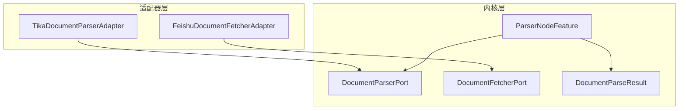
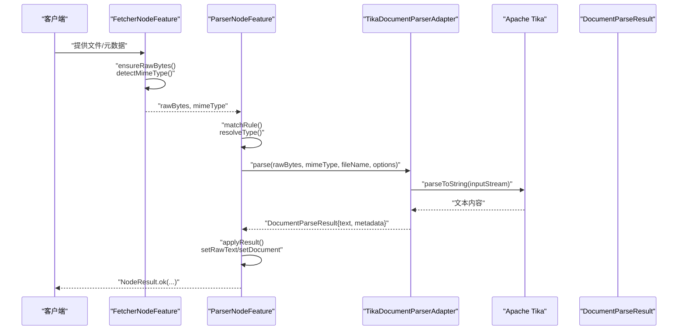
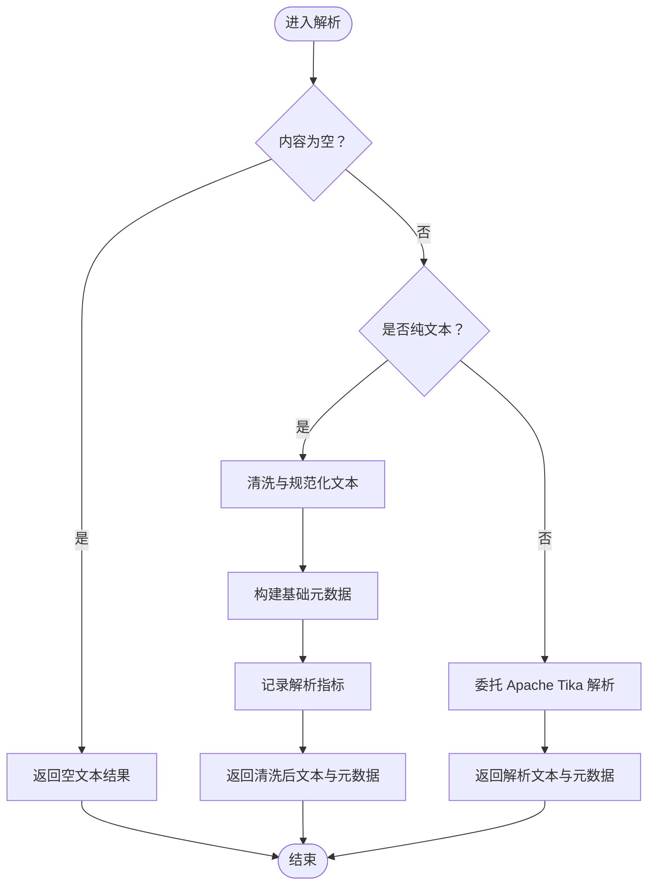
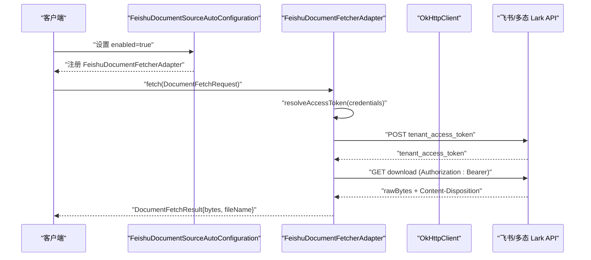
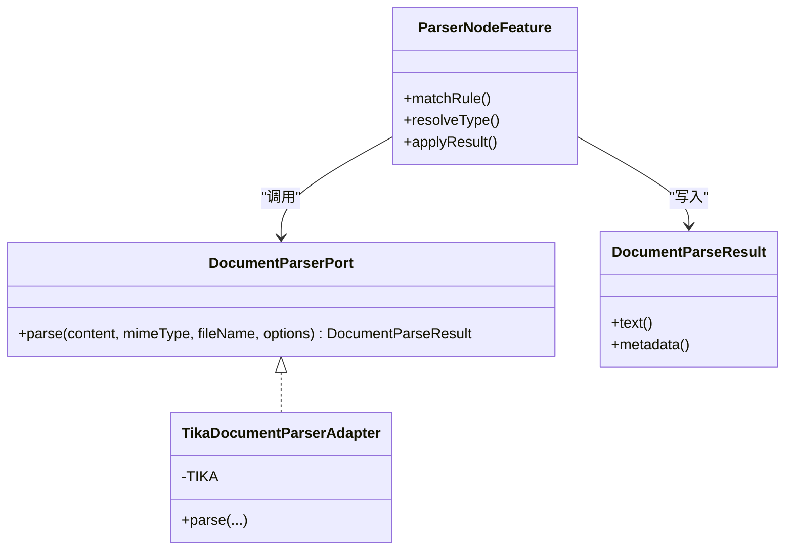
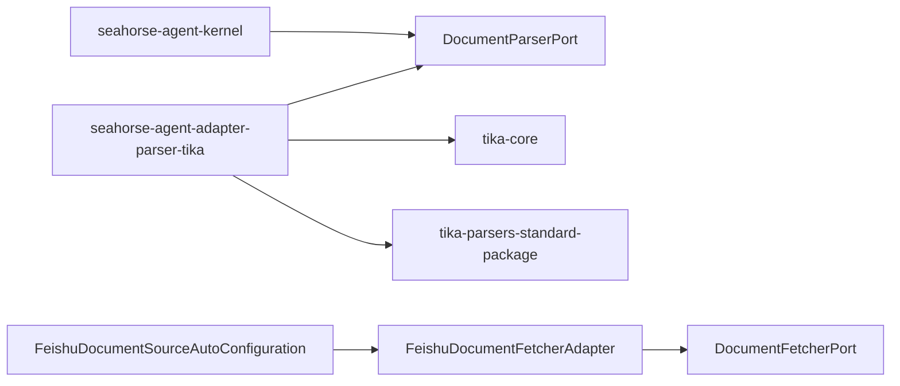

# 文档处理适配器

<cite>
**本文引用的文件**
- [TikaDocumentParserAdapter.java](file://seahorse-agent-adapter-parser-tika/src/main/java/com/miracle/ai/seahorse/agent/adapters/parser/tika/TikaDocumentParserAdapter.java)
- [DocumentParserPort.java](file://seahorse-agent-kernel/src/main/java/com/miracle/ai/seahorse/agent/ports/outbound/ingestion/DocumentParserPort.java)
- [ParserNodeFeature.java](file://seahorse-agent-kernel/src/main/java/com/miracle/ai/seahorse/agent/kernel/feature/ingestion/ParserNodeFeature.java)
- [DocumentParseResult.java](file://seahorse-agent-kernel/src/main/java/com/miracle/ai/seahorse/agent/ports/outbound/ingestion/DocumentParseResult.java)
- [FeishuDocumentFetcherAdapter.java](file://seahorse-agent-adapter-source-feishu/src/main/java/com/miracle/ai/seahorse/agent/adapters/source/feishu/FeishuDocumentFetcherAdapter.java)
- [FeishuDocumentSourceAutoConfiguration.java](file://seahorse-agent-adapter-source-feishu/src/main/java/com/miracle/ai/seahorse/agent/adapters/source/feishu/FeishuDocumentSourceAutoConfiguration.java)
- [FeishuDocumentSourceProperties.java](file://seahorse-agent-adapter-source-feishu/src/main/java/com/miracle/ai/seahorse/agent/adapters/source/feishu/FeishuDocumentSourceProperties.java)
- [pom.xml（Tika 适配器）](file://seahorse-agent-adapter-parser-tika/pom.xml)
- [pom.xml（根工程）](file://pom.xml)
- [文档解析适配器.md](file://docs/zh/content/后端系统/适配器模块/文档解析适配器.md)
- [贡献指南.md](file://docs/zh/content/开发指南/贡献指南.md)
- [pdf-ingestion-example.md](file://docs/examples/pdf-ingestion-example.md)
- [pdf-pipeline-request.json](file://docs/examples/pdf-pipeline-request.json)
- [KernelMetadataBackfillService.java](file://seahorse-agent-kernel/src/main/java/com/miracle/ai/seahorse/agent/kernel/application/metadata/KernelMetadataBackfillService.java)
</cite>

## 目录
1. [简介](#简介)
2. [项目结构](#项目结构)
3. [核心组件](#核心组件)
4. [架构总览](#架构总览)
5. [详细组件分析](#详细组件分析)
6. [依赖分析](#依赖分析)
7. [性能考虑](#性能考虑)
8. [故障排查指南](#故障排查指南)
9. [结论](#结论)
10. [附录](#附录)

## 简介
本文档系统性介绍文档处理适配器，重点覆盖两类核心能力：
- Apache Tika 文档解析适配器：提供统一的文档解析端口实现，支持常见格式（如 PDF、Word、Excel、PowerPoint、HTML、纯文本等），输出标准化的文本内容与元数据。
- 飞书文档源适配器：提供文档抓取端口实现，对接飞书/多态 Lark 的文档下载能力，支持凭据注入与自动装配。

文档还阐述文档解析端口接口设计、格式识别与内容提取流程、Tika 支持的格式范围、飞书抓取机制与 API 集成方式、预处理流程（含 OCR 与图像/多媒体提示）、质量评估与内容清洗策略，以及性能优化与错误处理机制。

## 项目结构
围绕文档处理的关键模块分布如下：
- 适配器层
  - Tika 文档解析适配器：实现 DocumentParserPort 接口，封装 Apache Tika 的解析能力。
  - 飞书文档源适配器：实现 DocumentFetcherPort 接口，封装飞书/多态 Lark 的文档下载能力。
- 内核层
  - 出站端口：DocumentParserPort、DocumentFetcherPort、DocumentParseResult 等。
  - 节点特征：ParserNodeFeature 负责规则匹配与类型判定。
- 示例与文档
  - PDF 摄取示例与请求模板，展示从抓取到解析再到增强、分块、向量化与索引的完整链路。

**图表来源**
- [TikaDocumentParserAdapter.java:45](file://seahorse-agent-adapter-parser-tika/src/main/java/com/miracle/ai/seahorse/agent/adapters/parser/tika/TikaDocumentParserAdapter.java#L45)
- [FeishuDocumentFetcherAdapter.java:24](file://seahorse-agent-adapter-source-feishu/src/main/java/com/miracle/ai/seahorse/agent/adapters/source/feishu/FeishuDocumentFetcherAdapter.java#L24)
- [DocumentParserPort.java:29](file://seahorse-agent-kernel/src/main/java/com/miracle/ai/seahorse/agent/ports/outbound/ingestion/DocumentParserPort.java#L29)
- [DocumentFetcherPort.java](file://seahorse-agent-kernel/src/main/java/com/miracle/ai/seahorse/agent/ports/outbound/ingestion/DocumentFetcherPort.java)
- [DocumentParseResult.java:29](file://seahorse-agent-kernel/src/main/java/com/miracle/ai/seahorse/agent/ports/outbound/ingestion/DocumentParseResult.java#L29)
- [ParserNodeFeature.java:165](file://seahorse-agent-kernel/src/main/java/com/miracle/ai/seahorse/agent/kernel/feature/ingestion/ParserNodeFeature.java#L165)

**章节来源**
- [pom.xml（根工程）:37-60](file://pom.xml#L37-L60)
- [贡献指南.md:95-114](file://docs/zh/content/开发指南/贡献指南.md#L95-L114)

## 核心组件
- 文档解析端口接口（DocumentParserPort）
  - 角色：定义统一的解析契约，屏蔽具体解析器差异。
  - 方法：parse(content, mimeType, fileName, options) → DocumentParseResult。
  - 返回：标准化文本内容与元数据（如解析耗时、输入大小、字符数、语言、页数、警告等）。
- 文档抓取端口接口（DocumentFetcherPort）
  - 角色：定义统一的文档抓取契约，支持多种来源类型（如 feishu、lark、drive 等）。
  - 方法：supports(sourceType)、fetch(request) → DocumentFetchResult。
- Tika 文档解析适配器（TikaDocumentParserAdapter）
  - 实现 DocumentParserPort，内部使用 Apache Tika 进行解析。
  - 支持格式：PDF、Word、Excel、PowerPoint、HTML、纯文本等。
  - 输出：规范化文本与丰富元数据。
- 飞书文档源适配器（FeishuDocumentFetcherAdapter）
  - 实现 DocumentFetcherPort，支持飞书/多态 Lark 文档下载。
  - 自动装配：通过 FeishuDocumentSourceAutoConfiguration 注册，受开关控制。
  - 配置：baseUrl、tenantAccessTokenPath、downloadPathTemplate、tenantAccessToken 等。

**章节来源**
- [DocumentParserPort.java:29](file://seahorse-agent-kernel/src/main/java/com/miracle/ai/seahorse/agent/ports/outbound/ingestion/DocumentParserPort.java#L29)
- [DocumentParseResult.java:29](file://seahorse-agent-kernel/src/main/java/com/miracle/ai/seahorse/agent/ports/outbound/ingestion/DocumentParseResult.java#L29)
- [TikaDocumentParserAdapter.java:45](file://seahorse-agent-adapter-parser-tika/src/main/java/com/miracle/ai/seahorse/agent/adapters/parser/tika/TikaDocumentParserAdapter.java#L45)
- [FeishuDocumentFetcherAdapter.java:24](file://seahorse-agent-adapter-source-feishu/src/main/java/com/miracle/ai/seahorse/agent/adapters/source/feishu/FeishuDocumentFetcherAdapter.java#L24)
- [FeishuDocumentSourceAutoConfiguration.java:32](file://seahorse-agent-adapter-source-feishu/src/main/java/com/miracle/ai/seahorse/agent/adapters/source/feishu/FeishuDocumentSourceAutoConfiguration.java#L32)

## 架构总览
文档处理采用“抓取-解析-增强-分块-向量化-索引”的流水线架构。抓取器（Fetcher）负责获取原始字节与 MIME 类型，解析器（Parser）依据规则选择对应解析器（如 Tika），最终产出纯文本与可选元数据，供后续增强、分块与索引阶段使用。

**图表来源**
- [文档解析适配器.md:97-115](file://docs/zh/content/后端系统/适配器模块/文档解析适配器.md#L97-L115)
- [FetcherNodeFeature.java:77-89](file://seahorse-agent-kernel/src/main/java/com/miracle/ai/seahorse/agent/kernel/feature/ingestion/FetcherNodeFeature.java#L77-L89)
- [ParserNodeFeature.java:70-85](file://seahorse-agent-kernel/src/main/java/com/miracle/ai/seahorse/agent/kernel/feature/ingestion/ParserNodeFeature.java#L70-L85)
- [TikaDocumentParserAdapter.java:41-51](file://seahorse-agent-adapter-parser-tika/src/main/java/com/miracle/ai/seahorse/agent/adapters/parser/tika/TikaDocumentParserAdapter.java#L41-L51)
- [DocumentParseResult.java:29-39](file://seahorse-agent-kernel/src/main/java/com/miracle/ai/seahorse/agent/ports/outbound/ingestion/DocumentParseResult.java#L29-L39)

## 详细组件分析

### Tika 文档解析适配器
- 设计要点
  - 通过 DocumentParserPort 统一入口，屏蔽底层解析器差异。
  - 针对纯文本路径进行短路处理，提升吞吐。
  - 使用静态 Tika 实例，减少对象创建开销。
  - 输出标准化元数据，包含解析耗时、输入大小、字符数、语言、页数、警告等。
- 处理流程
  - 输入校验与空内容短路。
  - 判断是否为纯文本，若是则进行清洗与规范化。
  - 否则委托 Apache Tika 进行解析，产出文本与元数据。
  - 记录解析指标并返回结果。
- 支持格式范围
  - 文档解析适配器注释明确支持 PDF、Word、Excel、PPT、HTML、纯文本等常见格式。
  - 解析节点特征中根据 MIME 或扩展名识别 WORD、EXCEL、PPT、TEXT 等类型。
- 预处理与清洗
  - 清洗策略：换行符归一化、多余空白清理、连续空行去重、末尾空白修剪。
  - 正则表达式用于处理多余空白与连续空行，确保后续处理质量。
- 元数据字段
  - 包括解析器名称与版本、内容类型、MIME 类型、资源名、文件名、标题、作者、创建/修改时间、语言、页数、解析耗时、输入大小、文本字符数、警告等。

**图表来源**
- [TikaDocumentParserAdapter.java:70-81](file://seahorse-agent-adapter-parser-tika/src/main/java/com/miracle/ai/seahorse/agent/adapters/parser/tika/TikaDocumentParserAdapter.java#L70-L81)
- [TikaDocumentParserAdapter.java:59-68](file://seahorse-agent-adapter-parser-tika/src/main/java/com/miracle/ai/seahorse/agent/adapters/parser/tika/TikaDocumentParserAdapter.java#L59-L68)
- [ParserNodeFeature.java:165-178](file://seahorse-agent-kernel/src/main/java/com/miracle/ai/seahorse/agent/kernel/feature/ingestion/ParserNodeFeature.java#L165-L178)

**章节来源**
- [TikaDocumentParserAdapter.java:41-51](file://seahorse-agent-adapter-parser-tika/src/main/java/com/miracle/ai/seahorse/agent/adapters/parser/tika/TikaDocumentParserAdapter.java#L41-L51)
- [TikaDocumentParserAdapter.java:70-81](file://seahorse-agent-adapter-parser-tika/src/main/java/com/miracle/ai/seahorse/agent/adapters/parser/tika/TikaDocumentParserAdapter.java#L70-L81)
- [ParserNodeFeature.java:165-191](file://seahorse-agent-kernel/src/main/java/com/miracle/ai/seahorse/agent/kernel/feature/ingestion/ParserNodeFeature.java#L165-L191)
- [贡献指南.md:118-134](file://docs/zh/content/开发指南/贡献指南.md#L118-L134)

### 飞书文档源适配器
- 设计要点
  - 实现 DocumentFetcherPort，支持 feishu、lark、feishu_drive、lark_drive 等来源类型。
  - 通过 FeishuDocumentSourceAutoConfiguration 自动装配，受开关控制启用。
  - 通过 FeishuDocumentSourceProperties 注入配置，如基础 URL、令牌路径、下载路径模板与租户访问令牌。
- 抓取机制
  - 支持校验来源类型，不支持则抛出异常。
  - 从请求凭据中解析租户访问令牌，构造下载请求头并发起 GET 请求。
  - 从响应头解析文件名，返回包含原始字节与文件名的抓取结果。
- API 集成方式
  - 令牌获取：POST /open-apis/auth/v3/tenant_access_token/internal。
  - 文档下载：GET /open-apis/drive/v1/files/{fileToken}/download。
  - 响应头 content-disposition 中包含文件名。
- 自动装配与启用
  - 默认关闭，需设置 seahorse-agent.adapters.source.feishu.enabled=true 才会注册适配器与端口实现。

**图表来源**
- [FeishuDocumentSourceAutoConfiguration.java:32](file://seahorse-agent-adapter-source-feishu/src/main/java/com/miracle/ai/seahorse/agent/adapters/source/feishu/FeishuDocumentSourceAutoConfiguration.java#L32)
- [FeishuDocumentFetcherAdapter.java:67-87](file://seahorse-agent-adapter-source-feishu/src/main/java/com/miracle/ai/seahorse/agent/adapters/source/feishu/FeishuDocumentFetcherAdapter.java#L67-L87)
- [FeishuDocumentSourceProperties.java:25-31](file://seahorse-agent-adapter-source-feishu/src/main/java/com/miracle/ai/seahorse/agent/adapters/source/feishu/FeishuDocumentSourceProperties.java#L25-L31)

**章节来源**
- [FeishuDocumentFetcherAdapter.java:67-87](file://seahorse-agent-adapter-source-feishu/src/main/java/com/miracle/ai/seahorse/agent/adapters/source/feishu/FeishuDocumentFetcherAdapter.java#L67-L87)
- [FeishuDocumentSourceAutoConfiguration.java:32](file://seahorse-agent-adapter-source-feishu/src/main/java/com/miracle/ai/seahorse/agent/adapters/source/feishu/FeishuDocumentSourceAutoConfiguration.java#L32)
- [FeishuDocumentSourceProperties.java:25-31](file://seahorse-agent-adapter-source-feishu/src/main/java/com/miracle/ai/seahorse/agent/adapters/source/feishu/FeishuDocumentSourceProperties.java#L25-L31)

### 文档解析端口接口设计
- 接口契约
  - parse(content, mimeType, fileName, options)：统一解析入口，返回标准化结果。
  - DocumentParseResult：包含 text 与 metadata 字段，便于上层统一消费。
- 类型识别与规则匹配
  - ParserNodeFeature 根据 MIME 类型与扩展名识别 WORD、EXCEL、PPT、TEXT 等类型，并进行规范化。
- 元数据写入
  - 解析完成后将结果写入 IngestionContext，作为后续增强与分块的基础。

**图表来源**
- [DocumentParserPort.java:29](file://seahorse-agent-kernel/src/main/java/com/miracle/ai/seahorse/agent/ports/outbound/ingestion/DocumentParserPort.java#L29)
- [TikaDocumentParserAdapter.java:45](file://seahorse-agent-adapter-parser-tika/src/main/java/com/miracle/ai/seahorse/agent/adapters/parser/tika/TikaDocumentParserAdapter.java#L45)
- [ParserNodeFeature.java:165-191](file://seahorse-agent-kernel/src/main/java/com/miracle/ai/seahorse/agent/kernel/feature/ingestion/ParserNodeFeature.java#L165-L191)
- [DocumentParseResult.java:29](file://seahorse-agent-kernel/src/main/java/com/miracle/ai/seahorse/agent/ports/outbound/ingestion/DocumentParseResult.java#L29)

**章节来源**
- [DocumentParserPort.java:29](file://seahorse-agent-kernel/src/main/java/com/miracle/ai/seahorse/agent/ports/outbound/ingestion/DocumentParserPort.java#L29)
- [DocumentParseResult.java:29](file://seahorse-agent-kernel/src/main/java/com/miracle/ai/seahorse/agent/ports/outbound/ingestion/DocumentParseResult.java#L29)
- [ParserNodeFeature.java:165-191](file://seahorse-agent-kernel/src/main/java/com/miracle/ai/seahorse/agent/kernel/feature/ingestion/ParserNodeFeature.java#L165-L191)

## 依赖分析
- 适配器模块依赖内核接口与 Apache Tika 核心与标准解析包。
- 内核解析节点依赖 DocumentParserPort 接口，实现解耦。
- SPI 机制使解析器可插拔替换。
- 飞书适配器通过 Spring Boot 自动装配注册，受开关控制。

**图表来源**
- [pom.xml（Tika 适配器）:18-32](file://seahorse-agent-adapter-parser-tika/pom.xml#L18-L32)
- [DocumentParserPort.java:29](file://seahorse-agent-kernel/src/main/java/com/miracle/ai/seahorse/agent/ports/outbound/ingestion/DocumentParserPort.java#L29)
- [FeishuDocumentSourceAutoConfiguration.java:32](file://seahorse-agent-adapter-source-feishu/src/main/java/com/miracle/ai/seahorse/agent/adapters/source/feishu/FeishuDocumentSourceAutoConfiguration.java#L32)

**章节来源**
- [pom.xml（Tika 适配器）:18-32](file://seahorse-agent-adapter-parser-tika/pom.xml#L18-L32)
- [pom.xml（根工程）:37-60](file://pom.xml#L37-L60)

## 性能考虑
- 流式输入：解析过程以 ByteArrayInputStream 方式读取，避免额外拷贝。
- 文本清洗：采用正则预处理，减少后续处理负担；注意对超长文档的内存占用。
- 并发与批处理：建议在上游 fetcher 节点或外部调度层进行并发控制，避免单机资源瓶颈。
- 缓存与复用：Tika 实例为静态共享，降低对象创建成本。
- 失败快速返回：空内容与纯文本路径短路，提升吞吐。
- 飞书抓取：合理设置超时与重试，避免阻塞下载队列。

**章节来源**
- [文档解析适配器.md:259-266](file://docs/zh/content/后端系统/适配器模块/文档解析适配器.md#L259-L266)
- [TikaDocumentParserAdapter.java:70-81](file://seahorse-agent-adapter-parser-tika/src/main/java/com/miracle/ai/seahorse/agent/adapters/parser/tika/TikaDocumentParserAdapter.java#L70-L81)

## 故障排查指南
- Tika 解析异常
  - 空内容：直接返回空文本结果，属于正常短路路径。
  - 纯文本路径：若清洗后文本为空，检查输入编码与内容是否被正确传递。
  - 非纯文本：确认 MIME 类型与文件扩展名是否正确，解析器是否支持该格式。
- 飞书抓取异常
  - 未启用适配器：检查 seahorse-agent.adapters.source.feishu.enabled 是否为 true。
  - 凭据缺失：确保请求凭据包含 tenant_access_token。
  - 下载失败：检查下载 URL 模板与响应头 content-disposition 是否包含文件名。
- 流水线执行异常
  - 回填作业失败：查看 KernelMetadataBackfillService 的失败阶段标记（FETCH/EXTRACT），定位具体环节。
  - 管道定义错误：参考 PDF 摄取示例中的错误场景（环形管道、引用不存在节点、无起始节点）。

**章节来源**
- [TikaDocumentParserAdapter.java:74-76](file://seahorse-agent-adapter-parser-tika/src/main/java/com/miracle/ai/seahorse/agent/adapters/parser/tika/TikaDocumentParserAdapter.java#L74-L76)
- [FeishuDocumentFetcherAdapter.java:98-102](file://seahorse-agent-adapter-source-feishu/src/main/java/com/miracle/ai/seahorse/agent/adapters/source/feishu/FeishuDocumentFetcherAdapter.java#L98-L102)
- [KernelMetadataBackfillService.java:383-407](file://seahorse-agent-kernel/src/main/java/com/miracle/ai/seahorse/agent/kernel/application/metadata/KernelMetadataBackfillService.java#L383-L407)
- [pdf-ingestion-example.md:163-200](file://docs/examples/pdf-ingestion-example.md#L163-L200)

## 结论
本文档系统梳理了文档处理适配器的实现与集成方式，重点覆盖：
- Tika 文档解析适配器的接口设计、格式识别、内容提取与元数据输出。
- 飞书文档源适配器的抓取机制、API 集成与自动装配启用方式。
- 预处理流程、质量评估与内容清洗策略。
- 性能优化建议与错误处理机制。

通过统一的端口接口与可插拔的适配器设计，系统能够在保持高扩展性的同时，稳定地完成从文档抓取到索引的全流程处理。

## 附录
- 使用示例
  - PDF 摄取示例与一键创建命令参见：
    - [pdf-ingestion-example.md:1-288](file://docs/examples/pdf-ingestion-example.md#L1-L288)
    - [pdf-pipeline-request.json:1-60](file://docs/examples/pdf-pipeline-request.json#L1-L60)

**章节来源**
- [pdf-ingestion-example.md:1-288](file://docs/examples/pdf-ingestion-example.md#L1-L288)
- [pdf-pipeline-request.json:1-60](file://docs/examples/pdf-pipeline-request.json#L1-L60)