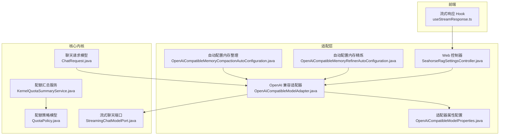
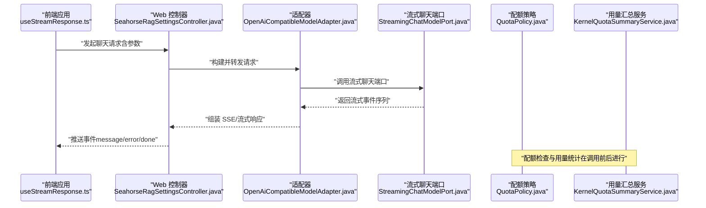
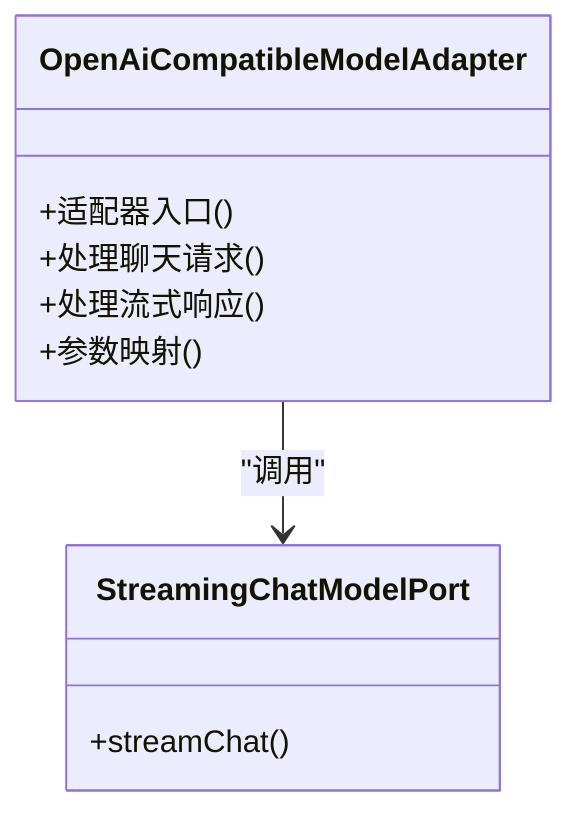
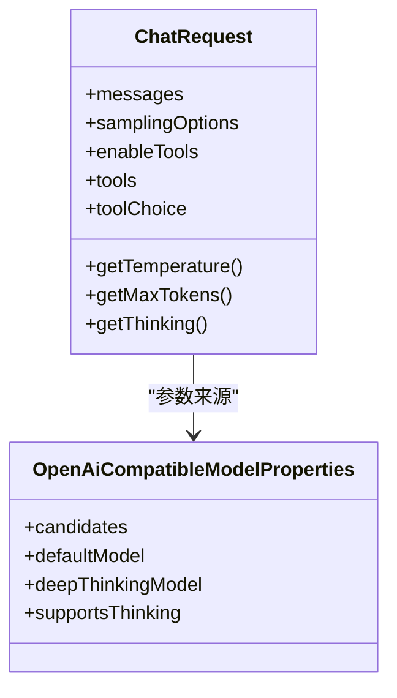
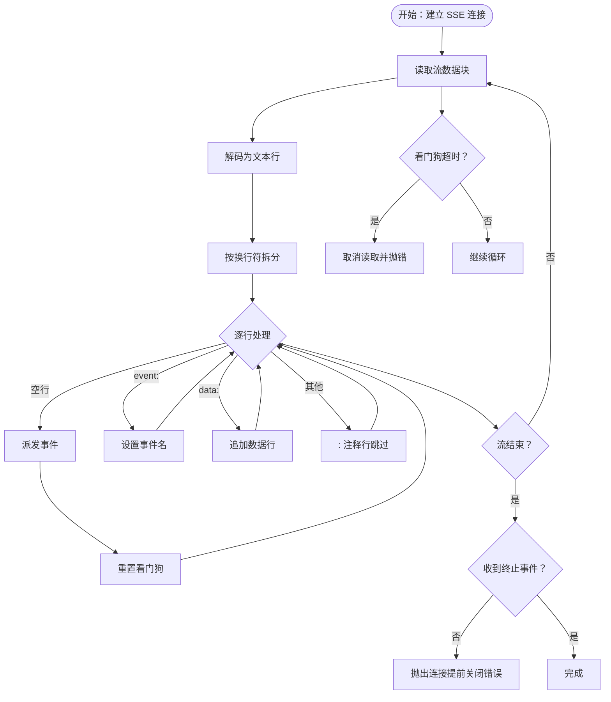
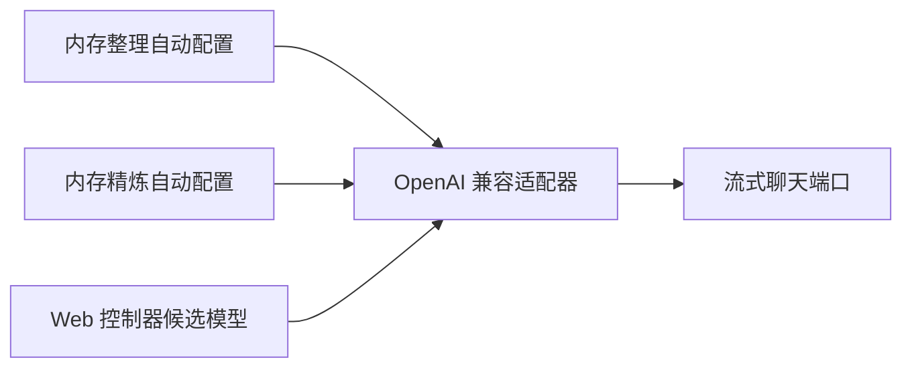
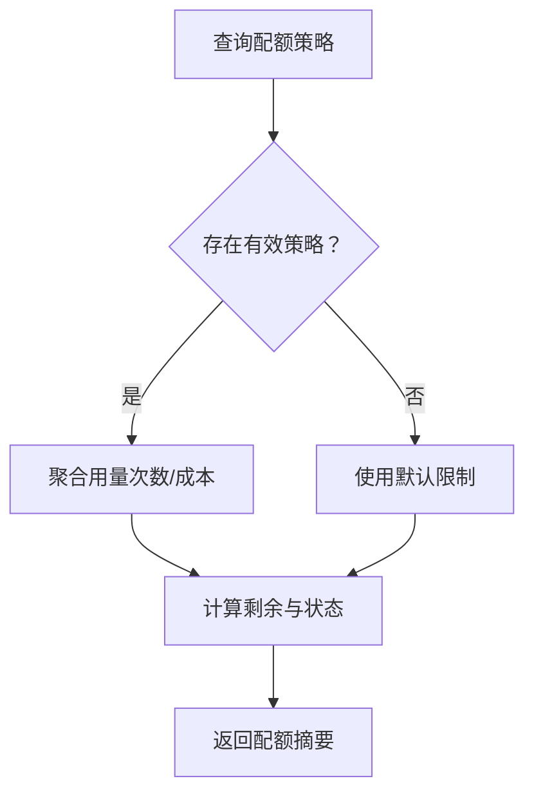
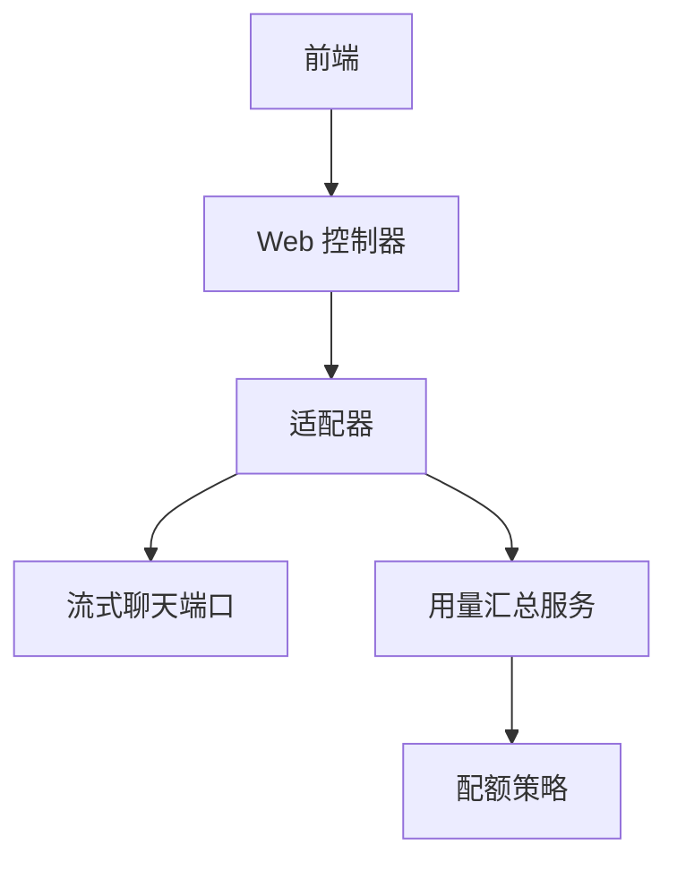

# 模型适配器

<cite>
**本文引用的文件**
- [OpenAiCompatibleModelAdapter.java](file://seahorse-agent-adapter-ai-openai-compatible/src/main/java/com/miracle/ai/seahorse/agent/adapters/ai/openai/OpenAiCompatibleModelAdapter.java)
- [OpenAiCompatibleModelProperties.java](file://seahorse-agent-adapter-ai-openai-compatible/src/main/java/com/miracle/ai/seahorse/agent/adapters/ai/openai/OpenAiCompatibleModelProperties.java)
- [OpenAiCompatibleMemoryCompactionAutoConfiguration.java](file://seahorse-agent-adapter-ai-openai-compatible/src/main/java/com/miracle/ai/seahorse/agent/adapters/ai/openai/OpenAiCompatibleMemoryCompactionAutoConfiguration.java)
- [OpenAiCompatibleMemoryRefinerAutoConfiguration.java](file://seahorse-agent-adapter-ai-openai-compatible/src/main/java/com/miracle/ai/seahorse/agent/adapters/ai/openai/OpenAiCompatibleMemoryRefinerAutoConfiguration.java)
- [StreamingChatModelPort.java](file://seahorse-agent-kernel/src/main/java/com/miracle/ai/seahorse/agent/ports/outbound/model/StreamingChatModelPort.java)
- [ChatRequest.java](file://seahorse-agent-kernel/src/main/java/com/miracle/ai/seahorse/agent/kernel/domain/chat/ChatRequest.java)
- [KernelQuotaSummaryService.java](file://seahorse-agent-kernel/src/main/java/com/miracle/ai/seahorse/agent/kernel/application/agent/quota/KernelQuotaSummaryService.java)
- [QuotaPolicy.java](file://seahorse-agent-kernel/src/main/java/com/miracle/ai/seahorse/agent/kernel/domain/agent/quota/QuotaPolicy.java)
- [useStreamResponse.ts](file://frontend/src/hooks/useStreamResponse.ts)
- [SeahorseRagSettingsController.java](file://seahorse-agent-adapter-web/src/main/java/com/miracle/ai/seahorse/agent/adapters/web/SeahorseRagSettingsController.java)
- [OpenAiCompatibleModelAdapterTests.java](file://seahorse-agent-adapter-ai-openai-compatible/src/test/java/com/miracle/ai/seahorse/agent/adapters/ai/openai/OpenAiCompatibleModelAdapterTests.java)
- [OpenAiCompatibleStreamingChatToolsTests.java](file://seahorse-agent-adapter-ai-openai-compatible/src/test/java/com/miracle/ai/seahorse/agent/adapters/ai/openai/StreamingChatToolsTests.java)
</cite>

## 目录
1. [简介](#简介)
2. [项目结构](#项目结构)
3. [核心组件](#核心组件)
4. [架构总览](#架构总览)
5. [详细组件分析](#详细组件分析)
6. [依赖关系分析](#依赖关系分析)
7. [性能考虑](#性能考虑)
8. [故障排查指南](#故障排查指南)
9. [结论](#结论)
10. [附录](#附录)

## 简介
本文件面向“模型适配器”的专业技术文档，聚焦于“OpenAI 兼容模型适配器”的实现原理与配置方法，系统阐述以下主题：
- 聊天模型端口接口设计：文本生成、嵌入向量计算、流式响应处理
- 兼容性机制：统一接口以支持多家 AI 服务提供商
- 模型参数配置：温度、最大令牌数、TopK/TopP、思考模式等
- 流式响应实现与客户端处理
- 性能优化策略：批处理、缓存、并发控制
- 费用控制与用量统计
- 测试方法与调试技巧

## 项目结构
围绕“模型适配器”相关的关键模块分布如下：
- 适配层（适配器工程）：OpenAI 兼容适配器、Web 控制器、前端 Hook
- 核心内核（Kernel）：聊天请求模型、流式聊天端口、配额策略与用量聚合
- 测试层：适配器单元测试与流式工具测试

图表来源
- [OpenAiCompatibleModelAdapter.java:1-200](file://seahorse-agent-adapter-ai-openai-compatible/src/main/java/com/miracle/ai/seahorse/agent/adapters/ai/openai/OpenAiCompatibleModelAdapter.java#L1-L200)
- [OpenAiCompatibleModelProperties.java:1-200](file://seahorse-agent-adapter-ai-openai-compatible/src/main/java/com/miracle/ai/seahorse/agent/adapters/ai/openai/OpenAiCompatibleModelProperties.java#L1-L200)
- [OpenAiCompatibleMemoryCompactionAutoConfiguration.java:1-200](file://seahorse-agent-adapter-ai-openai-compatible/src/main/java/com/miracle/ai/seahorse/agent/adapters/ai/openai/OpenAiCompatibleMemoryCompactionAutoConfiguration.java#L1-L200)
- [OpenAiCompatibleMemoryRefinerAutoConfiguration.java:1-200](file://seahorse-agent-adapter-ai-openai-compatible/src/main/java/com/miracle/ai/seahorse/agent/adapters/ai/openai/OpenAiCompatibleMemoryRefinerAutoConfiguration.java#L1-L200)
- [StreamingChatModelPort.java:1-200](file://seahorse-agent-kernel/src/main/java/com/miracle/ai/seahorse/agent/ports/outbound/model/StreamingChatModelPort.java#L1-L200)
- [ChatRequest.java:60-120](file://seahorse-agent-kernel/src/main/java/com/miracle/ai/seahorse/agent/kernel/domain/chat/ChatRequest.java#L60-L120)
- [KernelQuotaSummaryService.java:50-110](file://seahorse-agent-kernel/src/main/java/com/miracle/ai/seahorse/agent/kernel/application/agent/quota/KernelQuotaSummaryService.java#L50-L110)
- [QuotaPolicy.java:50-100](file://seahorse-agent-kernel/src/main/java/com/miracle/ai/seahorse/agent/kernel/domain/agent/quota/QuotaPolicy.java#L50-L100)
- [useStreamResponse.ts:70-240](file://frontend/src/hooks/useStreamResponse.ts#L70-L240)
- [SeahorseRagSettingsController.java:240-290](file://seahorse-agent-adapter-web/src/main/java/com/miracle/ai/seahorse/agent/adapters/web/SeahorseRagSettingsController.java#L240-L290)

章节来源
- [OpenAiCompatibleModelAdapter.java:1-200](file://seahorse-agent-adapter-ai-openai-compatible/src/main/java/com/miracle/ai/seahorse/agent/adapters/ai/openai/OpenAiCompatibleModelAdapter.java#L1-L200)
- [StreamingChatModelPort.java:1-200](file://seahorse-agent-kernel/src/main/java/com/miracle/ai/seahorse/agent/ports/outbound/model/StreamingChatModelPort.java#L1-L200)
- [ChatRequest.java:60-120](file://seahorse-agent-kernel/src/main/java/com/miracle/ai/seahorse/agent/kernel/domain/chat/ChatRequest.java#L60-L120)
- [KernelQuotaSummaryService.java:50-110](file://seahorse-agent-kernel/src/main/java/com/miracle/ai/seahorse/agent/kernel/application/agent/quota/KernelQuotaSummaryService.java#L50-L110)
- [QuotaPolicy.java:50-100](file://seahorse-agent-kernel/src/main/java/com/miracle/ai/seahorse/agent/kernel/domain/agent/quota/QuotaPolicy.java#L50-L100)
- [useStreamResponse.ts:70-240](file://frontend/src/hooks/useStreamResponse.ts#L70-L240)
- [SeahorseRagSettingsController.java:240-290](file://seahorse-agent-adapter-web/src/main/java/com/miracle/ai/seahorse/agent/adapters/web/SeahorseRagSettingsController.java#L240-L290)

## 核心组件
- OpenAI 兼容模型适配器：负责将统一的聊天请求转换为具体供应商的 API 请求，并处理响应（含流式）。
- 流式聊天端口：定义统一的流式聊天调用契约，屏蔽底层实现差异。
- 聊天请求模型：封装消息列表、采样参数（温度、TopP、TopK、最大令牌数、思考模式）等。
- 配额策略与用量汇总：基于用户/租户维度进行调用次数与费用限额控制与统计。

章节来源
- [OpenAiCompatibleModelAdapter.java:1-200](file://seahorse-agent-adapter-ai-openai-compatible/src/main/java/com/miracle/ai/seahorse/agent/adapters/ai/openai/OpenAiCompatibleModelAdapter.java#L1-L200)
- [StreamingChatModelPort.java:1-200](file://seahorse-agent-kernel/src/main/java/com/miracle/ai/seahorse/agent/ports/outbound/model/StreamingChatModelPort.java#L1-L200)
- [ChatRequest.java:60-120](file://seahorse-agent-kernel/src/main/java/com/miracle/ai/seahorse/agent/kernel/domain/chat/ChatRequest.java#L60-L120)
- [KernelQuotaSummaryService.java:50-110](file://seahorse-agent-kernel/src/main/java/com/miracle/ai/seahorse/agent/kernel/application/agent/quota/KernelQuotaSummaryService.java#L50-L110)
- [QuotaPolicy.java:50-100](file://seahorse-agent-kernel/src/main/java/com/miracle/ai/seahorse/agent/kernel/domain/agent/quota/QuotaPolicy.java#L50-L100)

## 架构总览
下图展示从前端到后端、再到适配器与端口的整体交互流程，以及配额控制贯穿其中的路径。

图表来源
- [useStreamResponse.ts:70-240](file://frontend/src/hooks/useStreamResponse.ts#L70-L240)
- [SeahorseRagSettingsController.java:240-290](file://seahorse-agent-adapter-web/src/main/java/com/miracle/ai/seahorse/agent/adapters/web/SeahorseRagSettingsController.java#L240-L290)
- [OpenAiCompatibleModelAdapter.java:1-200](file://seahorse-agent-adapter-ai-openai-compatible/src/main/java/com/miracle/ai/seahorse/agent/adapters/ai/openai/OpenAiCompatibleModelAdapter.java#L1-L200)
- [StreamingChatModelPort.java:1-200](file://seahorse-agent-kernel/src/main/java/com/miracle/ai/seahorse/agent/ports/outbound/model/StreamingChatModelPort.java#L1-L200)
- [QuotaPolicy.java:50-100](file://seahorse-agent-kernel/src/main/java/com/miracle/ai/seahorse/agent/kernel/domain/agent/quota/QuotaPolicy.java#L50-L100)
- [KernelQuotaSummaryService.java:50-110](file://seahorse-agent-kernel/src/main/java/com/miracle/ai/seahorse/agent/kernel/application/agent/quota/KernelQuotaSummaryService.java#L50-L110)

## 详细组件分析

### 组件一：OpenAI 兼容模型适配器
- 职责
  - 将统一的聊天请求对象映射为具体供应商的 API 请求体
  - 处理流式响应，按事件类型分发给上层
  - 支持工具调用（如启用工具、工具选择）
- 关键点
  - 参数映射：温度、TopP、TopK、最大令牌数、思考模式等
  - 工具链路：工具描述、工具选择策略
  - 流式输出：事件名与数据行解析、看门狗超时、终止事件检测
- 与端口协作
  - 通过流式聊天端口发起请求，接收事件流并回传给控制器/前端

图表来源
- [OpenAiCompatibleModelAdapter.java:1-200](file://seahorse-agent-adapter-ai-openai-compatible/src/main/java/com/miracle/ai/seahorse/agent/adapters/ai/openai/OpenAiCompatibleModelAdapter.java#L1-L200)
- [StreamingChatModelPort.java:1-200](file://seahorse-agent-kernel/src/main/java/com/miracle/ai/seahorse/agent/ports/outbound/model/StreamingChatModelPort.java#L1-L200)

章节来源
- [OpenAiCompatibleModelAdapter.java:1-200](file://seahorse-agent-adapter-ai-openai-compatible/src/main/java/com/miracle/ai/seahorse/agent/adapters/ai/openai/OpenAiCompatibleModelAdapter.java#L1-L200)
- [StreamingChatModelPort.java:1-200](file://seahorse-agent-kernel/src/main/java/com/miracle/ai/seahorse/agent/ports/outbound/model/StreamingChatModelPort.java#L1-L200)

### 组件二：聊天请求模型与参数配置
- ChatRequest
  - 封装消息列表、采样参数（温度、TopP、TopK、最大令牌数、思考模式）
  - 提供便捷访问器，便于适配器读取
- OpenAI 兼容属性配置
  - 定义供应商特定的连接、鉴权、模型路由、超时等参数
  - 支持多候选模型与优先级、是否支持“思考模式”

图表来源
- [ChatRequest.java:60-120](file://seahorse-agent-kernel/src/main/java/com/miracle/ai/seahorse/agent/kernel/domain/chat/ChatRequest.java#L60-L120)
- [OpenAiCompatibleModelProperties.java:1-200](file://seahorse-agent-adapter-ai-openai-compatible/src/main/java/com/miracle/ai/seahorse/agent/adapters/ai/openai/OpenAiCompatibleModelProperties.java#L1-L200)
- [SeahorseRagSettingsController.java:240-290](file://seahorse-agent-adapter-web/src/main/java/com/miracle/ai/seahorse/agent/adapters/web/SeahorseRagSettingsController.java#L240-L290)

章节来源
- [ChatRequest.java:60-120](file://seahorse-agent-kernel/src/main/java/com/miracle/ai/seahorse/agent/kernel/domain/chat/ChatRequest.java#L60-L120)
- [OpenAiCompatibleModelProperties.java:1-200](file://seahorse-agent-adapter-ai-openai-compatible/src/main/java/com/miracle/ai/seahorse/agent/adapters/ai/openai/OpenAiCompatibleModelProperties.java#L1-L200)
- [SeahorseRagSettingsController.java:240-290](file://seahorse-agent-adapter-web/src/main/java/com/miracle/ai/seahorse/agent/adapters/web/SeahorseRagSettingsController.java#L240-L290)

### 组件三：流式响应实现与客户端处理
- 服务端
  - 适配器通过流式聊天端口获取事件流，按事件名与数据行拼接
  - 超时看门狗：每收到一次数据重置计时器；超时触发取消
  - 终止事件检测：确保完整收尾或抛出“提前关闭”错误
- 客户端
  - 使用自定义 Hook 解析 SSE，支持事件回调、错误构建、中止信号
  - 支持可选超时时间与重复事件去重标记

图表来源
- [useStreamResponse.ts:70-240](file://frontend/src/hooks/useStreamResponse.ts#L70-L240)
- [OpenAiCompatibleModelAdapter.java:1-200](file://seahorse-agent-adapter-ai-openai-compatible/src/main/java/com/miracle/ai/seahorse/agent/adapters/ai/openai/OpenAiCompatibleModelAdapter.java#L1-L200)

章节来源
- [useStreamResponse.ts:70-240](file://frontend/src/hooks/useStreamResponse.ts#L70-L240)
- [OpenAiCompatibleModelAdapter.java:1-200](file://seahorse-agent-adapter-ai-openai-compatible/src/main/java/com/miracle/ai/seahorse/agent/adapters/ai/openai/OpenAiCompatibleModelAdapter.java#L1-L200)

### 组件四：兼容性机制与多供应商统一接口
- 自动配置
  - 内存整理与精炼场景下的自动装配，确保适配器按需启用
- Web 层候选模型
  - 支持多供应商、多模型候选，具备优先级与启用开关
  - 可配置默认模型、深度思考模型、是否支持“思考模式”
- 适配器层
  - 通过统一的流式聊天端口对接不同供应商，隐藏差异

图表来源
- [OpenAiCompatibleMemoryCompactionAutoConfiguration.java:1-200](file://seahorse-agent-adapter-ai-openai-compatible/src/main/java/com/miracle/ai/seahorse/agent/adapters/ai/openai/OpenAiCompatibleMemoryCompactionAutoConfiguration.java#L1-L200)
- [OpenAiCompatibleMemoryRefinerAutoConfiguration.java:1-200](file://seahorse-agent-adapter-ai-openai-compatible/src/main/java/com/miracle/ai/seahorse/agent/adapters/ai/openai/OpenAiCompatibleMemoryRefinerAutoConfiguration.java#L1-L200)
- [SeahorseRagSettingsController.java:240-290](file://seahorse-agent-adapter-web/src/main/java/com/miracle/ai/seahorse/agent/adapters/web/SeahorseRagSettingsController.java#L240-L290)
- [OpenAiCompatibleModelAdapter.java:1-200](file://seahorse-agent-adapter-ai-openai-compatible/src/main/java/com/miracle/ai/seahorse/agent/adapters/ai/openai/OpenAiCompatibleModelAdapter.java#L1-L200)

章节来源
- [OpenAiCompatibleMemoryCompactionAutoConfiguration.java:1-200](file://seahorse-agent-adapter-ai-openai-compatible/src/main/java/com/miracle/ai/seahorse/agent/adapters/ai/openai/OpenAiCompatibleMemoryCompactionAutoConfiguration.java#L1-L200)
- [OpenAiCompatibleMemoryRefinerAutoConfiguration.java:1-200](file://seahorse-agent-adapter-ai-openai-compatible/src/main/java/com/miracle/ai/seahorse/agent/adapters/ai/openai/OpenAiCompatibleMemoryRefinerAutoConfiguration.java#L1-L200)
- [SeahorseRagSettingsController.java:240-290](file://seahorse-agent-adapter-web/src/main/java/com/miracle/ai/seahorse/agent/adapters/web/SeahorseRagSettingsController.java#L240-L290)

### 组件五：费用控制与使用量统计
- 配额策略
  - 用户/租户维度设定调用次数、费用上限与告警阈值
  - 到期/禁用状态管理
- 用量汇总
  - 聚合调用次数、总成本，计算剩余额度与状态
  - 输出配额摘要（含状态、剩余、提示信息）

图表来源
- [KernelQuotaSummaryService.java:50-110](file://seahorse-agent-kernel/src/main/java/com/miracle/ai/seahorse/agent/kernel/application/agent/quota/KernelQuotaSummaryService.java#L50-L110)
- [QuotaPolicy.java:50-100](file://seahorse-agent-kernel/src/main/java/com/miracle/ai/seahorse/agent/kernel/domain/agent/quota/QuotaPolicy.java#L50-L100)

章节来源
- [KernelQuotaSummaryService.java:50-110](file://seahorse-agent-kernel/src/main/java/com/miracle/ai/seahorse/agent/kernel/application/agent/quota/KernelQuotaSummaryService.java#L50-L110)
- [QuotaPolicy.java:50-100](file://seahorse-agent-kernel/src/main/java/com/miracle/ai/seahorse/agent/kernel/domain/agent/quota/QuotaPolicy.java#L50-L100)

## 依赖关系分析
- 适配器依赖端口：通过流式聊天端口抽象供应商差异
- Web 控制器依赖适配器：暴露统一的模型候选与路由配置
- 前端依赖控制器：通过 SSE 获取流式事件
- 配额模块横切：在调用前后进行策略校验与用量统计

图表来源
- [useStreamResponse.ts:70-240](file://frontend/src/hooks/useStreamResponse.ts#L70-L240)
- [SeahorseRagSettingsController.java:240-290](file://seahorse-agent-adapter-web/src/main/java/com/miracle/ai/seahorse/agent/adapters/web/SeahorseRagSettingsController.java#L240-L290)
- [OpenAiCompatibleModelAdapter.java:1-200](file://seahorse-agent-adapter-ai-openai-compatible/src/main/java/com/miracle/ai/seahorse/agent/adapters/ai/openai/OpenAiCompatibleModelAdapter.java#L1-L200)
- [StreamingChatModelPort.java:1-200](file://seahorse-agent-kernel/src/main/java/com/miracle/ai/seahorse/agent/ports/outbound/model/StreamingChatModelPort.java#L1-L200)
- [KernelQuotaSummaryService.java:50-110](file://seahorse-agent-kernel/src/main/java/com/miracle/ai/seahorse/agent/kernel/application/agent/quota/KernelQuotaSummaryService.java#L50-L110)
- [QuotaPolicy.java:50-100](file://seahorse-agent-kernel/src/main/java/com/miracle/ai/seahorse/agent/kernel/domain/agent/quota/QuotaPolicy.java#L50-L100)

章节来源
- [useStreamResponse.ts:70-240](file://frontend/src/hooks/useStreamResponse.ts#L70-L240)
- [SeahorseRagSettingsController.java:240-290](file://seahorse-agent-adapter-web/src/main/java/com/miracle/ai/seahorse/agent/adapters/web/SeahorseRagSettingsController.java#L240-L290)
- [OpenAiCompatibleModelAdapter.java:1-200](file://seahorse-agent-adapter-ai-openai-compatible/src/main/java/com/miracle/ai/seahorse/agent/adapters/ai/openai/OpenAiCompatibleModelAdapter.java#L1-L200)
- [StreamingChatModelPort.java:1-200](file://seahorse-agent-kernel/src/main/java/com/miracle/ai/seahorse/agent/ports/outbound/model/StreamingChatModelPort.java#L1-L200)
- [KernelQuotaSummaryService.java:50-110](file://seahorse-agent-kernel/src/main/java/com/miracle/ai/seahorse/agent/kernel/application/agent/quota/KernelQuotaSummaryService.java#L50-L110)
- [QuotaPolicy.java:50-100](file://seahorse-agent-kernel/src/main/java/com/miracle/ai/seahorse/agent/kernel/domain/agent/quota/QuotaPolicy.java#L50-L100)

## 性能考虑
- 批处理
  - 合并短时间内的多次调用，减少握手开销
  - 对工具调用进行批量编排，避免频繁往返
- 缓存
  - 对常用提示词与上下文进行缓存，降低重复计算
  - 结合分布式锁与发布订阅，保证缓存一致性
- 并发控制
  - 限流与信号量：在适配器层与端口层分别设置并发上限
  - 流式读取采用异步 Reader，避免阻塞主线程
- 资源池化
  - HTTP 客户端连接复用，合理设置超时与重试
- 前端体验
  - SSE 看门狗与断线重连策略，保障长时间对话稳定性

## 故障排查指南
- 流式连接问题
  - 检查服务端是否正确发送终止事件，前端是否提前关闭
  - 查看看门狗超时日志，确认网络波动或上游延迟
- 参数不生效
  - 确认 ChatRequest 的采样参数是否正确传递至适配器
  - 核对属性配置中的候选模型与默认模型是否匹配
- 配额异常
  - 核对配额策略状态（启用/禁用），用量聚合是否正常
  - 检查用户/租户维度策略优先级与覆盖范围
- 工具调用失败
  - 确认工具启用标志与工具选择策略
  - 检查工具描述与供应商支持能力

章节来源
- [useStreamResponse.ts:70-240](file://frontend/src/hooks/useStreamResponse.ts#L70-L240)
- [OpenAiCompatibleModelAdapter.java:1-200](file://seahorse-agent-adapter-ai-openai-compatible/src/main/java/com/miracle/ai/seahorse/agent/adapters/ai/openai/OpenAiCompatibleModelAdapter.java#L1-L200)
- [KernelQuotaSummaryService.java:50-110](file://seahorse-agent-kernel/src/main/java/com/miracle/ai/seahorse/agent/kernel/application/agent/quota/KernelQuotaSummaryService.java#L50-L110)
- [QuotaPolicy.java:50-100](file://seahorse-agent-kernel/src/main/java/com/miracle/ai/seahorse/agent/kernel/domain/agent/quota/QuotaPolicy.java#L50-L100)

## 结论
该模型适配器通过统一的流式聊天端口与 Web 控制器，实现了对多家 AI 服务提供商的兼容；结合完善的参数映射、流式事件处理、配额策略与用量统计，既满足了功能需求，也兼顾了性能与可观测性。建议在生产环境中配合缓存、并发控制与监控告警，持续优化用户体验与资源利用率。

## 附录
- 测试方法
  - 单元测试：验证适配器参数映射、工具链路与流式事件解析
  - 集成测试：模拟 Web 控制器到适配器到端口的完整链路
- 调试技巧
  - 前端：开启事件回调日志，观察 SSE 事件顺序与超时行为
  - 后端：记录请求/响应体与事件流分发过程，定位异常事件
  - 配额：对比策略与用量聚合结果，确认阈值与状态逻辑

章节来源
- [OpenAiCompatibleModelAdapterTests.java](file://seahorse-agent-adapter-ai-openai-compatible/src/test/java/com/miracle/ai/seahorse/agent/adapters/ai/openai/OpenAiCompatibleModelAdapterTests.java)
- [OpenAiCompatibleStreamingChatToolsTests.java](file://seahorse-agent-adapter-ai-openai-compatible/src/test/java/com/miracle/ai/seahorse/agent/adapters/ai/openai/StreamingChatToolsTests.java)