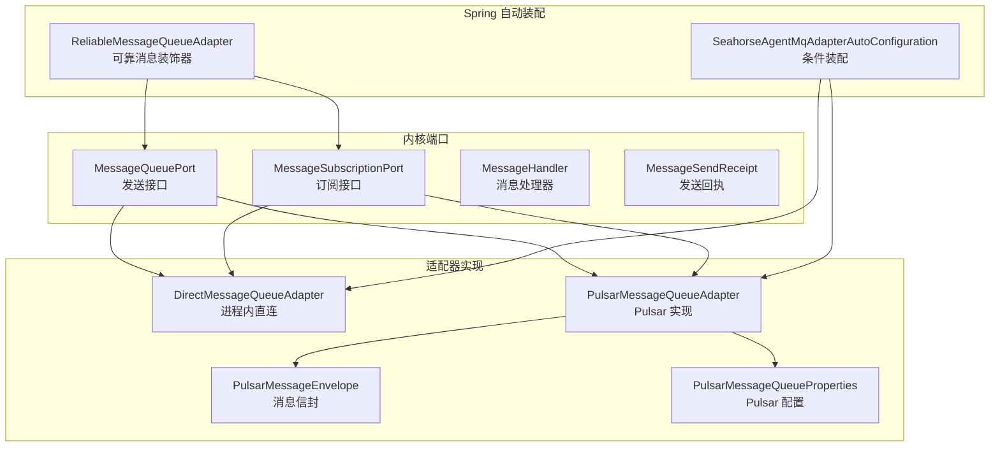
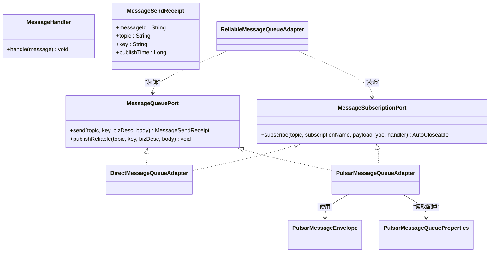
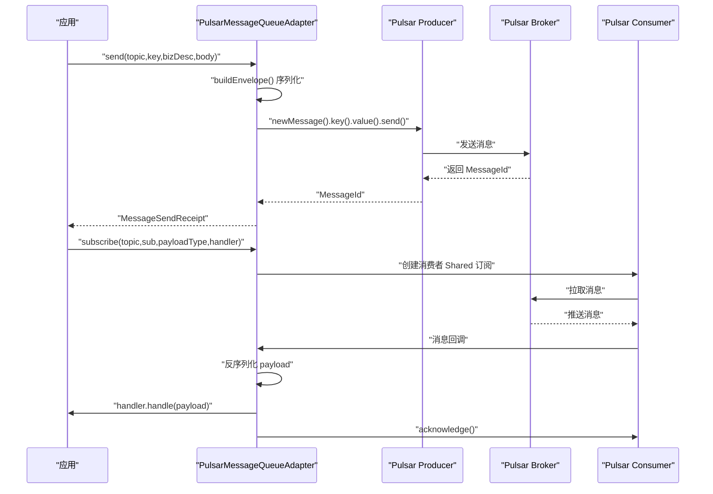
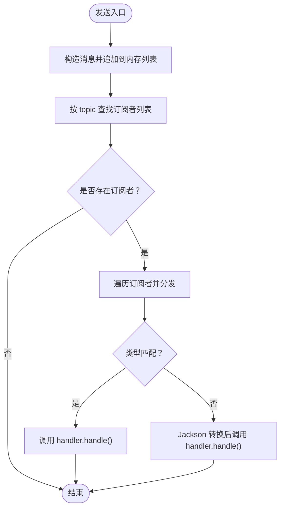
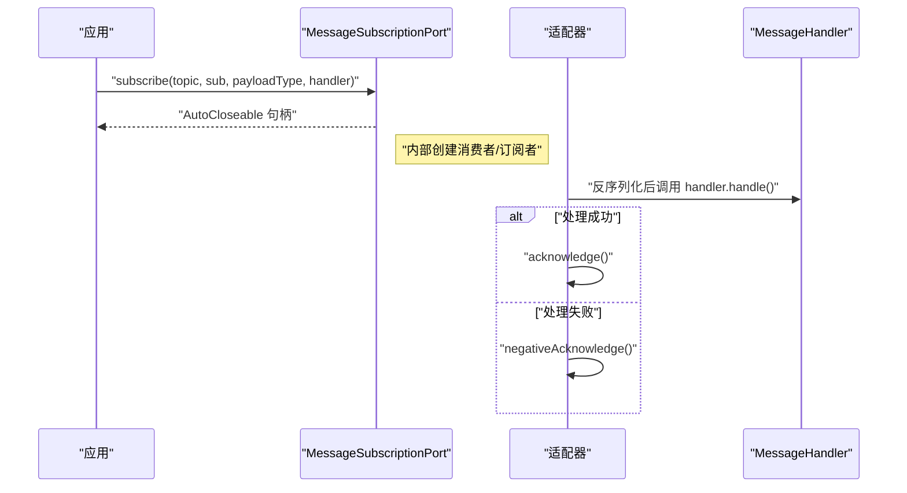
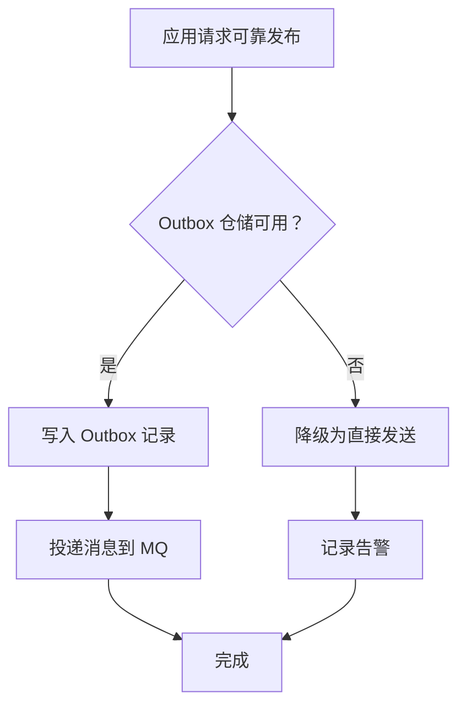
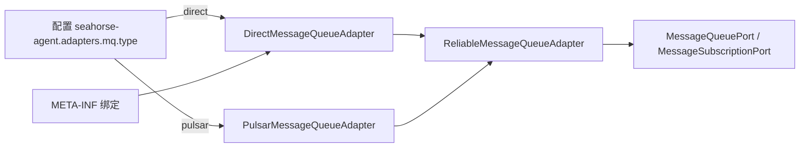

# 消息队列适配器

<cite>
**本文引用的文件**
- [PulsarMessageQueueAdapter.java](file://seahorse-agent-adapter-mq-pulsar/src/main/java/com/miracle/ai/seahorse/agent/adapters/mq/pulsar/PulsarMessageQueueAdapter.java)
- [PulsarMessageQueueProperties.java](file://seahorse-agent-adapter-mq-pulsar/src/main/java/com/miracle/ai/seahorse/agent/adapters/mq/pulsar/PulsarMessageQueueProperties.java)
- [PulsarMessageEnvelope.java](file://seahorse-agent-adapter-mq-pulsar/src/main/java/com/miracle/ai/seahorse/agent/adapters/mq/pulsar/PulsarMessageEnvelope.java)
- [DirectMessageQueueAdapter.java](file://seahorse-agent-adapter-mq-direct/src/main/java/com/miracle/ai/seahorse/agent/adapters/mq/direct/DirectMessageQueueAdapter.java)
- [MessageQueuePort.java](file://seahorse-agent-kernel/src/main/java/com/miracle/ai/seahorse/agent/ports/outbound/mq/MessageQueuePort.java)
- [MessageSubscriptionPort.java](file://seahorse-agent-kernel/src/main/java/com/miracle/ai/seahorse/agent/ports/outbound/mq/MessageSubscriptionPort.java)
- [MessageHandler.java](file://seahorse-agent-kernel/src/main/java/com/miracle/ai/seahorse/agent/ports/outbound/mq/MessageHandler.java)
- [MessageSendReceipt.java](file://seahorse-agent-kernel/src/main/java/com/miracle/ai/seahorse/agent/ports/outbound/mq/MessageSendReceipt.java)
- [SeahorseAgentMqAdapterAutoConfiguration.java](file://seahorse-agent-spring-boot-starter/src/main/java/com/miracle/ai/seahorse/agent/adapters/spring/SeahorseAgentMqAdapterAutoConfiguration.java)
- [ReliableMessageQueueAdapter.java](file://seahorse-agent-spring-boot-starter/src/main/java/com/miracle/ai/seahorse/agent/adapters/spring/mq/ReliableMessageQueueAdapter.java)
- [com.miracle.ai.seahorse.agent.ports.outbound.mq.MessageQueuePort](file://seahorse-agent-adapter-mq-direct/src/main/resources/META-INF/seahorse-agent/com.miracle.ai.seahorse.agent.ports.outbound.mq.MessageQueuePort)
</cite>

## 目录
1. [引言](#引言)
2. [项目结构](#项目结构)
3. [核心组件](#核心组件)
4. [架构总览](#架构总览)
5. [组件详解](#组件详解)
6. [依赖关系分析](#依赖关系分析)
7. [性能考量](#性能考量)
8. [故障排查指南](#故障排查指南)
9. [结论](#结论)
10. [附录：配置指南](#附录配置指南)

## 引言
本技术文档聚焦于消息队列适配器，系统性解析两类适配器的实现与使用场景：Pulsar 消息队列适配器与直接消息队列适配器，并阐明消息队列端口接口的设计理念（发送、接收、确认），以及在异步处理中的作用（任务调度、事件传播、系统解耦）。同时给出配置指南、最佳实践（消息丢失处理、重复消费避免、性能调优）。

## 项目结构
消息队列适配器位于独立模块中，通过 Spring Boot 自动装配集成到内核中：
- Pulsar 适配器：基于 Apache Pulsar 客户端，负责生产者/消费者生命周期管理、序列化/反序列化、ACK/NACK、批处理与压缩等。
- 直连适配器：进程内直连实现，无外部 Broker 依赖，适合本地开发与测试。
- 内核端口：定义统一的消息发送与订阅接口，屏蔽上层业务与底层实现差异。
- 自动装配：根据配置选择 direct 或 pulsar 适配器，并可叠加可靠消息装饰器。

**图表来源**
- [SeahorseAgentMqAdapterAutoConfiguration.java:44-81](file://seahorse-agent-spring-boot-starter/src/main/java/com/miracle/ai/seahorse/agent/adapters/spring/SeahorseAgentMqAdapterAutoConfiguration.java#L44-L81)
- [DirectMessageQueueAdapter.java:39-131](file://seahorse-agent-adapter-mq-direct/src/main/java/com/miracle/ai/seahorse/agent/adapters/mq/direct/DirectMessageQueueAdapter.java#L39-L131)
- [PulsarMessageQueueAdapter.java:45-229](file://seahorse-agent-adapter-mq-pulsar/src/main/java/com/miracle/ai/seahorse/agent/adapters/mq/pulsar/PulsarMessageQueueAdapter.java#L45-L229)
- [PulsarMessageEnvelope.java:23-75](file://seahorse-agent-adapter-mq-pulsar/src/main/java/com/miracle/ai/seahorse/agent/adapters/mq/pulsar/PulsarMessageEnvelope.java#L23-L75)
- [PulsarMessageQueueProperties.java:25-91](file://seahorse-agent-adapter-mq-pulsar/src/main/java/com/miracle/ai/seahorse/agent/adapters/mq/pulsar/PulsarMessageQueueProperties.java#L25-L91)
- [ReliableMessageQueueAdapter.java:41-120](file://seahorse-agent-spring-boot-starter/src/main/java/com/miracle/ai/seahorse/agent/adapters/spring/mq/ReliableMessageQueueAdapter.java#L41-L120)

**章节来源**
- [SeahorseAgentMqAdapterAutoConfiguration.java:44-81](file://seahorse-agent-spring-boot-starter/src/main/java/com/miracle/ai/seahorse/agent/adapters/spring/SeahorseAgentMqAdapterAutoConfiguration.java#L44-L81)
- [MessageQueuePort.java:23-28](file://seahorse-agent-kernel/src/main/java/com/miracle/ai/seahorse/agent/ports/outbound/mq/MessageQueuePort.java#L23-L28)
- [MessageSubscriptionPort.java:25-28](file://seahorse-agent-kernel/src/main/java/com/miracle/ai/seahorse/agent/ports/outbound/mq/MessageSubscriptionPort.java#L25-L28)

## 核心组件
- 端口接口
  - 发送端口：定义标准发送与“可靠发布”能力。
  - 订阅端口：定义订阅方法，返回可关闭句柄，内部负责 ACK/NACK、反序列化与类型转换。
  - 消息处理器：业务侧回调接口，仅暴露业务对象。
  - 发送回执：封装 Broker 返回的消息 ID、topic、key、发布时间。
- 适配器实现
  - 直连适配器：进程内内存存储与分发，无持久化与网络开销，适合本地与测试。
  - Pulsar 适配器：基于 Pulsar 客户端，支持批处理、压缩、共享订阅、ACK/NACK、键路由等。
- 可靠消息装饰器
  - 在存在 Outbox 仓储时，可靠发布先写入 Outbox 再投递；否则降级为直接发送并记录告警。

**章节来源**
- [MessageQueuePort.java:23-28](file://seahorse-agent-kernel/src/main/java/com/miracle/ai/seahorse/agent/ports/outbound/mq/MessageQueuePort.java#L23-L28)
- [MessageSubscriptionPort.java:25-28](file://seahorse-agent-kernel/src/main/java/com/miracle/ai/seahorse/agent/ports/outbound/mq/MessageSubscriptionPort.java#L25-L28)
- [MessageHandler.java:26-30](file://seahorse-agent-kernel/src/main/java/com/miracle/ai/seahorse/agent/ports/outbound/mq/MessageHandler.java#L26-L30)
- [MessageSendReceipt.java:28-30](file://seahorse-agent-kernel/src/main/java/com/miracle/ai/seahorse/agent/ports/outbound/mq/MessageSendReceipt.java#L28-L30)
- [DirectMessageQueueAdapter.java:39-131](file://seahorse-agent-adapter-mq-direct/src/main/java/com/miracle/ai/seahorse/agent/adapters/mq/direct/DirectMessageQueueAdapter.java#L39-L131)
- [PulsarMessageQueueAdapter.java:45-229](file://seahorse-agent-adapter-mq-pulsar/src/main/java/com/miracle/ai/seahorse/agent/adapters/mq/pulsar/PulsarMessageQueueAdapter.java#L45-L229)
- [ReliableMessageQueueAdapter.java:41-120](file://seahorse-agent-spring-boot-starter/src/main/java/com/miracle/ai/seahorse/agent/adapters/spring/mq/ReliableMessageQueueAdapter.java#L41-L120)

## 架构总览
消息队列适配器采用“端口 + 适配器 + 装饰器”的分层设计：
- 上层业务仅依赖端口接口，不感知具体实现。
- 适配器负责对接不同消息中间件（Pulsar、直连）。
- 可靠消息装饰器在必要时增强可靠性（Outbox）。

**图表来源**
- [MessageQueuePort.java:23-28](file://seahorse-agent-kernel/src/main/java/com/miracle/ai/seahorse/agent/ports/outbound/mq/MessageQueuePort.java#L23-L28)
- [MessageSubscriptionPort.java:25-28](file://seahorse-agent-kernel/src/main/java/com/miracle/ai/seahorse/agent/ports/outbound/mq/MessageSubscriptionPort.java#L25-L28)
- [MessageHandler.java:26-30](file://seahorse-agent-kernel/src/main/java/com/miracle/ai/seahorse/agent/ports/outbound/mq/MessageHandler.java#L26-L30)
- [MessageSendReceipt.java:28-30](file://seahorse-agent-kernel/src/main/java/com/miracle/ai/seahorse/agent/ports/outbound/mq/MessageSendReceipt.java#L28-L30)
- [DirectMessageQueueAdapter.java:39-131](file://seahorse-agent-adapter-mq-direct/src/main/java/com/miracle/ai/seahorse/agent/adapters/mq/direct/DirectMessageQueueAdapter.java#L39-L131)
- [PulsarMessageQueueAdapter.java:45-229](file://seahorse-agent-adapter-mq-pulsar/src/main/java/com/miracle/ai/seahorse/agent/adapters/mq/pulsar/PulsarMessageQueueAdapter.java#L45-L229)
- [PulsarMessageEnvelope.java:23-75](file://seahorse-agent-adapter-mq-pulsar/src/main/java/com/miracle/ai/seahorse/agent/adapters/mq/pulsar/PulsarMessageEnvelope.java#L23-L75)
- [PulsarMessageQueueProperties.java:25-91](file://seahorse-agent-adapter-mq-pulsar/src/main/java/com/miracle/ai/seahorse/agent/adapters/mq/pulsar/PulsarMessageQueueProperties.java#L25-L91)
- [ReliableMessageQueueAdapter.java:41-120](file://seahorse-agent-spring-boot-starter/src/main/java/com/miracle/ai/seahorse/agent/adapters/spring/mq/ReliableMessageQueueAdapter.java#L41-L120)

## 组件详解

### Pulsar 消息队列适配器
- 设计要点
  - 生产者/消费者按 topic 缓存复用，减少创建成本。
  - 使用 JSON Schema 包装消息体，统一序列化为 JSON 字符串，便于跨语言与可观测。
  - 键路由：支持 key 为空时自动生成 UUID，保证分区一致性。
  - 共享订阅：订阅类型为 Shared，便于水平扩展。
  - ACK/NACK：成功处理后 acknowledge，异常时 negativeAcknowledge，交由 Pulsar 控制重试。
  - 批处理与压缩：可通过配置启用批处理、设置最大消息数与延迟、压缩类型。
- 关键流程
  - 发送：构建信封、序列化、发送、返回回执。
  - 订阅：创建消费者、注册消息监听、反序列化、ACK/NACK。
- 适用场景
  - 生产环境高吞吐、低延迟、强一致性的消息投递。
  - 需要分区、副本、事务等特性支撑的复杂业务。

**图表来源**
- [PulsarMessageQueueAdapter.java:65-154](file://seahorse-agent-adapter-mq-pulsar/src/main/java/com/miracle/ai/seahorse/agent/adapters/mq/pulsar/PulsarMessageQueueAdapter.java#L65-L154)
- [PulsarMessageEnvelope.java:23-75](file://seahorse-agent-adapter-mq-pulsar/src/main/java/com/miracle/ai/seahorse/agent/adapters/mq/pulsar/PulsarMessageEnvelope.java#L23-L75)

**章节来源**
- [PulsarMessageQueueAdapter.java:45-229](file://seahorse-agent-adapter-mq-pulsar/src/main/java/com/miracle/ai/seahorse/agent/adapters/mq/pulsar/PulsarMessageQueueAdapter.java#L45-L229)
- [PulsarMessageEnvelope.java:23-75](file://seahorse-agent-adapter-mq-pulsar/src/main/java/com/miracle/ai/seahorse/agent/adapters/mq/pulsar/PulsarMessageEnvelope.java#L23-L75)
- [PulsarMessageQueueProperties.java:25-91](file://seahorse-agent-adapter-mq-pulsar/src/main/java/com/miracle/ai/seahorse/agent/adapters/mq/pulsar/PulsarMessageQueueProperties.java#L25-L91)

### 直接消息队列适配器
- 设计要点
  - 进程内内存存储与同步分发，无网络与持久化。
  - 订阅按 topic 维度维护列表，消息到达即分发。
  - 类型转换：若消息体类型与期望类型不一致，使用 Jackson 转换。
- 适用场景
  - 本地开发、单体部署、测试环境。
  - 对可靠性要求不高、追求简单与快速验证。

**图表来源**
- [DirectMessageQueueAdapter.java:46-95](file://seahorse-agent-adapter-mq-direct/src/main/java/com/miracle/ai/seahorse/agent/adapters/mq/direct/DirectMessageQueueAdapter.java#L46-L95)

**章节来源**
- [DirectMessageQueueAdapter.java:39-131](file://seahorse-agent-adapter-mq-direct/src/main/java/com/miracle/ai/seahorse/agent/adapters/mq/direct/DirectMessageQueueAdapter.java#L39-L131)

### 端口接口与消息处理
- 发送接口
  - send：返回发送回执，包含 Broker 返回的消息 ID、topic、key、发布时间。
  - publishReliable：可靠发布（由装饰器决定是否写入 Outbox）。
- 订阅接口
  - subscribe：返回 AutoCloseable 句柄，内部负责 ACK/NACK、反序列化、类型转换。
  - 订阅类型：Pulsar 采用 Shared，支持多实例水平扩展。
- 处理流程
  - 反序列化：Pulsar 使用 Jackson 将 payloadJson 转为目标类型。
  - ACK/NACK：成功处理 acknowledge，异常 negativeAcknowledge。
  - 类型转换：直连适配器在类型不匹配时进行转换。

**图表来源**
- [MessageSubscriptionPort.java:25-28](file://seahorse-agent-kernel/src/main/java/com/miracle/ai/seahorse/agent/ports/outbound/mq/MessageSubscriptionPort.java#L25-L28)
- [PulsarMessageQueueAdapter.java:142-154](file://seahorse-agent-adapter-mq-pulsar/src/main/java/com/miracle/ai/seahorse/agent/adapters/mq/pulsar/PulsarMessageQueueAdapter.java#L142-L154)
- [DirectMessageQueueAdapter.java:116-129](file://seahorse-agent-adapter-mq-direct/src/main/java/com/miracle/ai/seahorse/agent/adapters/mq/direct/DirectMessageQueueAdapter.java#L116-L129)

**章节来源**
- [MessageQueuePort.java:23-28](file://seahorse-agent-kernel/src/main/java/com/miracle/ai/seahorse/agent/ports/outbound/mq/MessageQueuePort.java#L23-L28)
- [MessageSubscriptionPort.java:25-28](file://seahorse-agent-kernel/src/main/java/com/miracle/ai/seahorse/agent/ports/outbound/mq/MessageSubscriptionPort.java#L25-L28)
- [MessageHandler.java:26-30](file://seahorse-agent-kernel/src/main/java/com/miracle/ai/seahorse/agent/ports/outbound/mq/MessageHandler.java#L26-L30)
- [MessageSendReceipt.java:28-30](file://seahorse-agent-kernel/src/main/java/com/miracle/ai/seahorse/agent/ports/outbound/mq/MessageSendReceipt.java#L28-L30)

### 可靠消息装饰器与 Outbox
- 功能
  - 可靠发布：优先写入 Outbox，再投递消息；缺失 Outbox 仓储时降级为直接发送并记录告警。
  - 装饰模式：对底层适配器透明增强。
- 适用场景
  - 需要最终一致性的跨服务事件发布。
  - 避免消息丢失与重复消费的系统边界。

**图表来源**
- [ReliableMessageQueueAdapter.java:41-120](file://seahorse-agent-spring-boot-starter/src/main/java/com/miracle/ai/seahorse/agent/adapters/spring/mq/ReliableMessageQueueAdapter.java#L41-L120)

**章节来源**
- [ReliableMessageQueueAdapter.java:41-120](file://seahorse-agent-spring-boot-starter/src/main/java/com/miracle/ai/seahorse/agent/adapters/spring/mq/ReliableMessageQueueAdapter.java#L41-L120)

## 依赖关系分析
- 自动装配
  - 当配置为 direct 且未存在 MessageQueuePort Bean 时，创建 ReliableMessageQueueAdapter 包裹 DirectMessageQueueAdapter。
  - 当配置为 pulsar 且存在 PulsarClient Bean 时，创建 ReliableMessageQueueAdapter 包裹 PulsarMessageQueueAdapter。
- 端口绑定
  - direct 适配器在资源清单中声明默认绑定为 direct。
- 耦合与内聚
  - 适配器与端口松耦合，通过接口隔离实现细节。
  - 可靠消息装饰器与 Outbox 解耦，可按需启用。

**图表来源**
- [SeahorseAgentMqAdapterAutoConfiguration.java:48-80](file://seahorse-agent-spring-boot-starter/src/main/java/com/miracle/ai/seahorse/agent/adapters/spring/SeahorseAgentMqAdapterAutoConfiguration.java#L48-L80)
- [com.miracle.ai.seahorse.agent.ports.outbound.mq.MessageQueuePort:1-3](file://seahorse-agent-adapter-mq-direct/src/main/resources/META-INF/seahorse-agent/com.miracle.ai.seahorse.agent.ports.outbound.mq.MessageQueuePort#L1-L3)

**章节来源**
- [SeahorseAgentMqAdapterAutoConfiguration.java:44-81](file://seahorse-agent-spring-boot-starter/src/main/java/com/miracle/ai/seahorse/agent/adapters/spring/SeahorseAgentMqAdapterAutoConfiguration.java#L44-L81)
- [com.miracle.ai.seahorse.agent.ports.outbound.mq.MessageQueuePort:1-3](file://seahorse-agent-adapter-mq-direct/src/main/resources/META-INF/seahorse-agent/com.miracle.ai.seahorse.agent.ports.outbound.mq.MessageQueuePort#L1-L3)

## 性能考量
- Pulsar 适配器
  - 批处理：合理设置最大消息数与最大延迟，平衡吞吐与延迟。
  - 压缩：根据负载选择 LZ4 等压缩类型，降低带宽占用。
  - 键路由：为关键业务设置稳定 key，提升分区命中率。
  - 共享订阅：多实例水平扩展，提升并发处理能力。
- 直连适配器
  - 仅适合本地与测试，生产环境建议使用 Pulsar。
- 可靠消息装饰器
  - Outbox 写入会增加一次落盘，需评估磁盘与数据库压力。
  - 建议结合背压与限流策略，避免 Outbox 积压。

[本节为通用性能建议，无需特定文件引用]

## 故障排查指南
- 发送失败
  - Pulsar：检查 Producer 创建与发送超时、阻塞策略；查看异常堆栈定位。
  - 直连：检查内存列表是否正常追加与分发。
- 订阅异常
  - Pulsar：确认消费者创建、订阅名称、共享订阅类型；关注 negativeAcknowledge 触发频率。
  - 直连：确认订阅列表是否正确维护，类型转换是否成功。
- 可靠发布
  - 若 Outbox 不可用，将降级为直接发送并记录告警；请检查 Outbox 仓储可用性。
- 常见问题
  - 消息重复：直连适配器不会去重；Pulsar 通过共享订阅与 NACK 控制重试，需确保幂等处理。
  - 消息丢失：生产环境务必使用 Pulsar；启用可靠发布并配合 Outbox。

**章节来源**
- [PulsarMessageQueueAdapter.java:108-159](file://seahorse-agent-adapter-mq-pulsar/src/main/java/com/miracle/ai/seahorse/agent/adapters/mq/pulsar/PulsarMessageQueueAdapter.java#L108-L159)
- [DirectMessageQueueAdapter.java:66-95](file://seahorse-agent-adapter-mq-direct/src/main/java/com/miracle/ai/seahorse/agent/adapters/mq/direct/DirectMessageQueueAdapter.java#L66-L95)
- [ReliableMessageQueueAdapter.java:41-120](file://seahorse-agent-spring-boot-starter/src/main/java/com/miracle/ai/seahorse/agent/adapters/spring/mq/ReliableMessageQueueAdapter.java#L41-L120)

## 结论
本消息队列适配器以端口抽象屏蔽实现差异，提供直连与 Pulsar 两种实现路径，并通过可靠消息装饰器增强跨服务事件发布的可靠性。生产环境推荐使用 Pulsar 适配器，结合共享订阅、批处理与压缩优化性能；在需要最终一致性的场景启用 Outbox 与可靠发布，确保系统稳健运行。

[本节为总结性内容，无需特定文件引用]

## 附录：配置指南

- 通用配置项
  - 适配器类型：direct 或 pulsar
  - 启用开关：kernel.enabled（默认开启）
- Pulsar 配置（PulsarMessageQueueProperties）
  - 发送超时（毫秒）
  - 队列满时阻塞
  - 是否启用批处理
  - 批处理最大消息数
  - 批处理最大延迟（毫秒）
  - 压缩类型（如 LZ4）
- 主题与消费者组
  - 主题：topic
  - 订阅名称：subscriptionName（共享订阅）
  - 消费者组：由订阅名称标识
- 自动装配与绑定
  - direct 默认绑定：在资源清单中声明
  - pulsar 条件装配：当存在 PulsarClient Bean 且配置为 pulsar 时生效

**章节来源**
- [PulsarMessageQueueProperties.java:25-91](file://seahorse-agent-adapter-mq-pulsar/src/main/java/com/miracle/ai/seahorse/agent/adapters/mq/pulsar/PulsarMessageQueueProperties.java#L25-L91)
- [SeahorseAgentMqAdapterAutoConfiguration.java:48-80](file://seahorse-agent-spring-boot-starter/src/main/java/com/miracle/ai/seahorse/agent/adapters/spring/SeahorseAgentMqAdapterAutoConfiguration.java#L48-L80)
- [com.miracle.ai.seahorse.agent.ports.outbound.mq.MessageQueuePort:1-3](file://seahorse-agent-adapter-mq-direct/src/main/resources/META-INF/seahorse-agent/com.miracle.ai.seahorse.agent.ports.outbound.mq.MessageQueuePort#L1-L3)