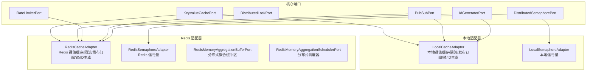
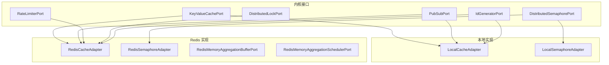
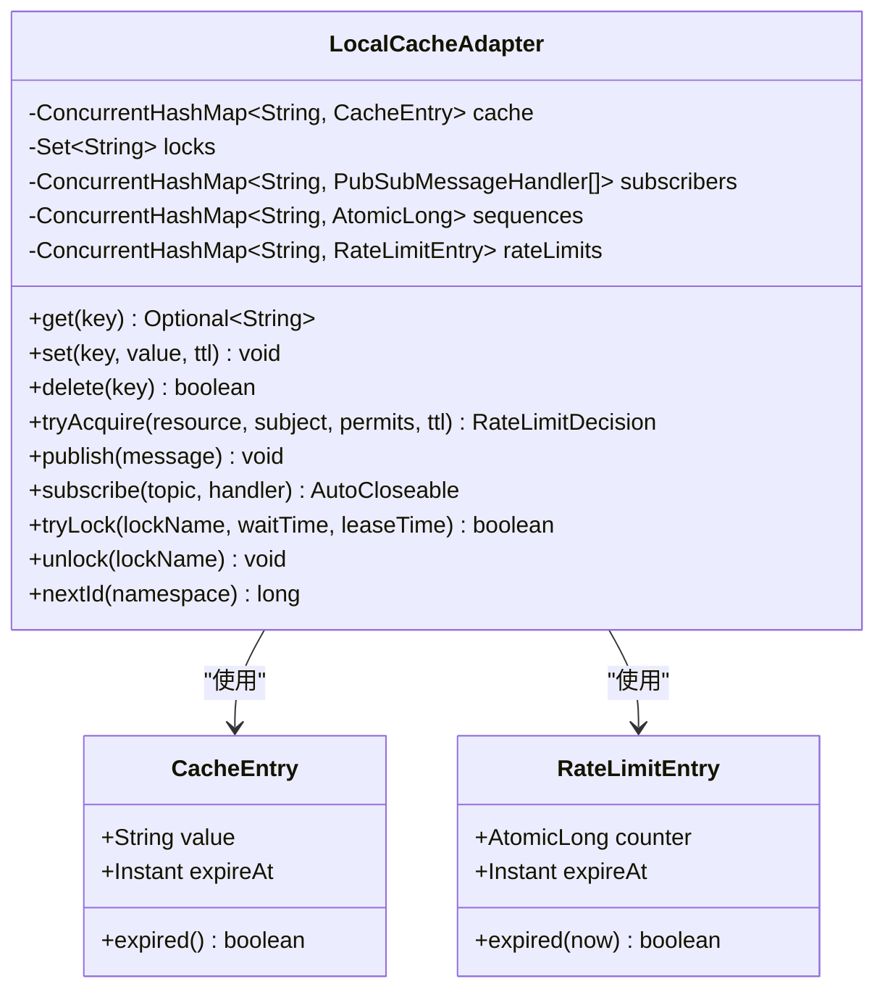
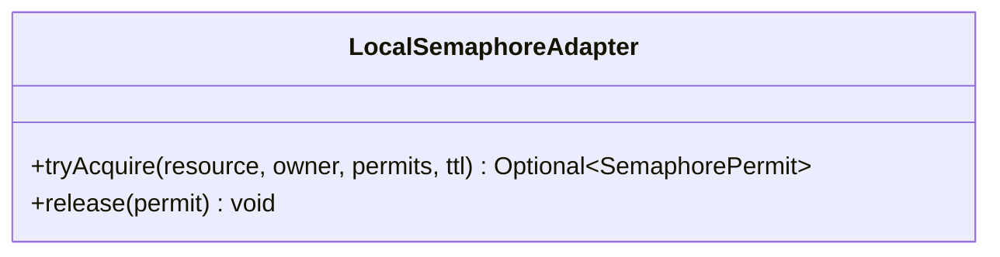
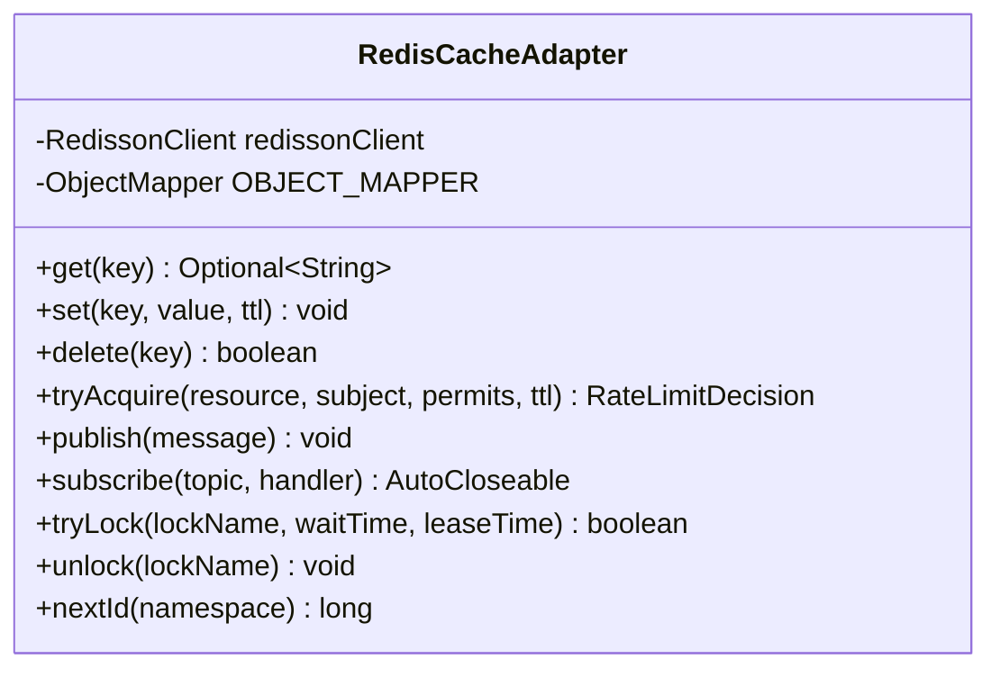
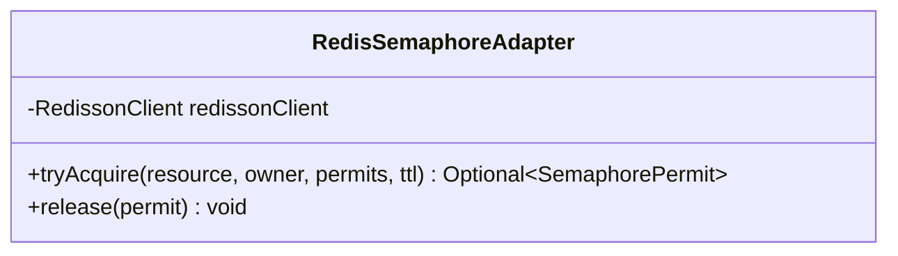
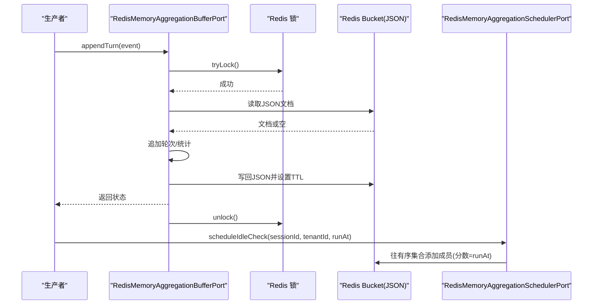
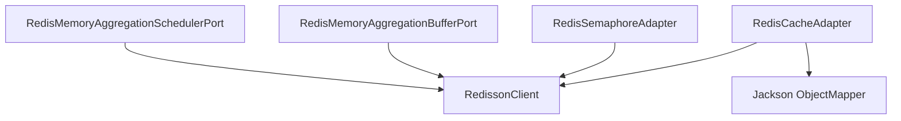

# 缓存适配器

<cite>
**本文引用的文件**
- [LocalCacheAdapter.java](file://seahorse-agent-adapter-cache-local/src/main/java/com/miracle/ai/seahorse/agent/adapters/cache/local/LocalCacheAdapter.java)
- [LocalSemaphoreAdapter.java](file://seahorse-agent-adapter-cache-local/src/main/java/com/miracle/ai/seahorse/agent/adapters/cache/local/LocalSemaphoreAdapter.java)
- [RedisCacheAdapter.java](file://seahorse-agent-adapter-cache-redis/src/main/java/com/miracle/ai/seahorse/agent/adapters/cache/redis/RedisCacheAdapter.java)
- [RedisSemaphoreAdapter.java](file://seahorse-agent-adapter-cache-redis/src/main/java/com/miracle/ai/seahorse/agent/adapters/cache/redis/RedisSemaphoreAdapter.java)
- [RedisMemoryAggregationBufferPort.java](file://seahorse-agent-adapter-cache-redis/src/main/java/com/miracle/ai/seahorse/agent/adapters/cache/redis/RedisMemoryAggregationBufferPort.java)
- [RedisMemoryAggregationSchedulerPort.java](file://seahorse-agent-adapter-cache-redis/src/main/java/com/miracle/ai/seahorse/agent/adapters/cache/redis/RedisMemoryAggregationSchedulerPort.java)
- [pom.xml](file://seahorse-agent-adapter-cache-redis/pom.xml)
- [README.md](file://seahorse-agent-adapter-cache-local/README.md)
- [KeyValueCachePort.java](file://seahorse-agent-kernel/src/main/java/com/miracle/ai/seahorse/agent/ports/outbound/cache/KeyValueCachePort.java)
- [PubSubPort.java](file://seahorse-agent-kernel/src/main/java/com/miracle/ai/seahorse/agent/ports/outbound/cache/PubSubPort.java)
- [RateLimiterPort.java](file://seahorse-agent-kernel/src/main/java/com/miracle/ai/seahorse/agent/ports/outbound/cache/RateLimiterPort.java)
- [DistributedLockPort.java](file://seahorse-agent-kernel/src/main/java/com/miracle/ai/seahorse/agent/ports/outbound/coordination/DistributedLockPort.java)
- [DistributedSemaphorePort.java](file://seahorse-agent-kernel/src/main/java/com/miracle/ai/seahorse/agent/ports/outbound/coordination/DistributedSemaphorePort.java)
- [IdGeneratorPort.java](file://seahorse-agent-kernel/src/main/java/com/miracle/ai/seahorse/agent/ports/outbound/id/IdGeneratorPort.java)
- [缓存出站端口.md](file://docs/zh/content/后端系统/核心内核/端口接口/出站端口/缓存出站端口.md)
</cite>

## 目录
1. [简介](#简介)
2. [项目结构](#项目结构)
3. [核心组件](#核心组件)
4. [架构总览](#架构总览)
5. [详细组件分析](#详细组件分析)
6. [依赖分析](#依赖分析)
7. [性能考量](#性能考量)
8. [故障排查指南](#故障排查指南)
9. [结论](#结论)
10. [附录](#附录)

## 简介
本文件系统性梳理缓存适配器体系，覆盖本地内存适配器与 Redis 适配器的实现原理、使用场景、配置机制、策略选择、性能优化与高并发协作（分布式锁与信号量）。文档同时解释缓存端口接口的设计理念，包括键值缓存、发布订阅、速率限制等能力，并给出配置示例与故障排查建议。

## 项目结构
缓存适配器相关模块分为“本地”和“Redis”两类实现，分别位于以下路径：
- 本地适配器：seahorse-agent-adapter-cache-local
- Redis 适配器：seahorse-agent-adapter-cache-redis
- 核心端口接口：seahorse-agent-kernel
- 文档：docs/zh/content/后端系统/核心内核/端口接口/出站端口/缓存出站端口.md

**图表来源**
- [LocalCacheAdapter.java:44-45](file://seahorse-agent-adapter-cache-local/src/main/java/com/miracle/ai/seahorse/agent/adapters/cache/local/LocalCacheAdapter.java#L44-L45)
- [LocalSemaphoreAdapter.java](file://seahorse-agent-adapter-cache-local/src/main/java/com/miracle/ai/seahorse/agent/adapters/cache/local/LocalSemaphoreAdapter.java#L33)
- [RedisCacheAdapter.java:48-49](file://seahorse-agent-adapter-cache-redis/src/main/java/com/miracle/ai/seahorse/agent/adapters/cache/redis/RedisCacheAdapter.java#L48-L49)
- [RedisSemaphoreAdapter.java](file://seahorse-agent-adapter-cache-redis/src/main/java/com/miracle/ai/seahorse/agent/adapters/cache/redis/RedisSemaphoreAdapter.java#L41)
- [RedisMemoryAggregationBufferPort.java](file://seahorse-agent-adapter-cache-redis/src/main/java/com/miracle/ai/seahorse/agent/adapters/cache/redis/RedisMemoryAggregationBufferPort.java#L51)
- [RedisMemoryAggregationSchedulerPort.java](file://seahorse-agent-adapter-cache-redis/src/main/java/com/miracle/ai/seahorse/agent/adapters/cache/redis/RedisMemoryAggregationSchedulerPort.java#L44)
- [KeyValueCachePort.java:26-33](file://seahorse-agent-kernel/src/main/java/com/miracle/ai/seahorse/agent/ports/outbound/cache/KeyValueCachePort.java#L26-L33)
- [PubSubPort.java:25-43](file://seahorse-agent-kernel/src/main/java/com/miracle/ai/seahorse/agent/ports/outbound/cache/PubSubPort.java#L25-L43)
- [RateLimiterPort.java:27-44](file://seahorse-agent-kernel/src/main/java/com/miracle/ai/seahorse/agent/ports/outbound/cache/RateLimiterPort.java#L27-L44)
- [DistributedLockPort.java:25-43](file://seahorse-agent-kernel/src/main/java/com/miracle/ai/seahorse/agent/ports/outbound/coordination/DistributedLockPort.java#L25-L43)
- [DistributedSemaphorePort.java:28-48](file://seahorse-agent-kernel/src/main/java/com/miracle/ai/seahorse/agent/ports/outbound/coordination/DistributedSemaphorePort.java#L28-L48)
- [IdGeneratorPort.java:25-35](file://seahorse-agent-kernel/src/main/java/com/miracle/ai/seahorse/agent/ports/outbound/id/IdGeneratorPort.java#L25-L35)

**章节来源**
- [缓存出站端口.md:149-181](file://docs/zh/content/后端系统/核心内核/端口接口/出站端口/缓存出站端口.md#L149-L181)

## 核心组件
- 本地适配器（LocalCacheAdapter）
  - 提供键值缓存、发布订阅、速率限制、分布式锁、ID 生成等能力，仅在单 JVM 内可见，适合本地开发与单节点部署。
- 本地信号量（LocalSemaphoreAdapter）
  - 本地信号量实现，不跨节点，主要用于依赖信号量端口的流程提供本地可运行能力。
- Redis 适配器（RedisCacheAdapter）
  - 基于 Redisson 的键值缓存、发布订阅、速率限制、分布式锁、ID 生成，支持 TTL 与序列化。
- Redis 信号量（RedisSemaphoreAdapter）
  - 基于 Redisson 可过期信号量，提供跨节点的分布式信号量，许可 ID 持久化以便精确释放。
- Redis 聚合缓冲与调度（RedisMemoryAggregationBufferPort、RedisMemoryAggregationSchedulerPort）
  - 支持分布式场景下的对话聚合缓冲与定时调度，基于 Redis 锁与有序集合。

**章节来源**
- [LocalCacheAdapter.java:39-45](file://seahorse-agent-adapter-cache-local/src/main/java/com/miracle/ai/seahorse/agent/adapters/cache/local/LocalCacheAdapter.java#L39-L45)
- [LocalSemaphoreAdapter.java:28-33](file://seahorse-agent-adapter-cache-local/src/main/java/com/miracle/ai/seahorse/agent/adapters/cache/local/LocalSemaphoreAdapter.java#L28-L33)
- [RedisCacheAdapter.java:42-49](file://seahorse-agent-adapter-cache-redis/src/main/java/com/miracle/ai/seahorse/agent/adapters/cache/redis/RedisCacheAdapter.java#L42-L49)
- [RedisSemaphoreAdapter.java:35-41](file://seahorse-agent-adapter-cache-redis/src/main/java/com/miracle/ai/seahorse/agent/adapters/cache/redis/RedisSemaphoreAdapter.java#L35-L41)
- [RedisMemoryAggregationBufferPort.java:44-51](file://seahorse-agent-adapter-cache-redis/src/main/java/com/miracle/ai/seahorse/agent/adapters/cache/redis/RedisMemoryAggregationBufferPort.java#L44-L51)
- [RedisMemoryAggregationSchedulerPort.java:31-44](file://seahorse-agent-adapter-cache-redis/src/main/java/com/miracle/ai/seahorse/agent/adapters/cache/redis/RedisMemoryAggregationSchedulerPort.java#L31-L44)

## 架构总览
缓存适配器遵循“端口-适配器”模式，内核定义端口接口，适配器实现具体能力。默认实现通过 SPI 注册与 META-INF 配置绑定。

**图表来源**
- [缓存出站端口.md:149-181](file://docs/zh/content/后端系统/核心内核/端口接口/出站端口/缓存出站端口.md#L149-L181)

## 详细组件分析

### 本地缓存适配器（LocalCacheAdapter）
- 功能要点
  - 键值缓存：基于并发哈希表存储，带过期时间检查与清理。
  - 发布订阅：进程内订阅列表，同步回调消息处理器。
  - 速率限制：按资源+主体计数，支持 TTL 清理。
  - 分布式锁：基于集合的简单互斥（单 JVM 可见）。
  - ID 生成：按命名空间自增。
- 关键数据结构
  - 缓存条目：键 -> 值+过期时间
  - 订阅者：主题 -> 处理器列表
  - 速率限制：资源:主体 -> 计数器+过期时间
  - 锁集合：锁名集合
  - 序列号：命名空间 -> 原子自增
- 复杂度
  - get/set/delete/tryLock/unlock/nextId 均摊 O(1)
  - 订阅遍历 O(N)（N 为订阅者数量）

**图表来源**
- [LocalCacheAdapter.java:47-51](file://seahorse-agent-adapter-cache-local/src/main/java/com/miracle/ai/seahorse/agent/adapters/cache/local/LocalCacheAdapter.java#L47-L51)
- [LocalCacheAdapter.java:153-165](file://seahorse-agent-adapter-cache-local/src/main/java/com/miracle/ai/seahorse/agent/adapters/cache/local/LocalCacheAdapter.java#L153-L165)

**章节来源**
- [LocalCacheAdapter.java:44-167](file://seahorse-agent-adapter-cache-local/src/main/java/com/miracle/ai/seahorse/agent/adapters/cache/local/LocalCacheAdapter.java#L44-L167)

### 本地信号量适配器（LocalSemaphoreAdapter）
- 功能要点
  - 本地信号量，不跨节点，许可数默认无上限。
  - 用于依赖信号量端口的流程提供本地可运行能力。
- 复杂度
  - tryAcquire/release 均摊 O(1)

**图表来源**
- [LocalSemaphoreAdapter.java:33-67](file://seahorse-agent-adapter-cache-local/src/main/java/com/miracle/ai/seahorse/agent/adapters/cache/local/LocalSemaphoreAdapter.java#L33-L67)

**章节来源**
- [LocalSemaphoreAdapter.java:28-67](file://seahorse-agent-adapter-cache-local/src/main/java/com/miracle/ai/seahorse/agent/adapters/cache/local/LocalSemaphoreAdapter.java#L28-L67)

### Redis 缓存适配器（RedisCacheAdapter）
- 功能要点
  - 键值缓存：RBucket 存储字符串，支持 TTL。
  - 发布订阅：RTopic 发布/订阅，消息序列化为 JSON。
  - 速率限制：RAtomicLong 计数，首次使用设置 TTL。
  - 分布式锁：RLock，支持等待与租约时间。
  - ID 生成：RAtomicLong 自增。
- 关键前缀
  - cache: seahorse:agent:cache:{key}
  - lock: seahorse:agent:lock:{lockName}
  - topic: seahorse:agent:topic:{topic}
  - ratelimit: seahorse:agent:ratelimit:{resource}:{subject}
  - id: seahorse:agent:id:{namespace}
- 复杂度
  - get/set/delete/tryLock/nextId 均摊 O(1)，序列化开销取决于消息大小。

**图表来源**
- [RedisCacheAdapter.java:48-63](file://seahorse-agent-adapter-cache-redis/src/main/java/com/miracle/ai/seahorse/agent/adapters/cache/redis/RedisCacheAdapter.java#L48-L63)
- [RedisCacheAdapter.java:168-194](file://seahorse-agent-adapter-cache-redis/src/main/java/com/miracle/ai/seahorse/agent/adapters/cache/redis/RedisCacheAdapter.java#L168-L194)

**章节来源**
- [RedisCacheAdapter.java:42-195](file://seahorse-agent-adapter-cache-redis/src/main/java/com/miracle/ai/seahorse/agent/adapters/cache/redis/RedisCacheAdapter.java#L42-L195)

### Redis 信号量适配器（RedisSemaphoreAdapter）
- 功能要点
  - 使用可过期信号量（RPermitExpirableSemaphore），许可 ID 持久化以便精确释放。
  - tryAcquire 成功后将许可 ID 列表写入 Redis，release 时读取并逐个释放。
- 复杂度
  - tryAcquire/Release 取决于许可数与网络往返，典型 O(k)（k 为许可数）。

**图表来源**
- [RedisSemaphoreAdapter.java:41-51](file://seahorse-agent-adapter-cache-redis/src/main/java/com/miracle/ai/seahorse/agent/adapters/cache/redis/RedisSemaphoreAdapter.java#L41-L51)
- [RedisSemaphoreAdapter.java:146-152](file://seahorse-agent-adapter-cache-redis/src/main/java/com/miracle/ai/seahorse/agent/adapters/cache/redis/RedisSemaphoreAdapter.java#L146-L152)

**章节来源**
- [RedisSemaphoreAdapter.java:35-161](file://seahorse-agent-adapter-cache-redis/src/main/java/com/miracle/ai/seahorse/agent/adapters/cache/redis/RedisSemaphoreAdapter.java#L35-L161)

### Redis 聚合缓冲与调度（Buffer/Scheduler）
- 聚合缓冲（RedisMemoryAggregationBufferPort）
  - 将缓冲状态以 JSON 文档存储于 Redis，按 (tenant, session) 维度加锁保护。
  - 支持按触发条件（空闲超时、轮次数、Token 数）刷新。
- 调度器（RedisMemoryAggregationSchedulerPort）
  - 使用有序集合记录待检查项，按到期时间拉取并移除，避免重复处理。

**图表来源**
- [RedisMemoryAggregationBufferPort.java:77-119](file://seahorse-agent-adapter-cache-redis/src/main/java/com/miracle/ai/seahorse/agent/adapters/cache/redis/RedisMemoryAggregationBufferPort.java#L77-L119)
- [RedisMemoryAggregationSchedulerPort.java:56-88](file://seahorse-agent-adapter-cache-redis/src/main/java/com/miracle/ai/seahorse/agent/adapters/cache/redis/RedisMemoryAggregationSchedulerPort.java#L56-L88)

**章节来源**
- [RedisMemoryAggregationBufferPort.java:44-345](file://seahorse-agent-adapter-cache-redis/src/main/java/com/miracle/ai/seahorse/agent/adapters/cache/redis/RedisMemoryAggregationBufferPort.java#L44-L345)
- [RedisMemoryAggregationSchedulerPort.java:31-124](file://seahorse-agent-adapter-cache-redis/src/main/java/com/miracle/ai/seahorse/agent/adapters/cache/redis/RedisMemoryAggregationSchedulerPort.java#L31-L124)

## 依赖分析
- Redis 适配器依赖
  - Redisson：提供客户端、分布式对象（RBucket、RLock、RTopic、RAtomicLong、RPermitExpirableSemaphore、RScoredSortedSet、RKeys）。
  - Jackson：用于发布订阅消息的序列化/反序列化。
- 本地适配器依赖
  - JDK 并发集合与原子类型，无外部依赖。

**图表来源**
- [pom.xml:18-32](file://seahorse-agent-adapter-cache-redis/pom.xml#L18-L32)
- [RedisCacheAdapter.java:20-35](file://seahorse-agent-adapter-cache-redis/src/main/java/com/miracle/ai/seahorse/agent/adapters/cache/redis/RedisCacheAdapter.java#L20-L35)

**章节来源**
- [pom.xml:18-32](file://seahorse-agent-adapter-cache-redis/pom.xml#L18-L32)

## 性能考量
- 缓存命中率提升
  - 合理设置 TTL，避免过短导致频繁重建、过长导致陈旧数据。
  - 对热点键进行预热与分片，减少单点压力。
  - 使用本地适配器作为本地缓存层，降低远程调用开销。
- 内存管理
  - 本地适配器采用并发容器，注意订阅者列表增长导致的内存占用。
  - Redis 适配器建议控制消息体大小，避免序列化/网络放大。
- 速率限制
  - Redis 适配器的计数器天然跨节点一致，适合全局限流；本地适配器仅适合单节点。
- 分布式锁与信号量
  - Redis 适配器使用 Redisson 的公平/可重入特性，合理设置等待与租约时间，避免死锁与饥饿。
  - 信号量许可 ID 持久化，确保异常释放也能恢复，但需关注持久化键的 TTL 与清理策略。

[本节为通用性能建议，无需特定文件引用]

## 故障排查指南
- 本地适配器
  - 多节点部署出现竞态：确认未依赖本地锁/信号量/限流的跨节点一致性。
  - 订阅者未收到消息：检查订阅主题与处理器是否正确注册与注销。
- Redis 适配器
  - 发布订阅失败：检查消息序列化/反序列化异常与网络连通性。
  - 速率限制异常：确认 permits 参数为正数，TTL 设置是否导致计数器过早过期。
  - 分布式锁无法获取：检查等待/租约时间配置与中断处理。
  - 信号量释放失败：确认许可 ID 是否已持久化且未过期。
- 聚合缓冲与调度
  - 缓冲未刷新：检查触发条件与策略配置，确认锁获取成功。
  - 调度重复/漏处理：确认有序集合的去重与原子移除逻辑。

**章节来源**
- [README.md:14-19](file://seahorse-agent-adapter-cache-local/README.md#L14-L19)
- [RedisCacheAdapter.java:145-159](file://seahorse-agent-adapter-cache-redis/src/main/java/com/miracle/ai/seahorse/agent/adapters/cache/redis/RedisCacheAdapter.java#L145-L159)
- [RedisSemaphoreAdapter.java:64-74](file://seahorse-agent-adapter-cache-redis/src/main/java/com/miracle/ai/seahorse/agent/adapters/cache/redis/RedisSemaphoreAdapter.java#L64-L74)
- [RedisMemoryAggregationBufferPort.java:180-197](file://seahorse-agent-adapter-cache-redis/src/main/java/com/miracle/ai/seahorse/agent/adapters/cache/redis/RedisMemoryAggregationBufferPort.java#L180-L197)

## 结论
- 本地适配器适合本地开发与单节点部署，提供最小可用能力；多节点场景请使用 Redis 适配器。
- Redis 适配器以 Redisson 为核心，提供跨节点一致的键值缓存、发布订阅、速率限制、分布式锁与信号量。
- 聚合缓冲与调度进一步完善了分布式场景下的内存聚合能力，结合有序集合与分布式锁实现可靠的状态管理。
- 在实际部署中，应根据业务规模与一致性要求选择适配器类型，并结合 TTL、序列化策略与锁参数进行优化。

[本节为总结性内容，无需特定文件引用]

## 附录

### 端口接口概览
- 键值缓存：提供 get/set/delete 能力。
- 发布订阅：提供 publish/subscribe 能力。
- 速率限制：提供 tryAcquire 能力与决策返回。
- 分布式锁：提供 tryLock/unlock 能力。
- 分布式信号量：提供 tryAcquire/release 能力。
- ID 生成：提供按命名空间自增 ID。

**章节来源**
- [KeyValueCachePort.java:23-33](file://seahorse-agent-kernel/src/main/java/com/miracle/ai/seahorse/agent/ports/outbound/cache/KeyValueCachePort.java#L23-L33)
- [PubSubPort.java:25-43](file://seahorse-agent-kernel/src/main/java/com/miracle/ai/seahorse/agent/ports/outbound/cache/PubSubPort.java#L25-L43)
- [RateLimiterPort.java:27-44](file://seahorse-agent-kernel/src/main/java/com/miracle/ai/seahorse/agent/ports/outbound/cache/RateLimiterPort.java#L27-L44)
- [DistributedLockPort.java:25-43](file://seahorse-agent-kernel/src/main/java/com/miracle/ai/seahorse/agent/ports/outbound/coordination/DistributedLockPort.java#L25-L43)
- [DistributedSemaphorePort.java:28-48](file://seahorse-agent-kernel/src/main/java/com/miracle/ai/seahorse/agent/ports/outbound/coordination/DistributedSemaphorePort.java#L28-L48)
- [IdGeneratorPort.java:25-35](file://seahorse-agent-kernel/src/main/java/com/miracle/ai/seahorse/agent/ports/outbound/id/IdGeneratorPort.java#L25-L35)

### 配置与使用建议
- 本地适配器
  - 适用：本地开发、单节点部署、测试。
  - 注意：不保证跨节点一致性，多节点部署请切换 Redis 适配器。
- Redis 适配器
  - 适用：分布式部署、需要跨节点一致性的缓存、发布订阅、限流、锁与信号量。
  - 建议：合理设置 TTL、序列化策略（JSON）、锁等待与租约时间，监控 Redis 延迟与内存使用。

**章节来源**
- [README.md:14-19](file://seahorse-agent-adapter-cache-local/README.md#L14-L19)
- [RedisCacheAdapter.java:42-49](file://seahorse-agent-adapter-cache-redis/src/main/java/com/miracle/ai/seahorse/agent/adapters/cache/redis/RedisCacheAdapter.java#L42-L49)