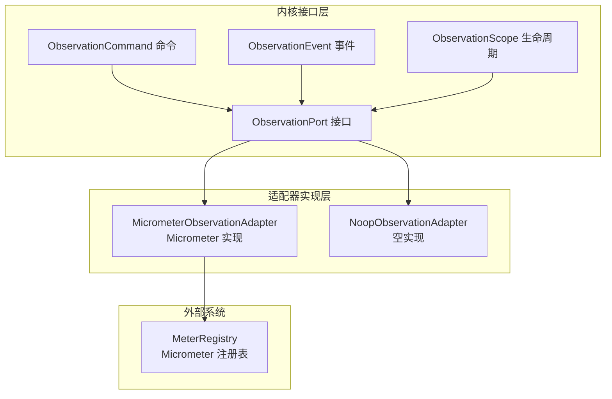
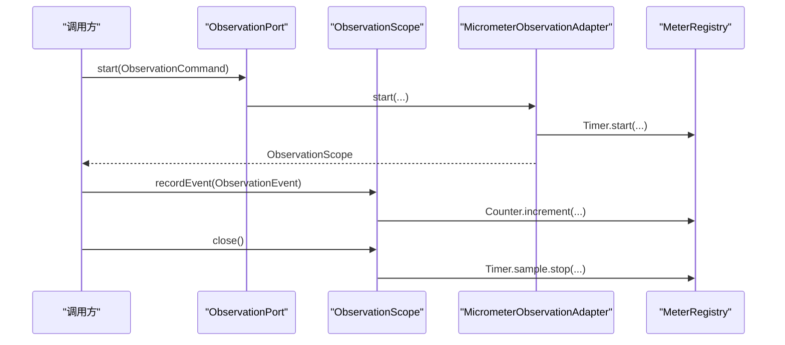
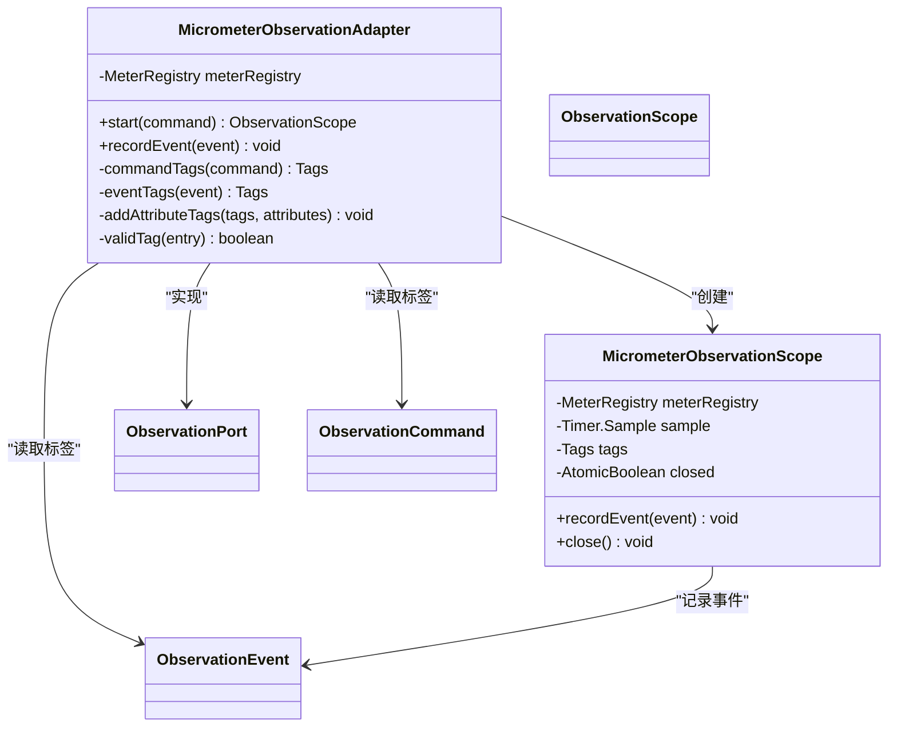
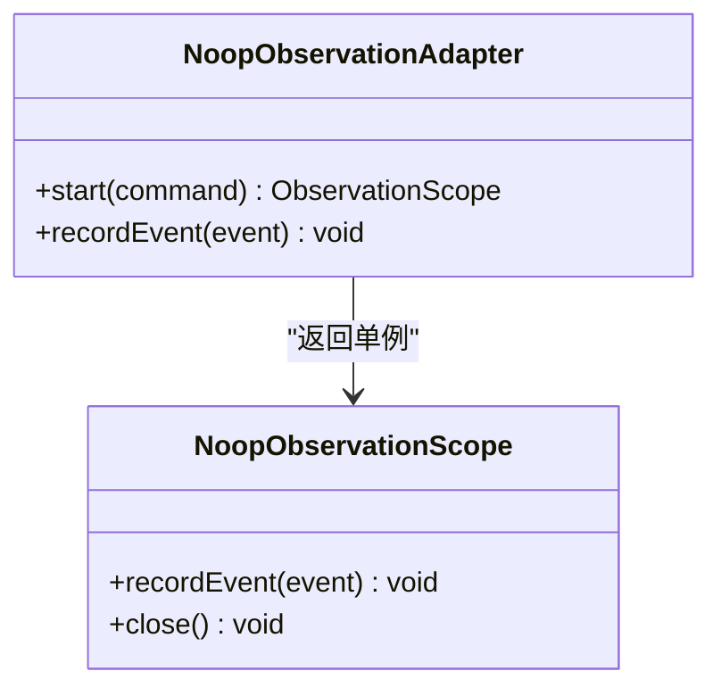
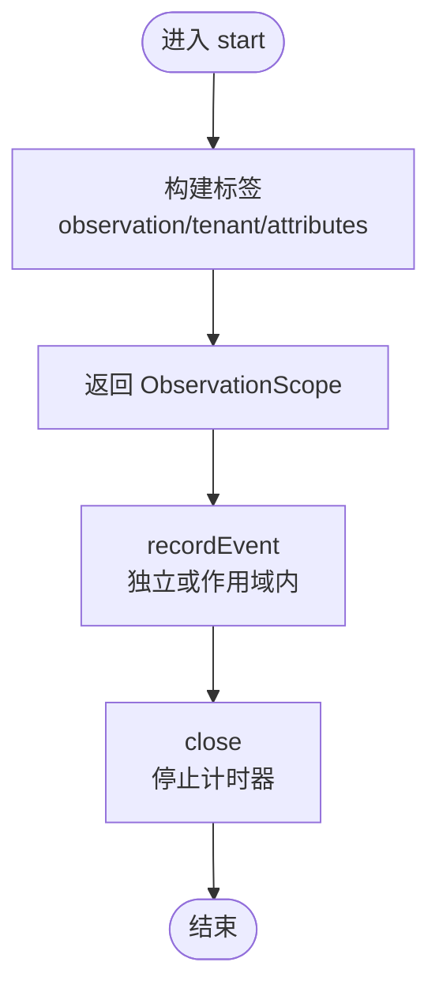
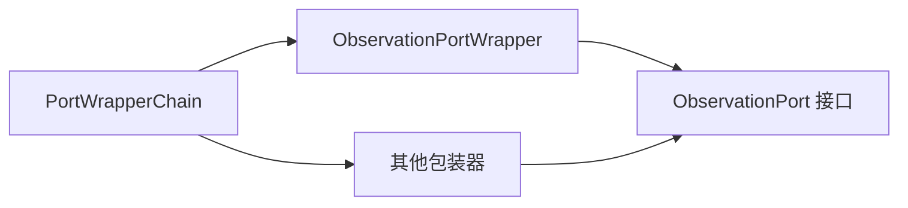
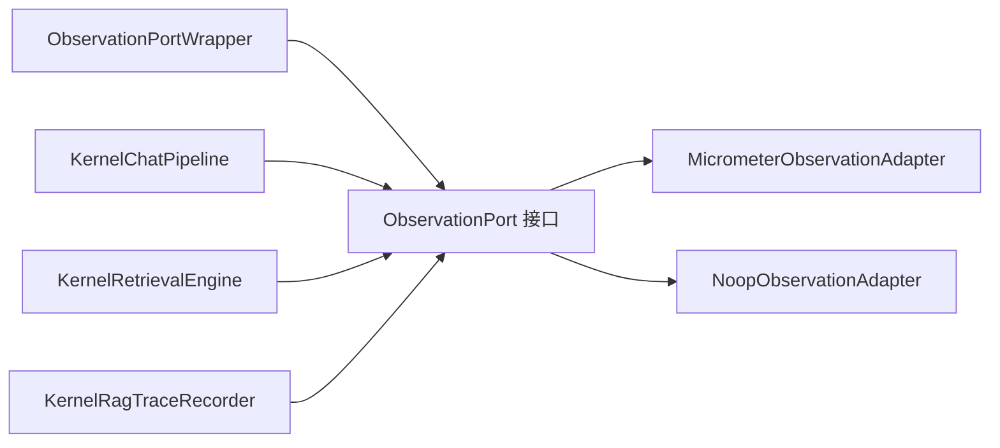

# 观测性适配器

<cite>
**本文引用的文件**
- [MicrometerObservationAdapter.java](file://seahorse-agent-adapter-observation-micrometer/src/main/java/com/miracle/ai/seahorse/agent/adapters/observation/micrometer/MicrometerObservationAdapter.java)
- [NoopObservationAdapter.java](file://seahorse-agent-adapter-observation-noop/src/main/java/com/miracle/ai/seahorse/agent/adapters/observation/noop/NoopObservationAdapter.java)
- [ObservationPort.java](file://seahorse-agent-kernel/src/main/java/com/miracle/ai/seahorse/agent/ports/outbound/observation/ObservationPort.java)
- [NoopObservationPort.java](file://seahorse-agent-kernel/src/main/java/com/miracle/ai/seahorse/agent/ports/outbound/observation/NoopObservationPort.java)
- [SeahorseAgentObservationAdapterAutoConfiguration.java](file://seahorse-agent-spring-boot-starter\src\main\java\com\miracle\ai\seahorse\agent\adapters\spring\SeahorseAgentObservationAdapterAutoConfiguration.java)
- [ObservationPortWrapper.java](file://seahorse-agent-kernel/src/main/java/com/miracle/ai/seahorse/agent/kernel/plugin/wrapper/ObservationPortWrapper.java)
- [PortWrapperChain.java](file://seahorse-agent-kernel/src/main/java/com/miracle/ai/seahorse/agent/kernel/plugin/wrapper/PortWrapperChain.java)
- [ObservationScope.java](file://seahorse-agent-kernel/src/main/java/com/miracle/ai/seahorse/agent/ports/outbound/observation/ObservationScope.java)
- [ObservationCommand.java](file://seahorse-agent-kernel/src/main/java/com/miracle/ai/seahorse/agent/ports/outbound/observation/ObservationCommand.java)
- [ObservationEvent.java](file://seahorse-agent-kernel/src/main/java/com/miracle/ai/seahorse/agent/ports/outbound/observation/ObservationEvent.java)
- [ObservationPort.md（文档）](file://docs/zh/content/后端系统/核心内核/端口接口/出站端口/观测性出站端口.md)
- [应用监控.md（文档）](file://docs/zh/content/监控运维/应用监控.md)
- [Micrometer 适配器文档](file://docs/zh/content/后端系统/适配器模块/观测性适配器.md)
</cite>

## 目录
1. [引言](#引言)
2. [项目结构](#项目结构)
3. [核心组件](#核心组件)
4. [架构总览](#架构总览)
5. [详细组件分析](#详细组件分析)
6. [依赖分析](#依赖分析)
7. [性能考量](#性能考量)
8. [故障排查指南](#故障排查指南)
9. [结论](#结论)
10. [附录](#附录)

## 引言
本文件系统性介绍“观测性适配器”的设计与实现，重点覆盖以下内容：
- 观测端口接口的设计与职责边界：包括命令、事件与生命周期管理。
- Micrometer 观测性适配器的实现原理与配置方法：指标体系（计数器、定时器）、标签维度、生命周期与并发控制。
- 空实现（Noop）适配器的作用与适用场景。
- 与内核包装器链的协作关系，以及与链路追踪、日志记录的协同方式。
- 指标导出与可视化配置、性能影响评估与优化建议、隐私与合规注意事项、测试与故障排查方法。

## 项目结构
观测性适配器由“内核接口层”“适配器实现层”“外部系统（Micrometer 注册表）”三部分组成，通过 SPI 机制与运行时解耦，支持在任意环境中注入 MeterRegistry 或回退到 Noop 实现。

图示来源
- [ObservationPort.java:25-42](file://seahorse-agent-kernel/src/main/java/com/miracle/ai/seahorse/agent/ports/outbound/observation/ObservationPort.java#L25-L42)
- [MicrometerObservationAdapter.java:42-137](file://seahorse-agent-adapter-observation-micrometer/src/main/java/com/miracle/ai/seahorse/agent/adapters/observation/micrometer/MicrometerObservationAdapter.java#L42-L137)
- [NoopObservationAdapter.java:28-55](file://seahorse-agent-adapter-observation-noop/src/main/java/com/miracle/ai/seahorse/agent/adapters/observation/noop/NoopObservationAdapter.java#L28-L55)

章节来源
- [ObservationPort.java:25-42](file://seahorse-agent-kernel/src/main/java/com/miracle/ai/seahorse/agent/ports/outbound/observation/ObservationPort.java#L25-L42)
- [MicrometerObservationAdapter.java:42-137](file://seahorse-agent-adapter-observation-micrometer/src/main/java/com/miracle/ai/seahorse/agent/adapters/observation/micrometer/MicrometerObservationAdapter.java#L42-L137)
- [NoopObservationAdapter.java:28-55](file://seahorse-agent-adapter-observation-noop/src/main/java/com/miracle/ai/seahorse/agent/adapters/observation/noop/NoopObservationAdapter.java#L28-L55)

## 核心组件
- 观测端口接口（ObservationPort）：定义观测生命周期入口与事件记录能力，默认实现为 Noop，便于无观测环境回退。
- 观测命令（ObservationCommand）：描述一次观测的元信息（名称、租户、属性）。
- 观测事件（ObservationEvent）：描述独立发生的事件（名称、发生时间、属性）。
- 观测作用域（ObservationScope）：封装一次观测的生命周期，支持在作用域内记录事件并在结束时统计耗时。
- Micrometer 适配器：将上述抽象映射为 Micrometer 的 Timer 与 Counter 指标，支持标签维度化聚合。
- Noop 适配器：空实现，不产生任何观测数据，适合测试或禁用观测的场景。

章节来源
- [ObservationPort.java:25-42](file://seahorse-agent-kernel/src/main/java/com/miracle/ai/seahorse/agent/ports/outbound/observation/ObservationPort.java#L25-L42)
- [ObservationScope.java:30-34](file://seahorse-agent-kernel/src/main/java/com/miracle/ai/seahorse/agent/ports/outbound/observation/ObservationScope.java#L30-L34)
- [ObservationCommand.java:1-200](file://seahorse-agent-kernel/src/main/java/com/miracle/ai/seahorse/agent/ports/outbound/observation/ObservationCommand.java)
- [ObservationEvent.java:1-200](file://seahorse-agent-kernel/src/main/java/com/miracle/ai/seahorse/agent/ports/outbound/observation/ObservationEvent.java)

## 架构总览
观测适配器采用“接口 + SPI + 可插拔实现”的架构设计，内核仅依赖抽象接口，运行时通过依赖注入或自动装配选择具体实现。Micrometer 适配器直接对接 Micrometer 注册表，生成两类核心指标：持续时间（Timer）与事件计数（Counter），并以标签进行维度化聚合。

图示来源
- [ObservationPort.java:34-41](file://seahorse-agent-kernel/src/main/java/com/miracle/ai/seahorse/agent/ports/outbound/observation/ObservationPort.java#L34-L41)
- [ObservationScope.java:30-34](file://seahorse-agent-kernel/src/main/java/com/miracle/ai/seahorse/agent/ports/outbound/observation/ObservationScope.java#L30-L34)
- [MicrometerObservationAdapter.java:56-134](file://seahorse-agent-adapter-observation-micrometer/src/main/java/com/miracle/ai/seahorse/agent/adapters/observation/micrometer/MicrometerObservationAdapter.java#L56-L134)

## 详细组件分析

### Micrometer 观测适配器
- 设计要点
  - 不依赖 Spring Boot 自动配置，通过构造函数注入 MeterRegistry 即可工作。
  - 将观测命令映射为计时器采样，将事件映射为计数器增量。
  - 使用标签对观测维度进行聚合，包括观测名、租户、自定义属性等。
  - 作用域关闭时才停止计时器，避免重复关闭与竞态。
- 指标与标签
  - 持续时间指标：基于 Timer.builder(...)，标签包含 observation、tenant 与 attributes 中的有效键值。
  - 事件指标：基于 Counter.builder(...)，标签包含 event 与 attributes 中的有效键值。
  - 属性校验：仅接受非空键且值非空的属性作为标签，防止无效标签污染。
- 生命周期与并发
  - 作用域内部使用原子布尔标记避免重复关闭。
  - 事件记录在作用域内时，会合并作用域标签与事件标签，保证维度一致性。
- 关键路径参考
  - 启动观测与构建标签：[MicrometerObservationAdapter.java:56-88](file://seahorse-agent-adapter-observation-micrometer/src/main/java/com/miracle/ai/seahorse/agent/adapters/observation/micrometer/MicrometerObservationAdapter.java#L56-L88)
  - 事件记录与标签合并：[MicrometerObservationAdapter.java:117-124](file://seahorse-agent-adapter-observation-micrometer/src/main/java/com/miracle/ai/seahorse/agent/adapters/observation/micrometer/MicrometerObservationAdapter.java#L117-L124)
  - 作用域关闭与计时器停止：[MicrometerObservationAdapter.java:126-134](file://seahorse-agent-adapter-observation-micrometer/src/main/java/com/miracle/ai/seahorse/agent/adapters/observation/micrometer/MicrometerObservationAdapter.java#L126-L134)

图示来源
- [MicrometerObservationAdapter.java:42-143](file://seahorse-agent-adapter-observation-micrometer/src/main/java/com/miracle/ai/seahorse/agent/adapters/observation/micrometer/MicrometerObservationAdapter.java#L42-L143)

章节来源
- [MicrometerObservationAdapter.java:42-143](file://seahorse-agent-adapter-observation-micrometer/src/main/java/com/miracle/ai/seahorse/agent/adapters/observation/micrometer/MicrometerObservationAdapter.java#L42-L143)
- [应用监控.md（文档）:134-177](file://docs/zh/content/监控运维/应用监控.md#L134-L177)

### 空实现（Noop）适配器
- 设计要点
  - 提供不产生任何观测数据的实现，适合测试或禁用观测的场景。
  - 默认返回同一作用域实例，避免重复对象创建。
- 关键路径参考
  - 启动观测与事件记录：[NoopObservationAdapter.java:32-40](file://seahorse-agent-adapter-observation-noop/src/main/java/com/miracle/ai/seahorse/agent/adapters/observation/noop/NoopObservationAdapter.java#L32-L40)
  - 作用域关闭：[NoopObservationAdapter.java:49-52](file://seahorse-agent-adapter-observation-noop/src/main/java/com/miracle/ai/seahorse/agent/adapters/observation/noop/NoopObservationAdapter.java#L49-L52)

图示来源
- [NoopObservationAdapter.java:28-55](file://seahorse-agent-adapter-observation-noop/src/main/java/com/miracle/ai/seahorse/agent/adapters/observation/noop/NoopObservationAdapter.java#L28-L55)

章节来源
- [NoopObservationAdapter.java:28-55](file://seahorse-agent-adapter-observation-noop/src/main/java/com/miracle/ai/seahorse/agent/adapters/observation/noop/NoopObservationAdapter.java#L28-L55)

### 观测端口接口与生命周期
- 接口职责
  - start：接收观测命令，返回作用域实例，开启一次观测生命周期。
  - recordEvent：记录独立观测事件。
  - noop：返回默认的 Noop 实现，供无观测环境回退。
- 生命周期管理
  - 作用域支持在生命周期内记录事件，并在 close 时完成耗时统计。
- 关键路径参考
  - 接口定义与默认实现：[ObservationPort.java:25-49](file://seahorse-agent-kernel/src/main/java/com/miracle/ai/seahorse/agent/ports/outbound/observation/ObservationPort.java#L25-L49)
  - 作用域接口：[ObservationScope.java:30-34](file://seahorse-agent-kernel/src/main/java/com/miracle/ai/seahorse/agent/ports/outbound/observation/ObservationScope.java#L30-L34)

图示来源
- [ObservationPort.java:34-41](file://seahorse-agent-kernel/src/main/java/com/miracle/ai/seahorse/agent/ports/outbound/observation/ObservationPort.java#L34-L41)
- [MicrometerObservationAdapter.java:56-134](file://seahorse-agent-adapter-observation-micrometer/src/main/java/com/miracle/ai/seahorse/agent/adapters/observation/micrometer/MicrometerObservationAdapter.java#L56-L134)

章节来源
- [ObservationPort.java:25-49](file://seahorse-agent-kernel/src/main/java/com/miracle/ai/seahorse/agent/ports/outbound/observation/ObservationPort.java#L25-L49)
- [ObservationScope.java:30-34](file://seahorse-agent-kernel/src/main/java/com/miracle/ai/seahorse/agent/ports/outbound/observation/ObservationScope.java#L30-L34)

### 配置与自动装配
- Micrometer 自动装配条件
  - 当存在 MeterRegistry Bean 且配置项 seahorse-agent.adapters.observation.type=micrometer 时，自动注册 MicrometerObservationAdapter。
  - 未指定 ObservationPort 时生效，避免与用户自定义实现冲突。
- 关键路径参考
  - 自动装配类：[SeahorseAgentObservationAdapterAutoConfiguration.java:53-65](file://seahorse-agent-spring-boot-starter/src/main/java/com/miracle/ai/seahorse/agent/adapters/spring/SeahorseAgentObservationAdapterAutoConfiguration.java#L53-L65)

章节来源
- [SeahorseAgentObservationAdapterAutoConfiguration.java:53-65](file://seahorse-agent-spring-boot-starter/src/main/java/com/miracle/ai/seahorse/agent/adapters/spring/SeahorseAgentObservationAdapterAutoConfiguration.java#L53-L65)

### 与内核包装器链的协作
- 观测端口包装器
  - ObservationPortWrapper 将观测适配器置于固定顺序，避免观测逻辑散落于各处。
- 包装器链
  - PortWrapperChain 按 order 排序应用包装器，支持诊断重复名称与顺序冲突。
- 关键路径参考
  - 包装器定义与顺序：[ObservationPortWrapper.java:27-43](file://seahorse-agent-kernel/src/main/java/com/miracle/ai/seahorse/agent/kernel/plugin/wrapper/ObservationPortWrapper.java#L27-L43)
  - 包装器链实现与诊断：[PortWrapperChain.java:37-94](file://seahorse-agent-kernel/src/main/java/com/miracle/ai/seahorse/agent/kernel/plugin/wrapper/PortWrapperChain.java#L37-L94)

图示来源
- [ObservationPortWrapper.java:27-43](file://seahorse-agent-kernel/src/main/java/com/miracle/ai/seahorse/agent/kernel/plugin/wrapper/ObservationPortWrapper.java#L27-L43)
- [PortWrapperChain.java:37-94](file://seahorse-agent-kernel/src/main/java/com/miracle/ai/seahorse/agent/kernel/plugin/wrapper/PortWrapperChain.java#L37-L94)

章节来源
- [ObservationPortWrapper.java:27-43](file://seahorse-agent-kernel/src/main/java/com/miracle/ai/seahorse/agent/kernel/plugin/wrapper/ObservationPortWrapper.java#L27-L43)
- [PortWrapperChain.java:37-94](file://seahorse-agent-kernel/src/main/java/com/miracle/ai/seahorse/agent/kernel/plugin/wrapper/PortWrapperChain.java#L37-L94)

## 依赖分析
- 观测端口接口与实现解耦：接口位于 kernel 模块，适配器位于 adapter 模块，通过 SPI 机制加载。
- 包装器固定顺序：ObservationPortWrapper 将观测适配器置于固定顺序，避免观测逻辑散落于各处。
- 与 Trace 记录器协作：内核 Trace 记录器负责节点级链路追踪，ObservationPort 负责指标与事件观测，二者互补。

图示来源
- [ObservationPort.java:25-49](file://seahorse-agent-kernel/src/main/java/com/miracle/ai/seahorse/agent/ports/outbound/observation/ObservationPort.java#L25-L49)
- [NoopObservationPort.java:22-47](file://seahorse-agent-kernel/src/main/java/com/miracle/ai/seahorse/agent/ports/outbound/observation/NoopObservationPort.java#L22-L47)
- [ObservationPortWrapper.java:27-43](file://seahorse-agent-kernel/src/main/java/com/miracle/ai/seahorse/agent/kernel/plugin/wrapper/ObservationPortWrapper.java#L27-L43)

章节来源
- [ObservationPort.java:25-49](file://seahorse-agent-kernel/src/main/java/com/miracle/ai/seahorse/agent/ports/outbound/observation/ObservationPort.java#L25-L49)
- [NoopObservationPort.java:22-47](file://seahorse-agent-kernel/src/main/java/com/miracle/ai/seahorse/agent/ports/outbound/observation/NoopObservationPort.java#L22-L47)
- [ObservationPortWrapper.java:27-43](file://seahorse-agent-kernel/src/main/java/com/miracle/ai/seahorse/agent/kernel/plugin/wrapper/ObservationPortWrapper.java#L27-L43)

## 性能考量
- 指标开销
  - Micrometer 适配器在 start/close 时创建/停止计时器，在 recordEvent 时进行计数器增量，属于轻量级操作。
  - 标签数量与键值长度会影响注册表的内存占用与查询效率，应控制标签基数。
- 并发与线程安全
  - 作用域内部使用原子布尔避免重复关闭，减少竞态风险。
- 采样与聚合
  - Micrometer 支持多种聚合方式（直方图、摘要等），可通过注册表配置进行调优。
- 环境选择
  - 生产环境优先使用 Micrometer 适配器并接入集中式监控系统。
  - 测试或开发环境可使用 Noop 适配器降低开销。

章节来源
- [Micrometer 适配器文档:235-246](file://docs/zh/content/后端系统/适配器模块/观测性适配器.md#L235-L246)

## 故障排查指南
- 常见问题
  - 观测指标缺失：确认是否正确注入 MeterRegistry，以及是否选择了正确的适配器实现。
  - 标签异常：检查属性键值是否为空，Micrometer 适配器会过滤无效标签。
  - 作用域未关闭：确保在生命周期结束时调用 close，否则计时器不会停止。
- 定位步骤
  - 检查端口默认实现与包装器顺序，确保适配器被正确加载。
  - 在 Micrometer 侧验证指标名称与标签是否符合预期。
- 相关路径参考
  - 适配器默认实现与包装器顺序：[ObservationPort.java:25-26](file://seahorse-agent-kernel/src/main/java/com/miracle/ai/seahorse/agent/ports/outbound/observation/ObservationPort.java#L25-L26), [ObservationPortWrapper.java:27-43](file://seahorse-agent-kernel/src/main/java/com/miracle/ai/seahorse/agent/kernel/plugin/wrapper/ObservationPortWrapper.java#L27-L43)
  - 标签有效性与过滤：[MicrometerObservationAdapter.java:98-102](file://seahorse-agent-adapter-observation-micrometer/src/main/java/com/miracle/ai/seahorse/agent/adapters/observation/micrometer/MicrometerObservationAdapter.java#L98-L102)

章节来源
- [ObservationPort.java:25-26](file://seahorse-agent-kernel/src/main/java/com/miracle/ai/seahorse/agent/ports/outbound/observation/ObservationPort.java#L25-L26)
- [ObservationPortWrapper.java:27-43](file://seahorse-agent-kernel/src/main/java/com/miracle/ai/seahorse/agent/kernel/plugin/wrapper/ObservationPortWrapper.java#L27-L43)
- [MicrometerObservationAdapter.java:98-102](file://seahorse-agent-adapter-observation-micrometer/src/main/java/com/miracle/ai/seahorse/agent/adapters/observation/micrometer/MicrometerObservationAdapter.java#L98-L102)

## 结论
观测性适配器通过清晰的接口与可插拔实现，为内核提供了统一的观测抽象。Micrometer 适配器将观测命令与事件转化为标准指标，配合标签维度化聚合，满足生产级监控需求；Noop 适配器则在测试与禁用场景下提供零开销替代。通过包装器链与自动装配机制，观测适配器与内核实现松耦合、易扩展，并与链路追踪、日志记录形成互补的可观测性体系。

## 附录
- 指标与标签清单
  - 持续时间指标：用于记录观测生命周期内的耗时，标签包含 observation、tenant 与 attributes 中的有效键值。
  - 事件计数指标：用于记录独立事件的发生次数，标签包含 event 与 attributes 中的有效键值。
- 导出与可视化
  - 通过 Micrometer 注册表对接 Prometheus、InfluxDB 等监控系统，按需配置暴露端点与抓取频率。
- 隐私与合规
  - 控制标签基数，避免敏感信息作为标签；遵循最小化原则，仅暴露必要维度。
- 测试方法
  - 使用测试桩实现 ObservationPort 记录事件，断言事件序列与标签组合；验证作用域关闭与计时器停止行为。

章节来源
- [应用监控.md（文档）:134-177](file://docs/zh/content/监控运维/应用监控.md#L134-L177)
- [Micrometer 适配器文档:235-246](file://docs/zh/content/后端系统/适配器模块/观测性适配器.md#L235-L246)