# 适配器系统

<cite>
**本文引用的文件**
- [LocalCacheAdapter.java](file://seahorse-agent-adapter-cache-local/src/main/java/com/miracle/ai/seahorse/agent/adapters/cache/local/LocalCacheAdapter.java)
- [RedisCacheAdapter.java](file://seahorse-agent-adapter-cache-redis/src/main/java/com/miracle/ai/seahorse/agent/adapters/cache/redis/RedisCacheAdapter.java)
- [PulsarMessageQueueAdapter.java](file://seahorse-agent-adapter-mq-pulsar/src/main/java/com/miracle/ai/seahorse/agent/adapters/mq/pulsar/PulsarMessageQueueAdapter.java)
- [JdbcRepositoryAdapter.java](file://seahorse-agent-adapter-repository-jdbc/src/main/java/com/miracle/ai/seahorse/agent/adapters/repository/jdbc/JdbcRepositoryAdapter.java)
- [ElasticsearchKeywordIndexAdapter.java](file://seahorse-agent-adapter-search-elasticsearch/src/main/java/com/miracle/ai/seahorse/agent/adapters/search/elasticsearch/ElasticsearchKeywordIndexAdapter.java)
- [LuceneKeywordIndexAdapter.java](file://seahorse-agent-adapter-search-lucene/src/main/java/com/miracle/ai/seahorse/agent/adapters/search/lucene/LuceneKeywordIndexAdapter.java)
- [S3ObjectStorageAdapter.java](file://seahorse-agent-adapter-storage-s3/src/main/java/com/miracle/ai/seahorse/agent/adapters/storage/s3/S3ObjectStorageAdapter.java)
- [MilvusVectorAdapter.java](file://seahorse-agent-adapter-vector-milvus/src/main/java/com/miracle/ai/seahorse/agent/adapters/vector/milvus/MilvusVectorAdapter.java)
- [NoopVectorStoreAdapter.java](file://seahorse-agent-adapter-vector-noop/src/main/java/com/miracle/ai/seahorse/agent/adapters/vector/noop/NoopVectorStoreAdapter.java)
- [MicrometerObservationAdapter.java](file://seahorse-agent-adapter-observation-micrometer/src/main/java/com/miracle/ai/seahorse/agent/adapters/observation/micrometer/MicrometerObservationAdapter.java)
- [NoopObservationAdapter.java](file://seahorse-agent-adapter-observation-noop/src/main/java/com/miracle/ai/seahorse/agent/adapters/observation/noop/NoopObservationAdapter.java)
- [OpenAiCompatibleModelAdapter.java](file://seahorse-agent-adapter-ai-openai-compatible/src/main/java/com/miracle/ai/seahorse/agent/adapters/ai/openai/OpenAiCompatibleModelAdapter.java)
- [JinaRerankModelAdapter.java](file://seahorse-agent-adapter-ai-openai-compatible/src/main/java/com/miracle/ai/seahorse/agent/adapters/ai/JinaRerankModelAdapter.java)
- [McPHttpAdapter.java](file://seahorse-agent-adapter-mcp-http/src/main/java/com/miracle/ai/seahorse/agent/adapters/mcp/http/McPHttpAdapter.java)
- [NoOpQueryRewriteAdapter.java](file://seahorse-agent-kernel/src/main/java/com/miracle/ai/seahorse/agent/kernel/application/retrieval/NoOpQueryRewriteAdapter.java)
- [SeahorseAgentApplication.java](file://seahorse-agent-bootstrap/src/main/java/com/miracle/ai/seahorse/agent/SeahorseAgentApplication.java)
- [application.properties](file://seahorse-agent-bootstrap/src/main/resources/application.properties)
- [SpringBootStarterConfig.java](file://seahorse-agent-spring-boot-starter/src/main/java/com/miracle/ai/seahorse/agent/adapters/spring/SpringBootStarterConfig.java)
- [SeahorseAgentRagWorkflowAutoConfiguration.java](file://seahorse-agent-spring-boot-starter/src/main/java/com/miracle/ai/seahorse/agent/adapters/spring/SeahorseAgentRagWorkflowAutoConfiguration.java)
- [SeahorseAgentSandboxAutoConfiguration.java](file://seahorse-agent-spring-boot-starter/src/main/java/com/miracle/ai/seahorse/agent/adapters/spring/SeahorseAgentSandboxAutoConfiguration.java)
- [KernelModule.java](file://seahorse-agent-kernel/src/main/java/com/miracle/ai/seahorse/agent/kernel/KernelModule.java)
- [KernelPorts.java](file://seahorse-agent-kernel/src/main/java/com/miracle/ai/seahorse/agent/ports/KernelPorts.java)
- [RerankModelPort.java](file://seahorse-agent-kernel/src/main/java/com/miracle/ai/seahorse/agent/ports/outbound/retrieval/RerankModelPort.java)
- [RerankModelPort.java](file://seahorse-agent-kernel/src/main/java/com/miracle/ai/seahorse/agent/ports/outbound/model/RerankModelPort.java)
- [QueryRewritePort.java](file://seahorse-agent-kernel/src/main/java/com/miracle/ai/seahorse/agent/ports/outbound/retrieval/QueryRewritePort.java)
- [QueryRewritePort.java](file://seahorse-agent-kernel/src/main/java/com/miracle/ai/seahorse/agent/ports/outbound/chat/QueryRewritePort.java)
- [KeyValueCachePort.java](file://seahorse-agent-adapter-cache-local/src/main/resources/META-INF/seahorse-agent/com.miracle.ai.seahorse.agent.ports.outbound.cache.KeyValueCachePort)
- [PubSubPort.java](file://seahorse-agent-adapter-cache-local/src/main/resources/META-INF/seahorse-agent/com.miracle.ai.seahorse.agent.ports.outbound.cache.PubSubPort)
- [RateLimiterPort.java](file://seahorse-agent-adapter-cache-local/src/main/resources/META-INF/seahorse-agent/com.miracle.ai.seahorse.agent.ports.outbound.cache.RateLimiterPort)
- [DistributedLockPort.java](file://seahorse-agent-adapter-cache-local/src/main/resources/META-INF/seahorse-agent/com.miracle.ai.seahorse.agent.ports.outbound.coordination.DistributedLockPort)
- [DistributedSemaphorePort.java](file://seahorse-agent-adapter-cache-local/src/main/resources/META-INF/seahorse-agent/com.miracle.ai.seahorse.agent.ports.outbound.coordination.DistributedSemaphorePort)
- [IdGeneratorPort.java](file://seahorse-agent-adapter-cache-local/src/main/resources/META-INF/seahorse-agent/com.miracle.ai.seahorse.agent.ports.outbound.id.IdGeneratorPort)
- [StreamTaskPort.java](file://seahorse-agent-adapter-cache-redis/src/main/resources/META-INF/seahorse-agent/com.miracle.ai.seahorse.agent.ports.outbound.stream.StreamTaskPort)
- [MessageQueuePort.java](file://seahorse-agent-adapter-mq-pulsar/src/main/resources/META-INF/seahorse-agent/com.miracle.ai.seahorse.agent.ports.outbound.mq.MessageQueuePort)
- [ObjectStoragePort.java](file://seahorse-agent-adapter-storage-s3/src/main/resources/META-INF/seahorse-agent/com.miracle.ai.seahorse.agent.ports.outbound.storage.ObjectStoragePort)
- [VectorSearchPort.java](file://seahorse-agent-adapter-vector-milvus/src/main/resources/META-INF/seahorse-agent/com.miracle.ai.seahorse.agent.ports.outbound.vector.VectorSearchPort)
- [VectorIndexPort.java](file://seahorse-agent-adapter-vector-milvus/src/main/resources/META-INF/seahorse-agent/com.miracle.ai.seahorse.agent.ports.outbound.vector.VectorIndexPort)
- [VectorCollectionAdminPort.java](file://seahorse-agent-adapter-vector-milvus/src/main/resources/META-INF/seahorse-agent/com.miracle.ai.seahorse.agent.ports.outbound.vector.VectorCollectionAdminPort)
- [ObservationPort.java](file://seahorse-agent-adapter-observation-noop/src/main/resources/META-INF/seahorse-agent/com.miracle.ai.seahorse.agent.ports.outbound.observation.ObservationPort)
- [MCPDispatcher.java](file://seahorse-agent-mcp-server/src/main/java/com/miracle/ai/seahorse/agent/adapters/mcp/server/dispatch/MCPDispatcher.java)
- [MCPEndpoint.java](file://seahorse-agent-mcp-server/src/main/java/com/miracle/ai/seahorse/agent/adapters/mcp/server/endpoint/MCPEndpoint.java)
- [MCPToolRegistry.java](file://seahorse-agent-mcp-server/src/main/java/com/miracle/ai/seahorse/agent/adapters/mcp/server/tool/MCPToolRegistry.java)
- [FeishuDocumentFetcherAdapter.java](file://seahorse-agent-adapter-source-feishu/src/main/java/com/miracle/ai/seahorse/agent/adapters/source/feishu/FeishuDocumentFetcherAdapter.java)
- [OpenApiSpecParserAdapter.java](file://seahorse-agent-adapter-openapi/src/main/java/com/miracle/ai/seahorse/agent/adapters/openapi/OpenApiSpecParserAdapter.java)
- [TikaDocumentParserAdapter.java](file://seahorse-agent-adapter-parser-tika/src/main/java/com/miracle/ai/seahorse/agent/adapters/parser/tika/TikaDocumentParserAdapter.java)
- [DirectMessageQueueAdapter.java](file://seahorse-agent-adapter-mq-direct/src/main/java/com/miracle/ai/seahorse/agent/adapters/mq/direct/DirectMessageQueueAdapter.java)
- [LocalObjectStorageAdapter.java](file://seahorse-agent-adapter-storage-local/src/main/java/com/miracle/ai/seahorse/agent/adapters/storage/local/LocalObjectStorageAdapter.java)
- [RedisSemaphoreAdapter.java](file://seahorse-agent-adapter-cache-redis/src/main/java/com/miracle/ai/seahorse/agent/adapters/cache/redis/RedisSemaphoreAdapter.java)
- [RedisMemoryAggregationBufferPort.java](file://seahorse-agent-adapter-cache-redis/src/main/java/com/miracle/ai/seahorse/agent/adapters/cache/redis/RedisMemoryAggregationBufferPort.java)
- [RedisMemoryAggregationSchedulerPort.java](file://seahorse-agent-adapter-cache-redis/src/main/java/com/miracle/ai/seahorse/agent/adapters/cache/redis/RedisMemoryAggregationSchedulerPort.java)
- [RedisStreamTaskPort.java](file://seahorse-agent-adapter-cache-redis/src/main/java/com/miracle/ai/seahorse/agent/adapters/cache/redis/RedisStreamTaskPort.java)
- [PulsarMessageEnvelope.java](file://seahorse-agent-adapter-mq-pulsar/src/main/java/com/miracle/ai/seahorse/agent/adapters/mq/pulsar/PulsarMessageEnvelope.java)
- [PulsarMessageQueueProperties.java](file://seahorse-agent-adapter-mq-pulsar/src/main/java/com/miracle/ai/seahorse/agent/adapters/mq/pulsar/PulsarMessageQueueProperties.java)
- [ElasticsearchKeywordProperties.java](file://seahorse-agent-adapter-search-elasticsearch/src/main/java/com/miracle/ai/seahorse/agent/adapters/search/elasticsearch/ElasticsearchKeywordProperties.java)
- [LuceneKeywordProperties.java](file://seahorse-agent-adapter-search-lucene/src/main/java/com/miracle/ai/seahorse/agent/adapters/search/lucene/LuceneKeywordProperties.java)
- [ElasticsearchKeywordHttpClient.java](file://seahorse-agent-adapter-search-elasticsearch/src/main/java/com/miracle/ai/seahorse/agent/adapters/search/elasticsearch/ElasticsearchKeywordHttpClient.java)
- [ElasticsearchMetadataSchemaIndexAdapter.java](file://seahorse-agent-adapter-search-elasticsearch/src/main/java/com/miracle/ai/seahorse/agent/adapters/search/elasticsearch/ElasticsearchMetadataSchemaIndexAdapter.java)
- [ElasticsearchKeywordSearchAdapter.java](file://seahorse-agent-adapter-search-elasticsearch/src/main/java/com/miracle/ai/seahorse/agent/adapters/search/elasticsearch/ElasticsearchKeywordSearchAdapter.java)
- [LuceneKeywordSearchAdapter.java](file://seahorse-agent-adapter-search-lucene/src/main/java/com/miracle/ai/seahorse/agent/adapters/search/lucene/LuceneKeywordSearchAdapter.java)
- [JdbcAccessDecisionRepositoryAdapter.java](file://seahorse-agent-adapter-repository-jdbc/src/main/java/com/miracle/ai/seahorse/agent/adapters/repository/jdbc/JdbcAccessDecisionRepositoryAdapter.java)
- [JdbcAgentRunRepositoryAdapter.java](file://seahorse-agent-adapter-repository-jdbc/src/main/java/com/miracle/ai/seahorse/agent/adapters/repository/jdbc/JdbcAgentRunRepositoryAdapter.java)
- [JdbcMemoryRepositoryAdapter.java](file://seahorse-agent-adapter-repository-jdbc/src/main/java/com/miracle/ai/seahorse/agent/adapters/repository/jdbc/JdbcMemoryRepositoryAdapter.java)
- [JdbcKnowledgeBaseRepositoryAdapter.java](file://seahorse-agent-adapter-repository-jdbc/src/main/java/com/miracle/ai/seahorse/agent/adapters/repository/jdbc/JdbcKnowledgeBaseRepositoryAdapter.java)
- [JdbcConversationRepositoryAdapter.java](file://seahorse-agent-adapter-repository-jdbc/src/main/java/com/miracle/ai/seahorse/agent/adapters/repository/jdbc/JdbcConversationRepositoryAdapter.java)
- [JdbcUserRepositoryAdapter.java](file://seahorse-agent-adapter-repository-jdbc/src/main/java/com/miracle/ai/seahorse/agent/adapters/repository/jdbc/JdbcUserRepositoryAdapter.java)
- [JdbcOutboxEventRepositoryAdapter.java](file://seahorse-agent-adapter-repository-jdbc/src/main/java/com/miracle/ai/seahorse/agent/adapters/repository/jdbc/JdbcOutboxEventRepositoryAdapter.java)
- [JdbcContextPackRepositoryAdapter.java](file://seahorse-agent-adapter-repository-jdbc/src/main/java/com/miracle/ai/seahorse/agent/adapters/repository/jdbc/JdbcContextPackRepositoryAdapter.java)
- [JdbcKnowledgeDocumentRepositoryAdapter.java](file://seahorse-agent-adapter-repository-jdbc/src/main/java/com/miracle/ai/seahorse/agent/adapters/repository/jdbc/JdbcKnowledgeDocumentRepositoryAdapter.java)
- [JdbcKnowledgeChunkRepositoryAdapter.java](file://seahorse-agent-adapter-repository-jdbc/src/main/java/com/miracle/ai/seahorse/agent/adapters/repository/jdbc/JdbcKnowledgeChunkRepositoryAdapter.java)
- [JdbcMemoryGraphRepositoryAdapter.java](file://seahorse-agent-adapter-repository-jdbc/src/main/java/com/miracle/ai/seahorse/agent/adapters/repository/jdbc/JdbcMemoryGraphRepositoryAdapter.java)
- [JdbcMemoryAliasRepositoryAdapter.java](file://seahorse-agent-adapter-repository-jdbc/src/main/java/com/miracle/ai/seahorse/agent/adapters/repository/jdbc/JdbcMemoryAliasRepositoryAdapter.java)
- [JdbcMemoryReviewFeedbackRepositoryAdapter.java](file://seahorse-agent-adapter-repository-jdbc/src/main/java/com/miracle/ai/seahorse/agent/adapters/repository/jdbc/JdbcMemoryReviewFeedbackRepositoryAdapter.java)
- [JdbcMemoryTraceRecorderAdapter.java](file://seahorse-agent-adapter-repository-jdbc/src/main/java/com/miracle/ai/seahorse/agent/adapters/repository/jdbc/JdbcMemoryTraceRecorderAdapter.java)
- [JdbcMemoryAggregationBufferAdapter.java](file://seahorse-agent-adapter-repository-jdbc/src/main/java/com/miracle/ai/seahorse/agent/adapters/repository/jdbc/JdbcMemoryAggregationBufferAdapter.java)
- [JdbcMemoryKeywordIndexRepositoryAdapter.java](file://seahorse-agent-adapter-repository-jdbc/src/main/java/com/miracle/ai/seahorse/agent/adapters/repository/jdbc/JdbcMemoryKeywordIndexRepositoryAdapter.java)
- [JdbcDocumentRefreshScheduleAdapter.java](file://seahorse-agent-adapter-repository-jdbc/src/main/java/com/miracle/ai/seahorse/agent/adapters/repository/jdbc/JdbcDocumentRefreshScheduleAdapter.java)
- [JdbcConnectorRepositoryAdapter.java](file://seahorse-agent-adapter-repository-jdbc/src/main/java/com/miracle/ai/seahorse/agent/adapters/repository/jdbc/JdbcConnectorRepositoryAdapter.java)
- [JdbcConnectorCredentialBindingRepositoryAdapter.java](file://seahorse-agent-adapter-repository-jdbc/src/main/java/com/miracle/ai/seahorse/agent/adapters/repository/jdbc/JdbcConnectorCredentialBindingRepositoryAdapter.java)
- [JdbcSecretStoreAdapter.java](file://seahorse-agent-adapter-repository-jdbc/src/main/java/com/miracle/ai/seahorse/agent/adapters/repository/jdbc/JdbcSecretStoreAdapter.java)
- [JdbcMetadataSchemaManagementAdapter.java](file://seahorse-agent-adapter-repository-jdbc/src/main/java/com/miracle/ai/seahorse/agent/adapters/repository/jdbc/JdbcMetadataSchemaManagementAdapter.java)
- [JdbcMetadataSchemaIndexAdapter.java](file://seahorse-agent-adapter-repository-jdbc/src/main/java/com/miracle/ai/seahorse/agent/adapters/repository/jdbc/JdbcMetadataSchemaIndexAdapter.java)
- [JdbcMetadataCanonicalWriteAdapter.java](file://seahorse-agent-adapter-repository-jdbc/src/main/java/com/miracle/ai/seahorse/agent/adapters/repository/jdbc/JdbcMetadataCanonicalWriteAdapter.java)
- [JdbcMetadataExtractionResultManagementAdapter.java](file://seahorse-agent-adapter-repository-jdbc/src/main/java/com/miracle/ai/seahorse/agent/adapters/repository/jdbc/JdbcMetadataExtractionResultManagementAdapter.java)
- [JdbcMetadataQualityReportAdapter.java](file://seahorse-agent-adapter-repository-jdbc/src/main/java/com/miracle/ai/seahorse/agent/adapters/repository/jdbc/JdbcMetadataQualityReportAdapter.java)
- [JdbcMetadataReviewQuarantineAdapter.java](file://seahorse-agent-adapter-repository-jdbc/src/main/java/com/miracle/ai/seahorse/agent/adapters/repository/jdbc/JdbcMetadataReviewQuarantineAdapter.java)
- [JdbcMetadataSchemaUsageReportAdapter.java](file://seahorse-agent-adapter-repository-jdbc/src/main/java/com/miracle/ai/seahorse/agent/adapters/repository/jdbc/JdbcMetadataSchemaUsageReportAdapter.java)
- [JdbcMetadataBackfillJobAdapter.java](file://seahorse-agent-adapter-repository-jdbc/src/main/java/com/miracle/ai/seahorse/agent/adapters/repository/jdbc/JdbcMetadataBackfillJobAdapter.java)
- [JdbcMetadataDictionaryManagementAdapter.java](file://seahorse-agent-adapter-repository-jdbc/src/main/java/com/miracle/ai/seahorse/agent/adapters/repository/jdbc/JdbcMetadataDictionaryManagementAdapter.java)
- [JdbcEvalRepositoryAdapter.java](file://seahorse-agent-adapter-repository-jdbc/src/main/java/com/miracle/ai/seahorse/agent/adapters/repository/jdbc/JdbcEvalRepositoryAdapter.java)
- [JdbcRetrievalEvaluationDatasetRepositoryAdapter.java](file://seahorse-agent-adapter-repository-jdbc/src/main/java/com/miracle/ai/seahorse/agent/adapters/repository/jdbc/JdbcRetrievalEvaluationDatasetRepositoryAdapter.java)
- [JdbcRetrievalStrategyTemplateRepositoryAdapter.java](file://seahorse-agent-adapter-repository-jdbc/src/main/java/com/miracle/ai/seahorse/agent/adapters/repository/jdbc/JdbcRetrievalStrategyTemplateRepositoryAdapter.java)
- [JdbcProductionGateRepositoryAdapter.java](file://seahorse-agent-adapter-repository-jdbc/src/main/java/com/miracle/ai/seahorse/agent/adapters/repository/jdbc/JdbcProductionGateRepositoryAdapter.java)
- [JdbcEnterprisePilotReadinessRepositoryAdapter.java](file://seahorse-agent-adapter-repository-jdbc/src/main/java/com/miracle/ai/seahorse/agent/adapters/repository/jdbc/JdbcEnterprisePilotReadinessRepositoryAdapter.java)
- [JdbcDashboardRepositoryAdapter.java](file://seahorse-agent-adapter-repository-jdbc/src/main/java/com/miracle/ai/seahorse/agent/adapters/repository/jdbc/JdbcDashboardRepositoryAdapter.java)
- [JdbcCostUsageRepositoryAdapter.java](file://seahorse-agent-adapter-repository-jdbc/src/main/java/com/miracle/ai/seahorse/agent/adapters/repository/jdbc/JdbcCostUsageRepositoryAdapter.java)
- [JdbcMessageFeedbackRepositoryAdapter.java](file://seahorse-agent-adapter-repository-jdbc/src/main/java/com/miracle/ai/seahorse/agent/adapters/repository/jdbc/JdbcMessageFeedbackRepositoryAdapter.java)
- [JdbcSampleQuestionRepositoryAdapter.java](file://seahorse-agent-adapter-repository-jdbc/src/main/java/com/miracle/ai/seahorse/agent/adapters/repository/jdbc/JdbcSampleQuestionRepositoryAdapter.java)
- [JdbcQueryTermMappingRepositoryAdapter.java](file://seahorse-agent-adapter-repository-jdbc/src/main/java/com/miracle/ai/seahorse/agent/adapters/repository/jdbc/JdbcQueryTermMappingRepositoryAdapter.java)
- [JdbcQuotaPolicyRepositoryAdapter.java](file://seahorse-agent-adapter-repository-jdbc/src/main/java/com/miracle/ai/seahorse/agent/adapters/repository/jdbc/JdbcQuotaPolicyRepositoryAdapter.java)
- [JdbcRagTraceRepositoryAdapter.java](file://seahorse-agent-adapter-repository-jdbc/src/main/java/com/miracle/ai/seahorse/agent/adapters/repository/jdbc/JdbcRagTraceRepositoryAdapter.java)
- [JdbcResourceAclRepositoryAdapter.java](file://seahorse-agent-adapter-repository-jdbc/src/main/java/com/miracle/ai/seahorse/agent/adapters/repository/jdbc/JdbcResourceAclRepositoryAdapter.java)
- [JdbcToolCatalogRepositoryAdapter.java](file://seahorse-agent-adapter-repository-jdbc/src/main/java/com/miracle/ai/seahorse/agent/adapters/repository/jdbc/JdbcToolCatalogRepositoryAdapter.java)
- [JdbcToolApprovalRequestRepositoryAdapter.java](file://seahorse-agent-adapter-repository-jdbc/src/main/java/com/miracle/ai/seahorse/agent/adapters/repository/jdbc/JdbcToolApprovalRequestRepositoryAdapter.java)
- [JdbcToolInvocationAuditRepositoryAdapter.java](file://seahorse-agent-adapter-repository-jdbc/src/main/java/com/miracle/ai/seahorse/agent/adapters/repository/jdbc/JdbcToolInvocationAuditRepositoryAdapter.java)
- [JdbcSandboxRepositoryAdapter.java](file://seahorse-agent-adapter-repository-jdbc/src/main/java/com/miracle/ai/seahorse/agent/adapters/repository/jdbc/JdbcSandboxRepositoryAdapter.java)
- [JdbcAgentDefinitionRepositoryAdapter.java](file://seahorse-agent-adapter-repository-jdbc/src/main/java/com/miracle/ai/seahorse/agent/adapters/repository/jdbc/JdbcAgentDefinitionRepositoryAdapter.java)
- [JdbcAgentToolBindingRepositoryAdapter.java](file://seahorse-agent-adapter-repository-jdbc/src/main/java/com/miracle/ai/seahorse/agent/adapters/repository/jdbc/JdbcAgentToolBindingRepositoryAdapter.java)
- [JdbcAgentFactoryRepositoryAdapter.java](file://seahorse-agent-adapter-repository-jdbc/src/main/java/com/miracle/ai/seahorse/agent/adapters/repository/jdbc/JdbcAgentFactoryRepositoryAdapter.java)
- [JdbcAgentCheckpointRepositoryAdapter.java](file://seahorse-agent-adapter-repository-jdbc/src/main/java/com/miracle/ai/seahorse/agent/adapters/repository/jdbc/JdbcAgentCheckpointRepositoryAdapter.java)
- [JdbcAgentRunLeaseRepositoryAdapter.java](file://seahorse-agent-adapter-repository-jdbc/src/main/java/com/miracle/ai/seahorse/agent/adapters/repository/jdbc/JdbcAgentRunLeaseRepositoryAdapter.java)
- [JdbcAgentRunQueueRepositoryAdapter.java](file://seahorse-agent-adapter-repository-jdbc/src/main/java/com/miracle/ai/seahorse/agent/adapters/repository/jdbc/JdbcAgentRunQueueRepositoryAdapter.java)
- [JdbcAgentArtifactRepositoryAdapter.java](file://seahorse-agent-adapter-repository-jdbc/src/main/java/com/miracle/ai/seahorse/agent/adapters/repository/jdbc/JdbcAgentArtifactRepositoryAdapter.java)
- [JdbcAgentEvalSummaryRepositoryAdapter.java](file://seahorse-agent-adapter-repository-jdbc/src/main/java/com/miracle/ai/seahorse/agent/adapters/repository/jdbc/JdbcAgentEvalSummaryRepositoryAdapter.java)
- [JdbcAgentHandoffRepositoryAdapter.java](file://seahorse-agent-adapter-repository-jdbc/src/main/java/com/miracle/ai/seahorse/agent/adapters/repository/jdbc/JdbcAgentHandoffRepositoryAdapter.java)
- [JdbcAgentRolloutRepositoryAdapter.java](file://seahorse-agent-adapter-repository-jdbc/src/main/java/com/miracle/ai/seahorse/agent/adapters/repository/jdbc/JdbcAgentRolloutRepositoryAdapter.java)
- [JdbcAgentExtensionStatusAdapter.java](file://seahorse-agent-adapter-repository-jdbc/src/main/java/com/miracle/ai/seahorse/agent/adapters/repository/jdbc/JdbcAgentExtensionStatusAdapter.java)
- [JdbcAuditEventRepositoryAdapter.java](file://seahorse-agent-adapter-repository-jdbc/src/main/java/com/miracle/ai/seahorse/agent/adapters/repository/jdbc/JdbcAuditEventRepositoryAdapter.java)
- [JdbcConversationAttachmentRepositoryAdapter.java](file://seahorse-agent-adapter-repository-jdbc/src/main/java/com/miracle/ai/seahorse/agent/adapters/repository/jdbc/JdbcConversationAttachmentRepositoryAdapter.java)
- [JdbcIntentTreeRepositoryAdapter.java](file://seahorse-agent-adapter-repository-jdbc/src/main/java/com/miracle/ai/seahorse/agent/adapters/repository/jdbc/JdbcIntentTreeRepositoryAdapter.java)
- [JdbcKeywordIndexAdapter.java](file://seahorse-agent-adapter-repository-jdbc/src/main/java/com/miracle/ai/seahorse/agent/adapters/repository/jdbc/JdbcKeywordIndexAdapter.java)
- [JdbcKeywordSearchAdapter.java](file://seahorse-agent-adapter-repository-jdbc/src/main/java/com/miracle/ai/seahorse/agent/adapters/repository/jdbc/JdbcKeywordSearchAdapter.java)
- [JdbcKnowledgeBaseQueryAdapter.java](file://seahorse-agent-adapter-repository-jdbc/src/main/java/com/miracle/ai/seahorse/agent/adapters/repository/jdbc/JdbcKnowledgeBaseQueryAdapter.java)
- [JdbcOutboxEventRepositoryAdapter.java](file://seahorse-agent-adapter-repository-jdbc/src/main/java/com/miracle/ai/seahorse/agent/adapters/repository/jdbc/JdbcOutboxEventRepositoryAdapter.java)
- [JdbcPipelineDefinitionRepositoryAdapter.java](file://seahorse-agent-adapter-repository-jdbc/src/main/java/com/miracle/ai/seahorse/agent/adapters/repository/jdbc/JdbcPipelineDefinitionRepositoryAdapter.java)
- [JdbcSecretSchemaAlignmentTests.java](file://seahorse-agent-adapter-repository-jdbc/src/test/java/com/miracle/ai/seahorse/agent/adapters/repository/jdbc/JdbcSecretSchemaAlignmentTests.java)
- [JdbcChatSchemaUpgradeTests.java](file://seahorse-agent-adapter-repository-jdbc/src/test/java/com/miracle/ai/seahorse/agent/adapters/repository/jdbc/JdbcChatSchemaUpgradeTests.java)
- [JdbcSecretStoreAdapterTests.java](file://seahorse-agent-adapter-repository-jdbc/src/test/java/com/miracle/ai/seahorse/agent/adapters/repository/jdbc/JdbcSecretStoreAdapterTests.java)
- [JdbcAccessDecisionRepositoryAdapterTests.java](file://seahorse-agent-adapter-repository-jdbc/src/test/java/com/miracle/ai/seahorse/agent/adapters/repository/jdbc/JdbcAccessDecisionRepositoryAdapterTests.java)
- [JdbcAgentArtifactRepositoryAdapterTests.java](file://seahorse-agent-adapter-repository-jdbc/src/test/java/com/miracle/ai/seahorse/agent/adapters/repository/jdbc/JdbcAgentArtifactRepositoryAdapterTests.java)
- [JdbcAgentCheckpointRepositoryAdapterTests.java](file://seahorse-agent-adapter-repository-jdbc/src/test/java/com/miracle/ai/seahorse/agent/adapters/repository/jdbc/JdbcAgentCheckpointRepositoryAdapterTests.java)
- [JdbcAgentDefinitionRepositoryAdapterTests.java](file://seahorse-agent-adapter-repository-jdbc/src/test/java/com/miracle/ai/seahorse/agent/adapters/repository/jdbc/JdbcAgentDefinitionRepositoryAdapterTests.java)
- [JdbcAgentEvalSummaryRepositoryAdapterTests.java](file://seahorse-agent-adapter-repository-jdbc/src/test/java/com/miracle/ai/seahorse/agent/adapters/repository/jdbc/JdbcAgentEvalSummaryRepositoryAdapterTests.java)
- [JdbcAgentExtensionStatusAdapterTests.java](file://seahorse-agent-adapter-repository-jdbc/src/test/java/com/miracle/ai/seahorse/agent/adapters/repository/jdbc/JdbcAgentExtensionStatusAdapterTests.java)
- [JdbcAgentFactoryRepositoryAdapterTests.java](file://seahorse-agent-adapter-repository-jdbc/src/test/java/com/miracle/ai/seahorse/agent/adapters/repository/jdbc/JdbcAgentFactoryRepositoryAdapterTests.java)
- [JdbcAgentHandoffRepositoryAdapterTests.java](file://seahorse-agent-adapter-repository-jdbc/src/test/java/com/miracle/ai/seahorse/agent/adapters/repository/jdbc/JdbcAgentHandoffRepositoryAdapterTests.java)
- [JdbcAgentRolloutRepositoryAdapterTests.java](file://seahorse-agent-adapter-repository-jdbc/src/test/java/com/miracle/ai/seahorse/agent/adapters/repository/jdbc/JdbcAgentRolloutRepositoryAdapterTests.java)
- [JdbcAgentRunLeaseRepositoryAdapterTests.java](file://seahorse-agent-adapter-repository-jdbc/src/test/java/com/miracle/ai/seahorse/agent/adapters/repository/jdbc/JdbcAgentRunLeaseRepositoryAdapterTests.java)
- [JdbcAgentRunQueueRepositoryAdapterTests.java](file://seahorse-agent-adapter-repository-jdbc/src/test/java/com/miracle/ai/seahorse/agent/adapters/repository/jdbc/JdbcAgentRunQueueRepositoryAdapterTests.java)
- [JdbcAgentRunRepositoryAdapterTests.java](file://seahorse-agent-adapter-repository-jdbc/src/test/java/com/miracle/ai/seahorse/agent/adapters/repository/jdbc/JdbcAgentRunRepositoryAdapterTests.java)
- [JdbcAgentToolBindingRepositoryAdapterTests.java](file://seahorse-agent-adapter-repository-jdbc/src/test/java/com/miracle/ai/seahorse/agent/adapters/repository/jdbc/JdbcAgentToolBindingRepositoryAdapterTests.java)
- [JdbcAuditEventRepositoryAdapterTests.java](file://seahorse-agent-adapter-repository-jdbc/src/test/java/com/miracle/ai/seahorse/agent/adapters/repository/jdbc/JdbcAuditEventRepositoryAdapterTests.java)
- [JdbcChatSchemaUpgradeTests.java](file://seahorse-agent-adapter-repository-jdbc/src/test/java/com/miracle/ai/seahorse/agent/adapters/repository/jdbc/JdbcChatSchemaUpgradeTests.java)
- [JdbcConnectorCredentialBindingRepositoryAdapterTests.java](file://seahorse-agent-adapter-repository-jdbc/src/test/java/com/miracle/ai/seahorse/agent/adapters/repository/jdbc/JdbcConnectorCredentialBindingRepositoryAdapterTests.java)
- [JdbcConnectorRepositoryAdapterTests.java](file://seahorse-agent-adapter-repository-jdbc/src/test/java/com/miracle/ai/seahorse/agent/adapters/repository/jdbc/JdbcConnectorRepositoryAdapterTests.java)
- [JdbcContextPackRepositoryAdapterTests.java](file://seahorse-agent-adapter-repository-jdbc/src/test/java/com/miracle/ai/seahorse/agent/adapters/repository/jdbc/JdbcContextPackRepositoryAdapterTests.java)
- [JdbcConversationAttachmentRepositoryAdapterTests.java](file://seahorse-agent-adapter-repository-jdbc/src/test/java/com/miracle/ai/seahorse/agent/adapters/repository/jdbc/JdbcConversationAttachmentRepositoryAdapterTests.java)
- [JdbcConversationMemoryAdapterTests.java](file://seahorse-agent-adapter-repository-jdbc/src/test/java/com/miracle/ai/seahorse/agent/adapters/repository/jdbc/JdbcConversationMemoryAdapterTests.java)
- [JdbcConversationRepositoryAdapterTests.java](file://seahorse-agent-adapter-repository-jdbc/src/test/java/com/miracle/ai/seahorse/agent/adapters/repository/jdbc/JdbcConversationRepositoryAdapterTests.java)
- [JdbcCostUsageRepositoryAdapterTests.java](file://seahorse-agent-adapter-repository-jdbc/src/test/java/com/miracle/ai/seahorse/agent/adapters/repository/jdbc/JdbcCostUsageRepositoryAdapterTests.java)
- [JdbcDashboardRepositoryAdapterTests.java](file://seahorse-agent-adapter-repository-jdbc/src/test/java/com/miracle/ai/seahorse/agent/adapters/repository/jdbc/JdbcDashboardRepositoryAdapterTests.java)
- [JdbcDocumentRefreshScheduleAdapterTests.java](file://seahorse-agent-adapter-repository-jdbc/src/test/java/com/miracle/ai/seahorse/agent/adapters/repository/jdbc/JdbcDocumentRefreshScheduleAdapterTests.java)
- [JdbcEnterprisePilotReadinessRepositoryAdapterTests.java](file://seahorse-agent-adapter-repository-jdbc/src/test/java/com/miracle/ai/seahorse/agent/adapters/repository/jdbc/JdbcEnterprisePilotReadinessRepositoryAdapterTests.java)
- [JdbcEvalRepositoryAdapterTests.java](file://seahorse-agent-adapter-repository-jdbc/src/test/java/com/miracle/ai/seahorse/agent/adapters/repository/jdbc/JdbcEvalRepositoryAdapterTests.java)
- [JdbcIngestionTaskRepositoryAdapterTests.java](file://seahorse-agent-adapter-repository-jdbc/src/test/java/com/miracle/ai/seahorse/agent/adapters/repository/jdbc/JdbcIngestionTaskRepositoryAdapterTests.java)
- [JdbcIntentTreeRepositoryAdapterTests.java](file://seahorse-agent-adapter-repository-jdbc/src/test/java/com/miracle/ai/seahorse/agent/adapters/repository/jdbc/JdbcIntentTreeRepositoryAdapterTests.java)
- [JdbcKeywordIndexAdapterTests.java](file://seahorse-agent-adapter-repository-jdbc/src/test/java/com/miracle/ai/seahorse/agent/adapters/repository/jdbc/JdbcKeywordIndexAdapterTests.java)
- [JdbcKeywordSearchAdapterTests.java](file://seahorse-agent-adapter-repository-jdbc/src/test/java/com/miracle/ai/seahorse/agent/adapters/repository/jdbc/JdbcKeywordSearchAdapterTests.java)
- [JdbcKnowledgeBaseQueryAdapterTests.java](file://seahorse-agent-adapter-repository-jdbc/src/test/java/com/miracle/ai/seahorse/agent/adapters/repository/jdbc/JdbcKnowledgeBaseQueryAdapterTests.java)
- [JdbcKnowledgeBaseRepositoryAdapterTests.java](file://seahorse-agent-adapter-repository-jdbc/src/test/java/com/miracle/ai/seahorse/agent/adapters/repository/jdbc/JdbcKnowledgeBaseRepositoryAdapterTests.java)
- [JdbcKnowledgeChunkRepositoryAdapterTests.java](file://seahorse-agent-adapter-repository-jdbc/src/test/java/com/miracle/ai/seahorse/agent/adapters/repository/jdbc/JdbcKnowledgeChunkRepositoryAdapterTests.java)
- [JdbcKnowledgeDocumentRepositoryAdapterTests.java](file://seahorse-agent-adapter-repository-jdbc/src/test/java/com/miracle/ai/seahorse/agent/adapters/repository/jdbc/JdbcKnowledgeDocumentRepositoryAdapterTests.java)
- [JdbcMemoryAggregationBufferAdapterTests.java](file://seahorse-agent-adapter-repository-jdbc/src/test/java/com/miracle/ai/seahorse/agent/adapters/repository/jdbc/JdbcMemoryAggregationBufferAdapterTests.java)
- [JdbcMemoryAliasRepositoryAdapterTests.java](file://seahorse-agent-adapter-repository-jdbc/src/test/java/com/miracle/ai/seahorse/agent/adapters/repository/jdbc/JdbcMemoryAliasRepositoryAdapterTests.java)
- [JdbcMemoryGraphRepositoryAdapterTests.java](file://seahorse-agent-adapter-repository-jdbc/src/test/java/com/miracle/ai/seahorse/agent/adapters/repository/jdbc/JdbcMemoryGraphRepositoryAdapterTests.java)
- [JdbcMemoryKeywordIndexRepositoryAdapterTests.java](file://seahorse-agent-adapter-repository-jdbc/src/test/java/com/miracle/ai/seahorse/agent/adapters/repository/jdbc/JdbcMemoryKeywordIndexRepositoryAdapterTests.java)
- [JdbcMemoryRepositoryAdapterTests.java](file://seahorse-agent-adapter-repository-jdbc/src/test/java/com/miracle/ai/seahorse/agent/adapters/repository/jdbc/JdbcMemoryRepositoryAdapterTests.java)
- [JdbcMemoryReviewFeedbackRepositoryAdapterTests.java](file://seahorse-agent-adapter-repository-jdbc/src/test/java/com/miracle/ai/seahorse/agent/adapters/repository/jdbc/JdbcMemoryReviewFeedbackRepositoryAdapterTests.java)
- [JdbcMemoryTraceRecorderAdapterTests.java](file://seahorse-agent-adapter-repository-jdbc/src/test/java/com/miracle/ai/seahorse/agent/adapters/repository/jdbc/JdbcMemoryTraceRecorderAdapterTests.java)
- [JdbcMessageFeedbackRepositoryAdapterTests.java](file://seahorse-agent-adapter-repository-jdbc/src/test/java/com/miracle/ai/seahorse/agent/adapters/repository/jdbc/JdbcMessageFeedbackRepositoryAdapterTests.java)
- [JdbcMetadataBackfillJobAdapterTests.java](file://seahorse-agent-adapter-repository-jdbc/src/test/java/com/miracle/ai/seahorse/agent/adapters/repository/jdbc/JdbcMetadataBackfillJobAdapterTests.java)
- [JdbcMetadataCanonicalWriteAdapterTests.java](file://seahorse-agent-adapter-repository-jdbc/src/test/java/com/miracle/ai/seahorse/agent/adapters/repository/jdbc/JdbcMetadataCanonicalWriteAdapterTests.java)
- [JdbcMetadataDictionaryManagementAdapterTests.java](file://seahorse-agent-adapter-repository-jdbc/src/test/java/com/miracle/ai/seahorse/agent/adapters/repository/jdbc/JdbcMetadataDictionaryManagementAdapterTests.java)
- [JdbcMetadataExtractionResultManagementAdapterTests.java](file://seahorse-agent-adapter-repository-jdbc/src/test/java/com/miracle/ai/seahorse/agent/adapters/repository/jdbc/JdbcMetadataExtractionResultManagementAdapterTests.java)
- [JdbcMetadataQualityReportAdapterTests.java](file://seahorse-agent-adapter-repository-jdbc/src/test/java/com/miracle/ai/seahorse/agent/adapters/repository/jdbc/JdbcMetadataQualityReportAdapterTests.java)
- [JdbcMetadataReviewQuarantineAdapterTests.java](file://seahorse-agent-adapter-repository-jdbc/src/test/java/com/miracle/ai/seahorse/agent/adapters/repository/jdbc/JdbcMetadataReviewQuarantineAdapterTests.java)
- [JdbcMetadataSchemaIndexAdapterTests.java](file://seahorse-agent-adapter-repository-jdbc/src/test/java/com/miracle/ai/seahorse/agent/adapters/repository/jdbc/JdbcMetadataSchemaIndexAdapterTests.java)
- [JdbcMetadataSchemaManagementAdapterTests.java](file://seahorse-agent-adapter-repository-jdbc/src/test/java/com/miracle/ai/seahorse/agent/adapters/repository/jdbc/JdbcMetadataSchemaManagementAdapterTests.java)
- [JdbcMetadataSchemaUsageReportAdapterTests.java](file://seahorse-agent-adapter-repository-jdbc/src/test/java/com/miracle/ai/seahorse/agent/adapters/repository/jdbc/JdbcMetadataSchemaUsageReportAdapterTests.java)
- [JdbcOutboxEventRepositoryAdapterTests.java](file://seahorse-agent-adapter-repository-jdbc/src/test/java/com/miracle/ai/seahorse/agent/adapters/repository/jdbc/JdbcOutboxEventRepositoryAdapterTests.java)
- [JdbcPipelineDefinitionRepositoryAdapterTests.java](file://seahorse-agent-adapter-repository-jdbc/src/test/java/com/miracle/ai/seahorse/agent/adapters/repository/jdbc/JdbcPipelineDefinitionRepositoryAdapterTests.java)
- [JdbcProductionGateRepositoryAdapterTests.java](file://seahorse-agent-adapter-repository-jdbc/src/test/java/com/miracle/ai/seahorse/agent/adapters/repository/jdbc/JdbcProductionGateRepositoryAdapterTests.java)
- [JdbcQueryTermMappingRepositoryAdapterTests.java](file://seahorse-agent-adapter-repository-jdbc/src/test/java/com/miracle/ai/seahorse/agent/adapters/repository/jdbc/JdbcQueryTermMappingRepositoryAdapterTests.java)
- [JdbcQuotaPolicyRepositoryAdapterTests.java](file://seahorse-agent-adapter-repository-jdbc/src/test/java/com/miracle/ai/seahorse/agent/adapters/repository/jdbc/JdbcQuotaPolicyRepositoryAdapterTests.java)
- [JdbcRagTraceRepositoryAdapterTests.java](file://seahorse-agent-adapter-repository-jdbc/src/test/java/com/miracle/ai/seahorse/agent/adapters/repository/jdbc/JdbcRagTraceRepositoryAdapterTests.java)
- [JdbcResourceAclRepositoryAdapterTests.java](file://seahorse-agent-adapter-repository-jdbc/src/test/java/com/miracle/ai/seahorse/agent/adapters/repository/jdbc/JdbcResourceAclRepositoryAdapterTests.java)
- [JdbcRetrievalEvaluationDatasetRepositoryAdapterTests.java](file://seahorse-agent-adapter-repository-jdbc/src/test/java/com/miracle/ai/seahorse/agent/adapters/repository/jdbc/JdbcRetrievalEvaluationDatasetRepositoryAdapterTests.java)
- [JdbcRetrievalStrategyTemplateRepositoryAdapterTests.java](file://seahorse-agent-adapter-repository-jdbc/src/test/java/com/miracle/ai/seahorse/agent/adapters/repository/jdbc/JdbcRetrievalStrategyTemplateRepositoryAdapterTests.java)
- [JdbcSampleQuestionRepositoryAdapterTests.java](file://seahorse-agent-adapter-repository-jdbc/src/test/java/com/miracle/ai/seahorse/agent/adapters/repository/jdbc/JdbcSampleQuestionRepositoryAdapterTests.java)
- [JdbcSandboxRepositoryAdapterTests.java](file://seahorse-agent-adapter-repository-jdbc/src/test/java/com/miracle/ai/seahorse/agent/adapters/repository/jdbc/JdbcSandboxRepositoryAdapterTests.java)
- [JdbcSecretSchemaAlignmentTests.java](file://seahorse-agent-adapter-repository-jdbc/src/test/java/com/miracle/ai/seahorse/agent/adapters/repository/jdbc/JdbcSecretSchemaAlignmentTests.java)
- [JdbcSecretStoreAdapterTests.java](file://seahorse-agent-adapter-repository-jdbc/src/test/java/com/miracle/ai/seahorse/agent/adapters/repository/jdbc/JdbcSecretStoreAdapterTests.java)
- [JdbcToolApprovalRequestRepositoryAdapterTests.java](file://seahorse-agent-adapter-repository-jdbc/src/test/java/com/miracle/ai/seahorse/agent/adapters/repository/jdbc/JdbcToolApprovalRequestRepositoryAdapterTests.java)
- [JdbcToolCatalogRepositoryAdapterTests.java](file://seahorse-agent-adapter-repository-jdbc/src/test/java/com/miracle/ai/seahorse/agent/adapters/repository/jdbc/JdbcToolCatalogRepositoryAdapterTests.java)
- [JdbcToolInvocationAuditRepositoryAdapterTests.java](file://seahorse-agent-adapter-repository-jdbc/src/test/java/com/miracle/ai/seahorse/agent/adapters/repository/jdbc/JdbcToolInvocationAuditRepositoryAdapterTests.java)
- [JdbcUserRepositoryAdapterTests.java](file://seahorse-agent-adapter-repository-jdbc/src/test/java/com/miracle/ai/seahorse/agent/adapters/repository/jdbc/JdbcUserRepositoryAdapterTests.java)
</cite>

## 目录
1. [引言](#引言)
2. [项目结构](#项目结构)
3. [核心组件](#核心组件)
4. [架构总览](#架构总览)
5. [详细组件分析](#详细组件分析)
6. [依赖分析](#依赖分析)
7. [性能考量](#性能考量)
8. [故障排查指南](#故障排查指南)
9. [结论](#结论)
10. [附录](#附录)

## 引言
本文件系统化梳理 Seahorse Agent 的适配器体系，围绕端口-适配器模式展开，覆盖缓存、消息队列、存储、向量库、搜索、观察、AI 模型、MCP、文档解析、源接入等多类适配器。文档从架构设计、生命周期与配置、性能优化、与 Kernel 的交互与数据流，到自定义适配器开发、版本与兼容性策略，以及不同层次开发者的学习路径进行分层讲解，帮助读者快速理解并高效扩展。

**更新** 新增了 JinaRerankModelAdapter 和 NoOpQueryRewriteAdapter 两大适配器，分别用于高级 RAG 管道中的重排（rerank）和查询重写功能，进一步完善了检索增强生成（RAG）能力栈。

## 项目结构
Seahorse Agent 将"端口"抽象为 Kernel 模块中对外暴露的接口契约，各适配器模块通过 Spring Boot 自动装配机制在运行时绑定具体实现。适配器模块以功能域划分（如 cache、mq、storage、vector、search、observation、ai、mcp、openapi、parser、source 等），每个模块包含：
- 适配器实现类：对接具体外部系统或中间件
- SPI 元信息：META-INF 下声明绑定的端口接口
- 测试用例：覆盖关键流程与边界条件

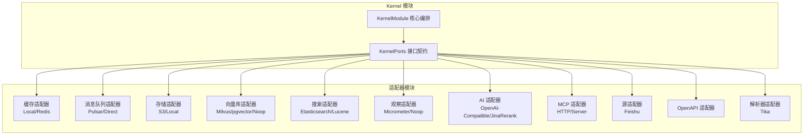

图示来源
- [KernelPorts.java](file://seahorse-agent-kernel/src/main/java/com/miracle/ai/seahorse/agent/ports/KernelPorts.java)
- [KernelModule.java](file://seahorse-agent-kernel/src/main/java/com/miracle/ai/seahorse/agent/kernel/KernelModule.java)
- [SpringBootStarterConfig.java](file://seahorse-agent-spring-boot-starter/src/main/java/com/miracle/ai/seahorse/agent/adapters/spring/SpringBootStarterConfig.java)

章节来源
- [KernelPorts.java](file://seahorse-agent-kernel/src/main/java/com/miracle/ai/seahorse/agent/ports/KernelPorts.java)
- [KernelModule.java](file://seahorse-agent-kernel/src/main/java/com/miracle/ai/seahorse/agent/kernel/KernelModule.java)
- [SpringBootStarterConfig.java](file://seahorse-agent-spring-boot-starter/src/main/java/com/miracle/ai/seahorse/agent/adapters/spring/SpringBootStarterConfig.java)

## 核心组件
- 端口接口（KernelPorts）：定义系统对外能力的抽象契约，如缓存、消息队列、对象存储、向量检索/索引/集合管理、观察、AI 模型等。
- 适配器实现：针对具体外部系统（如 Redis、Pulsar、S3、Milvus、Elasticsearch、Micrometer 等）提供实现。
- 自动装配与 SPI：通过 META-INF 下的端口接口名映射，Spring 在启动时自动选择并注入对应适配器。
- Kernel 编排：KernelModule 负责装配、调度与生命周期管理，协调各端口的调用顺序与上下文传递。

**更新** 新增了 RerankModelPort 和 QueryRewritePort 端口接口，分别用于检索重排和查询重写功能，支持多种实现策略（如 JinaRerankModelAdapter、NoOpQueryRewriteAdapter）。

章节来源
- [KernelPorts.java](file://seahorse-agent-kernel/src/main/java/com/miracle/ai/seahorse/agent/ports/KernelPorts.java)
- [KernelModule.java](file://seahorse-agent-kernel/src/main/java/com/miracle/ai/seahorse/agent/kernel/KernelModule.java)
- [RerankModelPort.java](file://seahorse-agent-kernel/src/main/java/com/miracle/ai/seahorse/agent/ports/outbound/retrieval/RerankModelPort.java)
- [RerankModelPort.java](file://seahorse-agent-kernel/src/main/java/com/miracle/ai/seahorse/agent/ports/outbound/model/RerankModelPort.java)
- [QueryRewritePort.java](file://seahorse-agent-kernel/src/main/java/com/miracle/ai/seahorse/agent/ports/outbound/retrieval/QueryRewritePort.java)
- [QueryRewritePort.java](file://seahorse-agent-kernel/src/main/java/com/miracle/ai/seahorse/agent/ports/outbound/chat/QueryRewritePort.java)

## 架构总览
下图展示端口-适配器的绑定关系与调用方向，以及 Kernel 的编排作用。

```mermaid
graph TB
KP["KernelPorts 接口契约"]
KM["KernelModule 编排"]
subgraph "缓存适配器"
LCA["LocalCacheAdapter"]
RCA["RedisCacheAdapter"]
end
subgraph "消息队列适配器"
PMQA["PulsarMessageQueueAdapter"]
DMA["DirectMessageQueueAdapter"]
end
subgraph "存储适配器"
SOA["S3ObjectStorageAdapter"]
LOA["LocalObjectStorageAdapter"]
end
subgraph "向量库适配器"
MVA["MilvusVectorAdapter"]
PVA["PgVectorAdapter"]
NVA["NoopVectorStoreAdapter"]
end
subgraph "搜索适配器"
ESI["ElasticsearchKeywordIndexAdapter"]
LSI["LuceneKeywordIndexAdapter"]
end
subgraph "观察适配器"
MOA["MicrometerObservationAdapter"]
NOA["NoopObservationAdapter"]
end
subgraph "AI 适配器"
OAM["OpenAiCompatibleModelAdapter"]
JRA["JinaRerankModelAdapter"]
end
subgraph "MCP 适配器"
MHA["McPHttpAdapter"]
MPS["MCP Server"]
end
subgraph "源/解析/开放接口适配器"
FDA["FeishuDocumentFetcherAdapter"]
OAA["OpenApiSpecParserAdapter"]
TDA["TikaDocumentParserAdapter"]
end
subgraph "查询重写适配器"
NRW["NoOpQueryRewriteAdapter"]
end
KM --> KP
KP --> LCA
KP --> RCA
KP --> PMQA
KP --> DMA
KP --> SOA
KP --> LOA
KP --> MVA
KP --> PVA
KP --> NVA
KP --> ESI
KP --> LSI
KP --> MOA
KP --> NOA
KP --> OAM
KP --> JRA
KP --> MHA
KP --> MPS
KP --> FDA
KP --> OAA
KP --> TDA
KP --> NRW
```

图示来源
- [KernelPorts.java](file://seahorse-agent-kernel/src/main/java/com/miracle/ai/seahorse/agent/ports/KernelPorts.java)
- [KernelModule.java](file://seahorse-agent-kernel/src/main/java/com/miracle/ai/seahorse/agent/kernel/KernelModule.java)
- [LocalCacheAdapter.java](file://seahorse-agent-adapter-cache-local/src/main/java/com/miracle/ai/seahorse/agent/adapters/cache/local/LocalCacheAdapter.java)
- [RedisCacheAdapter.java](file://seahorse-agent-adapter-cache-redis/src/main/java/com/miracle/ai/seahorse/agent/adapters/cache/redis/RedisCacheAdapter.java)
- [PulsarMessageQueueAdapter.java](file://seahorse-agent-adapter-mq-pulsar/src/main/java/com/miracle/ai/seahorse/agent/adapters/mq/pulsar/PulsarMessageQueueAdapter.java)
- [DirectMessageQueueAdapter.java](file://seahorse-agent-adapter-mq-direct/src/main/java/com/miracle/ai/seahorse/agent/adapters/mq/direct/DirectMessageQueueAdapter.java)
- [S3ObjectStorageAdapter.java](file://seahorse-agent-adapter-storage-s3/src/main/java/com/miracle/ai/seahorse/agent/adapters/storage/s3/S3ObjectStorageAdapter.java)
- [LocalObjectStorageAdapter.java](file://seahorse-agent-adapter-storage-local/src/main/java/com/miracle/ai/seahorse/agent/adapters/storage/local/LocalObjectStorageAdapter.java)
- [MilvusVectorAdapter.java](file://seahorse-agent-adapter-vector-milvus/src/main/java/com/miracle/ai/seahorse/agent/adapters/vector/milvus/MilvusVectorAdapter.java)
- [NoopVectorStoreAdapter.java](file://seahorse-agent-adapter-vector-noop/src/main/java/com/miracle/ai/seahorse/agent/adapters/vector/noop/NoopVectorStoreAdapter.java)
- [ElasticsearchKeywordIndexAdapter.java](file://seahorse-agent-adapter-search-elasticsearch/src/main/java/com/miracle/ai/seahorse/agent/adapters/search/elasticsearch/ElasticsearchKeywordIndexAdapter.java)
- [LuceneKeywordIndexAdapter.java](file://seahorse-agent-adapter-search-lucene/src/main/java/com/miracle/ai/seahorse/agent/adapters/search/lucene/LuceneKeywordIndexAdapter.java)
- [MicrometerObservationAdapter.java](file://seahorse-agent-adapter-observation-micrometer/src/main/java/com/miracle/ai/seahorse/agent/adapters/observation/micrometer/MicrometerObservationAdapter.java)
- [NoopObservationAdapter.java](file://seahorse-agent-adapter-observation-noop/src/main/java/com/miracle/ai/seahorse/agent/adapters/observation/noop/NoopObservationAdapter.java)
- [OpenAiCompatibleModelAdapter.java](file://seahorse-agent-adapter-ai-openai-compatible/src/main/java/com/miracle/ai/seahorse/agent/adapters/ai/openai/OpenAiCompatibleModelAdapter.java)
- [JinaRerankModelAdapter.java](file://seahorse-agent-adapter-ai-openai-compatible/src/main/java/com/miracle/ai/seahorse/agent/adapters/ai/JinaRerankModelAdapter.java)
- [McPHttpAdapter.java](file://seahorse-agent-adapter-mcp-http/src/main/java/com/miracle/ai/seahorse/agent/adapters/mcp/http/McPHttpAdapter.java)
- [MCPDispatcher.java](file://seahorse-agent-mcp-server/src/main/java/com/miracle/ai/seahorse/agent/adapters/mcp/server/dispatch/MCPDispatcher.java)
- [FeishuDocumentFetcherAdapter.java](file://seahorse-agent-adapter-source-feishu/src/main/java/com/miracle/ai/seahorse/agent/adapters/source/feishu/FeishuDocumentFetcherAdapter.java)
- [OpenApiSpecParserAdapter.java](file://seahorse-agent-adapter-openapi/src/main/java/com/miracle/ai/seahorse/agent/adapters/openapi/OpenApiSpecParserAdapter.java)
- [TikaDocumentParserAdapter.java](file://seahorse-agent-adapter-parser-tika/src/main/java/com/miracle/ai/seahorse/agent/adapters/parser/tika/TikaDocumentParserAdapter.java)
- [NoOpQueryRewriteAdapter.java](file://seahorse-agent-kernel/src/main/java/com/miracle/ai/seahorse/agent/kernel/application/retrieval/NoOpQueryRewriteAdapter.java)

## 详细组件分析

### 缓存适配器
- LocalCacheAdapter：基于本地内存的键值缓存、发布订阅、限流、分布式锁与信号量、ID 生成等能力。
- RedisCacheAdapter：基于 Redis 的高性能缓存与分布式同步能力，配合 RedisSemaphoreAdapter、RedisStreamTaskPort 等扩展。
- 关键端口绑定：KeyValueCachePort、PubSubPort、RateLimiterPort、DistributedLockPort、DistributedSemaphorePort、IdGeneratorPort、StreamTaskPort。

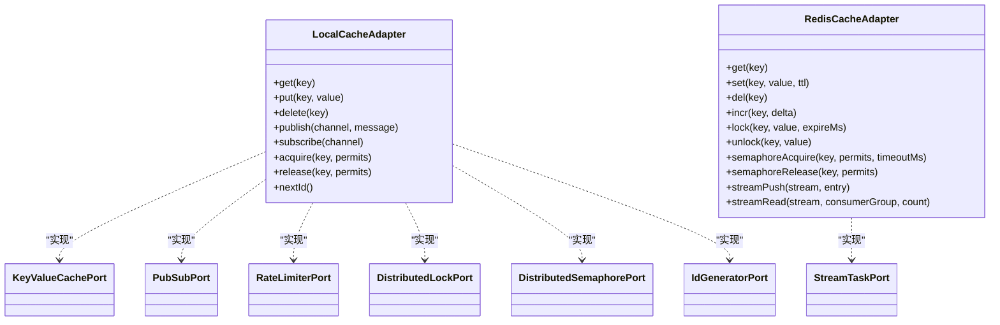

图示来源
- [LocalCacheAdapter.java](file://seahorse-agent-adapter-cache-local/src/main/java/com/miracle/ai/seahorse/agent/adapters/cache/local/LocalCacheAdapter.java)
- [RedisCacheAdapter.java](file://seahorse-agent-adapter-cache-redis/src/main/java/com/miracle/ai/seahorse/agent/adapters/cache/redis/RedisCacheAdapter.java)
- [KeyValueCachePort.java](file://seahorse-agent-adapter-cache-local/src/main/resources/META-INF/seahorse-agent/com.miracle.ai.seahorse.agent.ports.outbound.cache.KeyValueCachePort)
- [PubSubPort.java](file://seahorse-agent-adapter-cache-local/src/main/resources/META-INF/seahorse-agent/com.miracle.ai.seahorse.agent.ports.outbound.cache.PubSubPort)
- [RateLimiterPort.java](file://seahorse-agent-adapter-cache-local/src/main/resources/META-INF/seahorse-agent/com.miracle.ai.seahorse.agent.ports.outbound.cache.RateLimiterPort)
- [DistributedLockPort.java](file://seahorse-agent-adapter-cache-local/src/main/resources/META-INF/seahorse-agent/com.miracle.ai.seahorse.agent.ports.outbound.coordination.DistributedLockPort)
- [DistributedSemaphorePort.java](file://seahorse-agent-adapter-cache-local/src/main/resources/META-INF/seahorse-agent/com.miracle.ai.seahorse.agent.ports.outbound.coordination.DistributedSemaphorePort)
- [IdGeneratorPort.java](file://seahorse-agent-adapter-cache-local/src/main/resources/META-INF/seahorse-agent/com.miracle.ai.seahorse.agent.ports.outbound.id.IdGeneratorPort)
- [StreamTaskPort.java](file://seahorse-agent-adapter-cache-redis/src/main/resources/META-INF/seahorse-agent/com.miracle.ai.seahorse.agent.ports.outbound.stream.StreamTaskPort)

章节来源
- [LocalCacheAdapter.java](file://seahorse-agent-adapter-cache-local/src/main/java/com/miracle/ai/seahorse/agent/adapters/cache/local/LocalCacheAdapter.java)
- [RedisCacheAdapter.java](file://seahorse-agent-adapter-cache-redis/src/main/java/com/miracle/ai/seahorse/agent/adapters/cache/redis/RedisCacheAdapter.java)
- [KeyValueCachePort.java](file://seahorse-agent-adapter-cache-local/src/main/resources/META-INF/seahorse-agent/com.miracle.ai.seahorse.agent.ports.outbound.cache.KeyValueCachePort)
- [PubSubPort.java](file://seahorse-agent-adapter-cache-local/src/main/resources/META-INF/seahorse-agent/com.miracle.ai.seahorse.agent.ports.outbound.cache.PubSubPort)
- [RateLimiterPort.java](file://seahorse-agent-adapter-cache-local/src/main/resources/META-INF/seahorse-agent/com.miracle.ai.seahorse.agent.ports.outbound.cache.RateLimiterPort)
- [DistributedLockPort.java](file://seahorse-agent-adapter-cache-local/src/main/resources/META-INF/seahorse-agent/com.miracle.ai.seahorse.agent.ports.outbound.coordination.DistributedLockPort)
- [DistributedSemaphorePort.java](file://seahorse-agent-adapter-cache-local/src/main/resources/META-INF/seahorse-agent/com.miracle.ai.seahorse.agent.ports.outbound.coordination.DistributedSemaphorePort)
- [IdGeneratorPort.java](file://seahorse-agent-adapter-cache-local/src/main/resources/META-INF/seahorse-agent/com.miracle.ai.seahorse.agent.ports.outbound.id.IdGeneratorPort)
- [StreamTaskPort.java](file://seahorse-agent-adapter-cache-redis/src/main/resources/META-INF/seahorse-agent/com.miracle.ai.seahorse.agent.ports.outbound.stream.StreamTaskPort)

### 消息队列适配器
- PulsarMessageQueueAdapter：基于 Apache Pulsar 的消息封装与发送，支持消息体封装、属性设置、主题路由等。
- DirectMessageQueueAdapter：本地直连消息队列适配器，用于测试或轻量场景。
- 关键端口绑定：MessageQueuePort。

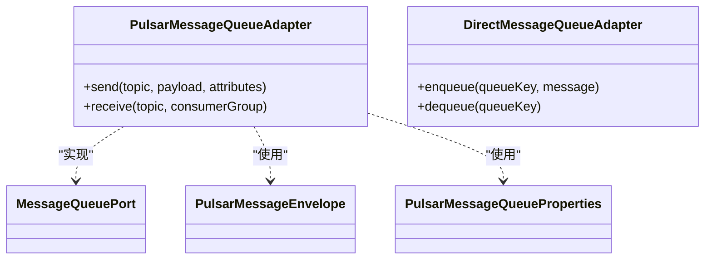

图示来源
- [PulsarMessageQueueAdapter.java](file://seahorse-agent-adapter-mq-pulsar/src/main/java/com/miracle/ai/seahorse/agent/adapters/mq/pulsar/PulsarMessageQueueAdapter.java)
- [DirectMessageQueueAdapter.java](file://seahorse-agent-adapter-mq-direct/src/main/java/com/miracle/ai/seahorse/agent/adapters/mq/direct/DirectMessageQueueAdapter.java)
- [MessageQueuePort.java](file://seahorse-agent-adapter-mq-pulsar/src/main/resources/META-INF/seahorse-agent/com.miracle.ai.seahorse.agent.ports.outbound.mq.MessageQueuePort)
- [PulsarMessageEnvelope.java](file://seahorse-agent-adapter-mq-pulsar/src/main/java/com/miracle/ai/seahorse/agent/adapters/mq/pulsar/PulsarMessageEnvelope.java)
- [PulsarMessageQueueProperties.java](file://seahorse-agent-adapter-mq-pulsar/src/main/java/com/miracle/ai/seahorse/agent/adapters/mq/pulsar/PulsarMessageQueueProperties.java)

章节来源
- [PulsarMessageQueueAdapter.java](file://seahorse-agent-adapter-mq-pulsar/src/main/java/com/miracle/ai/seahorse/agent/adapters/mq/pulsar/PulsarMessageQueueAdapter.java)
- [DirectMessageQueueAdapter.java](file://seahorse-agent-adapter-mq-direct/src/main/java/com/miracle/ai/seahorse/agent/adapters/mq/direct/DirectMessageQueueAdapter.java)
- [MessageQueuePort.java](file://seahorse-agent-adapter-mq-pulsar/src/main/resources/META-INF/seahorse-agent/com.miracle.ai.seahorse.agent.ports.outbound.mq.MessageQueuePort)
- [PulsarMessageEnvelope.java](file://seahorse-agent-adapter-mq-pulsar/src/main/java/com/miracle/ai/seahorse/agent/adapters/mq/pulsar/PulsarMessageEnvelope.java)
- [PulsarMessageQueueProperties.java](file://seahorse-agent-adapter-mq-pulsar/src/main/java/com/miracle/ai/seahorse/agent/adapters/mq/pulsar/PulsarMessageQueueProperties.java)

### 存储适配器
- S3ObjectStorageAdapter：基于 S3 的对象存储上传/下载/删除/列举等。
- LocalObjectStorageAdapter：本地文件系统对象存储适配器。
- 关键端口绑定：ObjectStoragePort。

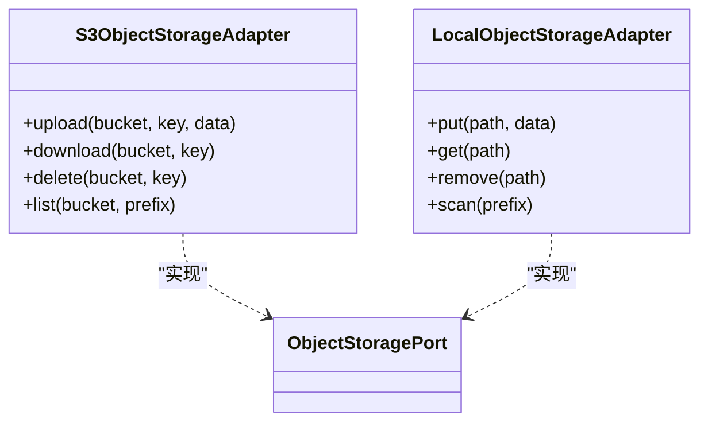

图示来源
- [S3ObjectStorageAdapter.java](file://seahorse-agent-adapter-storage-s3/src/main/java/com/miracle/ai/seahorse/agent/adapters/storage/s3/S3ObjectStorageAdapter.java)
- [LocalObjectStorageAdapter.java](file://seahorse-agent-adapter-storage-local/src/main/java/com/miracle/ai/seahorse/agent/adapters/storage/local/LocalObjectStorageAdapter.java)
- [ObjectStoragePort.java](file://seahorse-agent-adapter-storage-s3/src/main/resources/META-INF/seahorse-agent/com.miracle.ai.seahorse.agent.ports.outbound.storage.ObjectStoragePort)

章节来源
- [S3ObjectStorageAdapter.java](file://seahorse-agent-adapter-storage-s3/src/main/java/com/miracle/ai/seahorse/agent/adapters/storage/s3/S3ObjectStorageAdapter.java)
- [LocalObjectStorageAdapter.java](file://seahorse-agent-adapter-storage-local/src/main/java/com/miracle/ai/seahorse/agent/adapters/storage/local/LocalObjectStorageAdapter.java)
- [ObjectStoragePort.java](file://seahorse-agent-adapter-storage-s3/src/main/resources/META-INF/seahorse-agent/com.miracle.ai.seahorse.agent.ports.outbound.storage.ObjectStoragePort)

### 向量库适配器
- MilvusVectorAdapter：基于 Milvus 的向量检索、索引构建、集合管理。
- PgVectorAdapter：基于 PostgreSQL + pgvector 的向量检索与索引。
- NoopVectorStoreAdapter：空实现，便于测试或占位。
- 关键端口绑定：VectorSearchPort、VectorIndexPort、VectorCollectionAdminPort。

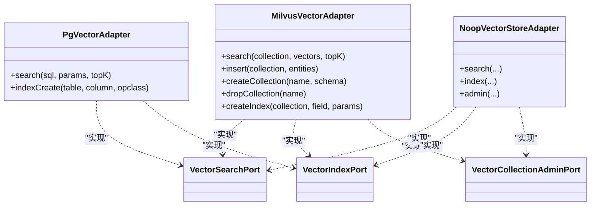

图示来源
- [MilvusVectorAdapter.java](file://seahorse-agent-adapter-vector-milvus/src/main/java/com/miracle/ai/seahorse/agent/adapters/vector/milvus/MilvusVectorAdapter.java)
- [NoopVectorStoreAdapter.java](file://seahorse-agent-adapter-vector-noop/src/main/java/com/miracle/ai/seahorse/agent/adapters/vector/noop/NoopVectorStoreAdapter.java)
- [VectorSearchPort.java](file://seahorse-agent-adapter-vector-milvus/src/main/resources/META-INF/seahorse-agent/com.miracle.ai.seahorse.agent.ports.outbound.vector.VectorSearchPort)
- [VectorIndexPort.java](file://seahorse-agent-adapter-vector-milvus/src/main/resources/META-INF/seahorse-agent/com.miracle.ai.seahorse.agent.ports.outbound.vector.VectorIndexPort)
- [VectorCollectionAdminPort.java](file://seahorse-agent-adapter-vector-milvus/src/main/resources/META-INF/seahorse-agent/com.miracle.ai.seahorse.agent.ports.outbound.vector.VectorCollectionAdminPort)

章节来源
- [MilvusVectorAdapter.java](file://seahorse-agent-adapter-vector-milvus/src/main/java/com/miracle/ai/seahorse/agent/adapters/vector/milvus/MilvusVectorAdapter.java)
- [NoopVectorStoreAdapter.java](file://seahorse-agent-adapter-vector-noop/src/main/java/com/miracle/ai/seahorse/agent/adapters/vector/noop/NoopVectorStoreAdapter.java)
- [VectorSearchPort.java](file://seahorse-agent-adapter-vector-milvus/src/main/resources/META-INF/seahorse-agent/com.miracle.ai.seahorse.agent.ports.outbound.vector.VectorSearchPort)
- [VectorIndexPort.java](file://seahorse-agent-adapter-vector-milvus/src/main/resources/META-INF/seahorse-agent/com.miracle.ai.seahorse.agent.ports.outbound.vector.VectorIndexPort)
- [VectorCollectionAdminPort.java](file://seahorse-agent-adapter-vector-milvus/src/main/resources/META-INF/seahorse-agent/com.miracle.ai.seahorse.agent.ports.outbound.vector.VectorCollectionAdminPort)

### 搜索适配器
- ElasticsearchKeywordIndexAdapter / ElasticsearchKeywordSearchAdapter / ElasticsearchMetadataSchemaIndexAdapter：基于 Elasticsearch 的关键词索引、搜索与元数据索引。
- LuceneKeywordIndexAdapter / LuceneKeywordSearchAdapter：基于 Lucene 的本地关键词索引与搜索。
- 关键端口绑定：与 Kernel 中的搜索相关端口对接。

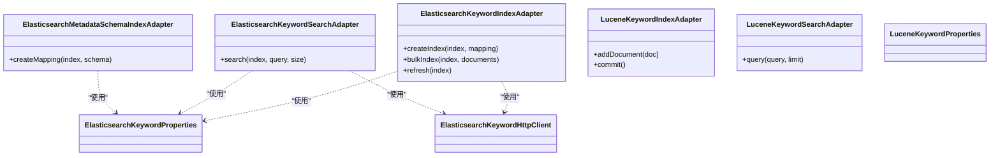

图示来源
- [ElasticsearchKeywordIndexAdapter.java](file://seahorse-agent-adapter-search-elasticsearch/src/main/java/com/miracle/ai/seahorse/agent/adapters/search/elasticsearch/ElasticsearchKeywordIndexAdapter.java)
- [ElasticsearchKeywordSearchAdapter.java](file://seahorse-agent-adapter-search-elasticsearch/src/main/java/com/miracle/ai/seahorse/agent/adapters/search/elasticsearch/ElasticsearchKeywordSearchAdapter.java)
- [ElasticsearchMetadataSchemaIndexAdapter.java](file://seahorse-agent-adapter-search-elasticsearch/src/main/java/com/miracle/ai/seahorse/agent/adapters/search/elasticsearch/ElasticsearchMetadataSchemaIndexAdapter.java)
- [LuceneKeywordIndexAdapter.java](file://seahorse-agent-adapter-search-lucene/src/main/java/com/miracle/ai/seahorse/agent/adapters/search/lucene/LuceneKeywordIndexAdapter.java)
- [LuceneKeywordSearchAdapter.java](file://seahorse-agent-adapter-search-lucene/src/main/java/com/miracle/ai/seahorse/agent/adapters/search/lucene/LuceneKeywordSearchAdapter.java)
- [ElasticsearchKeywordProperties.java](file://seahorse-agent-adapter-search-elasticsearch/src/main/java/com/miracle/ai/seahorse/agent/adapters/search/elasticsearch/ElasticsearchKeywordProperties.java)
- [LuceneKeywordProperties.java](file://seahorse-agent-adapter-search-lucene/src/main/java/com/miracle/ai/seahorse/agent/adapters/search/lucene/LuceneKeywordProperties.java)
- [ElasticsearchKeywordHttpClient.java](file://seahorse-agent-adapter-search-elasticsearch/src/main/java/com/miracle/ai/seahorse/agent/adapters/search/elasticsearch/ElasticsearchKeywordHttpClient.java)

章节来源
- [ElasticsearchKeywordIndexAdapter.java](file://seahorse-agent-adapter-search-elasticsearch/src/main/java/com/miracle/ai/seahorse/agent/adapters/search/elasticsearch/ElasticsearchKeywordIndexAdapter.java)
- [ElasticsearchKeywordSearchAdapter.java](file://seahorse-agent-adapter-search-elasticsearch/src/main/java/com/miracle/ai/seahorse/agent/adapters/search/elasticsearch/ElasticsearchKeywordSearchAdapter.java)
- [ElasticsearchMetadataSchemaIndexAdapter.java](file://seahorse-agent-adapter-search-elasticsearch/src/main/java/com/miracle/ai/seahorse/agent/adapters/search/elasticsearch/ElasticsearchMetadataSchemaIndexAdapter.java)
- [LuceneKeywordIndexAdapter.java](file://seahorse-agent-adapter-search-lucene/src/main/java/com/miracle/ai/seahorse/agent/adapters/search/lucene/LuceneKeywordIndexAdapter.java)
- [LuceneKeywordSearchAdapter.java](file://seahorse-agent-adapter-search-lucene/src/main/java/com/miracle/ai/seahorse/agent/adapters/search/lucene/LuceneKeywordSearchAdapter.java)
- [ElasticsearchKeywordProperties.java](file://seahorse-agent-adapter-search-elasticsearch/src/main/java/com/miracle/ai/seahorse/agent/adapters/search/elasticsearch/ElasticsearchKeywordProperties.java)
- [LuceneKeywordProperties.java](file://seahorse-agent-adapter-search-lucene/src/main/java/com/miracle/ai/seahorse/agent/adapters/search/lucene/LuceneKeywordProperties.java)
- [ElasticsearchKeywordHttpClient.java](file://seahorse-agent-adapter-search-elasticsearch/src/main/java/com/miracle/ai/seahorse/agent/adapters/search/elasticsearch/ElasticsearchKeywordHttpClient.java)

### 观察适配器
- MicrometerObservationAdapter：基于 Micrometer 的指标采集与上报。
- NoopObservationAdapter：空实现，便于在无监控环境启用。
- 关键端口绑定：ObservationPort。

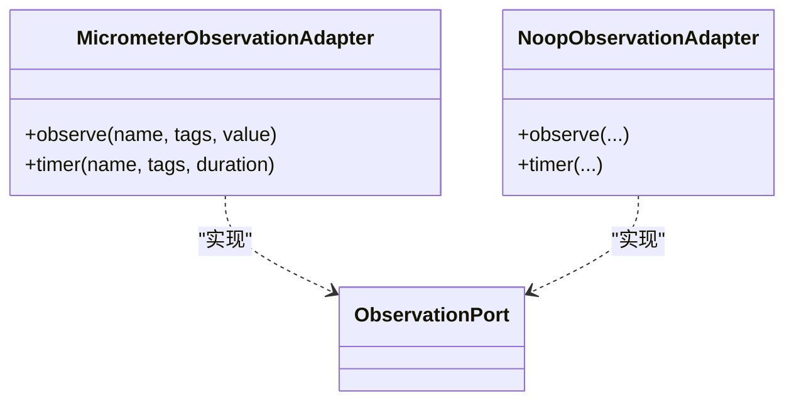

图示来源
- [MicrometerObservationAdapter.java](file://seahorse-agent-adapter-observation-micrometer/src/main/java/com/miracle/ai/seahorse/agent/adapters/observation/micrometer/MicrometerObservationAdapter.java)
- [NoopObservationAdapter.java](file://seahorse-agent-adapter-observation-noop/src/main/java/com/miracle/ai/seahorse/agent/adapters/observation/noop/NoopObservationAdapter.java)
- [ObservationPort.java](file://seahorse-agent-adapter-observation-noop/src/main/resources/META-INF/seahorse-agent/com.miracle.ai.seahorse.agent.ports.outbound.observation.ObservationPort)

章节来源
- [MicrometerObservationAdapter.java](file://seahorse-agent-adapter-observation-micrometer/src/main/java/com/miracle/ai/seahorse/agent/adapters/observation/micrometer/MicrometerObservationAdapter.java)
- [NoopObservationAdapter.java](file://seahorse-agent-adapter-observation-noop/src/main/java/com/miracle/ai/seahorse/agent/adapters/observation/noop/NoopObservationAdapter.java)
- [ObservationPort.java](file://seahorse-agent-adapter-observation-noop/src/main/resources/META-INF/seahorse-agent/com.miracle.ai.seahorse.agent.ports.outbound.observation.ObservationPort)

### AI 适配器
- OpenAiCompatibleModelAdapter：兼容 OpenAI 协议的模型调用适配器，支持流式与非流式响应。
- JinaRerankModelAdapter：基于 Jina AI 的重排（rerank）模型适配器，支持文档重排序和降级容错。
- 适用场景：大模型推理、工具调用、参数提取、检索重排等。

**更新** 新增了 JinaRerankModelAdapter 适配器，专门用于高级 RAG 管道中的文档重排功能，提供优雅降级机制，确保在外部服务不可用时仍能返回原始排序结果。

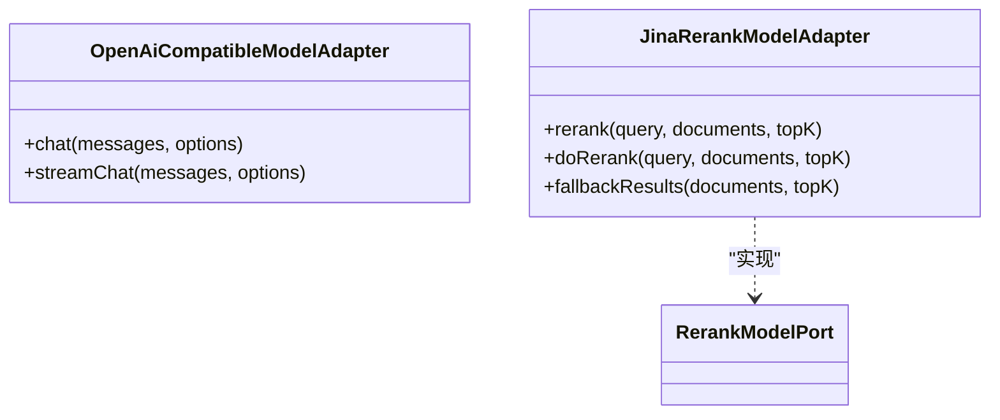

图示来源
- [OpenAiCompatibleModelAdapter.java](file://seahorse-agent-adapter-ai-openai-compatible/src/main/java/com/miracle/ai/seahorse/agent/adapters/ai/openai/OpenAiCompatibleModelAdapter.java)
- [JinaRerankModelAdapter.java](file://seahorse-agent-adapter-ai-openai-compatible/src/main/java/com/miracle/ai/seahorse/agent/adapters/ai/JinaRerankModelAdapter.java)
- [RerankModelPort.java](file://seahorse-agent-kernel/src/main/java/com/miracle/ai/seahorse/agent/ports/outbound/retrieval/RerankModelPort.java)

章节来源
- [OpenAiCompatibleModelAdapter.java](file://seahorse-agent-adapter-ai-openai-compatible/src/main/java/com/miracle/ai/seahorse/agent/adapters/ai/openai/OpenAiCompatibleModelAdapter.java)
- [JinaRerankModelAdapter.java](file://seahorse-agent-adapter-ai-openai-compatible/src/main/java/com/miracle/ai/seahorse/agent/adapters/ai/JinaRerankModelAdapter.java)
- [RerankModelPort.java](file://seahorse-agent-kernel/src/main/java/com/miracle/ai/seahorse/agent/ports/outbound/retrieval/RerankModelPort.java)

### 查询重写适配器
- NoOpQueryRewriteAdapter：空实现的查询重写适配器，直接返回原始查询，确保高级 RAG 管道始终有至少一个查询可执行。
- 适用场景：默认查询重写策略，无需额外重写逻辑时使用。

**更新** 新增了 NoOpQueryRewriteAdapter 适配器，专门用于高级 RAG 管道中的查询重写功能，默认实现确保系统在任何情况下都能正常工作。

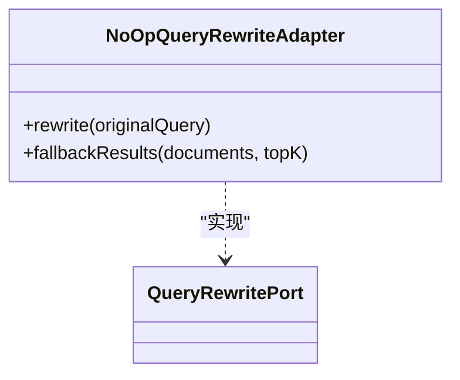

图示来源
- [NoOpQueryRewriteAdapter.java](file://seahorse-agent-kernel/src/main/java/com/miracle/ai/seahorse/agent/kernel/application/retrieval/NoOpQueryRewriteAdapter.java)
- [QueryRewritePort.java](file://seahorse-agent-kernel/src/main/java/com/miracle/ai/seahorse/agent/ports/outbound/retrieval/QueryRewritePort.java)

章节来源
- [NoOpQueryRewriteAdapter.java](file://seahorse-agent-kernel/src/main/java/com/miracle/ai/seahorse/agent/kernel/application/retrieval/NoOpQueryRewriteAdapter.java)
- [QueryRewritePort.java](file://seahorse-agent-kernel/src/main/java/com/miracle/ai/seahorse/agent/ports/outbound/retrieval/QueryRewritePort.java)

### MCP 适配器
- McPHttpAdapter：通过 HTTP 访问 MCP 服务，支持凭据与 OAuth。
- MCP Server：内置 MCP 服务器端点与工具注册中心，支持工具发现与调用。
- 关键组件：MCPDispatcher、MCPEndpoint、MCPToolRegistry。

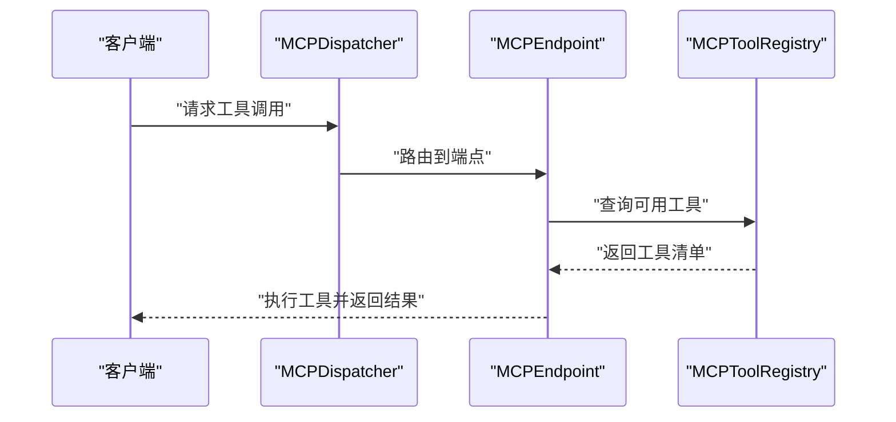

图示来源
- [McPHttpAdapter.java](file://seahorse-agent-adapter-mcp-http/src/main/java/com/miracle/ai/seahorse/agent/adapters/mcp/http/McPHttpAdapter.java)
- [MCPDispatcher.java](file://seahorse-agent-mcp-server/src/main/java/com/miracle/ai/seahorse/agent/adapters/mcp/server/dispatch/MCPDispatcher.java)
- [MCPEndpoint.java](file://seahorse-agent-mcp-server/src/main/java/com/miracle/ai/seahorse/agent/adapters/mcp/server/endpoint/MCPEndpoint.java)
- [MCPToolRegistry.java](file://seahorse-agent-mcp-server/src/main/java/com/miracle/ai/seahorse/agent/adapters/mcp/server/tool/MCPToolRegistry.java)

章节来源
- [McPHttpAdapter.java](file://seahorse-agent-adapter-mcp-http/src/main/java/com/miracle/ai/seahorse/agent/adapters/mcp/http/McPHttpAdapter.java)
- [MCPDispatcher.java](file://seahorse-agent-mcp-server/src/main/java/com/miracle/ai/seahorse/agent/adapters/mcp/server/dispatch/MCPDispatcher.java)
- [MCPEndpoint.java](file://seahorse-agent-mcp-server/src/main/java/com/miracle/ai/seahorse/agent/adapters/mcp/server/endpoint/MCPEndpoint.java)
- [MCPToolRegistry.java](file://seahorse-agent-mcp-server/src/main/java/com/miracle/ai/seahorse/agent/adapters/mcp/server/tool/MCPToolRegistry.java)

### 源与解析适配器
- FeishuDocumentFetcherAdapter：飞书文档抓取适配器。
- OpenApiSpecParserAdapter：OpenAPI 规范解析适配器。
- TikaDocumentParserAdapter：基于 Apache Tika 的文档解析适配器。

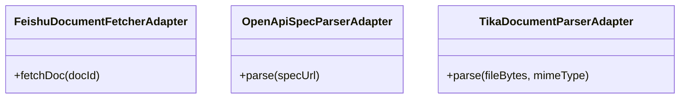

图示来源
- [FeishuDocumentFetcherAdapter.java](file://seahorse-agent-adapter-source-feishu/src/main/java/com/miracle/ai/seahorse/agent/adapters/source/feishu/FeishuDocumentFetcherAdapter.java)
- [OpenApiSpecParserAdapter.java](file://seahorse-agent-adapter-openapi/src/main/java/com/miracle/ai/seahorse/agent/adapters/openapi/OpenApiSpecParserAdapter.java)
- [TikaDocumentParserAdapter.java](file://seahorse-agent-adapter-parser-tika/src/main/java/com/miracle/ai/seahorse/agent/adapters/parser/tika/TikaDocumentParserAdapter.java)

章节来源
- [FeishuDocumentFetcherAdapter.java](file://seahorse-agent-adapter-source-feishu/src/main/java/com/miracle/ai/seahorse/agent/adapters/source/feishu/FeishuDocumentFetcherAdapter.java)
- [OpenApiSpecParserAdapter.java](file://seahorse-agent-adapter-openapi/src/main/java/com/miracle/ai/seahorse/agent/adapters/openapi/OpenApiSpecParserAdapter.java)
- [TikaDocumentParserAdapter.java](file://seahorse-agent-adapter-parser-tika/src/main/java/com/miracle/ai/seahorse/agent/adapters/parser/tika/TikaDocumentParserAdapter.java)

### 数据仓储适配器（JDBC）
- Jdbc*RepositoryAdapter：覆盖访问决策、对话、知识库、内存、用户、审计、工具、沙箱、评估、检索策略、成本用量、RAG Trace、资源 ACL、样本问题、查询词映射、配额策略、消息反馈、意图树、关键词索引/搜索、管道定义、密钥存储、元数据管理、出站事件等全量领域仓储。
- 设计要点：每个仓储适配器对应一个领域实体，遵循统一的 CRUD 与查询模式；测试用例覆盖关键业务路径与升级迁移。

图示来源
- [JdbcAccessDecisionRepositoryAdapter.java](file://seahorse-agent-adapter-repository-jdbc/src/main/java/com/miracle/ai/seahorse/agent/adapters/repository/jdbc/JdbcAccessDecisionRepositoryAdapter.java)
- [JdbcAgentRunRepositoryAdapter.java](file://seahorse-agent-adapter-repository-jdbc/src/main/java/com/miracle/ai/seahorse/agent/adapters/repository/jdbc/JdbcAgentRunRepositoryAdapter.java)
- [JdbcMemoryRepositoryAdapter.java](file://seahorse-agent-adapter-repository-jdbc/src/main/java/com/miracle/ai/seahorse/agent/adapters/repository/jdbc/JdbcMemoryRepositoryAdapter.java)
- [JdbcKnowledgeBaseRepositoryAdapter.java](file://seahorse-agent-adapter-repository-jdbc/src/main/java/com/miracle/ai/seahorse/agent/adapters/repository/jdbc/JdbcKnowledgeBaseRepositoryAdapter.java)
- [JdbcConversationRepositoryAdapter.java](file://seahorse-agent-adapter-repository-jdbc/src/main/java/com/miracle/ai/seahorse/agent/adapters/repository/jdbc/JdbcConversationRepositoryAdapter.java)
- [JdbcUserRepositoryAdapter.java](file://seahorse-agent-adapter-repository-jdbc/src/main/java/com/miracle/ai/seahorse/agent/adapters/repository/jdbc/JdbcUserRepositoryAdapter.java)
- [JdbcOutboxEventRepositoryAdapter.java](file://seahorse-agent-adapter-repository-jdbc/src/main/java/com/miracle/ai/seahorse/agent/adapters/repository/jdbc/JdbcOutboxEventRepositoryAdapter.java)
- [JdbcContextPackRepositoryAdapter.java](file://seahorse-agent-adapter-repository-jdbc/src/main/java/com/miracle/ai/seahorse/agent/adapters/repository/jdbc/JdbcContextPackRepositoryAdapter.java)
- [JdbcKnowledgeDocumentRepositoryAdapter.java](file://seahorse-agent-adapter-repository-jdbc/src/main/java/com/miracle/ai/seahorse/agent/adapters/repository/jdbc/JdbcKnowledgeDocumentRepositoryAdapter.java)
- [JdbcKnowledgeChunkRepositoryAdapter.java](file://seahorse-agent-adapter-repository-jdbc/src/main/java/com/miracle/ai/seahorse/agent/adapters/repository/jdbc/JdbcKnowledgeChunkRepositoryAdapter.java)
- [JdbcMemoryGraphRepositoryAdapter.java](file://seahorse-agent-adapter-repository-jdbc/src/main/java/com/miracle/ai/seahorse/agent/adapters/repository/jdbc/JdbcMemoryGraphRepositoryAdapter.java)
- [JdbcMemoryAliasRepositoryAdapter.java](file://seahorse-agent-adapter-repository-jdbc/src/main/java/com/miracle/ai/seahorse/agent/adapters/repository/jdbc/JdbcMemoryAliasRepositoryAdapter.java)
- [JdbcMemoryReviewFeedbackRepositoryAdapter.java](file://seahorse-agent-adapter-repository-jdbc/src/main/java/com/miracle/ai/seahorse/agent/adapters/repository/jdbc/JdbcMemoryReviewFeedbackRepositoryAdapter.java)
- [JdbcMemoryTraceRecorderAdapter.java](file://seahorse-agent-adapter-repository-jdbc/src/main/java/com/miracle/ai/seahorse/agent/adapters/repository/jdbc/JdbcMemoryTraceRecorderAdapter.java)
- [JdbcMemoryAggregationBufferAdapter.java](file://seahorse-agent-adapter-repository-jdbc/src/main/java/com/miracle/ai/seahorse/agent/adapters/repository/jdbc/JdbcMemoryAggregationBufferAdapter.java)
- [JdbcMemoryKeywordIndexRepositoryAdapter.java](file://seahorse-agent-adapter-repository-jdbc/src/main/java/com/miracle/ai/seahorse/agent/adapters/repository/jdbc/JdbcMemoryKeywordIndexRepositoryAdapter.java)
- [JdbcDocumentRefreshScheduleAdapter.java](file://seahorse-agent-adapter-repository-jdbc/src/main/java/com/miracle/ai/seahorse/agent/adapters/repository/jdbc/JdbcDocumentRefreshScheduleAdapter.java)
- [JdbcConnectorRepositoryAdapter.java](file://seahorse-agent-adapter-repository-jdbc/src/main/java/com/miracle/ai/seahorse/agent/adapters/repository/jdbc/JdbcConnectorRepositoryAdapter.java)
- [JdbcConnectorCredentialBindingRepositoryAdapter.java](file://seahorse-agent-adapter-repository-jdbc/src/main/java/com/miracle/ai/seahorse/agent/adapters/repository/jdbc/JdbcConnectorCredentialBindingRepositoryAdapter.java)
- [JdbcSecretStoreAdapter.java](file://seahorse-agent-adapter-repository-jdbc/src/main/java/com/miracle/ai/seahorse/agent/adapters/repository/jdbc/JdbcSecretStoreAdapter.java)
- [JdbcMetadataSchemaManagementAdapter.java](file://seahorse-agent-adapter-repository-jdbc/src/main/java/com/miracle/ai/seahorse/agent/adapters/repository/jdbc/JdbcMetadataSchemaManagementAdapter.java)
- [JdbcMetadataSchemaIndexAdapter.java](file://seahorse-agent-adapter-repository-jdbc/src/main/java/com/miracle/ai/seahorse/agent/adapters/repository/jdbc/JdbcMetadataSchemaIndexAdapter.java)
- [JdbcMetadataCanonicalWriteAdapter.java](file://seahorse-agent-adapter-repository-jdbc/src/main/java/com/miracle/ai/seahorse/agent/adapters/repository/jdbc/JdbcMetadataCanonicalWriteAdapter.java)
- [JdbcMetadataExtractionResultManagementAdapter.java](file://seahorse-agent-adapter-repository-jdbc/src/main/java/com/miracle/ai/seahorse/agent/adapters/repository/jdbc/JdbcMetadataExtractionResultManagementAdapter.java)
- [JdbcMetadataQualityReportAdapter.java](file://seahorse-agent-adapter-repository-jdbc/src/main/java/com/miracle/ai/seahorse/agent/adapters/repository/jdbc/JdbcMetadataQualityReportAdapter.java)
- [JdbcMetadataReviewQuarantineAdapter.java](file://seahorse-agent-adapter-repository-jdbc/src/main/java/com/miracle/ai/seahorse/agent/adapters/repository/jdbc/JdbcMetadataReviewQuarantineAdapter.java)
- [JdbcMetadataSchemaUsageReportAdapter.java](file://seahorse-agent-adapter-repository-jdbc/src/main/java/com/miracle/ai/seahorse/agent/adapters/repository/jdbc/JdbcMetadataSchemaUsageReportAdapter.java)
- [JdbcMetadataBackfillJobAdapter.java](file://seahorse-agent-adapter-repository-jdbc/src/main/java/com/miracle/ai/seahorse/agent/adapters/repository/jdbc/JdbcMetadataBackfillJobAdapter.java)
- [JdbcMetadataDictionaryManagementAdapter.java](file://seahorse-agent-adapter-repository-jdbc/src/main/java/com/miracle/ai/seahorse/agent/adapters/repository/jdbc/JdbcMetadataDictionaryManagementAdapter.java)
- [JdbcEvalRepositoryAdapter.java](file://seahorse-agent-adapter-repository-jdbc/src/main/java/com/miracle/ai/seahorse/agent/adapters/repository/jdbc/JdbcEvalRepositoryAdapter.java)
- [JdbcRetrievalEvaluationDatasetRepositoryAdapter.java](file://seahorse-agent-adapter-repository-jdbc/src/main/java/com/miracle/ai/seahorse/agent/adapters/repository/jdbc/JdbcRetrievalEvaluationDatasetRepositoryAdapter.java)
- [JdbcRetrievalStrategyTemplateRepositoryAdapter.java](file://seahorse-agent-adapter-repository-jdbc/src/main/java/com/miracle/ai/seahorse/agent/adapters/repository/jdbc/JdbcRetrievalStrategyTemplateRepositoryAdapter.java)
- [JdbcProductionGateRepositoryAdapter.java](file://seahorse-agent-adapter-repository-jdbc/src/main/java/com/miracle/ai/seahorse/agent/adapters/repository/jdbc/JdbcProductionGateRepositoryAdapter.java)
- [JdbcEnterprisePilotReadinessRepositoryAdapter.java](file://seahorse-agent-adapter-repository-jdbc/src/main/java/com/miracle/ai/seahorse/agent/adapters/repository/jdbc/JdbcEnterprisePilotReadinessRepositoryAdapter.java)
- [JdbcDashboardRepositoryAdapter.java](file://seahorse-agent-adapter-repository-jdbc/src/main/java/com/miracle/ai/seahorse/agent/adapters/repository/jdbc/JdbcDashboardRepositoryAdapter.java)
- [JdbcCostUsageRepositoryAdapter.java](file://seahorse-agent-adapter-repository-jdbc/src/main/java/com/miracle/ai/seahorse/agent/adapters/repository/jdbc/JdbcCostUsageRepositoryAdapter.java)
- [JdbcMessageFeedbackRepositoryAdapter.java](file://seahorse-agent-adapter-repository-jdbc/src/main/java/com/miracle/ai/seahorse/agent/adapters/repository/jdbc/JdbcMessageFeedbackRepositoryAdapter.java)
- [JdbcSampleQuestionRepositoryAdapter.java](file://seahorse-agent-adapter-repository-jdbc/src/main/java/com/miracle/ai/seahorse/agent/adapters/repository/jdbc/JdbcSampleQuestionRepositoryAdapter.java)
- [JdbcQueryTermMappingRepositoryAdapter.java](file://seahorse-agent-adapter-repository-jdbc/src/main/java/com/miracle/ai/seahorse/agent/adapters/repository/jdbc/JdbcQueryTermMappingRepositoryAdapter.java)
- [JdbcQuotaPolicyRepositoryAdapter.java](file://seahorse-agent-adapter-repository-jdbc/src/main/java/com/miracle/ai/seahorse/agent/adapters/repository/jdbc/JdbcQuotaPolicyRepositoryAdapter.java)
- [JdbcRagTraceRepositoryAdapter.java](file://seahorse-agent-adapter-repository-jdbc/src/main/java/com/miracle/ai/seahorse/agent/adapters/repository/jdbc/JdbcRagTraceRepositoryAdapter.java)
- [JdbcResourceAclRepositoryAdapter.java](file://seahorse-agent-adapter-repository-jdbc/src/main/java/com/miracle/ai/seahorse/agent/adapters/repository/jdbc/JdbcResourceAclRepositoryAdapter.java)
- [JdbcToolCatalogRepositoryAdapter.java](file://seahorse-agent-adapter-repository-jdbc/src/main/java/com/miracle/ai/seahorse/agent/adapters/repository/jdbc/JdbcToolCatalogRepositoryAdapter.java)
- [JdbcToolApprovalRequestRepositoryAdapter.java](file://seahorse-agent-adapter-repository-jdbc/src/main/java/com/miracle/ai/seahorse/agent/adapters/repository/jdbc/JdbcToolApprovalRequestRepositoryAdapter.java)
- [JdbcToolInvocationAuditRepositoryAdapter.java](file://seahorse-agent-adapter-repository-jdbc/src/main/java/com/miracle/ai/seahorse/agent/adapters/repository/jdbc/JdbcToolInvocationAuditRepositoryAdapter.java)
- [JdbcSandboxRepositoryAdapter.java](file://seahorse-agent-adapter-repository-jdbc/src/main/java/com/miracle/ai/seahorse/agent/adapters/repository/jdbc/JdbcSandboxRepositoryAdapter.java)
- [JdbcAgentDefinitionRepositoryAdapter.java](file://seahorse-agent-adapter-repository-jdbc/src/main/java/com/miracle/ai/seahorse/agent/adapters/repository/jdbc/JdbcAgentDefinitionRepositoryAdapter.java)
- [JdbcAgentToolBindingRepositoryAdapter.java](file://seahorse-agent-adapter-repository-jdbc/src/main/java/com/miracle/ai/seahorse/agent/adapters/repository/jdbc/JdbcAgentToolBindingRepositoryAdapter.java)
- [JdbcAgentFactoryRepositoryAdapter.java](file://seahorse-agent-adapter-repository-jdbc/src/main/java/com/miracle/ai/seahorse/agent/adapters/repository/jdbc/JdbcAgentFactoryRepositoryAdapter.java)
- [JdbcAgentCheckpointRepositoryAdapter.java](file://seahorse-agent-adapter-repository-jdbc/src/main/java/com/miracle/ai/seahorse/agent/adapters/repository/jdbc/JdbcAgentCheckpointRepositoryAdapter.java)
- [JdbcAgentRunLeaseRepositoryAdapter.java](file://seahorse-agent-adapter-repository-jdbc/src/main/java/com/miracle/ai/seahorse/agent/adapters/repository/jdbc/JdbcAgentRunLeaseRepositoryAdapter.java)
- [JdbcAgentRunQueueRepositoryAdapter.java](file://seahorse-agent-adapter-repository-jdbc/src/main/java/com/miracle/ai/seahorse/agent/adapters/repository/jdbc/JdbcAgentRunQueueRepositoryAdapter.java)
- [JdbcAgentArtifactRepositoryAdapter.java](file://seahorse-agent-adapter-repository-jdbc/src/main/java/com/miracle/ai/seahorse/agent/adapters/repository/jdbc/JdbcAgentArtifactRepositoryAdapter.java)
- [JdbcAgentEvalSummaryRepositoryAdapter.java](file://seahorse-agent-adapter-repository-jdbc/src/main/java/com/miracle/ai/seahorse/agent/adapters/repository/jdbc/JdbcAgentEvalSummaryRepositoryAdapter.java)
- [JdbcAgentHandoffRepositoryAdapter.java](file://seahorse-agent-adapter-repository-jdbc/src/main/java/com/miracle/ai/seahorse/agent/adapters/repository/jdbc/JdbcAgentHandoffRepositoryAdapter.java)
- [JdbcAgentRolloutRepositoryAdapter.java](file://seahorse-agent-adapter-repository-jdbc/src/main/java/com/miracle/ai/seahorse/agent/adapters/repository/jdbc/JdbcAgentRolloutRepositoryAdapter.java)
- [JdbcAgentExtensionStatusAdapter.java](file://seahorse-agent-adapter-repository-jdbc/src/main/java/com/miracle/ai/seahorse/agent/adapters/repository/jdbc/JdbcAgentExtensionStatusAdapter.java)
- [JdbcAuditEventRepositoryAdapter.java](file://seahorse-agent-adapter-repository-jdbc/src/main/java/com/miracle/ai/seahorse/agent/adapters/repository/jdbc/JdbcAuditEventRepositoryAdapter.java)
- [JdbcConversationAttachmentRepositoryAdapter.java](file://seahorse-agent-adapter-repository-jdbc/src/main/java/com/miracle/ai/seahorse/agent/adapters/repository/jdbc/JdbcConversationAttachmentRepositoryAdapter.java)
- [JdbcIntentTreeRepositoryAdapter.java](file://seahorse-agent-adapter-repository-jdbc/src/main/java/com/miracle/ai/seahorse/agent/adapters/repository/jdbc/JdbcIntentTreeRepositoryAdapter.java)
- [JdbcKeywordIndexAdapter.java](file://seahorse-agent-adapter-repository-jdbc/src/main/java/com/miracle/ai/seahorse/agent/adapters/repository/jdbc/JdbcKeywordIndexAdapter.java)
- [JdbcKeywordSearchAdapter.java](file://seahorse-agent-adapter-repository-jdbc/src/main/java/com/miracle/ai/seahorse/agent/adapters/repository/jdbc/JdbcKeywordSearchAdapter.java)
- [JdbcKnowledgeBaseQueryAdapter.java](file://seahorse-agent-adapter-repository-jdbc/src/main/java/com/miracle/ai/seahorse/agent/adapters/repository/jdbc/JdbcKnowledgeBaseQueryAdapter.java)
- [JdbcOutboxEventRepositoryAdapter.java](file://seahorse-agent-adapter-repository-jdbc/src/main/java/com/miracle/ai/seahorse/agent/adapters/repository/jdbc/JdbcOutboxEventRepositoryAdapter.java)
- [JdbcPipelineDefinitionRepositoryAdapter.java](file://seahorse-agent-adapter-repository-jdbc/src/main/java/com/miracle/ai/seahorse/agent/adapters/repository/jdbc/JdbcPipelineDefinitionRepositoryAdapter.java)

章节来源
- [JdbcAccessDecisionRepositoryAdapter.java](file://seahorse-agent-adapter-repository-jdbc/src/main/java/com/miracle/ai/seahorse/agent/adapters/repository/jdbc/JdbcAccessDecisionRepositoryAdapter.java)
- [JdbcAgentRunRepositoryAdapter.java](file://seahorse-agent-adapter-repository-jdbc/src/main/java/com/miracle/ai/seahorse/agent/adapters/repository/jdbc/JdbcAgentRunRepositoryAdapter.java)
- [JdbcMemoryRepositoryAdapter.java](file://seahorse-agent-adapter-repository-jdbc/src/main/java/com/miracle/ai/seahorse/agent/adapters/repository/jdbc/JdbcMemoryRepositoryAdapter.java)
- [JdbcKnowledgeBaseRepositoryAdapter.java](file://seahorse-agent-adapter-repository-jdbc/src/main/java/com/miracle/ai/seahorse/agent/adapters/repository/jdbc/JdbcKnowledgeBaseRepositoryAdapter.java)
- [JdbcConversationRepositoryAdapter.java](file://seahorse-agent-adapter-repository-jdbc/src/main/java/com/miracle/ai/seahorse/agent/adapters/repository/jdbc/JdbcConversationRepositoryAdapter.java)
- [JdbcUserRepositoryAdapter.java](file://seahorse-agent-adapter-repository-jdbc/src/main/java/com/miracle/ai/seahorse/agent/adapters/repository/jdbc/JdbcUserRepositoryAdapter.java)
- [JdbcOutboxEventRepositoryAdapter.java](file://seahorse-agent-adapter-repository-jdbc/src/main/java/com/miracle/ai/seahorse/agent/adapters/repository/jdbc/JdbcOutboxEventRepositoryAdapter.java)
- [JdbcContextPackRepositoryAdapter.java](file://seahorse-agent-adapter-repository-jdbc/src/main/java/com/miracle/ai/seahorse/agent/adapters/repository/jdbc/JdbcContextPackRepositoryAdapter.java)
- [JdbcKnowledgeDocumentRepositoryAdapter.java](file://seahorse-agent-adapter-repository-jdbc/src/main/java/com/miracle/ai/seahorse/agent/adapters/repository/jdbc/JdbcKnowledgeDocumentRepositoryAdapter.java)
- [JdbcKnowledgeChunkRepositoryAdapter.java](file://seahorse-agent-adapter-repository-jdbc/src/main/java/com/miracle/ai/seahorse/agent/adapters/repository/jdbc/JdbcKnowledgeChunkRepositoryAdapter.java)
- [JdbcMemoryGraphRepositoryAdapter.java](file://seahorse-agent-adapter-repository-jdbc/src/main/java/com/miracle/ai/seahorse/agent/adapters/repository/jdbc/JdbcMemoryGraphRepositoryAdapter.java)
- [JdbcMemoryAliasRepositoryAdapter.java](file://seahorse-agent-adapter-repository-jdbc/src/main/java/com/miracle/ai/seahorse/agent/adapters/repository/jdbc/JdbcMemoryAliasRepositoryAdapter.java)
- [JdbcMemoryReviewFeedbackRepositoryAdapter.java](file://seahorse-agent-adapter-repository-jdbc/src/main/java/com/miracle/ai/seahorse/agent/adapters/repository/jdbc/JdbcMemoryReviewFeedbackRepositoryAdapter.java)
- [JdbcMemoryTraceRecorderAdapter.java](file://seahorse-agent-adapter-repository-jdbc/src/main/java/com/miracle/ai/seahorse/agent/adapters/repository/jdbc/JdbcMemoryTraceRecorderAdapter.java)
- [JdbcMemoryAggregationBufferAdapter.java](file://seahorse-agent-adapter-repository-jdbc/src/main/java/com/miracle/ai/seahorse/agent/adapters/repository/jdbc/JdbcMemoryAggregationBufferAdapter.java)
- [JdbcMemoryKeywordIndexRepositoryAdapter.java](file://seahorse-agent-adapter-repository-jdbc/src/main/java/com/miracle/ai/seahorse/agent/adapters/repository/jdbc/JdbcMemoryKeywordIndexRepositoryAdapter.java)
- [JdbcDocumentRefreshScheduleAdapter.java](file://seahorse-agent-adapter-repository-jdbc/src/main/java/com/miracle/ai/seahorse/agent/adapters/repository/jdbc/JdbcDocumentRefreshScheduleAdapter.java)
- [JdbcConnectorRepositoryAdapter.java](file://seahorse-agent-adapter-repository-jdbc/src/main/java/com/miracle/ai/seahorse/agent/adapters/repository/jdbc/JdbcConnectorRepositoryAdapter.java)
- [JdbcConnectorCredentialBindingRepositoryAdapter.java](file://seahorse-agent-adapter-repository-jdbc/src/main/java/com/miracle/ai/seahorse/agent/adapters/repository/jdbc/JdbcConnectorCredentialBindingRepositoryAdapter.java)
- [JdbcSecretStoreAdapter.java](file://seahorse-agent-adapter-repository-jdbc/src/main/java/com/miracle/ai/seahorse/agent/adapters/repository/jdbc/JdbcSecretStoreAdapter.java)
- [JdbcMetadataSchemaManagementAdapter.java](file://seahorse-agent-adapter-repository-jdbc/src/main/java/com/miracle/ai/seahorse/agent/adapters/repository/jdbc/JdbcMetadataSchemaManagementAdapter.java)
- [JdbcMetadataSchemaIndexAdapter.java](file://seahorse-agent-adapter-repository-jdbc/src/main/java/com/miracle/ai/seahorse/agent/adapters/repository/jdbc/JdbcMetadataSchemaIndexAdapter.java)
- [JdbcMetadataCanonicalWriteAdapter.java](file://seahorse-agent-adapter-repository-jdbc/src/main/java/com/miracle/ai/seahorse/agent/adapters/repository/jdbc/JdbcMetadataCanonicalWriteAdapter.java)
- [JdbcMetadataExtractionResultManagementAdapter.java](file://seahorse-agent-adapter-repository-jdbc/src/main/java/com/miracle/ai/seahorse/agent/adapters/repository/jdbc/JdbcMetadataExtractionResultManagementAdapter.java)
- [JdbcMetadataQualityReportAdapter.java](file://seahorse-agent-adapter-repository-jdbc/src/main/java/com/miracle/ai/seahorse/agent/adapters/repository/jdbc/JdbcMetadataQualityReportAdapter.java)
- [JdbcMetadataReviewQuarantineAdapter.java](file://seahorse-agent-adapter-repository-jdbc/src/main/java/com/miracle/ai/seahorse/agent/adapters/repository/jdbc/JdbcMetadataReviewQuarantineAdapter.java)
- [JdbcMetadataSchemaUsageReportAdapter.java](file://seahorse-agent-adapter-repository-jdbc/src/main/java/com/miracle/ai/seahorse/agent/adapters/repository/jdbc/JdbcMetadataSchemaUsageReportAdapter.java)
- [JdbcMetadataBackfillJobAdapter.java](file://seahorse-agent-adapter-repository-jdbc/src/main/java/com/miracle/ai/seahorse/agent/adapters/repository/jdbc/JdbcMetadataBackfillJobAdapter.java)
- [JdbcMetadataDictionaryManagementAdapter.java](file://seahorse-agent-adapter-repository-jdbc/src/main/java/com/miracle/ai/seahorse/agent/adapters/repository/jdbc/JdbcMetadataDictionaryManagementAdapter.java)
- [JdbcEvalRepositoryAdapter.java](file://seahorse-agent-adapter-repository-jdbc/src/main/java/com/miracle/ai/seahorse/agent/adapters/repository/jdbc/JdbcEvalRepositoryAdapter.java)
- [JdbcRetrievalEvaluationDatasetRepositoryAdapter.java](file://seahorse-agent-adapter-repository-jdbc/src/main/java/com/miracle/ai/seahorse/agent/adapters/repository/jdbc/JdbcRetrievalEvaluationDatasetRepositoryAdapter.java)
- [JdbcRetrievalStrategyTemplateRepositoryAdapter.java](file://seahorse-agent-adapter-repository-jdbc/src/main/java/com/miracle/ai/seahorse/agent/adapters/repository/jdbc/JdbcRetrievalStrategyTemplateRepositoryAdapter.java)
- [JdbcProductionGateRepositoryAdapter.java](file://seahorse-agent-adapter-repository-jdbc/src/main/java/com/miracle/ai/seahorse/agent/adapters/repository/jdbc/JdbcProductionGateRepositoryAdapter.java)
- [JdbcEnterprisePilotReadinessRepositoryAdapter.java](file://seahorse-agent-adapter-repository-jdbc/src/main/java/com/miracle/ai/seahorse/agent/adapters/repository/jdbc/JdbcEnterprisePilotReadinessRepositoryAdapter.java)
- [JdbcDashboardRepositoryAdapter.java](file://seahorse-agent-adapter-repository-jdbc/src/main/java/com/miracle/ai/seahorse/agent/adapters/repository/jdbc/JdbcDashboardRepositoryAdapter.java)
- [JdbcCostUsageRepositoryAdapter.java](file://seahorse-agent-adapter-repository-jdbc/src/main/java/com/miracle/ai/seahorse/agent/adapters/repository/jdbc/JdbcCostUsageRepositoryAdapter.java)
- [JdbcMessageFeedbackRepositoryAdapter.java](file://seahorse-agent-adapter-repository-jdbc/src/main/java/com/miracle/ai/seahorse/agent/adapters/repository/jdbc/JdbcMessageFeedbackRepositoryAdapter.java)
- [JdbcSampleQuestionRepositoryAdapter.java](file://seahorse-agent-adapter-repository-jdbc/src/main/java/com/miracle/ai/seahorse/agent/adapters/repository/jdbc/JdbcSampleQuestionRepositoryAdapter.java)
- [JdbcQueryTermMappingRepositoryAdapter.java](file://seahorse-agent-adapter-repository-jdbc/src/main/java/com/miracle/ai/seahorse/agent/adapters/repository/jdbc/JdbcQueryTermMappingRepositoryAdapter.java)
- [JdbcQuotaPolicyRepositoryAdapter.java](file://seahorse-agent-adapter-repository-jdbc/src/main/java/com/miracle/ai/seahorse/agent/adapters/repository/jdbc/JdbcQuotaPolicyRepositoryAdapter.java)
- [JdbcRagTraceRepositoryAdapter.java](file://seahorse-agent-adapter-repository-jdbc/src/main/java/com/miracle/ai/seahorse/agent/adapters/repository/jdbc/JdbcRagTraceRepositoryAdapter.java)
- [JdbcResourceAclRepositoryAdapter.java](file://seahorse-agent-adapter-repository-jdbc/src/main/java/com/miracle/ai/seahorse/agent/adapters/repository/jdbc/JdbcResourceAclRepositoryAdapter.java)
- [JdbcToolCatalogRepositoryAdapter.java](file://seahorse-agent-adapter-repository-jdbc/src/main/java/com/miracle/ai/seahorse/agent/adapters/repository/jdbc/JdbcToolCatalogRepositoryAdapter.java)
- [JdbcToolApprovalRequestRepositoryAdapter.java](file://seahorse-agent-adapter-repository-jdbc/src/main/java/com/miracle/ai/seahorse/agent/adapters/repository/jdbc/JdbcToolApprovalRequestRepositoryAdapter.java)
- [JdbcToolInvocationAuditRepositoryAdapter.java](file://seahorse-agent-adapter-repository-jdbc/src/main/java/com/miracle/ai/seahorse/agent/adapters/repository/jdbc/JdbcToolInvocationAuditRepositoryAdapter.java)
- [JdbcSandboxRepositoryAdapter.java](file://seahorse-agent-adapter-repository-jdbc/src/main/java/com/miracle/ai/seahorse/agent/adapters/repository/jdbc/JdbcSandboxRepositoryAdapter.java)
- [JdbcAgentDefinitionRepositoryAdapter.java](file://seahorse-agent-adapter-repository-jdbc/src/main/java/com/miracle/ai/seahorse/agent/adapters/repository/jdbc/JdbcAgentDefinitionRepositoryAdapter.java)
- [JdbcAgentToolBindingRepositoryAdapter.java](file://seahorse-agent-adapter-repository-jdbc/src/main/java/com/miracle/ai/seahorse/agent/adapters/repository/jdbc/JdbcAgentToolBindingRepositoryAdapter.java)
- [JdbcAgentFactoryRepositoryAdapter.java](file://seahorse-agent-adapter-repository-jdbc/src/main/java/com/miracle/ai/seahorse/agent/adapters/repository/jdbc/JdbcAgentFactoryRepositoryAdapter.java)
- [JdbcAgentCheckpointRepositoryAdapter.java](file://seahorse-agent-adapter-repository-jdbc/src/main/java/com/miracle/ai/seahorse/agent/adapters/repository/jdbc/JdbcAgentCheckpointRepositoryAdapter.java)
- [JdbcAgentRunLeaseRepositoryAdapter.java](file://seahorse-agent-adapter-repository-jdbc/src/main/java/com/miracle/ai/seahorse/agent/adapters/repository/jdbc/JdbcAgentRunLeaseRepositoryAdapter.java)
- [JdbcAgentRunQueueRepositoryAdapter.java](file://seahorse-agent-adapter-repository-jdbc/src/main/java/com/miracle/ai/seahorse/agent/adapters/repository/jdbc/JdbcAgentRunQueueRepositoryAdapter.java)
- [JdbcAgentArtifactRepositoryAdapter.java](file://seahorse-agent-adapter-repository-jdbc/src/main/java/com/miracle/ai/seahorse/agent/adapters/repository/jdbc/JdbcAgentArtifactRepositoryAdapter.java)
- [JdbcAgentEvalSummaryRepositoryAdapter.java](file://seahorse-agent-adapter-repository-jdbc/src/main/java/com/miracle/ai/seahorse/agent/adapters/repository/jdbc/JdbcAgentEvalSummaryRepositoryAdapter.java)
- [JdbcAgentHandoffRepositoryAdapter.java](file://seahorse-agent-adapter-repository-jdbc/src/main/java/com/miracle/ai/seahorse/agent/adapters/repository/jdbc/JdbcAgentHandoffRepositoryAdapter.java)
- [JdbcAgentRolloutRepositoryAdapter.java](file://seahorse-agent-adapter-repository-jdbc/src/main/java/com/miracle/ai/seahorse/agent/adapters/repository/jdbc/JdbcAgentRolloutRepositoryAdapter.java)
- [JdbcAgentExtensionStatusAdapter.java](file://seahorse-agent-adapter-repository-jdbc/src/main/java/com/miracle/ai/seahorse/agent/adapters/repository/jdbc/JdbcAgentExtensionStatusAdapter.java)
- [JdbcAuditEventRepositoryAdapter.java](file://seahorse-agent-adapter-repository-jdbc/src/main/java/com/miracle/ai/seahorse/agent/adapters/repository/jdbc/JdbcAuditEventRepositoryAdapter.java)
- [JdbcConversationAttachmentRepositoryAdapter.java](file://seahorse-agent-adapter-repository-jdbc/src/main/java/com/miracle/ai/seahorse/agent/adapters/repository/jdbc/JdbcConversationAttachmentRepositoryAdapter.java)
- [JdbcIntentTreeRepositoryAdapter.java](file://seahorse-agent-adapter-repository-jdbc/src/main/java/com/miracle/ai/seahorse/agent/adapters/repository/jdbc/JdbcIntentTreeRepositoryAdapter.java)
- [JdbcKeywordIndexAdapter.java](file://seahorse-agent-adapter-repository-jdbc/src/main/java/com/miracle/ai/seahorse/agent/adapters/repository/jdbc/JdbcKeywordIndexAdapter.java)
- [JdbcKeywordSearchAdapter.java](file://seahorse-agent-adapter-repository-jdbc/src/main/java/com/miracle/ai/seahorse/agent/adapters/repository/jdbc/JdbcKeywordSearchAdapter.java)
- [JdbcKnowledgeBaseQueryAdapter.java](file://seahorse-agent-adapter-repository-jdbc/src/main/java/com/miracle/ai/seahorse/agent/adapters/repository/jdbc/JdbcKnowledgeBaseQueryAdapter.java)
- [JdbcOutboxEventRepositoryAdapter.java](file://seahorse-agent-adapter-repository-jdbc/src/main/java/com/miracle/ai/seahorse/agent/adapters/repository/jdbc/JdbcOutboxEventRepositoryAdapter.java)
- [JdbcPipelineDefinitionRepositoryAdapter.java](file://seahorse-agent-adapter-repository-jdbc/src/main/java/com/miracle/ai/seahorse/agent/adapters/repository/jdbc/JdbcPipelineDefinitionRepositoryAdapter.java)

## 依赖分析
- 端口-适配器解耦：Kernel 仅依赖端口接口，具体实现由 Spring 自动装配加载。
- 组件内聚与耦合：各适配器模块内部高内聚，跨模块通过端口接口弱耦合。
- 外部依赖：缓存（Redis）、消息队列（Pulsar）、对象存储（S3）、向量库（Milvus/pgvector）、搜索引擎（Elasticsearch/Lucene）、Micrometer 等。
- 可能的循环依赖：端口接口与适配器实现之间不存在循环依赖，通过 SPI 映射避免直接引用。

**更新** 新增了 RerankModelPort 和 QueryRewritePort 的依赖关系，支持高级 RAG 管道中的重排和查询重写功能。

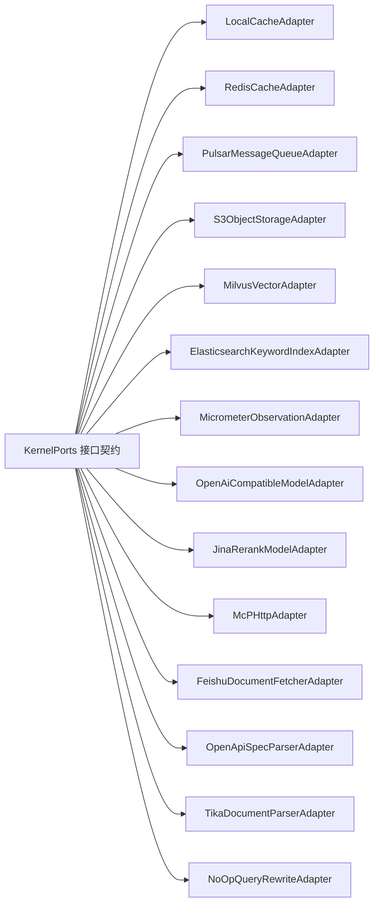

图示来源
- [KernelPorts.java](file://seahorse-agent-kernel/src/main/java/com/miracle/ai/seahorse/agent/ports/KernelPorts.java)
- [LocalCacheAdapter.java](file://seahorse-agent-adapter-cache-local/src/main/java/com/miracle/ai/seahorse/agent/adapters/cache/local/LocalCacheAdapter.java)
- [RedisCacheAdapter.java](file://seahorse-agent-adapter-cache-redis/src/main/java/com/miracle/ai/seahorse/agent/adapters/cache/redis/RedisCacheAdapter.java)
- [PulsarMessageQueueAdapter.java](file://seahorse-agent-adapter-mq-pulsar/src/main/java/com/miracle/ai/seahorse/agent/adapters/mq/pulsar/PulsarMessageQueueAdapter.java)
- [S3ObjectStorageAdapter.java](file://seahorse-agent-adapter-storage-s3/src/main/java/com/miracle/ai/seahorse/agent/adapters/storage/s3/S3ObjectStorageAdapter.java)
- [MilvusVectorAdapter.java](file://seahorse-agent-adapter-vector-milvus/src/main/java/com/miracle/ai/seahorse/agent/adapters/vector/milvus/MilvusVectorAdapter.java)
- [ElasticsearchKeywordIndexAdapter.java](file://seahorse-agent-adapter-search-elasticsearch/src/main/java/com/miracle/ai/seahorse/agent/adapters/search/elasticsearch/ElasticsearchKeywordIndexAdapter.java)
- [MicrometerObservationAdapter.java](file://seahorse-agent-adapter-observation-micrometer/src/main/java/com/miracle/ai/seahorse/agent/adapters/observation/micrometer/MicrometerObservationAdapter.java)
- [OpenAiCompatibleModelAdapter.java](file://seahorse-agent-adapter-ai-openai-compatible/src/main/java/com/miracle/ai/seahorse/agent/adapters/ai/openai/OpenAiCompatibleModelAdapter.java)
- [JinaRerankModelAdapter.java](file://seahorse-agent-adapter-ai-openai-compatible/src/main/java/com/miracle/ai/seahorse/agent/adapters/ai/JinaRerankModelAdapter.java)
- [McPHttpAdapter.java](file://seahorse-agent-adapter-mcp-http/src/main/java/com/miracle/ai/seahorse/agent/adapters/mcp/http/McPHttpAdapter.java)
- [FeishuDocumentFetcherAdapter.java](file://seahorse-agent-adapter-source-feishu/src/main/java/com/miracle/ai/seahorse/agent/adapters/source/feishu/FeishuDocumentFetcherAdapter.java)
- [OpenApiSpecParserAdapter.java](file://seahorse-agent-adapter-openapi/src/main/java/com/miracle/ai/seahorse/agent/adapters/openapi/OpenApiSpecParserAdapter.java)
- [TikaDocumentParserAdapter.java](file://seahorse-agent-adapter-parser-tika/src/main/java/com/miracle/ai/seahorse/agent/adapters/parser/tika/TikaDocumentParserAdapter.java)
- [NoOpQueryRewriteAdapter.java](file://seahorse-agent-kernel/src/main/java/com/miracle/ai/seahorse/agent/kernel/application/retrieval/NoOpQueryRewriteAdapter.java)

章节来源
- [KernelPorts.java](file://seahorse-agent-kernel/src/main/java/com/miracle/ai/seahorse/agent/ports/KernelPorts.java)
- [SpringBootStarterConfig.java](file://seahorse-agent-spring-boot-starter/src/main/java/com/miracle/ai/seahorse/agent/adapters/spring/SpringBootStarterConfig.java)

## 性能考量
- 缓存层
  - 本地缓存适合热点数据与低延迟场景；Redis 适合分布式共享与高并发。
  - 使用 RateLimiterPort 控制突发流量；DistributedLockPort/DistributedSemaphorePort 控制并发与资源占用。
- 消息队列
  - Pulsar 支持分区与消费者组，结合 StreamTaskPort 实现流式任务处理。
  - 合理设置批大小与超时，避免消息积压。
- 存储
  - S3 适合冷热分层与跨区域复制；本地存储适合开发与测试。
- 向量检索
  - Milvus/pgvector 的索引参数与 TopK 查询需结合业务调优；Noop 适配器便于基准测试。
- 搜索
  - Elasticsearch/Lucene 的索引映射与查询 DSL 需按字段类型与查询模式优化。
- 观察
  - Micrometer 提供指标埋点，建议按端口维度打点，便于定位瓶颈。
- **更新** AI 重排与查询重写
  - JinaRerankModelAdapter 提供优雅降级机制，在外部服务不可用时返回原始排序，确保系统稳定性。
  - QueryRewritePort 的实现应考虑缓存策略，减少重复的查询重写计算。

## 故障排查指南
- 端口未绑定
  - 检查 META-INF 下的端口映射文件是否存在且命名正确。
- 运行期异常
  - 查看 KernelModule 的装配日志与异常栈，确认适配器初始化是否成功。
- JDBC 仓储
  - 关注测试用例中的异常路径与边界条件，复用测试思路定位问题。
- MCP 服务
  - 检查 McPHttpAdapter 的凭据配置与网络连通性；MCP Server 的工具注册是否生效。
- **更新** AI 重排与查询重写
  - JinaRerankModelAdapter：检查 API 密钥配置、网络连通性和超时设置；查看降级日志。
  - NoOpQueryRewriteAdapter：验证查询重写链路是否正确调用，确保至少有一个查询被返回。

章节来源
- [KeyValueCachePort.java](file://seahorse-agent-adapter-cache-local/src/main/resources/META-INF/seahorse-agent/com.miracle.ai.seahorse.agent.ports.outbound.cache.KeyValueCachePort)
- [PubSubPort.java](file://seahorse-agent-adapter-cache-local/src/main/resources/META-INF/seahorse-agent/com.miracle.ai.seahorse.agent.ports.outbound.cache.PubSubPort)
- [RateLimiterPort.java](file://seahorse-agent-adapter-cache-local/src/main/resources/META-INF/seahorse-agent/com.miracle.ai.seahorse.agent.ports.outbound.cache.RateLimiterPort)
- [DistributedLockPort.java](file://seahorse-agent-adapter-cache-local/src/main/resources/META-INF/seahorse-agent/com.miracle.ai.seahorse.agent.ports.outbound.coordination.DistributedLockPort)
- [DistributedSemaphorePort.java](file://seahorse-agent-adapter-cache-local/src/main/resources/META-INF/seahorse-agent/com.miracle.ai.seahorse.agent.ports.outbound.coordination.DistributedSemaphorePort)
- [IdGeneratorPort.java](file://seahorse-agent-adapter-cache-local/src/main/resources/META-INF/seahorse-agent/com.miracle.ai.seahorse.agent.ports.outbound.id.IdGeneratorPort)
- [StreamTaskPort.java](file://seahorse-agent-adapter-cache-redis/src/main/resources/META-INF/seahorse-agent/com.miracle.ai.seahorse.agent.ports.outbound.stream.StreamTaskPort)
- [MessageQueuePort.java](file://seahorse-agent-adapter-mq-pulsar/src/main/resources/META-INF/seahorse-agent/com.miracle.ai.seahorse.agent.ports.outbound.mq.MessageQueuePort)
- [ObjectStoragePort.java](file://seahorse-agent-adapter-storage-s3/src/main/resources/META-INF/seahorse-agent/com.miracle.ai.seahorse.agent.ports.outbound.storage.ObjectStoragePort)
- [VectorSearchPort.java](file://seahorse-agent-adapter-vector-milvus/src/main/resources/META-INF/seahorse-agent/com.miracle.ai.seahorse.agent.ports.outbound.vector.VectorSearchPort)
- [VectorIndexPort.java](file://seahorse-agent-adapter-vector-milvus/src/main/resources/META-INF/seahorse-agent/com.miracle.ai.seahorse.agent.ports.outbound.vector.VectorIndexPort)
- [VectorCollectionAdminPort.java](file://seahorse-agent-adapter-vector-milvus/src/main/resources/META-INF/seahorse-agent/com.miracle.ai.seahorse.agent.ports.outbound.vector.VectorCollectionAdminPort)
- [ObservationPort.java](file://seahorse-agent-adapter-observation-noop/src/main/resources/META-INF/seahorse-agent/com.miracle.ai.seahorse.agent.ports.outbound.observation.ObservationPort)

## 结论
Seahorse Agent 的适配器体系以端口-适配器模式为核心，通过 Kernel 的统一编排与 Spring 的自动装配机制，实现了与外部系统的松耦合集成。该体系覆盖缓存、消息队列、存储、向量库、搜索、观察、AI、MCP、源接入与解析等关键能力，并提供了完善的测试与可观测性支撑。对于扩展与维护，建议遵循端口契约、保持适配器单一职责、关注性能与可靠性，并通过测试用例保障质量。

**更新** 新增的 JinaRerankModelAdapter 和 NoOpQueryRewriteAdapter 进一步完善了高级 RAG 管道的能力，JinaRerankModelAdapter 提供了强大的文档重排能力并具备优雅降级机制，NoOpQueryRewriteAdapter 确保了查询重写的默认可用性。这些新增适配器展示了系统在检索增强生成领域的持续演进和对生产环境可靠性的重视。

## 附录

### 适配器生命周期与配置
- 生命周期
  - 启动阶段：Spring 加载 META-INF 的端口映射，实例化适配器 Bean。
  - 运行阶段：Kernel 通过端口接口调用适配器，适配器与外部系统交互。
  - 关闭阶段：释放连接池、关闭通道或连接。
- 配置
  - application.properties：全局应用配置。
  - 各适配器模块的属性类（如 PulsarMessageQueueProperties、ElasticsearchKeywordProperties、LuceneKeywordProperties 等）：适配器特定配置项。
  - Spring Boot Starter：集中装配与条件化配置。
  - **更新** 高级 RAG 配置：通过 SeassehoseAgentRagWorkflowAutoConfiguration 自动配置 JinaRerankModelAdapter 和 NoOpQueryRewriteAdapter。

**更新** 新增了高级 RAG 工作流的自动配置支持，包括 JinaRerankModelAdapter 和 NoOpQueryRewriteAdapter 的条件化装配。

章节来源
- [application.properties](file://seahorse-agent-bootstrap/src/main/resources/application.properties)
- [PulsarMessageQueueProperties.java](file://seahorse-agent-adapter-mq-pulsar/src/main/java/com/miracle/ai/seahorse/agent/adapters/mq/pulsar/PulsarMessageQueueProperties.java)
- [ElasticsearchKeywordProperties.java](file://seahorse-agent-adapter-search-elasticsearch/src/main/java/com/miracle/ai/seahorse/agent/adapters/search/elasticsearch/ElasticsearchKeywordProperties.java)
- [LuceneKeywordProperties.java](file://seahorse-agent-adapter-search-lucene/src/main/java/com/miracle/ai/seahorse/agent/adapters/search/lucene/LuceneKeywordProperties.java)
- [SeahorseAgentSandboxAutoConfiguration.java](file://seahorse-agent-spring-boot-starter/src/main/java/com/miracle/ai/seahorse/agent/adapters/spring/SeahorseAgentSandboxAutoConfiguration.java)
- [SeahorseAgentRagWorkflowAutoConfiguration.java](file://seahorse-agent-spring-boot-starter/src/main/java/com/miracle/ai/seahorse/agent/adapters/spring/SeahorseAgentRagWorkflowAutoConfiguration.java)

### 与 Kernel 的交互与数据流
- Kernel 作为上层编排者，负责：
  - 解析端口契约，选择合适适配器。
  - 组织调用链路，传递上下文与参数。
  - 捕获异常并进行降级或重试策略。
- 数据流
  - 输入：请求参数与上下文。
  - 处理：Kernel 调用端口接口 -> 适配器对接外部系统。
  - 输出：结果封装与回传。

**更新** 高级 RAG 管道的数据流增加了重排和查询重写环节，确保检索结果的质量和查询的有效性。

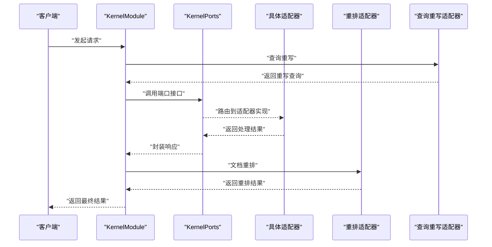

图示来源
- [KernelModule.java](file://seahorse-agent-kernel/src/main/java/com/miracle/ai/seahorse/agent/kernel/KernelModule.java)
- [KernelPorts.java](file://seahorse-agent-kernel/src/main/java/com/miracle/ai/seahorse/agent/ports/KernelPorts.java)
- [RerankModelPort.java](file://seahorse-agent-kernel/src/main/java/com/miracle/ai/seahorse/agent/ports/outbound/retrieval/RerankModelPort.java)
- [QueryRewritePort.java](file://seahorse-agent-kernel/src/main/java/com/miracle/ai/seahorse/agent/ports/outbound/retrieval/QueryRewritePort.java)

### 自定义适配器开发指南
- 端口接口实现
  - 在 Kernel 模块中定义端口接口，明确输入输出与异常语义。
  - 在适配器模块中实现该接口，确保幂等与可重入。
- 配置文件编写
  - 在适配器模块的 resources/META-INF 下新增端口映射文件，内容为端口接口的全限定名。
  - 为适配器添加属性类与默认值，支持 application.properties 覆盖。
- 测试方法
  - 参考现有测试用例，覆盖正常路径、异常路径与边界条件。
  - 对 JDBC 仓储，补充 Schema 升级与迁移测试。
  - **更新** 对于新增的 RAG 功能，参考 JinaRerankModelAdapter 和 NoOpQueryRewriteAdapter 的测试模式。
- 集成验证
  - 启动应用，检查端口绑定与调用链路。
  - 使用最小可复现样例验证端到端流程。

**更新** 新增了高级 RAG 功能的适配器开发指导，包括重排和查询重写的最佳实践。

章节来源
- [KernelPorts.java](file://seahorse-agent-kernel/src/main/java/com/miracle/ai/seahorse/agent/ports/KernelPorts.java)
- [RerankModelPort.java](file://seahorse-agent-kernel/src/main/java/com/miracle/ai/seahorse/agent/ports/outbound/retrieval/RerankModelPort.java)
- [QueryRewritePort.java](file://seahorse-agent-kernel/src/main/java/com/miracle/ai/seahorse/agent/ports/outbound/retrieval/QueryRewritePort.java)
- [JinaRerankModelAdapter.java](file://seahorse-agent-adapter-ai-openai-compatible/src/main/java/com/miracle/ai/seahorse/agent/adapters/ai/JinaRerankModelAdapter.java)
- [NoOpQueryRewriteAdapter.java](file://seahorse-agent-kernel/src/main/java/com/miracle/ai/seahorse/agent/kernel/application/retrieval/NoOpQueryRewriteAdapter.java)

### 版本管理与向后兼容
- 端口契约稳定：KernelPorts 的接口变更应遵循兼容性原则，优先新增而非破坏性修改。
- 适配器替换：通过 META-INF 的端口映射可无缝切换实现，保证运行时兼容。
- 测试驱动：为每个端口提供充分的单元与集成测试，覆盖历史行为。
- 文档与注释：记录端口演进与废弃策略，便于团队协作与知识沉淀。
- **更新** 高级 RAG 功能的向后兼容：JinaRerankModelAdapter 和 NoOpQueryRewriteAdapter 的引入不影响现有功能，提供可选的增强能力。

### 学习路径与实践指导
- 初学者
  - 了解端口-适配器模式与 Kernel 的角色。
  - 阅读一个简单适配器（如 LocalCacheAdapter 或 NoopObservationAdapter）的实现。
  - 修改 application.properties 体验配置生效。
- 进阶者
  - 阅读复杂适配器（如 PulsarMessageQueueAdapter、MilvusVectorAdapter）的实现细节。
  - 编写一个自定义适配器并完成端口映射与测试。
  - **更新** 学习高级 RAG 功能的实现，参考 JinaRerankModelAdapter 和 NoOpQueryRewriteAdapter 的设计模式。
- 高级者
  - 设计新的端口接口并推动 Kernel 与多个适配器的协同。
  - 关注性能优化与可观测性，完善测试矩阵与回归策略。
  - **更新** 深入研究检索增强生成（RAG）管道的设计原理，掌握重排和查询重写的技术要点。