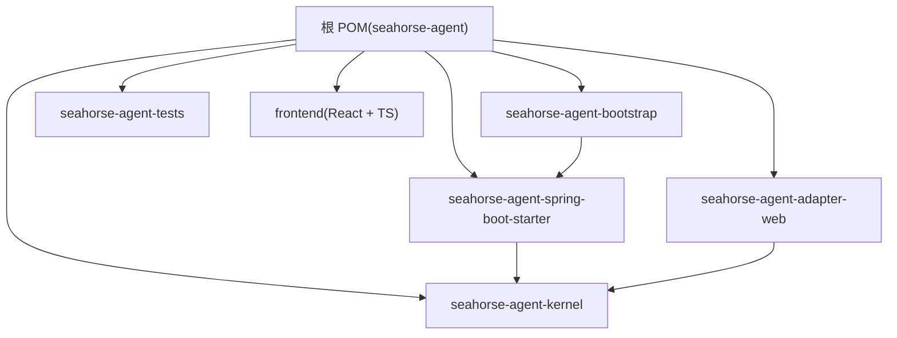
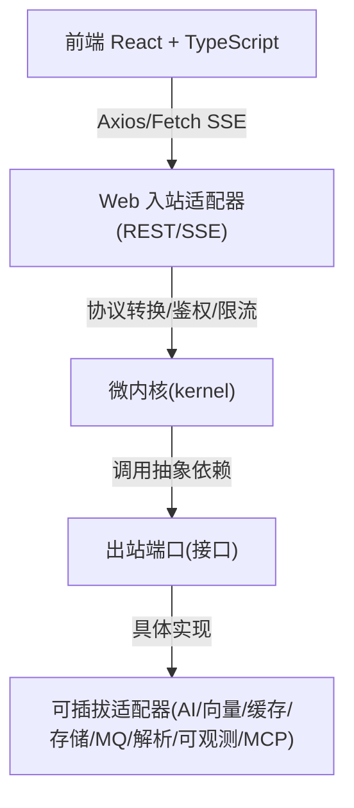
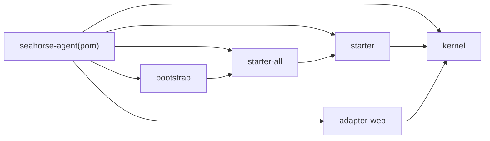

# 开发指南

<cite>
**本文引用的文件**
- [pom.xml](file://pom.xml)
- [README.md](file://README.md)
- [DEVELOPMENT-GUIDE.md](file://docs/DEVELOPMENT-GUIDE.md)
- [Dockerfile.backend](file://Dockerfile.backend)
- [docker-compose.yml](file://docker-compose.yml)
- [application.properties](file://seahorse-agent-bootstrap/src/main/resources/application.properties)
- [package.json](file://frontend/package.json)
- [vite.config.js](file://frontend/vite.config.js)
- [.eslintrc.cjs](file://frontend/.eslintrc.cjs)
- [.prettierrc](file://frontend/.prettierrc)
- [tsconfig.app.json](file://frontend/tsconfig.app.json)
- [Dockerfile.frontend](file://frontend/Dockerfile.frontend)
- [copyright.txt](file://resources/format/copyright.txt)
- [lombok.config](file://lombok.config)
</cite>

## 目录
1. [简介](#简介)
2. [项目结构](#项目结构)
3. [核心组件](#核心组件)
4. [架构总览](#架构总览)
5. [详细组件分析](#详细组件分析)
6. [依赖分析](#依赖分析)
7. [性能考虑](#性能考虑)
8. [故障排查指南](#故障排查指南)
9. [结论](#结论)
10. [附录](#附录)

## 简介
本指南面向新加入的开发者，提供 Seahorse Agent 项目的完整开发与贡献流程说明。内容涵盖开发环境搭建、IDE 配置、代码规范与最佳实践、贡献流程、项目结构与模块依赖、开发工具推荐、本地调试技巧、插件与扩展机制，以及面向初学者的入门指导。

## 项目结构
项目采用多模块 Maven 架构，后端以“微内核 + 端口适配器 + 插件扩展”组织，前端为独立 React + TypeScript 应用。根 POM 聚合并管理依赖，模块包括内核、Web 入站适配器、各类出站适配器、自动装配 Starter、启动入口与测试模块。

图表来源
- [pom.xml:38-66](file://pom.xml#L38-L66)
- [README.md:134-163](file://README.md#L134-L163)

章节来源
- [pom.xml:38-66](file://pom.xml#L38-L66)
- [README.md:134-163](file://README.md#L134-L163)

## 核心组件
- 微内核（kernel）：承载稳定的领域模型、端口契约、应用服务与 Feature 扩展点，负责主流程编排。
- Web 入站适配器：提供 REST/SSE 接口与认证，作为外部调用的入口。
- 出站适配器：实现各类端口，对接 AI 模型、向量库、缓存、消息队列、对象存储、文档解析、MCP 等。
- 自动装配 Starter：通过 Spring Boot AutoConfiguration 机制注册适配器，支持核心坐标与全量适配器聚合。
- 启动入口：Spring Boot 应用入口，加载自动装配并启动服务。
- 前端：React + TypeScript 应用，提供聊天、知识库、入库、Trace、设置等页面与 API 服务层。

章节来源
- [README.md:65-79](file://README.md#L65-L79)
- [DEVELOPMENT-GUIDE.md:471-516](file://docs/DEVELOPMENT-GUIDE.md#L471-L516)

## 架构总览
后端采用“微内核 + 端口适配器 + 插件扩展”的六边形架构，内核不依赖具体实现，通过端口接口访问外部能力；适配器模块可热插拔替换。前端通过 Vite 代理将 /api 请求转发至后端，实现联调与跨域消除。

图表来源
- [README.md:81-132](file://README.md#L81-L132)
- [vite.config.js:11-21](file://frontend/vite.config.js#L11-L21)

章节来源
- [README.md:81-132](file://README.md#L81-L132)
- [vite.config.js:11-21](file://frontend/vite.config.js#L11-L21)

## 详细组件分析

### 开发环境搭建
- 必备工具：JDK 17+、Maven Wrapper、Node.js 18+、npm、PostgreSQL 16 + pgvector、Git、Docker + Docker Compose。
- JDK 与 Maven：项目自带 mvnw，可直接使用；国内建议配置阿里云镜像。
- Node.js：推荐 nvm-windows 管理版本；安装依赖后可运行前端开发服务器。
- 数据库：推荐 Docker 启动 PostgreSQL + pgvector；或本地安装并创建数据库与用户。
- AI 模型服务：可使用 OpenAI 兼容服务，如 Ollama 本地部署。
- 环境变量：复制 .env.example 为 .env，填入 AI 模型配置。

章节来源
- [DEVELOPMENT-GUIDE.md:112-230](file://docs/DEVELOPMENT-GUIDE.md#L112-L230)
- [README.md:17-49](file://README.md#L17-L49)

### IDE 配置与调试环境
- 后端：在 IDEA 中打开项目，等待 Maven 依赖导入完成；找到启动类并配置 VM Options 或环境变量；使用 Debug 模式启动。
- 前端：在 frontend 目录执行 npm install，运行 npm run dev；Vite 代理将 /api 转发至后端。
- Docker Compose：一键启动 PostgreSQL、后端与前端；可按需切换适配器类型（如向量库、缓存、存储等）。

章节来源
- [DEVELOPMENT-GUIDE.md:232-345](file://docs/DEVELOPMENT-GUIDE.md#L232-L345)
- [docker-compose.yml:1-99](file://docker-compose.yml#L1-L99)

### 代码规范与最佳实践
- Java 规范
  - 命名：包名采用反向域名风格；类名帕斯卡命名；方法/字段驼峰命名；常量全大写下划线。
  - 注释：类与公共 API 使用标准 JavaDoc；复杂逻辑添加行内注释解释“为什么”。
  - 异常：统一异常响应与 HTTP 状态映射；避免泄露敏感信息。
  - Lombok：减少样板代码，保持简洁与可读性。
  - Spotless：编译阶段注入统一版权头，确保合规与一致性。
- TypeScript/React 规范
  - ESLint：集成推荐规则集与 React/TS 规则，关闭与 React 18 兼容相关的警告。
  - Prettier：统一缩进、分号、引号与行宽；与 ESLint 协同工作。
  - 类型：类型定义集中在 src/types/index.ts；严格模式开启，禁用未使用变量与参数。
  - 命名：前端使用相对路径别名 @ 指向 src；组件与页面按功能模块组织。
- 版权头与格式化：Spotless 在编译阶段注入版权头；ESLint/Prettier/Vite 构成前端工具链。

章节来源
- [DEVELOPMENT-GUIDE.md:751-800](file://docs/DEVELOPMENT-GUIDE.md#L751-L800)
- [copyright.txt:1-18](file://resources/format/copyright.txt#L1-L18)
- [lombok.config:1-10](file://lombok.config#L1-L10)
- [.eslintrc.cjs:1-27](file://frontend/.eslintrc.cjs#L1-L27)
- [.prettierrc:1-8](file://frontend/.prettierrc#L1-L8)
- [tsconfig.app.json:1-22](file://frontend/tsconfig.app.json#L1-L22)

### 贡献流程
- 分支管理：建议以 feature/xxx 命名创建功能分支。
- 提交流程：编写代码与测试，确保编译通过、单元测试通过、Spotless 格式化通过；提交并推送至 Fork；创建 Pull Request 并描述修改内容与动机。
- 代码审查：遵循命名与注释规范、无重复代码、异常与错误处理完善、类型定义完整、无不必要的依赖；在 CI 中强制执行。

章节来源
- [DEVELOPMENT-GUIDE.md:751-800](file://docs/DEVELOPMENT-GUIDE.md#L751-L800)

### 项目结构与模块依赖
- 核心模块
  - seahorse-agent-kernel：内核与端口契约、应用服务、Feature 扩展点。
  - seahorse-agent-adapter-web：Web 入站适配器，提供 REST/SSE 接口。
  - seahorse-agent-spring-boot-starter(-all/-core)：自动装配与运行时配置。
  - seahorse-agent-bootstrap：Spring Boot 启动入口。
  - seahorse-agent-tests：集成测试模块。
- 适配器模块：AI 模型、向量库、缓存、消息队列、对象存储、文档解析、MCP、可观测等。
- 前端模块：React + TypeScript 应用，包含页面、组件、服务层、状态管理与工具库。

章节来源
- [pom.xml:38-66](file://pom.xml#L38-L66)
- [README.md:326-352](file://README.md#L326-L352)

### 开发工具推荐
- IDE 插件：ESLint、Prettier、TailwindCSS、Lombok 支持。
- 调试工具：IDEA 调试器、Chrome DevTools（Network/SSE）、Postman。
- 性能分析：JProfiler/JMC（Java）、Chrome Performance（前端）。
- 测试工具：JUnit 5 + Mockito（后端）、Vitest + Testing Library（前端）。

章节来源
- [DEVELOPMENT-GUIDE.md:620-680](file://docs/DEVELOPMENT-GUIDE.md#L620-L680)
- [package.json:53-78](file://frontend/package.json#L53-L78)

### 本地开发调试技巧
- 后端：在 IDEA 中设置断点，使用 Debug 模式启动；调整 application.properties 日志级别定位问题。
- 前端：使用 Chrome DevTools 查看请求与 SSE 事件流；SSE 支持中断与指数退避重试。
- 联调：确保前端通过 localhost:5173 访问，Vite 代理将 /api 转发至后端 9090；后端默认端口 9090。

章节来源
- [DEVELOPMENT-GUIDE.md:684-708](file://docs/DEVELOPMENT-GUIDE.md#L684-L708)
- [vite.config.js:11-21](file://frontend/vite.config.js#L11-L21)

### 插件开发与扩展机制
- 端口契约：内核通过 Inbound/Outbound 端口访问外部能力；新增能力需先在内核定义端口接口。
- 适配器实现：在对应 adapter 模块实现端口；注册自动配置并在 starter-all 中聚合（可选）。
- Feature 扩展：检索通道、入库节点等通过 Feature 机制扩展，不侵入主链路。
- MCP 工具：通过 MCP allowlist 将工具注册为 ToolPort，在 Agent 模式下按需调用。

章节来源
- [DEVELOPMENT-GUIDE.md:541-617](file://docs/DEVELOPMENT-GUIDE.md#L541-L617)
- [README.md:50-64](file://README.md#L50-L64)

## 依赖分析
后端模块依赖关系：bootstrap → starter-all → starter → kernel，kernel 依赖各 adapter 模块提供的端口实现；web 适配器直接依赖内核端口。

图表来源
- [pom.xml:38-66](file://pom.xml#L38-L66)
- [DEVELOPMENT-GUIDE.md:93-98](file://docs/DEVELOPMENT-GUIDE.md#L93-L98)

章节来源
- [pom.xml:38-66](file://pom.xml#L38-L66)
- [DEVELOPMENT-GUIDE.md:93-98](file://docs/DEVELOPMENT-GUIDE.md#L93-L98)

## 性能考虑
- 启动与构建：使用 Maven Wrapper 与增量构建；Docker 构建阶段缓存依赖层；前端使用 Vite 快速开发服务器。
- 运行时：合理配置适配器类型（开发环境推荐 noop/local/direct），生产环境按需替换为 Redis、Milvus、S3、Micrometer 等。
- 日志与可观测：通过 application.properties 调整日志级别；使用 Micrometer 观测指标。

章节来源
- [Dockerfile.backend:14-51](file://Dockerfile.backend#L14-L51)
- [docker-compose.yml:31-83](file://docker-compose.yml#L31-L83)
- [DEVELOPMENT-GUIDE.md:695-708](file://docs/DEVELOPMENT-GUIDE.md#L695-L708)

## 故障排查指南
- 编译问题：依赖解析失败（配置镜像或 VPN）、JDK 版本不符、Spotless 格式化报错（运行 spotless:apply）。
- 启动问题：数据库连接失败（先启动 PostgreSQL）、AI 模型 API Key 未配置、端口占用（修改 SERVER_PORT）。
- 运行时问题：对话返回空（向量库为空/noop，先上传文档或切换 pgvector）、Embedding 失败（模型名称不正确）、SSE 连接中断（前端指数退避重试，检查后端日志）。
- 前端问题：npm install 失败（Node 18+ 与镜像）、TypeScript 类型错误（运行 lint）、页面空白（后端未启动）。

章节来源
- [DEVELOPMENT-GUIDE.md:711-749](file://docs/DEVELOPMENT-GUIDE.md#L711-L749)

## 结论
本指南基于仓库现有配置与文档，给出了从环境准备到日常开发、测试、审查与维护的全流程建议。遵循统一的工具链与代码规范，有助于提升协作效率与系统稳定性。建议团队在日常开发中严格遵循命名、注释、异常与错误处理、类型定义与格式化等规范，并在 CI 中强制执行。

## 附录
- 开发环境与 IDE 设置
  - JDK 与构建：使用 Java 17，Maven 3.6+，推荐在 IDE 中启用“Import Maven Projects Automatically”。
  - Lombok 支持：启用注解处理，避免覆盖率误判，保持 equals/hashCode 的合理行为。
  - 前端开发：安装 Node.js 18+，执行 npm install，使用 VS Code 并安装 ESLint、Prettier、TailwindCSS 插件。
  - Git 与忽略规则：使用 .gitignore 忽略构建产物与 IDE 临时文件，避免污染仓库。
- 代码规范与最佳实践
  - Java 规范：统一版权头由 Spotless 注入，使用 Lombok 减少样板代码，保持 equals/hashCode 行为稳定。
  - TypeScript/React 规范：ESLint 规则集包含推荐配置与 React Hooks、React Refresh 插件，Prettier 统一格式；TailwindCSS 与 PostCSS 配置集中管理，类型定义位于 src/types/index.ts。
  - 命名约定：Java 包名遵循 com.miracle.ai.seahorse.agent 命名空间；前端使用相对路径别名 @ 指向 src。
  - 注释规范：采用统一版权头模板，类与方法注释清晰描述职责与异常处理。
- 前端工具链
  - Vite：开发服务器与代理配置，便于前后端联调。
  - ESLint/Prettier：零警告策略，保证代码风格一致。
  - Axios：统一设置 API 基础路径、鉴权头与业务错误处理。
  - TailwindCSS：响应式断点策略，移动端优先设计。

章节来源
- [DEVELOPMENT-GUIDE.md:259-288](file://docs/DEVELOPMENT-GUIDE.md#L259-L288)
- [pom.xml:19,32](file://pom.xml#L19,L32)
- [lombok.config:1-10](file://lombok.config#L1-L10)
- [.gitignore:1-46](file://.gitignore#L1-L46)
- [package.json:53-78](file://frontend/package.json#L53-L78)