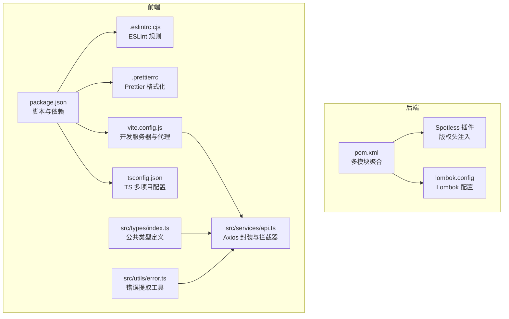
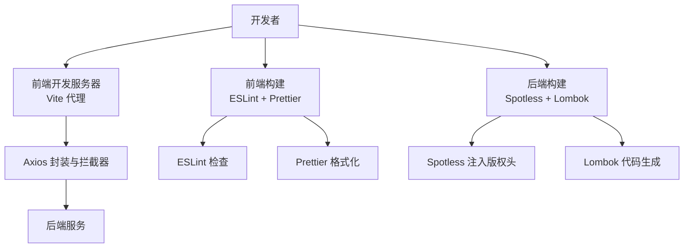
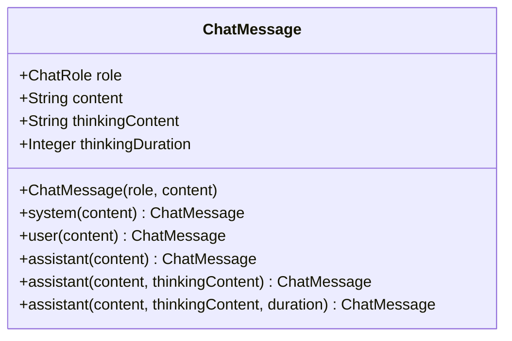
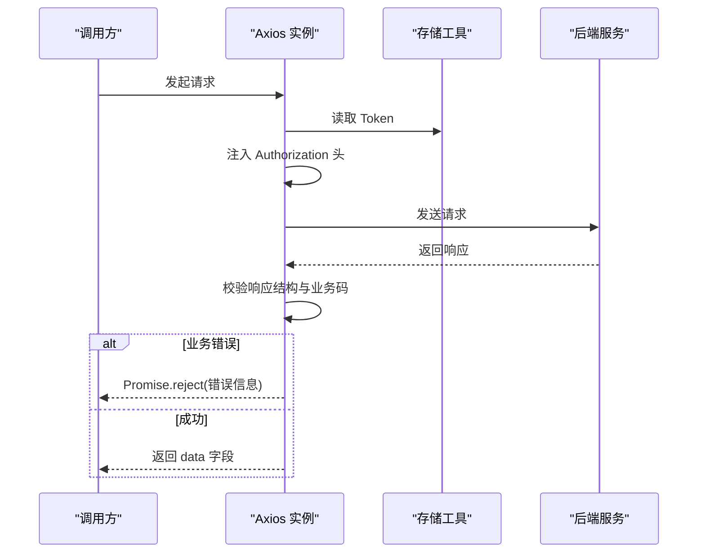
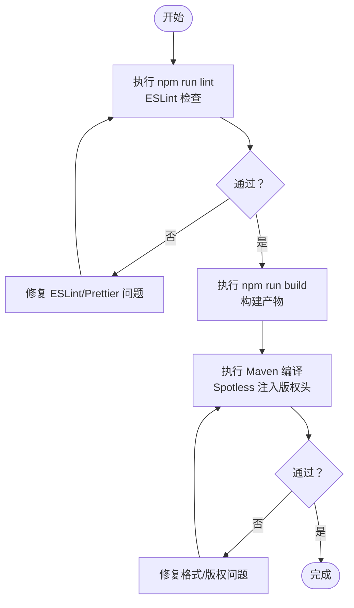
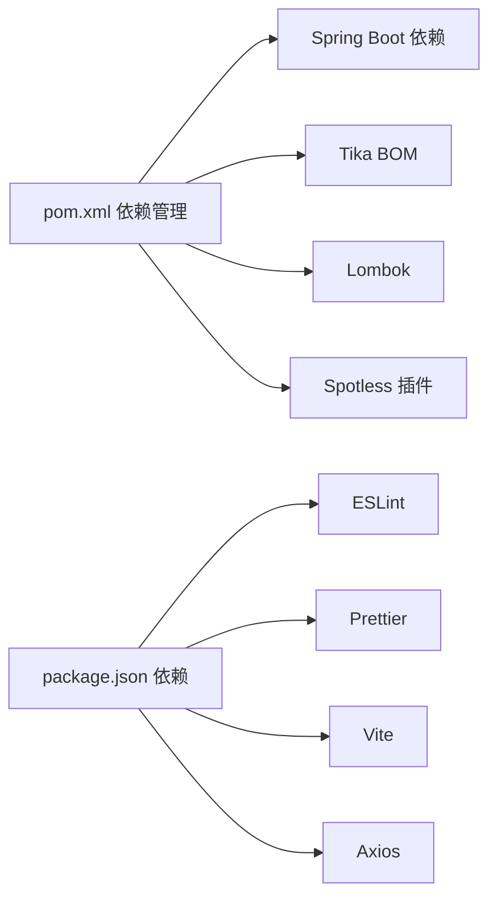

# 代码规范

<cite>
**本文引用的文件**
- [lombok.config](file://lombok.config)
- [.eslintrc.cjs](file://frontend/.eslintrc.cjs)
- [.prettierrc](file://frontend/.prettierrc)
- [package.json](file://frontend/package.json)
- [pom.xml](file://pom.xml)
- [copyright.txt](file://resources/format/copyright.txt)
- [vite.config.js](file://frontend/vite.config.js)
- [tsconfig.json](file://frontend/tsconfig.json)
- [index.ts](file://frontend/src/types/index.ts)
- [error.ts](file://frontend/src/utils/error.ts)
- [ChatMessage.java](file://seahorse-agent-kernel/src/main/java/com/miracle/ai/seahorse/agent/kernel/domain/chat/ChatMessage.java)
- [SeahorseWebExceptionHandler.java](file://seahorse-agent-adapter-web/src/main/java/com/miracle/ai/seahorse/agent/adapters/web/SeahorseWebExceptionHandler.java)
- [api.ts](file://frontend/src/services/api.ts)
- [TESTING.md](file://frontend/TESTING.md)
</cite>

## 目录
1. [引言](#引言)
2. [项目结构](#项目结构)
3. [核心组件](#核心组件)
4. [架构总览](#架构总览)
5. [详细组件分析](#详细组件分析)
6. [依赖分析](#依赖分析)
7. [性能考虑](#性能考虑)
8. [故障排查指南](#故障排查指南)
9. [结论](#结论)
10. [附录](#附录)

## 引言
本文件旨在为本项目提供一套统一、可执行的代码规范与最佳实践，覆盖后端 Java、前端 TypeScript/JavaScript 的编码风格与质量标准，涵盖 Lombok 使用、Git 提交规范、代码审查流程、代码格式化工具配置以及 CI 中的质量检查要求。内容基于仓库现有配置与典型实现进行总结，便于团队协作与长期维护。

## 项目结构
本项目采用多模块 Maven 结构，后端以 Spring Boot 为基础，前端采用 Vite + React + TypeScript 技术栈。根目录包含统一的构建与格式化配置，前端子目录包含 ESLint、Prettier、Vite 等工具配置与类型定义、工具函数等。

图表来源
- [pom.xml:185-260](file://pom.xml#L185-L260)
- [lombok.config:1-10](file://lombok.config#L1-L10)
- [package.json:1-70](file://package.json#L1-L70)
- [frontend/.eslintrc.cjs:1-27](file://frontend/.eslintrc.cjs#L1-L27)
- [frontend/.prettierrc:1-8](file://frontend/.prettierrc#L1-L8)
- [frontend/vite.config.js:1-22](file://frontend/vite.config.js#L1-L22)
- [frontend/tsconfig.json:1-8](file://frontend/tsconfig.json#L1-L8)
- [frontend/src/types/index.ts:1-50](file://frontend/src/types/index.ts#L1-L50)
- [frontend/src/utils/error.ts:1-13](file://frontend/src/utils/error.ts#L1-L13)
- [frontend/src/services/api.ts:1-66](file://frontend/src/services/api.ts#L1-L66)

章节来源
- [pom.xml:1-262](file://pom.xml#L1-L262)
- [package.json:1-70](file://package.json#L1-L70)

## 核心组件
- 后端格式化与版权头：通过 Maven Spotless 插件在编译阶段注入版权头，确保所有 Java 文件具备统一的许可证头部。
- Lombok 配置：统一生成注解行为，避免重复代码，提升可读性与一致性。
- 前端 ESLint + Prettier：统一代码风格与静态检查，结合 React/TS 规则与 Prettier 接入，保证一致的提交质量。
- 前端 Axios 封装与拦截器：集中处理鉴权、错误提示与统一响应结构，提升用户体验与调试效率。
- 类型系统：通过 TypeScript 类型定义约束前后端交互数据结构，降低运行时风险。

章节来源
- [pom.xml:238-258](file://pom.xml#L238-L258)
- [lombok.config:1-10](file://lombok.config#L1-L10)
- [frontend/.eslintrc.cjs:1-27](file://frontend/.eslintrc.cjs#L1-L27)
- [frontend/.prettierrc:1-8](file://frontend/.prettierrc#L1-L8)
- [frontend/src/services/api.ts:1-66](file://frontend/src/services/api.ts#L1-L66)
- [frontend/src/types/index.ts:1-50](file://frontend/src/types/index.ts#L1-L50)

## 架构总览
下图展示前后端在开发与构建阶段的关键交互与质量保障点。

图表来源
- [frontend/vite.config.js:1-22](file://frontend/vite.config.js#L1-L22)
- [frontend/src/services/api.ts:1-66](file://frontend/src/services/api.ts#L1-L66)
- [frontend/.eslintrc.cjs:1-27](file://frontend/.eslintrc.cjs#L1-L27)
- [frontend/.prettierrc:1-8](file://frontend/.prettierrc#L1-L8)
- [pom.xml:238-258](file://pom.xml#L238-L258)
- [lombok.config:1-10](file://lombok.config#L1-L10)

## 详细组件分析

### Java 代码规范
- 命名约定
  - 包名：采用反向域名风格，体现模块边界与分层。
  - 类名：采用帕斯卡命名法；领域模型使用名词短语，清晰表达职责。
  - 方法与字段：采用驼峰命名法；布尔值使用 is/has/can 等语义化前缀。
  - 常量：全大写下划线分隔。
- 类设计原则
  - 使用 Lombok 注解减少样板代码，保持简洁与可读性。
  - 静态工厂方法用于构造复杂对象，提升可读性与扩展性。
  - 不可变对象优先，必要时提供拷贝构造或只读视图。
- 注释规范
  - 类与公共 API 使用标准 JavaDoc 注释，描述用途、参数、返回值与异常。
  - 复杂逻辑添加行内注释，解释“为什么”而非“是什么”。
- 异常处理
  - 统一异常响应：通过全局异常处理器返回结构化错误码与消息，避免泄露内部细节。
  - 明确 HTTP 状态映射：如非法参数映射到 400，冲突映射到 409，其他错误映射到 500。
- 日志使用
  - 建议使用结构化日志（如 JSON），记录上下文键值对，便于检索与监控。
  - 避免在日志中输出敏感信息（如令牌、密码）。
- 版权头与格式化
  - Spotless 在编译阶段注入统一版权头，确保合规与一致性。

图表来源
- [ChatMessage.java:24-67](file://seahorse-agent-kernel/src/main/java/com/miracle/ai/seahorse/agent/kernel/domain/chat/ChatMessage.java#L24-L67)

章节来源
- [ChatMessage.java:1-68](file://seahorse-agent-kernel/src/main/java/com/miracle/ai/seahorse/agent/kernel/domain/chat/ChatMessage.java#L1-L68)
- [SeahorseWebExceptionHandler.java:28-59](file://seahorse-agent-adapter-web/src/main/java/com/miracle/ai/seahorse/agent/adapters/web/SeahorseWebExceptionHandler.java#L28-L59)
- [pom.xml:238-258](file://pom.xml#L238-L258)
- [lombok.config:1-10](file://lombok.config#L1-L10)

### TypeScript/JavaScript 代码规范
- 变量命名
  - 常量使用全大写加下划线；变量与函数使用驼峰；类名与接口使用帕斯卡。
- 函数设计
  - 优先使用纯函数与不可变数据；副作用集中在明确的函数中。
  - 错误处理统一通过工具函数提取与上报，避免分散处理。
- 接口定义
  - 所有跨组件的数据结构在类型文件中集中定义，确保前后端一致。
- 错误处理
  - Axios 拦截器统一处理业务错误码与网络错误，结合 UI 提示与路由跳转。
  - 对鉴权过期场景进行统一处理，清理本地状态并引导登录。

图表来源
- [api.ts:21-65](file://frontend/src/services/api.ts#L21-L65)

章节来源
- [index.ts:1-50](file://frontend/src/types/index.ts#L1-L50)
- [error.ts:1-13](file://frontend/src/utils/error.ts#L1-L13)
- [api.ts:1-66](file://frontend/src/services/api.ts#L1-L66)

### Lombok 使用规范
- 生成注解
  - 使用注解生成 getter/setter/toString/equals/hashCode 等，减少重复代码。
  - 对继承场景，注意 equals/hashCode 的 callSuper 行为，避免父类与子类行为不一致。
- 元注解与复制
  - 将特定注解复制到生成代码中，确保框架扫描可用。
- 生成注解可见性
  - 在覆盖率统计中忽略 Lombok 生成代码，避免误判。

章节来源
- [lombok.config:1-10](file://lombok.config#L1-L10)

### Git 提交规范
- 提交信息格式
  - 类型(scope): 概要
  - 详细说明（空行分隔）
  - 关联问题（可选）
- 分支命名
  - 功能分支：feature/xxx
  - 修复分支：fix/xxx
  - 文档分支：docs/xxx
  - 热修复：hotfix/xxx
- 合并策略
  - 使用 Squash Merge 保持历史整洁
  - 合并前必须通过 CI 与代码审查

（本节为通用规范说明，不直接分析具体文件）

### 代码审查标准与流程
- 审查清单
  - 代码是否符合命名与注释规范
  - 是否存在重复代码与坏味道
  - 异常与错误处理是否完善
  - 类型定义是否完整且一致
  - 是否引入不必要的依赖
- 质量要求
  - 通过本地格式化与静态检查
  - 单元测试覆盖主要分支
  - 无阻塞性 ESLint/Prettier 错误
- 反馈机制
  - 明确责任人与截止时间
  - 争议问题升级至技术负责人

（本节为通用规范说明，不直接分析具体文件）

### 代码格式化工具配置与使用
- Spotless（Java）
  - 在编译阶段注入版权头，确保所有 Java 文件具备统一头部。
  - 配置文件位于 Maven 插件中，执行 phase 为 compile。
- ESLint（前端）
  - 集成推荐规则集与 React/TS 规则，关闭与 React 18 兼容相关的警告。
  - 通过脚本执行 lint，允许零警告策略。
- Prettier（前端）
  - 统一缩进、分号、引号与行宽等格式选项，与 ESLint 通过插件协同工作。
- Vite（前端）
  - 提供开发服务器与代理配置，便于前后端联调。

图表来源
- [package.json:6-11](file://package.json#L6-L11)
- [frontend/.eslintrc.cjs:1-27](file://frontend/.eslintrc.cjs#L1-L27)
- [frontend/.prettierrc:1-8](file://frontend/.prettierrc#L1-L8)
- [pom.xml:238-258](file://pom.xml#L238-L258)

章节来源
- [pom.xml:238-258](file://pom.xml#L238-L258)
- [frontend/.eslintrc.cjs:1-27](file://frontend/.eslintrc.cjs#L1-L27)
- [frontend/.prettierrc:1-8](file://frontend/.prettierrc#L1-L8)
- [package.json:1-70](file://package.json#L1-L70)

### 持续集成中的代码质量检查
- 前端
  - 在 CI 中执行 lint 与构建命令，确保零警告与可构建。
- 后端
  - 在 CI 中执行编译与测试，Spotless 在编译阶段运行，确保版权头一致。
- 前后端联调
  - 前端通过 Vite 代理将 /api 请求转发至后端，便于本地与 CI 环境联调。

章节来源
- [package.json:6-11](file://package.json#L6-L11)
- [pom.xml:238-258](file://pom.xml#L238-L258)
- [vite.config.js:13-19](file://frontend/vite.config.js#L13-L19)
- [TESTING.md:1-112](file://frontend/TESTING.md#L1-L112)

## 依赖分析
- 后端依赖管理
  - 通过 Spring Boot 与 Tika 等 BOM 管理版本，统一依赖范围与作用域。
  - Lombok 作为可选依赖，配合 Spotless 与 Lombok 配置使用。
- 前端依赖管理
  - 通过 package.json 管理脚本、依赖与开发依赖，ESLint 与 Prettier 作为开发工具。
  - Vite 提供开发与代理能力，Axios 作为 HTTP 客户端。

图表来源
- [pom.xml:62-165](file://pom.xml#L62-L165)
- [package.json:13-68](file://package.json#L13-L68)

章节来源
- [pom.xml:62-165](file://pom.xml#L62-L165)
- [package.json:13-68](file://package.json#L13-L68)

## 性能考虑
- 前端
  - 合理拆分包与懒加载，减少首屏体积。
  - 使用拦截器统一处理错误与鉴权，避免重复逻辑导致的额外请求。
- 后端
  - 使用 Lombok 生成代码减少反射与样板代码带来的开销。
  - Spotless 注入版权头为构建期任务，不会影响运行时性能。

（本节提供一般性建议，不直接分析具体文件）

## 故障排查指南
- 前端代理问题
  - 若出现静态资源未找到，检查 Vite 代理配置与开发服务器端口。
  - 参考测试文档中的代理与端口说明，确认后端服务可达。
- 鉴权相关
  - 401 未登录或过期时，拦截器会清理本地状态并跳转登录页。
  - 检查响应结构与业务码，确保统一处理逻辑生效。
- 本地联调
  - 使用测试文档提供的 curl 命令验证后端接口可用性。
  - 打开浏览器开发者工具查看 Network 标签，定位问题。

章节来源
- [TESTING.md:1-112](file://frontend/TESTING.md#L1-L112)
- [api.ts:29-65](file://frontend/src/services/api.ts#L29-L65)

## 结论
本规范以现有配置为基础，结合前后端最佳实践，形成可落地的编码与质量标准。建议团队在日常开发中严格遵循命名、注释、异常与错误处理、类型定义与格式化等规范，并在 CI 中强制执行，以确保代码一致性与可维护性。

## 附录
- 版权头模板：位于 resources/format/copyright.txt，由 Spotless 注入。
- Lombok 配置：位于 lombok.config，统一生成注解行为与复制注解。
- 前端工具链：ESLint、Prettier、Vite、Axios，均在 package.json 中声明与使用。

章节来源
- [copyright.txt:1-18](file://resources/format/copyright.txt#L1-L18)
- [lombok.config:1-10](file://lombok.config#L1-L10)
- [package.json:1-70](file://package.json#L1-L70)