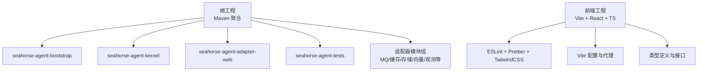
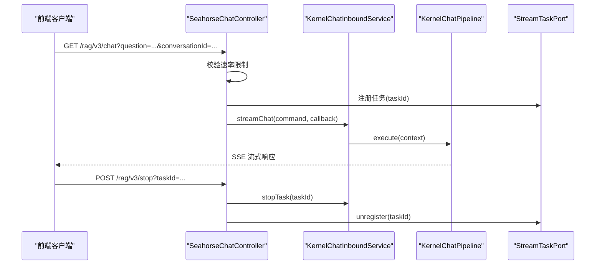
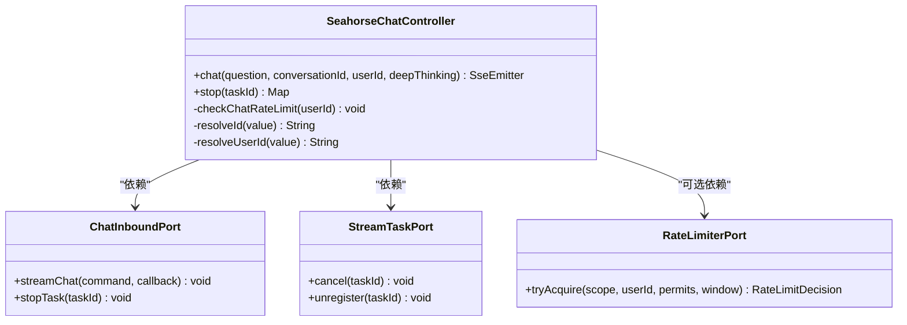
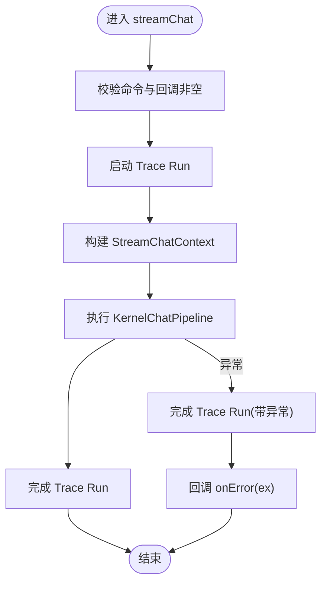
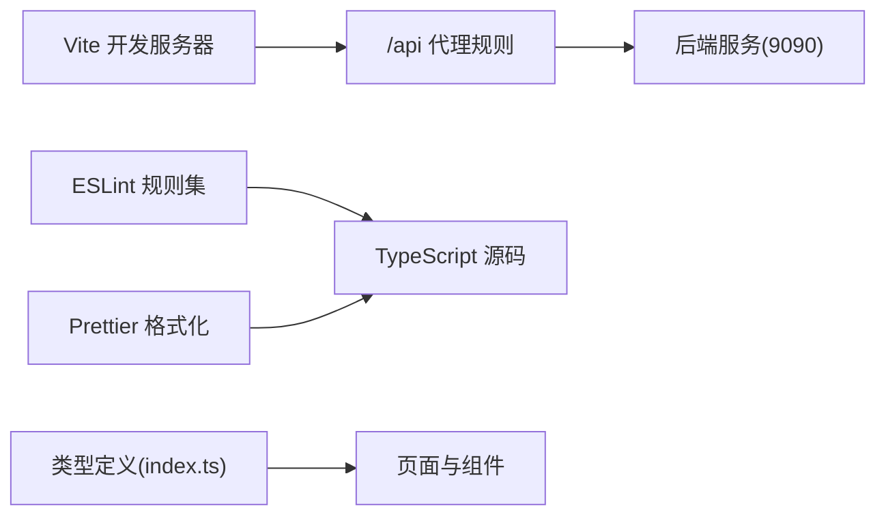
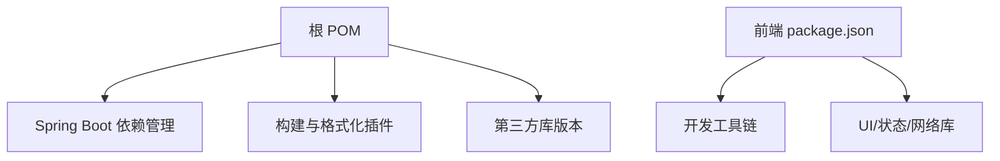

# 开发指南

<cite>
**本文引用的文件**
- [pom.xml](file://pom.xml)
- [lombok.config](file://lombok.config)
- [.gitignore](file://.gitignore)
- [docs/quick-start.md](file://docs/quick-start.md)
- [frontend/package.json](file://frontend/package.json)
- [frontend/vite.config.js](file://frontend/vite.config.js)
- [frontend/.eslintrc.cjs](file://frontend/.eslintrc.cjs)
- [frontend/.prettierrc](file://frontend/.prettierrc)
- [frontend/tailwind.config.cjs](file://frontend/tailwind.config.cjs)
- [frontend/tsconfig.json](file://frontend/tsconfig.json)
- [frontend/postcss.config.cjs](file://frontend/postcss.config.cjs)
- [frontend/TESTING.md](file://frontend/TESTING.md)
- [frontend/src/types/index.ts](file://frontend/src/types/index.ts)
- [seahorse-agent-kernel/src/main/java/com/miracle/ai/seahorse/agent/kernel/application/chat/KernelChatInboundService.java](file://seahorse-agent-kernel/src/main/java/com/miracle/ai/seahorse/agent/kernel/application/chat/KernelChatInboundService.java)
- [seahorse-agent-adapter-web/src/main/java/com/miracle/ai/seahorse/agent/adapters/web/SeahorseChatController.java](file://seahorse-agent-adapter-web/src/main/java/com/miracle/ai/seahorse/agent/adapters/web/SeahorseChatController.java)
- [resources/format/copyright.txt](file://resources/format/copyright.txt)
</cite>

## 目录
1. [简介](#简介)
2. [项目结构](#项目结构)
3. [核心组件](#核心组件)
4. [架构总览](#架构总览)
5. [详细组件分析](#详细组件分析)
6. [依赖分析](#依赖分析)
7. [性能考虑](#性能考虑)
8. [故障排查指南](#故障排查指南)
9. [结论](#结论)
10. [附录](#附录)

## 简介
本开发指南面向 Seahorse Agent 项目的核心开发者与贡献者，覆盖开发环境准备、IDE 设置、代码格式化、Git 配置、工具链、代码规范与最佳实践、新功能开发流程、代码审查标准、分支与版本控制策略、调试与性能优化、以及贡献指南。内容基于仓库现有配置与文档提炼，确保新成员能快速上手并保持一致的工程实践。

## 项目结构
Seahorse Agent 采用多模块 Maven 聚合工程组织，后端以 Spring Boot 为核心，前端基于 Vite + React + TypeScript 技术栈，配合 TailwindCSS、ESLint、Prettier 等工具链。根目录包含统一的构建与格式化配置，frontend 子目录提供完整的前端工程与测试指引。

图示来源
- [pom.xml:37-60](file://pom.xml#L37-L60)
- [frontend/package.json:1-70](file://frontend/package.json#L1-L70)

章节来源
- [pom.xml:1-262](file://pom.xml#L1-L262)
- [frontend/package.json:1-70](file://frontend/package.json#L1-L70)

## 核心组件
- 后端核心
  - Kernel：领域与应用层，负责聊天、检索、记忆、意图、知识库等核心业务编排。
  - Web 适配器：REST/SSE 接口，封装入站命令与回调工厂，提供 /rag/v3/chat 等端点。
- 前端
  - Vite + React + TypeScript，TailwindCSS 样式体系，ESLint + Prettier 规范化。
  - 提供聊天、会话、知识库、管理后台等页面与服务层封装。
- 构建与格式化
  - Maven Spotless 插件加载统一版权头，Java 版本与编译参数由根 POM 统一管理。
  - Lombok 配置避免覆盖率统计误判，增强 equals/hashCode 行为。

章节来源
- [seahorse-agent-kernel/src/main/java/com/miracle/ai/seahorse/agent/kernel/application/chat/KernelChatInboundService.java:1-94](file://seahorse-agent-kernel/src/main/java/com/miracle/ai/seahorse/agent/kernel/application/chat/KernelChatInboundService.java#L1-L94)
- [seahorse-agent-adapter-web/src/main/java/com/miracle/ai/seahorse/agent/adapters/web/SeahorseChatController.java:1-133](file://seahorse-agent-adapter-web/src/main/java/com/miracle/ai/seahorse/agent/adapters/web/SeahorseChatController.java#L1-L133)
- [pom.xml:15-35](file://pom.xml#L15-L35)
- [pom.xml:238-258](file://pom.xml#L238-L258)
- [lombok.config:1-10](file://lombok.config#L1-L10)

## 架构总览
后端通过 Web 适配器接收请求，封装为 Kernel 的入站命令，交由 KernelChatInboundService 执行聊天流水线，期间记录 RAG Trace 并通过 StreamTaskPort 管理任务生命周期。前端通过 Vite 代理将 /api 请求转发至后端，默认端口 9090，本地开发时需确保后端服务运行。

图示来源
- [seahorse-agent-adapter-web/src/main/java/com/miracle/ai/seahorse/agent/adapters/web/SeahorseChatController.java:83-109](file://seahorse-agent-adapter-web/src/main/java/com/miracle/ai/seahorse/agent/adapters/web/SeahorseChatController.java#L83-L109)
- [seahorse-agent-kernel/src/main/java/com/miracle/ai/seahorse/agent/kernel/application/chat/KernelChatInboundService.java:56-78](file://seahorse-agent-kernel/src/main/java/com/miracle/ai/seahorse/agent/kernel/application/chat/KernelChatInboundService.java#L56-L78)

章节来源
- [docs/quick-start.md:70-82](file://docs/quick-start.md#L70-L82)
- [frontend/vite.config.js:11-20](file://frontend/vite.config.js#L11-L20)

## 详细组件分析

### 后端 Web 控制器（SeahorseChatController）
- 责任边界
  - 将 HTTP 请求转换为 Kernel 的 StreamChatCommand。
  - 管理 SSE 超时、速率限制、任务注册与取消。
- 关键行为
  - GET /rag/v3/chat：创建任务、建立 SSE、调用 Kernel 入站服务。
  - POST /rag/v3/stop：停止指定任务并注销。
- 安全与健壮性
  - 参数校验与默认值处理（如 userId、conversationId）。
  - 速率限制决策失败时抛出明确异常。

图示来源
- [seahorse-agent-adapter-web/src/main/java/com/miracle/ai/seahorse/agent/adapters/web/SeahorseChatController.java:43-81](file://seahorse-agent-adapter-web/src/main/java/com/miracle/ai/seahorse/agent/adapters/web/SeahorseChatController.java#L43-L81)

章节来源
- [seahorse-agent-adapter-web/src/main/java/com/miracle/ai/seahorse/agent/adapters/web/SeahorseChatController.java:83-133](file://seahorse-agent-adapter-web/src/main/java/com/miracle/ai/seahorse/agent/adapters/web/SeahorseChatController.java#L83-L133)

### Kernel 聊天入站服务（KernelChatInboundService）
- 责任边界
  - 将外部命令包装为内部上下文，驱动 KernelChatPipeline 执行。
  - 统一开启/结束 Trace Run，异常时记录错误并回调。
- 处理逻辑
  - 校验非空参数，启动 Trace，执行流水线，最终完成 Trace 或在异常时标记错误。

图示来源
- [seahorse-agent-kernel/src/main/java/com/miracle/ai/seahorse/agent/kernel/application/chat/KernelChatInboundService.java:56-78](file://seahorse-agent-kernel/src/main/java/com/miracle/ai/seahorse/agent/kernel/application/chat/KernelChatInboundService.java#L56-L78)

章节来源
- [seahorse-agent-kernel/src/main/java/com/miracle/ai/seahorse/agent/kernel/application/chat/KernelChatInboundService.java:34-94](file://seahorse-agent-kernel/src/main/java/com/miracle/ai/seahorse/agent/kernel/application/chat/KernelChatInboundService.java#L34-L94)

### 前端工程与类型系统
- 工具链
  - Vite 代理将 /api 转发至后端，默认目标地址与端口在配置中声明。
  - ESLint + Prettier 保证代码风格一致性，TS 类型严格约束。
- 类型与接口
  - 用户、会话、消息、反馈、流式元数据等核心类型集中定义，便于前后端契约对齐。

图示来源
- [frontend/vite.config.js:11-20](file://frontend/vite.config.js#L11-L20)
- [frontend/.eslintrc.cjs:1-27](file://frontend/.eslintrc.cjs#L1-L27)
- [frontend/.prettierrc:1-8](file://frontend/.prettierrc#L1-L8)
- [frontend/src/types/index.ts:1-50](file://frontend/src/types/index.ts#L1-L50)

章节来源
- [frontend/package.json:6-12](file://frontend/package.json#L6-L12)
- [frontend/TESTING.md:1-112](file://frontend/TESTING.md#L1-L112)

## 依赖分析
- 版本与依赖管理
  - Spring Boot 3.5.7、Java 17、MyBatis Plus、Milvus、Pulsar、S3、OkHttp、Sa-Token、Redisson 等由根 POM 的 dependencyManagement 统一管理。
- 构建插件
  - maven-compiler-plugin、maven-surefire-plugin、spotless-maven-plugin 等按属性统一版本。
- 前端依赖
  - React、Zustand、Axios、TailwindCSS、Recharts、Radix UI 等，开发脚本提供 lint 与 format。

图示来源
- [pom.xml:62-165](file://pom.xml#L62-L165)
- [pom.xml:185-260](file://pom.xml#L185-L260)
- [frontend/package.json:13-68](file://frontend/package.json#L13-L68)

章节来源
- [pom.xml:15-35](file://pom.xml#L15-L35)
- [frontend/package.json:1-70](file://frontend/package.json#L1-70)

## 性能考虑
- 性能门禁与回归对比
  - 通过脚本对比不同阶段的 RAG 性能报告，设定最大回归阈值，确保演进过程中的稳定性。
- SSE 超时与速率限制
  - Web 控制器提供 SSE 超时配置与每用户窗口内请求数限制，避免资源滥用。
- 代码质量与格式化
  - Spotless 自动注入版权头，统一风格，减少评审成本。

章节来源
- [docs/quick-start.md:51-55](file://docs/quick-start.md#L51-L55)
- [seahorse-agent-adapter-web/src/main/java/com/miracle/ai/seahorse/agent/adapters/web/SeahorseChatController.java:69-81](file://seahorse-agent-adapter-web/src/main/java/com/miracle/ai/seahorse/agent/adapters/web/SeahorseChatController.java#L69-L81)
- [pom.xml:238-258](file://pom.xml#L238-L258)

## 故障排查指南
- 前端静态资源 404
  - 症状：浏览器提示 “No static resource”。
  - 原因：Vite 代理未生效或后端未运行。
  - 处理：确认 vite.config.ts 代理配置、重启开发服务器、确保后端监听端口可达。
- 登录与鉴权
  - 后端返回 401 为预期行为，需先登录获取 token。
- 端口冲突
  - Vite 自动尝试下一个可用端口，若仍异常，检查占用进程并释放。
- 管理员账号创建
  - 可通过 SQL 将用户角色设为 admin，以便访问管理后台。

章节来源
- [frontend/TESTING.md:3-112](file://frontend/TESTING.md#L3-L112)
- [frontend/vite.config.js:11-20](file://frontend/vite.config.js#L11-L20)

## 结论
本指南基于仓库现有配置与文档，给出了从环境准备到日常开发、测试、审查与维护的全流程建议。遵循统一的工具链与代码规范，有助于提升协作效率与系统稳定性。

## 附录

### 开发环境与 IDE 设置
- JDK 与构建
  - 使用 Java 17，Maven 3.6+，推荐在 IDE 中启用“Import Maven Projects Automatically”。
- Lombok 支持
  - 启用注解处理，避免覆盖率误判，保持 equals/hashCode 的合理行为。
- 前端开发
  - 安装 Node.js 18+，执行 npm install，使用 VS Code 并安装 ESLint、Prettier、TailwindCSS 插件。
- Git 与忽略规则
  - 使用 .gitignore 忽略构建产物与 IDE 临时文件，避免污染仓库。

章节来源
- [pom.xml:19,32](file://pom.xml#L19,L32)
- [lombok.config:1-10](file://lombok.config#L1-L10)
- [.gitignore:1-46](file://.gitignore#L1-L46)

### 代码规范与最佳实践
- Java 规范
  - 统一版权头由 Spotless 注入，使用 Lombok 减少样板代码，保持 equals/hashCode 行为稳定。
- TypeScript/React 规范
  - ESLint 规则集包含推荐配置与 React Hooks、React Refresh 插件，Prettier 统一格式。
  - TailwindCSS 与 PostCSS 配置集中管理，类型定义位于 src/types/index.ts。
- 命名约定
  - Java 包名遵循 com.miracle.ai.seahorse.agent 命名空间；前端使用相对路径别名 @ 指向 src。
- 注释规范
  - 采用统一版权头模板，类与方法注释清晰描述职责与异常处理。

章节来源
- [pom.xml:238-258](file://pom.xml#L238-L258)
- [resources/format/copyright.txt:1-18](file://resources/format/copyright.txt#L1-L18)
- [frontend/.eslintrc.cjs:1-27](file://frontend/.eslintrc.cjs#L1-L27)
- [frontend/.prettierrc:1-8](file://frontend/.prettierrc#L1-L8)
- [frontend/tailwind.config.cjs:1-83](file://frontend/tailwind.config.cjs#L1-L83)
- [frontend/postcss.config.cjs:1-7](file://frontend/postcss.config.cjs#L1-L7)
- [frontend/tsconfig.json:1-8](file://frontend/tsconfig.json#L1-L8)
- [frontend/src/types/index.ts:1-50](file://frontend/src/types/index.ts#L1-L50)

### 新功能开发流程
- 需求分析与设计
  - 明确领域边界与端口契约，必要时更新 Kernel 与适配器。
- 实现与测试
  - 后端：在 kernel 与适配器模块中实现，补充单元测试与集成测试。
  - 前端：完善类型定义与页面组件，确保 API 代理正确。
- 本地验证
  - 使用 quick-start 指南启动 bootstrap 模块，验证核心路径。
- 提交与审查
  - 提交前执行 lint、format、test，确保性能门禁不超阈值。

章节来源
- [docs/quick-start.md:1-88](file://docs/quick-start.md#L1-L88)
- [frontend/TESTING.md:1-112](file://frontend/TESTING.md#L1-L112)

### 代码审查标准与流程
- 审查清单
  - 是否满足需求与设计文档；是否引入不必要的依赖；是否通过 lint/format；是否覆盖关键路径；是否影响性能。
- 质量标准
  - 统一版权头、类型安全、异常处理、日志与 Trace 记录、SSE 超时与速率限制配置。
- 反馈机制
  - 通过 PR 评论与修订，确保所有审查意见闭环。

章节来源
- [pom.xml:238-258](file://pom.xml#L238-L258)
- [seahorse-agent-adapter-web/src/main/java/com/miracle/ai/seahorse/agent/adapters/web/SeahorseChatController.java:125-131](file://seahorse-agent-adapter-web/src/main/java/com/miracle/ai/seahorse/agent/adapters/web/SeahorseChatController.java#L125-L131)

### 分支管理与版本控制策略
- 工作流
  - 建议采用 Feature 分支开发，主分支仅接受通过 CI 的 PR 合并。
- 分支命名
  - feature/xxx、fix/xxx、docs/xxx、chore/xxx 等，语义化命名。
- 合并策略
  - Rebase 优先，保持线性历史；合并前确保通过测试与审查。

[本节为通用实践建议，不直接分析具体文件，故无章节来源]

### 调试技巧与性能优化
- 调试
  - 后端：启用断点、观察 Trace Run 生命周期；前端：利用浏览器 Network 面板与 Console 定位问题。
- 性能
  - 使用性能门禁脚本对比不同阶段结果，识别回归；优化 SSE 超时与速率限制参数；减少不必要的对象创建与 IO。

章节来源
- [docs/quick-start.md:51-55](file://docs/quick-start.md#L51-L55)
- [seahorse-agent-adapter-web/src/main/java/com/miracle/ai/seahorse/agent/adapters/web/SeahorseChatController.java:69-81](file://seahorse-agent-adapter-web/src/main/java/com/miracle/ai/seahorse/agent/adapters/web/SeahorseChatController.java#L69-L81)

### 贡献指南
- 参与开源贡献
  - Fork 仓库、创建特性分支、提交 PR、回应审查意见。
- 提交规范
  - 提交信息清晰描述变更目的与影响范围；附带必要的测试与文档更新。
- 社区交流
  - 通过 Issue/PR 讨论设计与实现细节，保持开放与尊重。

[本节为通用实践建议，不直接分析具体文件，故无章节来源]