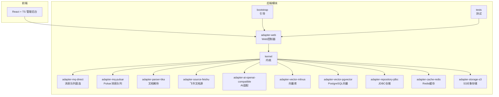
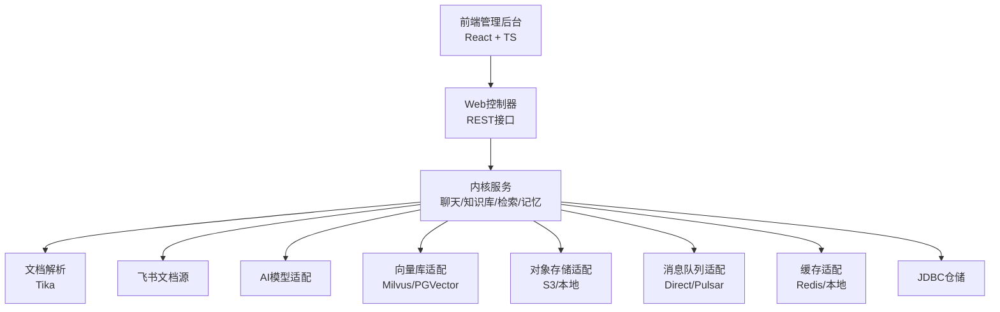
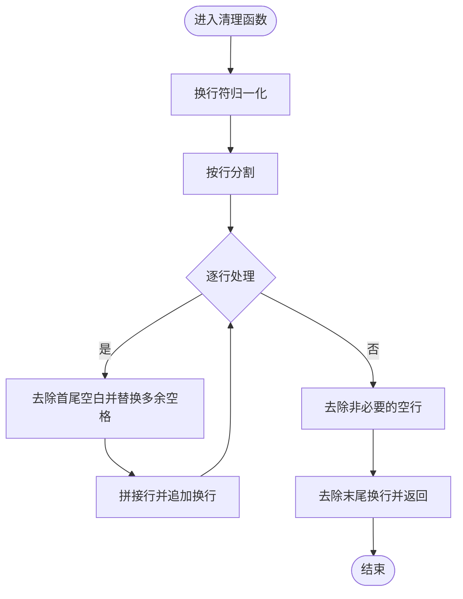
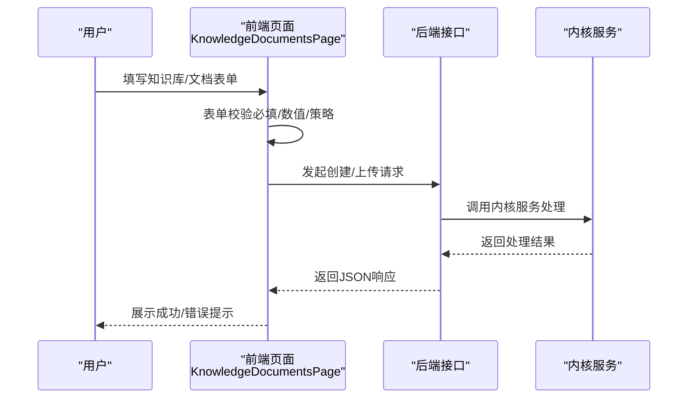
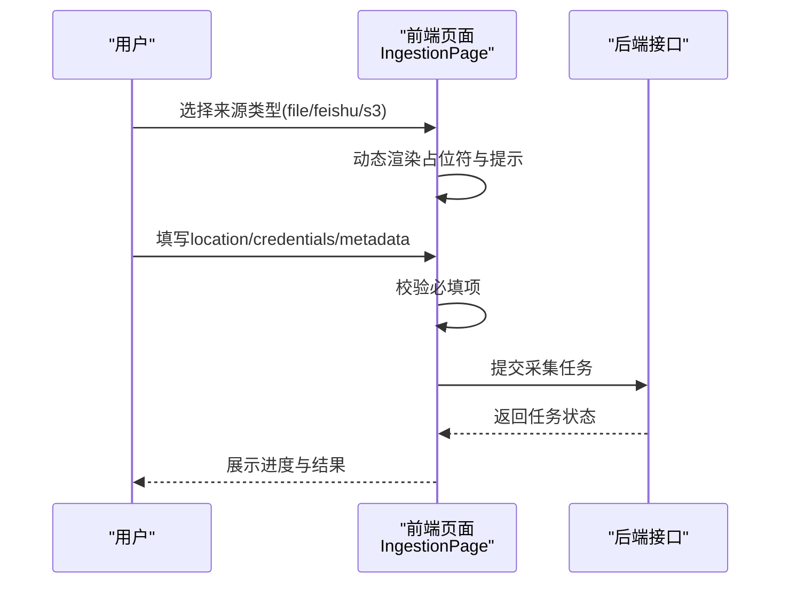
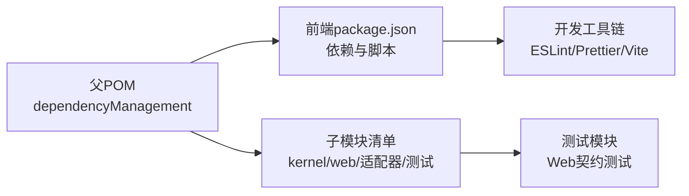

# 贡献指南

<cite>
**本文引用的文件**
- [pom.xml](file://pom.xml)
- [LICENSE](file://LICENSE)
- [resources/format/copyright.txt](file://resources/format/copyright.txt)
- [frontend/package.json](file://frontend/package.json)
- [frontend/TESTING.md](file://frontend/TESTING.md)
- [.gitignore](file://.gitignore)
- [resources/docker/lightweight/README.md](file://resources/docker/lightweight/README.md)
- [seahorse-agent-adapter-parser-tika/src/main/java/com/miracle/ai/seahorse/agent/adapters/parser/tika/TikaDocumentParserAdapter.java](file://seahorse-agent-adapter-parser-tika/src/main/java/com/miracle/ai/seahorse/agent/adapters/parser/tika/TikaDocumentParserAdapter.java)
- [frontend/src/pages/admin/knowledge/KnowledgeDocumentsPage.tsx](file://frontend/src/pages/admin/knowledge/KnowledgeDocumentsPage.tsx)
- [frontend/src/pages/admin/ingestion/IngestionPage.tsx](file://frontend/src/pages/admin/ingestion/IngestionPage.tsx)
- [seahorse-agent-mcp-server/src/main/java/com/miracle/ai/seahorse/agent/adapters/mcp/server/executor/TicketMCPExecutor.java](file://seahorse-agent-mcp-server/src/main/java/com/miracle/ai/seahorse/agent/adapters/mcp/server/executor/TicketMCPExecutor.java)
- [seahorse-agent-tests/src/test/java/com/miracle/ai/seahorse/agent/adapters/web/SeahorseWebApiContractTests.java](file://seahorse-agent-tests/src/test/java/com/miracle/ai/seahorse/agent/adapters/web/SeahorseWebApiContractTests.java)
</cite>

## 目录
1. [简介](#简介)
2. [项目结构](#项目结构)
3. [核心组件](#核心组件)
4. [架构总览](#架构总览)
5. [详细组件分析](#详细组件分析)
6. [依赖关系分析](#依赖关系分析)
7. [性能考虑](#性能考虑)
8. [故障排查指南](#故障排查指南)
9. [结论](#结论)
10. [附录](#附录)

## 简介
本指南面向希望参与 Seahorse Agent 项目的开源贡献者，覆盖从 Fork 项目、创建分支、提交代码、发起 Pull Request 的完整流程；涵盖代码贡献、文档改进、问题报告、功能建议等多种参与方式；明确社区行为准则与沟通规范、代码审查流程；介绍项目治理结构与决策机制；提供贡献者入门指南（开发环境搭建、代码规范、测试要求）；说明知识产权与许可证要求；并列出社区资源与支持渠道及贡献者认可与激励机制。

## 项目结构
Seahorse Agent 是一个多模块 Maven 聚合工程，采用前后端分离架构：
- 后端：基于 Spring Boot 的微服务模块集合，包含内核、适配器、Web 控制器、MCP 服务、测试模块等。
- 前端：基于 React + TypeScript 的管理后台，提供知识库、文档、会话、仪表盘等管理界面。
- 文档与示例：位于 docs 与 resources/docs 目录，包含快速开始、示例与性能对比文档。
- 轻量级部署：提供 Docker Compose 方案，便于在资源受限环境下进行本地开发与体验。

图表来源
- [pom.xml:37-60](file://pom.xml#L37-L60)

章节来源
- [pom.xml:1-262](file://pom.xml#L1-L262)

## 核心组件
- 内核模块：负责聊天、知识库、意图树、检索、记忆、仪表盘、采样问题、追踪等核心业务逻辑。
- 适配器模块：提供对外部系统的适配能力，如 AI 模型、消息队列、向量库、对象存储、Feishu 文档源、Web 控制器等。
- Web 控制器：封装 REST 接口，统一鉴权、参数校验与响应。
- 前端管理后台：提供知识库、文档、会话、仪表盘等管理界面，支持代理转发与登录态校验。
- 轻量级部署：提供 Docker Compose 配置，便于在资源受限环境下快速启动。

章节来源
- [pom.xml:37-60](file://pom.xml#L37-L60)
- [frontend/TESTING.md:1-112](file://frontend/TESTING.md#L1-L112)

## 架构总览
下图展示了前端与后端的交互关系以及关键模块间的依赖：

图表来源
- [pom.xml:37-60](file://pom.xml#L37-L60)
- [frontend/TESTING.md:1-112](file://frontend/TESTING.md#L1-L112)

## 详细组件分析

### 组件A：文档解析与清洗（Tika）
- 功能概述：识别纯文本与常见格式，进行换行归一化、多余空白清理等预处理，提升后续嵌入质量。
- 关键点：根据 MIME 类型与文件名判断是否为纯文本；对换行符进行统一处理；去除多余空行。
- 复杂度：线性时间复杂度，与输入文本长度成正比；空间复杂度与输出长度相关。

图表来源
- [seahorse-agent-adapter-parser-tika/src/main/java/com/miracle/ai/seahorse/agent/adapters/parser/tika/TikaDocumentParserAdapter.java:70-79](file://seahorse-agent-adapter-parser-tika/src/main/java/com/miracle/ai/seahorse/agent/adapters/parser/tika/TikaDocumentParserAdapter.java#L70-L79)

章节来源
- [seahorse-agent-adapter-parser-tika/src/main/java/com/miracle/ai/seahorse/agent/adapters/parser/tika/TikaDocumentParserAdapter.java:61-79](file://seahorse-agent-adapter-parser-tika/src/main/java/com/miracle/ai/seahorse/agent/adapters/parser/tika/TikaDocumentParserAdapter.java#L61-L79)

### 组件B：前端知识库与文档管理（表单校验与上传）
- 功能概述：提供知识库创建、文档上传、分块策略配置、定时刷新等管理能力；前端通过表单校验保障必填项与数值合法性。
- 关键点：表单校验包含必填字段、数值类型、分块策略选择与参数校验；上传对话框支持本地文件与多种来源类型。
- 交互流程：用户填写表单 -> 前端校验 -> 提交请求 -> 后端处理 -> 返回结果。

图表来源
- [frontend/src/pages/admin/knowledge/KnowledgeDocumentsPage.tsx:984-1028](file://frontend/src/pages/admin/knowledge/KnowledgeDocumentsPage.tsx#L984-L1028)
- [frontend/src/pages/admin/knowledge/KnowledgeDocumentsPage.tsx:1577-1607](file://frontend/src/pages/admin/knowledge/KnowledgeDocumentsPage.tsx#L1577-L1607)

章节来源
- [frontend/src/pages/admin/knowledge/KnowledgeDocumentsPage.tsx:984-1028](file://frontend/src/pages/admin/knowledge/KnowledgeDocumentsPage.tsx#L984-L1028)
- [frontend/src/pages/admin/knowledge/KnowledgeDocumentsPage.tsx:1577-1607](file://frontend/src/pages/admin/knowledge/KnowledgeDocumentsPage.tsx#L1577-L1607)

### 组件C：前端文档采集任务（来源类型与凭据）
- 功能概述：支持本地文件、飞书文档、S3 等多种来源；根据来源类型动态展示占位符与提示信息。
- 关键点：根据 sourceType 切换 location 与 credentials 的提示文案；对必填项进行校验。
- 交互流程：选择来源类型 -> 显示对应输入项 -> 用户填写 -> 校验通过 -> 提交任务。

图表来源
- [frontend/src/pages/admin/ingestion/IngestionPage.tsx:1834-1871](file://frontend/src/pages/admin/ingestion/IngestionPage.tsx#L1834-L1871)

章节来源
- [frontend/src/pages/admin/ingestion/IngestionPage.tsx:1834-1871](file://frontend/src/pages/admin/ingestion/IngestionPage.tsx#L1834-L1871)

### 组件D：MCP 示例执行器（模板与数据）
- 功能概述：演示 MCP（Model Context Protocol）执行器的数据组织与模板使用，便于扩展外部工具或工作流。
- 关键点：区域与工程师映射、问题模板列表等数据结构，便于快速生成示例数据。
- 适用场景：作为 MCP 工具注册与调度的参考实现。

章节来源
- [seahorse-agent-mcp-server/src/main/java/com/miracle/ai/seahorse/agent/adapters/mcp/server/executor/TicketMCPExecutor.java:52-82](file://seahorse-agent-mcp-server/src/main/java/com/miracle/ai/seahorse/agent/adapters/mcp/server/executor/TicketMCPExecutor.java#L52-L82)

## 依赖关系分析
- 项目采用 Maven 多模块聚合管理，核心依赖集中在父 POM 的 dependencyManagement 中统一版本与范围。
- 前端使用 Vite + React + TypeScript，依赖 ESLint、Prettier、TailwindCSS 等工具链保证代码风格与质量。
- 测试模块包含 Web 接口契约测试，覆盖常见 HTTP 方法与断言。

图表来源
- [pom.xml:62-165](file://pom.xml#L62-L165)
- [frontend/package.json:1-70](file://frontend/package.json#L1-L70)
- [seahorse-agent-tests/src/test/java/com/miracle/ai/seahorse/agent/adapters/web/SeahorseWebApiContractTests.java:75-100](file://seahorse-agent-tests/src/test/java/com/miracle/ai/seahorse/agent/adapters/web/SeahorseWebApiContractTests.java#L75-L100)

章节来源
- [pom.xml:62-165](file://pom.xml#L62-L165)
- [frontend/package.json:1-70](file://frontend/package.json#L1-L70)
- [seahorse-agent-tests/src/test/java/com/miracle/ai/seahorse/agent/adapters/web/SeahorseWebApiContractTests.java:75-100](file://seahorse-agent-tests/src/test/java/com/miracle/ai/seahorse/agent/adapters/web/SeahorseWebApiContractTests.java#L75-L100)

## 性能考虑
- 轻量级部署：提供内存限制的 Docker Compose 配置，适合本地开发与体验；生产环境请使用默认配置。
- 文档解析：对换行与空白进行归一化处理，减少噪声，提高嵌入与检索效率。
- 前端代理：开发环境通过 Vite 代理将 /api 请求转发至后端，避免跨域与静态资源问题。

章节来源
- [resources/docker/lightweight/README.md:1-38](file://resources/docker/lightweight/README.md#L1-L38)
- [frontend/TESTING.md:1-112](file://frontend/TESTING.md#L1-L112)
- [seahorse-agent-adapter-parser-tika/src/main/java/com/miracle/ai/seahorse/agent/adapters/parser/tika/TikaDocumentParserAdapter.java:70-79](file://seahorse-agent-adapter-parser-tika/src/main/java/com/miracle/ai/seahorse/agent/adapters/parser/tika/TikaDocumentParserAdapter.java#L70-L79)

## 故障排查指南
- 前端静态资源 404：确认代理配置已添加并重启开发服务器；确保后端服务已启动且可访问。
- 登录态问题：前端返回 401 为正常，需先登录获取 token。
- 端口占用：Vite 会自动尝试下一个可用端口；若代理不生效，需重启开发服务器。
- 数据库初始化：可通过 SQL 文件初始化 schema 与基础数据；管理员账号可通过更新用户角色字段为 admin 进行测试。

章节来源
- [frontend/TESTING.md:1-112](file://frontend/TESTING.md#L1-L112)
- [.gitignore:41-45](file://.gitignore#L41-L45)

## 结论
本指南提供了参与 Seahorse Agent 项目贡献的全流程与最佳实践，涵盖开发环境、代码规范、测试要求、知识产权与许可证、社区沟通与治理等内容。建议贡献者在提交 PR 前完成本地测试与代码风格检查，并遵循社区行为准则与审查流程。

## 附录

### 贡献流程（Fork → 分支 → 提交 → PR）
- Fork 仓库至个人账户
- 创建功能分支（建议使用 feat/、fix/、docs/ 前缀）
- 提交代码并通过本地测试与代码风格检查
- 发起 Pull Request，填写变更说明与关联 Issue
- 等待代码审查与合并

### 贡献类型
- 代码贡献：修复缺陷、新增功能、优化性能与稳定性
- 文档改进：补充使用说明、最佳实践、FAQ
- 问题报告：提供清晰的复现步骤、日志与环境信息
- 功能建议：描述背景、目标与可行性分析

### 社区行为准则与沟通规范
- 尊重与包容：保持礼貌与专业，避免人身攻击
- 透明沟通：在 Issue 与 PR 中提供充分上下文与证据
- 代码审查：积极反馈、聚焦问题与改进建议
- 版本与发布：遵循语义化版本与发布说明

### 项目治理与决策机制
- 维护者职责：代码审查、问题分类、版本发布、社区协调
- 决策流程：重大变更通过 Issue 讨论与 PR 审查，必要时由维护者投票决定
- 版本发布：依据里程碑与质量门禁进行发布

### 贡献者入门指南
- 开发环境：安装 JDK 17+、Node.js、Maven；拉取代码后构建后端与前端
- 代码规范：遵循 Spotless 插件格式化规则与 ESLint/Prettier 规则
- 测试要求：单元测试与契约测试通过；前端代理配置正确后进行端到端验证

章节来源
- [pom.xml:242-258](file://pom.xml#L242-L258)
- [frontend/package.json:6-12](file://frontend/package.json#L6-L12)
- [frontend/TESTING.md:1-112](file://frontend/TESTING.md#L1-L112)

### 知识产权与许可证
- 许可证：采用 Apache License 2.0，允许商用与再分发，需保留版权声明与 NOTICE
- 贡献声明：贡献代码即表示同意以相同许可证发布，遵守“提交贡献”条款

章节来源
- [LICENSE:1-202](file://LICENSE#L1-L202)
- [resources/format/copyright.txt:1-18](file://resources/format/copyright.txt#L1-L18)

### 社区资源与支持渠道
- 讨论与反馈：通过 Issue 与 Discussion 进行问题与建议
- 技术支持：参考快速开始与示例文档；使用轻量级部署方案进行本地验证
- 贡献者认可：在贡献记录中登记贡献者信息，定期发布贡献者名单与致谢

章节来源
- [resources/docker/lightweight/README.md:1-38](file://resources/docker/lightweight/README.md#L1-L38)
- [frontend/TESTING.md:1-112](file://frontend/TESTING.md#L1-L112)