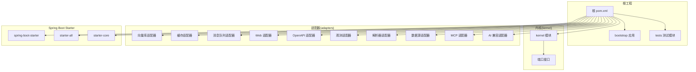
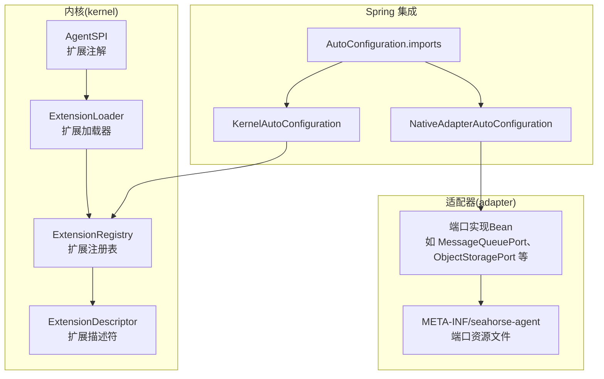
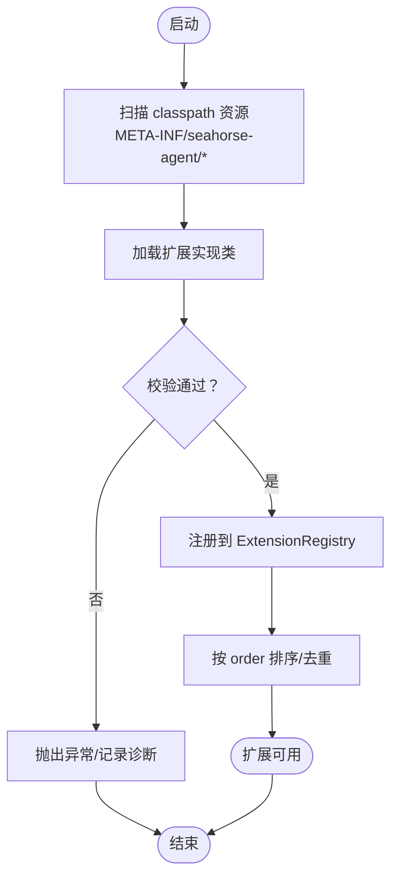
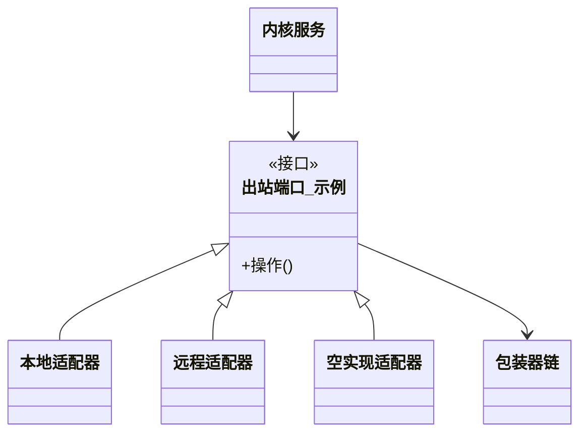
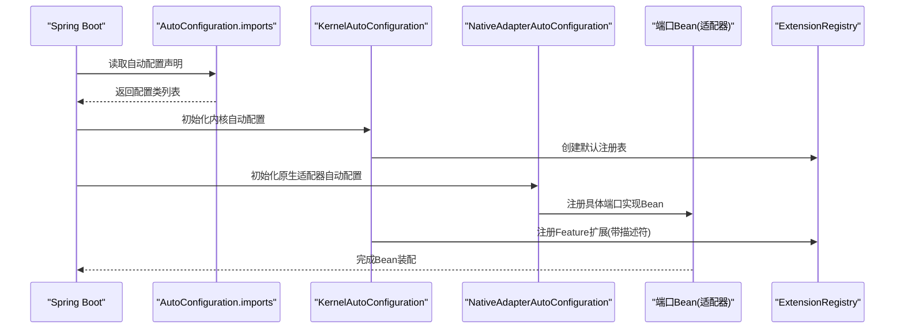
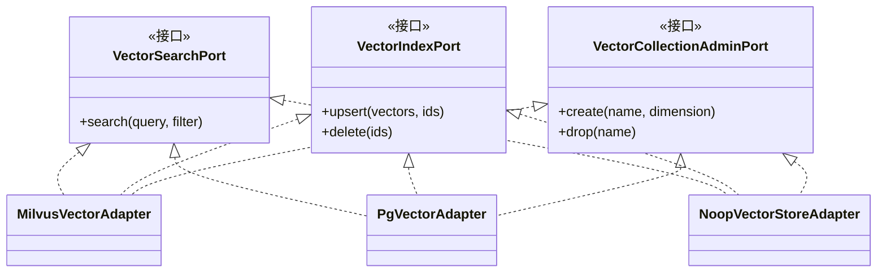
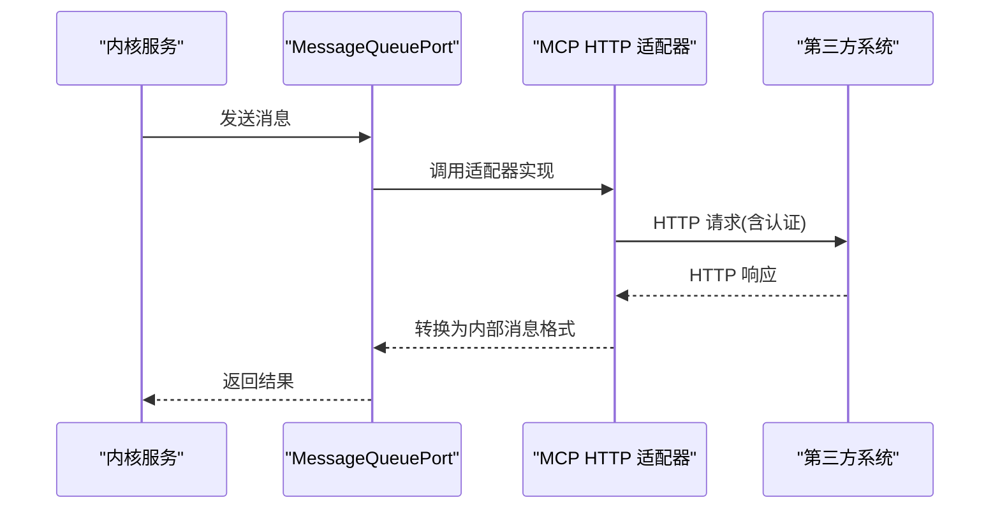
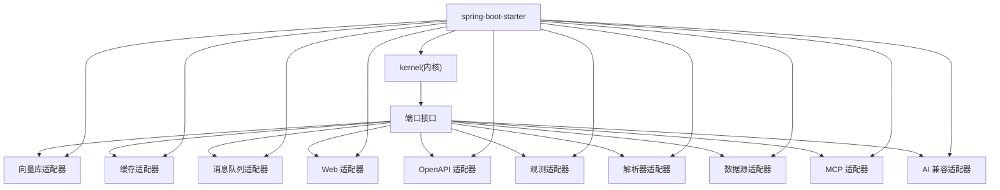

# 扩展开发

<cite>
**本文引用的文件**
- [pom.xml](file://pom.xml)
- [mvnw.cmd](file://mvnw.cmd)
- [docs/zh/content/后端系统/插件系统/扩展加载机制.md](file://docs/zh/content/后端系统/插件系统/扩展加载机制.md)
- [docs/zh/content/后端系统/核心内核/插件系统/加载机制.md](file://docs/zh/content/后端系统/核心内核/插件系统/加载机制.md)
- [docs/zh/content/后端系统/核心内核/端口接口/端口接口.md](file://docs/zh/content/后端系统/核心内核/端口接口/端口接口.md)
- [docs/zh/content/后端系统/核心内核/端口接口/出站端口/缓存出站端口.md](file://docs/zh/content/后端系统/核心内核/端口接口/出站端口/缓存出站端口.md)
- [docs/zh/content/架构设计/端口适配器模式.md](file://docs/zh/content/架构设计/端口适配器模式.md)
- [seahorse-agent-kernel/src/main/java/com/miracle/ai/seahorse/agent/kernel/plugin/AgentSPI.java](file://seahorse-agent-kernel/src/main/java/com/miracle/ai/seahorse/agent/kernel/plugin/AgentSPI.java)
- [seahorse-agent-spring-boot-starter/src/main/resources/META-INF/spring/org.springframework.boot.autoconfigure.AutoConfiguration.imports](file://seahorse-agent-spring-boot-starter/src/main/resources/META-INF/spring/org.springframework.boot.autoconfigure.AutoConfiguration.imports)
- [seahorse-agent-spring-boot-starter/src/main/java/com/miracle/ai/seahorse/agent/adapters/spring/SeahorseAgentKernelAutoConfiguration.java](file://seahorse-agent-spring-boot-starter/src/main/java/com/miracle/ai/seahorse/agent/adapters/spring/SeahorseAgentKernelAutoConfiguration.java)
- [seahorse-agent-spring-boot-starter/src/main/java/com/miracle/ai/seahorse/agent/adapters/spring/SeahorseAgentNativeAdapterAutoConfiguration.java](file://seahorse-agent-spring-boot-starter/src/main/java/com/miracle/ai/seahorse/agent/adapters/spring/SeahorseAgentNativeAdapterAutoConfiguration.java)
- [seahorse-agent-adapter-cache-local/src/main/resources/META-INF/seahorse-agent/com.miracle.ai.seahorse.agent.ports.outbound.cache.KeyValueCachePort](file://seahorse-agent-adapter-cache-local/src/main/resources/META-INF/seahorse-agent/com.miracle.ai.seahorse.agent.ports.outbound.cache.KeyValueCachePort)
- [seahorse-agent-adapter-cache-redis/src/main/resources/META-INF/seahorse-agent/com.miracle.ai.seahorse.agent.ports.outbound.cache.KeyValueCachePort](file://seahorse-agent-adapter-cache-redis/src/main/resources/META-INF/seahorse-agent/com.miracle.ai.seahorse.agent.ports.outbound.cache.KeyValueCachePort)
- [seahorse-agent-adapter-vector-milvus/pom.xml](file://seahorse-agent-adapter-vector-milvus/pom.xml)
- [seahorse-agent-adapter-vector-pgvector/pom.xml](file://seahorse-agent-adapter-vector-pgvector/pom.xml)
- [seahorse-agent-adapter-vector-noop/pom.xml](file://seahorse-agent-adapter-vector-noop/pom.xml)
- [seahorse-agent-adapter-vector-milvus/src/main/java/com/miracle/ai/seahorse/agent/adapters/vector/milvus/MilvusVectorAdapter.java](file://seahorse-agent-adapter-vector-milvus/src/main/java/com/miracle/ai/seahorse/agent/adapters/vector/milvus/MilvusVectorAdapter.java)
- [seahorse-agent-adapter-vector-pgvector/src/main/java/com/miracle/ai/seahorse/agent/adapters/vector/pgvector/PgVectorAdapter.java](file://seahorse-agent-adapter-vector-pgvector/src/main/java/com/miracle/ai/seahorse/agent/adapters/vector/pgvector/PgVectorAdapter.java)
- [seahorse-agent-adapter-vector-noop/src/main/java/com/miracle/ai/seahorse/agent/adapters/vector/noop/NoopVectorStoreAdapter.java](file://seahorse-agent-adapter-vector-noop/src/main/java/com/miracle/ai/seahorse/agent/adapters/vector/noop/NoopVectorStoreAdapter.java)
- [seahorse-agent-adapter-vector-milvus/src/test/java/com/miracle/ai/seahorse/agent/adapters/vector/milvus/MilvusVectorAdapterTests.java](file://seahorse-agent-adapter-vector-milvus/src/test/java/com/miracle/ai/seahorse/agent/adapters/vector/milvus/MilvusVectorAdapterTests.java)
- [seahorse-agent-adapter-vector-pgvector/src/test/java/com/miracle/ai/seahorse/agent/adapters/vector/pgvector/PgVectorAdapterTests.java](file://seahorse-agent-adapter-vector-pgvector/src/test/java/com/miracle/ai/seahorse/agent/adapters/vector/pgvector/PgVectorAdapterTests.java)
- [seahorse-agent-adapter-vector-noop/src/test/java/com/miracle/ai/seahorse/agent/adapters/vector/noop/NoopVectorStoreAdapterTests.java](file://seahorse-agent-adapter-vector-noop/src/test/java/com/miracle/ai/seahorse/agent/adapters/vector/noop/NoopVectorStoreAdapterTests.java)
- [seahorse-agent-adapter-mcp-http/src/main/java/com/miracle/ai/seahorse/agent/adapters/mcp/http/McpHttpAutoConfiguration.java](file://seahorse-agent-adapter-mcp-http/src/main/java/com/miracle/ai/seahorse/agent/adapters/mcp/http/McpHttpAutoConfiguration.java)
- [seahorse-agent-adapter-mcp-http/src/main/resources/META-INF/seahorse-agent/com.miracle.ai.seahorse.agent.ports.outbound.mq.MessageQueuePort](file://seahorse-agent-adapter-mcp-http/src/main/resources/META-INF/seahorse-agent/com.miracle.ai.seahorse.agent.ports.outbound.mq.MessageQueuePort)
- [seahorse-agent-adapter-mcp-http/src/test/java/com/miracle/ai/seahorse/agent/adapters/mcp/http/McpHttpOAuthCredentialTests.java](file://seahorse-agent-adapter-mcp-http/src/test/java/com/miracle/ai/seahorse/agent/adapters/mcp/http/McpHttpOAuthCredentialTests.java)
- [seahorse-agent-adapter-openapi/src/main/java/com/miracle/ai/seahorse/agent/adapters/openapi/OpenApiSpecParserAdapter.java](file://seahorse-agent-adapter-openapi/src/main/java/com/miracle/ai/seahorse/agent/adapters/openapi/OpenApiSpecParserAdapter.java)
- [seahorse-agent-adapter-openapi/src/main/resources/META-INF/spring/org.springframework.boot.autoconfigure.AutoConfiguration.imports](file://seahorse-agent-adapter-openapi/src/main/resources/META-INF/spring/org.springframework.boot.autoconfigure.AutoConfiguration.imports)
- [seahorse-agent-adapter-openapi/src/test/java/com/miracle/ai/seahorse/agent/adapters/openapi/OpenApiSpecParserAdapterTests.java](file://seahorse-agent-adapter-openapi/src/test/java/com/miracle/ai/seahorse/agent/adapters/openapi/OpenApiSpecParserAdapterTests.java)
- [seahorse-agent-adapter-repository-jdbc/src/main/java/com/miracle/ai/seahorse/agent/adapters/repository/jdbc/JdbcAgentRunRepositoryAdapter.java](file://seahorse-agent-adapter-repository-jdbc/src/main/java/com/miracle/ai/seahorse/agent/adapters/repository/jdbc/JdbcAgentRunRepositoryAdapter.java)
- [seahorse-agent-adapter-repository-jdbc/src/main/resources/META-INF/seahorse-agent/com.miracle.ai.seahorse.agent.ports.outbound.repository.AgentRunRepositoryPort](file://seahorse-agent-adapter-repository-jdbc/src/main/resources/META-INF/seahorse-agent/com.miracle.ai.seahorse.agent.ports.outbound.repository.AgentRunRepositoryPort)
- [seahorse-agent-adapter-repository-jdbc/src/test/java/com/miracle/ai/seahorse/agent/adapters/repository/jdbc/JdbcAgentRunRepositoryAdapterTests.java](file://seahorse-agent-adapter-repository-jdbc/src/test/java/com/miracle/ai/seahorse/agent/adapters/repository/jdbc/JdbcAgentRunRepositoryAdapterTests.java)
- [seahorse-agent-adapter-storage-s3/src/main/java/com/miracle/ai/seahorse/agent/adapters/storage/s3/S3ObjectStorageAdapter.java](file://seahorse-agent-adapter-storage-s3/src/main/java/com/miracle/ai/seahorse/agent/adapters/storage/s3/S3ObjectStorageAdapter.java)
- [seahorse-agent-adapter-storage-s3/src/main/resources/META-INF/seahorse-agent/com.miracle.ai.seahorse.agent.ports.outbound.storage.ObjectStoragePort](file://seahorse-agent-adapter-storage-s3/src/main/resources/META-INF/seahorse-agent/com.miracle.ai.seahorse.agent.ports.outbound.storage.ObjectStoragePort)
- [seahorse-agent-adapter-storage-s3/src/test/java/com/miracle/ai/seahorse/agent/adapters/storage/s3/S3ObjectStorageAdapterTests.java](file://seahorse-agent-adapter-storage-s3/src/test/java/com/miracle/ai/seahorse/agent/adapters/storage/s3/S3ObjectStorageAdapterTests.java)
- [seahorse-agent-adapter-ai-openai-compatible/src/main/java/com/miracle/ai/seahorse/agent/adapters/ai/openai/OpenAiCompatibleModelAdapter.java](file://seahorse-agent-adapter-ai-openai-compatible/src/main/java/com/miracle/ai/seahorse/agent/adapters/ai/openai/OpenAiCompatibleModelAdapter.java)
- [seahorse-agent-adapter-ai-openai-compatible/src/main/java/com/miracle/ai/seahorse/agent/adapters/ai/openai/OpenAiCompatibleMemoryRefinerAdapter.java](file://seahorse-agent-adapter-ai-openai-compatible/src/main/java/com/miracle/ai/seahorse/agent/adapters/ai/openai/OpenAiCompatibleMemoryRefinerAdapter.java)
- [seahorse-agent-adapter-ai-openai-compatible/src/main/java/com/miracle/ai/seahorse/agent/adapters/ai/openai/OpenAiCompatibleMemoryCompactionSummarizerAdapter.java](file://seahorse-agent-adapter-ai-openai-compatible/src/main/java/com/miracle/ai/seahorse/agent/adapters/ai/openai/OpenAiCompatibleMemoryCompactionSummarizerAdapter.java)
- [seahorse-agent-adapter-ai-openai-compatible/src/main/java/com/miracle/ai/seahorse/agent/adapters/ai/openai/OpenAiCompatibleStreamingChatTools.java](file://seahorse-agent-adapter-ai-openai-compatible/src/main/java/com/miracle/ai/seahorse/agent/adapters/ai/openai/OpenAiCompatibleStreamingChatTools.java)
- [seahorse-agent-adapter-ai-openai-compatible/src/main/java/com/miracle/ai/seahorse/agent/adapters/ai/openai/OpenAiCompatibleMemoryRefinerAutoConfiguration.java](file://seahorse-agent-adapter-ai-openai-compatible/src/main/java/com/miracle/ai/seahorse/agent/adapters/ai/openai/OpenAiCompatibleMemoryRefinerAutoConfiguration.java)
- [seahorse-agent-adapter-ai-openai-compatible/src/main/java/com/miracle/ai/seahorse/agent/adapters/ai/openai/OpenAiCompatibleMemoryCompactionAutoConfiguration.java](file://seahorse-agent-adapter-ai-openai-compatible/src/main/java/com/miracle/ai/seahorse/agent/adapters/ai/openai/OpenAiCompatibleMemoryCompactionAutoConfiguration.java)
- [seahorse-agent-adapter-ai-openai-compatible/src/test/java/com/miracle/ai/seahorse/agent/adapters/ai/openai/OpenAiCompatibleModelAdapterTests.java](file://seahorse-agent-adapter-ai-openai-compatible/src/test/java/com/miracle/ai/seahorse/agent/adapters/ai/openai/OpenAiCompatibleModelAdapterTests.java)
- [seahorse-agent-adapter-ai-openai-compatible/src/test/java/com/miracle/ai/seahorse/agent/adapters/ai/openai/OpenAiCompatibleMemoryRefinerAdapterTests.java](file://seahorse-agent-adapter-ai-openai-compatible/src/test/java/com/miracle/ai/seahorse/agent/adapters/ai/openai/OpenAiCompatibleMemoryRefinerAdapterTests.java)
- [seahorse-agent-adapter-ai-openai-compatible/src/test/java/com/miracle/ai/seahorse/agent/adapters/ai/openai/OpenAiCompatibleMemoryCompactionAutoConfigurationTests.java](file://seahorse-agent-adapter-ai-openai-compatible/src/test/java/com/miracle/ai/seahorse/agent/adapters/ai/openai/OpenAiCompatibleMemoryCompactionAutoConfigurationTests.java)
- [seahorse-agent-adapter-ai-openai-compatible/src/test/java/com/miracle/ai/seahorse/agent/adapters/ai/openai/OpenAiCompatibleStreamingChatToolsTests.java](file://seahorse-agent-adapter-ai-openai-compatible/src/test/java/com/miracle/ai/seahorse/agent/adapters/ai/openai/OpenAiCompatibleStreamingChatToolsTests.java)
- [seahorse-agent-adapter-web/src/main/java/com/miracle/ai/seahorse/agent/adapters/web/WebAutoConfiguration.java](file://seahorse-agent-adapter-web/src/main/java/com/miracle/ai/seahorse/agent/adapters/web/WebAutoConfiguration.java)
- [seahorse-agent-adapter-web/src/main/java/com/miracle/ai/seahorse/agent/adapters/web/endpoint/AgentRunEndpoint.java](file://seahorse-agent-adapter-web/src/main/java/com/miracle/ai/seahorse/agent/adapters/web/endpoint/AgentRunEndpoint.java)
- [seahorse-agent-adapter-web/src/main/java/com/miracle/ai/seahorse/agent/adapters/web/endpoint/AgentRunStoreEndpoint.java](file://seahorse-agent-adapter-web/src/main/java/com/miracle/ai/seahorse/agent/adapters/web/endpoint/AgentRunStoreEndpoint.java)
- [seahorse-agent-adapter-web/src/test/java/com/miracle/ai/seahorse/agent/adapters/web/endpoint/AgentRunEndpointTests.java](file://seahorse-agent-adapter-web/src/test/java/com/miracle/ai/seahorse/agent/adapters/web/endpoint/AgentRunEndpointTests.java)
- [seahorse-agent-adapter-web/src/test/java/com/miracle/ai/seahorse/agent/adapters/web/endpoint/AgentRunStoreEndpointTests.java](file://seahorse-agent-adapter-web/src/test/java/com/miracle/ai/seahorse/agent/adapters/web/endpoint/AgentRunStoreEndpointTests.java)
- [seahorse-agent-adapter-observation-micrometer/src/main/java/com/miracle/ai/seahorse/agent/adapters/observation/micrometer/MicrometerObservationAdapter.java](file://seahorse-agent-adapter-observation-micrometer/src/main/java/com/miracle/ai/seahorse/agent/adapters/observation/micrometer/MicrometerObservationAdapter.java)
- [seahorse-agent-adapter-observation-noop/src/main/java/com/miracle/ai/seahorse/agent/adapters/observation/noop/NoopObservationAdapter.java](file://seahorse-agent-adapter-observation-noop/src/main/java/com/miracle/ai/seahorse/agent/adapters/observation/noop/NoopObservationAdapter.java)
- [seahorse-agent-adapter-observation-micrometer/src/test/java/com/miracle/ai/seahorse/agent/adapters/observation/micrometer/MicrometerObservationAdapterTests.java](file://seahorse-agent-adapter-observation-micrometer/src/test/java/com/miracle/ai/seahorse/agent/adapters/observation/micrometer/MicrometerObservationAdapterTests.java)
- [seahorse-agent-adapter-parser-tika/src/main/java/com/miracle/ai/seahorse/agent/adapters/parser/tika/TikaDocumentParserAdapter.java](file://seahorse-agent-adapter-parser-tika/src/main/java/com/miracle/ai/seahorse/agent/adapters/parser/tika/TikaDocumentParserAdapter.java)
- [seahorse-agent-adapter-parser-tika/src/test/java/com/miracle/ai/seahorse/agent/adapters/parser/tika/TikaDocumentParserAdapterTests.java](file://seahorse-agent-adapter-parser-tika/src/test/java/com/miracle/ai/seahorse/agent/adapters/parser/tika/TikaDocumentParserAdapterTests.java)
- [seahorse-agent-adapter-source-feishu/src/main/java/com/miracle/ai/seahorse/agent/adapters/source/feishu/FeishuDocumentSourceAutoConfiguration.java](file://seahorse-agent-adapter-source-feishu/src/main/java/com/miracle/ai/seahorse/agent/adapters/source/feishu/FeishuDocumentSourceAutoConfiguration.java)
- [seahorse-agent-adapter-source-feishu/src/main/java/com/miracle/ai/seahorse/agent/adapters/source/feishu/FeishuDocumentFetcherAdapter.java](file://seahorse-agent-adapter-source-feishu/src/main/java/com/miracle/ai/seahorse/agent/adapters/source/feishu/FeishuDocumentFetcherAdapter.java)
- [seahorse-agent-adapter-source-feishu/src/test/java/com/miracle/ai/seahorse/agent/adapters/source/feishu/FeishuDocumentFetcherAdapterTests.java](file://seahorse-agent-adapter-source-feishu/src/test/java/com/miracle/ai/seahorse/agent/adapters/source/feishu/FeishuDocumentFetcherAdapterTests.java)
- [seahorse-agent-adapter-mq-pulsar/src/main/java/com/miracle/ai/seahorse/agent/adapters/mq/pulsar/PulsarMessageQueueAdapter.java](file://seahorse-agent-adapter-mq-pulsar/src/main/java/com/miracle/ai/seahorse/agent/adapters/mq/pulsar/PulsarMessageQueueAdapter.java)
- [seahorse-agent-adapter-mq-pulsar/src/main/java/com/miracle/ai/seahorse/agent/adapters/mq/pulsar/PulsarMessageQueueProperties.java](file://seahorse-agent-adapter-mq-pulsar/src/main/java/com/miracle/ai/seahorse/agent/adapters/mq/pulsar/PulsarMessageQueueProperties.java)
- [seahorse-agent-adapter-mq-pulsar/src/main/resources/META-INF/seahorse-agent/com.miracle.ai.seahorse.agent.ports.outbound.mq.MessageQueuePort](file://seahorse-agent-adapter-mq-pulsar/src/main/resources/META-INF/seahorse-agent/com.miracle.ai.seahorse.agent.ports.outbound.mq.MessageQueuePort)
- [seahorse-agent-adapter-mq-pulsar/src/test/java/com/miracle/ai/seahorse/agent/adapters/mq/pulsar/PulsarMessageQueueAdapterTests.java](file://seahorse-agent-adapter-mq-pulsar/src/test/java/com/miracle/ai/seahorse/agent/adapters/mq/pulsar/PulsarMessageQueueAdapterTests.java)
- [seahorse-agent-adapter-mq-direct/src/main/java/com/miracle/ai/seahorse/agent/adapters/mq/direct/DirectMessageQueueAdapter.java](file://seahorse-agent-adapter-mq-direct/src/main/java/com/miracle/ai/seahorse/agent/adapters/mq/direct/DirectMessageQueueAdapter.java)
- [seahorse-agent-adapter-mq-direct/src/main/resources/META-INF/seahorse-agent/com.miracle.ai.seahorse.agent.ports.outbound.mq.MessageQueuePort](file://seahorse-agent-adapter-mq-direct/src/main/resources/META-INF/seahorse-agent/com.miracle.ai.seahorse.agent.ports.outbound.mq.MessageQueuePort)
- [seahorse-agent-adapter-mq-direct/src/test/java/com/miracle/ai/seahorse/agent/adapters/mq/direct/DirectMessageQueueAdapterTests.java](file://seahorse-agent-adapter-mq-direct/src/test/java/com/miracle/ai/seahorse/agent/adapters/mq/direct/DirectMessageQueueAdapterTests.java)
- [seahorse-agent-adapter-search-elasticsearch/src/main/java/com/miracle/ai/seahorse/agent/adapters/search/elasticsearch/ElasticsearchKeywordIndexAdapter.java](file://seahorse-agent-adapter-search-elasticsearch/src/main/java/com/miracle/ai/seahorse/agent/adapters/search/elasticsearch/ElasticsearchKeywordIndexAdapter.java)
- [seahorse-agent-adapter-search-elasticsearch/src/main/java/com/miracle/ai/seahorse/agent/adapters/search/elasticsearch/ElasticsearchKeywordSearchAdapter.java](file://seahorse-agent-adapter-search-elasticsearch/src/main/java/com/miracle/ai/seahorse/agent/adapters/search/elasticsearch/ElasticsearchKeywordSearchAdapter.java)
- [seahorse-agent-adapter-search-elasticsearch/src/test/java/com/miracle/ai/seahorse/agent/adapters/search/elasticsearch/ElasticsearchKeywordIndexAdapterTests.java](file://seahorse-agent-adapter-search-elasticsearch/src/test/java/com/miracle/ai/seahorse/agent/adapters/search/elasticsearch/ElasticsearchKeywordIndexAdapterTests.java)
- [seahorse-agent-adapter-search-lucene/src/main/java/com/miracle/ai/seahorse/agent/adapters/search/lucene/LuceneKeywordIndexAdapter.java](file://seahorse-agent-adapter-search-lucene/src/main/java/com/miracle/ai/seahorse/agent/adapters/search/lucene/LuceneKeywordIndexAdapter.java)
- [seahorse-agent-adapter-search-lucene/src/test/java/com/miracle/ai/seahorse/agent/adapters/search/lucene/LuceneKeywordAdapterTests.java](file://seahorse-agent-adapter-search-lucene/src/test/java/com/miracle/ai/seahorse/agent/adapters/search/lucene/LuceneKeywordAdapterTests.java)
- [seahorse-agent-bootstrap/src/main/java/com/miracle/ai/seahorse/agent/SeahorseAgentApplication.java](file://seahorse-agent-bootstrap/src/main/java/com/miracle/ai/seahorse/agent/SeahorseAgentApplication.java)
- [seahorse-agent-bootstrap/src/main/resources/application.properties](file://seahorse-agent-bootstrap/src/main/resources/application.properties)
- [seahorse-agent-tests/src/test/resources/META-INF/seahorse-agent/com.miracle.ai.seahorse.agent.ports.outbound.cache.KeyValueCachePort](file://seahorse-agent-tests/src/test/resources/META-INF/seahorse-agent/com.miracle.ai.seahorse.agent.ports.outbound.cache.KeyValueCachePort)
- [seahorse-agent-tests/src/test/resources/seahorse-agent/SeahorseAgentTestAutoConfiguration.java](file://seahorse-agent-tests/src/test/resources/seahorse-agent/SeahorseAgentTestAutoConfiguration.java)
</cite>

## 目录
1. [简介](#简介)
2. [项目结构](#项目结构)
3. [核心组件](#核心组件)
4. [架构总览](#架构总览)
5. [详细组件分析](#详细组件分析)
6. [依赖分析](#依赖分析)
7. [性能考虑](#性能考虑)
8. [故障排查指南](#故障排查指南)
9. [结论](#结论)
10. [附录](#附录)

## 简介
本指南面向希望为 Seahorse Agent 扩展生态贡献插件与适配器的开发者，系统讲解插件系统的设计原理、SPI 机制、自动配置与扩展点注册流程；并提供自定义适配器开发、第三方系统集成、打包分发、最佳实践与完整开发示例，帮助从入门到精通完成端到端扩展开发。

## 项目结构
Seahorse Agent 采用多模块 Maven 工程组织，核心由“内核(kernel)”、“适配器(adapters)”、“Spring Boot Starter”、“示例与测试”等组成。内核定义端口接口，适配器实现端口接口并通过 SPI 注册，Spring Boot Starter 负责自动装配与扩展注册，测试模块提供资源与断言验证。

**图表来源**
- [pom.xml](file://pom.xml)
- [seahorse-agent-bootstrap/pom.xml](file://seahorse-agent-bootstrap/pom.xml)
- [seahorse-agent-kernel/pom.xml](file://seahorse-agent-kernel/pom.xml)
- [seahorse-agent-spring-boot-starter/pom.xml](file://seahorse-agent-spring-boot-starter/pom.xml)
- [seahorse-agent-spring-boot-starter-all/pom.xml](file://seahorse-agent-spring-boot-starter-all/pom.xml)
- [seahorse-agent-spring-boot-starter-core/pom.xml](file://seahorse-agent-spring-boot-starter-core/pom.xml)

**章节来源**
- [pom.xml](file://pom.xml)

## 核心组件
- 插件系统与 SPI
  - AgentSPI 注解用于标记扩展接口及默认扩展名、是否必需等元信息。
  - 扩展加载器与注册表负责在启动期扫描 classpath 资源，实例化扩展并注册到注册表。
- 端口接口与适配器
  - 内核通过“入站/出站端口”抽象外部系统，适配器实现端口接口，实现解耦与可替换。
- Spring Boot 自动配置
  - 通过 AutoConfiguration.imports 声明内核与原生适配器自动配置类，完成扩展注册与 Bean 装配。

**章节来源**
- [seahorse-agent-kernel/src/main/java/com/miracle/ai/seahorse/agent/kernel/plugin/AgentSPI.java](file://seahorse-agent-kernel/src/main/java/com/miracle/ai/seahorse/agent/kernel/plugin/AgentSPI.java)
- [docs/zh/content/后端系统/插件系统/扩展加载机制.md](file://docs/zh/content/后端系统/插件系统/扩展加载机制.md)
- [docs/zh/content/后端系统/核心内核/插件系统/加载机制.md](file://docs/zh/content/后端系统/核心内核/插件系统/加载机制.md)
- [docs/zh/content/架构设计/端口适配器模式.md](file://docs/zh/content/架构设计/端口适配器模式.md)

## 架构总览
Seahorse Agent 的扩展体系围绕“端口接口 + 适配器 + SPI + Spring Boot 自动配置”构建，形成高内聚、低耦合、可插拔的架构。

**图表来源**
- [docs/zh/content/后端系统/插件系统/扩展加载机制.md](file://docs/zh/content/后端系统/插件系统/扩展加载机制.md)
- [docs/zh/content/后端系统/核心内核/插件系统/加载机制.md](file://docs/zh/content/后端系统/核心内核/插件系统/加载机制.md)
- [seahorse-agent-spring-boot-starter/src/main/resources/META-INF/spring/org.springframework.boot.autoconfigure.AutoConfiguration.imports:1-3](file://seahorse-agent-spring-boot-starter/src/main/resources/META-INF/spring/org.springframework.boot.autoconfigure.AutoConfiguration.imports#L1-L3)
- [seahorse-agent-spring-boot-starter/src/main/java/com/miracle/ai/seahorse/agent/adapters/spring/SeahorseAgentKernelAutoConfiguration.java:188-210](file://seahorse-agent-spring-boot-starter/src/main/java/com/miracle/ai/seahorse/agent/adapters/spring/SeahorseAgentKernelAutoConfiguration.java#L188-L210)
- [seahorse-agent-spring-boot-starter/src/main/java/com/miracle/ai/seahorse/agent/adapters/spring/SeahorseAgentNativeAdapterAutoConfiguration.java:160-162](file://seahorse-agent-spring-boot-starter/src/main/java/com/miracle/ai/seahorse/agent/adapters/spring/SeahorseAgentNativeAdapterAutoConfiguration.java#L160-L162)

## 详细组件分析

### 组件A：插件系统与 SPI 机制
- 设计要点
  - AgentSPI 注解提供 defaultName 与 required 标记，用于默认扩展选择与启动必需性校验。
  - 扩展加载器在启动期扫描 META-INF 资源，基于端口 FQCN 与扩展实现类建立映射。
  - 注册表负责排序、去重、能力过滤与托管标记，确保运行期高效查询。
- 生命周期
  - 启动期：扫描资源 → 实例化扩展 → 注册到注册表 → 可选诊断输出。
  - 运行期：通过注册表按名称或默认扩展获取实现，避免反射开销。
- 错误处理
  - 实例化失败、类型不匹配、资源读取失败、重复扩展名、未找到默认扩展等均有明确报错与诊断信息。

**图表来源**
- [docs/zh/content/后端系统/核心内核/插件系统/加载机制.md](file://docs/zh/content/后端系统/核心内核/插件系统/加载机制.md)

**章节来源**
- [seahorse-agent-kernel/src/main/java/com/miracle/ai/seahorse/agent/kernel/plugin/AgentSPI.java:31-50](file://seahorse-agent-kernel/src/main/java/com/miracle/ai/seahorse/agent/kernel/plugin/AgentSPI.java#L31-L50)
- [docs/zh/content/后端系统/插件系统/扩展加载机制.md](file://docs/zh/content/后端系统/插件系统/扩展加载机制.md)
- [docs/zh/content/后端系统/核心内核/插件系统/加载机制.md](file://docs/zh/content/后端系统/核心内核/插件系统/加载机制.md)

### 组件B：端口接口与适配器模式
- 端口接口
  - 入站端口：承接外部协议（HTTP/RPC/CLI）。
  - 出站端口：抽象外部系统（数据库、缓存、消息队列、向量库、模型服务等）。
- 适配器实现
  - 通过实现端口接口屏蔽外部差异，支持本地、远程、空实现与包装器链增强。
- 示例：缓存端口
  - 本地实现与 Redis 实现分别通过 META-INF 资源文件注册，运行时按配置选择。

**图表来源**
- [docs/zh/content/架构设计/端口适配器模式.md](file://docs/zh/content/架构设计/端口适配器模式.md)
- [docs/zh/content/后端系统/核心内核/端口接口/出站端口/缓存出站端口.md](file://docs/zh/content/后端系统/核心内核/端口接口/出站端口/缓存出站端口.md)

**章节来源**
- [docs/zh/content/后端系统/核心内核/端口接口/端口接口.md](file://docs/zh/content/后端系统/核心内核/端口接口/端口接口.md)
- [docs/zh/content/架构设计/端口适配器模式.md](file://docs/zh/content/架构设计/端口适配器模式.md)
- [docs/zh/content/后端系统/核心内核/端口接口/出站端口/缓存出站端口.md](file://docs/zh/content/后端系统/核心内核/端口接口/出站端口/缓存出站端口.md)

### 组件C：Spring Boot 自动配置与扩展注册
- 自动配置声明
  - 通过 AutoConfiguration.imports 声明内核与原生适配器自动配置类。
- 内核自动配置
  - 创建 ExtensionRegistry（默认实现），注册 Feature 与扩展（带描述符）。
- 原生适配器自动配置
  - 提供具体端口实现 Bean（如 MessageQueuePort、ObjectStoragePort 等）。
  - 适配器模块通过 META-INF/seahorse-agent/{端口FQCN} 资源文件声明扩展清单。

**图表来源**
- [docs/zh/content/后端系统/插件系统/扩展加载机制.md](file://docs/zh/content/后端系统/插件系统/扩展加载机制.md)
- [seahorse-agent-spring-boot-starter/src/main/resources/META-INF/spring/org.springframework.boot.autoconfigure.AutoConfiguration.imports:1-3](file://seahorse-agent-spring-boot-starter/src/main/resources/META-INF/spring/org.springframework.boot.autoconfigure.AutoConfiguration.imports#L1-L3)
- [seahorse-agent-spring-boot-starter/src/main/java/com/miracle/ai/seahorse/agent/adapters/spring/SeahorseAgentKernelAutoConfiguration.java:188-210](file://seahorse-agent-spring-boot-starter/src/main/java/com/miracle/ai/seahorse/agent/adapters/spring/SeahorseAgentKernelAutoConfiguration.java#L188-L210)
- [seahorse-agent-spring-boot-starter/src/main/java/com/miracle/ai/seahorse/agent/adapters/spring/SeahorseAgentNativeAdapterAutoConfiguration.java:160-162](file://seahorse-agent-spring-boot-starter/src/main/java/com/miracle/ai/seahorse/agent/adapters/spring/SeahorseAgentNativeAdapterAutoConfiguration.java#L160-L162)

**章节来源**
- [docs/zh/content/后端系统/插件系统/扩展加载机制.md](file://docs/zh/content/后端系统/插件系统/扩展加载机制.md)
- [seahorse-agent-spring-boot-starter/src/main/resources/META-INF/spring/org.springframework.boot.autoconfigure.AutoConfiguration.imports:1-3](file://seahorse-agent-spring-boot-starter/src/main/resources/META-INF/spring/org.springframework.boot.autoconfigure.AutoConfiguration.imports#L1-L3)
- [seahorse-agent-spring-boot-starter/src/main/java/com/miracle/ai/seahorse/agent/adapters/spring/SeahorseAgentKernelAutoConfiguration.java:188-210](file://seahorse-agent-spring-boot-starter/src/main/java/com/miracle/ai/seahorse/agent/adapters/spring/SeahorseAgentKernelAutoConfiguration.java#L188-L210)
- [seahorse-agent-spring-boot-starter/src/main/java/com/miracle/ai/seahorse/agent/adapters/spring/SeahorseAgentNativeAdapterAutoConfiguration.java:160-162](file://seahorse-agent-spring-boot-starter/src/main/java/com/miracle/ai/seahorse/agent/adapters/spring/SeahorseAgentNativeAdapterAutoConfiguration.java#L160-L162)

### 组件D：自定义适配器开发（以向量库适配器为例）
- 端口接口实现
  - 实现 VectorSearchPort、VectorIndexPort、VectorCollectionAdminPort 等接口。
- 适配器配置
  - 在 META-INF/seahorse-agent 下提供端口资源文件，声明实现类与扩展属性（如 .order、.default、.managed、.capabilities、.enabled-by-default）。
- 生命周期管理
  - 通过 Spring Boot 自动配置注册 Bean，随应用启动完成装配；运行期由注册表统一管理。

**图表来源**
- [seahorse-agent-adapter-vector-milvus/src/main/java/com/miracle/ai/seahorse/agent/adapters/vector/milvus/MilvusVectorAdapter.java](file://seahorse-agent-adapter-vector-milvus/src/main/java/com/miracle/ai/seahorse/agent/adapters/vector/milvus/MilvusVectorAdapter.java)
- [seahorse-agent-adapter-vector-pgvector/src/main/java/com/miracle/ai/seahorse/agent/adapters/vector/pgvector/PgVectorAdapter.java](file://seahorse-agent-adapter-vector-pgvector/src/main/java/com/miracle/ai/seahorse/agent/adapters/vector/pgvector/PgVectorAdapter.java)
- [seahorse-agent-adapter-vector-noop/src/main/java/com/miracle/ai/seahorse/agent/adapters/vector/noop/NoopVectorStoreAdapter.java](file://seahorse-agent-adapter-vector-noop/src/main/java/com/miracle/ai/seahorse/agent/adapters/vector/noop/NoopVectorStoreAdapter.java)

**章节来源**
- [seahorse-agent-adapter-vector-milvus/pom.xml](file://seahorse-agent-adapter-vector-milvus/pom.xml)
- [seahorse-agent-adapter-vector-pgvector/pom.xml](file://seahorse-agent-adapter-vector-pgvector/pom.xml)
- [seahorse-agent-adapter-vector-noop/pom.xml](file://seahorse-agent-adapter-vector-noop/pom.xml)
- [seahorse-agent-adapter-vector-milvus/src/main/java/com/miracle/ai/seahorse/agent/adapters/vector/milvus/MilvusVectorAdapter.java](file://seahorse-agent-adapter-vector-milvus/src/main/java/com/miracle/ai/seahorse/agent/adapters/vector/milvus/MilvusVectorAdapter.java)
- [seahorse-agent-adapter-vector-pgvector/src/main/java/com/miracle/ai/seahorse/agent/adapters/vector/pgvector/PgVectorAdapter.java](file://seahorse-agent-adapter-vector-pgvector/src/main/java/com/miracle/ai/seahorse/agent/adapters/vector/pgvector/PgVectorAdapter.java)
- [seahorse-agent-adapter-vector-noop/src/main/java/com/miracle/ai/seahorse/agent/adapters/vector/noop/NoopVectorStoreAdapter.java](file://seahorse-agent-adapter-vector-noop/src/main/java/com/miracle/ai/seahorse/agent/adapters/vector/noop/NoopVectorStoreAdapter.java)

### 组件E：第三方系统集成（以 MCP/HTTP 适配器为例）
- API 集成
  - 通过 MessageQueuePort 抽象消息队列，适配器实现 HTTP 协议客户端与认证（如 OAuth）。
- 协议适配
  - 适配器根据目标系统协议封装请求/响应，保持内核端口契约不变。
- 数据转换
  - 在适配器层完成数据结构转换与序列化/反序列化，确保与外部系统交互的一致性。

**图表来源**
- [seahorse-agent-adapter-mcp-http/src/main/java/com/miracle/ai/seahorse/agent/adapters/mcp/http/McpHttpAutoConfiguration.java](file://seahorse-agent-adapter-mcp-http/src/main/java/com/miracle/ai/seahorse/agent/adapters/mcp/http/McpHttpAutoConfiguration.java)
- [seahorse-agent-adapter-mcp-http/src/main/resources/META-INF/seahorse-agent/com.miracle.ai.seahorse.agent.ports.outbound.mq.MessageQueuePort](file://seahorse-agent-adapter-mcp-http/src/main/resources/META-INF/seahorse-agent/com.miracle.ai.seahorse.agent.ports.outbound.mq.MessageQueuePort)

**章节来源**
- [seahorse-agent-adapter-mcp-http/src/main/java/com/miracle/ai/seahorse/agent/adapters/mcp/http/McpHttpAutoConfiguration.java](file://seahorse-agent-adapter-mcp-http/src/main/java/com/miracle/ai/seahorse/agent/adapters/mcp/http/McpHttpAutoConfiguration.java)
- [seahorse-agent-adapter-mcp-http/src/main/resources/META-INF/seahorse-agent/com.miracle.ai.seahorse.agent.ports.outbound.mq.MessageQueuePort](file://seahorse-agent-adapter-mcp-http/src/main/resources/META-INF/seahorse-agent/com.miracle.ai.seahorse.agent.ports.outbound.mq.MessageQueuePort)

### 组件F：插件开发流程（从零到一）
- 步骤
  - 创建适配器模块（pom.xml 依赖 kernel 与 starter-core）。
  - 定义/实现端口接口，编写适配器实现类。
  - 在 META-INF/seahorse-agent 下创建端口资源文件，声明实现类与扩展属性。
  - 通过 AutoConfiguration 导出 Bean，或在 starter 中注册扩展。
  - 编写单元测试与集成测试，验证资源文件与行为。
- 示例参考
  - 向量库适配器（Milvus、PgVector、Noop）。
  - OpenAPI 规范解析适配器。
  - 对象存储适配器（S3）。
  - 文档解析适配器（Tika）。
  - 数据源适配器（飞书）。
  - 消息队列适配器（Pulsar、Direct）。
  - 观测适配器（Micrometer、Noop）。
  - Web 端点适配器（AgentRunEndpoint、AgentRunStoreEndpoint）。

**章节来源**
- [seahorse-agent-adapter-vector-milvus/pom.xml](file://seahorse-agent-adapter-vector-milvus/pom.xml)
- [seahorse-agent-adapter-openapi/src/main/java/com/miracle/ai/seahorse/agent/adapters/openapi/OpenApiSpecParserAdapter.java](file://seahorse-agent-adapter-openapi/src/main/java/com/miracle/ai/seahorse/agent/adapters/openapi/OpenApiSpecParserAdapter.java)
- [seahorse-agent-adapter-storage-s3/src/main/java/com/miracle/ai/seahorse/agent/adapters/storage/s3/S3ObjectStorageAdapter.java](file://seahorse-agent-adapter-storage-s3/src/main/java/com/miracle/ai/seahorse/agent/adapters/storage/s3/S3ObjectStorageAdapter.java)
- [seahorse-agent-adapter-parser-tika/src/main/java/com/miracle/ai/seahorse/agent/adapters/parser/tika/TikaDocumentParserAdapter.java](file://seahorse-agent-adapter-parser-tika/src/main/java/com/miracle/ai/seahorse/agent/adapters/parser/tika/TikaDocumentParserAdapter.java)
- [seahorse-agent-adapter-source-feishu/src/main/java/com/miracle/ai/seahorse/agent/adapters/source/feishu/FeishuDocumentSourceAutoConfiguration.java](file://seahorse-agent-adapter-source-feishu/src/main/java/com/miracle/ai/seahorse/agent/adapters/source/feishu/FeishuDocumentSourceAutoConfiguration.java)
- [seahorse-agent-adapter-mq-pulsar/src/main/java/com/miracle/ai/seahorse/agent/adapters/mq/pulsar/PulsarMessageQueueAdapter.java](file://seahorse-agent-adapter-mq-pulsar/src/main/java/com/miracle/ai/seahorse/agent/adapters/mq/pulsar/PulsarMessageQueueAdapter.java)
- [seahorse-agent-adapter-observation-micrometer/src/main/java/com/miracle/ai/seahorse/agent/adapters/observation/micrometer/MicrometerObservationAdapter.java](file://seahorse-agent-adapter-observation-micrometer/src/main/java/com/miracle/ai/seahorse/agent/adapters/observation/micrometer/MicrometerObservationAdapter.java)
- [seahorse-agent-adapter-web/src/main/java/com/miracle/ai/seahorse/agent/adapters/web/WebAutoConfiguration.java](file://seahorse-agent-adapter-web/src/main/java/com/miracle/ai/seahorse/agent/adapters/web/WebAutoConfiguration.java)

## 依赖分析
- 组件耦合与内聚
  - 内核仅依赖端口接口，通过 SPI 与适配器解耦；适配器实现端口，屏蔽外部差异。
- 直接与间接依赖
  - Spring Boot Starter 依赖 kernel 与各适配器模块；适配器模块依赖 kernel 端口接口。
- 外部依赖与集成点
  - 适配器通过 HTTP、SDK、数据库驱动等方式集成第三方系统；通过端口抽象统一契约。
- 接口契约与实现细节
  - 端口定义清晰，实现细节在适配器层隔离，便于替换与测试。

**图表来源**
- [pom.xml](file://pom.xml)
- [seahorse-agent-kernel/pom.xml](file://seahorse-agent-kernel/pom.xml)
- [seahorse-agent-spring-boot-starter/pom.xml](file://seahorse-agent-spring-boot-starter/pom.xml)

**章节来源**
- [pom.xml](file://pom.xml)

## 性能考虑
- 启动期扫描，运行期查询：加载器仅在启动期执行 classpath 资源扫描与反射实例化，运行期通过注册表直接获取扩展链，避免请求链路的反射开销。
- 顺序与去重：注册后按 order 排序，减少运行期排序成本；注册时去重避免冗余条目。
- 能力与托管：通过 capabilities 与 managed 标记在加载期剔除不必要实现，降低运行期分支判断。
- 类加载器选择：支持使用上下文 ClassLoader 或显式注入，确保在不同容器环境下正确解析类路径。
- 缓存优先：对高频读取的数据使用 KeyValueCachePort，减少下游压力。
- 异步与批处理：消息队列与发布订阅适合异步解耦；向量索引支持批量写入/删除，提升入库效率。
- 检索优化：向量检索应结合过滤条件与 TopK 控制，避免全量扫描。
- 模型调用：合理选择模型与采样参数，必要时使用流式回调降低首字延迟。

**章节来源**
- [docs/zh/content/后端系统/核心内核/插件系统/加载机制.md](file://docs/zh/content/后端系统/核心内核/插件系统/加载机制.md)
- [docs/zh/content/后端系统/核心内核/端口接口/端口接口.md](file://docs/zh/content/后端系统/核心内核/端口接口/端口接口.md)

## 故障排查指南
- 常见问题与定位
  - 实例化失败：检查实现类是否存在、构造函数可见性与签名、与端口类型的兼容性。
  - 类型不匹配：确认实现类确实实现了目标端口类型。
  - 资源读取失败：确认资源文件存在于 classpath 且命名符合约定。
  - 重复扩展名：同一端口下扩展名需唯一，否则注册阶段会抛出异常。
  - 未找到默认扩展：当 defaultCandidate 为 true 的条目缺失时，获取默认扩展会抛出异常。
- 诊断与日志
  - 使用 diagnostics() 获取最近一次加载过程中的诊断信息，结合资源名与扩展名定位具体实现类与错误原因。
- 快速验证
  - 参考测试资源文件与适配器资源文件，对照键名与值格式，确保 .order、.default、.managed、.capabilities、.enabled-by-default 等键正确书写。

**章节来源**
- [docs/zh/content/后端系统/核心内核/插件系统/加载机制.md](file://docs/zh/content/后端系统/核心内核/插件系统/加载机制.md)

## 结论
Seahorse Agent 的扩展体系通过“端口接口 + 适配器 + SPI + Spring Boot 自动配置”实现了高度可插拔与可替换的架构。开发者遵循本文档的流程与最佳实践，即可快速完成从简单功能扩展到复杂系统集成的开发任务。

## 附录

### A. Maven 与构建工具
- Maven Wrapper
  - 通过 mvnw.cmd 使用项目内置的 Maven 版本与仓库镜像配置，确保团队环境一致性。
- 根工程配置
  - 根 pom.xml 管理版本、插件与聚合模块；各适配器模块独立构建与测试。

**章节来源**
- [mvnw.cmd](file://mvnw.cmd)
- [pom.xml](file://pom.xml)

### B. 自动配置与扩展注册清单
- AutoConfiguration.imports
  - 声明内核与原生适配器自动配置类，驱动扩展注册与 Bean 装配。
- 资源文件约定
  - 适配器模块在 META-INF/seahorse-agent 下提供端口资源文件，声明实现类与扩展属性。

**章节来源**
- [seahorse-agent-spring-boot-starter/src/main/resources/META-INF/spring/org.springframework.boot.autoconfigure.AutoConfiguration.imports:1-3](file://seahorse-agent-spring-boot-starter/src/main/resources/META-INF/spring/org.springframework.boot.autoconfigure.AutoConfiguration.imports#L1-L3)
- [seahorse-agent-adapter-cache-local/src/main/resources/META-INF/seahorse-agent/com.miracle.ai.seahorse.agent.ports.outbound.cache.KeyValueCachePort](file://seahorse-agent-adapter-cache-local/src/main/resources/META-INF/seahorse-agent/com.miracle.ai.seahorse.agent.ports.outbound.cache.KeyValueCachePort)
- [seahorse-agent-adapter-cache-redis/src/main/resources/META-INF/seahorse-agent/com.miracle.ai.seahorse.agent.ports.outbound.cache.KeyValueCachePort](file://seahorse-agent-adapter-cache-redis/src/main/resources/META-INF/seahorse-agent/com.miracle.ai.seahorse.agent.ports.outbound.cache.KeyValueCachePort)

### C. 测试与验证示例
- 单元测试
  - 各适配器模块提供单元测试，验证适配器行为与资源文件正确性。
- 集成测试
  - tests 模块提供测试资源文件与自动配置，模拟扩展加载与注册场景。

**章节来源**
- [seahorse-agent-adapter-vector-milvus/src/test/java/com/miracle/ai/seahorse/agent/adapters/vector/milvus/MilvusVectorAdapterTests.java](file://seahorse-agent-adapter-vector-milvus/src/test/java/com/miracle/ai/seahorse/agent/adapters/vector/milvus/MilvusVectorAdapterTests.java)
- [seahorse-agent-adapter-vector-pgvector/src/test/java/com/miracle/ai/seahorse/agent/adapters/vector/pgvector/PgVectorAdapterTests.java](file://seahorse-agent-adapter-vector-pgvector/src/test/java/com/miracle/ai/seahorse/agent/adapters/vector/pgvector/PgVectorAdapterTests.java)
- [seahorse-agent-adapter-vector-noop/src/test/java/com/miracle/ai/seahorse/agent/adapters/vector/noop/NoopVectorStoreAdapterTests.java](file://seahorse-agent-adapter-vector-noop/src/test/java/com/miracle/ai/seahorse/agent/adapters/vector/noop/NoopVectorStoreAdapterTests.java)
- [seahorse-agent-adapter-mcp-http/src/test/java/com/miracle/ai/seahorse/agent/adapters/mcp/http/McpHttpOAuthCredentialTests.java](file://seahorse-agent-adapter-mcp-http/src/test/java/com/miracle/ai/seahorse/agent/adapters/mcp/http/McpHttpOAuthCredentialTests.java)
- [seahorse-agent-adapter-openapi/src/test/java/com/miracle/ai/seahorse/agent/adapters/openapi/OpenApiSpecParserAdapterTests.java](file://seahorse-agent-adapter-openapi/src/test/java/com/miracle/ai/seahorse/agent/adapters/openapi/OpenApiSpecParserAdapterTests.java)
- [seahorse-agent-adapter-storage-s3/src/test/java/com/miracle/ai/seahorse/agent/adapters/storage/s3/S3ObjectStorageAdapterTests.java](file://seahorse-agent-adapter-storage-s3/src/test/java/com/miracle/ai/seahorse/agent/adapters/storage/s3/S3ObjectStorageAdapterTests.java)
- [seahorse-agent-adapter-repository-jdbc/src/test/java/com/miracle/ai/seahorse/agent/adapters/repository/jdbc/JdbcAgentRunRepositoryAdapterTests.java](file://seahorse-agent-adapter-repository-jdbc/src/test/java/com/miracle/ai/seahorse/agent/adapters/repository/jdbc/JdbcAgentRunRepositoryAdapterTests.java)
- [seahorse-agent-adapter-web/src/test/java/com/miracle/ai/seahorse/agent/adapters/web/endpoint/AgentRunEndpointTests.java](file://seahorse-agent-adapter-web/src/test/java/com/miracle/ai/seahorse/agent/adapters/web/endpoint/AgentRunEndpointTests.java)
- [seahorse-agent-adapter-web/src/test/java/com/miracle/ai/seahorse/agent/adapters/web/endpoint/AgentRunStoreEndpointTests.java](file://seahorse-agent-adapter-web/src/test/java/com/miracle/ai/seahorse/agent/adapters/web/endpoint/AgentRunStoreEndpointTests.java)
- [seahorse-agent-tests/src/test/resources/META-INF/seahorse-agent/com.miracle.ai.seahorse.agent.ports.outbound.cache.KeyValueCachePort](file://seahorse-agent-tests/src/test/resources/META-INF/seahorse-agent/com.miracle.ai.seahorse.agent.ports.outbound.cache.KeyValueCachePort)
- [seahorse-agent-tests/src/test/resources/seahorse-agent/SeahorseAgentTestAutoConfiguration.java](file://seahorse-agent-tests/src/test/resources/seahorse-agent/SeahorseAgentTestAutoConfiguration.java)

### D. 完整开发示例（从入门到精通）
- 入门示例：实现一个简单的 KeyValueCachePort 本地适配器
  - 步骤：创建模块 → 实现接口 → 编写资源文件 → 注册 Bean → 编写测试 → 运行验证。
  - 参考：本地缓存适配器与资源文件。
- 进阶示例：实现一个对象存储适配器（S3）
  - 步骤：实现 ObjectStoragePort → 封装 SDK 调用 → 处理认证与错误 → 编写测试。
  - 参考：S3 对象存储适配器与测试。
- 高级示例：实现一个消息队列适配器（Pulsar）
  - 步骤：实现 MessageQueuePort → 封装生产/消费 → 配置连接参数 → 编写集成测试。
  - 参考：Pulsar 消息队列适配器与测试。
- 系统集成示例：实现一个 MCP HTTP 适配器
  - 步骤：实现 MessageQueuePort → 封装 HTTP 客户端 → 处理 OAuth 认证 → 编写契约测试。
  - 参考：MCP HTTP 适配器与测试。
- Web 端点扩展：新增 AgentRunEndpoint
  - 步骤：实现端点 → 注册自动配置 → 编写端到端测试 → 验证集成。
  - 参考：Web 自动配置与端点测试。

**章节来源**
- [seahorse-agent-adapter-cache-local/src/main/java/com/miracle/ai/seahorse/agent/adapters/cache/local/LocalCacheAdapter.java](file://seahorse-agent-adapter-cache-local/src/main/java/com/miracle/ai/seahorse/agent/adapters/cache/local/LocalCacheAdapter.java)
- [seahorse-agent-adapter-storage-s3/src/main/java/com/miracle/ai/seahorse/agent/adapters/storage/s3/S3ObjectStorageAdapter.java](file://seahorse-agent-adapter-storage-s3/src/main/java/com/miracle/ai/seahorse/agent/adapters/storage/s3/S3ObjectStorageAdapter.java)
- [seahorse-agent-adapter-mq-pulsar/src/main/java/com/miracle/ai/seahorse/agent/adapters/mq/pulsar/PulsarMessageQueueAdapter.java](file://seahorse-agent-adapter-mq-pulsar/src/main/java/com/miracle/ai/seahorse/agent/adapters/mq/pulsar/PulsarMessageQueueAdapter.java)
- [seahorse-agent-adapter-mcp-http/src/main/java/com/miracle/ai/seahorse/agent/adapters/mcp/http/McpHttpAutoConfiguration.java](file://seahorse-agent-adapter-mcp-http/src/main/java/com/miracle/ai/seahorse/agent/adapters/mcp/http/McpHttpAutoConfiguration.java)
- [seahorse-agent-adapter-web/src/main/java/com/miracle/ai/seahorse/agent/adapters/web/WebAutoConfiguration.java](file://seahorse-agent-adapter-web/src/main/java/com/miracle/ai/seahorse/agent/adapters/web/WebAutoConfiguration.java)
- [seahorse-agent-adapter-web/src/main/java/com/miracle/ai/seahorse/agent/adapters/web/endpoint/AgentRunEndpoint.java](file://seahorse-agent-adapter-web/src/main/java/com/miracle/ai/seahorse/agent/adapters/web/endpoint/AgentRunEndpoint.java)