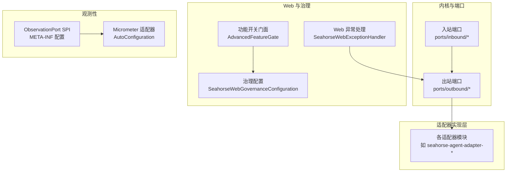
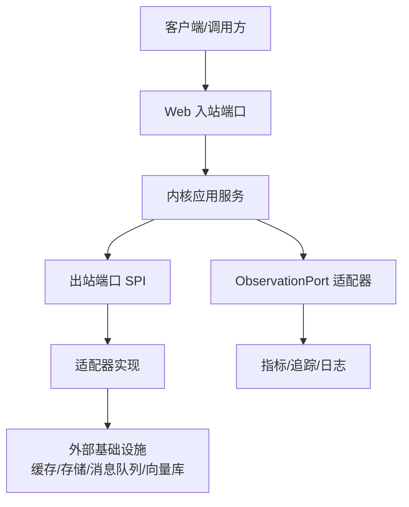
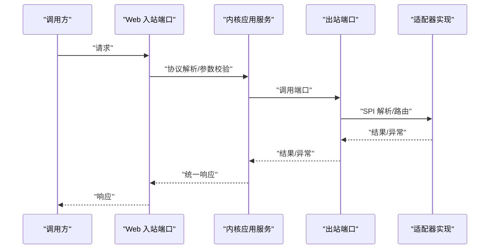
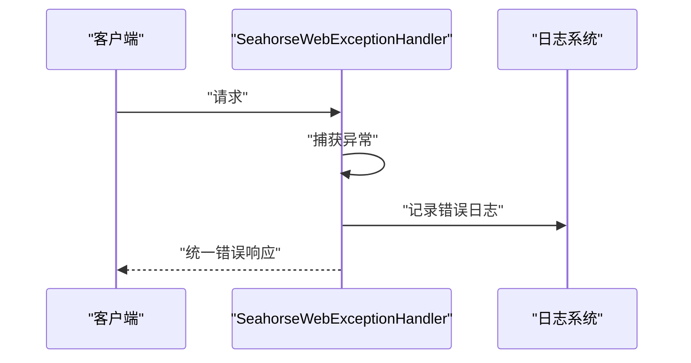
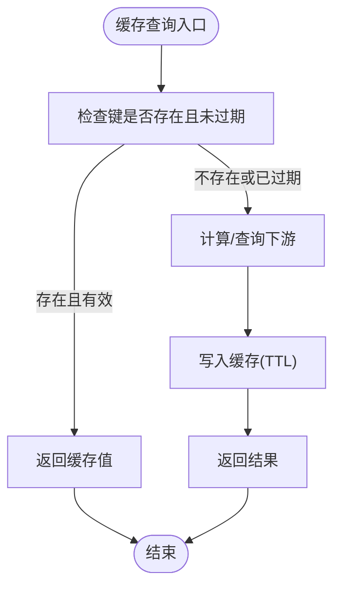
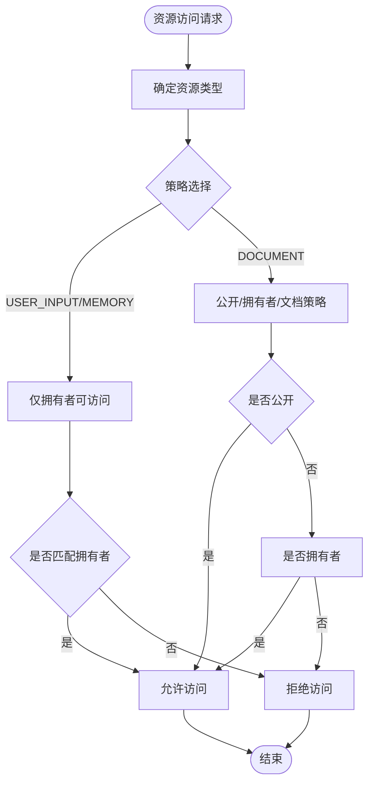
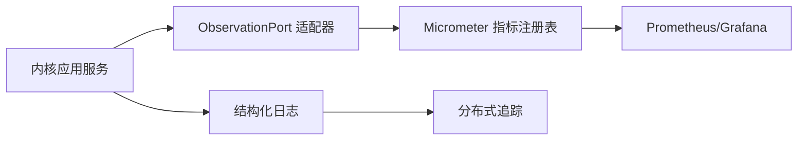
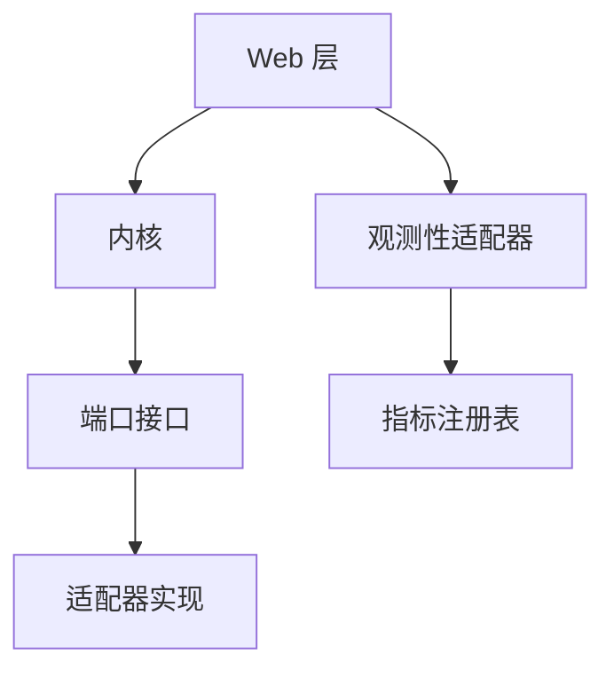

# 扩展开发最佳实践

<cite>
**本文引用的文件**
- [端口接口.md](file://docs/zh/content/后端系统/核心内核/端口接口/端口接口.md)
- [SeahorseWebExceptionHandler.java](file://seahorse-agent-adapter-web/src/main/java/com/miracle/ai/seahorse/agent/adapters/web/SeahorseWebExceptionHandler.java)
- [ApiResponseContractTests.java](file://seahorse-agent-tests/src/test/java/com/miracle/ai/seahorse/agent/adapters/web/ApiResponseContractTests.java)
- [LocalCacheAdapter.java](file://seahorse-agent-adapter-cache-local/src/main/java/com/miracle/ai/seahorse/agent/adapters/cache/local/LocalCacheAdapter.java)
- [SeahorseSecurityWebMvcConfigurationTests.java](file://seahorse-agent-adapter-web/src/test/java/com/miracle/ai/seahorse/agent/adapters/web/SeahorseSecurityWebMvcConfigurationTests.java)
- [MemorySanitizer.java](file://seahorse-agent-kernel/src/main/java/com/miracle/ai/seahorse/agent/kernel/application/memory/MemorySanitizer.java)
- [DefaultResourceAccessPolicyPort.java](file://seahorse-agent-kernel/src/main/java/com/miracle/ai/seahorse/agent/kernel/application/agent/context/DefaultResourceAccessPolicyPort.java)
- [安全配置.md](file://docs/zh/content/数据库设计/安全配置.md)
- [SeahorseWebGovernanceConfiguration.java](file://seahorse-agent-adapter-web/src/main/java/com/miracle/ai/seahorse/agent/adapters/web/SeahorseWebGovernanceConfiguration.java)
- [AdvancedFeatureGate.java](file://seahorse-agent-adapter-web/src/main/java/com/miracle/ai/seahorse/agent/adapters/web/AdvancedFeatureGate.java)
- [com.miracle.ai.seahorse.agent.ports.outbound.observation.ObservationPort](file://seahorse-agent-adapter-observation-micrometer/src/main/resources/META-INF/seahorse-agent/com.miracle.ai.seahorse.agent.ports.outbound.observation.ObservationPort)
- [SeahorseAgentObservationAdapterAutoConfiguration.java](file://seahorse-agent-spring-boot-starter/src/main/java/com/miracle/ai/seahorse/agent/adapters/spring/SeahorseAgentObservationAdapterAutoConfiguration.java)
- [观测性适配器.md](file://docs/zh/content/后端系统/适配器模块/观测性适配器.md)
- [seahorse_init.sql](file://resources/database/seahorse_init.sql)
- [KeywordIndexMessageSubscriber.java](file://seahorse-agent-spring-boot-starter/src/main/java/com/miracle/ai/seahorse/agent/adapters/spring/keyword/KeywordIndexMessageSubscriber.java)
</cite>

## 目录
1. [引言](#引言)
2. [项目结构](#项目结构)
3. [核心组件](#核心组件)
4. [架构总览](#架构总览)
5. [详细组件分析](#详细组件分析)
6. [依赖分析](#依赖分析)
7. [性能考虑](#性能考虑)
8. [故障排查指南](#故障排查指南)
9. [结论](#结论)
10. [附录](#附录)

## 引言
本指南面向扩展开发者，系统总结接口设计、错误处理、性能优化、安全与可观测性、代码质量保障及扩展点设计原则。内容基于仓库现有实现与文档，提炼可复用的最佳实践，帮助在保持接口稳定与向后兼容的前提下，高效演进系统能力。

## 项目结构
- 内核与端口：通过入站/出站端口清晰划分边界，业务逻辑与外部依赖解耦。
- 适配器层：以适配器替换基础设施实现，支持多后端切换与灰度演进。
- Web 与治理：统一异常处理、功能开关与安全策略，确保扩展可控。
- 观测性：通过 Micrometer 适配器与自动装配，统一指标采集与上报。
- 安全：权限策略、资源可见性与敏感信息清洗，贯穿数据流。

**图表来源**
- [端口接口.md:38-49](file://docs/zh/content/后端系统/核心内核/端口接口/端口接口.md#L38-L49)
- [SeahorseWebExceptionHandler.java:63-92](file://seahorse-agent-adapter-web/src/main/java/com/miracle/ai/seahorse/agent/adapters/web/SeahorseWebExceptionHandler.java#L63-L92)
- [AdvancedFeatureGate.java:57-89](file://seahorse-agent-adapter-web/src/main/java/com/miracle/ai/seahorse/agent/adapters/web/AdvancedFeatureGate.java#L57-L89)
- [SeahorseWebGovernanceConfiguration.java:58-114](file://seahorse-agent-adapter-web/src/main/java/com/miracle/ai/seahorse/agent/adapters/web/SeahorseWebGovernanceConfiguration.java#L58-L114)
- [com.miracle.ai.seahorse.agent.ports.outbound.observation.ObservationPort:1-4](file://seahorse-agent-adapter-observation-micrometer/src/main/resources/META-INF/seahorse-agent/com.miracle.ai.seahorse.agent.ports.outbound.observation.ObservationPort#L1-L4)
- [SeahorseAgentObservationAdapterAutoConfiguration.java:53-65](file://seahorse-agent-spring-boot-starter/src/main/java/com/miracle/ai/seahorse/agent/adapters/spring/SeahorseAgentObservationAdapterAutoConfiguration.java#L53-L65)

**章节来源**
- [端口接口.md:30-49](file://docs/zh/content/后端系统/核心内核/端口接口/端口接口.md#L30-L49)

## 核心组件
- 端口接口层：定义入站/出站边界，承载业务契约；通过 SPI/META-INF 配置实现可插拔替换。
- Web 异常处理：集中捕获异常，输出统一错误响应，区分业务与系统错误。
- 功能开关与治理：以门面模式聚合特性开关，配合配置类统一启用/禁用高级能力。
- 观测性适配：通过 ObservationPort SPI 与 Micrometer 自动装配，实现指标采集与上报。
- 安全与权限：资源访问策略、最小权限原则、敏感信息清洗与可见性控制。
- 缓存与速率限制：本地缓存与令牌桶式限流，支持 TTL 与过期清理。

**章节来源**
- [端口接口.md:30-49](file://docs/zh/content/后端系统/核心内核/端口接口/端口接口.md#L30-L49)
- [SeahorseWebExceptionHandler.java:63-92](file://seahorse-agent-adapter-web/src/main/java/com/miracle/ai/seahorse/agent/adapters/web/SeahorseWebExceptionHandler.java#L63-L92)
- [SeahorseWebGovernanceConfiguration.java:58-114](file://seahorse-agent-adapter-web/src/main/java/com/miracle/ai/seahorse/agent/adapters/web/SeahorseWebGovernanceConfiguration.java#L58-L114)
- [AdvancedFeatureGate.java:57-89](file://seahorse-agent-adapter-web/src/main/java/com/miracle/ai/seahorse/agent/adapters/web/AdvancedFeatureGate.java#L57-L89)
- [com.miracle.ai.seahorse.agent.ports.outbound.observation.ObservationPort:1-4](file://seahorse-agent-adapter-observation-micrometer/src/main/resources/META-INF/seahorse-agent/com.miracle.ai.seahorse.agent.ports.outbound.observation.ObservationPort#L1-L4)
- [SeahorseAgentObservationAdapterAutoConfiguration.java:53-65](file://seahorse-agent-spring-boot-starter/src/main/java/com/miracle/ai/seahorse/agent/adapters/spring/SeahorseAgentObservationAdapterAutoConfiguration.java#L53-L65)
- [LocalCacheAdapter.java:52-91](file://seahorse-agent-adapter-cache-local/src/main/java/com/miracle/ai/seahorse/agent/adapters/cache/local/LocalCacheAdapter.java#L52-L91)

## 架构总览
扩展开发遵循“内核不变、适配器可插”的原则：业务内核通过端口接口与外部系统解耦；Web 层负责协议接入与治理；观测性通过适配器统一采集；安全策略贯穿资源访问与数据清洗。

**图表来源**
- [端口接口.md:30-49](file://docs/zh/content/后端系统/核心内核/端口接口/端口接口.md#L30-L49)
- [SeahorseAgentObservationAdapterAutoConfiguration.java:53-65](file://seahorse-agent-spring-boot-starter/src/main/java/com/miracle/ai/seahorse/agent/adapters/spring/SeahorseAgentObservationAdapterAutoConfiguration.java#L53-L65)

## 详细组件分析

### 接口设计与版本演进
- 稳定性与向后兼容
  - 使用入站/出站端口明确边界，避免业务逻辑耦合外部实现细节。
  - 通过 SPI/META-INF 配置实现可插拔替换，支持灰度与回滚。
- 版本演进策略
  - 新增适配器时保留旧实现，逐步迁移消费者。
  - 对外 API 返回结构保持稳定，新增字段以非必填形式演进。
  - 通过功能开关门面控制新能力发布节奏，降低风险。

**图表来源**
- [端口接口.md:30-49](file://docs/zh/content/后端系统/核心内核/端口接口/端口接口.md#L30-L49)

**章节来源**
- [端口接口.md:30-49](file://docs/zh/content/后端系统/核心内核/端口接口/端口接口.md#L30-L49)

### 错误处理与异常管理
- 统一异常处理
  - Web 层集中捕获异常，区分业务与系统错误，返回结构化错误码与消息。
  - 对未处理异常记录错误日志，避免泄露内部细节。
- 错误码设计
  - 成功与失败场景使用固定码值，便于前端与监控侧识别。
  - 服务不可用场景返回特定错误码，便于熔断与降级。
- 降级策略
  - 通过功能开关快速关闭高风险能力，保障主流程可用。
  - 对下游依赖失败时，采用快速失败或兜底策略。

**图表来源**
- [SeahorseWebExceptionHandler.java:63-92](file://seahorse-agent-adapter-web/src/main/java/com/miracle/ai/seahorse/agent/adapters/web/SeahorseWebExceptionHandler.java#L63-L92)

**章节来源**
- [SeahorseWebExceptionHandler.java:63-92](file://seahorse-agent-adapter-web/src/main/java/com/miracle/ai/seahorse/agent/adapters/web/SeahorseWebExceptionHandler.java#L63-L92)
- [ApiResponseContractTests.java:89-173](file://seahorse-agent-tests/src/test/java/com/miracle/ai/seahorse/agent/adapters/web/ApiResponseContractTests.java#L89-L173)

### 性能优化与资源管理
- 缓存策略
  - 本地缓存支持 TTL 过期与自动清理，减少重复计算与 IO。
  - 限流采用令牌桶模型，按资源+主体维度统计，拒绝过载请求。
- 并发与资源
  - 通过分布式信号量/锁适配器实现跨节点协调，避免竞态。
  - 指标采集与资源监控结合，识别热点与瓶颈。
- 资源管理
  - 对象存储与向量库适配器支持多后端切换，按需扩容缩容。

**图表来源**
- [LocalCacheAdapter.java:52-91](file://seahorse-agent-adapter-cache-local/src/main/java/com/miracle/ai/seahorse/agent/adapters/cache/local/LocalCacheAdapter.java#L52-L91)

**章节来源**
- [LocalCacheAdapter.java:52-91](file://seahorse-agent-adapter-cache-local/src/main/java/com/miracle/ai/seahorse/agent/adapters/cache/local/LocalCacheAdapter.java#L52-L91)

### 安全与权限控制
- 输入验证与敏感信息保护
  - 记忆体输入清洗检测敏感词，拒绝包含凭证特征的内容。
  - 日志与响应中避免输出敏感信息，必要时脱敏处理。
- 权限控制
  - 资源访问策略根据资源类型与可见性判断，支持公开/拥有者/文档等策略。
  - 最小权限原则：默认拒绝，仅授予完成任务所需权限。
- 功能开关与安全边界
  - 通过门面与配置类控制高级功能开关，防止越权或滥用。

**图表来源**
- [DefaultResourceAccessPolicyPort.java:78-109](file://seahorse-agent-kernel/src/main/java/com/miracle/ai/seahorse/agent/kernel/application/agent/context/DefaultResourceAccessPolicyPort.java#L78-L109)

**章节来源**
- [MemorySanitizer.java:31-58](file://seahorse-agent-kernel/src/main/java/com/miracle/ai/seahorse/agent/kernel/application/memory/MemorySanitizer.java#L31-L58)
- [DefaultResourceAccessPolicyPort.java:78-109](file://seahorse-agent-kernel/src/main/java/com/miracle/ai/seahorse/agent/kernel/application/agent/context/DefaultResourceAccessPolicyPort.java#L78-L109)
- [安全配置.md:182-196](file://docs/zh/content/数据库设计/安全配置.md#L182-L196)
- [seahorse_init.sql:11-31](file://resources/database/seahorse_init.sql#L11-L31)

### 监控与可观测性
- 指标采集
  - 通过 ObservationPort SPI 与 Micrometer 适配器自动装配，统一指标命名与标签。
- 日志与追踪
  - 关联观察上下文（租户、属性），便于日志与指标交叉分析。
  - 支持在命令中注入 TraceId/SpanId，结合分布式追踪系统实现端到端链路观测。
- 告警与降级
  - 基于指标阈值（延迟、错误率）设置告警规则，结合标签定位问题。

**图表来源**
- [com.miracle.ai.seahorse.agent.ports.outbound.observation.ObservationPort:1-4](file://seahorse-agent-adapter-observation-micrometer/src/main/resources/META-INF/seahorse-agent/com.miracle.ai.seahorse.agent.ports.outbound.observation.ObservationPort#L1-L4)
- [SeahorseAgentObservationAdapterAutoConfiguration.java:53-65](file://seahorse-agent-spring-boot-starter/src/main/java/com/miracle/ai/seahorse/agent/adapters/spring/SeahorseAgentObservationAdapterAutoConfiguration.java#L53-L65)
- [观测性适配器.md:293-301](file://docs/zh/content/后端系统/适配器模块/观测性适配器.md#L293-L301)

**章节来源**
- [com.miracle.ai.seahorse.agent.ports.outbound.observation.ObservationPort:1-4](file://seahorse-agent-adapter-observation-micrometer/src/main/resources/META-INF/seahorse-agent/com.miracle.ai.seahorse.agent.ports.outbound.observation.ObservationPort#L1-L4)
- [SeahorseAgentObservationAdapterAutoConfiguration.java:53-65](file://seahorse-agent-spring-boot-starter/src/main/java/com/miracle/ai/seahorse/agent/adapters/spring/SeahorseAgentObservationAdapterAutoConfiguration.java#L53-L65)
- [观测性适配器.md:293-301](file://docs/zh/content/后端系统/适配器模块/观测性适配器.md#L293-L301)

### 代码质量与测试
- 静态分析与规范
  - 通过构建脚本与 CI 集成静态检查工具，约束编码风格与复杂度。
- 单元与契约测试
  - Web 响应契约测试确保成功/失败路径返回结构一致。
  - 关键流程（异常处理、功能开关）具备针对性测试用例。
- 自动化测试
  - 适配器模块提供大量单元测试，覆盖配置条件、自动装配与行为验证。

**章节来源**
- [ApiResponseContractTests.java:89-173](file://seahorse-agent-tests/src/test/java/com/miracle/ai/seahorse/agent/adapters/web/ApiResponseContractTests.java#L89-L173)
- [SeahorseSecurityWebMvcConfigurationTests.java:27-88](file://seahorse-agent-adapter-web/src/test/java/com/miracle/ai/seahorse/agent/adapters/web/SeahorseSecurityWebMvcConfigurationTests.java#L27-L88)

### 扩展点设计原则
- 职责分离与单一职责
  - 入站端口负责协议接入，出站端口负责外部依赖抽象，内核专注业务规则。
- 开闭原则
  - 通过 SPI/META-INF 配置与自动装配机制，新增适配器无需修改内核。
- 可插拔与灰度
  - 功能开关门面统一控制能力发布，支持灰度与回滚。

**章节来源**
- [端口接口.md:30-49](file://docs/zh/content/后端系统/核心内核/端口接口/端口接口.md#L30-L49)
- [AdvancedFeatureGate.java:57-89](file://seahorse-agent-adapter-web/src/main/java/com/miracle/ai/seahorse/agent/adapters/web/AdvancedFeatureGate.java#L57-L89)
- [SeahorseWebGovernanceConfiguration.java:58-114](file://seahorse-agent-adapter-web/src/main/java/com/miracle/ai/seahorse/agent/adapters/web/SeahorseWebGovernanceConfiguration.java#L58-L114)

## 依赖分析
- 组件耦合
  - 内核仅依赖端口接口，不直接依赖具体实现，耦合度低。
  - Web 层依赖内核与端口，承担协议与治理职责。
- 外部依赖
  - 观测性通过 Micrometer 适配器与注册表集成，避免硬编码。
  - 安全策略与数据库初始化脚本共同保障权限与最小权限原则。

**图表来源**
- [端口接口.md:30-49](file://docs/zh/content/后端系统/核心内核/端口接口/端口接口.md#L30-L49)
- [SeahorseAgentObservationAdapterAutoConfiguration.java:53-65](file://seahorse-agent-spring-boot-starter/src/main/java/com/miracle/ai/seahorse/agent/adapters/spring/SeahorseAgentObservationAdapterAutoConfiguration.java#L53-L65)

**章节来源**
- [端口接口.md:30-49](file://docs/zh/content/后端系统/核心内核/端口接口/端口接口.md#L30-L49)
- [SeahorseAgentObservationAdapterAutoConfiguration.java:53-65](file://seahorse-agent-spring-boot-starter/src/main/java/com/miracle/ai/seahorse/agent/adapters/spring/SeahorseAgentObservationAdapterAutoConfiguration.java#L53-L65)

## 性能考虑
- 缓存与限流
  - 使用本地缓存与 TTL 控制热点数据访问；令牌桶限流保护下游。
- 指标与告警
  - 基于 p95/p99 延迟与错误率设置阈值告警，结合标签定位问题根因。
- 资源隔离
  - 通过分布式信号量/锁实现跨节点协调，避免资源争用。

**章节来源**
- [LocalCacheAdapter.java:52-91](file://seahorse-agent-adapter-cache-local/src/main/java/com/miracle/ai/seahorse/agent/adapters/cache/local/LocalCacheAdapter.java#L52-L91)
- [观测性适配器.md:293-301](file://docs/zh/content/后端系统/适配器模块/观测性适配器.md#L293-L301)

## 故障排查指南
- Web 异常排查
  - 查看统一异常处理器日志，确认错误码与消息；区分业务异常与系统异常。
- 功能开关排查
  - 检查门面配置与属性开关，确认目标能力是否被禁用。
- 观测性排查
  - 结合指标、日志与追踪上下文，定位延迟与错误热点；利用标签维度缩小范围。
- 安全与权限排查
  - 核对资源访问策略与可见性设置；确认敏感信息是否被清洗。

**章节来源**
- [SeahorseWebExceptionHandler.java:63-92](file://seahorse-agent-adapter-web/src/main/java/com/miracle/ai/seahorse/agent/adapters/web/SeahorseWebExceptionHandler.java#L63-L92)
- [AdvancedFeatureGate.java:57-89](file://seahorse-agent-adapter-web/src/main/java/com/miracle/ai/seahorse/agent/adapters/web/AdvancedFeatureGate.java#L57-L89)
- [KeywordIndexMessageSubscriber.java:173-187](file://seahorse-agent-spring-boot-starter/src/main/java/com/miracle/ai/seahorse/agent/adapters/spring/keyword/KeywordIndexMessageSubscriber.java#L173-L187)

## 结论
通过端口接口解耦、Web 层统一治理、Micrometer 观测性适配与严格的安全策略，本项目形成了可扩展、可观测、可演进的系统骨架。扩展开发应坚持接口稳定、向后兼容与最小权限原则，配合功能开关与指标告警，实现稳健演进与快速排障。

## 附录
- 常见问题与建议
  - 接口变更：优先新增端口或非必填字段，保留旧字段若干版本再移除。
  - 异常处理：统一错误码与消息，避免泄露内部实现细节。
  - 性能瓶颈：先用指标定位，再结合日志与追踪深入分析。
  - 安全风险：默认拒绝策略，最小权限原则，敏感信息清洗与脱敏。
- 性能调优与故障排查经验
  - 指标阈值：结合业务 SLA 设定 p95/p99 延迟与错误率阈值。
  - 日志关联：在日志中携带 observation/tenant/attributes，提升定位效率。
  - 分布式追踪：在命令中注入 TraceId/SpanId，串联端到端链路。