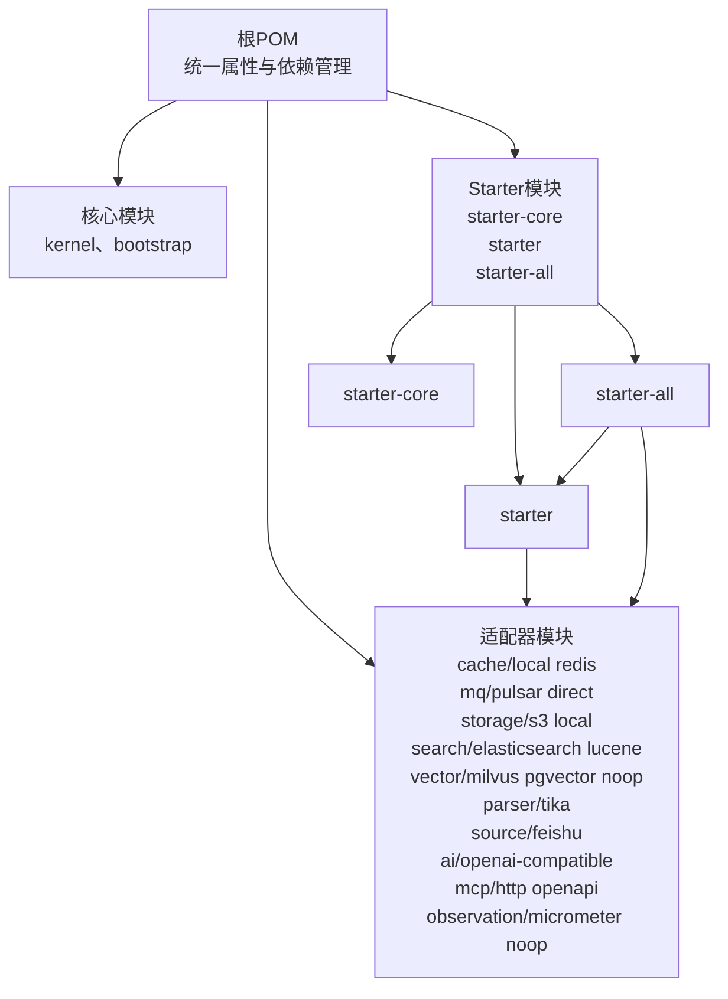
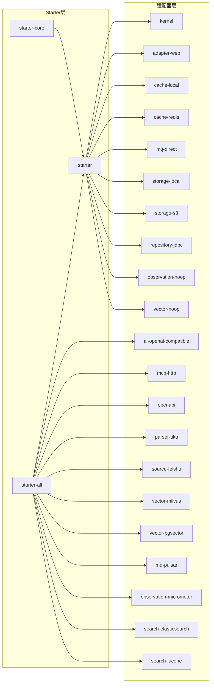
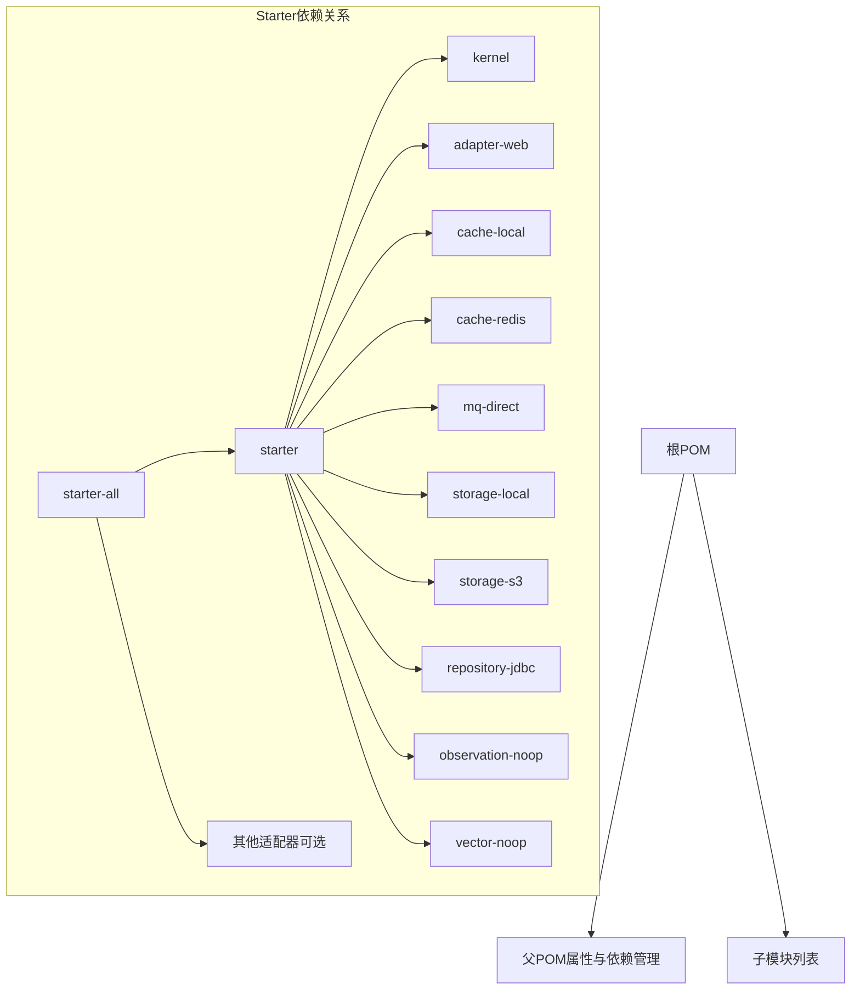

# 插件打包与分发

<cite>
**本文引用的文件**
- [根POM（pom.xml）](file://pom.xml)
- [Spring Boot Starter（seahorse-agent-spring-boot-starter/pom.xml）](file://seahorse-agent-spring-boot-starter/pom.xml)
- [Spring Boot Starter All（seahorse-agent-spring-boot-starter-all/pom.xml）](file://seahorse-agent-spring-boot-starter-all/pom.xml)
- [Spring Boot Starter Core（seahorse-agent-spring-boot-starter-core/pom.xml）](file://seahorse-agent-spring-boot-starter-core/pom.xml)
- [Bootstrap模块（seahorse-agent-bootstrap/pom.xml）](file://seahorse-agent-bootstrap/pom.xml)
</cite>

## 目录
1. [引言](#引言)
2. [项目结构](#项目结构)
3. [核心组件](#核心组件)
4. [架构总览](#架构总览)
5. [详细组件分析](#详细组件分析)
6. [依赖关系分析](#依赖关系分析)
7. [性能考虑](#性能考虑)
8. [故障排查指南](#故障排查指南)
9. [结论](#结论)
10. [附录：完整项目模板与配置示例](#附录完整项目模板与配置示例)

## 引言
本指南面向需要在Maven生态中开发、打包与分发Spring Boot插件（Starter）的工程师。基于仓库中的多模块结构与Starter配置，本文系统讲解：
- Maven项目的创建与配置要点（pom.xml结构、属性与依赖管理）
- Spring Boot Starter的开发与使用（自动配置与META-INF配置文件）
- 插件打包流程（编译、测试、打包、发布）
- 依赖管理策略（传递依赖、版本冲突解决、依赖范围控制）
- 版本控制与发布流程（语义化版本、变更日志、发布标签）
- 分发最佳实践（中央仓库、私有仓库、依赖解析优化）
- 提供可直接套用的项目模板与配置示例路径

## 项目结构
该仓库采用多模块聚合工程组织，顶层POM统一管理版本与插件，各功能适配器与Starter作为子模块存在。核心模块包括：
- 核心内核与适配器模块（如缓存、消息队列、存储、搜索、向量库等）
- Spring Boot Starter系列（core、standard、all）
- Bootstrap可执行模块
- 测试模块

图表来源
- [根POM（pom.xml）:38-66](file://pom.xml#L38-L66)
- [Spring Boot Starter（seahorse-agent-spring-boot-starter/pom.xml）:18-137](file://seahorse-agent-spring-boot-starter/pom.xml#L18-L137)
- [Spring Boot Starter All（seahorse-agent-spring-boot-starter-all/pom.xml）:18-89](file://seahorse-agent-spring-boot-starter-all/pom.xml#L18-L89)

章节来源
- [根POM（pom.xml）:1-286](file://pom.xml#L1-L286)
- [Spring Boot Starter（seahorse-agent-spring-boot-starter/pom.xml）:1-170](file://seahorse-agent-spring-boot-starter/pom.xml#L1-L170)
- [Spring Boot Starter All（seahorse-agent-spring-boot-starter-all/pom.xml）:1-91](file://seahorse-agent-spring-boot-starter-all/pom.xml#L1-L91)
- [Spring Boot Starter Core（seahorse-agent-spring-boot-starter-core/pom.xml）:1-26](file://seahorse-agent-spring-boot-starter-core/pom.xml#L1-L26)
- [Bootstrap模块（seahorse-agent-bootstrap/pom.xml）:1-87](file://seahorse-agent-bootstrap/pom.xml#L1-L87)

## 核心组件
- 统一属性与版本管理：通过顶层POM集中定义Java版本、Spring Boot版本、第三方库版本，确保全仓库一致性。
- 依赖管理（dependencyManagement）：集中声明依赖坐标与版本，子模块按需引入，避免版本漂移。
- 插件管理（pluginManagement）：统一编译、测试、格式化等插件版本与行为。
- 模块划分：以功能域拆分为多个适配器模块，配合Starter模块实现“按需装配”。

章节来源
- [根POM（pom.xml）:15-36](file://pom.xml#L15-L36)
- [根POM（pom.xml）:68-189](file://pom.xml#L68-L189)
- [根POM（pom.xml）:209-284](file://pom.xml#L209-L284)

## 架构总览
下图展示Starter与适配器模块之间的依赖关系，以及Starter All如何聚合所有官方适配器。

图表来源
- [Spring Boot Starter（seahorse-agent-spring-boot-starter/pom.xml）:18-137](file://seahorse-agent-spring-boot-starter/pom.xml#L18-L137)
- [Spring Boot Starter All（seahorse-agent-spring-boot-starter-all/pom.xml）:18-89](file://seahorse-agent-spring-boot-starter-all/pom.xml#L18-L89)
- [Spring Boot Starter Core（seahorse-agent-spring-boot-starter-core/pom.xml）:18-24](file://seahorse-agent-spring-boot-starter-core/pom.xml#L18-L24)

## 详细组件分析

### Maven项目创建与配置（pom.xml）
- 属性与版本管理
  - 使用属性集中定义Java版本、Spring Boot版本及第三方库版本，便于统一升级与维护。
  - 通过dependencyManagement导入spring-boot-dependencies与tika-bom，确保Spring生态与Tika生态版本一致。
- 依赖与作用域
  - 在顶层POM中声明基础依赖（如spring-boot-starter、spring-boot-starter-test、lombok），子模块按需继承。
  - 对测试依赖（如mockito-core）限定scope为test，避免污染运行时。
- 插件管理
  - 统一编译参数（source/target/encoding/parameters）、Surefire测试插件配置（排除集成测试分组、Mockito JavaAgent注入）。
  - Spotless格式化插件绑定到compile阶段，确保代码风格一致。
- 模块划分
  - 顶层modules列出全部子模块，形成清晰的多模块工程结构。

章节来源
- [根POM（pom.xml）:15-36](file://pom.xml#L15-L36)
- [根POM（pom.xml）:68-189](file://pom.xml#L68-L189)
- [根POM（pom.xml）:191-207](file://pom.xml#L191-L207)
- [根POM（pom.xml）:209-284](file://pom.xml#L209-L284)
- [根POM（pom.xml）:38-66](file://pom.xml#L38-L66)

### Spring Boot Starter开发与使用
- Starter职责
  - 将一组适配器与内核模块以Starter形式暴露，简化用户引入与自动装配。
  - starter-core提供精简别名；starter提供标准装配集合；starter-all聚合所有官方适配器。
- 依赖设计
  - starter依赖kernel、adapter-web、cache-local、storage-local、repo-jdbc等核心模块。
  - 其他适配器以optional方式引入，避免强制依赖非必要能力。
- 打包策略
  - maven-jar-plugin仅包含必要的资源（如application.properties、META-INF、Spring相关类），减小体积。
- 使用方式
  - 应用只需引入starter或starter-all，即可获得默认装配；如需裁剪，可仅引入starter-core或自建自定义starter。

章节来源
- [Spring Boot Starter（seahorse-agent-spring-boot-starter/pom.xml）:18-137](file://seahorse-agent-spring-boot-starter/pom.xml#L18-L137)
- [Spring Boot Starter All（seahorse-agent-spring-boot-starter-all/pom.xml）:18-89](file://seahorse-agent-spring-boot-starter-all/pom.xml#L18-L89)
- [Spring Boot Starter Core（seahorse-agent-spring-boot-starter-core/pom.xml）:18-24](file://seahorse-agent-spring-boot-starter-core/pom.xml#L18-L24)

### 自动配置类与META-INF配置文件
- 自动配置类
  - 在Spring Boot Starter中，自动配置类通常位于com.miracle.ai.seahorse.agent.adapters.spring包下，负责条件装配与Bean注册。
- META-INF配置
  - 适配器模块在resources/META-INF目录下提供SPI配置文件，声明端口实现与自动配置类，供Spring Boot加载。
- 配置生效机制
  - Spring Boot启动时扫描META-INF下的配置文件，根据条件注解决定是否启用对应自动配置与Bean。

章节来源
- [Spring Boot Starter（seahorse-agent-spring-boot-starter/pom.xml）:139-168](file://seahorse-agent-spring-boot-starter/pom.xml#L139-L168)

### 打包流程（编译、测试、打包、发布）
- 编译
  - 使用maven-compiler-plugin统一编译参数，开启parameters以便反射使用。
- 测试
  - maven-surefire-plugin配置排除集成测试分组，并注入Mockito JavaAgent，提升测试覆盖率与稳定性。
- 打包
  - maven-jar-plugin仅包含必要资源，减少Starter体积。
  - spring-boot-maven-plugin用于Bootstrap模块生成可执行jar（exec分类器），指定主类。
- 发布
  - 建议在CI中统一执行编译、测试、打包，随后推送至中央仓库或私有仓库。

章节来源
- [根POM（pom.xml）:227-284](file://pom.xml#L227-L284)
- [Bootstrap模块（seahorse-agent-bootstrap/pom.xml）:76-84](file://seahorse-agent-bootstrap/pom.xml#L76-L84)

### 依赖管理策略
- 传递依赖
  - 通过dependencyManagement集中声明版本，子模块按需引入，避免重复与冲突。
- 版本冲突解决
  - 优先使用BOM（如spring-boot-dependencies、tika-bom）锁定版本；其次通过dependencyManagement显式声明。
- 依赖范围控制
  - 测试依赖限定scope为test；运行时依赖保持默认；optional用于可选适配器，由使用者自行选择。

章节来源
- [根POM（pom.xml）:68-189](file://pom.xml#L68-L189)
- [Spring Boot Starter（seahorse-agent-spring-boot-starter/pom.xml）:38-137](file://seahorse-agent-spring-boot-starter/pom.xml#L38-L137)

### 版本控制与发布流程
- 语义化版本
  - 建议采用主.次.修订格式；重大破坏性变更提升主版本号；新增兼容功能提升次版本号；修复问题提升修订号。
- 变更日志
  - 建议维护CHANGELOG或RELEASE_NOTES，记录每个版本的新增、变更、修复与已知问题。
- 发布标签
  - 在Git中以vX.Y.Z创建标签，配合CI触发发布流程。

章节来源
- [根POM（pom.xml）:7-10](file://pom.xml#L7-L10)

### 分发最佳实践
- 中央仓库发布
  - 配置GPG签名、Sonatype OSSRH凭据与SCM信息，确保发布合规与可追溯。
- 私有仓库
  - 在公司内部Nexus或Artifactory中建立发布通道，统一版本与权限控制。
- 依赖解析优化
  - 使用dependencyManagement统一版本；合理使用optional与scope；避免重复依赖与循环依赖。

章节来源
- [根POM（pom.xml）:68-189](file://pom.xml#L68-L189)

## 依赖关系分析

图表来源
- [Spring Boot Starter（seahorse-agent-spring-boot-starter/pom.xml）:18-137](file://seahorse-agent-spring-boot-starter/pom.xml#L18-L137)
- [Spring Boot Starter All（seahorse-agent-spring-boot-starter-all/pom.xml）:18-89](file://seahorse-agent-spring-boot-starter-all/pom.xml#L18-L89)

章节来源
- [Spring Boot Starter（seahorse-agent-spring-boot-starter/pom.xml）:18-137](file://seahorse-agent-spring-boot-starter/pom.xml#L18-L137)
- [Spring Boot Starter All（seahorse-agent-spring-boot-starter-all/pom.xml）:18-89](file://seahorse-agent-spring-boot-starter-all/pom.xml#L18-L89)

## 性能考虑
- 体积优化
  - Starter仅打包必要资源，减少依赖体积，缩短应用启动时间。
- 测试效率
  - 通过Surefire分组与Mockito注入，提升单元测试执行效率与覆盖率。
- 构建稳定性
  - Spotless在编译期统一格式，降低CI失败率与人工干预成本。

章节来源
- [根POM（pom.xml）:262-282](file://pom.xml#L262-L282)
- [Spring Boot Starter（seahorse-agent-spring-boot-starter/pom.xml）:155-166](file://seahorse-agent-spring-boot-starter/pom.xml#L155-L166)

## 故障排查指南
- 版本不一致导致的类冲突
  - 检查dependencyManagement中是否覆盖了spring-boot-dependencies或tika-bom的版本。
- 测试失败（Mockito相关）
  - 确认Surefire插件正确注入Mockito JavaAgent，且排除了集成测试分组。
- 启动缓慢或Starter过大
  - 检查maven-jar-plugin的includes配置，确保仅包含必要资源。
- 发布失败（签名或凭据）
  - 核对GPG密钥、OSSRH凭据与SCM配置，确保CI环境变量正确。

章节来源
- [根POM（pom.xml）:252-260](file://pom.xml#L252-L260)
- [根POM（pom.xml）:262-282](file://pom.xml#L262-L282)
- [Spring Boot Starter（seahorse-agent-spring-boot-starter/pom.xml）:155-166](file://seahorse-agent-spring-boot-starter/pom.xml#L155-L166)

## 结论
通过统一的属性与依赖管理、清晰的模块划分与Starter设计，本项目实现了插件化的可扩展架构。遵循本文的打包与分发流程，可高效地完成从开发到发布的全链路工作。

## 附录：完整项目模板与配置示例
以下为可直接参考的模板与示例路径（请在本地仓库中查看具体文件）：
- Maven项目模板（根POM）
  - [根POM（pom.xml）:1-286](file://pom.xml#L1-L286)
- Spring Boot Starter模板（标准版）
  - [Spring Boot Starter（seahorse-agent-spring-boot-starter/pom.xml）:1-170](file://seahorse-agent-spring-boot-starter/pom.xml#L1-L170)
- Spring Boot Starter模板（All版）
  - [Spring Boot Starter All（seahorse-agent-spring-boot-starter-all/pom.xml）:1-91](file://seahorse-agent-spring-boot-starter-all/pom.xml#L1-L91)
- Spring Boot Starter模板（Core版）
  - [Spring Boot Starter Core（seahorse-agent-spring-boot-starter-core/pom.xml）:1-26](file://seahorse-agent-spring-boot-starter-core/pom.xml#L1-L26)
- Bootstrap可执行模块模板
  - [Bootstrap模块（seahorse-agent-bootstrap/pom.xml）:1-87](file://seahorse-agent-bootstrap/pom.xml#L1-L87)