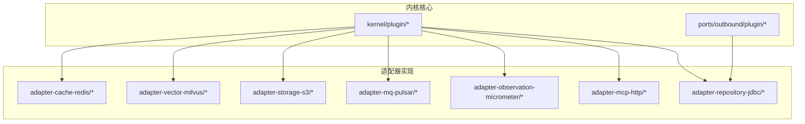
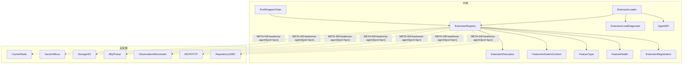
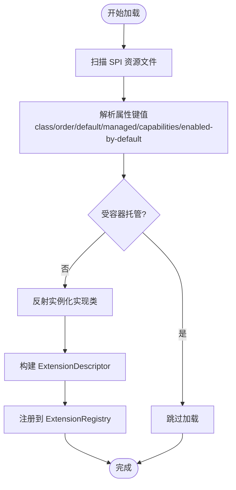
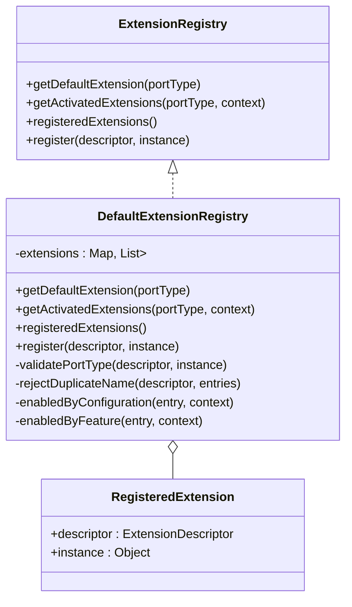
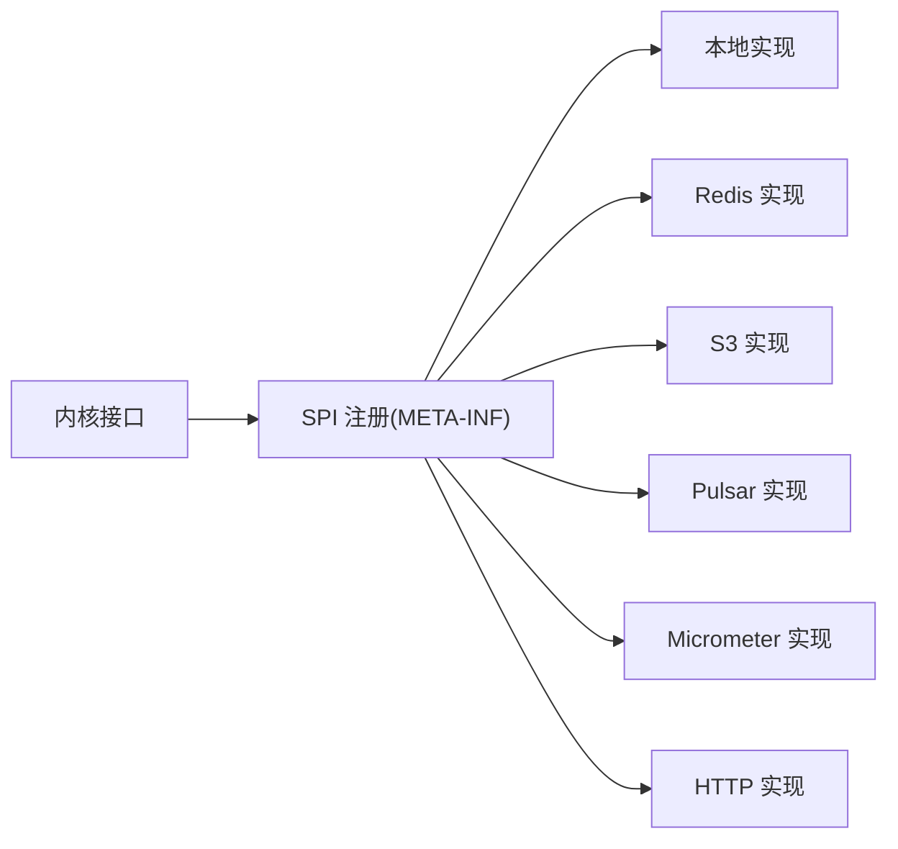
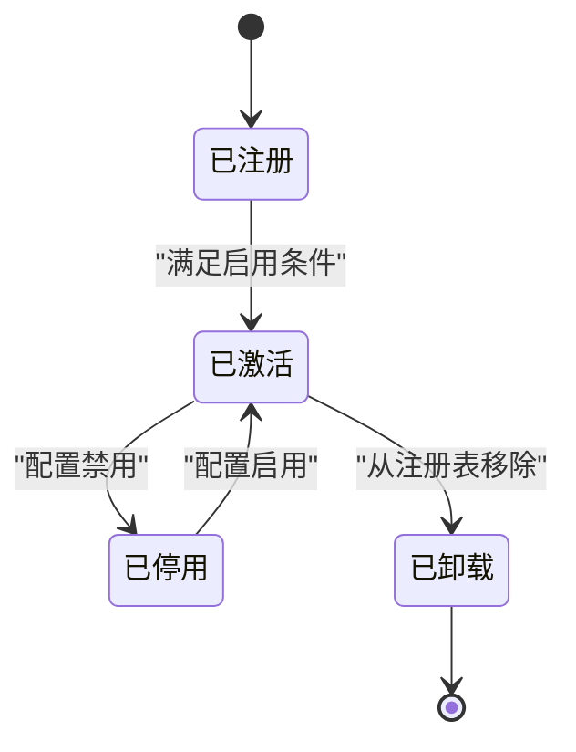
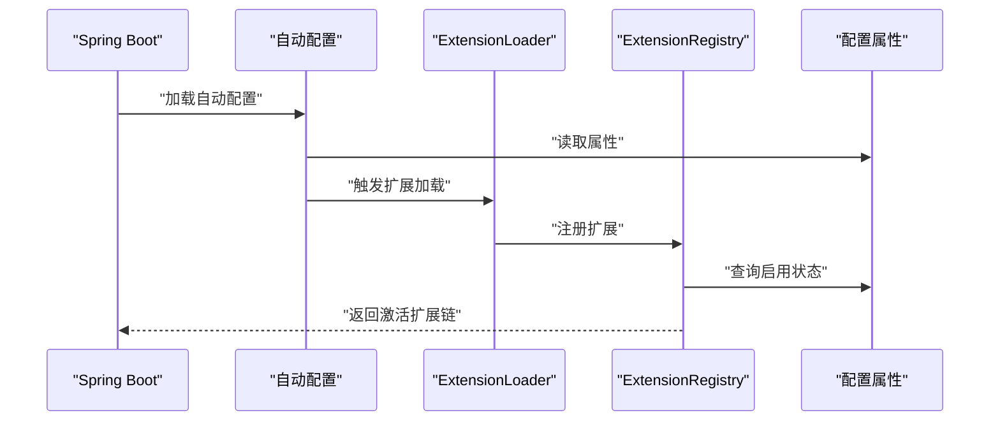
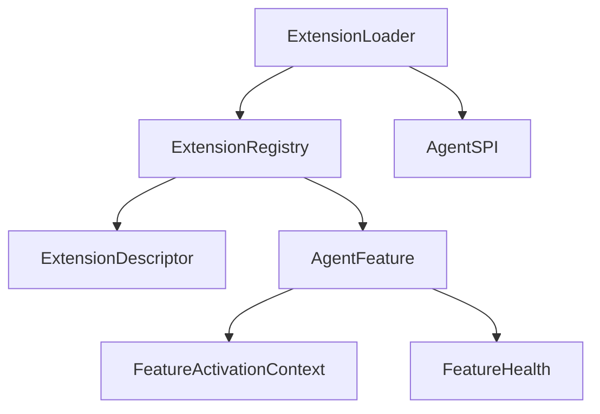

# 插件系统原理

<cite>
**本文引用的文件**
- [ExtensionLoader.java](file://seahorse-agent-kernel/src/main/java/com/miracle/ai/seahorse/agent/kernel/plugin/ExtensionLoader.java)
- [ExtensionRegistry.java](file://seahorse-agent-kernel/src/main/java/com/miracle/ai/seahorse/agent/kernel/plugin/ExtensionRegistry.java)
- [DefaultExtensionRegistry.java](file://seahorse-agent-kernel/src/main/java/com/miracle/ai/seahorse/agent/kernel/plugin/DefaultExtensionRegistry.java)
- [ExtensionDescriptor.java](file://seahorse-agent-kernel/src/main/java/com/miracle/ai/seahorse/agent/kernel/plugin/ExtensionDescriptor.java)
- [ExtensionLoadDiagnostic.java](file://seahorse-agent-kernel/src/main/java/com/miracle/ai/seahorse/agent/kernel/plugin/ExtensionLoadDiagnostic.java)
- [ExtensionRegistration.java](file://seahorse-agent-kernel/src/main/java/com/miracle/ai/seahorse/agent/kernel/plugin/ExtensionRegistration.java)
- [AgentSPI.java](file://seahorse-agent-kernel/src/main/java/com/miracle/ai/seahorse/agent/kernel/plugin/AgentSPI.java)
- [FeatureActivationContext.java](file://seahorse-agent-kernel/src/main/java/com/miracle/ai/seahorse/agent/kernel/plugin/FeatureActivationContext.java)
- [FeatureType.java](file://seahorse-agent-kernel/src/main/java/com/miracle/ai/seahorse/agent/kernel/plugin/FeatureType.java)
- [FeatureHealth.java](file://seahorse-agent-kernel/src/main/java/com/miracle/ai/seahorse/agent/kernel/plugin/FeatureHealth.java)
- [PortWrapperChain.java](file://seahorse-agent-kernel/src/main/java/com/miracle/ai/seahorse/agent/kernel/plugin/wrapper/PortWrapperChain.java)
- [AgentExtensionStatus.java](file://seahorse-agent-kernel/src/main/java/com/miracle/ai/seahorse/agent/ports/outbound/plugin/AgentExtensionStatus.java)
- [AgentExtensionStatusPort.java](file://seahorse-agent-kernel/src/main/java/com/miracle/ai/seahorse/agent/ports/outbound/plugin/AgentExtensionStatusPort.java)
- [ExtensionLoaderTests.java](file://seahorse-agent-tests/src/test/java/com/miracle/ai/seahorse/agent/kernel/plugin/ExtensionLoaderTests.java)
- [DefaultExtensionRegistryTests.java](file://seahorse-agent-tests/src/test/java/com/miracle/ai/seahorse/agent/kernel/plugin/DefaultExtensionRegistryTests.java)
- [插件架构设计.md](file://docs/zh/content/后端系统/插件系统/插件架构设计.md)
- [加载机制.md](file://docs/zh/content/后端系统/核心内核/插件系统/加载机制.md)
- [出站端口.md](file://docs/zh/content/后端系统/核心内核/端口接口/出站端口/出站端口.md)
- [缓存出站端口.md](file://docs/zh/content/后端系统/核心内核/端口接口/出站端口/缓存出站端口.md)
</cite>

## 目录
1. [引言](#引言)
2. [项目结构](#项目结构)
3. [核心组件](#核心组件)
4. [架构总览](#架构总览)
5. [详细组件分析](#详细组件分析)
6. [依赖分析](#依赖分析)
7. [性能考虑](#性能考虑)
8. [故障排查指南](#故障排查指南)
9. [结论](#结论)
10. [附录](#附录)

## 引言
本文件系统性阐述 Seahorse Agent 插件系统（微内核可插拔架构）的设计理念与实现细节，重点覆盖以下主题：
- 扩展注册表、扩展描述符与激活上下文的核心概念
- SPI（Service Provider Interface）机制的实现原理（服务发现、加载与管理）
- 扩展生命周期管理（注册、激活、停用、卸载）
- 端口适配器模式在插件系统中的应用与解耦方式
- 自动配置与条件装配原理（基于 @Conditional 与配置属性驱动的扩展选择）
- 架构图与组件交互示例，帮助开发者快速理解整体设计

## 项目结构
插件系统主要分布在 kernel 模块的 plugin 包与 ports/outbound/plugin 子包中，配合各 adapter-* 模块通过 SPI/META-INF 资源进行装配。

**图表来源**
- [出站端口.md:58-81](file://docs/zh/content/后端系统/核心内核/端口接口/出站端口/出站端口.md#L58-L81)

**章节来源**
- [出站端口.md:52-81](file://docs/zh/content/后端系统/核心内核/端口接口/出站端口/出站端口.md#L52-L81)

## 核心组件
- 扩展加载器 ExtensionLoader：负责从 classpath 的 SPI 资源目录读取扩展定义，解析属性键值，实例化扩展并注册到注册表；同时收集加载诊断信息。
- 扩展注册表 ExtensionRegistry/DefaultExtensionRegistry：注册表接口与默认实现，提供默认扩展获取、按上下文筛选扩展链、注册快照查询以及按 order 排序。
- 扩展描述符 ExtensionDescriptor：扩展元数据载体，包含名称、端口类型、特性类型、排序、默认候选、能力标签与默认启用标志。
- 加载诊断 ExtensionLoadDiagnostic：加载诊断记录，包含资源名、扩展名、实现类名与错误消息。
- AgentSPI：扩展点注解，声明端口是否参与扩展加载及默认扩展名与是否必需。
- 特性激活上下文 FeatureActivationContext/FeatureType：扩展激活上下文与特性类型，用于运行期根据配置与特性逻辑筛选启用的扩展。
- 端口包装链 PortWrapperChain：对端口进行包装与拦截，支持顺序应用与诊断快照。
- 扩展注册快照 ExtensionRegistration：启动期注册快照，便于可观测与调试。

**章节来源**
- [加载机制.md:89-96](file://docs/zh/content/后端系统/核心内核/插件系统/加载机制.md#L89-L96)

## 架构总览
下图展示了插件系统在内核与适配器之间的交互关系，以及 SPI 资源文件如何驱动扩展装配。

**图表来源**
- [插件架构设计.md:491-499](file://docs/zh/content/后端系统/插件系统/插件架构设计.md#L491-L499)
- [加载机制.md:89-96](file://docs/zh/content/后端系统/核心内核/插件系统/加载机制.md#L89-L96)

## 详细组件分析

### 扩展加载器 ExtensionLoader
- 职责与流程
  - 从 classpath 的 SPI 资源目录扫描扩展定义文件（如 META-INF/seahorse-agent/{port-fqcn}）。
  - 解析每个扩展的属性键值（类名、排序、默认候选、能力标签、是否启用等），并实例化实现类。
  - 将扩展与描述符注册到注册表，并记录加载诊断信息。
- 关键实现要点
  - 属性键后缀解析：支持 class、order、default、managed、capabilities、enabled-by-default 等后缀，剥离后缀以提取扩展名。
  - 实例化与注册：通过反射实例化实现类，构造 ExtensionDescriptor 并调用注册表 register。
  - 容器托管检测：若扩展被标记为受容器托管，则跳过加载。
  - 错误处理：捕获实例化异常并记录诊断信息，便于定位问题。

**图表来源**
- [ExtensionLoader.java:122-185](file://seahorse-agent-kernel/src/main/java/com/miracle/ai/seahorse/agent/kernel/plugin/ExtensionLoader.java#L122-L185)

**章节来源**
- [ExtensionLoader.java:122-185](file://seahorse-agent-kernel/src/main/java/com/miracle/ai/seahorse/agent/kernel/plugin/ExtensionLoader.java#L122-L185)

### 扩展注册表与默认实现
- 接口职责
  - getDefaultExtension：获取默认扩展
  - getActivatedExtensions：根据 FeatureActivationContext 过滤并返回启用的扩展链
  - registeredExtensions：查询启动期注册快照
  - register：注册扩展描述符与实例
- 默认实现要点
  - 使用 LinkedHashMap 保持注册顺序
  - 按端口类型分组存储扩展条目
  - 注册时拒绝同端口下重复名称
  - 按 ExtensionDescriptor.order 排序
  - 启用控制：优先使用描述符 enabledByDefault，其次由 FeatureActivationContext 的 AgentFeatureProperties 决定

**图表来源**
- [加载机制.md:207-232](file://docs/zh/content/后端系统/核心内核/插件系统/加载机制.md#L207-L232)

**章节来源**
- [ExtensionRegistry.java:35-83](file://seahorse-agent-kernel/src/main/java/com/miracle/ai/seahorse/agent/kernel/plugin/ExtensionRegistry.java#L35-L83)
- [DefaultExtensionRegistry.java](file://seahorse-agent-kernel/src/main/java/com/miracle/ai/seahorse/agent/kernel/plugin/DefaultExtensionRegistry.java)

### 扩展描述符 ExtensionDescriptor
- 字段与含义
  - 名称：扩展唯一标识
  - 端口类型：扩展所实现的端口接口类型
  - 特性类型：所属 Feature 类型
  - 排序 order：扩展在激活链中的顺序
  - 默认候选 defaultCandidate：是否作为默认扩展
  - 能力标签 capabilities：扩展的能力集合
  - 默认启用 enabledByDefault：是否默认启用
- 作用
  - 作为扩展元数据载体，贯穿加载、注册、激活与诊断全过程

**章节来源**
- [ExtensionDescriptor.java](file://seahorse-agent-kernel/src/main/java/com/miracle/ai/seahorse/agent/kernel/plugin/ExtensionDescriptor.java)

### AgentSPI 注解与端口适配器模式
- AgentSPI
  - 用于声明端口是否参与扩展加载、默认扩展名与是否必需
  - required=true 时缺失实现会导致启动失败，确保关键端口的可用性
- 端口适配器模式
  - 内核仅定义端口接口，具体实现通过 SPI 与 META-INF 配置注入
  - 适配器模块在对应 adapter-* 下提供具体实现，按功能域划分（缓存、向量、存储、消息队列、观测性、MCP 等）
  - 通过端口包装链 PortWrapperChain 对端口进行包装与拦截，支持顺序应用与诊断快照

**图表来源**
- [缓存出站端口.md:373-378](file://docs/zh/content/后端系统/核心内核/端口接口/出站端口/缓存出站端口.md#L373-L378)

**章节来源**
- [AgentSPI.java](file://seahorse-agent-kernel/src/main/java/com/miracle/ai/seahorse/agent/kernel/plugin/AgentSPI.java)
- [PortWrapperChain.java:37-76](file://seahorse-agent-kernel/src/main/java/com/miracle/ai/seahorse/agent/kernel/plugin/wrapper/PortWrapperChain.java#L37-L76)
- [出站端口.md:58-81](file://docs/zh/content/后端系统/核心内核/端口接口/出站端口/出站端口.md#L58-L81)

### 扩展生命周期管理
- 注册：通过 ExtensionLoader 从 SPI 资源加载并注册到 ExtensionRegistry
- 激活：根据 FeatureActivationContext 与 AgentFeatureProperties 过滤启用的扩展链
- 停用：通过配置或特性逻辑禁用扩展（enabledByDefault 或上下文属性）
- 卸载：从注册表移除扩展（在当前实现中，注册表提供空实现时会抛出异常提示无可用注册表）

**图表来源**
- [ExtensionRegistry.java:66-82](file://seahorse-agent-kernel/src/main/java/com/miracle/ai/seahorse/agent/kernel/plugin/ExtensionRegistry.java#L66-L82)
- [DefaultExtensionRegistry.java](file://seahorse-agent-kernel/src/main/java/com/miracle/ai/seahorse/agent/kernel/plugin/DefaultExtensionRegistry.java)

**章节来源**
- [ExtensionRegistration.java](file://seahorse-agent-kernel/src/main/java/com/miracle/ai/seahorse/agent/kernel/plugin/ExtensionRegistration.java)
- [FeatureActivationContext.java](file://seahorse-agent-kernel/src/main/java/com/miracle/ai/seahorse/agent/kernel/plugin/FeatureActivationContext.java)
- [FeatureType.java](file://seahorse-agent-kernel/src/main/java/com/miracle/ai/seahorse/agent/kernel/plugin/FeatureType.java)
- [FeatureHealth.java](file://seahorse-agent-kernel/src/main/java/com/miracle/ai/seahorse/agent/kernel/plugin/FeatureHealth.java)

### 自动配置与条件装配
- 基于 @Conditional 的条件装配
  - 通过 Spring Boot Starter 与 @ConditionalOnProperty/@ConditionalOnMissingBean 等注解实现条件装配
  - 结合 AgentFeatureProperties 与 FeatureActivationContext，动态决定扩展是否启用
- 配置属性驱动的扩展选择
  - ExtensionDescriptor.enabledByDefault 与 FeatureActivationContext 的 AgentFeatureProperties 共同决定扩展的启用状态
  - 测试用例验证了按描述符顺序返回扩展、显式默认扩展解析与启用状态控制

**图表来源**
- [ExtensionLoaderTests.java:35-66](file://seahorse-agent-tests/src/test/java/com/miracle/ai/seahorse/agent/kernel/plugin/ExtensionLoaderTests.java#L35-L66)
- [DefaultExtensionRegistryTests.java:35-113](file://seahorse-agent-tests/src/test/java/com/miracle/ai/seahorse/agent/kernel/plugin/DefaultExtensionRegistryTests.java#L35-L113)

**章节来源**
- [ExtensionLoaderTests.java:35-66](file://seahorse-agent-tests/src/test/java/com/miracle/ai/seahorse/agent/kernel/plugin/ExtensionLoaderTests.java#L35-L66)
- [DefaultExtensionRegistryTests.java:35-113](file://seahorse-agent-tests/src/test/java/com/miracle/ai/seahorse/agent/kernel/plugin/DefaultExtensionRegistryTests.java#L35-L113)

## 依赖分析
- 组件耦合
  - ExtensionLoader 依赖 ClassLoader 与 Properties 解析，最终依赖 ExtensionRegistry 完成注册。
  - DefaultExtensionRegistry 依赖 ExtensionDescriptor 与 FeatureActivationContext 的 enabled() 进行过滤。
  - AgentFeature 与 FeatureType、FeatureActivationContext、FeatureHealth 协作，形成完整的扩展生命周期管理。
- 外部依赖与集成点
  - 适配器通过 META-INF/seahorse-agent/{port-fqcn} 资源文件声明扩展，与内核解耦。
  - AgentSPI 标记端口是否必需，required=true 时缺失实现会导致启动失败。

**图表来源**
- [插件架构设计.md:482-499](file://docs/zh/content/后端系统/插件系统/插件架构设计.md#L482-L499)

**章节来源**
- [插件架构设计.md:482-499](file://docs/zh/content/后端系统/插件系统/插件架构设计.md#L482-L499)

## 性能考虑
- 加载性能
  - SPI 资源扫描与属性解析应避免在热路径重复执行，可在启动期集中完成
  - 实例化与反射调用成本较高，建议结合缓存与懒加载策略
- 注册与查询
  - 注册表按端口类型分组存储，查询时按类型索引，减少遍历开销
  - 激活链按 order 排序，建议在注册时维护有序列表，避免运行时排序
- 包装链开销
  - PortWrapperChain 的包装顺序与数量会影响调用链路，应合理设置包装器数量与顺序

## 故障排查指南
- 加载失败
  - 检查 META-INF/seahorse-agent/{port-fqcn} 文件是否存在且格式正确
  - 查看 ExtensionLoadDiagnostic 记录的资源名、扩展名与错误消息，定位实例化异常
- 默认扩展未生效
  - 确认 ExtensionDescriptor.defaultCandidate 与 enabledByDefault 设置
  - 检查 FeatureActivationContext 的 AgentFeatureProperties 是否禁用了该扩展
- 端口不可用
  - 若 AgentSPI.required=true，缺失实现会导致启动失败，需提供对应适配器实现
  - 通过 ExtensionRegistration 快照确认扩展是否成功注册

**章节来源**
- [ExtensionLoadDiagnostic.java](file://seahorse-agent-kernel/src/main/java/com/miracle/ai/seahorse/agent/kernel/plugin/ExtensionLoadDiagnostic.java)
- [ExtensionRegistration.java](file://seahorse-agent-kernel/src/main/java/com/miracle/ai/seahorse/agent/kernel/plugin/ExtensionRegistration.java)
- [AgentSPI.java](file://seahorse-agent-kernel/src/main/java/com/miracle/ai/seahorse/agent/kernel/plugin/AgentSPI.java)

## 结论
Seahorse Agent 插件系统通过微内核与端口适配器模式实现了高内聚、低耦合的可插拔架构。ExtensionLoader 与 ExtensionRegistry 负责扩展的发现、加载与管理，ExtensionDescriptor 提供统一的元数据载体，AgentSPI 与 FeatureActivationContext 则确保了条件装配与生命周期控制。借助 SPI/META-INF 资源文件，适配器模块可以无缝接入内核，形成强大的生态扩展能力。

## 附录
- 扩展状态端口
  - AgentExtensionStatusPort 与 AgentExtensionStatus 提供扩展状态的查询与治理能力，便于在运行期观察扩展健康状况与启用状态

**章节来源**
- [AgentExtensionStatusPort.java](file://seahorse-agent-kernel/src/main/java/com/miracle/ai/seahorse/agent/ports/outbound/plugin/AgentExtensionStatusPort.java)
- [AgentExtensionStatus.java](file://seahorse-agent-kernel/src/main/java/com/miracle/ai/seahorse/agent/ports/outbound/plugin/AgentExtensionStatus.java)