# 第三方系统集成

<cite>
**本文引用的文件**
- [MCP 适配器.md](file://docs/zh/content/后端系统/适配器模块/MCP 适配器.md)
- [MCPDispatcher.java](file://seahorse-agent-mcp-server/src/main/java/com/miracle/ai/seahorse/agent/adapters/mcp/server/endpoint/MCPDispatcher.java)
- [OpenApiSpecParserAdapter.java](file://seahorse-agent-adapter-openapi/src/main/java/com/miracle/ai/seahorse/agent/adapters/openapi/OpenApiSpecParserAdapter.java)
- [OpenApiSpecParserAdapterTests.java](file://seahorse-agent-adapter-openapi/src/test/java/com/miracle/ai/seahorse/agent/adapters/openapi/OpenApiSpecParserAdapterTests.java)
- [FeishuDocumentFetcherAdapter.java](file://seahorse-agent-adapter-source-feishu/src/main/java/com/miracle/ai/seahorse/agent/adapters/source/feishu/FeishuDocumentFetcherAdapter.java)
- [FeishuDocumentSourceProperties.java](file://seahorse-agent-adapter-source-feishu/src/main/java/com/miracle/ai/seahorse/agent/adapters/source/feishu/FeishuDocumentSourceProperties.java)
- [org.springframework.boot.autoconfigure.AutoConfiguration.imports（MCP HTTP 适配器）](file://seahorse-agent-adapter-mcp-http/src/main/resources/META-INF/spring/org.springframework.boot.autoconfigure.AutoConfiguration.imports)
- [向量数据库适配器.md](file://docs/zh/content/后端系统/适配器模块/向量数据库适配器.md)
- [PgVectorProperties.java](file://seahorse-agent-adapter-vector-pgvector/src/main/java/com/miracle/ai/seahorse/agent/adapters/vector/pgvector/PgVectorProperties.java)
- [向量出站端口.md](file://docs/zh/content/后端系统/核心内核/端口接口/出站端口/向量出站端口.md)
- [存储适配器.md](file://docs/zh/content/后端系统/适配器模块/存储适配器.md)
- [S3ObjectStorageAdapter.java](file://seahorse-agent-adapter-storage-s3/src/main/java/com/miracle/ai/seahorse/agent/adapters/storage/s3/S3ObjectStorageAdapter.java)
- [LocalObjectStorageAdapter.java](file://seahorse-agent-adapter-storage-local/src/main/java/com/miracle/ai/seahorse/agent/adapters/storage/local/LocalObjectStorageAdapter.java)
- [Web 适配器.md](file://docs/zh/content/后端系统/适配器模块/Web 适配器.md)
- [ChatStreamCallbackFactoryPort.java](file://seahorse-agent-adapter-web/src/main/java/com/miracle/ai/seahorse/agent/adapters/web/ChatStreamCallbackFactoryPort.java)
- [nginx.conf](file://frontend/nginx.conf)
- [Clean Architecture 模式.md](file://docs/zh/content/架构设计/Clean Architecture 模式.md)
- [扩展加载机制.md](file://docs/zh/content/后端系统/插件系统/扩展加载机制.md)
- [Spring Boot 集成：自动配置与扩展装配](file://docs/zh/content/后端系统/插件系统/扩展加载机制.md)
- [JdbcConnectorCredentialBindingRepositoryAdapter.java](file://seahorse-agent-adapter-repository-jdbc/src/main/java/com/miracle/ai/seahorse/agent/adapters/repository/jdbc/JdbcConnectorCredentialBindingRepositoryAdapter.java)
- [JdbcConnectorCredentialBindingRepositoryAdapterTests.java](file://seahorse-agent-adapter-repository-jdbc/src/test/java/com/miracle/ai/seahorse/agent/adapters/repository/jdbc/JdbcConnectorCredentialBindingRepositoryAdapterTests.java)
- [application.properties（Spring Boot Starter）](file://seahorse-agent-spring-boot-starter/src/main/resources/application.properties)
</cite>

## 目录
1. [简介](#简介)
2. [项目结构](#项目结构)
3. [核心组件](#核心组件)
4. [架构总览](#架构总览)
5. [详细组件分析](#详细组件分析)
6. [依赖分析](#依赖分析)
7. [性能考虑](#性能考虑)
8. [故障排查指南](#故障排查指南)
9. [结论](#结论)
10. [附录](#附录)

## 简介
本指南面向第三方系统集成，覆盖以下主题：
- RESTful API 集成与 Web 适配器
- WebSocket 与 SSE 支持
- MCP（Model Context Protocol）集成：协议实现、参数提取与工具注册
- OpenAPI 规范解析与 API 客户端生成
- 文档源系统集成：飞书文档源的实现原理与配置
- 存储系统集成：S3 兼容存储、本地存储与对象存储抽象
- 向量数据库集成：pgvector、Milvus 等适配器
- 认证与连接池配置、性能优化建议与完整集成示例

## 项目结构
该仓库采用 Clean Architecture 与模块化适配器设计，核心内核通过“出站端口”屏蔽外部系统差异，各适配器模块实现具体协议与后端对接。

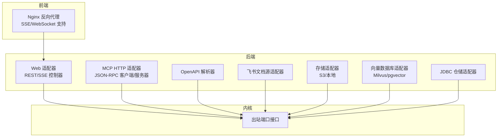

图表来源
- [Clean Architecture 模式.md:196-226](file://docs/zh/content/架构设计/Clean Architecture 模式.md#L196-L226)
- [Web 适配器.md:109-126](file://docs/zh/content/后端系统/适配器模块/Web 适配器.md#L109-L126)

章节来源
- [Clean Architecture 模式.md:196-226](file://docs/zh/content/架构设计/Clean Architecture 模式.md#L196-L226)
- [Web 适配器.md:109-126](file://docs/zh/content/后端系统/适配器模块/Web 适配器.md#L109-L126)

## 核心组件
- 出站端口：内核通过统一端口接口与外部系统交互，如向量搜索、存储、文档抓取、消息队列等。
- 适配器模块：按功能拆分，如 Web、MCP、OpenAPI、Feishu 文档源、存储、向量数据库、JDBC 仓储等。
- 插件系统：通过 Spring Boot 自动装配与 META-INF 清单实现扩展加载与装配。
- 认证与拦截：Web 适配器集成 Sa-Token 实现登录校验与安全拦截。

章节来源
- [Clean Architecture 模式.md:196-226](file://docs/zh/content/架构设计/Clean Architecture 模式.md#L196-L226)
- [扩展加载机制.md:277-318](file://docs/zh/content/后端系统/插件系统/扩展加载机制.md#L277-L318)

## 架构总览
下图展示 Web 控制器到内核与外部系统的交互路径，以及 MCP 服务器端的分发流程。

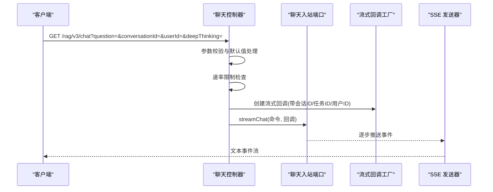

图表来源
- [Web 适配器.md:113-126](file://docs/zh/content/后端系统/适配器模块/Web 适配器.md#L113-L126)
- [ChatStreamCallbackFactoryPort.java:26-33](file://seahorse-agent-adapter-web/src/main/java/com/miracle/ai/seahorse/agent/adapters/web/ChatStreamCallbackFactoryPort.java#L26-L33)

章节来源
- [Web 适配器.md:109-126](file://docs/zh/content/后端系统/适配器模块/Web 适配器.md#L109-L126)
- [ChatStreamCallbackFactoryPort.java:26-33](file://seahorse-agent-adapter-web/src/main/java/com/miracle/ai/seahorse/agent/adapters/web/ChatStreamCallbackFactoryPort.java#L26-L33)

## 详细组件分析

### RESTful API 集成与 Web 适配器
- 控制器职责：接收 HTTP 请求，参数校验、限流、构造命令并调用内核入站端口；流式问答通过回调工厂创建回调并推送 SSE。
- 安全与异常：统一异常处理包装标准响应；登录校验通过 Sa-Token 拦截器实现。
- 配置要点：SSE 超时、速率限制、跨域与异步分发优化。

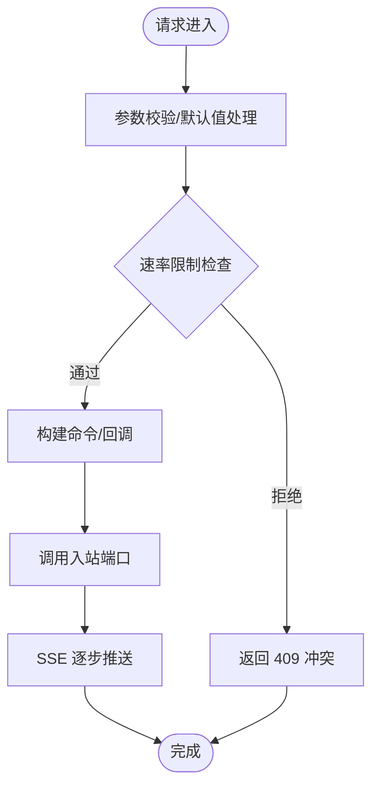

图表来源
- [Web 适配器.md:113-126](file://docs/zh/content/后端系统/适配器模块/Web 适配器.md#L113-L126)

章节来源
- [Web 适配器.md:109-126](file://docs/zh/content/后端系统/适配器模块/Web 适配器.md#L109-L126)
- [Web 适配器.md:316-321](file://docs/zh/content/后端系统/适配器模块/Web 适配器.md#L316-L321)
- [Web 适配器.md:324-340](file://docs/zh/content/后端系统/适配器模块/Web 适配器.md#L324-L340)

### WebSocket 与 SSE 支持
- 反向代理：Nginx 配置开启 SSE（关闭缓冲、禁用缓存、设置读取超时）与 WebSocket 升级头。
- 应用侧：Web 适配器通过 Spring MVC 的 SSE 发送器推送事件流，适合长连接与实时对话。

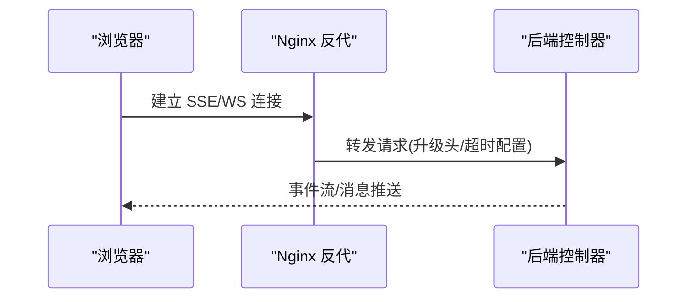

图表来源
- [nginx.conf:8-25](file://frontend/nginx.conf#L8-L25)

章节来源
- [nginx.conf:8-25](file://frontend/nginx.conf#L8-L25)
- [Web 适配器.md:109-126](file://docs/zh/content/后端系统/适配器模块/Web 适配器.md#L109-L126)

### MCP（Model Context Protocol）集成
- 协议实现：HTTP MCP 适配器封装 JSON-RPC 调用（initialize、tools/list、tools/call），支持流式客户端与远程工具特性。
- 参数提取：基于模型端口进行参数抽取，失败时回退默认参数。
- 工具注册：原生工具注册表聚合本地与远程工具特性，统一暴露给内核。
- 服务器端：MCP JSON-RPC 方法分发器负责路由与执行。

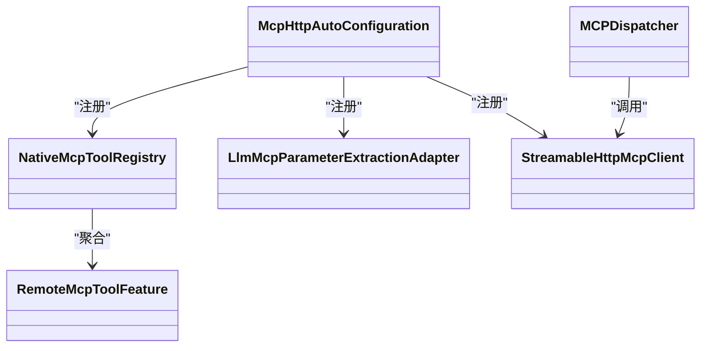

图表来源
- [MCP 适配器.md:44-76](file://docs/zh/content/后端系统/适配器模块/MCP 适配器.md#L44-L76)
- [MCPDispatcher.java:1-35](file://seahorse-agent-mcp-server/src/main/java/com/miracle/ai/seahorse/agent/adapters/mcp/server/endpoint/MCPDispatcher.java#L1-L35)

章节来源
- [MCP 适配器.md:32-99](file://docs/zh/content/后端系统/适配器模块/MCP 适配器.md#L32-L99)
- [MCPDispatcher.java:1-35](file://seahorse-agent-mcp-server/src/main/java/com/miracle/ai/seahorse/agent/adapters/mcp/server/endpoint/MCPDispatcher.java#L1-L35)
- [org.springframework.boot.autoconfigure.AutoConfiguration.imports（MCP HTTP 适配器）:1-1](file://seahorse-agent-adapter-mcp-http/src/main/resources/META-INF/spring/org.springframework.boot.autoconfigure.AutoConfiguration.imports#L1-L1)

### OpenAPI 规范解析与 API 客户端生成
- 解析器：OpenApiSpecParserAdapter 支持 OpenAPI 3.x JSON 规范，提取标题、描述与路径操作。
- 测试用例：验证最小化规范的解析与操作提取。
- 客户端生成：可基于解析结果生成 API 客户端代码（建议在上层工程中实现，本模块提供解析能力）。

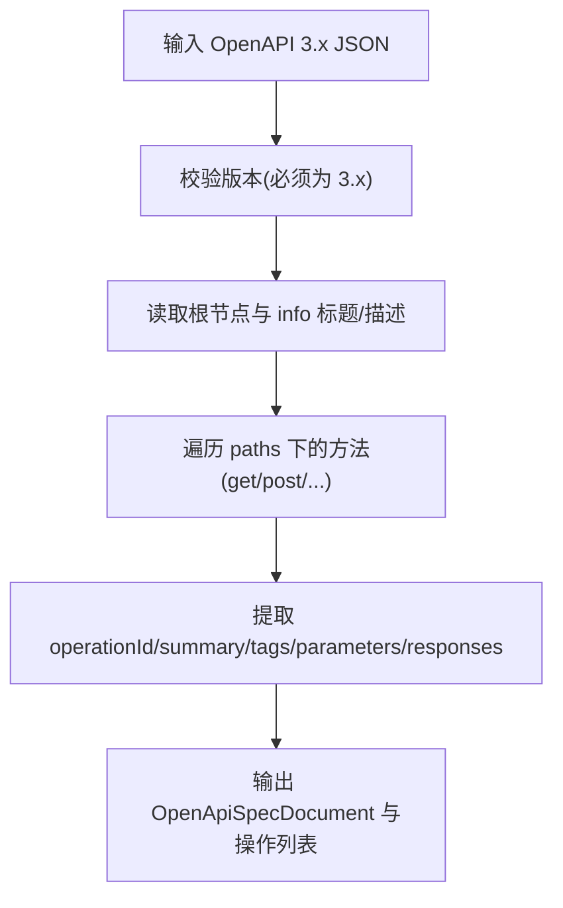

图表来源
- [OpenApiSpecParserAdapter.java:48-84](file://seahorse-agent-adapter-openapi/src/main/java/com/miracle/ai/seahorse/agent/adapters/openapi/OpenApiSpecParserAdapter.java#L48-L84)

章节来源
- [OpenApiSpecParserAdapter.java:48-84](file://seahorse-agent-adapter-openapi/src/main/java/com/miracle/ai/seahorse/agent/adapters/openapi/OpenApiSpecParserAdapter.java#L48-L84)
- [OpenApiSpecParserAdapterTests.java:30-62](file://seahorse-agent-adapter-openapi/src/test/java/com/miracle/ai/seahorse/agent/adapters/openapi/OpenApiSpecParserAdapterTests.java#L30-L62)

### 文档源系统集成：飞书文档源
- 实现原理：FeishuDocumentFetcherAdapter 基于 OkHttp 调用飞书/多鲸开放平台下载接口，支持多种来源类型（飞书文档、Lark 文档等），通过凭据解析获取访问令牌。
- 配置方法：FeishuDocumentSourceProperties 提供基础 URL、租户访问令牌路径、下载路径模板与租户访问令牌等配置项。
- 自动装配：通过 META-INF 清单声明自动配置类，启用后注册 DocumentFetcherPort 实现。

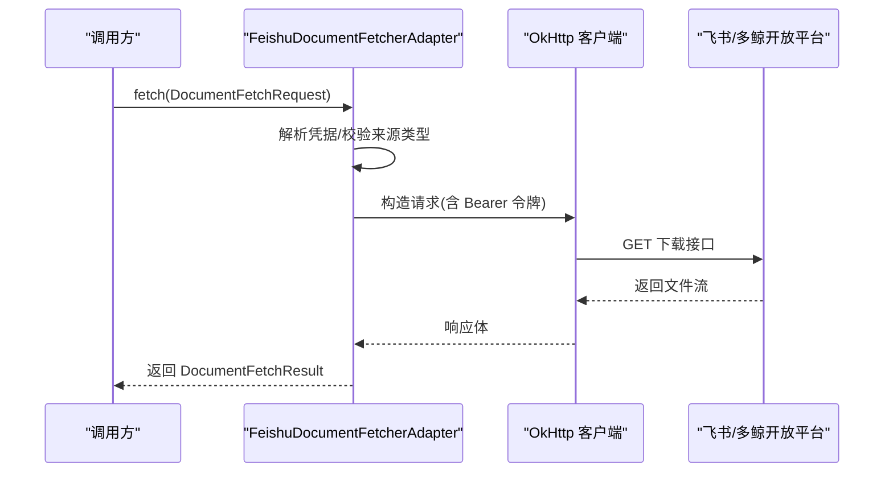

图表来源
- [FeishuDocumentFetcherAdapter.java:76-87](file://seahorse-agent-adapter-source-feishu/src/main/java/com/miracle/ai/seahorse/agent/adapters/source/feishu/FeishuDocumentFetcherAdapter.java#L76-L87)

章节来源
- [FeishuDocumentFetcherAdapter.java:67-87](file://seahorse-agent-adapter-source-feishu/src/main/java/com/miracle/ai/seahorse/agent/adapters/source/feishu/FeishuDocumentFetcherAdapter.java#L67-L87)
- [FeishuDocumentSourceProperties.java:25-31](file://seahorse-agent-adapter-source-feishu/src/main/java/com/miracle/ai/seahorse/agent/adapters/source/feishu/FeishuDocumentSourceProperties.java#L25-L31)
- [org.springframework.boot.autoconfigure.AutoConfiguration.imports（MCP HTTP 适配器）:1-1](file://seahorse-agent-adapter-mcp-http/src/main/resources/META-INF/spring/org.springframework.boot.autoconfigure.AutoConfiguration.imports#L1-L1)

### 存储系统集成：S3 兼容存储与本地存储
- 抽象设计：ObjectStoragePort 定义统一能力（确保存储桶、上传、可靠上传、打开流、按 URL 删除）。
- S3 适配器：基于 AWS SDK v2，支持创建存储桶、上传、按 s3:// URL 打开与删除。
- 本地适配器：基于本地文件系统，支持创建目录、上传、按 local:// URL 打开与删除。

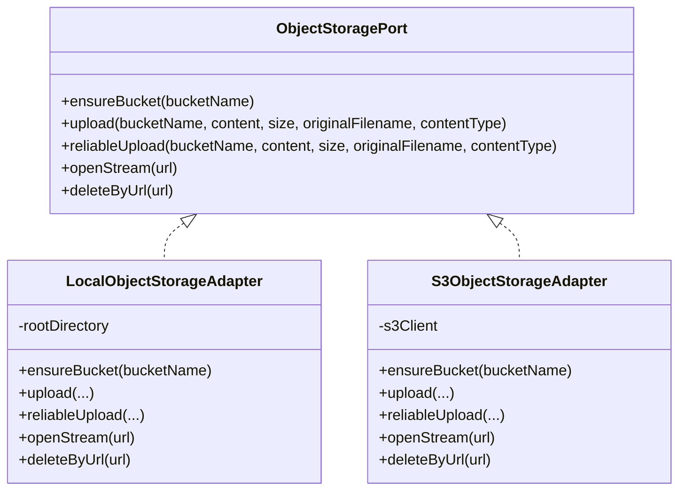

图表来源
- [向量出站端口.md:204-230](file://docs/zh/content/后端系统/核心内核/端口接口/出站端口/存储出站端口.md#L204-L230)
- [S3ObjectStorageAdapter.java:1-28](file://seahorse-agent-adapter-storage-s3/src/main/java/com/miracle/ai/seahorse/agent/adapters/storage/s3/S3ObjectStorageAdapter.java#L1-L28)
- [LocalObjectStorageAdapter.java:66-97](file://seahorse-agent-adapter-storage-local/src/main/java/com/miracle/ai/seahorse/agent/adapters/storage/local/LocalObjectStorageAdapter.java#L66-L97)

章节来源
- [向量出站端口.md:192-230](file://docs/zh/content/后端系统/核心内核/端口接口/出站端口/存储出站端口.md#L192-L230)
- [S3ObjectStorageAdapter.java:1-28](file://seahorse-agent-adapter-storage-s3/src/main/java/com/miracle/ai/seahorse/agent/adapters/storage/s3/S3ObjectStorageAdapter.java#L1-L28)
- [LocalObjectStorageAdapter.java:66-97](file://seahorse-agent-adapter-storage-local/src/main/java/com/miracle/ai/seahorse/agent/adapters/storage/local/LocalObjectStorageAdapter.java#L66-L97)

### 向量数据库集成：pgvector、Milvus
- 设计模式：内核仅依赖统一向量端口（VectorSearchPort、VectorIndexPort、VectorCollectionAdminPort），适配器对接 Milvus 与 pgvector。
- pgvector 实现：PgVectorAdapter 封装 PostgreSQL + pgvector 方言，支持 HNSW 索引、余弦距离、批量写入与集合管理。
- Milvus 实现：MilvusVectorAdapter 通过 Milvus 客户端实现索引、搜索与集合管理。

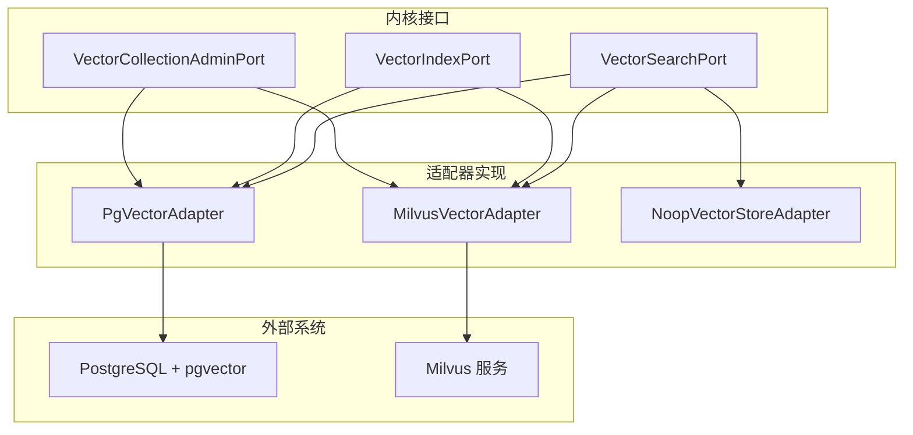

图表来源
- [向量数据库适配器.md:45-73](file://docs/zh/content/后端系统/适配器模块/向量数据库适配器.md#L45-L73)
- [向量出站端口.md:186-204](file://docs/zh/content/后端系统/核心内核/端口接口/出站端口/向量出站端口.md#L186-L204)
- [PgVectorProperties.java:28-38](file://seahorse-agent-adapter-vector-pgvector/src/main/java/com/miracle/ai/seahorse/agent/adapters/vector/pgvector/PgVectorProperties.java#L28-L38)

章节来源
- [向量数据库适配器.md:34-73](file://docs/zh/content/后端系统/适配器模块/向量数据库适配器.md#L34-L73)
- [向量出站端口.md:173-204](file://docs/zh/content/后端系统/核心内核/端口接口/出站端口/向量出站端口.md#L173-L204)
- [PgVectorProperties.java:28-38](file://seahorse-agent-adapter-vector-pgvector/src/main/java/com/miracle/ai/seahorse/agent/adapters/vector/pgvector/PgVectorProperties.java#L28-L38)

### 认证与连接池配置
- 认证：Web 适配器集成 Sa-Token 实现登录校验与拦截；登录成功后携带令牌访问受保护接口。
- 连接池：JDBC 仓储适配器使用 Spring DataSource（示例为 H2 内存库），实际部署中可替换为生产数据库连接池。
- 自动装配：通过 Spring Boot Starter 的 AutoConfiguration.imports 声明内核与原生适配器自动配置类，实现扩展装配。

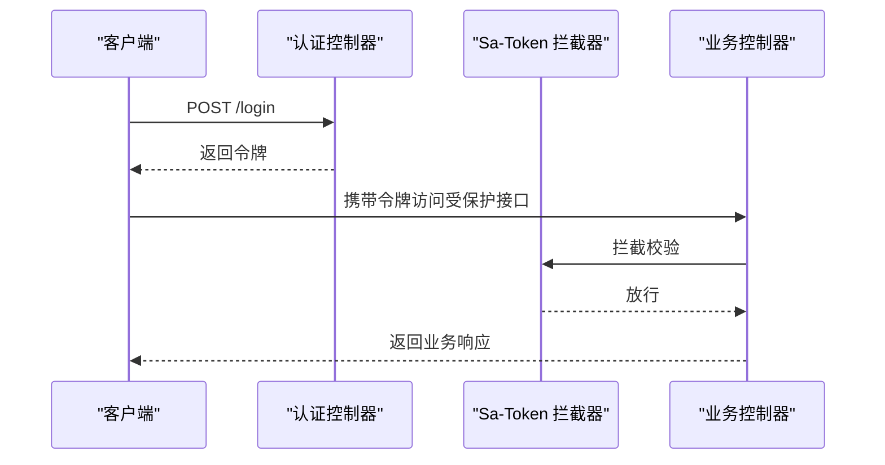

图表来源
- [Web 适配器.md:289-293](file://docs/zh/content/后端系统/适配器模块/Web 适配器.md#L289-L293)

章节来源
- [Web 适配器.md:289-293](file://docs/zh/content/后端系统/适配器模块/Web 适配器.md#L289-L293)
- [JdbcConnectorCredentialBindingRepositoryAdapter.java:149-196](file://seahorse-agent-adapter-repository-jdbc/src/main/java/com/miracle/ai/seahorse/agent/adapters/repository/jdbc/JdbcConnectorCredentialBindingRepositoryAdapter.java#L149-L196)
- [JdbcConnectorCredentialBindingRepositoryAdapterTests.java:58-92](file://seahorse-agent-adapter-repository-jdbc/src/test/java/com/miracle/ai/seahorse/agent/adapters/repository/jdbc/JdbcConnectorCredentialBindingRepositoryAdapterTests.java#L58-L92)
- [扩展加载机制.md:277-318](file://docs/zh/content/后端系统/插件系统/扩展加载机制.md#L277-L318)
- [Spring Boot 集成：自动配置与扩展装配:277-318](file://docs/zh/content/后端系统/插件系统/扩展加载机制.md#L277-L318)
- [application.properties（Spring Boot Starter）:1-200](file://seahorse-agent-spring-boot-starter/src/main/resources/application.properties#L1-L200)

## 依赖分析
- 模块依赖：Web 适配器依赖内核与 Spring Web MVC、Sa-Token；MCP 适配器依赖 OkHttp 与 Jackson；OpenAPI 适配器依赖 Jackson；存储与向量适配器依赖各自后端 SDK 或驱动。
- 组件耦合：控制器仅依赖入站端口与回调工厂，安全与异常处理作为横切关注点，保持与业务解耦。

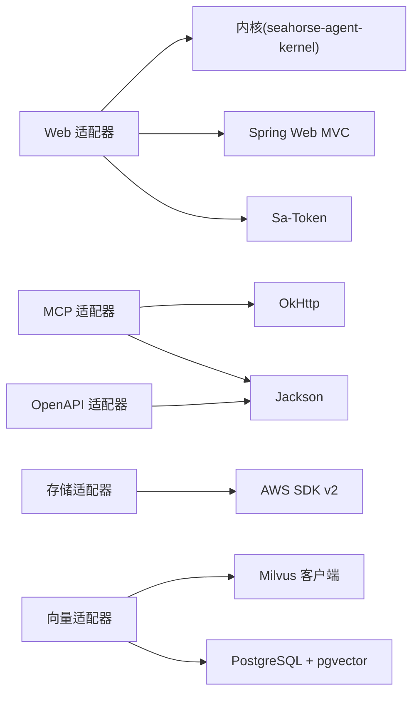

图表来源
- [Web 适配器.md:294-308](file://docs/zh/content/后端系统/适配器模块/Web 适配器.md#L294-L308)
- [MCP 适配器.md:61-76](file://docs/zh/content/后端系统/适配器模块/MCP 适配器.md#L61-L76)
- [向量数据库适配器.md:42-73](file://docs/zh/content/后端系统/适配器模块/向量数据库适配器.md#L42-L73)

章节来源
- [Web 适配器.md:294-308](file://docs/zh/content/后端系统/适配器模块/Web 适配器.md#L294-L308)
- [MCP 适配器.md:61-76](file://docs/zh/content/后端系统/适配器模块/MCP 适配器.md#L61-L76)
- [向量数据库适配器.md:42-73](file://docs/zh/content/后端系统/适配器模块/向量数据库适配器.md#L42-L73)

## 性能考虑
- SSE 超时：聊天控制器支持通过配置项设置 SSE 超时时间，避免连接长期占用。
- 速率限制：聊天接口内置用户级速率限制，防止滥用。
- 流式输出：采用 SSE 逐步推送，降低单次响应体积，提升用户体验。
- 异步与跨域：拦截器中对异步分发类型进行跳过，减少不必要的拦截开销。
- 连接池：JDBC 仓储适配器使用 Spring DataSource，建议在生产环境配置合适的连接池参数（最大连接数、空闲超时等）。

章节来源
- [Web 适配器.md:316-321](file://docs/zh/content/后端系统/适配器模块/Web 适配器.md#L316-L321)
- [JdbcConnectorCredentialBindingRepositoryAdapter.java:149-196](file://seahorse-agent-adapter-repository-jdbc/src/main/java/com/miracle/ai/seahorse/agent/adapters/repository/jdbc/JdbcConnectorCredentialBindingRepositoryAdapter.java#L149-L196)

## 故障排查指南
- 400 错误：参数非法导致 IllegalArgumentException，检查请求参数与请求体格式。
- 409 冲突：速率超限或其他状态冲突导致 IllegalStateException，降低请求频率或调整速率限制配置。
- 500 错误：未捕获异常，查看服务端日志定位异常堆栈。
- 登录校验失败：未登录或令牌无效，先执行登录接口，确保携带有效令牌。
- 文档源错误：确认来源类型支持、访问令牌有效与下载 URL 正确。
- 存储错误：S3 权限不足、URL scheme 不正确或本地路径不可写，检查配置与权限。

章节来源
- [Web 适配器.md:324-340](file://docs/zh/content/后端系统/适配器模块/Web 适配器.md#L324-L340)
- [FeishuDocumentFetcherAdapter.java:76-87](file://seahorse-agent-adapter-source-feishu/src/main/java/com/miracle/ai/seahorse/agent/adapters/source/feishu/FeishuDocumentFetcherAdapter.java#L76-L87)
- [S3ObjectStorageAdapter.java:1-28](file://seahorse-agent-adapter-storage-s3/src/main/java/com/miracle/ai/seahorse/agent/adapters/storage/s3/S3ObjectStorageAdapter.java#L1-L28)

## 结论
本项目通过 Clean Architecture 与适配器模式，将外部系统集成抽象为统一的出站端口，配合 Spring Boot 自动装配与扩展机制，实现 MCP、OpenAPI、文档源、存储与向量数据库等多类第三方系统的灵活接入。Web 适配器提供 REST/SSE 能力与安全拦截，结合速率限制与 SSE 超时配置，在保证安全性的同时提供良好的用户体验。

## 附录
- 配置模板与示例（概念性说明）
  - Web 适配器：SSE 超时、速率限制、跨域与异步分发配置项（参考 Web 适配器文档中的相关章节）。
  - Feishu 文档源：基础 URL、租户访问令牌路径、下载路径模板与租户访问令牌配置项（参考 Feishu 文档源属性类）。
  - S3 存储：AWS SDK v2 客户端配置（凭证、区域、端点）、存储桶名称与对象键命名规则（参考 S3 适配器实现）。
  - pgvector：表名、向量维度、HNSW 索引参数与余弦距离配置（参考 pgvector 属性类与向量端口文档）。
  - 认证：Sa-Token 令牌配置与拦截规则（参考 Web 适配器文档中的 Sa-Token 相关章节）。
  - 连接池：JDBC 数据源配置（示例为 H2 内存库，生产环境请替换为真实数据库并配置连接池参数）。

章节来源
- [Web 适配器.md:109-126](file://docs/zh/content/后端系统/适配器模块/Web 适配器.md#L109-L126)
- [FeishuDocumentSourceProperties.java:25-31](file://seahorse-agent-adapter-source-feishu/src/main/java/com/miracle/ai/seahorse/agent/adapters/source/feishu/FeishuDocumentSourceProperties.java#L25-L31)
- [S3ObjectStorageAdapter.java:1-28](file://seahorse-agent-adapter-storage-s3/src/main/java/com/miracle/ai/seahorse/agent/adapters/storage/s3/S3ObjectStorageAdapter.java#L1-L28)
- [PgVectorProperties.java:28-38](file://seahorse-agent-adapter-vector-pgvector/src/main/java/com/miracle/ai/seahorse/agent/adapters/vector/pgvector/PgVectorProperties.java#L28-L38)
- [JdbcConnectorCredentialBindingRepositoryAdapter.java:149-196](file://seahorse-agent-adapter-repository-jdbc/src/main/java/com/miracle/ai/seahorse/agent/adapters/repository/jdbc/JdbcConnectorCredentialBindingRepositoryAdapter.java#L149-L196)
- [application.properties（Spring Boot Starter）:1-200](file://seahorse-agent-spring-boot-starter/src/main/resources/application.properties#L1-L200)