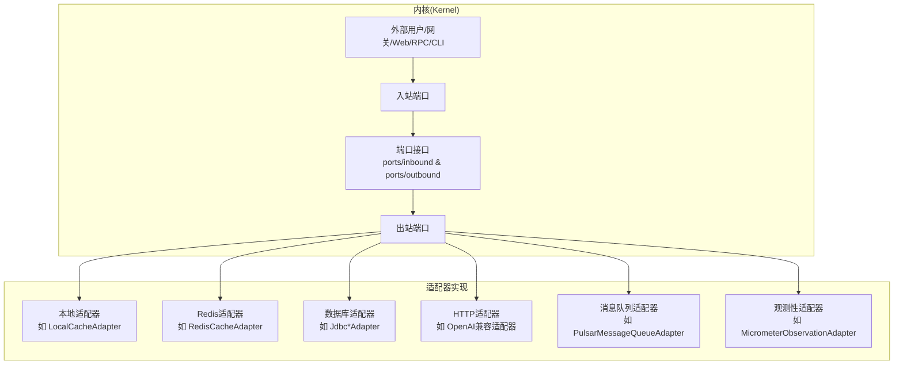
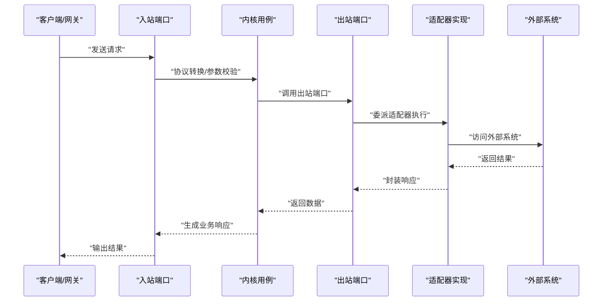
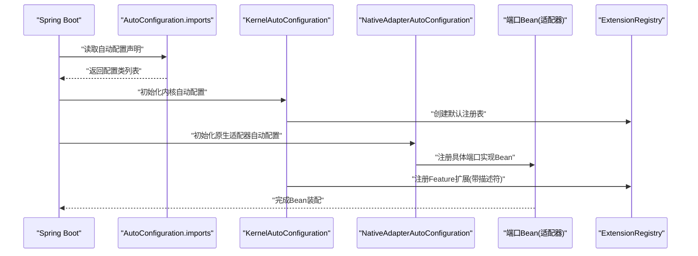
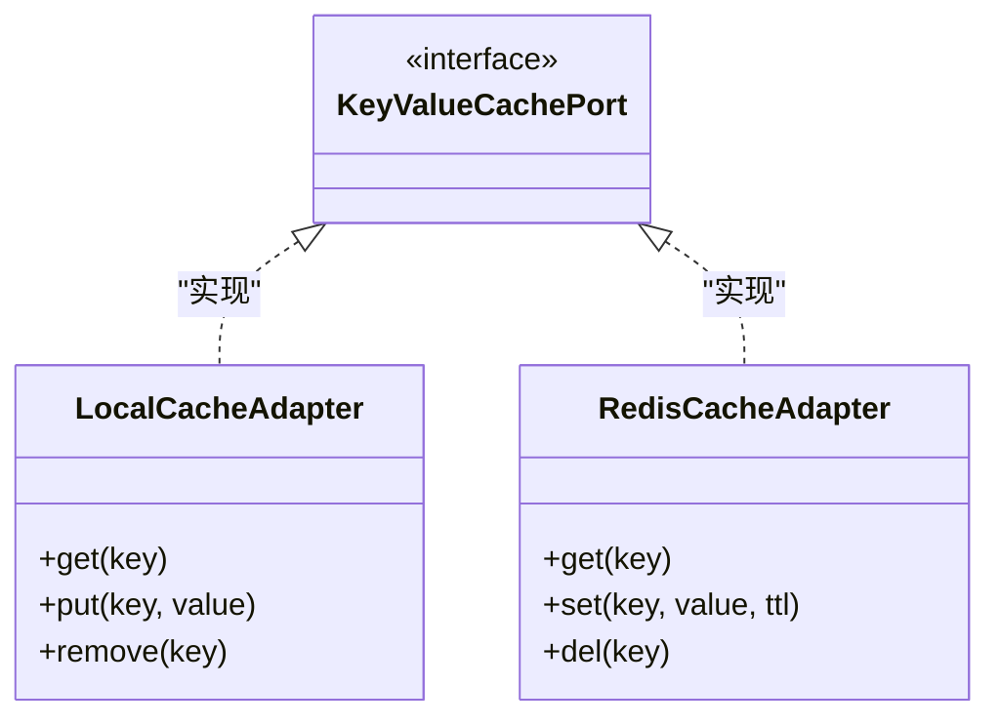
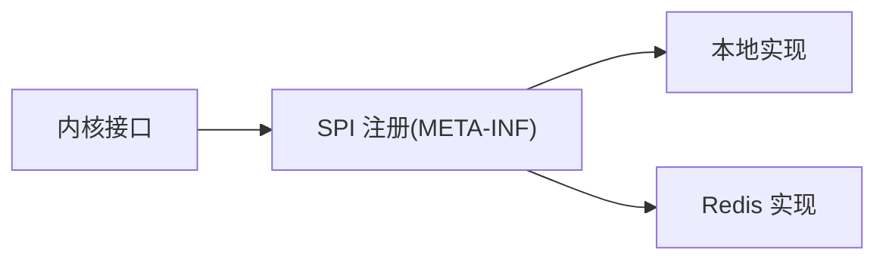
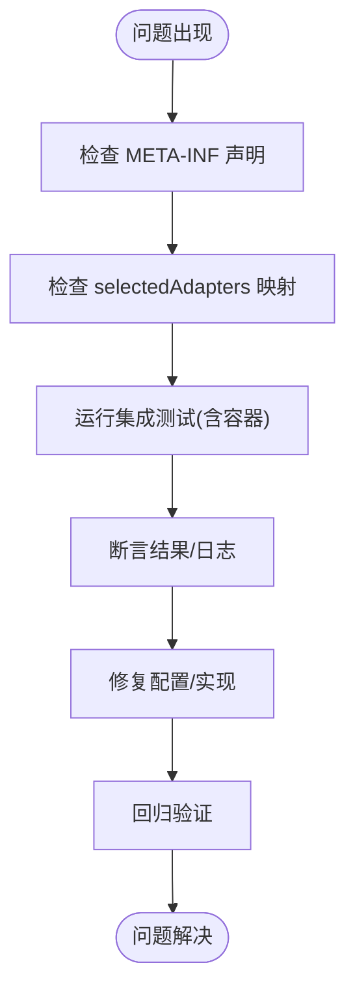

# 自定义适配器开发

<cite>
**本文引用的文件**
- [AgentAdapterProperties.java](file://seahorse-agent-spring-boot-starter/src/main/java/com/miracle/ai/seahorse/agent/adapters/spring/config/AgentAdapterProperties.java)
- [扩展加载机制.md](file://docs/zh/content/后端系统/插件系统/扩展加载机制.md)
- [端口接口.md](file://docs/zh/content/后端系统/核心内核/端口接口/端口接口.md)
- [出站端口.md](file://docs/zh/content/后端系统/核心内核/端口接口/出站端口/出站端口.md)
- [缓存出站端口.md](file://docs/zh/content/后端系统/核心内核/端口接口/出站端口/缓存出站端口.md)
- [测试策略.md](file://docs/zh/content/测试策略/测试策略.md)
- [集成测试.md](file://docs/zh/content/测试策略/集成测试.md)
- [PulsarMessageQueueAdapter.java](file://seahorse-agent-adapter-mq-pulsar/src/main/java/com/miracle/ai/seahorse/agent/adapters/mq/pulsar/PulsarMessageQueueAdapter.java)
- [LocalCacheAdapter.java](file://seahorse-agent-adapter-cache-local/src/main/java/com/miracle/ai/seahorse/agent/adapters/cache/local/LocalCacheAdapter.java)
- [RedisCacheAdapter.java](file://seahorse-agent-adapter-cache-redis/src/main/java/com/miracle/ai/seahorse/agent/adapters/cache/redis/RedisCacheAdapter.java)
- [OpenAiCompatibleMemoryRefinerAdapterTests.java](file://seahorse-agent-adapter-ai-openai-compatible/src/test/java/com/miracle/ai/seahorse/agent/adapters/ai/openai/OpenAiCompatibleMemoryRefinerAdapterTests.java)
- [OpenApiSpecParserAdapterTests.java](file://seahorse-agent-adapter-openapi/src/test/java/com/miracle/ai/seahorse/agent/adapters/openapi/OpenApiSpecParserAdapterTests.java)
- [TikaDocumentParserAdapterTests.java](file://seahorse-agent-adapter-parser-tika/src/test/java/com/miracle/ai/seahorse/agent/adapters/parser/tika/TikaDocumentParserAdapterTests.java)
- [MicrometerObservationAdapterTests.java](file://seahorse-agent-adapter-observation-micrometer/src/test/java/com/miracle/ai/seahorse/agent/adapters/observation/micrometer/MicrometerObservationAdapterTests.java)
- [SeahorseWebApiContractTests.java](file://seahorse-agent-tests/src/test/java/com/miracle/ai/seahorse/agent/adapters/web/SeahorseWebApiContractTests.java)
</cite>

## 目录
1. [引言](#引言)
2. [项目结构](#项目结构)
3. [核心组件](#核心组件)
4. [架构总览](#架构总览)
5. [详细组件分析](#详细组件分析)
6. [依赖分析](#依赖分析)
7. [性能考虑](#性能考虑)
8. [故障排查指南](#故障排查指南)
9. [结论](#结论)
10. [附录](#附录)

## 引言
本指南面向希望在 Seahorse Agent 体系中开发自定义适配器的工程师，系统讲解适配器开发的完整流程：从端口接口分析、实现类设计、配置文件编写，到入站/出站端口的差异与使用场景、端口命名规范与接口设计原则、适配器生命周期管理（初始化/运行时/销毁）、Spring Boot 自动配置与条件装配的应用，以及单元测试、集成测试与端到端测试策略。文末提供从简单 HTTP 客户端适配器到复杂数据库适配器的开发示例步骤与最佳实践。

## 项目结构
Seahorse Agent 将“内核端口接口”与“适配器实现”严格分离，通过 SPI/META-INF 配置实现运行时装配。核心结构如下：
- Kernel 端口层：定义入站/出站端口接口，位于 ports 目录，按业务域划分。
- 适配器实现层：各 adapter-* 模块提供具体实现，通过 META-INF/seahorse-agent/{端口全限定名} 声明扩展。
- Spring Boot Starter：提供自动配置与属性绑定，统一装配与选择适配器。

图表来源
- [端口接口.md:38-95](file://docs/zh/content/后端系统/核心内核/端口接口/端口接口.md#L38-L95)
- [出站端口.md:58-81](file://docs/zh/content/后端系统/核心内核/端口接口/出站端口/出站端口.md#L58-L81)

章节来源
- [端口接口.md:30-95](file://docs/zh/content/后端系统/核心内核/端口接口/端口接口.md#L30-L95)
- [出站端口.md:40-81](file://docs/zh/content/后端系统/核心内核/端口接口/出站端口/出站端口.md#L40-L81)

## 核心组件
- 入站端口（Inbound Port）：负责协议接入与请求转换，如 HTTP/RPC/CLI 到内核用例的适配。
- 出站端口（Outbound Port）：抽象与隔离外部系统，如数据库、缓存、消息队列、向量库、模型服务等。
- 适配器（Adapter）：实现具体端口接口，承载与外部系统的交互细节。
- Spring Boot 自动配置：通过 @AutoConfiguration 与 META-INF 配置，实现条件装配与端口 Bean 注入。

章节来源
- [端口接口.md:30-95](file://docs/zh/content/后端系统/核心内核/端口接口/端口接口.md#L30-L95)
- [扩展加载机制.md:277-302](file://docs/zh/content/后端系统/插件系统/扩展加载机制.md#L277-L302)

## 架构总览
下图展示从客户端到内核再到适配器的典型调用链，强调端口解耦与适配器可替换性。

图表来源
- [端口接口.md:85-95](file://docs/zh/content/后端系统/核心内核/端口接口/端口接口.md#L85-L95)

## 详细组件分析

### 入站端口与出站端口：区别与使用场景
- 入站端口：面向外部协议接入，负责参数解析、鉴权、限流与协议转换，不直接依赖外部系统。
- 出站端口：面向内部用例，抽象对外部系统的访问，便于替换实现（如本地/Redis/云服务）。
- 使用场景举例：
  - 入站：Web 控制器、RPC 网关、CLI 子命令。
  - 出站：缓存读写、消息发布/订阅、向量检索、对象存储上传下载、数据库 CRUD、模型推理。

章节来源
- [端口接口.md:30-95](file://docs/zh/content/后端系统/核心内核/端口接口/端口接口.md#L30-L95)

### 端口命名规范与接口设计原则
- 命名规范：
  - 端口类名采用“领域名词 + Port”结构，如 KeyValueCachePort、MessageQueuePort、ObjectStoragePort。
  - 包路径按“ports.inbound/或 ports.outbound + 领域”组织。
- 设计原则：
  - 单一职责：每个端口只暴露一个稳定的业务契约。
  - 不依赖具体实现：内核仅依赖接口，不关心适配器类型。
  - 可测试性：接口方法清晰、输入输出明确，便于桩/Mock。
  - 可观察性：必要时提供上下文参数（如 traceId）以便追踪。

章节来源
- [出站端口.md:40-81](file://docs/zh/content/后端系统/核心内核/端口接口/出站端口/出站端口.md#L40-L81)

### 适配器生命周期管理
- 初始化：通过 Spring Bean 生命周期创建，注入依赖（如配置、客户端、连接池）。
- 运行时管理：处理请求、调用外部系统、记录指标/日志、错误处理与重试策略。
- 销毁：释放资源（连接、线程池、文件句柄等），确保优雅停机。

章节来源
- [扩展加载机制.md:277-302](file://docs/zh/content/后端系统/插件系统/扩展加载机制.md#L277-L302)

### Spring Boot 自动配置与条件装配
- 自动配置声明：通过 AutoConfiguration.imports 声明内核与原生适配器自动配置类。
- 内核自动配置：创建 ExtensionRegistry，注册 Feature 扩展。
- 原生适配器自动配置：注册具体端口实现 Bean，适配器模块通过 META-INF/seahorse-agent/{端口FQCN} 声明扩展清单。
- 属性绑定：通过 AgentAdapterProperties 读取 selectedAdapters 与 adapterSettings，按端口名选择适配器实现。

图表来源
- [扩展加载机制.md:286-302](file://docs/zh/content/后端系统/插件系统/扩展加载机制.md#L286-L302)

章节来源
- [AgentAdapterProperties.java:33-57](file://seahorse-agent-spring-boot-starter/src/main/java/com/miracle/ai/seahorse/agent/adapters/spring/config/AgentAdapterProperties.java#L33-L57)
- [扩展加载机制.md:277-302](file://docs/zh/content/后端系统/插件系统/扩展加载机制.md#L277-L302)

### 适配器实现类设计与配置文件编写
- 实现类设计：
  - 实现对应出站端口接口，注入所需依赖（客户端、配置、工具类）。
  - 明确异常处理策略与重试/熔断策略（如适用）。
  - 提供最小可行的单元测试与集成测试。
- 配置文件编写：
  - META-INF/seahorse-agent/{端口全限定名}：声明该端口的实现类。
  - application.properties/yml：通过属性绑定选择适配器（如 selectedAdapters、adapterSettings）。

章节来源
- [缓存出站端口.md:364-378](file://docs/zh/content/后端系统/核心内核/端口接口/出站端口/缓存出站端口.md#L364-L378)

### 适配器开发示例

#### 示例一：简单 HTTP 客户端适配器
- 目标：实现一个 HTTP 客户端适配器，对接第三方模型服务。
- 步骤：
  1) 分析端口：确定需要实现的出站端口（如模型推理相关端口）。
  2) 设计实现：创建适配器类，注入 HTTP 客户端与配置，实现端口方法。
  3) 编写配置：在 META-INF/seahorse-agent/ 中声明该端口的实现类。
  4) 配置选择：在 application.properties 中通过 selectedAdapters 指定该端口使用的适配器。
  5) 测试：编写单元测试（Mock 客户端）与集成测试（Mock 服务）。

章节来源
- [OpenAiCompatibleMemoryRefinerAdapterTests.java](file://seahorse-agent-adapter-ai-openai-compatible/src/test/java/com/miracle/ai/seahorse/agent/adapters/ai/openai/OpenAiCompatibleMemoryRefinerAdapterTests.java)
- [OpenApiSpecParserAdapterTests.java](file://seahorse-agent-adapter-openapi/src/test/java/com/miracle/ai/seahorse/agent/adapters/openapi/OpenApiSpecParserAdapterTests.java)
- [TikaDocumentParserAdapterTests.java](file://seahorse-agent-adapter-parser-tika/src/test/java/com/miracle/ai/seahorse/agent/adapters/parser/tika/TikaDocumentParserAdapterTests.java)

#### 示例二：复杂数据库适配器（JDBC）
- 目标：实现知识库/文档/块等实体的 CRUD 与分页查询。
- 步骤：
  1) 分析端口：识别知识库/文档/块相关的仓储端口。
  2) 设计实现：创建 Jdbc*Adapter，封装 SQL 与分页逻辑，处理唯一性约束与软删除。
  3) 编写配置：在 META-INF/seahorse-agent/ 中声明对应端口实现。
  4) 配置选择：通过属性绑定选择 JDBC 适配器。
  5) 测试：使用内存数据库初始化表结构，插入测试数据，断言 CRUD/分页/计数结果。

章节来源
- [集成测试.md:238-254](file://docs/zh/content/测试策略/集成测试.md#L238-L254)

### 类关系与依赖（以缓存端口为例）

图表来源
- [缓存出站端口.md:364-378](file://docs/zh/content/后端系统/核心内核/端口接口/出站端口/缓存出站端口.md#L364-L378)
- [LocalCacheAdapter.java](file://seahorse-agent-adapter-cache-local/src/main/java/com/miracle/ai/seahorse/agent/adapters/cache/local/LocalCacheAdapter.java)
- [RedisCacheAdapter.java](file://seahorse-agent-adapter-cache-redis/src/main/java/com/miracle/ai/seahorse/agent/adapters/cache/redis/RedisCacheAdapter.java)

## 依赖分析
- 接口与实现解耦：内核仅定义端口接口，具体实现通过 SPI/META-INF 注入，降低耦合度。
- 适配器分布：本地实现与云/中间件实现（如 Redis、Pulsar、Milvus、PostgreSQL）并存。
- 配置映射：各端口在本地与 Redis 适配器中均有对应的 SPI 映射文件，确保运行时正确加载。

图表来源
- [缓存出站端口.md:364-378](file://docs/zh/content/后端系统/核心内核/端口接口/出站端口/缓存出站端口.md#L364-L378)

章节来源
- [缓存出站端口.md:364-378](file://docs/zh/content/后端系统/核心内核/端口接口/出站端口/缓存出站端口.md#L364-L378)

## 性能考虑
- 连接池与超时：为外部系统配置合理的连接池大小、超时与重试策略。
- 缓存命中：优先使用缓存端口减少外部调用，合理设置 TTL 与失效策略。
- 异步与批量：对高延迟外部系统采用异步调用与批量操作提升吞吐。
- 观测性：通过 Micrometer 等适配器记录指标，定位性能瓶颈。

章节来源
- [MicrometerObservationAdapterTests.java](file://seahorse-agent-adapter-observation-micrometer/src/test/java/com/miracle/ai/seahorse/agent/adapters/observation/micrometer/MicrometerObservationAdapterTests.java)

## 故障排查指南
- 端口不可用：检查是否正确声明了 META-INF/seahorse-agent/{端口FQCN}，确认 Bean 已被注册。
- 适配器未生效：确认 application.properties 中 selectedAdapters 是否正确映射到端口名。
- 集成测试失败：使用 Testcontainers 启动依赖容器（PostgreSQL/Milvus/Pulsar），确保初始化脚本与测试数据一致。
- Web API 合约测试：通过 MockMvc 验证控制器到内核端口的调用链路，断言状态码与响应结构。

章节来源
- [集成测试.md:123-144](file://docs/zh/content/测试策略/集成测试.md#L123-L144)
- [SeahorseWebApiContractTests.java](file://seahorse-agent-tests/src/test/java/com/miracle/ai/seahorse/agent/adapters/web/SeahorseWebApiContractTests.java)

## 结论
通过严格的端口接口设计与适配器模式，Seahorse Agent 实现了业务逻辑与外部系统的解耦。开发者只需专注于端口契约与实现细节，配合 Spring Boot 自动配置与属性绑定，即可快速切换与扩展适配器。建议在开发过程中遵循命名规范、单一职责与可测试性原则，并配套完善的单元/集成/端到端测试，确保质量与可维护性。

## 附录
- 端口接口文档：参见“核心内核/端口接口”系列文档。
- 自动配置与扩展装配：参见“插件系统/扩展加载机制”文档。
- 测试策略：参见“测试策略”系列文档。