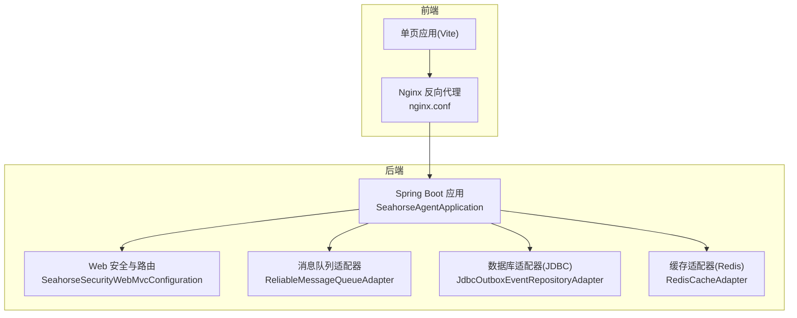
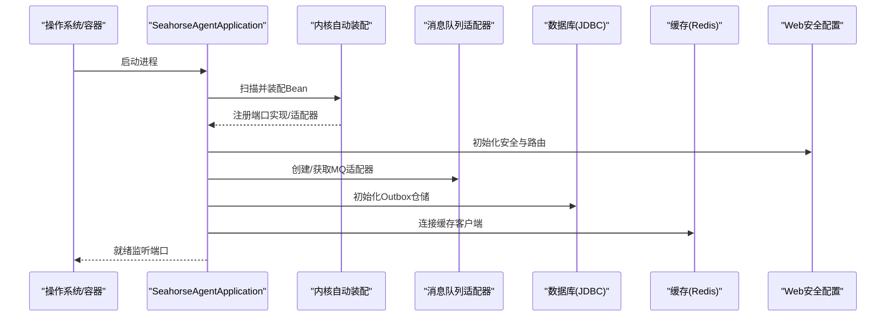
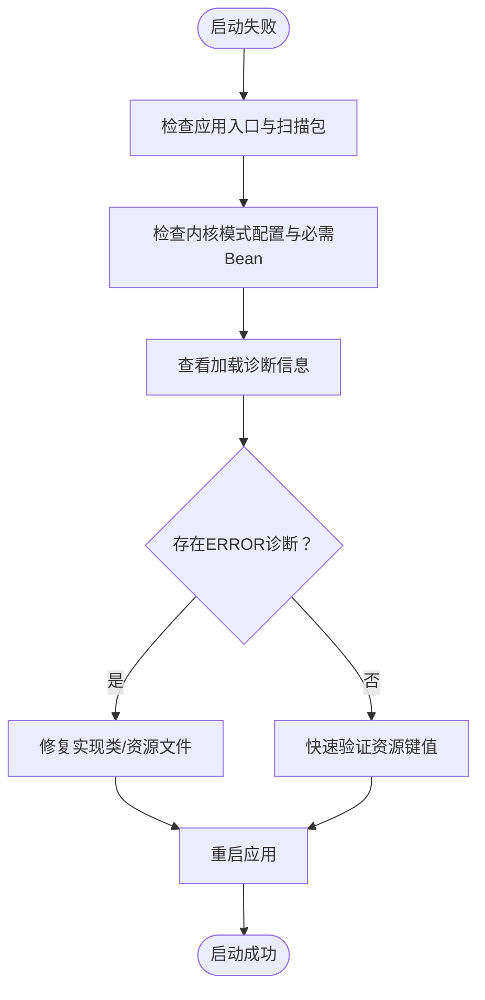
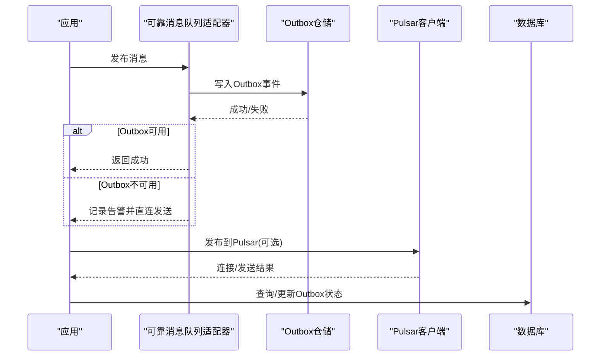
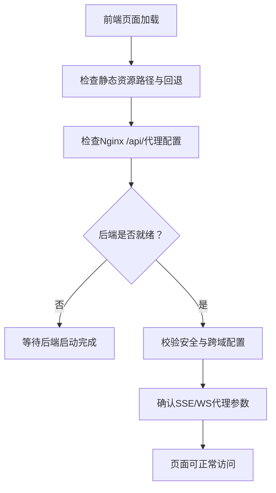
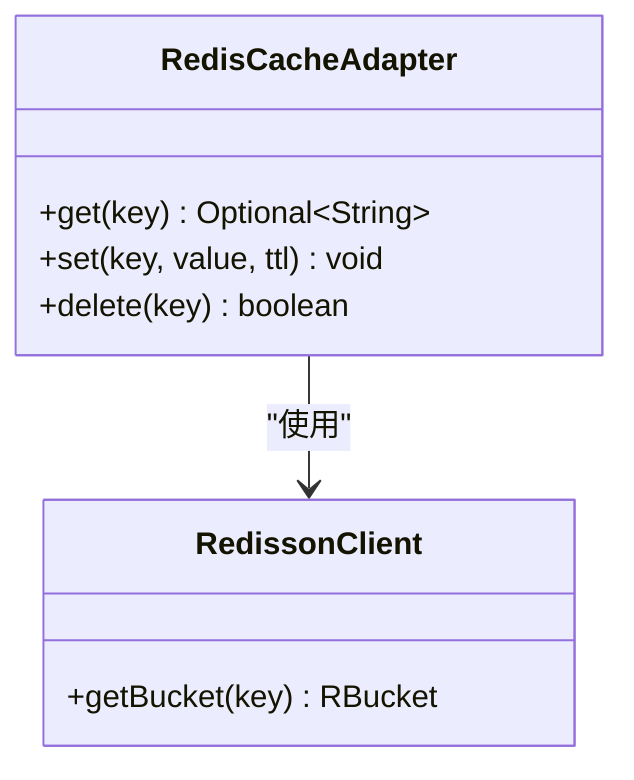
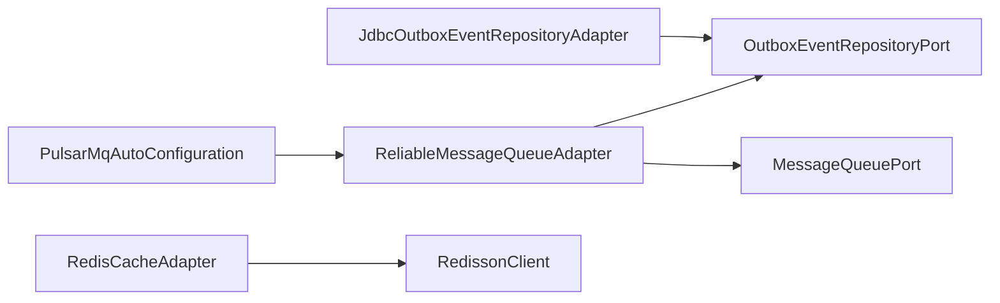

# 常见问题解决

<cite>
**本文引用的文件**
- [SeahorseAgentApplication.java](file://seahorse-agent-bootstrap/src/main/java/com/miracle/ai/seahorse/agent/SeahorseAgentApplication.java)
- [application.properties](file://seahorse-agent-bootstrap/src/main/resources/application.properties)
- [SeahorseAgentKernelAutoConfiguration.java](file://seahorse-agent-spring-boot-starter/src/main/java/com/miracle/ai/seahorse/agent/adapters/spring/SeahorseAgentKernelAutoConfiguration.java)
- [故障排查.md](file://docs/zh/content/监控运维/故障排查.md)
- [加载机制.md](file://docs/zh/content/后端系统/核心内核/插件系统/加载机制.md)
- [PortWrapperDiagnostic.java](file://seahorse-agent-kernel/src/main/java/com/miracle/ai/seahorse/agent/kernel/plugin/wrapper/PortWrapperDiagnostic.java)
- [PortWrapperChainSnapshot.java](file://seahorse-agent-kernel/src/main/java/com/miracle/ai/seahorse/agent/kernel/plugin/wrapper/PortWrapperChainSnapshot.java)
- [SeahorseAgentNoopPortGuard.java](file://seahorse-agent-spring-boot-starter/src/main/java/com/miracle/ai/seahorse/agent/adapters/spring/SeahorseAgentNoopPortGuard.java)
- [消息队列出站端口.md](file://docs/zh/content/后端系统/核心内核/端口接口/出站端口/消息队列出站端口.md)
- [ReliableMessageQueueAdapter.java](file://seahorse-agent-spring-boot-starter/src/main/java/com/miracle/ai/seahorse/agent/adapters/spring/mq/ReliableMessageQueueAdapter.java)
- [SeahorseAgentMqAdapterAutoConfiguration.java](file://seahorse-agent-spring-boot-starter/src/main/java/com/miracle/ai/seahorse/agent/adapters/spring/SeahorseAgentMqAdapterAutoConfiguration.java)
- [OutboxEventRepositoryPort.java](file://seahorse-agent-kernel/src/main/java/com/miracle/ai/seahorse/agent/ports/outbound/mq/OutboxEventRepositoryPort.java)
- [JdbcOutboxEventRepositoryAdapter.java](file://seahorse-agent-adapter-repository-jdbc/src/main/java/com/miracle/ai/seahorse/agent/adapters/repository/jdbc/JdbcOutboxEventRepositoryAdapter.java)
- [PulsarMessageQueueProperties.java](file://seahorse-agent-adapter-mq-pulsar/src/main/java/com/miracle/ai/seahorse/agent/adapters/mq/pulsar/PulsarMessageQueueProperties.java)
- [enterprise-mode.md](file://docs/deployment/enterprise-mode.md)
- [nginx.conf](file://frontend/nginx.conf)
- [SeahorseSecurityWebMvcConfiguration.java](file://seahorse-agent-adapter-web/src/main/java/com/miracle/ai/seahorse/agent/adapters/web/SeahorseSecurityWebMvcConfiguration.java)
- [RedisCacheAdapter.java](file://seahorse-agent-adapter-cache-redis/src/main/java/com/miracle/ai/seahorse/agent/adapters/cache/redis/RedisCacheAdapter.java)
- [docker-compose.yml](file://docker-compose.yml)
</cite>

## 目录
1. [简介](#简介)
2. [项目结构](#项目结构)
3. [核心组件](#核心组件)
4. [架构总览](#架构总览)
5. [详细组件分析](#详细组件分析)
6. [依赖关系分析](#依赖关系分析)
7. [性能与资源问题](#性能与资源问题)
8. [故障排查指南](#故障排查指南)
9. [结论](#结论)
10. [附录](#附录)

## 简介
本指南面向Seahorse Agent的运维与开发人员，聚焦启动失败、连接超时、内存与资源耗尽、数据库连接、前端页面加载、缓存问题以及常用工具命令的快速定位与修复方法。内容基于仓库内的实际代码与文档，提供可操作的诊断步骤与图示说明。

## 项目结构
- 后端以Spring Boot Starter为核心，通过自动装配加载内核与适配器，支持多种消息队列、缓存、存储与向量检索实现。
- 前端采用Vite构建并通过Nginx反向代理到后端服务，提供SPA路由与SSE/WS支持。
- Docker Compose用于本地或生产环境的一键部署。

图表来源
- [SeahorseAgentApplication.java:1-120](file://seahorse-agent-bootstrap/src/main/java/com/miracle/ai/seahorse/agent/SeahorseAgentApplication.java#L1-L120)
- [SeahorseSecurityWebMvcConfiguration.java:1-120](file://seahorse-agent-adapter-web/src/main/java/com/miracle/ai/seahorse/agent/adapters/web/SeahorseSecurityWebMvcConfiguration.java#L1-L120)
- [ReliableMessageQueueAdapter.java:1-120](file://seahorse-agent-spring-boot-starter/src/main/java/com/miracle/ai/seahorse/agent/adapters/spring/mq/ReliableMessageQueueAdapter.java#L1-L120)
- [JdbcOutboxEventRepositoryAdapter.java:1-120](file://seahorse-agent-adapter-repository-jdbc/src/main/java/com/miracle/ai/seahorse/agent/adapters/repository/jdbc/JdbcOutboxEventRepositoryAdapter.java#L1-L120)
- [RedisCacheAdapter.java:1-120](file://seahorse-agent-adapter-cache-redis/src/main/java/com/miracle/ai/seahorse/agent/adapters/cache/redis/RedisCacheAdapter.java#L1-L120)
- [nginx.conf:1-31](file://frontend/nginx.conf#L1-L31)

章节来源
- [SeahorseAgentApplication.java:1-120](file://seahorse-agent-bootstrap/src/main/java/com/miracle/ai/seahorse/agent/SeahorseAgentApplication.java#L1-L120)
- [nginx.conf:1-31](file://frontend/nginx.conf#L1-L31)

## 核心组件
- 应用入口与内核装配：应用入口负责启动Spring Boot，内核自动装配负责加载内核能力与端口实现。
- 消息队列：可靠消息队列适配器封装普通MQ与Outbox持久化发布，支持直连与Pulsar。
- 数据库：JDBC适配器实现Outbox事件仓储，保障消息可靠投递。
- 缓存：Redis适配器基于Redisson提供KV、分布式锁、Pub/Sub与限流等能力。
- 前端：Nginx反向代理统一暴露API与静态资源，支持SSE与WebSocket。

章节来源
- [SeahorseAgentKernelAutoConfiguration.java:188-431](file://seahorse-agent-spring-boot-starter/src/main/java/com/miracle/ai/seahorse/agent/adapters/spring/SeahorseAgentKernelAutoConfiguration.java#L188-L431)
- [ReliableMessageQueueAdapter.java:1-120](file://seahorse-agent-spring-boot-starter/src/main/java/com/miracle/ai/seahorse/agent/adapters/spring/mq/ReliableMessageQueueAdapter.java#L1-L120)
- [JdbcOutboxEventRepositoryAdapter.java:1-120](file://seahorse-agent-adapter-repository-jdbc/src/main/java/com/miracle/ai/seahorse/agent/adapters/repository/jdbc/JdbcOutboxEventRepositoryAdapter.java#L1-L120)
- [RedisCacheAdapter.java:1-120](file://seahorse-agent-adapter-cache-redis/src/main/java/com/miracle/ai/seahorse/agent/adapters/cache/redis/RedisCacheAdapter.java#L1-L120)

## 架构总览
以下图展示启动期与运行期的关键交互，以及常见故障点的定位入口。

图表来源
- [SeahorseAgentApplication.java:1-120](file://seahorse-agent-bootstrap/src/main/java/com/miracle/ai/seahorse/agent/SeahorseAgentApplication.java#L1-L120)
- [SeahorseAgentKernelAutoConfiguration.java:188-431](file://seahorse-agent-spring-boot-starter/src/main/java/com/miracle/ai/seahorse/agent/adapters/spring/SeahorseAgentKernelAutoConfiguration.java#L188-L431)
- [ReliableMessageQueueAdapter.java:1-120](file://seahorse-agent-spring-boot-starter/src/main/java/com/miracle/ai/seahorse/agent/adapters/spring/mq/ReliableMessageQueueAdapter.java#L1-L120)
- [JdbcOutboxEventRepositoryAdapter.java:1-120](file://seahorse-agent-adapter-repository-jdbc/src/main/java/com/miracle/ai/seahorse/agent/adapters/repository/jdbc/JdbcOutboxEventRepositoryAdapter.java#L1-L120)
- [RedisCacheAdapter.java:1-120](file://seahorse-agent-adapter-cache-redis/src/main/java/com/miracle/ai/seahorse/agent/adapters/cache/redis/RedisCacheAdapter.java#L1-L120)

## 详细组件分析

### 启动失败诊断与修复
- 入口与扫描包
  - 确认应用入口类与扫描包配置正确，避免组件未被发现。
  - 参考入口类与内核自动装配清单进行比对。
- 内核模式与必需Bean
  - 检查内核模式配置项是否存在且有效。
  - 确认自动装配已加载内核编排、特征与端口实现。
- 插件加载与健康检查
  - 利用加载诊断信息定位实现类与错误原因。
  - 若存在ERROR级别诊断，优先修复对应实现或资源文件。
- 快速验证
  - 对照测试资源与适配器资源文件，确保键名与值格式正确。

图表来源
- [故障排查.md:365-380](file://docs/zh/content/监控运维/故障排查.md#L365-L380)
- [加载机制.md:297-319](file://docs/zh/content/后端系统/核心内核/插件系统/加载机制.md#L297-L319)
- [PortWrapperDiagnostic.java:33-44](file://seahorse-agent-kernel/src/main/java/com/miracle/ai/seahorse/agent/kernel/plugin/wrapper/PortWrapperDiagnostic.java#L33-L44)
- [PortWrapperChainSnapshot.java:36-50](file://seahorse-agent-kernel/src/main/java/com/miracle/ai/seahorse/agent/kernel/plugin/wrapper/PortWrapperChainSnapshot.java#L36-L50)

章节来源
- [SeahorseAgentApplication.java:1-120](file://seahorse-agent-bootstrap/src/main/java/com/miracle/ai/seahorse/agent/SeahorseAgentApplication.java#L1-L120)
- [application.properties:1-50](file://seahorse-agent-bootstrap/src/main/resources/application.properties#L1-L50)
- [SeahorseAgentKernelAutoConfiguration.java:188-431](file://seahorse-agent-spring-boot-starter/src/main/java/com/miracle/ai/seahorse/agent/adapters/spring/SeahorseAgentKernelAutoConfiguration.java#L188-L431)
- [故障排查.md:365-380](file://docs/zh/content/监控运维/故障排查.md#L365-L380)
- [加载机制.md:297-319](file://docs/zh/content/后端系统/核心内核/插件系统/加载机制.md#L297-L319)
- [PortWrapperDiagnostic.java:33-44](file://seahorse-agent-kernel/src/main/java/com/miracle/ai/seahorse/agent/kernel/plugin/wrapper/PortWrapperDiagnostic.java#L33-L44)
- [PortWrapperChainSnapshot.java:36-50](file://seahorse-agent-kernel/src/main/java/com/miracle/ai/seahorse/agent/kernel/plugin/wrapper/PortWrapperChainSnapshot.java#L36-L50)

### 连接超时排查（数据库、消息队列、外部API）
- 数据库连接
  - Outbox事件仓储依赖JDBC连接，检查数据源配置与网络可达性。
  - 关注SQL插入、批量领取与状态更新逻辑，确保事务与索引正常。
- 消息队列连接
  - 可靠消息队列适配器在无Outbox仓储时降级为直连发送并记录告警。
  - Pulsar适配器依赖PulsarClient，检查客户端初始化与属性配置。
- 外部API调用
  - 若涉及HTTP MCP或其他外部服务，检查超时、鉴权与网络连通性。

图表来源
- [ReliableMessageQueueAdapter.java:1-120](file://seahorse-agent-spring-boot-starter/src/main/java/com/miracle/ai/seahorse/agent/adapters/spring/mq/ReliableMessageQueueAdapter.java#L1-L120)
- [SeahorseAgentMqAdapterAutoConfiguration.java:50-81](file://seahorse-agent-spring-boot-starter/src/main/java/com/miracle/ai/seahorse/agent/adapters/spring/SeahorseAgentMqAdapterAutoConfiguration.java#L50-L81)
- [OutboxEventRepositoryPort.java:1-39](file://seahorse-agent-kernel/src/main/java/com/miracle/ai/seahorse/agent/ports/outbound/mq/OutboxEventRepositoryPort.java#L1-L39)
- [JdbcOutboxEventRepositoryAdapter.java:1-120](file://seahorse-agent-adapter-repository-jdbc/src/main/java/com/miracle/ai/seahorse/agent/adapters/repository/jdbc/JdbcOutboxEventRepositoryAdapter.java#L1-L120)
- [PulsarMessageQueueProperties.java:1-120](file://seahorse-agent-adapter-mq-pulsar/src/main/java/com/miracle/ai/seahorse/agent/adapters/mq/pulsar/PulsarMessageQueueProperties.java#L1-L120)

章节来源
- [ReliableMessageQueueAdapter.java:1-120](file://seahorse-agent-spring-boot-starter/src/main/java/com/miracle/ai/seahorse/agent/adapters/spring/mq/ReliableMessageQueueAdapter.java#L1-L120)
- [SeahorseAgentMqAdapterAutoConfiguration.java:50-81](file://seahorse-agent-spring-boot-starter/src/main/java/com/miracle/ai/seahorse/agent/adapters/spring/SeahorseAgentMqAdapterAutoConfiguration.java#L50-L81)
- [OutboxEventRepositoryPort.java:1-39](file://seahorse-agent-kernel/src/main/java/com/miracle/ai/seahorse/agent/ports/outbound/mq/OutboxEventRepositoryPort.java#L1-L39)
- [JdbcOutboxEventRepositoryAdapter.java:1-120](file://seahorse-agent-adapter-repository-jdbc/src/main/java/com/miracle/ai/seahorse/agent/adapters/repository/jdbc/JdbcOutboxEventRepositoryAdapter.java#L1-L120)
- [PulsarMessageQueueProperties.java:1-120](file://seahorse-agent-adapter-mq-pulsar/src/main/java/com/miracle/ai/seahorse/agent/adapters/mq/pulsar/PulsarMessageQueueProperties.java#L1-L120)

### 内存不足与资源耗尽
- JVM参数调优
  - 在容器或系统层面设置堆大小、GC策略与线程栈大小，避免频繁Full GC。
- 容器资源限制
  - 调整CPU/内存限额与HPA阈值，避免被K8s强制终止。
- 适配器与连接池
  - 适当缩小消息队列与缓存客户端的连接池大小，降低峰值内存占用。
- 观测与告警
  - 结合Micrometer观测指标，建立内存与线程池饱和告警。

[本节为通用指导，无需特定文件引用]

### 数据库连接问题诊断
- 连接池配置
  - 检查数据源URL、用户名、密码与连接池参数（最大连接数、空闲超时、连接超时）。
- 网络连通性
  - 使用ping/nc/telnet验证数据库主机与端口可达。
- 权限验证
  - 确认数据库用户具备DDL/DML权限，且表结构与索引完整。
- Outbox状态与重试
  - 关注Outbox事件的状态推进与重试时间计算，避免堆积。

章节来源
- [JdbcOutboxEventRepositoryAdapter.java:1-120](file://seahorse-agent-adapter-repository-jdbc/src/main/java/com/miracle/ai/seahorse/agent/adapters/repository/jdbc/JdbcOutboxEventRepositoryAdapter.java#L1-L120)
- [OutboxEventRepositoryPort.java:1-39](file://seahorse-agent-kernel/src/main/java/com/miracle/ai/seahorse/agent/ports/outbound/mq/OutboxEventRepositoryPort.java#L1-L39)

### 前端页面加载失败
- 静态资源访问
  - Nginx根目录与索引页配置需正确，确保SPA回退到index.html。
- API接口调用
  - 检查/api/前缀代理到后端地址与端口，确认后端已就绪。
- 跨域与安全
  - Web安全配置对公开路径与前缀有明确白名单，确保接口路径在允许范围内。
- SSE/WS支持
  - 确保代理开启SSE与WebSocket升级头。

图表来源
- [nginx.conf:1-31](file://frontend/nginx.conf#L1-L31)
- [SeahorseSecurityWebMvcConfiguration.java:1-120](file://seahorse-agent-adapter-web/src/main/java/com/miracle/ai/seahorse/agent/adapters/web/SeahorseSecurityWebMvcConfiguration.java#L1-L120)

章节来源
- [nginx.conf:1-31](file://frontend/nginx.conf#L1-L31)
- [SeahorseSecurityWebMvcConfiguration.java:1-120](file://seahorse-agent-adapter-web/src/main/java/com/miracle/ai/seahorse/agent/adapters/web/SeahorseSecurityWebMvcConfiguration.java#L1-L120)

### 缓存相关问题（Redis）
- 连接失败
  - 检查Redis地址、端口与认证配置，确认网络连通与防火墙放行。
- 缓存失效
  - 核对键前缀与TTL设置，避免误删或过期策略不当。
- 适配器行为
  - RedisCacheAdapter提供KV读写与删除，注意空值处理与默认TTL行为。

图表来源
- [RedisCacheAdapter.java:1-120](file://seahorse-agent-adapter-cache-redis/src/main/java/com/miracle/ai/seahorse/agent/adapters/cache/redis/RedisCacheAdapter.java#L1-L120)

章节来源
- [RedisCacheAdapter.java:1-120](file://seahorse-agent-adapter-cache-redis/src/main/java/com/miracle/ai/seahorse/agent/adapters/cache/redis/RedisCacheAdapter.java#L1-L120)

## 依赖关系分析
- 组件耦合
  - 可靠消息队列适配器依赖Outbox仓储与消息队列端口，形成“可靠发布”闭环。
  - Pulsar适配器在存在PulsarClient时启用，否则回退至直连。
- 外部依赖
  - Redisson用于Redis客户端，JDBC驱动用于数据库，Pulsar客户端用于消息队列。
- 端口契约
  - Outbox事件仓储端口定义了事件写入、领取、状态推进等契约。

图表来源
- [ReliableMessageQueueAdapter.java:1-120](file://seahorse-agent-spring-boot-starter/src/main/java/com/miracle/ai/seahorse/agent/adapters/spring/mq/ReliableMessageQueueAdapter.java#L1-L120)
- [SeahorseAgentMqAdapterAutoConfiguration.java:50-81](file://seahorse-agent-spring-boot-starter/src/main/java/com/miracle/ai/seahorse/agent/adapters/spring/SeahorseAgentMqAdapterAutoConfiguration.java#L50-L81)
- [OutboxEventRepositoryPort.java:1-39](file://seahorse-agent-kernel/src/main/java/com/miracle/ai/seahorse/agent/ports/outbound/mq/OutboxEventRepositoryPort.java#L1-L39)
- [JdbcOutboxEventRepositoryAdapter.java:1-120](file://seahorse-agent-adapter-repository-jdbc/src/main/java/com/miracle/ai/seahorse/agent/adapters/repository/jdbc/JdbcOutboxEventRepositoryAdapter.java#L1-L120)
- [RedisCacheAdapter.java:1-120](file://seahorse-agent-adapter-cache-redis/src/main/java/com/miracle/ai/seahorse/agent/adapters/cache/redis/RedisCacheAdapter.java#L1-L120)

章节来源
- [消息队列出站端口.md:301-320](file://docs/zh/content/后端系统/核心内核/端口接口/出站端口/消息队列出站端口.md#L301-L320)

## 性能与资源问题
- 启动期扫描与运行期查询分离，避免请求链路反射开销。
- 通过排序与去重减少运行期成本，按capabilities与managed标记剔除不必要实现。
- 类加载器选择确保在不同容器环境下正确解析类路径。

章节来源
- [加载机制.md:297-319](file://docs/zh/content/后端系统/核心内核/插件系统/加载机制.md#L297-L319)

## 故障排查指南
- 启动失败
  - 检查应用入口类与扫描包配置。
  - 确认内核模式配置项存在且有效。
  - 查看自动装配是否加载了必需Bean（内核编排、特征、端口）。
  - 参考入口类与自动装配清单定位问题。
- 连接超时
  - 数据库：检查数据源配置、网络连通与权限。
  - 消息队列：确认Outbox可用性与Pulsar客户端初始化。
  - 外部API：验证超时、鉴权与网络。
- 前端加载失败
  - 核对Nginx静态资源与/api/代理配置。
  - 确认安全配置中的公开路径与前缀。
  - 检查SSE/WS代理参数。
- 缓存问题
  - 校验Redis连接与认证，检查键前缀与TTL。
- 企业模式
  - 设置产品模式与前端构建变量，并遵循模块开关要求。

章节来源
- [故障排查.md:365-380](file://docs/zh/content/监控运维/故障排查.md#L365-L380)
- [enterprise-mode.md:1-13](file://docs/deployment/enterprise-mode.md#L1-L13)

## 结论
通过结合应用入口、内核自动装配、消息队列可靠发布、数据库Outbox仓储、缓存适配器与前端Nginx代理的定位方法，可以系统化地解决启动失败、连接超时、前端加载与缓存问题。建议在生产环境中配合Micrometer观测与日志聚合，持续优化JVM与容器资源参数。

## 附录
- 常用工具与命令
  - 端口占用：netstat/lsof/ss查看端口占用，必要时更换端口。
  - 网络连通：ping/nc/telnet验证数据库、Redis、Pulsar主机与端口。
  - 容器资源：docker stats或K8s htop查看CPU/内存使用，调整limits与HPA。
  - 日志：查看后端启动日志与ERROR/WARN级别诊断信息。
  - 配置：核对application.properties与Docker Compose中环境变量。
- 参考文件
  - [docker-compose.yml:1-200](file://docker-compose.yml#L1-L200)

章节来源
- [docker-compose.yml:1-200](file://docker-compose.yml#L1-L200)