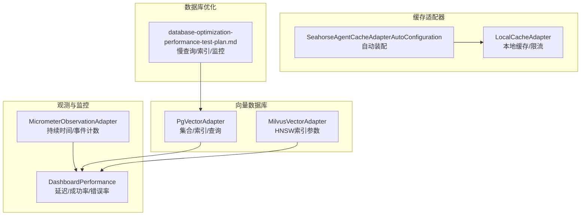
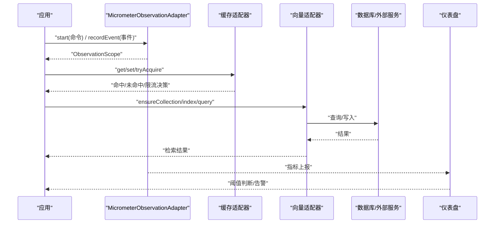
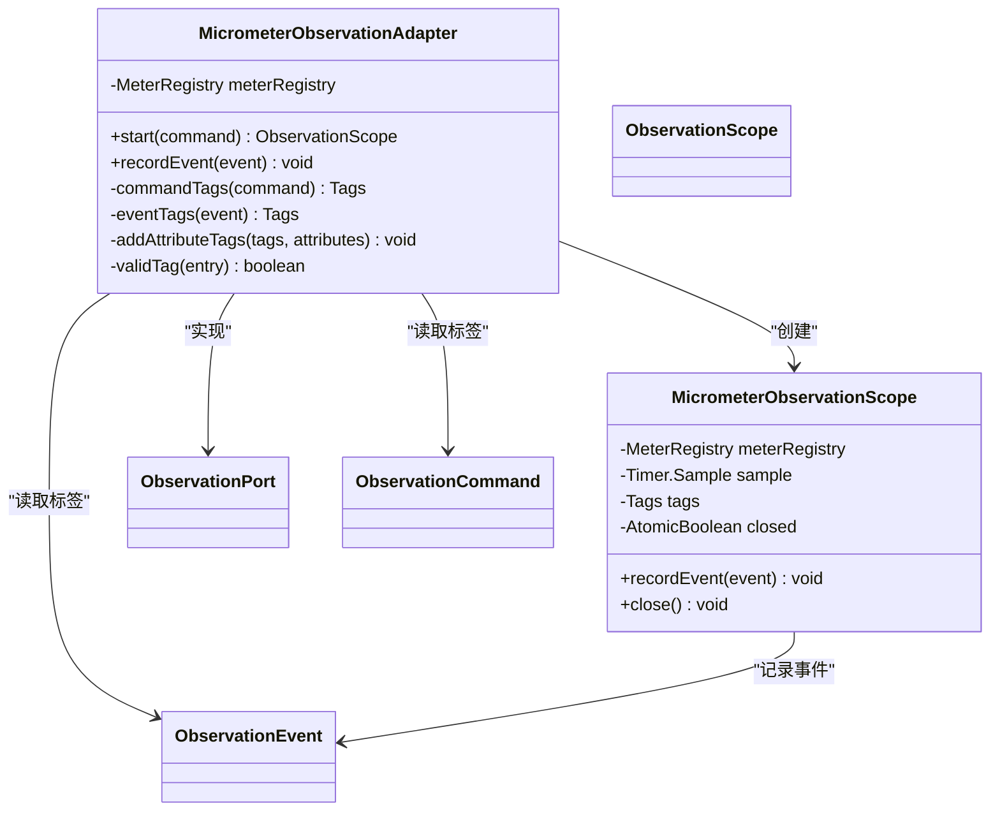
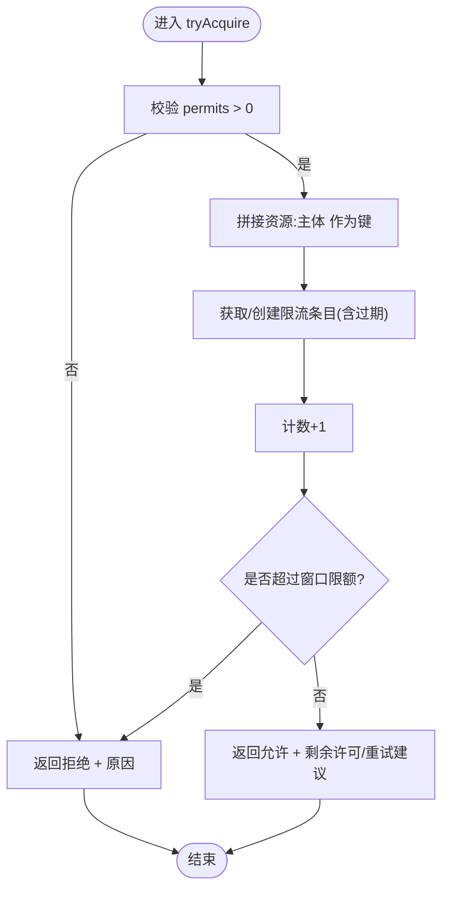
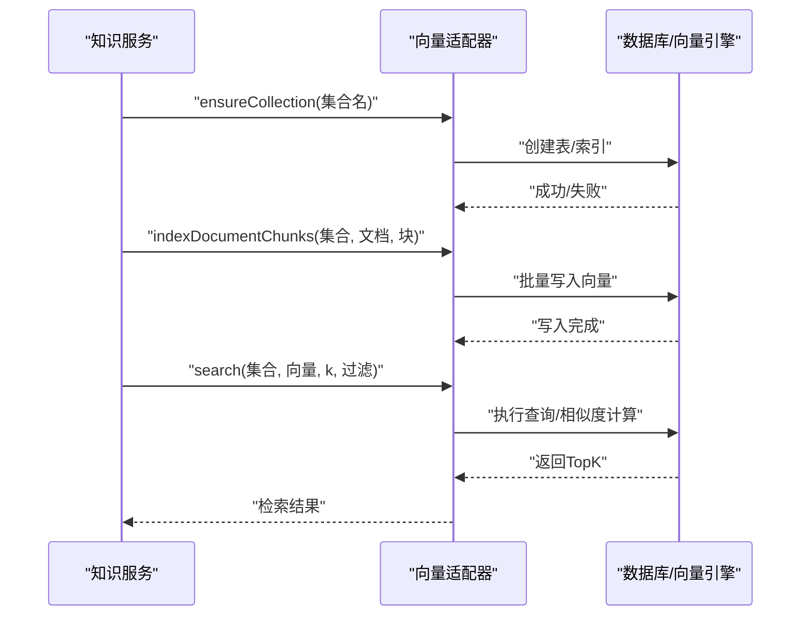
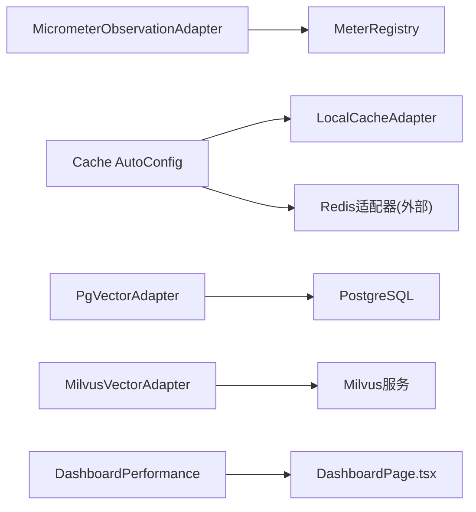

# 性能问题诊断

<cite>
**本文引用的文件**
- [MicrometerObservationAdapter.java](file://seahorse-agent-adapter-observation-micrometer/src/main/java/com/miracle/ai/seahorse/agent/adapters/observation/micrometer/MicrometerObservationAdapter.java)
- [MicrometerObservationAdapterTests.java](file://seahorse-agent-adapter-observation-micrometer/src/test/java/com/miracle/ai/seahorse/agent/adapters/observation/micrometer/MicrometerObservationAdapterTests.java)
- [应用监控.md](file://docs/zh/content/监控运维/应用监控.md)
- [database-optimization-performance-test-plan.md](file://docs/performance/database-optimization-performance-test-plan.md)
- [PgVectorAdapter.java](file://seahorse-agent-adapter-vector-pgvector/src/main/java/com/miracle/ai/seahorse/agent/adapters/vector/pgvector/PgVectorAdapter.java)
- [MilvusVectorAdapter.java](file://seahorse-agent-adapter-vector-milvus/src/main/java/com/miracle/ai/seahorse/agent/adapters/vector/milvus/MilvusVectorAdapter.java)
- [LocalCacheAdapter.java](file://seahorse-agent-adapter-cache-local/src/main/java/com/miracle/ai/seahorse/agent/adapters/cache/local/LocalCacheAdapter.java)
- [缓存适配器.md](file://docs/zh/content/后端系统/适配器模块/缓存适配器.md)
- [SeahorseAgentCacheAdapterAutoConfiguration.java](file://seahorse-agent-spring-boot-starter/src/main/java/com/miracle/ai/seahorse/agent/adapters/spring/SeahorseAgentCacheAdapterAutoConfiguration.java)
- [DashboardPerformance.java](file://seahorse-agent-kernel/src/main/java/com/miracle/ai/seahorse/agent/ports/outbound/dashboard/DashboardPerformance.java)
- [DashboardPage.tsx](file://frontend/src/pages/admin/dashboard/DashboardPage.tsx)
- [MemoryGarbageCollectionService.java](file://seahorse-agent-kernel/src/main/java/com/miracle/ai/seahorse/agent/kernel/application/memory/maintenance/MemoryGarbageCollectionService.java)
- [InMemoryMemoryTraceRecorder.java](file://seahorse-agent-kernel/src/main/java/com/miracle/ai/seahorse/agent/kernel/application/memory/trace/InMemoryMemoryTraceRecorder.java)
- [DefaultMemoryMaintenanceServiceTests.java](file://seahorse-agent-tests/src/test/java/com/miracle/ai/seahorse/agent/kernel/application/memory/maintenance/DefaultMemoryMaintenanceServiceTests.java)
- [KernelKnowledgeDocumentServiceTests.java](file://seahorse-agent-tests/src/test/java/com/miracle/ai/seahorse/agent/kernel/application/knowledge/KernelKnowledgeDocumentServiceTests.java)
- [PgVectorAdapterTests.java](file://seahorse-agent-adapter-vector-pgvector/src/test/java/com/miracle/ai/seahorse/agent/adapters/vector/pgvector/PgVectorAdapterTests.java)
- [IndexerNodeFeatureTests.java](file://seahorse-agent-tests/src/test/java/com/miracle/ai/seahorse/agent/kernel/feature/ingestion/IndexerNodeFeatureTests.java)
- [SeahorseDashboardControllerTests.java](file://seahorse-agent-adapter-web/src/test/java/com/miracle/ai/seahorse/agent/adapters/web/SeahorseDashboardControllerTests.java)
</cite>

## 目录
1. [简介](#简介)
2. [项目结构](#项目结构)
3. [核心组件](#核心组件)
4. [架构总览](#架构总览)
5. [详细组件分析](#详细组件分析)
6. [依赖关系分析](#依赖关系分析)
7. [性能考量](#性能考量)
8. [故障排查指南](#故障排查指南)
9. [结论](#结论)
10. [附录](#附录)

## 简介
本指南面向Seahorse Agent在生产运行中的性能问题诊断，覆盖CPU与线程分析、热点定位、并发问题排查；内存泄漏检测与GC行为观察；数据库查询优化（慢查询、索引、执行计划）；网络延迟与带宽问题（抓包、连接池、外部服务响应）；向量数据库性能（相似度计算、索引构建、查询优化）；缓存性能（命中率、穿透、雪崩）；以及性能监控指标与告警阈值建议。文档以仓库现有实现与测试用例为依据，提供可落地的诊断步骤与可视化图示。

## 项目结构
Seahorse Agent采用分层与适配器架构，核心能力通过“内核”抽象与“适配器”实现解耦，便于替换与扩展。与性能诊断直接相关的模块包括：
- 观测与指标：Micrometer适配器提供统一的观测门面，支持持续时间与事件计数两类指标，并通过标签化实现多维聚合。
- 缓存适配器：本地与Redis两种实现，分别适用于单机与多实例部署，支撑限流、分布式锁/信号量等高并发场景。
- 向量数据库适配器：PGVector与Milvus适配器，提供集合确保、索引参数配置与查询执行路径。
- 数据库优化文档：提供PostgreSQL慢查询、索引使用、连接与锁等待监控及告警阈值建议。
- 前后端仪表盘：提供延迟、成功率、错误率、无文档率等趋势与阈值判断逻辑。

图表来源
- [MicrometerObservationAdapter.java:56-74](file://seahorse-agent-adapter-observation-micrometer/src/main/java/com/miracle/ai/seahorse/agent/adapters/observation/micrometer/MicrometerObservationAdapter.java#L56-L74)
- [DashboardPerformance.java:41-88](file://seahorse-agent-kernel/src/main/java/com/miracle/ai/seahorse/agent/ports/outbound/dashboard/DashboardPerformance.java#L41-L88)
- [LocalCacheAdapter.java:52-91](file://seahorse-agent-adapter-cache-local/src/main/java/com/miracle/ai/seahorse/agent/adapters/cache/local/LocalCacheAdapter.java#L52-L91)
- [SeahorseAgentCacheAdapterAutoConfiguration.java:60-73](file://seahorse-agent-spring-boot-starter/src/main/java/com/miracle/ai/seahorse/agent/adapters/spring/SeahorseAgentCacheAdapterAutoConfiguration.java#L60-L73)
- [PgVectorAdapter.java:167-192](file://seahorse-agent-adapter-vector-pgvector/src/main/java/com/miracle/ai/seahorse/agent/adapters/vector/pgvector/PgVectorAdapter.java#L167-L192)
- [MilvusVectorAdapter.java:249-279](file://seahorse-agent-adapter-vector-milvus/src/main/java/com/miracle/ai/seahorse/agent/adapters/vector/milvus/MilvusVectorAdapter.java#L249-L279)
- [database-optimization-performance-test-plan.md:267-316](file://docs/performance/database-optimization-performance-test-plan.md#L267-L316)

章节来源
- [应用监控.md:134-177](file://docs/zh/content/监控运维/应用监控.md#L134-L177)

## 核心组件
- 观测与指标适配器：统一记录观测生命周期耗时与事件计数，支持按命令/事件维度打点与聚合。
- 缓存与限流：本地缓存与Redis适配器，提供键值缓存、速率限制、分布式锁/信号量等能力。
- 向量检索：PGVector与Milvus适配器，支持集合确保、索引参数（如HNSW）与查询执行。
- 数据库优化：提供慢查询、索引使用、连接与锁等待监控SQL与告警阈值建议。
- 仪表盘与阈值：后端指标模型与前端阈值判断逻辑，支撑延迟与成功率等关键指标的可视化与告警。

章节来源
- [MicrometerObservationAdapter.java:56-74](file://seahorse-agent-adapter-observation-micrometer/src/main/java/com/miracle/ai/seahorse/agent/adapters/observation/micrometer/MicrometerObservationAdapter.java#L56-L74)
- [LocalCacheAdapter.java:52-91](file://seahorse-agent-adapter-cache-local/src/main/java/com/miracle/ai/seahorse/agent/adapters/cache/local/LocalCacheAdapter.java#L52-L91)
- [PgVectorAdapter.java:167-192](file://seahorse-agent-adapter-vector-pgvector/src/main/java/com/miracle/ai/seahorse/agent/adapters/vector/pgvector/PgVectorAdapter.java#L167-L192)
- [MilvusVectorAdapter.java:249-279](file://seahorse-agent-adapter-vector-milvus/src/main/java/com/miracle/ai/seahorse/agent/adapters/vector/milvus/MilvusVectorAdapter.java#L249-L279)
- [database-optimization-performance-test-plan.md:267-316](file://docs/performance/database-optimization-performance-test-plan.md#L267-L316)
- [DashboardPerformance.java:41-88](file://seahorse-agent-kernel/src/main/java/com/miracle/ai/seahorse/agent/ports/outbound/dashboard/DashboardPerformance.java#L41-L88)

## 架构总览
下图展示性能诊断相关的关键交互：观测适配器采集指标，缓存适配器承载高并发访问，向量适配器支撑检索性能，数据库优化文档提供查询层面的优化手段，仪表盘负责指标呈现与阈值判断。

图表来源
- [MicrometerObservationAdapter.java:56-74](file://seahorse-agent-adapter-observation-micrometer/src/main/java/com/miracle/ai/seahorse/agent/adapters/observation/micrometer/MicrometerObservationAdapter.java#L56-L74)
- [LocalCacheAdapter.java:52-91](file://seahorse-agent-adapter-cache-local/src/main/java/com/miracle/ai/seahorse/agent/adapters/cache/local/LocalCacheAdapter.java#L52-L91)
- [PgVectorAdapter.java:167-192](file://seahorse-agent-adapter-vector-pgvector/src/main/java/com/miracle/ai/seahorse/agent/adapters/vector/pgvector/PgVectorAdapter.java#L167-L192)
- [DashboardPerformance.java:41-88](file://seahorse-agent-kernel/src/main/java/com/miracle/ai/seahorse/agent/ports/outbound/dashboard/DashboardPerformance.java#L41-L88)

## 详细组件分析

### 观测与指标适配器（Micrometer）
- 指标类型与命名
  - 持续时间指标：记录观测生命周期内的耗时，名称为固定常量。
  - 事件计数指标：记录独立事件的发生次数，名称为固定常量。
- 标签体系
  - 观测维度：observation（来自命令名称）、tenant（来自命令租户标识）。
  - 事件维度：event（来自事件名称）。
  - 属性维度：从命令与事件的 attributes 映射中提取有效键值对作为标签。
- 生命周期管理
  - start：启动计时采样，合并标签后返回作用域实例。
  - recordEvent：在作用域内或独立记录事件计数器。
  - close：在作用域关闭时，基于标签构建定时器并停止采样，完成耗时统计。

图表来源
- [应用监控.md:134-177](file://docs/zh/content/监控运维/应用监控.md#L134-L177)
- [MicrometerObservationAdapter.java:56-74](file://seahorse-agent-adapter-observation-micrometer/src/main/java/com/miracle/ai/seahorse/agent/adapters/observation/micrometer/MicrometerObservationAdapter.java#L56-L74)

章节来源
- [应用监控.md:134-177](file://docs/zh/content/监控运维/应用监控.md#L134-L177)
- [MicrometerObservationAdapter.java:56-74](file://seahorse-agent-adapter-observation-micrometer/src/main/java/com/miracle/ai/seahorse/agent/adapters/observation/micrometer/MicrometerObservationAdapter.java#L56-L74)
- [MicrometerObservationAdapterTests.java:91-113](file://seahorse-agent-adapter-observation-micrometer/src/test/java/com/miracle/ai/seahorse/agent/adapters/observation/micrometer/MicrometerObservationAdapterTests.java#L91-L113)

### 缓存与限流（Local/Redis）
- 本地缓存适配器
  - 提供键值缓存、过期清理、限流判定（基于滑动窗口计数）。
  - 适合单机/单实例部署，多实例间不共享。
- 自动装配
  - 支持根据配置选择本地或Redis适配器，保证Bean名称一致性，便于后续拆分协调模块。

图表来源
- [LocalCacheAdapter.java:77-91](file://seahorse-agent-adapter-cache-local/src/main/java/com/miracle/ai/seahorse/agent/adapters/cache/local/LocalCacheAdapter.java#L77-L91)

章节来源
- [LocalCacheAdapter.java:52-91](file://seahorse-agent-adapter-cache-local/src/main/java/com/miracle/ai/seahorse/agent/adapters/cache/local/LocalCacheAdapter.java#L52-L91)
- [SeahorseAgentCacheAdapterAutoConfiguration.java:60-73](file://seahorse-agent-spring-boot-starter/src/main/java/com/miracle/ai/seahorse/agent/adapters/spring/SeahorseAgentCacheAdapterAutoConfiguration.java#L60-L73)
- [缓存适配器.md:448-465](file://docs/zh/content/后端系统/适配器模块/缓存适配器.md#L448-L465)

### 向量数据库（PGVector/Milvus）
- PGVector适配器
  - ensureCollection：确保表与索引存在，执行建表与建索引SQL。
  - query：构造查询SQL，绑定过滤条件与topK，执行并解析结果。
- Milvus适配器
  - indexParam：配置HNSW索引类型、度量方式、M与efConstruction等参数，支持mmap启用。

图表来源
- [PgVectorAdapter.java:167-192](file://seahorse-agent-adapter-vector-pgvector/src/main/java/com/miracle/ai/seahorse/agent/adapters/vector/pgvector/PgVectorAdapter.java#L167-L192)
- [MilvusVectorAdapter.java:249-279](file://seahorse-agent-adapter-vector-milvus/src/main/java/com/miracle/ai/seahorse/agent/adapters/vector/milvus/MilvusVectorAdapter.java#L249-L279)

章节来源
- [PgVectorAdapter.java:167-192](file://seahorse-agent-adapter-vector-pgvector/src/main/java/com/miracle/ai/seahorse/agent/adapters/vector/pgvector/PgVectorAdapter.java#L167-L192)
- [MilvusVectorAdapter.java:249-279](file://seahorse-agent-adapter-vector-milvus/src/main/java/com/miracle/ai/seahorse/agent/adapters/vector/milvus/MilvusVectorAdapter.java#L249-L279)
- [KernelKnowledgeDocumentServiceTests.java:331-357](file://seahorse-agent-tests/src/test/java/com/miracle/ai/seahorse/agent/kernel/application/knowledge/KernelKnowledgeDocumentServiceTests.java#L331-L357)
- [IndexerNodeFeatureTests.java:243-280](file://seahorse-agent-tests/src/test/java/com/miracle/ai/seahorse/agent/kernel/feature/ingestion/IndexerNodeFeatureTests.java#L243-L280)
- [PgVectorAdapterTests.java:127-142](file://seahorse-agent-adapter-vector-pgvector/src/test/java/com/miracle/ai/seahorse/agent/adapters/vector/pgvector/PgVectorAdapterTests.java#L127-L142)

### 数据库查询性能优化
- 慢查询分析：使用pg_stat_statements按平均执行时间排序，定位热点SQL。
- 索引优化：检查索引扫描次数、行级读取与获取，评估索引使用效率与膨胀。
- 执行计划：结合EXPLAIN/ANALYZE分析查询成本与路径。
- 监控与告警：连接数、锁等待、慢查询阈值等指标的Prometheus规则建议。

章节来源
- [database-optimization-performance-test-plan.md:267-316](file://docs/performance/database-optimization-performance-test-plan.md#L267-L316)
- [database-optimization-performance-test-plan.md:467-498](file://docs/performance/database-optimization-performance-test-plan.md#L467-L498)
- [database-optimization-performance-test-plan.md:500-521](file://docs/performance/database-optimization-performance-test-plan.md#L500-L521)

### 仪表盘与阈值（延迟/成功率/错误率）
- 后端指标模型：提供avgLatencyMs、p95LatencyMs、successRate、errorRate、noDocRate、slowRate等字段。
- 前端阈值：定义good/warning阈值，按指标类型进行状态判断。
- 控制器测试：验证趋势接口按粒度参数正确调用。

章节来源
- [DashboardPerformance.java:41-88](file://seahorse-agent-kernel/src/main/java/com/miracle/ai/seahorse/agent/ports/outbound/dashboard/DashboardPerformance.java#L41-L88)
- [DashboardPage.tsx:120-144](file://frontend/src/pages/admin/dashboard/DashboardPage.tsx#L120-L144)
- [SeahorseDashboardControllerTests.java:83-95](file://seahorse-agent-adapter-web/src/test/java/com/miracle/ai/seahorse/agent/adapters/web/SeahorseDashboardControllerTests.java#L83-L95)

## 依赖关系分析
- 观测适配器依赖Micrometer注册表，输出统一指标。
- 缓存适配器通过自动装配在不同环境选择本地或Redis实现。
- 向量适配器依赖数据库驱动与向量引擎，提供集合与索引管理。
- 仪表盘依赖后端指标模型与前端阈值逻辑。

图表来源
- [MicrometerObservationAdapter.java:56-74](file://seahorse-agent-adapter-observation-micrometer/src/main/java/com/miracle/ai/seahorse/agent/adapters/observation/micrometer/MicrometerObservationAdapter.java#L56-L74)
- [SeahorseAgentCacheAdapterAutoConfiguration.java:60-73](file://seahorse-agent-spring-boot-starter/src/main/java/com/miracle/ai/seahorse/agent/adapters/spring/SeahorseAgentCacheAdapterAutoConfiguration.java#L60-L73)
- [PgVectorAdapter.java:167-192](file://seahorse-agent-adapter-vector-pgvector/src/main/java/com/miracle/ai/seahorse/agent/adapters/vector/pgvector/PgVectorAdapter.java#L167-L192)
- [MilvusVectorAdapter.java:249-279](file://seahorse-agent-adapter-vector-milvus/src/main/java/com/miracle/ai/seahorse/agent/adapters/vector/milvus/MilvusVectorAdapter.java#L249-L279)
- [DashboardPerformance.java:41-88](file://seahorse-agent-kernel/src/main/java/com/miracle/ai/seahorse/agent/ports/outbound/dashboard/DashboardPerformance.java#L41-L88)
- [DashboardPage.tsx:120-144](file://frontend/src/pages/admin/dashboard/DashboardPage.tsx#L120-L144)

## 性能考量
- CPU与线程分析
  - 使用观测指标识别长耗时阶段，结合线程栈与火焰图定位热点方法。
  - 关注并发瓶颈：缓存竞争、数据库连接池饱和、向量索引构建/查询阻塞。
- 内存与GC
  - 通过观测事件统计阶段性GC活动，结合内存追踪记录定位异常增长。
  - 参考维护服务中的归档与物理删除流程，避免对象堆积。
- 数据库
  - 慢查询优先优化；索引定期评估与重建；连接池参数与超时设置。
- 向量数据库
  - 合理设置HNSW参数（M、efConstruction），平衡召回与速度；批量写入与查询topK控制。
- 缓存
  - 命中率监控与阈值告警；限流窗口与许可数合理配置；穿透与雪崩的防护策略。

## 故障排查指南

### CPU使用率异常
- 步骤
  - 通过观测适配器标记关键阶段（如检索、索引、写入），对比持续时间指标。
  - 结合线程分析工具定位热点方法与调用链。
  - 检查并发热点：缓存竞争、数据库连接池、向量查询阻塞。
- 参考
  - 观测生命周期与事件计数：[MicrometerObservationAdapter.java:56-74](file://seahorse-agent-adapter-observation-micrometer/src/main/java/com/miracle/ai/seahorse/agent/adapters/observation/micrometer/MicrometerObservationAdapter.java#L56-L74)
  - 维护阶段事件统计测试：[DefaultMemoryMaintenanceServiceTests.java:446-466](file://seahorse-agent-tests/src/test/java/com/miracle/ai/seahorse/agent/kernel/application/memory/maintenance/DefaultMemoryMaintenanceServiceTests.java#L446-L466)

章节来源
- [MicrometerObservationAdapter.java:56-74](file://seahorse-agent-adapter-observation-micrometer/src/main/java/com/miracle/ai/seahorse/agent/adapters/observation/micrometer/MicrometerObservationAdapter.java#L56-L74)
- [DefaultMemoryMaintenanceServiceTests.java:446-466](file://seahorse-agent-tests/src/test/java/com/miracle/ai/seahorse/agent/kernel/application/memory/maintenance/DefaultMemoryMaintenanceServiceTests.java#L446-L466)

### 内存泄漏与GC
- 步骤
  - 使用观测事件统计GC阶段（扫描、入队、标记、物理删除）。
  - 通过内存追踪记录最近事件，定位异常增长点。
  - 检查归档与删除流程是否正常执行。
- 参考
  - GC阶段实现与错误收集：[MemoryGarbageCollectionService.java:140-174](file://seahorse-agent-kernel/src/main/java/com/miracle/ai/seahorse/agent/kernel/application/memory/maintenance/MemoryGarbageCollectionService.java#L140-L174)
  - 内存追踪记录与最近事件列表：[InMemoryMemoryTraceRecorder.java:44-77](file://seahorse-agent-kernel/src/main/java/com/miracle/ai/seahorse/agent/kernel/application/memory/trace/InMemoryMemoryTraceRecorder.java#L44-L77)

章节来源
- [MemoryGarbageCollectionService.java:140-174](file://seahorse-agent-kernel/src/main/java/com/miracle/ai/seahorse/agent/kernel/application/memory/maintenance/MemoryGarbageCollectionService.java#L140-L174)
- [InMemoryMemoryTraceRecorder.java:44-77](file://seahorse-agent-kernel/src/main/java/com/miracle/ai/seahorse/agent/kernel/application/memory/trace/InMemoryMemoryTraceRecorder.java#L44-L77)

### 数据库查询性能
- 步骤
  - 使用pg_stat_statements识别慢查询，按平均耗时排序。
  - 检查索引扫描与行级读取，评估索引使用效率。
  - 结合EXPLAIN/ANALYZE分析执行计划，调整索引与查询。
  - 设置Prometheus告警规则，监控连接数与锁等待。
- 参考
  - 指标查询与告警阈值：[database-optimization-performance-test-plan.md:267-316](file://docs/performance/database-optimization-performance-test-plan.md#L267-L316)
  - 慢查询与连接/锁监控：[database-optimization-performance-test-plan.md:467-498](file://docs/performance/database-optimization-performance-test-plan.md#L467-L498)

章节来源
- [database-optimization-performance-test-plan.md:267-316](file://docs/performance/database-optimization-performance-test-plan.md#L267-L316)
- [database-optimization-performance-test-plan.md:467-498](file://docs/performance/database-optimization-performance-test-plan.md#L467-L498)

### 向量数据库性能
- 步骤
  - 确认集合存在与索引已建立，避免重复DDL开销。
  - 调整HNSW参数（M、efConstruction）与度量类型，平衡召回与速度。
  - 控制批量写入与查询topK，减少网络与计算压力。
- 参考
  - 集合确保与查询执行：[PgVectorAdapter.java:167-192](file://seahorse-agent-adapter-vector-pgvector/src/main/java/com/miracle/ai/seahorse/agent/adapters/vector/pgvector/PgVectorAdapter.java#L167-L192)
  - HNSW索引参数：[MilvusVectorAdapter.java:249-279](file://seahorse-agent-adapter-vector-milvus/src/main/java/com/miracle/ai/seahorse/agent/adapters/vector/milvus/MilvusVectorAdapter.java#L249-L279)
  - 知识服务索引流程测试：[KernelKnowledgeDocumentServiceTests.java:331-357](file://seahorse-agent-tests/src/test/java/com/miracle/ai/seahorse/agent/kernel/application/knowledge/KernelKnowledgeDocumentServiceTests.java#L331-L357)

章节来源
- [PgVectorAdapter.java:167-192](file://seahorse-agent-adapter-vector-pgvector/src/main/java/com/miracle/ai/seahorse/agent/adapters/vector/pgvector/PgVectorAdapter.java#L167-L192)
- [MilvusVectorAdapter.java:249-279](file://seahorse-agent-adapter-vector-milvus/src/main/java/com/miracle/ai/seahorse/agent/adapters/vector/milvus/MilvusVectorAdapter.java#L249-L279)
- [KernelKnowledgeDocumentServiceTests.java:331-357](file://seahorse-agent-tests/src/test/java/com/miracle/ai/seahorse/agent/kernel/application/knowledge/KernelKnowledgeDocumentServiceTests.java#L331-L357)

### 缓存性能
- 步骤
  - 监控命中率与未命中率，设置阈值告警。
  - 限流拒绝率与窗口剩余时间分布，防止突发流量击穿。
  - 穿透：空值缓存与布隆过滤；雪崩：互斥写与随机ttl。
  - 选择合适缓存：本地适配器仅JVM内可见，Redis适配器跨实例一致。
- 参考
  - 限流判定逻辑：[LocalCacheAdapter.java:77-91](file://seahorse-agent-adapter-cache-local/src/main/java/com/miracle/ai/seahorse/agent/adapters/cache/local/LocalCacheAdapter.java#L77-L91)
  - 自动装配与环境选型：[SeahorseAgentCacheAdapterAutoConfiguration.java:60-73](file://seahorse-agent-spring-boot-starter/src/main/java/com/miracle/ai/seahorse/agent/adapters/spring/SeahorseAgentCacheAdapterAutoConfiguration.java#L60-L73)
  - 监控指标建议：[缓存适配器.md:448-465](file://docs/zh/content/后端系统/适配器模块/缓存适配器.md#L448-L465)

章节来源
- [LocalCacheAdapter.java:77-91](file://seahorse-agent-adapter-cache-local/src/main/java/com/miracle/ai/seahorse/agent/adapters/cache/local/LocalCacheAdapter.java#L77-L91)
- [SeahorseAgentCacheAdapterAutoConfiguration.java:60-73](file://seahorse-agent-spring-boot-starter/src/main/java/com/miracle/ai/seahorse/agent/adapters/spring/SeahorseAgentCacheAdapterAutoConfiguration.java#L60-L73)
- [缓存适配器.md:448-465](file://docs/zh/content/后端系统/适配器模块/缓存适配器.md#L448-L465)

### 网络延迟与带宽
- 步骤
  - 抓包分析：定位RTT、丢包、重传。
  - 连接池监控：活跃连接数、排队等待、超时比例。
  - 外部服务响应时间：观测外部调用阶段耗时，识别慢依赖。
- 参考
  - 观测适配器支持事件计数与持续时间：[MicrometerObservationAdapter.java:56-74](file://seahorse-agent-adapter-observation-micrometer/src/main/java/com/miracle/ai/seahorse/agent/adapters/observation/micrometer/MicrometerObservationAdapter.java#L56-L74)

章节来源
- [MicrometerObservationAdapter.java:56-74](file://seahorse-agent-adapter-observation-micrometer/src/main/java/com/miracle/ai/seahorse/agent/adapters/observation/micrometer/MicrometerObservationAdapter.java#L56-L74)

### 仪表盘与阈值
- 步骤
  - 后端指标模型提供avg/p95延迟、成功率、错误率、无文档率、慢比率。
  - 前端阈值判断good/warning/bad，控制器按粒度参数返回趋势数据。
- 参考
  - 指标模型：[DashboardPerformance.java:41-88](file://seahorse-agent-kernel/src/main/java/com/miracle/ai/seahorse/agent/ports/outbound/dashboard/DashboardPerformance.java#L41-L88)
  - 阈值判断逻辑：[DashboardPage.tsx:120-144](file://frontend/src/pages/admin/dashboard/DashboardPage.tsx#L120-L144)
  - 控制器测试：[SeahorseDashboardControllerTests.java:83-95](file://seahorse-agent-adapter-web/src/test/java/com/miracle/ai/seahorse/agent/adapters/web/SeahorseDashboardControllerTests.java#L83-L95)

章节来源
- [DashboardPerformance.java:41-88](file://seahorse-agent-kernel/src/main/java/com/miracle/ai/seahorse/agent/ports/outbound/dashboard/DashboardPerformance.java#L41-L88)
- [DashboardPage.tsx:120-144](file://frontend/src/pages/admin/dashboard/DashboardPage.tsx#L120-L144)
- [SeahorseDashboardControllerTests.java:83-95](file://seahorse-agent-adapter-web/src/test/java/com/miracle/ai/seahorse/agent/adapters/web/SeahorseDashboardControllerTests.java#L83-L95)

## 结论
本指南基于Seahorse Agent现有观测、缓存、向量与数据库优化能力，提供了系统化的性能问题诊断路径。通过统一指标打点、缓存限流、向量索引参数调优与数据库慢查询治理，配合仪表盘阈值与告警，可在生产环境中快速定位并缓解性能瓶颈。

## 附录
- 监控指标与告警阈值建议
  - 数据库：慢查询阈值、索引未使用告警、连接数与锁等待监控。
  - 缓存：命中率阈值、限流拒绝率、窗口剩余时间分布。
  - 仪表盘：延迟good/warning阈值、成功率/错误率阈值。
- 参考文件
  - [database-optimization-performance-test-plan.md:467-498](file://docs/performance/database-optimization-performance-test-plan.md#L467-L498)
  - [缓存适配器.md:448-465](file://docs/zh/content/后端系统/适配器模块/缓存适配器.md#L448-L465)
  - [DashboardPage.tsx:120-144](file://frontend/src/pages/admin/dashboard/DashboardPage.tsx#L120-L144)