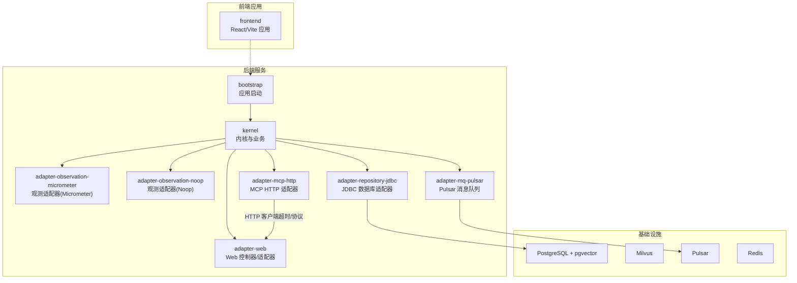
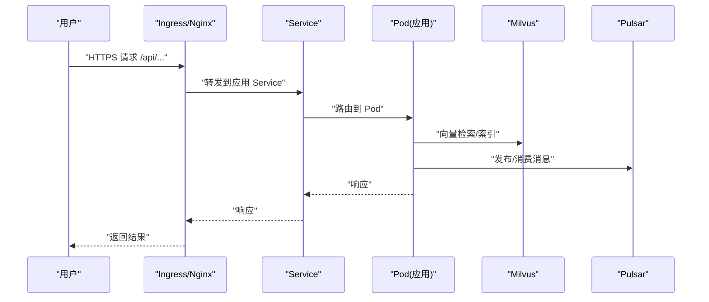
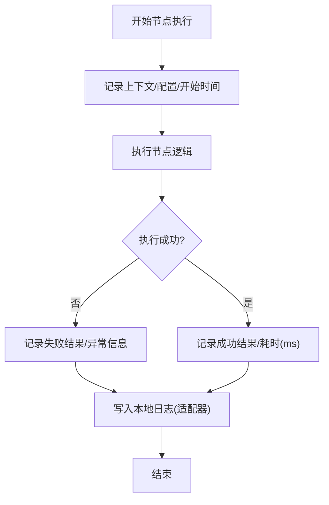
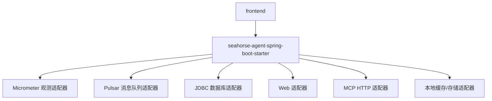

# 故障排查

<cite>
**本文引用的文件**
- [deploy.sh](file://deploy.sh)
- [redeploy.ps1](file://redeploy.ps1)
- [docker-compose.yml](file://docker-compose.yml)
- [docker-compose.full.yml](file://docker-compose.full.yml)
- [milvus-stack-2.6.6.compose.yaml](file://resources/docker/milvus-stack-2.6.6.compose.yaml)
- [pulsar-stack-3.1.3.compose.yaml](file://resources/docker/pulsar-stack-3.1.3.compose.yaml)
- [application.properties](file://seahorse-agent-bootstrap/src/main/resources/application.properties)
- [application.yml](file://seahorse-agent-mcp-server/src/main/resources/application.yml)
- [MicrometerObservationAdapter.java](file://seahorse-agent-adapter-observation-micrometer/src/main/java/com/miracle/ai/seahorse/agent/adapters/observation/micrometer/MicrometerObservationAdapter.java)
- [KernelRagTraceRecorder.java](file://seahorse-agent-kernel/src/main/java/com/miracle/ai/seahorse/agent/kernel/application/trace/KernelRagTraceRecorder.java)
- [LocalIngestionNodeLogAdapter.java](file://seahorse-agent-adapter-web/src/main/java/com/miracle/ai/seahorse/agent/adapters/local/LocalIngestionNodeLogAdapter.java)
- [SeahorseWebExceptionHandler.java](file://seahorse-agent-adapter-web/src/main/java/com/miracle/ai/seahorse/agent/adapters/web/SeahorseWebExceptionHandler.java)
- [PulsarMessageQueueProperties.java](file://seahorse-agent-adapter-mq-pulsar/src/main/java/com/miracle/ai/seahorse/agent/adapters/mq/pulsar/PulsarMessageQueueProperties.java)
- [SeahorseAgentAiAdapterAutoConfiguration.java](file://seahorse-agent-spring-boot-starter\src\main\java\com\miracle\ai\seahorse\agent\adapters\spring\SeahorseAgentAiAdapterAutoConfiguration.java)
- [SeahorseMemoryGarbageCollectionJob.java](file://seahorse-agent-spring-boot-starter\src\main\java\com\miracle\ai\seahorse\agent\adapters\spring\SeahorseMemoryGarbageCollectionJob.java)
- [SeahorseMemoryGovernanceJob.java](file://seahorse-agent-spring-boot-starter\src\main\java\com\miracle\ai\seahorse\agent\adapters\spring\SeahorseMemoryGovernanceJob.java)
- [JdbcDockerInitScriptMountTests.java](file://seahorse-agent-adapter-repository-jdbc\src\test\java\com\miracle\ai\seahorse\agent\adapters\repository\jdbc\JdbcDockerInitScriptMountTests.java)
- [日志管理.md](file://docs/zh/content/监控运维/日志管理.md)
- [故障排查.md](file://docs/zh/content/监控运维/故障排查.md)
- [应用启动.md](file://docs/zh/content/后端系统/应用启动.md)
- [数据库适配器.md](file://docs/zh/content/后端系统/适配器模块/数据库适配器.md)
- [DashboardPage.tsx](file://frontend/src/pages/admin/dashboard/DashboardPage.tsx)
- [rag-baseline.json](file://docs/performance/rag-baseline.json)
</cite>

## 目录
1. [简介](#简介)
2. [项目结构](#项目结构)
3. [核心组件](#核心组件)
4. [架构总览](#架构总览)
5. [详细组件分析](#详细组件分析)
6. [依赖分析](#依赖分析)
7. [性能考虑](#性能考虑)
8. [故障排查指南](#故障排查指南)
9. [结论](#结论)
10. [附录](#附录)

## 简介
本指南面向运维与开发者，围绕 Seahorse Agent 的启动、连接、性能、部署与监控告警等常见问题，提供系统化的诊断与修复方法。内容涵盖：
- 启动失败、连接超时、内存不足、性能问题的定位与处理
- CPU/内存/数据库/网络的专项诊断方法
- 容器部署、配置、依赖与端口冲突的排查
- 日志、指标、追踪、网络抓包与数据库分析的调试技巧
- 告警响应、根因分析与修复流程
- 系统恢复、备份恢复、数据修复与系统重建方案
- 预防性措施与最佳实践

## 项目结构
Seahorse Agent 采用多模块分层架构，后端以 Spring Boot Starter 为核心，通过适配器模块对接缓存、消息队列、向量库、存储、观测与 Web 层；前端为 React/Vite 应用；资源目录包含 Docker 编排与数据库初始化脚本。

图表来源
- [pom.xml](file://pom.xml)
- [application.properties](file://seahorse-agent-bootstrap/src/main/resources/application.properties)
- [application.yml](file://seahorse-agent-mcp-server/src/main/resources/application.yml)

章节来源
- [pom.xml](file://pom.xml)
- [application.properties](file://seahorse-agent-bootstrap/src/main/resources/application.properties)
- [application.yml](file://seahorse-agent-mcp-server/src/main/resources/application.yml)

## 核心组件
- 观测与指标：通过 Micrometer 适配器输出计数器、定时器等指标，便于统一采集与告警。
- 分布式追踪：内核提供 RAG 追踪记录器与追踪模型，支持时长、错误清洗、追踪 ID 生成等。
- 入湖节点日志：内核定义入湖节点日志端口，适配器实现本地记录，便于审计与问题定位。
- 消息队列与超时：Pulsar 属性包含压缩类型、发送超时等参数，影响日志传输可靠性与性能。
- MCP 适配器：MCP HTTP 适配器提供调用超时与服务器列表配置，便于外部工具链日志对齐。
- 启动与配置：bootstrap 模块提供默认配置，MCP 服务配置文件提供 HTTP 客户端超时参数解析。

章节来源
- [MicrometerObservationAdapter.java](file://seahorse-agent-adapter-observation-micrometer/src/main/java/com/miracle/ai/seahorse/agent/adapters/observation/micrometer/MicrometerObservationAdapter.java)
- [KernelRagTraceRecorder.java](file://seahorse-agent-kernel/src/main/java/com/miracle/ai/seahorse/agent/kernel/application/trace/KernelRagTraceRecorder.java)
- [LocalIngestionNodeLogAdapter.java](file://seahorse-agent-adapter-web/src/main/java/com/miracle/ai/seahorse/agent/adapters/local/LocalIngestionNodeLogAdapter.java)
- [PulsarMessageQueueProperties.java](file://seahorse-agent-adapter-mq-pulsar/src/main/java/com/miracle/ai/seahorse/agent/adapters/mq/pulsar/PulsarMessageQueueProperties.java)
- [SeahorseAgentAiAdapterAutoConfiguration.java](file://seahorse-agent-spring-boot-starter\src\main\java\com\miracle\ai\seahorse\agent\adapters\spring\SeahorseAgentAiAdapterAutoConfiguration.java)
- [application.properties](file://seahorse-agent-bootstrap/src/main/resources/application.properties)
- [application.yml](file://seahorse-agent-mcp-server/src/main/resources/application.yml)

## 架构总览
下图展示从用户请求到后端服务、再到 Milvus/Pulsar 的典型调用链路，以及前端与后端的交互关系。

图表来源
- [milvus-stack-2.6.6.compose.yaml](file://resources/docker/milvus-stack-2.6.6.compose.yaml)
- [pulsar-stack-3.1.3.compose.yaml](file://resources/docker/pulsar-stack-3.1.3.compose.yaml)

## 详细组件分析

### 观测与日志组件
- Micrometer 观测适配器：负责输出指标，便于统一采集与告警。
- 内核追踪记录器：记录 RAG 节点耗时、错误清洗与追踪 ID，支持慢查询定位。
- 入湖节点日志适配器：将关键节点日志写入本地文件，便于审计与问题定位。
- Web 异常处理器：统一返回错误码与消息，便于快速定位问题类型。
- Pulsar 消息队列属性：包含发送超时、批处理、压缩类型等参数，影响日志传输可靠性与时延。

图表来源
- [内核入湖节点日志端口](file://seahorse-agent-kernel/src/main/java/com/miracle/ai/seahorse/agent/ports/outbound/ingestion/IngestionNodeLogPort.java)
- [本地入湖节点日志适配器](file://seahorse-agent-adapter-web/src/main/java/com/miracle/ai/seahorse/agent/adapters/local/LocalIngestionNodeLogAdapter.java)

章节来源
- [MicrometerObservationAdapter.java](file://seahorse-agent-adapter-observation-micrometer/src/main/java/com/miracle/ai/seahorse/agent/adapters/observation/micrometer/MicrometerObservationAdapter.java)
- [KernelRagTraceRecorder.java](file://seahorse-agent-kernel/src/main/java/com/miracle/ai/seahorse/agent/kernel/application/trace/KernelRagTraceRecorder.java)
- [LocalIngestionNodeLogAdapter.java](file://seahorse-agent-adapter-web/src/main/java/com/miracle/ai/seahorse/agent/adapters/local/LocalIngestionNodeLogAdapter.java)
- [SeahorseWebExceptionHandler.java](file://seahorse-agent-adapter-web/src/main/java/com/miracle/ai/seahorse/agent/adapters/web/SeahorseWebExceptionHandler.java)
- [PulsarMessageQueueProperties.java](file://seahorse-agent-adapter-mq-pulsar/src/main/java/com/miracle/ai/seahorse/agent/adapters/mq/pulsar/PulsarMessageQueueProperties.java)

### 启动与配置组件
- bootstrap 默认配置：提供基础日志与运行参数。
- MCP 服务配置：解析 HTTP 客户端超时与协议参数，影响外部调用稳定性。
- 启动阶段优化：减少不必要的自动配置、选择轻量适配器、合理设置批处理参数。
- 启动慢排查：关闭非必要适配器、调整批处理与超时参数、使用更轻量的向量库或禁用向量库进行基准测试。

章节来源
- [application.properties](file://seahorse-agent-bootstrap/src/main/resources/application.properties)
- [application.yml](file://seahorse-agent-mcp-server/src/main/resources/application.yml)
- [SeahorseAgentAiAdapterAutoConfiguration.java](file://seahorse-agent-spring-boot-starter\src\main\java\com\miracle\ai\seahorse\agent\adapters\spring\SeahorseAgentAiAdapterAutoConfiguration.java)
- [应用启动.md](file://docs/zh/content/后端系统/应用启动.md)

### 数据库适配器组件
- 核心依赖：Spring JDBC、Jackson Databind。
- 连接池配置建议：最大连接数、最小空闲连接、连接超时、查询超时。
- 查询优化策略：索引优化、分页优化、批量操作。
- 缓存策略：短期缓存、查询结果缓存、分布式缓存。

章节来源
- [数据库适配器.md](file://docs/zh/content/后端系统/适配器模块/数据库适配器.md)

### 内存治理与垃圾回收组件
- 内存垃圾回收任务：定时执行，使用分布式锁避免并发冲突。
- 内存治理任务：定期衰减与清理，使用分布式锁保证幂等。

章节来源
- [SeahorseMemoryGarbageCollectionJob.java](file://seahorse-agent-spring-boot-starter\src\main\java\com\miracle\ai\seahorse\agent\adapters\spring\SeahorseMemoryGarbageCollectionJob.java)
- [SeahorseMemoryGovernanceJob.java](file://seahorse-agent-spring-boot-starter\src\main\java\com\miracle\ai\seahorse\agent\adapters\spring\SeahorseMemoryGovernanceJob.java)

## 依赖分析
- 后端模块通过 starter 自动装配适配器，关键依赖包括 Micrometer、Pulsar、Redis、JDBC、Jackson 等。
- 前端模块通过 Vite 构建，与后端 API 交互。
- 基础设施通过 Docker Compose 启动，包含 Milvus、Pulsar、PostgreSQL/pgvector、Redis 等。

图表来源
- [pom.xml](file://pom.xml)

章节来源
- [pom.xml](file://pom.xml)

## 性能考虑
- 启动阶段优化：减少不必要的自动配置、选择轻量适配器、合理设置批处理参数。
- 运行阶段优化：向量库参数、缓存策略、MQ 配置。
- 启动时间监控：使用 Actuator 启动指标与日志级别，定位耗时步骤；分模块验证；结合 JVM 参数分析 GC 与 JIT。
- 数据库性能：连接池配置、索引优化、分页优化、批量操作；缓存策略。

章节来源
- [应用启动.md](file://docs/zh/content/后端系统/应用启动.md)
- [数据库适配器.md](file://docs/zh/content/后端系统/适配器模块/数据库适配器.md)

## 故障排查指南

### 启动失败
- 症状：启动时报错，找不到 Bean 或循环依赖。
- 排查步骤：
  - 检查内核开关与适配器类型配置是否正确。
  - 确认所需外部依赖已引入（如 RedissonClient、PulsarClient、S3Client、DataSource）。
  - 排查适配器类型配置是否与实际依赖匹配。
  - 分模块验证：先启动 bootstrap + kernel，再逐步引入适配器模块，定位瓶颈模块。
  - 关闭非必要适配器，缩小扫描范围。
  - 使用更轻量的向量库或禁用向量库进行基准测试。
- 相关配置与实现：
  - 启动参数与开关：见应用启动文档。
  - HTTP 客户端超时与协议解析：见 MCP 适配器自动配置。

章节来源
- [应用启动.md](file://docs/zh/content/后端系统/应用启动.md)
- [SeahorseAgentAiAdapterAutoConfiguration.java](file://seahorse-agent-spring-boot-starter\src\main\java\com\miracle\ai\seahorse\agent\adapters\spring\SeahorseAgentAiAdapterAutoConfiguration.java)

### 连接超时
- 症状：外部服务调用超时、MCP 工具链不可用、消息队列发送超时。
- 排查步骤：
  - 检查 MCP HTTP 适配器的调用超时与服务器列表配置。
  - 检查 Pulsar 消息队列的发送超时、阻塞策略、批处理、压缩类型等参数。
  - 结合 Micrometer 指标与追踪节点耗时，定位慢调用链路。
  - 调整超时参数与批处理策略，观察指标变化。
- 相关配置与实现：
  - MCP 超时与协议解析：见 MCP 适配器自动配置。
  - Pulsar 参数：见 Pulsar 消息队列属性。

章节来源
- [SeahorseAgentAiAdapterAutoConfiguration.java](file://seahorse-agent-spring-boot-starter\src\main\java\com\miracle\ai\seahorse\agent\adapters\spring\SeahorseAgentAiAdapterAutoConfiguration.java)
- [PulsarMessageQueueProperties.java](file://seahorse-agent-adapter-mq-pulsar/src/main/java/com/miracle/ai/seahorse/agent/adapters/mq/pulsar/PulsarMessageQueueProperties.java)

### 内存不足
- 症状：GC 频繁、OOM、性能骤降。
- 排查步骤：
  - 查看 JVM GC 日志与内存占用曲线，确认是否存在内存泄漏。
  - 检查内存治理与垃圾回收任务是否正常执行。
  - 评估缓存命中率与缓存大小，必要时降低缓存容量或缩短 TTL。
  - 优化数据库查询与批处理参数，减少瞬时内存峰值。
- 相关实现：
  - 内存垃圾回收任务：定时执行，使用分布式锁避免并发冲突。
  - 内存治理任务：定期衰减与清理，使用分布式锁保证幂等。

章节来源
- [SeahorseMemoryGarbageCollectionJob.java](file://seahorse-agent-spring-boot-starter\src\main\java\com\miracle\ai\seahorse\agent\adapters\spring\SeahorseMemoryGarbageCollectionJob.java)
- [SeahorseMemoryGovernanceJob.java](file://seahorse-agent-spring-boot-starter\src\main\java\com\miracle\ai\seahorse\agent\adapters\spring\SeahorseMemoryGovernanceJob.java)

### 性能问题
- 症状：整体响应慢、RAG 检索慢、MCP 协调慢。
- 排查步骤：
  - 指标趋势分析：对比性能基线的 p50/p95/p99，识别回归区间。
  - 异常阈值设置：前端仪表盘提供延迟、成功率、错误率、无文档率的阈值，辅助快速告警。
  - 相关性分析：结合追踪记录器与 Micrometer 指标，分析节点间耗时相关性，定位瓶颈链路。
  - 启动慢排查：关闭非必要适配器、调整批处理与超时参数、使用更轻量的向量库或禁用向量库进行基准测试。
- 相关实现与文档：
  - 指标与追踪：见 Micrometer 与内核追踪记录器。
  - 基线数据：见 rag-baseline.json。
  - 前端仪表盘：见 DashboardPage.tsx。

章节来源
- [MicrometerObservationAdapter.java](file://seahorse-agent-adapter-observation-micrometer/src/main/java/com/miracle/ai/seahorse/agent/adapters/observation/micrometer/MicrometerObservationAdapter.java)
- [KernelRagTraceRecorder.java](file://seahorse-agent-kernel/src/main/java/com/miracle/ai/seahorse/agent/kernel/application/trace/KernelRagTraceRecorder.java)
- [故障排查.md](file://docs/zh/content/监控运维/故障排查.md)
- [rag-baseline.json](file://docs/performance/rag-baseline.json)
- [DashboardPage.tsx](file://frontend/src/pages/admin/dashboard/DashboardPage.tsx)

### 部署问题
- 容器启动失败
  - 检查 Docker 与 Compose 版本，确保环境满足要求。
  - 查看容器日志，确认依赖服务（数据库、向量库、消息队列）是否就绪。
  - 使用一键部署脚本进行最小化部署，逐步增加服务。
- 配置错误
  - 检查 .env 文件与环境变量，确保数据库连接、AI API、向量库与消息队列参数正确。
  - 确认 init SQL 脚本挂载正确，数据库初始化成功。
- 依赖缺失
  - 确认所需外部依赖已引入（如 RedissonClient、PulsarClient、S3Client、DataSource）。
- 端口冲突
  - 检查宿主机端口占用，修改 docker-compose.yml 中的服务端口映射。
- 相关实现与脚本：
  - 一键部署脚本：见 deploy.sh。
  - 重启与日志查看：见 redeploy.ps1。
  - Compose 编排：见 docker-compose.yml、docker-compose.full.yml。
  - Milvus/Pulsar 编排：见 milvus-stack-2.6.6.compose.yaml、pulsar-stack-3.1.3.compose.yaml。
  - 初始化脚本挂载校验：见 JdbcDockerInitScriptMountTests.java。

章节来源
- [deploy.sh](file://deploy.sh)
- [redeploy.ps1](file://redeploy.ps1)
- [docker-compose.yml](file://docker-compose.yml)
- [docker-compose.full.yml](file://docker-compose.full.yml)
- [milvus-stack-2.6.6.compose.yaml](file://resources/docker/milvus-stack-2.6.6.compose.yaml)
- [pulsar-stack-3.1.3.compose.yaml](file://resources/docker/pulsar-stack-3.1.3.compose.yaml)
- [JdbcDockerInitScriptMountTests.java](file://seahorse-agent-adapter-repository-jdbc\src\test\java\com\miracle\ai\seahorse\agent\adapters\repository\jdbc\JdbcDockerInitScriptMountTests.java)

### 调试技巧与工具
- 日志分析：统一错误码与消息，异常堆栈跟踪，慢查询日志，事务回滚日志。
- 性能分析：Micrometer 指标、内核追踪、前端仪表盘阈值。
- 网络抓包：使用 tcpdump/Charles/浏览器网络面板，定位超时与错误。
- 数据库查询分析：结合索引、分页、批量与连接池配置优化。

章节来源
- [日志管理.md](file://docs/zh/content/监控运维/日志管理.md)
- [故障排查.md](file://docs/zh/content/监控运维/故障排查.md)

### 监控告警处理流程
- 告警响应：根据阈值触发，快速定位模块与接口。
- 根因分析：结合追踪记录器与 Micrometer 指标，分析节点间耗时相关性。
- 问题修复：调整超时参数、批处理策略、缓存与数据库配置，观察指标变化。

章节来源
- [故障排查.md](file://docs/zh/content/监控运维/故障排查.md)
- [DashboardPage.tsx](file://frontend/src/pages/admin/dashboard/DashboardPage.tsx)
- [MicrometerObservationAdapter.java](file://seahorse-agent-adapter-observation-micrometer/src/main/java/com/miracle/ai/seahorse/agent/adapters/observation/micrometer/MicrometerObservationAdapter.java)

### 系统恢复与数据修复
- 备份恢复：定期备份数据库与对象存储数据，验证恢复流程。
- 数据修复：通过 JDBC 适配器与自动装配核对事务边界与回滚点，确保一致性。
- 系统重建：基于 Compose 编排与初始化脚本重建环境，确保依赖服务可用。

章节来源
- [JdbcDockerInitScriptMountTests.java](file://seahorse-agent-adapter-repository-jdbc\src\test\java\com\miracle\ai\seahorse\agent\adapters\repository\jdbc\JdbcDockerInitScriptMountTests.java)

## 结论
本指南提供了从启动、连接、性能到部署与监控告警的全链路故障排查方法，并结合 Micrometer、内核追踪与前端仪表盘，形成“可观测—可定位—可修复”的闭环。建议在生产环境中完善日志聚合、指标与告警策略，持续优化数据库与缓存配置，确保系统稳定与高性能。

## 附录

### 日志与追踪配置要点
- 配置文件设置：在 bootstrap 模块提供默认日志配置，覆盖根级别、输出格式、目标目录与文件名模板。
- 日志级别管理：生产环境建议将业务包设为 INFO，调试阶段临时提升至 DEBUG；对第三方依赖包单独分级。
- 日志格式标准化：统一 JSON 格式输出，包含时间戳、级别、应用名、模块、线程、请求追踪 ID、消息体等字段。
- 多模块日志组织策略：后端服务日志由各模块控制器与服务在关键路径记录结构化日志，前端工程独立部署，建议通过浏览器控制台与网络面板定位问题。
- 容器化应用日志：容器标准输出采集，结合 Kubernetes/容器平台的日志轮转与保留策略。

章节来源
- [日志管理.md](file://docs/zh/content/监控运维/日志管理.md)