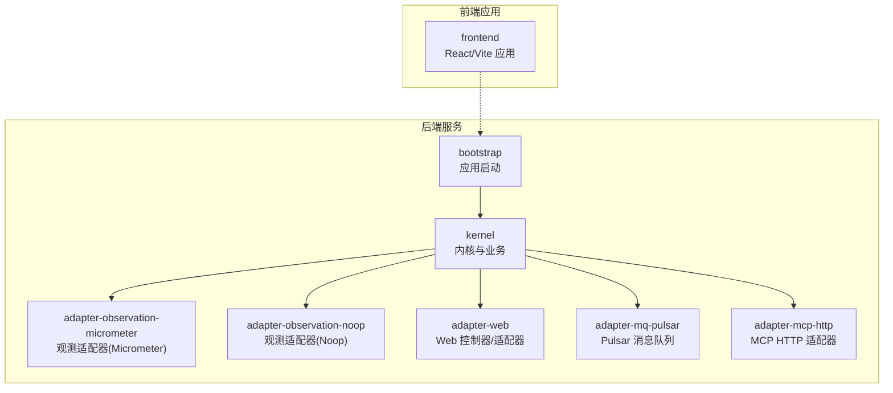
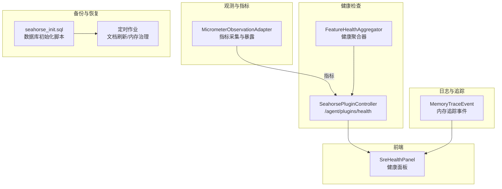
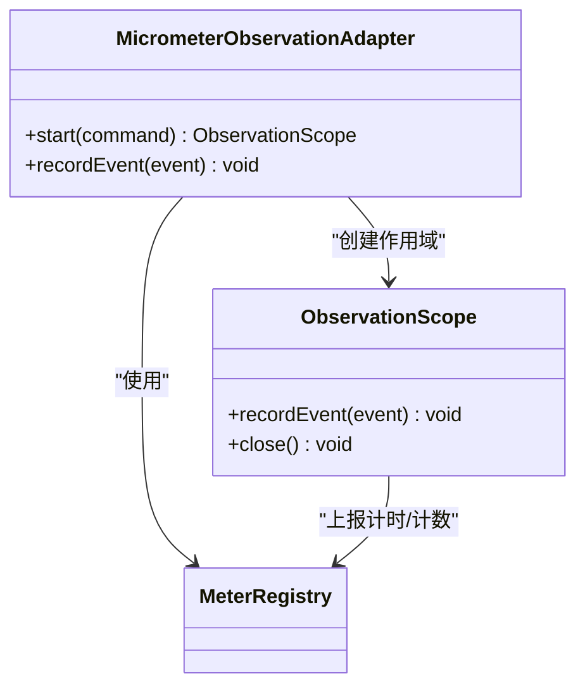
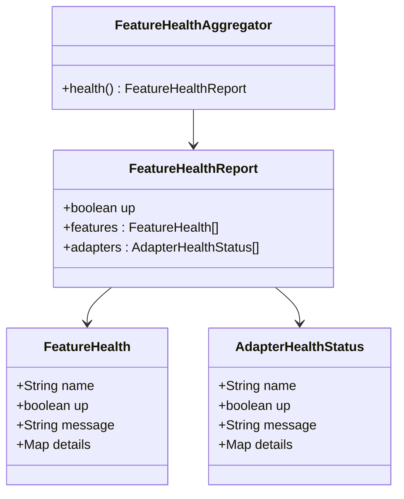
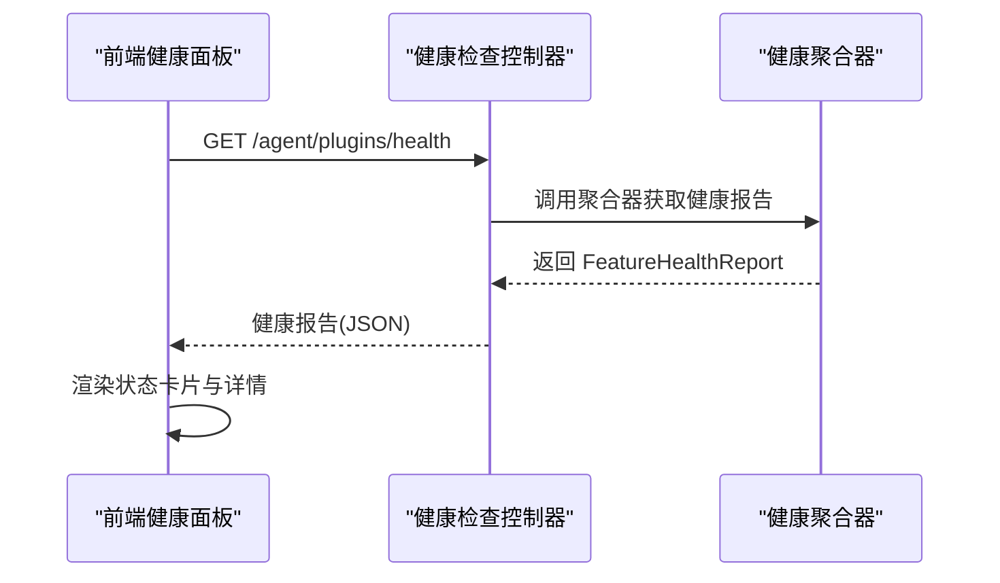
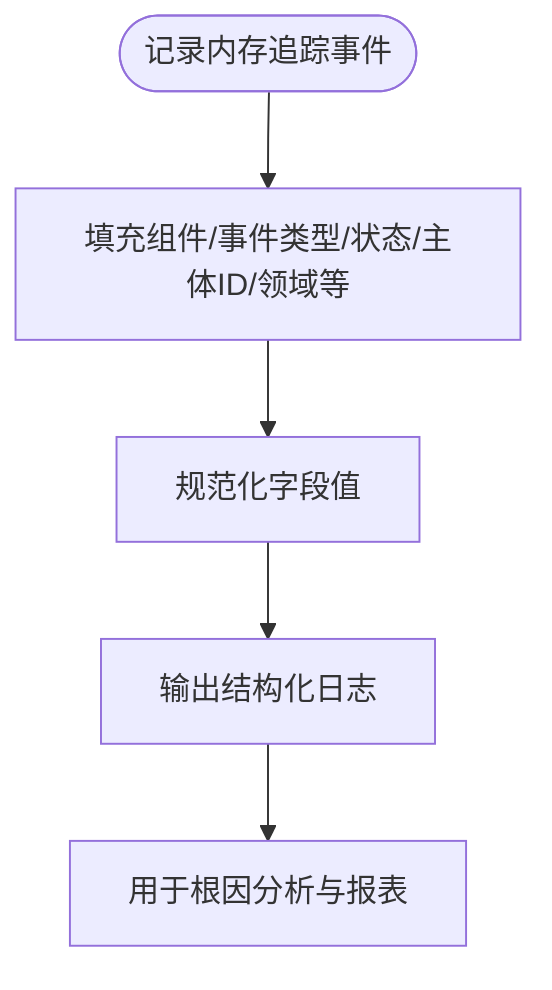
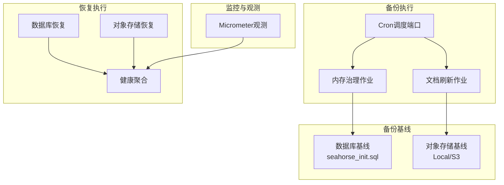
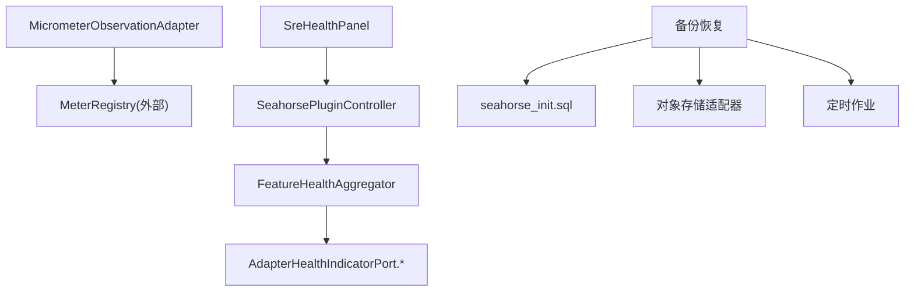
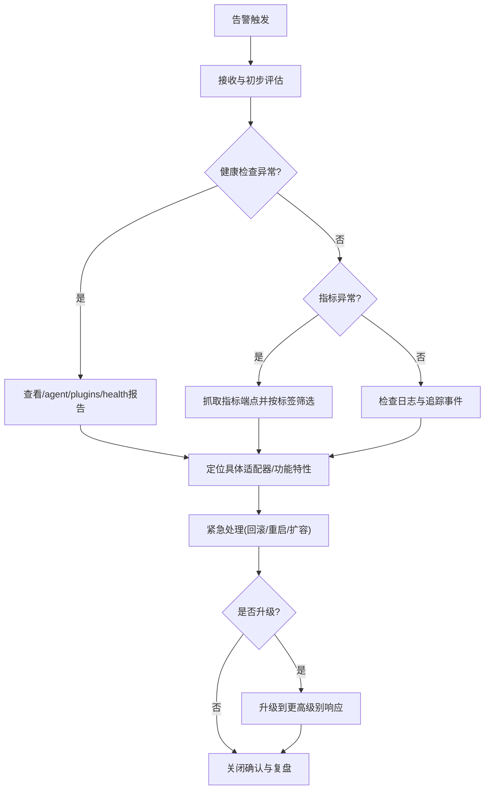

# 监控告警处理

<cite>
**本文引用的文件**
- [应用监控.md](file://docs/zh/content/监控运维/应用监控.md)
- [健康检查.md](file://docs/zh/content/监控运维/健康检查.md)
- [备份恢复.md](file://docs/zh/content/监控运维/备份恢复.md)
- [监控运维.md](file://docs/zh/content/监控运维/监控运维.md)
- [日志管理.md](file://docs/zh/content/监控运维/日志管理.md)
- [MicrometerObservationAdapter.java](file://seahorse-agent-adapter-observation-micrometer/src/main/java/com/miracle/ai/seahorse/agent/adapters/observation/micrometer/MicrometerObservationAdapter.java)
- [SreHealthPanel.tsx](file://frontend/src/pages/admin/dashboard/SreHealthPanel.tsx)
- [SeahorseSreHealthControllerTests.java](file://seahorse-agent-adapter-web/src/test/java/com/miracle/ai/seahorse/agent/adapters/web/SeahorseSreHealthControllerTests.java)
- [MemoryTraceEvent.java](file://seahorse-agent-kernel/src/main/java/com/miracle/ai/seahorse/agent/ports/outbound/memory/MemoryTraceEvent.java)
- [MemoryPolicyConfig.java](file://seahorse-agent-kernel/src/main/java/com/miracle/ai/seahorse/agent/ports/outbound/memory/MemoryPolicyConfig.java)
- [seahorse_init.sql](file://resources/database/seahorse_init.sql)
- [docker-compose.full.yml](file://docker-compose.full.yml)
- [docker-compose.yml](file://docker-compose.yml)
</cite>

## 目录
1. [引言](#引言)
2. [项目结构](#项目结构)
3. [核心组件](#核心组件)
4. [架构总览](#架构总览)
5. [详细组件分析](#详细组件分析)
6. [依赖分析](#依赖分析)
7. [性能考量](#性能考量)
8. [故障排查指南](#故障排查指南)
9. [结论](#结论)
10. [附录](#附录)

## 引言
本指南面向 Seahorse Agent 的监控与告警处理，系统化梳理指标采集、健康检查、日志与追踪、备份恢复与运维自动化等能力，提供从指标定义、阈值设定、告警响应到根因分析与优化提升的全流程方法论。文档内容严格基于仓库现有实现与文档，确保可落地与可验证。

## 项目结构
- 观测与指标：Micrometer 观测适配器负责将内核观测命令与事件映射为计数器、定时器等指标，统一暴露给外部监控系统。
- 健康检查：内核定义健康状态模型与聚合器，Web 层提供健康报告端点，适配器实现对数据库、向量库、消息队列与外部 API 的健康探测。
- 日志与追踪：内核提供入湖节点日志端口与内存追踪事件模型，结合 Micrometer 指标与结构化日志，支撑问题定位与审计。
- 备份与恢复：数据库初始化脚本、对象存储适配器与定时作业为备份恢复提供基础能力，结合健康聚合与观测指标形成闭环。

图表来源
- [日志管理.md:42-63](file://docs/zh/content/监控运维/日志管理.md#L42-L63)

章节来源
- [日志管理.md:42-63](file://docs/zh/content/监控运维/日志管理.md#L42-L63)

## 核心组件
- 观测与指标：通过 Micrometer 观测适配器输出计数器、定时器等指标，便于统一采集与告警。
- 健康检查：采用“功能特性 + 适配器”的双层聚合策略，确保启动诊断与管理端可观测性不受在线请求主链路影响。
- 分布式追踪：内核提供 RAG 追踪记录器与追踪模型，支持时长、错误清洗、追踪 ID 生成等。
- 入湖节点日志：内核定义入湖节点日志端口，适配器实现本地记录，便于审计与问题定位。
- 消息队列与超时：Pulsar 属性包含压缩类型、发送超时等参数，影响日志传输可靠性与性能。
- MCP 适配器：MCP HTTP 适配器提供调用超时与服务器列表配置，便于外部工具链日志对齐。

章节来源
- [日志管理.md:75-79](file://docs/zh/content/监控运维/日志管理.md#L75-L79)

## 架构总览
下图展示监控与告警处理在系统中的位置与交互关系：观测适配器输出指标，健康检查聚合器生成健康报告并通过 Web 控制器暴露，前端仪表板消费健康状态，日志与追踪辅助根因分析，备份恢复体系保障业务连续性。

图表来源
- [健康检查.md:40-75](file://docs/zh/content/监控运维/健康检查.md#L40-L75)
- [应用监控.md:33-37](file://docs/zh/content/监控运维/应用监控.md#L33-L37)

章节来源
- [健康检查.md:40-75](file://docs/zh/content/监控运维/健康检查.md#L40-L75)
- [应用监控.md:33-37](file://docs/zh/content/监控运维/应用监控.md#L33-L37)

## 详细组件分析

### 观测与指标组件
- 指标采集机制：适配器在 start 中开启计时采样，在作用域关闭时生成持续时间指标；recordEvent 用于上报事件计数，均通过 MeterRegistry 注册与上报。
- 指标分类与标签：指标前缀、观测标签、事件标签、属性标签等命名与标签体系设计，有助于统一聚合与告警。
- 暴露方式：通过 Micrometer 提供的 Registry（如 Prometheus、InfluxDB、CloudWatch）对接外部监控系统。

图表来源
- [应用监控.md:159-173](file://docs/zh/content/监控运维/应用监控.md#L159-L173)
- [MicrometerObservationAdapter.java:54-89](file://seahorse-agent-adapter-observation-micrometer/src/main/java/com/miracle/ai/seahorse/agent/adapters/observation/micrometer/MicrometerObservationAdapter.java#L54-L89)

章节来源
- [应用监控.md:159-173](file://docs/zh/content/监控运维/应用监控.md#L159-L173)
- [MicrometerObservationAdapter.java:54-89](file://seahorse-agent-adapter-observation-micrometer/src/main/java/com/miracle/ai/seahorse/agent/adapters/observation/micrometer/MicrometerObservationAdapter.java#L54-L89)

### 健康检查组件
- 状态模型：Feature 健康状态与 Adapter 健康状态，包含名称、是否健康、消息与详情。
- 聚合逻辑：聚合器对 Feature 与 Adapter 的健康状态进行汇总，任一不健康则整体不健康；异常会被转换为 DOWN 状态。
- 报告输出：输出整体健康布尔值与明细列表，便于前端与运维系统消费。

图表来源
- [健康检查.md:267-306](file://docs/zh/content/监控运维/健康检查.md#L267-L306)

章节来源
- [健康检查.md:267-306](file://docs/zh/content/monitoring/health.md#L267-L306)

### 前端健康面板组件
- 健康状态展示：根据后端健康报告渲染卡片，显示 UP/DOWN/HEALTHY 等状态与详情。
- 用户体验：支持加载态、无法加载提示，便于 SRE 与管理员快速掌握系统健康状况。

图表来源
- [SreHealthPanel.tsx:39-72](file://frontend/src/pages/admin/dashboard/SreHealthPanel.tsx#L39-L72)
- [SeahorseSreHealthControllerTests.java:44-55](file://seahorse-agent-adapter-web/src/test/java/com/miracle/ai/seahorse/agent/adapters/web/SeahorseSreHealthControllerTests.java#L44-L55)

章节来源
- [SreHealthPanel.tsx:39-72](file://frontend/src/pages/admin/dashboard/SreHealthPanel.tsx#L39-L72)
- [SeahorseSreHealthControllerTests.java:44-55](file://seahorse-agent-adapter-web/src/test/java/com/miracle/ai/seahorse/agent/adapters/web/SeahorseSreHealthControllerTests.java#L44-L55)

### 日志与追踪组件
- 入湖节点日志：内核定义入湖节点日志端口，适配器实现本地记录，便于审计与问题定位。
- 内存追踪事件：提供内存组件、事件类型、状态、主体 ID、领域等字段，支持按主题与状态进行聚合分析。
- 日志配置：推荐在 bootstrap 模块中提供默认日志配置，统一 JSON 格式输出，包含时间戳、级别、应用名、模块、线程、请求追踪 ID、消息体等字段。

图表来源
- [MemoryTraceEvent.java:65-83](file://seahorse-agent-kernel/src/main/java/com/miracle/ai/seahorse/agent/ports/outbound/memory/MemoryTraceEvent.java#L65-L83)

章节来源
- [MemoryTraceEvent.java:65-83](file://seahorse-agent-kernel/src/main/java/com/miracle/ai/seahorse/agent/ports/outbound/memory/MemoryTraceEvent.java#L65-L83)
- [日志管理.md:306-331](file://docs/zh/content/监控运维/日志管理.md#L306-L331)

### 备份与恢复组件
- 数据库基线：seahorse_init.sql 提供表结构与初始数据，是数据库备份与恢复的基础。
- 对象存储：本地与 S3 适配器支持知识库文档等对象的备份与恢复。
- 定时作业：文档刷新与内存治理等周期性任务体现备份恢复体系中的“巡检与维护”环节。
- 健康聚合：恢复完成后通过健康聚合器评估系统健康度，结合观测指标形成闭环。

图表来源
- [备份恢复.md:103-132](file://docs/zh/content/监控运维/备份恢复.md#L103-L132)

章节来源
- [备份恢复.md:103-132](file://docs/zh/content/监控运维/备份恢复.md#L103-L132)

## 依赖分析
- 观测适配器依赖 MeterRegistry 实现（Prometheus、InfluxDB、CloudWatch 等），通过统一接口对接外部监控系统。
- 健康聚合器依赖各适配器实现 AdapterHealthIndicatorPort.health()，形成统一的可观测性与自动化故障转移基础。
- 前端健康面板依赖 Web 控制器提供的健康报告端点，实现可视化展示。
- 备份恢复依赖数据库初始化脚本、对象存储适配器与定时作业，结合健康聚合与观测指标形成闭环。

图表来源
- [应用监控.md:360-368](file://docs/zh/content/监控运维/应用监控.md#L360-L368)
- [健康检查.md:40-75](file://docs/zh/content/监控运维/健康检查.md#L40-L75)
- [备份恢复.md:103-132](file://docs/zh/content/监控运维/备份恢复.md#L103-L132)

章节来源
- [应用监控.md:360-368](file://docs/zh/content/监控运维/应用监控.md#L360-L368)
- [健康检查.md:40-75](file://docs/zh/content/监控运维/健康检查.md#L40-L75)
- [备份恢复.md:103-132](file://docs/zh/content/监控运维/备份恢复.md#L103-L132)

## 性能考量
- 指标基数控制：遵循命名与标签规范，避免高基数动态键，降低内存与 CPU 开销。
- 上报策略：合理选择 MeterRegistry 实现与抓取频率，平衡可观测性与系统负载。
- 健康检查间隔：建议每 30-60 秒一次，避免过于频繁造成资源浪费。
- 日志格式：统一 JSON 格式输出，减少解析成本，便于日志聚合与分析。

## 故障排查指南
- 健康检查排查：通过 /agent/plugins/health 获取聚合报告，定位具体 Adapter 或 Feature 的 DOWN 项，结合异常消息与详情进行处置。
- 指标异常排查：利用 Micrometer 暴露的指标端点，结合标签筛选（如 observation、event、tenant）定位异常来源。
- 日志与追踪：结合 MemoryTraceEvent 与结构化日志，按组件、事件类型、状态进行聚合分析，快速定位问题根因。
- 备份恢复演练：定期执行数据库与对象存储的恢复演练，验证 RPO/RTO 目标，完善自动化巡检与监控告警。

图表来源
- [健康检查.md:360-371](file://docs/zh/content/监控运维/健康检查.md#L360-L371)
- [应用监控.md:360-368](file://docs/zh/content/监控运维/应用监控.md#L360-L368)
- [日志管理.md:306-331](file://docs/zh/content/监控运维/日志管理.md#L306-L331)

章节来源
- [健康检查.md:360-371](file://docs/zh/content/监控运维/健康检查.md#L360-L371)
- [应用监控.md:360-368](file://docs/zh/content/监控运维/应用监控.md#L360-L368)
- [日志管理.md:306-331](file://docs/zh/content/监控运维/日志管理.md#L306-L331)

## 结论
本指南基于仓库现有实现，建立了从观测指标、健康检查、日志追踪到备份恢复与运维自动化的完整监控告警处理框架。建议在核心业务模块统一接入观测端口，遵循命名与标签规范，持续优化指标基数与上报策略，并结合健康检查与日志追踪完善告警响应与根因分析流程。

## 附录

### 监控指标与阈值建议
- 系统资源指标
  - CPU 使用率：短期峰值 > 80% 持续 5 分钟；长期平均 > 60%
  - 内存使用率：短期峰值 > 85%；长期平均 > 70%
  - 磁盘空间：剩余 < 10%
- 应用性能指标
  - 请求延迟（P95/P99）：超过 SLA 阈值（如 > 2s）
  - 错误率：错误计数/总请求数 > 1%
  - 超时率：超时计数/总请求 > 0.5%
- 业务指标
  - 关键业务事件（如“知识入库完成”、“对话成功”）速率下降 > 30%
  - 内存相关事件（如“outbox backlog”）阈值参考 MemoryPolicyConfig 中的 outboxBacklogAlertThreshold

章节来源
- [应用监控.md:346-358](file://docs/zh/content/监控运维/应用监控.md#L346-L358)
- [MemoryPolicyConfig.java:161-162](file://seahorse-agent-kernel/src/main/java/com/miracle/ai/seahorse/agent/ports/outbound/memory/MemoryPolicyConfig.java#L161-L162)

### 告警响应流程
- 告警接收：通过外部监控系统（Prometheus/Grafana）接收指标/健康检查告警
- 初步评估：查看健康报告与指标趋势，判断影响范围
- 紧急处理：执行回滚、重启、扩容等操作
- 升级流程：若问题扩大，升级到更高级别响应
- 关闭确认：验证恢复后关闭告警并进行复盘

章节来源
- [监控运维.md:365-378](file://docs/zh/content/监控运维/监控运维.md#L365-L378)

### 根因分析方法
- 时间线分析：结合日志时间戳与追踪 ID，重建事件顺序
- 依赖关系排查：通过健康检查报告定位依赖组件（数据库、向量库、消息队列、外部 API）
- 影响范围评估：按租户、组件、事件类型进行聚合统计
- 根本原因定位：结合 MemoryTraceEvent 与结构化日志，定位异常组件与状态

章节来源
- [日志管理.md:306-331](file://docs/zh/content/监控运维/日志管理.md#L306-L331)
- [MemoryTraceEvent.java:65-83](file://seahorse-agent-kernel/src/main/java/com/miracle/ai/seahorse/agent/ports/outbound/memory/MemoryTraceEvent.java#L65-L83)

### 告警分类与优先级
- 系统级告警：数据库/消息队列/外部 API 不健康，优先级最高
- 业务级告警：关键业务事件速率下降或错误率上升，优先级高
- 用户体验告警：延迟/超时/错误率上升影响用户，优先级高

章节来源
- [健康检查.md:360-366](file://docs/zh/content/监控运维/健康检查.md#L360-L366)
- [监控运维.md:365-378](file://docs/zh/content/监控运维/监控运维.md#L365-L378)

### 监控系统维护与优化
- 指标体系完善：统一命名与标签，控制指标基数
- 告警规则调整：结合历史趋势与 SLA 动态调整阈值
- 监控覆盖率提升：在核心业务模块统一接入观测端口与健康检查
- 运维自动化：基于指标与健康报告实现自动扩容与故障恢复

章节来源
- [应用监控.md:346-358](file://docs/zh/content/监控运维/应用监控.md#L346-L358)
- [监控运维.md:365-378](file://docs/zh/content/监控运维/监控运维.md#L365-L378)

### 监控数据可视化与报表分析
- 指标可视化：通过 Grafana/Prometheus 暴露端点构建仪表板
- 日志可视化：通过 ELK/EFK 聚合结构化日志，结合追踪 ID 串联
- 报表分析：按时间、租户、组件、事件类型进行多维分析，识别趋势与异常模式

章节来源
- [应用监控.md:360-368](file://docs/zh/content/监控运维/应用监控.md#L360-L368)
- [日志管理.md:325-331](file://docs/zh/content/监控运维/日志管理.md#L325-L331)

### 备份与灾难恢复
- 数据备份：数据库全量/增量备份，对象存储与向量库一致性校验
- 配置备份：配置中心与 Compose 文件版本化管理
- 灾难恢复：定期演练恢复流程，明确 RPO/RTO 目标
- 恢复验证：恢复完成后通过健康聚合与观测指标验证系统健康度

章节来源
- [备份恢复.md:298-302](file://docs/zh/content/监控运维/备份恢复.md#L298-L302)
- [备份恢复.md:103-132](file://docs/zh/content/监控运维/备份恢复.md#L103-L132)
- [seahorse_init.sql](file://resources/database/seahorse_init.sql)