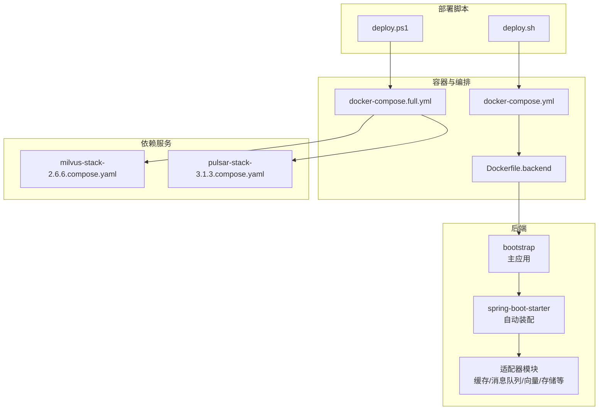
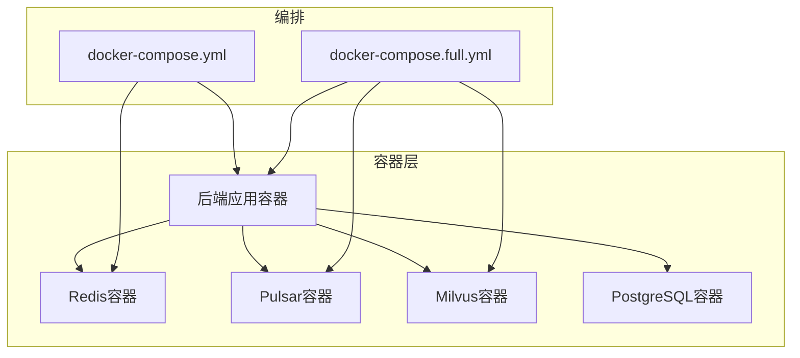
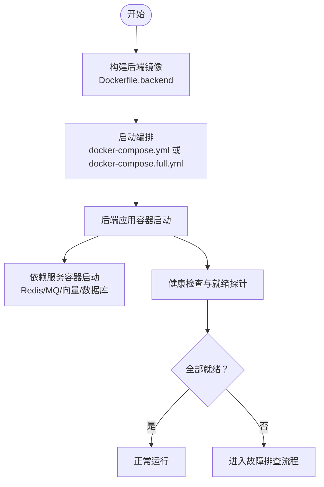
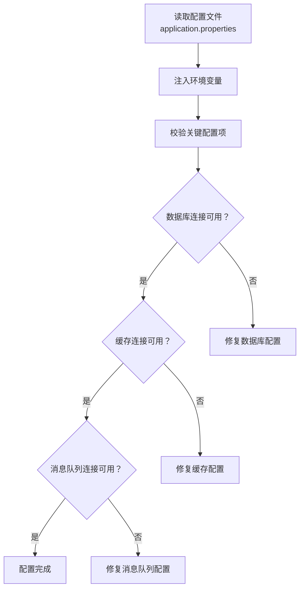
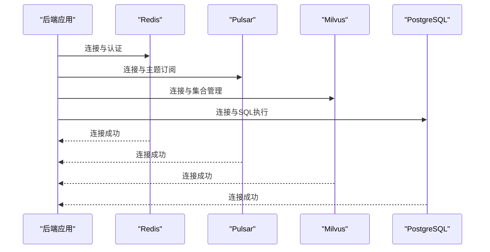
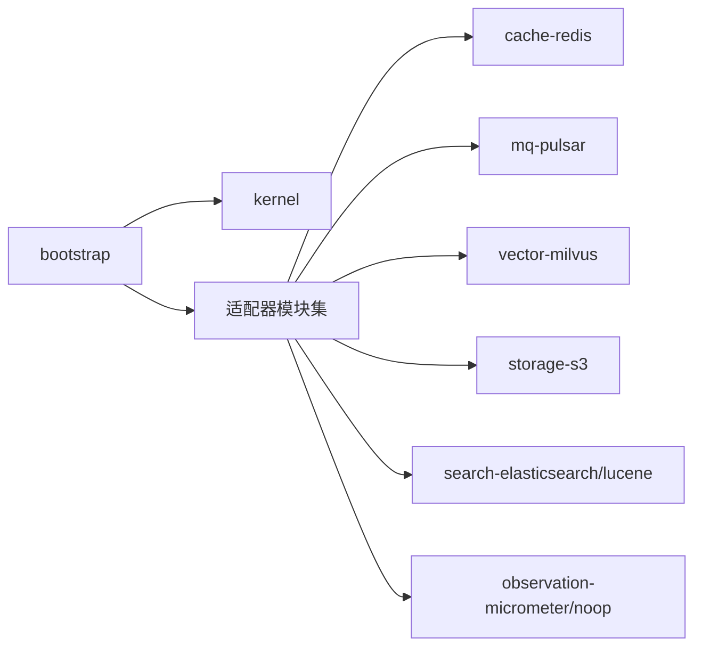
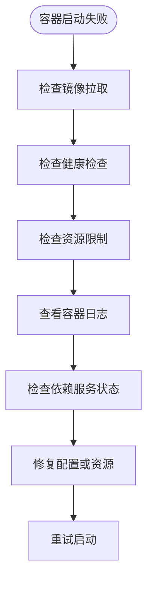

# 部署问题排查

<cite>
**本文引用的文件**
- [DEPLOY.md](file://DEPLOY.md)
- [Dockerfile.backend](file://Dockerfile.backend)
- [docker-compose.yml](file://docker-compose.yml)
- [docker-compose.full.yml](file://docker-compose.full.yml)
- [deploy.sh](file://deploy.sh)
- [deploy.ps1](file://deploy.ps1)
- [application.properties](file://seahorse-agent-bootstrap/src/main/resources/application.properties)
- [SeahorseAgentApplication.java](file://seahorse-agent-bootstrap/src/main/java/com/miracle/ai/seahorse/agent/SeahorseAgentApplication.java)
- [milvus-stack-2.6.6.compose.yaml](file://resources/docker/milvus-stack-2.6.6.compose.yaml)
- [pulsar-stack-3.1.3.compose.yaml](file://resources/docker/pulsar-stack-3.1.3.compose.yaml)
- [milvus-stack-2.5.8.compose.yaml](file://resources/docker/lightweight/milvus-stack-2.5.8.compose.yaml)
- [README.md](file://docs/zh/content/监控运维/README.md)
- [2026-05-20-memory-filtering-implementation.md](file://docs/aegis/plans/2026-05-20-memory-filtering-implementation.md)
</cite>

## 目录
1. [简介](#简介)
2. [项目结构](#项目结构)
3. [核心组件](#核心组件)
4. [架构总览](#架构总览)
5. [详细组件分析](#详细组件分析)
6. [依赖分析](#依赖分析)
7. [性能考虑](#性能考虑)
8. [故障排查指南](#故障排查指南)
9. [结论](#结论)
10. [附录](#附录)

## 简介
本指南面向部署与运维工程师，聚焦于Seahorse Agent在容器化与Kubernetes环境中的常见部署问题，提供系统化的诊断流程与解决方案。内容涵盖容器启动失败（镜像拉取、健康检查、资源限制）、配置文件错误（环境变量、语法与配置项验证）、依赖服务连接问题（数据库、消息队列、缓存）、端口冲突与网络配置、版本兼容性、Kubernetes部署问题以及部署回滚与恢复操作。

## 项目结构
Seahorse Agent采用多模块Maven工程，后端主应用位于bootstrap模块，适配器模块覆盖缓存、消息队列、向量存储、存储、解析器、观察等能力。部署相关的关键文件包括：
- 容器化：后端Dockerfile、前端Dockerfile、Compose编排
- 部署脚本：Shell与PowerShell部署脚本
- 应用配置：Spring Boot配置文件
- 依赖服务编排：Milvus与Pulsar的Compose模板

**图表来源**
- [Dockerfile.backend](file://Dockerfile.backend)
- [docker-compose.yml](file://docker-compose.yml)
- [docker-compose.full.yml](file://docker-compose.full.yml)
- [milvus-stack-2.6.6.compose.yaml](file://resources/docker/milvus-stack-2.6.6.compose.yaml)
- [pulsar-stack-3.1.3.compose.yaml](file://resources/docker/pulsar-stack-3.1.3.compose.yaml)

**章节来源**
- [Dockerfile.backend](file://Dockerfile.backend)
- [docker-compose.yml](file://docker-compose.yml)
- [docker-compose.full.yml](file://docker-compose.full.yml)

## 核心组件
- 主应用与启动类：负责Spring Boot应用初始化与运行。
- Spring Boot配置：集中管理应用属性，如端口、数据库连接、缓存与消息队列参数等。
- 适配器模块：提供对外部系统的抽象实现，如Redis缓存、Pulsar消息队列、Milvus向量存储、S3对象存储等。
- 容器与编排：通过Dockerfile构建镜像，通过Compose编排后端与依赖服务。
- 部署脚本：提供一键部署后端或全栈（含Milvus/Pulsar）的自动化脚本。

**章节来源**
- [SeahorseAgentApplication.java](file://seahorse-agent-bootstrap/src/main/java/com/miracle/ai/seahorse/agent/SeahorseAgentApplication.java)
- [application.properties](file://seahorse-agent-bootstrap/src/main/resources/application.properties)
- [Dockerfile.backend](file://Dockerfile.backend)

## 架构总览
下图展示后端应用与依赖服务的交互关系，以及容器化与编排部署方式：

**图表来源**
- [docker-compose.yml](file://docker-compose.yml)
- [docker-compose.full.yml](file://docker-compose.full.yml)
- [milvus-stack-2.6.6.compose.yaml](file://resources/docker/milvus-stack-2.6.6.compose.yaml)
- [pulsar-stack-3.1.3.compose.yaml](file://resources/docker/pulsar-stack-3.1.3.compose.yaml)

## 详细组件分析

### 容器与镜像构建
- 后端镜像构建：基于Dockerfile.backend进行多阶段构建，确保最终镜像体积最小且包含运行时依赖。
- 前端镜像构建：独立的Dockerfile.frontend用于构建静态资源镜像，通常配合Nginx使用。
- Compose编排：通过docker-compose.yml定义后端应用及其依赖服务；docker-compose.full.yml扩展包含Milvus与Pulsar。

**图表来源**
- [Dockerfile.backend](file://Dockerfile.backend)
- [docker-compose.yml](file://docker-compose.yml)
- [docker-compose.full.yml](file://docker-compose.full.yml)

**章节来源**
- [Dockerfile.backend](file://Dockerfile.backend)
- [docker-compose.yml](file://docker-compose.yml)
- [docker-compose.full.yml](file://docker-compose.full.yml)

### 配置文件与环境变量
- Spring Boot配置：application.properties集中管理端口、数据库连接、缓存与消息队列参数等。
- 环境变量注入：可通过Docker环境变量或Kubernetes ConfigMap/Secret注入配置。
- 配置项验证：建议在部署前对关键配置项进行语法与连通性校验。

**图表来源**
- [application.properties](file://seahorse-agent-bootstrap/src/main/resources/application.properties)

**章节来源**
- [application.properties](file://seahorse-agent-bootstrap/src/main/resources/application.properties)

### 依赖服务连接
- Redis：用于键值缓存、分布式锁与信号量等。
- Pulsar：作为消息队列承载任务流与事件。
- Milvus：作为向量数据库支持检索增强。
- PostgreSQL：作为关系型数据存储。

**图表来源**
- [milvus-stack-2.6.6.compose.yaml](file://resources/docker/milvus-stack-2.6.6.compose.yaml)
- [pulsar-stack-3.1.3.compose.yaml](file://resources/docker/pulsar-stack-3.1.3.compose.yaml)

**章节来源**
- [milvus-stack-2.6.6.compose.yaml](file://resources/docker/milvus-stack-2.6.6.compose.yaml)
- [pulsar-stack-3.1.3.compose.yaml](file://resources/docker/pulsar-stack-3.1.3.compose.yaml)

### 端口冲突与网络配置
- 端口绑定：后端应用默认端口需避免与宿主机或其他容器冲突。
- 防火墙规则：确保容器间与外部访问所需的端口开放。
- 负载均衡：在Kubernetes中通过Service暴露服务，并配置Ingress以实现外部访问。

**章节来源**
- [docker-compose.yml](file://docker-compose.yml)
- [docker-compose.full.yml](file://docker-compose.full.yml)

### 版本兼容性
- Java版本：确保构建与运行环境的Java版本满足项目要求。
- 数据库版本：PostgreSQL版本需与JDBC驱动及应用适配器兼容。
- 第三方库版本：关注向量库、消息队列客户端与Spring生态的版本匹配。

**章节来源**
- [milvus-stack-2.6.6.compose.yaml](file://resources/docker/milvus-stack-2.6.6.compose.yaml)
- [milvus-stack-2.5.8.compose.yaml](file://resources/docker/lightweight/milvus-stack-2.5.8.compose.yaml)
- [pulsar-stack-3.1.3.compose.yaml](file://resources/docker/pulsar-stack-3.1.3.compose.yaml)

### Kubernetes部署诊断
- Pod状态检查：查看Pod重启次数、事件与日志，定位启动失败原因。
- 服务发现：确认Service与Endpoints配置正确，DNS解析正常。
- 存储卷挂载：检查PersistentVolume与PersistentVolumeClaim绑定与挂载权限。

**章节来源**
- [docker-compose.full.yml](file://docker-compose.full.yml)

## 依赖分析
- 模块耦合：bootstrap依赖spring-boot-starter与各适配器模块；适配器模块通过SPI/Meta-INF配置与核心内核解耦。
- 外部依赖：Redis、Pulsar、Milvus、PostgreSQL构成核心依赖链路。
- 部署脚本：Shell与PowerShell脚本分别面向Linux与Windows环境，统一调用Compose进行部署。

**图表来源**
- [SeahorseAgentApplication.java](file://seahorse-agent-bootstrap/src/main/java/com/miracle/ai/seahorse/agent/SeahorseAgentApplication.java)

**章节来源**
- [SeahorseAgentApplication.java](file://seahorse-agent-bootstrap/src/main/java/com/miracle/ai/seahorse/agent/SeahorseAgentApplication.java)

## 性能考虑
- 资源限制：为容器设置合理的CPU与内存限制，避免过低导致启动缓慢或OOM。
- 连接池：缓存与数据库连接池大小应根据并发与延迟需求调优。
- 依赖服务性能：Milvus与Pulsar的副本数与磁盘I/O直接影响检索与消息吞吐。

## 故障排查指南

### 容器启动失败诊断
- 镜像拉取失败
  - 检查镜像仓库可达性与认证配置。
  - 使用本地构建替代远程拉取，验证镜像完整性。
- 容器健康检查失败
  - 查看容器日志与健康检查探针配置。
  - 确认依赖服务已就绪后再启动应用容器。
- 资源限制问题
  - 提升CPU/内存限制或优化应用内存使用。
  - 关注GC与堆外内存占用情况。

**图表来源**
- [docker-compose.yml](file://docker-compose.yml)
- [docker-compose.full.yml](file://docker-compose.full.yml)

**章节来源**
- [docker-compose.yml](file://docker-compose.yml)
- [docker-compose.full.yml](file://docker-compose.full.yml)

### 配置文件错误排查
- 环境变量设置
  - 确认所有必需环境变量已注入，尤其是数据库、缓存与消息队列的连接信息。
- 配置文件语法检查
  - 对application.properties进行键名与格式校验，避免拼写错误。
- 配置项验证
  - 在部署前执行连通性测试，确保数据库、缓存与消息队列可访问。

**章节来源**
- [application.properties](file://seahorse-agent-bootstrap/src/main/resources/application.properties)

### 依赖服务连接问题
- 数据库服务
  - 检查连接字符串、用户名密码与网络连通性。
- 消息队列
  - 确认主题/命名空间权限与消费者组配置。
- 缓存服务
  - 验证集群模式与ACL策略，确保读写权限。

**章节来源**
- [milvus-stack-2.6.6.compose.yaml](file://resources/docker/milvus-stack-2.6.6.compose.yaml)
- [pulsar-stack-3.1.3.compose.yaml](file://resources/docker/pulsar-stack-3.1.3.compose.yaml)

### 端口冲突与网络配置
- 端口绑定
  - 修改compose或k8s Service端口映射，避免与宿主机或集群其他服务冲突。
- 防火墙规则
  - 放行容器间通信与外部访问所需端口。
- 负载均衡
  - 在Kubernetes中配置Service与Ingress，确保流量正确路由。

**章节来源**
- [docker-compose.yml](file://docker-compose.yml)
- [docker-compose.full.yml](file://docker-compose.full.yml)

### 版本兼容性问题
- Java版本
  - 统一构建与运行环境的Java版本，避免字节码不兼容。
- 数据库版本
  - 确保JDBC驱动与数据库版本匹配，必要时升级驱动。
- 第三方库版本
  - 对照依赖树，锁定关键库版本，避免冲突。

**章节来源**
- [milvus-stack-2.6.6.compose.yaml](file://resources/docker/milvus-stack-2.6.6.compose.yaml)
- [milvus-stack-2.5.8.compose.yaml](file://resources/docker/lightweight/milvus-stack-2.5.8.compose.yaml)
- [pulsar-stack-3.1.3.compose.yaml](file://resources/docker/pulsar-stack-3.1.3.compose.yaml)

### Kubernetes部署问题
- Pod状态检查
  - 使用kubectl describe pod查看事件与重启原因。
- 服务发现
  - 检查Service选择器与Endpoints，确保DNS解析正常。
- 存储卷挂载
  - 校验PVC绑定状态与挂载权限，确认持久化数据可用。

**章节来源**
- [docker-compose.full.yml](file://docker-compose.full.yml)

### 部署回滚与恢复
- 回滚策略
  - 通过版本标签与镜像版本控制，快速回退到上一个稳定版本。
- 恢复操作
  - 利用备份恢复数据库与对象存储数据，确保业务连续性。
- 自动化脚本
  - 使用deploy.sh/deploy.ps1进行一键回滚与恢复。

**章节来源**
- [deploy.sh](file://deploy.sh)
- [deploy.ps1](file://deploy.ps1)

## 结论
通过系统化的部署问题排查流程，结合容器化与编排工具、配置文件校验、依赖服务连通性测试、端口与网络检查、版本兼容性管理以及Kubernetes专项诊断，可以有效定位并解决Seahorse Agent在生产环境中的部署问题。建议在变更发布前进行充分的预检与演练，确保回滚与恢复机制完备。

## 附录
- 参考文档与规范：监控运维文档、AI Infra相关设计与实施计划等。

**章节来源**
- [README.md](file://docs/zh/content/监控运维/README.md)
- [2026-05-20-memory-filtering-implementation.md](file://docs/aegis/plans/2026-05-20-memory-filtering-implementation.md)