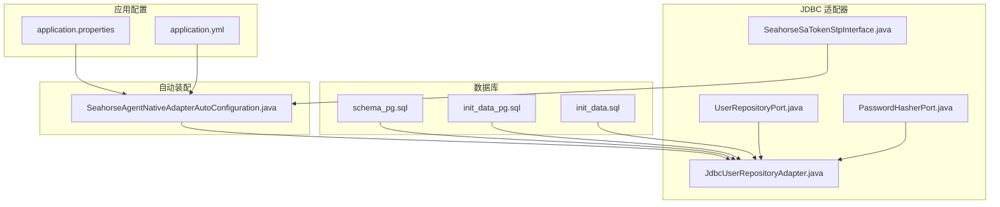
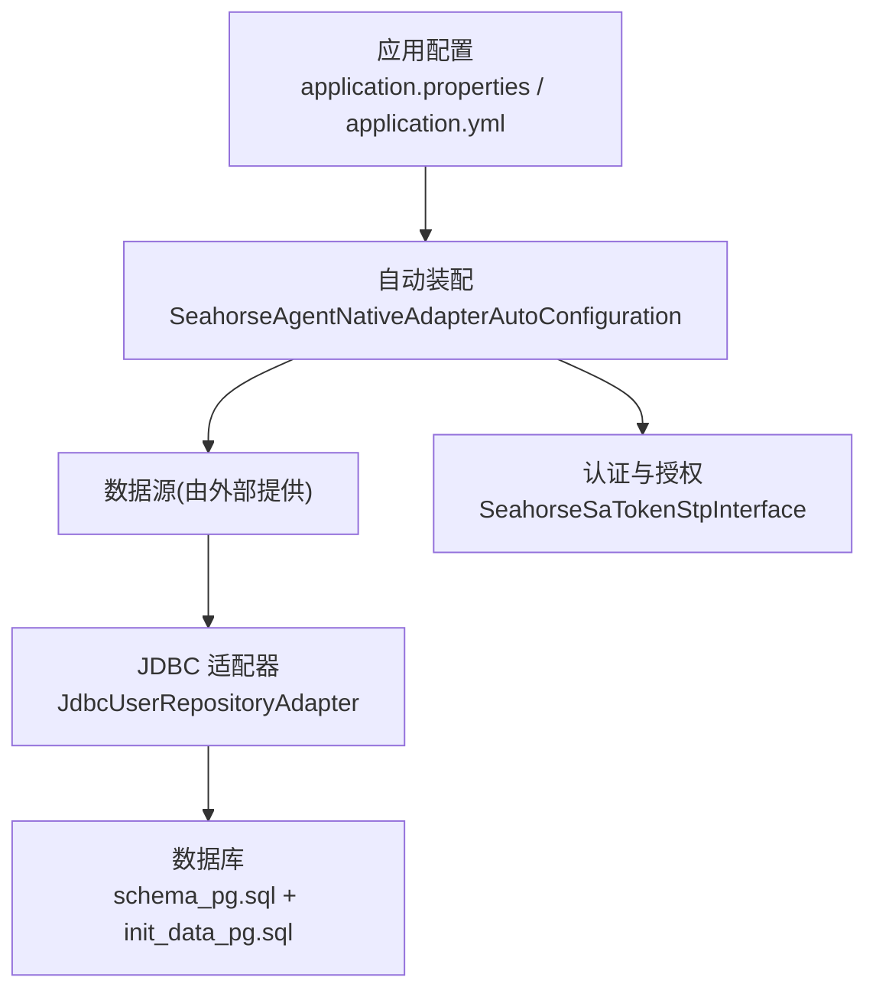
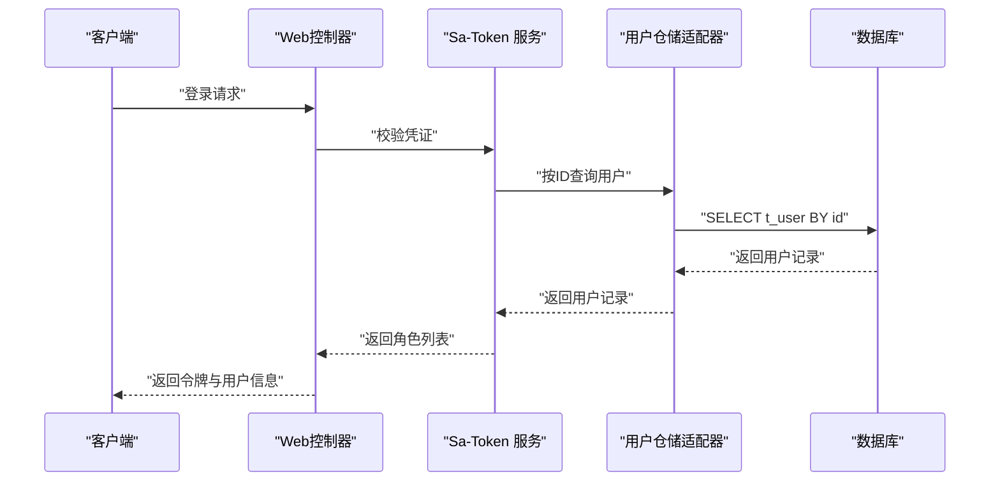
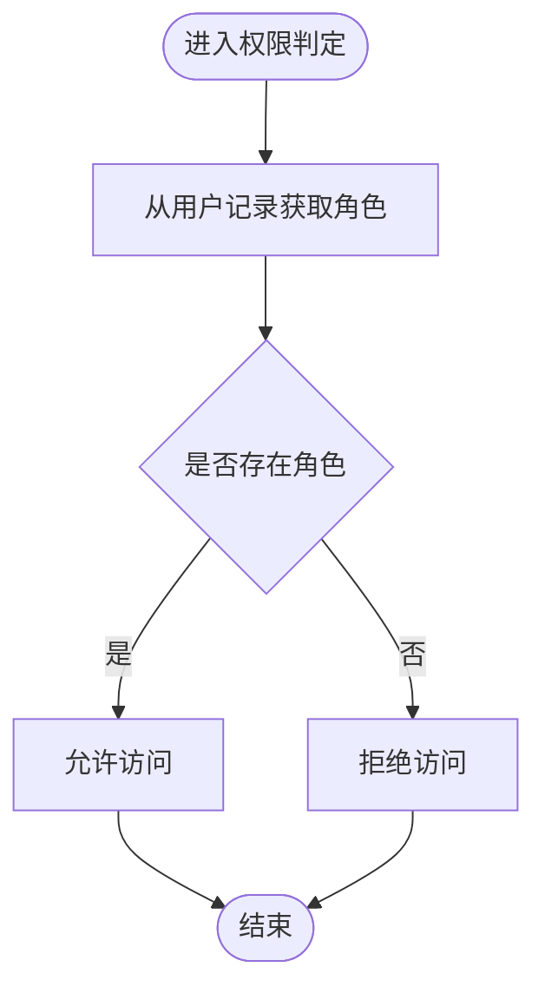
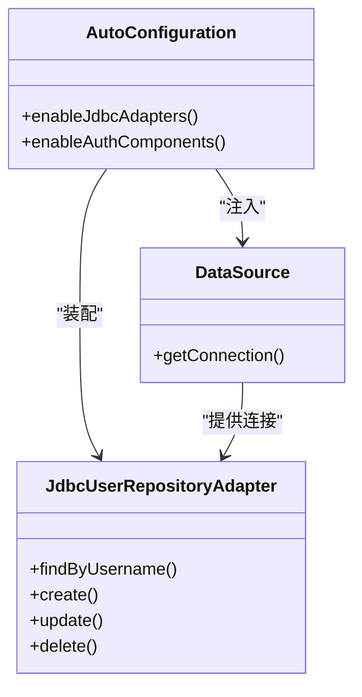
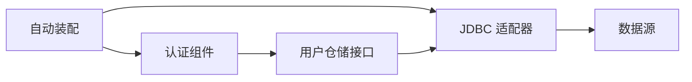

# 安全配置

<cite>
**本文引用的文件**
- [application.properties](file://seahorse-agent-bootstrap/src/main/resources/application.properties)
- [application.yml](file://seahorse-agent-mcp-server/src/main/resources/application.yml)
- [schema_pg.sql](file://resources/database/schema_pg.sql)
- [init_data_pg.sql](file://resources/database/init_data_pg.sql)
- [init_data.sql](file://resources/database/backups/init_data.sql)
- [SeahorseAgentNativeAdapterAutoConfiguration.java](file://seahorse-agent-spring-boot-starter/src/main/java/com/miracle/ai/seahorse/agent/adapters/spring/SeahorseAgentNativeAdapterAutoConfiguration.java)
- [JdbcUserRepositoryAdapter.java](file://seahorse-agent-adapter-repository-jdbc/src/main/java/com/miracle/ai/seahorse/agent/adapters/repository/jdbc/JdbcUserRepositoryAdapter.java)
- [UserRepositoryPort.java](file://seahorse-agent-kernel/src/main/java/com/miracle/ai/seahorse/agent/ports/outbound/auth/UserRepositoryPort.java)
- [PasswordHasherPort.java](file://seahorse-agent-kernel/src/main/java/com/miracle/ai/seahorse/agent/ports/outbound/auth/PasswordHasherPort.java)
- [SeahorseSaTokenStpInterface.java](file://seahorse-agent-adapter-web/src/main/java/com/miracle/ai/seahorse/agent/adapters/web/SeahorseSaTokenStpInterface.java)
- [OA系统数据安全规范文档.md](file://resources/docs/knowledge/biz/biz-oa/OA系统数据安全规范文档.md)
</cite>

## 目录
1. [简介](#简介)
2. [项目结构](#项目结构)
3. [核心组件](#核心组件)
4. [架构总览](#架构总览)
5. [详细组件分析](#详细组件分析)
6. [依赖关系分析](#依赖关系分析)
7. [性能考量](#性能考量)
8. [故障排查指南](#故障排查指南)
9. [结论](#结论)
10. [附录](#附录)

## 简介
本文件面向 Seahorse Agent 的数据库安全配置，系统梳理访问控制、身份认证、权限管理、连接安全、数据加密策略、审计与监控、备份与恢复、漏洞防护及最佳实践与合规要求。文档基于仓库中的数据库模式、初始化数据、自动装配与 JDBC 适配器等实现进行分析，并结合企业级安全规范进行补充说明。

## 项目结构
围绕数据库安全的关键位置与职责如下：
- 数据库模式与索引：定义表结构、字段注释、索引与扩展（如向量扩展），用于支撑访问控制与性能优化
- 初始化数据：包含默认管理员账户，用于系统初始安全基线
- 应用配置：应用名称、端口、内核开关等基础配置
- 自动装配：根据属性选择启用 JDBC 适配器与认证组件，决定数据库连接与认证路径
- JDBC 适配器：封装用户等核心实体的数据库访问逻辑，承担数据持久化与安全边界

**图示来源**
- [application.properties:1-4](file://seahorse-agent-bootstrap/src/main/resources/application.properties#L1-L4)
- [application.yml:1-7](file://seahorse-agent-mcp-server/src/main/resources/application.yml#L1-L7)
- [schema_pg.sql:1-800](file://resources/database/schema_pg.sql#L1-L800)
- [init_data_pg.sql:1-5](file://resources/database/init_data_pg.sql#L1-L5)
- [init_data.sql:1-4](file://resources/database/backups/init_data.sql#L1-L4)
- [SeahorseAgentNativeAdapterAutoConfiguration.java:326-358](file://seahorse-agent-spring-boot-starter/src/main/java/com/miracle/ai/seahorse/agent/adapters/spring/SeahorseAgentNativeAdapterAutoConfiguration.java#L326-L358)
- [JdbcUserRepositoryAdapter.java:120-154](file://seahorse-agent-adapter-repository-jdbc/src/main/java/com/miracle/ai/seahorse/agent/adapters/repository/jdbc/JdbcUserRepositoryAdapter.java#L120-L154)
- [UserRepositoryPort.java:1-37](file://seahorse-agent-kernel/src/main/java/com/miracle/ai/seahorse/agent/ports/outbound/auth/UserRepositoryPort.java#L1-L37)
- [PasswordHasherPort.java:1-39](file://seahorse-agent-kernel/src/main/java/com/miracle/ai/seahorse/agent/ports/outbound/auth/PasswordHasherPort.java#L1-L39)
- [SeahorseSaTokenStpInterface.java:32-50](file://seahorse-agent-adapter-web/src/main/java/com/miracle/ai/seahorse/agent/adapters/web/SeahorseSaTokenStpInterface.java#L32-L50)

**章节来源**
- [application.properties:1-4](file://seahorse-agent-bootstrap/src/main/resources/application.properties#L1-L4)
- [application.yml:1-7](file://seahorse-agent-mcp-server/src/main/resources/application.yml#L1-L7)
- [schema_pg.sql:1-800](file://resources/database/schema_pg.sql#L1-L800)
- [init_data_pg.sql:1-5](file://resources/database/init_data_pg.sql#L1-L5)
- [init_data.sql:1-4](file://resources/database/backups/init_data.sql#L1-L4)
- [SeahorseAgentNativeAdapterAutoConfiguration.java:326-358](file://seahorse-agent-spring-boot-starter/src/main/java/com/miracle/ai/seahorse/agent/adapters/spring/SeahorseAgentNativeAdapterAutoConfiguration.java#L326-L358)

## 核心组件
- 数据库模式与索引
  - 使用向量扩展支持向量检索，建立 GIN/HNSW 等索引提升查询性能
  - 表含字段注释，明确主键、唯一约束、软删除标记等，便于审计与合规
- 初始化数据
  - 提供默认管理员账户，用于系统初始安全基线
- 自动装配
  - 依据属性启用 JDBC 适配器与认证组件，决定数据库连接与认证路径
- JDBC 适配器
  - 封装用户等核心实体的数据库访问逻辑，承担数据持久化与安全边界
- 认证与授权
  - 基于 Sa-Token 的角色读取，从用户记录中派生角色，作为权限判断依据

**章节来源**
- [schema_pg.sql:1-800](file://resources/database/schema_pg.sql#L1-L800)
- [init_data_pg.sql:1-5](file://resources/database/init_data_pg.sql#L1-L5)
- [SeahorseAgentNativeAdapterAutoConfiguration.java:326-358](file://seahorse-agent-spring-boot-starter/src/main/java/com/miracle/ai/seahorse/agent/adapters/spring/SeahorseAgentNativeAdapterAutoConfiguration.java#L326-L358)
- [JdbcUserRepositoryAdapter.java:120-154](file://seahorse-agent-adapter-repository-jdbc/src/main/java/com/miracle/ai/seahorse/agent/adapters/repository/jdbc/JdbcUserRepositoryAdapter.java#L120-L154)
- [SeahorseSaTokenStpInterface.java:32-50](file://seahorse-agent-adapter-web/src/main/java/com/miracle/ai/seahorse/agent/adapters/web/SeahorseSaTokenStpInterface.java#L32-L50)

## 架构总览
下图展示数据库安全相关的组件交互：应用配置驱动自动装配，自动装配加载 JDBC 适配器与认证组件，JDBC 适配器通过数据源访问数据库，同时遵循模式与索引设计。

**图示来源**
- [application.properties:1-4](file://seahorse-agent-bootstrap/src/main/resources/application.properties#L1-L4)
- [application.yml:1-7](file://seahorse-agent-mcp-server/src/main/resources/application.yml#L1-L7)
- [SeahorseAgentNativeAdapterAutoConfiguration.java:326-358](file://seahorse-agent-spring-boot-starter/src/main/java/com/miracle/ai/seahorse/agent/adapters/spring/SeahorseAgentNativeAdapterAutoConfiguration.java#L326-L358)
- [JdbcUserRepositoryAdapter.java:120-154](file://seahorse-agent-adapter-repository-jdbc/src/main/java/com/miracle/ai/seahorse/agent/adapters/repository/jdbc/JdbcUserRepositoryAdapter.java#L120-L154)
- [schema_pg.sql:1-800](file://resources/database/schema_pg.sql#L1-L800)
- [init_data_pg.sql:1-5](file://resources/database/init_data_pg.sql#L1-L5)
- [SeahorseSaTokenStpInterface.java:32-50](file://seahorse-agent-adapter-web/src/main/java/com/miracle/ai/seahorse/agent/adapters/web/SeahorseSaTokenStpInterface.java#L32-L50)

## 详细组件分析

### 访问控制与身份认证
- 用户与角色
  - 用户表包含用户名、密码、角色等字段，角色用于授权判断
  - 初始化数据提供默认管理员账户，作为系统初始安全基线
- 认证流程
  - 自动装配启用 Sa-Token 服务与当前用户适配器，基于用户记录的角色派生权限
  - 认证接口通过 Sa-Token 获取角色列表，作为后续权限校验的基础

**图示来源**
- [SeahorseAgentNativeAdapterAutoConfiguration.java:340-358](file://seahorse-agent-spring-boot-starter/src/main/java/com/miracle/ai/seahorse/agent/adapters/spring/SeahorseAgentNativeAdapterAutoConfiguration.java#L340-L358)
- [SeahorseSaTokenStpInterface.java:32-50](file://seahorse-agent-adapter-web/src/main/java/com/miracle/ai/seahorse/agent/adapters/web/SeahorseSaTokenStpInterface.java#L32-L50)
- [UserRepositoryPort.java:1-37](file://seahorse-agent-kernel/src/main/java/com/miracle/ai/seahorse/agent/ports/outbound/auth/UserRepositoryPort.java#L1-L37)
- [JdbcUserRepositoryAdapter.java:120-154](file://seahorse-agent-adapter-repository-jdbc/src/main/java/com/miracle/ai/seahorse/agent/adapters/repository/jdbc/JdbcUserRepositoryAdapter.java#L120-L154)
- [schema_pg.sql:11-31](file://resources/database/schema_pg.sql#L11-L31)
- [init_data_pg.sql:1-5](file://resources/database/init_data_pg.sql#L1-L5)

**章节来源**
- [schema_pg.sql:11-31](file://resources/database/schema_pg.sql#L11-L31)
- [init_data_pg.sql:1-5](file://resources/database/init_data_pg.sql#L1-L5)
- [SeahorseAgentNativeAdapterAutoConfiguration.java:340-358](file://seahorse-agent-spring-boot-starter/src/main/java/com/miracle/ai/seahorse/agent/adapters/spring/SeahorseAgentNativeAdapterAutoConfiguration.java#L340-L358)
- [SeahorseSaTokenStpInterface.java:32-50](file://seahorse-agent-adapter-web/src/main/java/com/miracle/ai/seahorse/agent/adapters/web/SeahorseSaTokenStpInterface.java#L32-L50)
- [UserRepositoryPort.java:1-37](file://seahorse-agent-kernel/src/main/java/com/miracle/ai/seahorse/agent/ports/outbound/auth/UserRepositoryPort.java#L1-L37)
- [JdbcUserRepositoryAdapter.java:120-154](file://seahorse-agent-adapter-repository-jdbc/src/main/java/com/miracle/ai/seahorse/agent/adapters/repository/jdbc/JdbcUserRepositoryAdapter.java#L120-L154)

### 权限管理
- 角色派生
  - 通过用户记录的角色字段派生角色列表，作为权限判断依据
- 权限最小化
  - 默认采用最小权限原则，仅授予完成任务所需的最低权限

**图示来源**
- [SeahorseSaTokenStpInterface.java:32-50](file://seahorse-agent-adapter-web/src/main/java/com/miracle/ai/seahorse/agent/adapters/web/SeahorseSaTokenStpInterface.java#L32-L50)
- [UserRepositoryPort.java:1-37](file://seahorse-agent-kernel/src/main/java/com/miracle/ai/seahorse/agent/ports/outbound/auth/UserRepositoryPort.java#L1-L37)

**章节来源**
- [SeahorseSaTokenStpInterface.java:32-50](file://seahorse-agent-adapter-web/src/main/java/com/miracle/ai/seahorse/agent/adapters/web/SeahorseSaTokenStpInterface.java#L32-L50)
- [UserRepositoryPort.java:1-37](file://seahorse-agent-kernel/src/main/java/com/miracle/ai/seahorse/agent/ports/outbound/auth/UserRepositoryPort.java#L1-L37)

### 数据库连接安全
- 连接来源
  - 数据源由外部提供并通过自动装配注入，避免在应用内硬编码敏感连接信息
- 属性驱动
  - 通过属性开关启用 JDBC 适配器与认证组件，确保在不同环境下的灵活部署

**图示来源**
- [SeahorseAgentNativeAdapterAutoConfiguration.java:326-358](file://seahorse-agent-spring-boot-starter/src/main/java/com/miracle/ai/seahorse/agent/adapters/spring/SeahorseAgentNativeAdapterAutoConfiguration.java#L326-L358)
- [JdbcUserRepositoryAdapter.java:120-154](file://seahorse-agent-adapter-repository-jdbc/src/main/java/com/miracle/ai/seahorse/agent/adapters/repository/jdbc/JdbcUserRepositoryAdapter.java#L120-L154)

**章节来源**
- [SeahorseAgentNativeAdapterAutoConfiguration.java:326-358](file://seahorse-agent-spring-boot-starter/src/main/java/com/miracle/ai/seahorse/agent/adapters/spring/SeahorseAgentNativeAdapterAutoConfiguration.java#L326-L358)
- [JdbcUserRepositoryAdapter.java:120-154](file://seahorse-agent-adapter-repository-jdbc/src/main/java/com/miracle/ai/seahorse/agent/adapters/repository/jdbc/JdbcUserRepositoryAdapter.java#L120-L154)

### 数据加密策略
- 静态数据加密
  - 建议对敏感字段（如密码）在入库前进行加密存储；当前实现提供密码编码器接口，便于替换为更强的加密方案
- 传输数据加密
  - 建议通过 TLS 1.2+ 加固数据库连接与应用间通信；结合企业安全规范实施
- 敏感数据脱敏
  - 建议在查询与日志中对敏感字段进行脱敏处理，避免泄露

**章节来源**
- [PasswordHasherPort.java:1-39](file://seahorse-agent-kernel/src/main/java/com/miracle/ai/seahorse/agent/ports/outbound/auth/PasswordHasherPort.java#L1-L39)
- [OA系统数据安全规范文档.md:129-141](file://resources/docs/knowledge/biz/biz-oa/OA系统数据安全规范文档.md#L129-L141)

### 审计与监控
- 审计范围
  - 建议覆盖登录与认证、数据查看与修改、审批与退回、导出与下载、权限变更、密钥访问、接口调用与回调
- 记录要素
  - 用户与组织、会话标识、设备/IP/地理位置、请求上下文、目标数据标签与策略版本、结果与错误码、延迟与数据量
- 留存与合规
  - 一般访问日志≥180天；管理员与财务类≥1–3年；审计系统只增不改，提供可校验证据链导出能力
- 行为分析
  - 建议以基线建模检测“深夜集中下载、短时遍历高敏记录、频繁失败登录、跨地域快速切换、异常 Token 复用”等模式，按 S1/S2/S3 触发分级响应

**章节来源**
- [OA系统数据安全规范文档.md:145-163](file://resources/docs/knowledge/biz/biz-oa/OA系统数据安全规范文档.md#L145-L163)

### 备份与恢复
- 策略建议
  - 日全量、2小时增量、周冷备、月跨地域；备份加密、独立账号访问、定期恢复演练；明确 RPO≤10分钟、RTO≤2小时
- 工程化
  - 备份/恢复脚本化、参数化，纳入巡检；恢复演练出报告，覆盖“库+对象存储+配置中心”

**章节来源**
- [OA系统数据安全规范文档.md:166-178](file://resources/docs/knowledge/biz/biz-oa/OA系统数据安全规范文档.md#L166-L178)
- [init_data.sql:1-4](file://resources/database/backups/init_data.sql#L1-L4)

### 漏洞防护
- SQL 注入防护
  - JDBC 适配器使用参数化查询，避免字符串拼接导致的注入风险
- 权限最小化原则
  - 仅授予完成任务所需的最低权限，减少攻击面
- 定期安全评估
  - 建议定期进行渗透测试与代码安全扫描，识别并修复潜在风险

**章节来源**
- [JdbcUserRepositoryAdapter.java:120-154](file://seahorse-agent-adapter-repository-jdbc/src/main/java/com/miracle/ai/seahorse/agent/adapters/repository/jdbc/JdbcUserRepositoryAdapter.java#L120-L154)
- [OA系统数据安全规范文档.md:136-141](file://resources/docs/knowledge/biz/biz-oa/OA系统数据安全规范文档.md#L136-L141)

### 最佳实践与合规
- 安全配置
  - 使用属性驱动的自动装配，避免硬编码敏感信息
  - 在生产环境强制启用 TLS 与最小权限原则
- 合规性要求
  - 参考企业安全规范，确保日志留存、审计与行为分析满足监管要求

**章节来源**
- [application.properties:1-4](file://seahorse-agent-bootstrap/src/main/resources/application.properties#L1-L4)
- [application.yml:1-7](file://seahorse-agent-mcp-server/src/main/resources/application.yml#L1-L7)
- [OA系统数据安全规范文档.md:129-178](file://resources/docs/knowledge/biz/biz-oa/OA系统数据安全规范文档.md#L129-L178)

## 依赖关系分析
- 组件耦合
  - 自动装配与 JDBC 适配器之间存在条件依赖，受属性开关控制
  - 认证组件依赖用户仓储接口，实现角色派生与权限判断
- 外部依赖
  - 数据源由外部提供，避免在应用内暴露连接信息
- 潜在循环依赖
  - 当前结构清晰，未发现循环依赖迹象

**图示来源**
- [SeahorseAgentNativeAdapterAutoConfiguration.java:326-358](file://seahorse-agent-spring-boot-starter/src/main/java/com/miracle/ai/seahorse/agent/adapters/spring/SeahorseAgentNativeAdapterAutoConfiguration.java#L326-L358)
- [JdbcUserRepositoryAdapter.java:120-154](file://seahorse-agent-adapter-repository-jdbc/src/main/java/com/miracle/ai/seahorse/agent/adapters/repository/jdbc/JdbcUserRepositoryAdapter.java#L120-L154)
- [UserRepositoryPort.java:1-37](file://seahorse-agent-kernel/src/main/java/com/miracle/ai/seahorse/agent/ports/outbound/auth/UserRepositoryPort.java#L1-L37)

**章节来源**
- [SeahorseAgentNativeAdapterAutoConfiguration.java:326-358](file://seahorse-agent-spring-boot-starter/src/main/java/com/miracle/ai/seahorse/agent/adapters/spring/SeahorseAgentNativeAdapterAutoConfiguration.java#L326-L358)
- [JdbcUserRepositoryAdapter.java:120-154](file://seahorse-agent-adapter-repository-jdbc/src/main/java/com/miracle/ai/seahorse/agent/adapters/repository/jdbc/JdbcUserRepositoryAdapter.java#L120-L154)
- [UserRepositoryPort.java:1-37](file://seahorse-agent-kernel/src/main/java/com/miracle/ai/seahorse/agent/ports/outbound/auth/UserRepositoryPort.java#L1-L37)

## 性能考量
- 索引与扩展
  - 使用向量扩展与 HNSW/GIN 索引，提升检索性能
- 查询优化
  - 建议对高频查询字段建立合适索引，避免全表扫描
- 连接池
  - 建议在外部配置连接池参数，结合应用属性进行调优

**章节来源**
- [schema_pg.sql:4-8](file://resources/database/schema_pg.sql#L4-L8)
- [schema_pg.sql:429-431](file://resources/database/schema_pg.sql#L429-L431)

## 故障排查指南
- 认证失败
  - 检查用户记录是否存在、角色是否正确派生
- 权限不足
  - 确认当前用户角色与所需权限的对应关系
- 数据库连接异常
  - 检查数据源配置与属性开关，确认 JDBC 适配器已正确装配

**章节来源**
- [SeahorseSaTokenStpInterface.java:32-50](file://seahorse-agent-adapter-web/src/main/java/com/miracle/ai/seahorse/agent/adapters/web/SeahorseSaTokenStpInterface.java#L32-L50)
- [UserRepositoryPort.java:1-37](file://seahorse-agent-kernel/src/main/java/com/miracle/ai/seahorse/agent/ports/outbound/auth/UserRepositoryPort.java#L1-L37)
- [SeahorseAgentNativeAdapterAutoConfiguration.java:326-358](file://seahorse-agent-spring-boot-starter/src/main/java/com/miracle/ai/seahorse/agent/adapters/spring/SeahorseAgentNativeAdapterAutoConfiguration.java#L326-L358)

## 结论
本文件基于仓库实现与企业安全规范，总结了 Seahorse Agent 的数据库安全配置要点：通过属性驱动的自动装配与 JDBC 适配器实现灵活部署，借助用户角色派生实现权限控制，配合参数化查询降低 SQL 注入风险，并建议在生产环境实施 TLS 加密、日志审计与备份演练等安全措施，以满足企业安全标准与合规要求。

## 附录
- 关键文件清单
  - 应用配置：application.properties、application.yml
  - 数据库模式：schema_pg.sql
  - 初始化数据：init_data_pg.sql、init_data.sql
  - 自动装配：SeahorseAgentNativeAdapterAutoConfiguration.java
  - JDBC 适配器：JdbcUserRepositoryAdapter.java
  - 接口与实现：UserRepositoryPort.java、PasswordHasherPort.java
  - 认证组件：SeahorseSaTokenStpInterface.java
  - 企业安全规范：OA系统数据安全规范文档.md