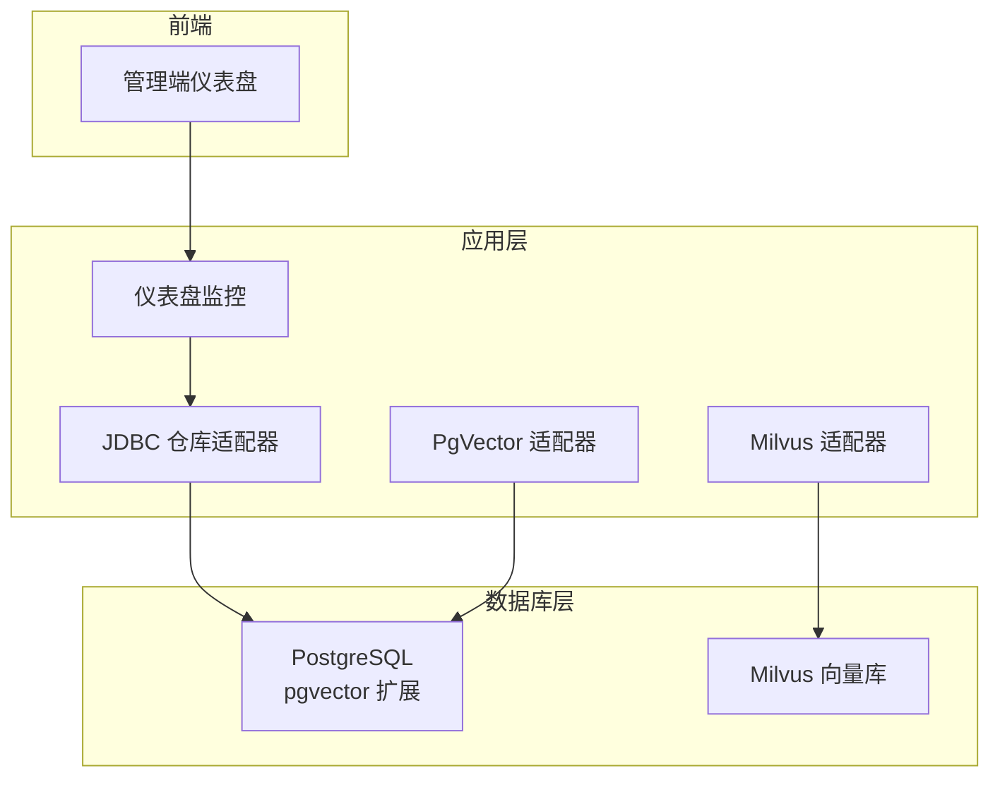
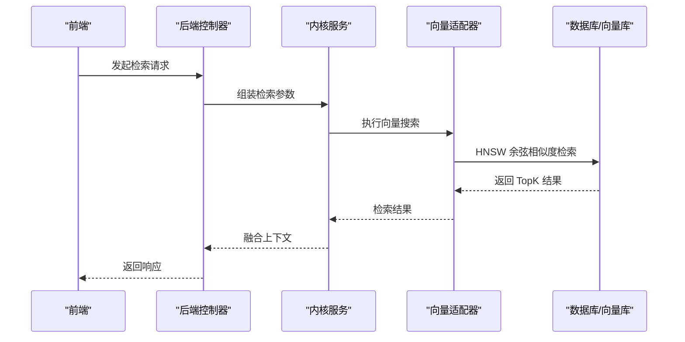
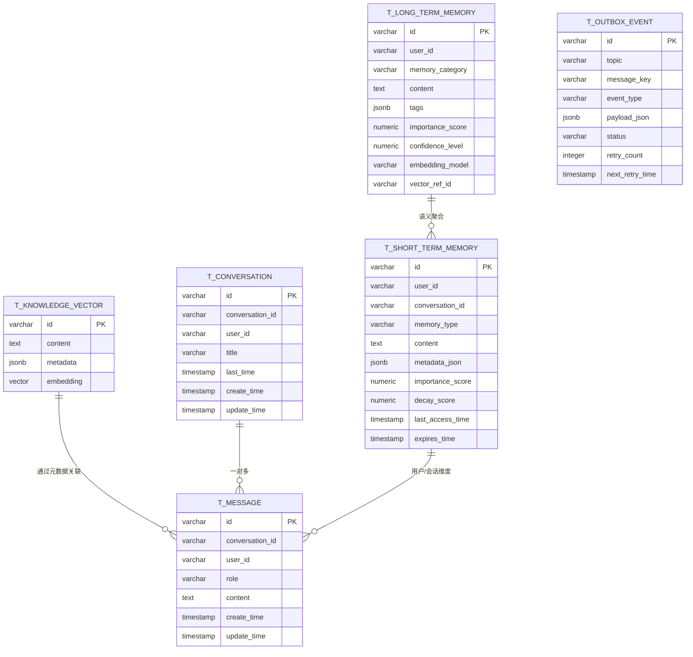
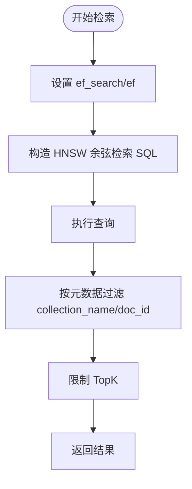
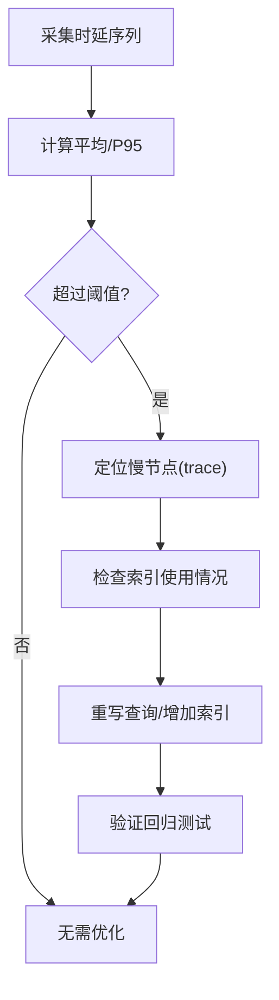
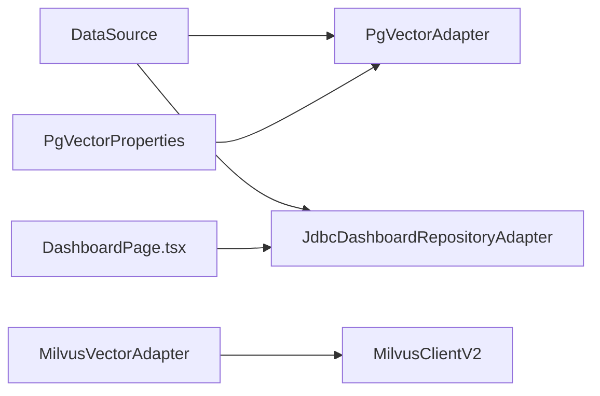

# 性能优化

<cite>
**本文引用的文件**
- [schema_pg.sql](file://resources/database/schema_pg.sql)
- [init_data_pg.sql](file://resources/database/init_data_pg.sql)
- [upgrade_v1.2_to_v1.3.sql](file://resources/database/upgrade_v1.2_to_v1.3.sql)
- [PgVectorAdapter.java](file://seahorse-agent-adapter-vector-pgvector/src/main/java/com/miracle/ai/seahorse/agent/adapters/vector/pgvector/PgVectorAdapter.java)
- [PgVectorProperties.java](file://seahorse-agent-adapter-vector-pgvector/src/main/java/com/miracle/ai/seahorse/agent/adapters/vector/pgvector/PgVectorProperties.java)
- [MilvusVectorAdapter.java](file://seahorse-agent-adapter-vector-milvus/src/main/java/com/miracle/ai/seahorse/agent/adapters/vector/milvus/MilvusVectorAdapter.java)
- [MilvusVectorProperties.java](file://seahorse-agent-adapter-vector-milvus/src/main/java/com/miracle/ai/seahorse/agent/adapters/vector/milvus/MilvusVectorProperties.java)
- [JdbcDashboardRepositoryAdapter.java](file://seahorse-agent-adapter-repository-jdbc/src/main/java/com/miracle/ai/seahorse/agent/adapters/repository/jdbc/JdbcDashboardRepositoryAdapter.java)
- [JdbcMemorySupport.java](file://seahorse-agent-adapter-repository-jdbc/src/main/java/com/miracle/ai/seahorse/agent/adapters/repository/jdbc/JdbcMemorySupport.java)
- [SeahorseAgentNativeAdapterAutoConfiguration.java](file://seahorse-agent-spring-boot-starter/src/main/java/com/miracle/ai/seahorse/agent/adapters/spring/SeahorseAgentNativeAdapterAutoConfiguration.java)
- [application.properties](file://seahorse-agent-bootstrap/src/main/resources/application.properties)
- [application.properties](file://seahorse-agent-spring-boot-starter/src/main/resources/application.properties)
- [DashboardPage.tsx](file://frontend/src/pages/admin/dashboard/DashboardPage.tsx)
- [rag-baseline.json](file://docs/performance/rag-baseline.json)
- [rag-after-compat-extraction.json](file://docs/performance/rag-after-compat-extraction.json)
- [rag-after-auth.json](file://docs/performance/rag-after-auth.json)
- [rag-after-module-split.json](file://docs/performance/rag-after-module-split.json)
</cite>

## 目录
1. [简介](#简介)
2. [项目结构](#项目结构)
3. [核心组件](#核心组件)
4. [架构总览](#架构总览)
5. [详细组件分析](#详细组件分析)
6. [依赖分析](#依赖分析)
7. [性能考量](#性能考量)
8. [故障排查指南](#故障排查指南)
9. [结论](#结论)
10. [附录](#附录)

## 简介
本文件面向 Seahorse Agent 的数据库与向量检索性能优化，结合现有数据库模式、向量适配器实现与监控采集逻辑，系统性梳理查询优化、索引设计、分区策略、连接池配置、慢查询分析、监控指标与维护策略，并给出可落地的优化建议与实证参考。

## 项目结构
围绕数据库与性能优化的关键位置如下：
- 数据库模式与初始化：resources/database 下的 schema 与升级脚本
- 向量检索实现：pgvector 与 milvus 两套适配器
- JDBC 仓库与监控：仪表盘与内存支持工具
- Spring 自动装配：数据源与适配器 Bean 注册
- 前端仪表盘：性能阈值与可视化
- 性能基准文档：多场景压测基线与 after 数据

图示来源
- [schema_pg.sql:1-850](file://resources/database/schema_pg.sql#L1-L850)
- [PgVectorAdapter.java:1-331](file://seahorse-agent-adapter-vector-pgvector/src/main/java/com/miracle/ai/seahorse/agent/adapters/vector/pgvector/PgVectorAdapter.java#L1-L331)
- [MilvusVectorAdapter.java:1-319](file://seahorse-agent-adapter-vector-milvus/src/main/java/com/miracle/ai/seahorse/agent/adapters/vector/milvus/MilvusVectorAdapter.java#L1-L319)
- [JdbcDashboardRepositoryAdapter.java:56-274](file://seahorse-agent-adapter-repository-jdbc/src/main/java/com/miracle/ai/seahorse/agent/adapters/repository/jdbc/JdbcDashboardRepositoryAdapter.java#L56-L274)
- [DashboardPage.tsx:103-1189](file://frontend/src/pages/admin/dashboard/DashboardPage.tsx#L103-L1189)

章节来源
- [schema_pg.sql:1-850](file://resources/database/schema_pg.sql#L1-L850)
- [PgVectorAdapter.java:1-331](file://seahorse-agent-adapter-vector-pgvector/src/main/java/com/miracle/ai/seahorse/agent/adapters/vector/pgvector/PgVectorAdapter.java#L1-L331)
- [MilvusVectorAdapter.java:1-319](file://seahorse-agent-adapter-vector-milvus/src/main/java/com/miracle/ai/seahorse/agent/adapters/vector/milvus/MilvusVectorAdapter.java#L1-L319)
- [JdbcDashboardRepositoryAdapter.java:56-274](file://seahorse-agent-adapter-repository-jdbc/src/main/java/com/miracle/ai/seahorse/agent/adapters/repository/jdbc/JdbcDashboardRepositoryAdapter.java#L56-L274)
- [DashboardPage.tsx:103-1189](file://frontend/src/pages/admin/dashboard/DashboardPage.tsx#L103-L1189)

## 核心组件
- 数据库模式与索引
  - 使用 pgvector 扩展，向量表采用 HNSW 索引与余弦距离
  - 多处业务表建立复合索引以支撑会话、消息、知识库、任务等高频查询
- 向量检索适配器
  - PgVectorAdapter：封装 HNSW 查询、批量入库、元数据 JSONB 存储
  - MilvusVectorAdapter：封装 HNSW 索引参数、搜索参数 ef/efConstruction
- 监控与仪表盘
  - JDBC 仪表盘：按时间桶聚合、统计成功率/错误率/无文档率、平均与 P95 延迟
  - 前端阈值：对平均延迟、P95 延迟进行分级提示
- Spring 自动装配
  - 条件化注册 JDBC 仓库与向量适配器 Bean，确保数据源可用时生效

章节来源
- [schema_pg.sql:420-436](file://resources/database/schema_pg.sql#L420-L436)
- [PgVectorAdapter.java:67-80](file://seahorse-agent-adapter-vector-pgvector/src/main/java/com/miracle/ai/seahorse/agent/adapters/vector/pgvector/PgVectorAdapter.java#L67-L80)
- [MilvusVectorAdapter.java:76-90](file://seahorse-agent-adapter-vector-milvus/src/main/java/com/miracle/ai/seahorse/agent/adapters/vector/milvus/MilvusVectorAdapter.java#L76-L90)
- [JdbcDashboardRepositoryAdapter.java:65-274](file://seahorse-agent-adapter-repository-jdbc/src/main/java/com/miracle/ai/seahorse/agent/adapters/repository/jdbc/JdbcDashboardRepositoryAdapter.java#L65-L274)
- [DashboardPage.tsx:103-1189](file://frontend/src/pages/admin/dashboard/DashboardPage.tsx#L103-L1189)
- [SeahorseAgentNativeAdapterAutoConfiguration.java:370-575](file://seahorse-agent-spring-boot-starter/src/main/java/com/miracle/ai/seahorse/agent/adapters/spring/SeahorseAgentNativeAdapterAutoConfiguration.java#L370-L575)

## 架构总览
数据库与向量检索的端到端流程如下：

图示来源
- [PgVectorAdapter.java:163-178](file://seahorse-agent-adapter-vector-pgvector/src/main/java/com/miracle/ai/seahorse/agent/adapters/vector/pgvector/PgVectorAdapter.java#L163-L178)
- [MilvusVectorAdapter.java:172-181](file://seahorse-agent-adapter-vector-milvus/src/main/java/com/miracle/ai/seahorse/agent/adapters/vector/milvus/MilvusVectorAdapter.java#L172-L181)

## 详细组件分析

### 数据库模式与索引设计
- 向量表与索引
  - 向量维度固定为 1536，使用 HNSW + 余弦距离
  - 元数据采用 JSONB 存储，便于检索过滤与后续扩展
- 业务表索引
  - 会话与消息：基于用户+时间的复合索引，支撑最近消息与会话列表
  - 反馈与样本：针对会话/用户维度建立索引
  - 定时任务与执行：基于时间与状态的索引，支撑调度与重试
  - 内存与消息：GIN 索引用于 JSONB 字段查询
- 扩展表（v1.2->v1.3）
  - 新增 outbox、短期/长期记忆、语义记忆、冲突日志、质量快照、长期记忆向量表及 HNSW 索引

图示来源
- [schema_pg.sql:420-436](file://resources/database/schema_pg.sql#L420-L436)
- [schema_pg.sql:67-81](file://resources/database/schema_pg.sql#L67-L81)
- [schema_pg.sql:32-52](file://resources/database/schema_pg.sql#L32-L52)
- [upgrade_v1.2_to_v1.3.sql:4-115](file://resources/database/upgrade_v1.2_to_v1.3.sql#L4-L115)

章节来源
- [schema_pg.sql:420-436](file://resources/database/schema_pg.sql#L420-L436)
- [schema_pg.sql:67-81](file://resources/database/schema_pg.sql#L67-L81)
- [schema_pg.sql:32-52](file://resources/database/schema_pg.sql#L32-L52)
- [upgrade_v1.2_to_v1.3.sql:4-115](file://resources/database/upgrade_v1.2_to_v1.3.sql#L4-L115)

### 向量检索性能优化（HNSW 与相似度）
- HNSW 参数与 ef_search
  - PgVectorAdapter 在每次查询前设置 ef_search，提升召回精度与稳定性
  - Milvus 适配器通过 searchParams 设置 ef/efConstruction，兼顾吞吐与精度
- 相似度与距离
  - pgvector 使用余弦距离；Milvus 默认 COSINE，可按需调整
- 元数据过滤
  - 通过 metadata JSONB 过滤 collection_name/doc_id，避免跨集合扫描
- TopK 控制
  - 适配器内置 TopK 上限保护，防止过大 TopK 导致性能抖动

图示来源
- [PgVectorAdapter.java:67-80](file://seahorse-agent-adapter-vector-pgvector/src/main/java/com/miracle/ai/seahorse/agent/adapters/vector/pgvector/PgVectorAdapter.java#L67-L80)
- [PgVectorAdapter.java:263-266](file://seahorse-agent-adapter-vector-pgvector/src/main/java/com/miracle/ai/seahorse/agent/adapters/vector/pgvector/PgVectorAdapter.java#L263-L266)
- [MilvusVectorAdapter.java:172-181](file://seahorse-agent-adapter-vector-milvus/src/main/java/com/miracle/ai/seahorse/agent/adapters/vector/milvus/MilvusVectorAdapter.java#L172-L181)

章节来源
- [PgVectorAdapter.java:67-80](file://seahorse-agent-adapter-vector-pgvector/src/main/java/com/miracle/ai/seahorse/agent/adapters/vector/pgvector/PgVectorAdapter.java#L67-L80)
- [PgVectorAdapter.java:263-266](file://seahorse-agent-adapter-vector-pgvector/src/main/java/com/miracle/ai/seahorse/agent/adapters/vector/pgvector/PgVectorAdapter.java#L263-L266)
- [MilvusVectorAdapter.java:172-181](file://seahorse-agent-adapter-vector-milvus/src/main/java/com/miracle/ai/seahorse/agent/adapters/vector/milvus/MilvusVectorAdapter.java#L172-L181)

### 向量维度与模型选择
- 当前向量维度为 1536，适配器与 Milvus 属性均要求正整数维度
- 建议
  - 与 Embedding 模型一致，避免运行时校验失败
  - 如需降低存储与计算成本，可在模型与硬件允许前提下调小维度，但需回归验证检索质量

章节来源
- [schema_pg.sql:426](file://resources/database/schema_pg.sql#L426)
- [PgVectorProperties.java:28-39](file://seahorse-agent-adapter-vector-pgvector/src/main/java/com/miracle/ai/seahorse/agent/adapters/vector/pgvector/PgVectorProperties.java#L28-L39)
- [MilvusVectorProperties.java:29-39](file://seahorse-agent-adapter-vector-milvus/src/main/java/com/miracle/ai/seahorse/agent/adapters/vector/milvus/MilvusVectorProperties.java#L29-L39)

### 查询优化与索引使用
- 复合索引策略
  - 会话/消息：user_id + 时间，满足“最近会话/消息”场景
  - 反馈/样本：按会话/用户维度建立索引，减少全表扫描
  - 任务/调度：按状态+时间，支撑重试与调度
- JSONB 查询
  - 使用 GIN 索引加速 JSONB 字段查询；注意写入时 JSONB 大小与索引维护成本
- 元数据过滤
  - 向量检索通过 metadata->>'key' = 'value' 过滤，需确保元数据键稳定

章节来源
- [schema_pg.sql:43-43](file://resources/database/schema_pg.sql#L43-L43)
- [schema_pg.sql:79-80](file://resources/database/schema_pg.sql#L79-L80)
- [schema_pg.sql:96-98](file://resources/database/schema_pg.sql#L96-L98)
- [schema_pg.sql:109](file://resources/database/schema_pg.sql#L109)
- [schema_pg.sql:155](file://resources/database/schema_pg.sql#L155)
- [schema_pg.sql:196](file://resources/database/schema_pg.sql#L196)
- [schema_pg.sql:240-241](file://resources/database/schema_pg.sql#L240-L241)
- [schema_pg.sql:429-430](file://resources/database/schema_pg.sql#L429-L430)
- [upgrade_v1.2_to_v1.3.sql:37-39](file://resources/database/upgrade_v1.2_to_v1.3.sql#L37-L39)
- [upgrade_v1.2_to_v1.3.sql:58-60](file://resources/database/upgrade_v1.2_to_v1.3.sql#L58-L60)

### 分区策略
- 当前模式未见显式分区表
- 建议
  - 对大表（如 t_message、t_rag_trace_run）按时间分区，保留近期热数据，归档历史
  - 结合分区裁剪与物化视图，降低扫描范围

[本节为通用建议，不直接分析具体文件]

### 数据库连接池与调优
- Spring 自动装配中注册了大量 JDBC 适配器 Bean，表明系统依赖 DataSource
- 建议
  - 明确 DataSource 实现（HikariCP/Druid），在生产环境设置合理的连接池大小、空闲超时、最大生命周期
  - 针对长事务与批处理（向量批量插入）单独配置连接池参数，避免阻塞
  - 监控连接池指标（活跃连接、等待时间、拒绝次数）

章节来源
- [SeahorseAgentNativeAdapterAutoConfiguration.java:370-575](file://seahorse-agent-spring-boot-starter/src/main/java/com/miracle/ai/seahorse/agent/adapters/spring/SeahorseAgentNativeAdapterAutoConfiguration.java#L370-L575)

### 慢查询分析与优化方法
- 指标采集
  - 仪表盘按时间桶统计 trace 运行时延，区分成功/失败/无文档场景
  - 计算平均与 P95 延迟，作为慢查询识别阈值
- 分析步骤
  - 识别慢节点：结合 trace 运行记录定位耗时环节
  - 检查索引使用：确认复合索引与 JSONB 索引是否命中
  - 查询重写：将宽泛过滤改为精确过滤，减少全表扫描
  - 批量操作：合并多次更新为批量执行，降低往返开销

图示来源
- [JdbcDashboardRepositoryAdapter.java:219-247](file://seahorse-agent-adapter-repository-jdbc/src/main/java/com/miracle/ai/seahorse/agent/adapters/repository/jdbc/JdbcDashboardRepositoryAdapter.java#L219-L247)
- [JdbcDashboardRepositoryAdapter.java:140-162](file://seahorse-agent-adapter-repository-jdbc/src/main/java/com/miracle/ai/seahorse/agent/adapters/repository/jdbc/JdbcDashboardRepositoryAdapter.java#L140-L162)
- [DashboardPage.tsx:103-1189](file://frontend/src/pages/admin/dashboard/DashboardPage.tsx#L103-L1189)

章节来源
- [JdbcDashboardRepositoryAdapter.java:219-247](file://seahorse-agent-adapter-repository-jdbc/src/main/java/com/miracle/ai/seahorse/agent/adapters/repository/jdbc/JdbcDashboardRepositoryAdapter.java#L219-L247)
- [JdbcDashboardRepositoryAdapter.java:140-162](file://seahorse-agent-adapter-repository-jdbc/src/main/java/com/miracle/ai/seahorse/agent/adapters/repository/jdbc/JdbcDashboardRepositoryAdapter.java#L140-L162)
- [DashboardPage.tsx:103-1189](file://frontend/src/pages/admin/dashboard/DashboardPage.tsx#L103-L1189)

### 监控与性能指标
- 指标清单
  - 平均响应时间、P95 响应时间
  - 成功率/错误率/无文档率
  - 活跃用户、会话、消息趋势
- 前端阈值
  - 平均延迟 > 3s 触发关注提醒，P95 延迟分级提示

章节来源
- [JdbcDashboardRepositoryAdapter.java:140-162](file://seahorse-agent-adapter-repository-jdbc/src/main/java/com/miracle/ai/seahorse/agent/adapters/repository/jdbc/JdbcDashboardRepositoryAdapter.java#L140-L162)
- [DashboardPage.tsx:103-1189](file://frontend/src/pages/admin/dashboard/DashboardPage.tsx#L103-L1189)

### 维护策略
- 统计信息与索引重建
  - 定期更新表统计信息，确保执行计划稳定
  - HNSW 索引可定期重建以恢复性能（依据版本与数据变更频率）
- 表空间与归档
  - 对历史表进行归档或分区裁剪，释放表空间
- 元数据一致性
  - 通过 JSONB 键约束与清洗流程，避免冗余键导致查询变慢

章节来源
- [schema_pg.sql:429-430](file://resources/database/schema_pg.sql#L429-L430)
- [upgrade_v1.2_to_v1.3.sql:105-115](file://resources/database/upgrade_v1.2_to_v1.3.sql#L105-L115)

### 实际性能测试与优化对比
- 基准与 after 场景
  - 提供多场景压测基线与 after 数据文件，用于回归对比
  - 建议在每次优化后，使用相同场景与负载进行对比，控制回归幅度
- 指标项
  - 首 token 延迟、总聊天时延、检索总时延、多通道检索、MCP 编排、内存加载、模型路由、文档摄取

章节来源
- [rag-baseline.json:1-52](file://docs/performance/rag-baseline.json#L1-L52)
- [rag-after-compat-extraction.json:1-52](file://docs/performance/rag-after-compat-extraction.json#L1-L52)
- [rag-after-auth.json:1-52](file://docs/performance/rag-after-auth.json#L1-L52)
- [rag-after-module-split.json:1-52](file://docs/performance/rag-after-module-split.json#L1-L52)

## 依赖分析
- 组件耦合
  - 向量适配器依赖 DataSource 与属性配置，PgVectorAdapter 强制 pgvector 扩展存在
  - JDBC 仪表盘依赖 JdbcTemplate 与时间窗口解析
- 外部依赖
  - PostgreSQL + pgvector 扩展
  - Milvus 向量库（可选）
- 循环依赖
  - 未见循环依赖迹象，各适配器职责清晰

图示来源
- [PgVectorAdapter.java:57-65](file://seahorse-agent-adapter-vector-pgvector/src/main/java/com/miracle/ai/seahorse/agent/adapters/vector/pgvector/PgVectorAdapter.java#L57-L65)
- [PgVectorProperties.java:28-39](file://seahorse-agent-adapter-vector-pgvector/src/main/java/com/miracle/ai/seahorse/agent/adapters/vector/pgvector/PgVectorProperties.java#L28-L39)
- [MilvusVectorAdapter.java:68-74](file://seahorse-agent-adapter-vector-milvus/src/main/java/com/miracle/ai/seahorse/agent/adapters/vector/milvus/MilvusVectorAdapter.java#L68-L74)
- [JdbcDashboardRepositoryAdapter.java:59-63](file://seahorse-agent-adapter-repository-jdbc/src/main/java/com/miracle/ai/seahorse/agent/adapters/repository/jdbc/JdbcDashboardRepositoryAdapter.java#L59-L63)
- [DashboardPage.tsx:103-1189](file://frontend/src/pages/admin/dashboard/DashboardPage.tsx#L103-L1189)

章节来源
- [PgVectorAdapter.java:57-65](file://seahorse-agent-adapter-vector-pgvector/src/main/java/com/miracle/ai/seahorse/agent/adapters/vector/pgvector/PgVectorAdapter.java#L57-L65)
- [PgVectorProperties.java:28-39](file://seahorse-agent-adapter-vector-pgvector/src/main/java/com/miracle/ai/seahorse/agent/adapters/vector/pgvector/PgVectorProperties.java#L28-L39)
- [MilvusVectorAdapter.java:68-74](file://seahorse-agent-adapter-vector-milvus/src/main/java/com/miracle/ai/seahorse/agent/adapters/vector/milvus/MilvusVectorAdapter.java#L68-L74)
- [JdbcDashboardRepositoryAdapter.java:59-63](file://seahorse-agent-adapter-repository-jdbc/src/main/java/com/miracle/ai/seahorse/agent/adapters/repository/jdbc/JdbcDashboardRepositoryAdapter.java#L59-L63)
- [DashboardPage.tsx:103-1189](file://frontend/src/pages/admin/dashboard/DashboardPage.tsx#L103-L1189)

## 性能考量
- 向量检索
  - HNSW ef/efConstruction 与 ef_search 是关键参数，需结合吞吐与延迟目标调参
  - 元数据过滤尽量走索引，避免全表扫描
- 查询路径
  - 复合索引优先，JSONB 使用 GIN；避免在 WHERE 中对列做函数变换
- 批处理
  - 向量批量插入使用 addBatch/executeBatch，减少网络往返
- 连接池
  - 针对批处理与长事务设置独立连接池，避免争抢
- 监控
  - 延迟与错误率双指标，结合前端阈值快速定位异常

[本节为通用指导，不直接分析具体文件]

## 故障排查指南
- 向量检索失败
  - 检查 pgvector 扩展是否安装、表是否存在、维度是否匹配
  - 确认 ef_search 设置与 ef/efConstruction 参数
- 索引未命中
  - 使用 EXPLAIN 分析执行计划，确认过滤条件与索引键匹配
  - 对于 JSONB 过滤，确认 GIN 索引已创建
- 连接池问题
  - 关注活跃连接数、等待时间、拒绝次数；必要时扩容或拆分连接池
- 慢查询定位
  - 通过仪表盘时间桶与 trace 运行记录定位慢节点，再回溯 SQL 与索引

章节来源
- [PgVectorAdapter.java:230-244](file://seahorse-agent-adapter-vector-pgvector/src/main/java/com/miracle/ai/seahorse/agent/adapters/vector/pgvector/PgVectorAdapter.java#L230-L244)
- [PgVectorAdapter.java:263-266](file://seahorse-agent-adapter-vector-pgvector/src/main/java/com/miracle/ai/seahorse/agent/adapters/vector/pgvector/PgVectorAdapter.java#L263-L266)
- [JdbcDashboardRepositoryAdapter.java:219-247](file://seahorse-agent-adapter-repository-jdbc/src/main/java/com/miracle/ai/seahorse/agent/adapters/repository/jdbc/JdbcDashboardRepositoryAdapter.java#L219-L247)

## 结论
通过合理的索引设计、向量检索参数调优、连接池配置与持续的监控回归，Seahorse Agent 的数据库与向量检索性能可得到稳定提升。建议以压测基线为锚点，持续迭代优化，并将关键参数与阈值固化到配置与监控体系中。

[本节为总结，不直接分析具体文件]

## 附录
- 初始化数据
  - 初始管理员账户用于系统启动与演示
- 配置文件
  - 应用名称与内核模式配置，确保内核与适配器按预期加载

章节来源
- [init_data_pg.sql:1-5](file://resources/database/init_data_pg.sql#L1-L5)
- [application.properties:1-4](file://seahorse-agent-bootstrap/src/main/resources/application.properties#L1-L4)
- [application.properties:1-2](file://seahorse-agent-spring-boot-starter/src/main/resources/application.properties#L1-L2)