# 数据库设计

<cite>
**本文引用的文件**
- [V2__add_tenant_id_p0_tables.sql](file://resources/database/migrations/V2__add_tenant_id_p0_tables.sql)
- [V3__add_user_trial_tables.sql](file://resources/database/migrations/V3__add_user_trial_tables.sql)
- [V4__alter_secret_and_credential.sql](file://resources/database/migrations/V4__alter_secret_and_credential.sql)
- [V5__billing_tables.sql](file://resources/database/migrations/V5__billing_tables.sql)
- [V6__query_rewrite_log.sql](file://resources/database/migrations/V6__query_rewrite_log.sql)
- [V7__execution_steps.sql](file://resources/database/migrations/V7__execution_steps.sql)
- [V8__knowledge_base_enhancement.sql](file://resources/database/migrations/V8__knowledge_base_enhancement.sql)
- [V9__agent_marketplace.sql](file://resources/database/migrations/V9__agent_marketplace.sql)
- [V10__audit_log_and_admin.sql](file://resources/database/migrations/V10__audit_log_and_admin.sql)
- [V11__kb_retrieval_config.sql](file://resources/database/migrations/V11__kb_retrieval_config.sql)
- [V12__login_history.sql](file://resources/database/migrations/V12__login_history.sql)
- [V13__revenue_share.sql](file://resources/database/migrations/V13__revenue_share.sql)
- [seahorse_init.sql](file://resources/database/seahorse_init.sql)
- [JdbcTenantSupport.java](file://seahorse-agent-adapter-repository-jdbc/src/main/java/com/miracle/ai/seahorse/agent/adapters/repository/jdbc/JdbcTenantSupport.java)
- [JdbcChatSchemaUpgrade.java](file://seahorse-agent-adapter-repository-jdbc/src/main/java/com/miracle/ai/seahorse/agent/adapters/repository/jdbc/JdbcChatSchemaUpgrade.java)
- [JdbcKnowledgeDocumentRepositoryAdapter.java](file://seahorse-agent-adapter-repository-jdbc/src/main/java/com/miracle/ai/seahorse/agent/adapters/repository/jdbc/JdbcKnowledgeDocumentRepositoryAdapter.java)
- [JdbcKnowledgeBaseRepositoryAdapter.java](file://seahorse-agent-adapter-repository-jdbc/src/main/java/com/miracle/ai/seahorse/agent/adapters/repository/jdbc/JdbcKnowledgeBaseRepositoryAdapter.java)
- [JdbcKnowledgeChunkRepositoryAdapter.java](file://seahorse-agent-adapter-repository-jdbc/src/main/java/com/miracle/ai/seahorse/agent/adapters/repository/jdbc/JdbcKnowledgeChunkRepositoryAdapter.java)
- [JdbcConversationRepositoryAdapter.java](file://seahorse-agent-adapter-repository-jdbc/src/main/java/com/miracle/ai/seahorse/agent/adapters/repository/jdbc/JdbcConversationRepositoryAdapter.java)
- [JdbcUserRepositoryAdapter.java](file://seahorse-agent-adapter-repository-jdbc/src/main/java/com/miracle/ai/seahorse/agent/adapters/repository/jdbc/JdbcUserRepositoryAdapter.java)
- [JdbcShortTermMemoryRepositoryAdapter.java](file://seahorse-agent-adapter-repository-jdbc/src/main/java/com/miracle/ai/seahorse/agent/adapters/repository/jdbc/JdbcShortTermMemoryRepositoryAdapter.java)
- [JdbcLongTermMemoryRepositoryAdapter.java](file://seahorse-agent-adapter-repository-jdbc/src/main/java/com/miracle/ai/seahorse/agent/adapters/repository/jdbc/JdbcLongTermMemoryRepositoryAdapter.java)
- [JdbcOutboxEventRepositoryAdapter.java](file://seahorse-agent-adapter-repository-jdbc/src/main/java/com/miracle/ai/seahorse/agent/adapters/repository/jdbc/JdbcOutboxEventRepositoryAdapter.java)
- [JdbcMetadataGovernanceRepositoryAdapter.java](file://seahorse-agent-adapter-repository-jdbc/src/main/java/com/miracle/ai/seahorse/agent/adapters/repository/jdbc/JdbcMetadataGovernanceRepositoryAdapter.java)
- [JdbcQueryTermMappingRepositoryAdapter.java](file://seahorse-agent-adapter-repository-jdbc/src/main/java/com/miracle/ai/seahorse/agent/adapters/repository/jdbc/JdbcQueryTermMappingRepositoryAdapter.java)
- [JdbcSampleQuestionRepositoryAdapter.java](file://seahorse-agent-adapter-repository-jdbc/src/main/java/com/miracle/ai/seahorse/agent/adapters/repository/jdbc/JdbcSampleQuestionRepositoryAdapter.java)
- [JdbcAgentSkillRepositoryAdapter.java](file://seahorse-agent-adapter-repository-jdbc/src/main/java/com/miracle/ai/seahorse/agent/adapters/repository/jdbc/JdbcAgentSkillRepositoryAdapter.java)
- [JdbcAgentRunRepositoryAdapter.java](file://seahorse-agent-adapter-repository-jdbc/src/main/java/com/miracle/ai/seahorse/agent/adapters/repository/jdbc/JdbcAgentRunRepositoryAdapter.java)
- [JdbcAgentRunEventBufferAdapter.java](file://seahorse-agent-adapter-repository-jdbc/src/main/java/com/miracle/ai/seahorse/agent/adapters/repository/jdbc/JdbcAgentRunEventBufferAdapter.java)
- [JdbcAgentExtensionStatusAdapter.java](file://seahorse-agent-adapter-repository-jdbc/src/main/java/com/miracle/ai/seahorse/agent/adapters/repository/jdbc/JdbcAgentExtensionStatusAdapter.java)
- [JdbcAgentRunLeaseRepositoryAdapter.java](file://seahorse-agent-adapter-repository-jdbc/src/main/java/com/miracle/ai/seahorse/agent/adapters/repository/jdbc/JdbcAgentRunLeaseRepositoryAdapter.java)
- [JdbcAgentToolBindingRepositoryAdapter.java](file://seahorse-agent-adapter-repository-jdbc/src/main/java/com/miracle/ai/seahorse/agent/adapters/repository/jdbc/JdbcAgentToolBindingRepositoryAdapter.java)
- [JdbcAgentCheckpointRepositoryAdapter.java](file://seahorse-agent-adapter-repository-jdbc/src/main/java/com/miracle/ai/seahorse/agent/adapters/repository/jdbc/JdbcAgentCheckpointRepositoryAdapter.java)
- [JdbcAgentArtifactRepositoryAdapter.java](file://seahorse-agent-adapter-repository-jdbc/src/main/java/com/miracle/ai/seahorse/agent/adapters/repository/jdbc/JdbcAgentArtifactRepositoryAdapter.java)
- [JdbcAgentDefinitionRepositoryAdapter.java](file://seahorse-agent-adapter-repository-jdbc/src/main/java/com/miracle/ai/seahorse/agent/adapters/repository/jdbc/JdbcAgentDefinitionRepositoryAdapter.java)
- [JdbcAgentVersionActivationRepositoryAdapter.java](file://seahorse-agent-adapter-repository-jdbc/src/main/java/com/miracle/ai/seahorse/agent/adapters/repository/jdbc/JdbcAgentVersionActivationRepositoryAdapter.java)
- [JdbcAgentPublishCheckRepositoryAdapter.java](file://seahorse-agent-adapter-repository-jdbc/src/main/java/com/miracle/ai/seahorse/agent/adapters/repository/jdbc/JdbcAgentPublishCheckRepositoryAdapter.java)
- [JdbcAgentRolloutRepositoryAdapter.java](file://seahorse-agent-adapter-repository-jdbc/src/main/java/com/miracle/ai/seahorse/agent/adapters/repository/jdbc/JdbcAgentRolloutRepositoryAdapter.java)
- [JdbcAgentHandoffRepositoryAdapter.java](file://seahorse-agent-adapter-repository-jdbc/src/main/java/com/miracle/ai/seahorse/agent/adapters/repository/jdbc/JdbcAgentHandoffRepositoryAdapter.java)
- [JdbcAgentEvalSummaryRepositoryAdapter.java](file://seahorse-agent-adapter-repository-jdbc/src/main/java/com/miracle/ai/seahorse/agent/adapters/repository/jdbc/JdbcAgentEvalSummaryRepositoryAdapter.java)
- [JdbcAgentTemplateRepositoryAdapter.java](file://seahorse-agent-adapter-repository-jdbc/src/main/java/com/miracle/ai/seahorse/agent/adapters/repository/jdbc/JdbcAgentTemplateRepositoryAdapter.java)
- [JdbcConnectorRepositoryAdapter.java](file://seahorse-agent-adapter-repository-jdbc/src/main/java/com/miracle/ai/seahorse/agent/adapters/repository/jdbc/JdbcConnectorRepositoryAdapter.java)
- [JdbcConnectorCredentialBindingRepositoryAdapter.java](file://seahorse-agent-adapter-repository-jdbc/src/main/java/com/miracle/ai/seahorse/agent/adapters/repository/jdbc/JdbcConnectorCredentialBindingRepositoryAdapter.java)
- [JdbcConnectorOperationRepositoryAdapter.java](file://seahorse-agent-adapter-repository-jdbc/src/main/java/com/miracle/ai/seahorse/agent/adapters/repository/jdbc/JdbcConnectorOperationRepositoryAdapter.java)
- [JdbcToolCatalogRepositoryAdapter.java](file://seahorse-agent-adapter-repository-jdbc/src/main/java/com/miracle/ai/seahorse/agent/adapters/repository/jdbc/JdbcToolCatalogRepositoryAdapter.java)
- [JdbcApprovalRequestRepositoryAdapter.java](file://seahorse-agent-adapter-repository-jdbc/src/main/java/com/miracle/ai/seahorse/agent/adapters/repository/jdbc/JdbcApprovalRequestRepositoryAdapter.java)
- [JdbcSecretStoreRepositoryAdapter.java](file://seahorse-agent-adapter-repository-jdbc/src/main/java/com/miracle/ai/seahorse/agent/adapters/repository/jdbc/JdbcSecretStoreRepositoryAdapter.java)
- [JdbcContextPackRepositoryAdapter.java](file://seahorse-agent-adapter-repository-jdbc/src/main/java/com/miracle/ai/seahorse/agent/adapters/repository/jdbc/JdbcContextPackRepositoryAdapter.java)
- [JdbcAccessDecisionRepositoryAdapter.java](file://seahorse-agent-adapter-repository-jdbc/src/main/java/com/miracle/ai/seahorse/agent/adapters/repository/jdbc/JdbcAccessDecisionRepositoryAdapter.java)
- [JdbcResourceAclRepositoryAdapter.java](file://seahorse-agent-adapter-repository-jdbc/src/main/java/com/miracle/ai/seahorse/agent/adapters/repository/jdbc/JdbcResourceAclRepositoryAdapter.java)
- [JdbcSandboxRepositoryAdapter.java](file://seahorse-agent-adapter-repository-jdbc/src/main/java/com/miracle/ai/seahorse/agent/adapters/repository/jdbc/JdbcSandboxRepositoryAdapter.java)
- [JdbcAuditEventRepositoryAdapter.java](file://seahorse-agent-adapter-repository-jdbc/src/main/java/com/miracle/ai/seahorse/agent/adapters/repository/jdbc/JdbcAuditEventRepositoryAdapter.java)
- [JdbcProductionGateRepositoryAdapter.java](file://seahorse-agent-adapter-repository-jdbc/src/main/java/com/miracle/ai/seahorse/agent/adapters/repository/jdbc/JdbcProductionGateRepositoryAdapter.java)
- [JdbcEnterprisePilotReadinessRepositoryAdapter.java](file://seahorse-agent-adapter-repository-jdbc/src/main/java/com/miracle/ai/seahorse/agent/adapters/repository/jdbc/JdbcEnterprisePilotReadinessRepositoryAdapter.java)
- [JdbcQuotaPolicyRepositoryAdapter.java](file://seahorse-agent-adapter-repository-jdbc/src/main/java/com/miracle/ai/seahorse/agent/adapters/repository/jdbc/JdbcQuotaPolicyRepositoryAdapter.java)
- [JdbcCostUsageRepositoryAdapter.java](file://seahorse-agent-adapter-repository-jdbc/src/main/java/com/miracle/ai/seahorse/agent/adapters/repository/jdbc/JdbcCostUsageRepositoryAdapter.java)
- [JdbcDurableTaskQueueRepositoryAdapter.java](file://seahorse-agent-adapter-repository-jdbc/src/main/java/com/miracle/ai/seahorse/agent/adapters/repository/jdbc/JdbcDurableTaskQueueRepositoryAdapter.java)
- [JdbcEvalCandidateRepositoryAdapter.java](file://seahorse-agent-adapter-repository-jdbc/src/main/java/com/miracle/ai/seahorse/agent/adapters/repository/jdbc/JdbcEvalCandidateRepositoryAdapter.java)
- [JdbcEvalSampleRepositoryAdapter.java](file://seahorse-agent-adapter-repository-jdbc/src/main/java/com/miracle/ai/seahorse/agent/adapters/repository/jdbc/JdbcEvalSampleRepositoryAdapter.java)
- [JdbcRetrievalStrategyTemplateRepositoryAdapter.java](file://seahorse-agent-adapter-repository-jdbc/src/main/java/com/miracle/ai/seahorse/agent/adapters/repository/jdbc/JdbcRetrievalStrategyTemplateRepositoryAdapter.java)
- [JdbcRetrievalEvaluationDatasetRepositoryAdapter.java](file://seahorse-agent-adapter-repository-jdbc/src/main/java/com/miracle/ai/seahorse/agent/adapters/repository/jdbc/JdbcRetrievalEvaluationDatasetRepositoryAdapter.java)
- [JdbcRetrievalEvaluationRunRepositoryAdapter.java](file://seahorse-agent-adapter-repository-jdbc/src/main/java/com/miracle/ai/seahorse/agent/adapters/repository/jdbc/JdbcRetrievalEvaluationRunRepositoryAdapter.java)
- [JdbcRetrievalEvaluationComparisonRepositoryAdapter.java](file://seahorse-agent-adapter-repository-jdbc/src/main/java/com/miracle/ai/seahorse/agent/adapters/repository/jdbc/JdbcRetrievalEvaluationComparisonRepositoryAdapter.java)
- [JdbcAiModelConfigRepositoryAdapter.java](file://seahorse-agent-adapter-repository-jdbc/src/main/java/com/miracle/ai/seahorse/agent/adapters/repository/jdbc/JdbcAiModelConfigRepositoryAdapter.java)
- [PgVectorAdapter.java](file://seahorse-agent-adapter-vector-pgvector/src/main/java/com/miracle/ai/seahorse/agent/adapters/vector/pgvector/PgVectorAdapter.java)
- [PgVectorProperties.java](file://seahorse-agent-adapter-vector-pgvector/src/main/java/com/miracle/ai/seahorse/agent/adapters/vector/pgvector/PgVectorProperties.java)
- [application.properties](file://seahorse-agent-bootstrap/src/main/resources/application.properties)
- [application.yml](file://seahorse-agent-mcp-server/src/main/resources/application.yml)
- [数据库设计-安全配置.md](file://docs/zh/content/数据库设计/安全配置.md)
- [数据库设计-数据迁移策略.md](file://docs/zh/content/数据库设计/数据迁移策略.md)
- [数据库适配器.md](file://docs/zh/content/后端系统/适配器模块/数据库适配器.md)
</cite>

## 更新摘要
**所做更改**
- 新增知识库检索配置章节，详细说明V11迁移脚本中的检索策略配置功能
- 新增用户登录历史章节，详细说明V12迁移脚本中的登录行为追踪功能
- 新增收益分成系统章节，详细说明V13迁移脚本中的合作伙伴收益分配功能
- 更新所有核心表结构，反映新增的知识库检索配置、用户登录历史、收益分成相关字段
- 新增相关索引策略和查询优化建议
- 更新数据迁移策略，包含知识库检索配置、用户登录历史、收益分成相关迁移的详细指导

## 目录
1. [简介](#简介)
2. [项目结构](#项目结构)
3. [核心组件](#核心组件)
4. [架构总览](#架构总览)
5. [多租户架构设计](#多租户架构设计)
6. [查询重写日志系统](#查询重写日志系统)
7. [工作流可视化系统](#工作流可视化系统)
8. [知识库增强系统](#知识库增强系统)
9. [代理市场系统](#代理市场系统)
10. [系统审计日志](#系统审计日志)
11. [知识库检索配置系统](#知识库检索配置系统)
12. [用户登录历史系统](#用户登录历史系统)
13. [收益分成系统](#收益分成系统)
14. [详细组件分析](#详细组件分析)
15. [依赖分析](#依赖分析)
16. [性能考虑](#性能考虑)
17. [故障排查指南](#故障排查指南)
18. [结论](#结论)
19. [附录](#附录)

## 简介
本文件为 Seahorse Agent 的数据库设计与实现参考文档，聚焦基于 PostgreSQL 的数据库架构设计，覆盖表结构设计、关系模型与约束定义，以及核心业务实体（用户管理、会话管理、知识库管理、记忆管理、技能管理、SRE健康监控、检索治理等）的数据库实现要点。文档同时阐述数据模型的设计原则（规范化、索引策略、查询优化）、数据访问层（JDBC 适配器与运行期兼容性）、数据迁移策略与版本管理机制，并给出性能优化建议、数据安全与备份恢复方案，帮助数据库管理员与开发者高效理解与维护系统。

**更新** 本版本重点反映了V6-V13迁移脚本中引入的查询重写日志、工作流可视化、知识库增强、代理市场、系统审计日志、知识库检索配置、用户登录历史、收益分成等关键功能模块，包括查询重写审计、执行步骤管理、知识库版本控制、代理市场运营、综合审计追踪、检索策略配置、登录行为追踪、合作伙伴收益分配等核心表结构设计。

## 项目结构
围绕数据库相关的核心位置与职责如下：
- 数据库模式与初始化：通过初始化 SQL 定义表结构、字段注释、索引与扩展（如向量扩展），用于支撑访问控制与性能优化
- 应用配置：应用名称、端口、内核开关等基础配置
- 自动装配：根据属性选择启用 JDBC 适配器与认证组件，决定数据库连接与认证路径
- JDBC 适配器：封装用户、会话、知识库、记忆、技能等核心实体的数据库访问逻辑，承担数据持久化与安全边界
- 租户支持：通过JdbcTenantSupport提供统一的租户ID解析和管理
- **更新** 查询重写日志：通过V6迁移脚本创建查询重写审计表，记录查询重写操作的完整轨迹
- **更新** 工作流可视化：通过V7迁移脚本创建执行步骤和边关系表，支持DAG渲染和工作流监控
- **更新** 知识库增强：通过V8迁移脚本创建版本控制、权限管理和外部分享相关表结构
- **更新** 代理市场：通过V9迁移脚本创建代理发布审核、订阅管理和评分系统相关表结构
- **更新** 系统审计：通过V10迁移脚本创建综合审计日志表，支持合规性要求和安全追踪
- **更新** 知识库检索配置：通过V11迁移脚本创建检索策略配置表，支持知识库检索策略的标准化管理
- **更新** 用户登录历史：通过V12迁移脚本创建用户登录历史表，支持登录行为追踪和安全监控
- **更新** 收益分成：通过V13迁移脚本创建收益分成表，支持合作伙伴收益分配和结算管理

```mermaid
graph TB
subgraph "应用配置"
APP_PROPS["application.properties"]
APP_YML["application.yml"]
end
subgraph "数据库"
SCHEMA["seahorse_init.sql"]
INIT_SQL["init_data.sql"]
TENANT_MIGRATION["V2迁移脚本<br/>tenant_id字段添加<br/>RLS安全隔离"]
QUERY_REWRITE["V6迁移脚本<br/>查询重写日志<br/>sa_query_rewrite_log表"]
WORKFLOW_VISUALIZATION["V7迁移脚本<br/>工作流可视化<br/>执行步骤与边关系"]
KB_ENHANCEMENT["V8迁移脚本<br/>知识库增强<br/>版本控制<br/>权限管理<br/>外部分享"]
AGENT_MARKETPLACE["V9迁移脚本<br/>代理市场<br/>发布审核<br/>订阅管理<br/>评分系统"]
SYSTEM_AUDIT["V10迁移脚本<br/>系统审计<br/>综合审计日志"]
KB_RETRIEVAL_CONFIG["V11迁移脚本<br/>知识库检索配置<br/>检索策略模板"]
LOGIN_HISTORY["V12迁移脚本<br/>用户登录历史<br/>登录行为追踪"]
REVENUE_SHARE["V13迁移脚本<br/>收益分成<br/>合作伙伴收益分配"]
MULTI_TENANCY["多租户架构<br/>租户隔离策略<br/>安全访问控制"]
end
subgraph "自动装配"
AUTO_CONF["SeahorseAgentNativeAdapterAutoConfiguration.java"]
end
subgraph "JDBC 适配器"
JDBC_TENANT["JdbcTenantSupport.java"]
JDBC_USER["JdbcUserRepositoryAdapter.java"]
JDBC_CONV["JdbcConversationRepositoryAdapter.java"]
JDBC_KB["JdbcKnowledgeBaseRepositoryAdapter.java"]
JDBC_MEM["JdbcLongTermMemoryRepositoryAdapter.java"]
JDBC_SKILL["JdbcAgentSkillRepositoryAdapter.java"]
end
APP_PROPS --> AUTO_CONF
APP_YML --> AUTO_CONF
AUTO_CONF --> JDBC_TENANT
AUTO_CONF --> JDBC_USER
AUTO_CONF --> JDBC_CONV
AUTO_CONF --> JDBC_KB
AUTO_CONF --> JDBC_MEM
AUTO_CONF --> JDBC_SKILL
SCHEMA --> JDBC_USER
SCHEMA --> JDBC_CONV
SCHEMA --> JDBC_KB
SCHEMA --> JDBC_MEM
SCHEMA --> JDBC_SKILL
TENANT_MIGRATION --> MULTI_TENANCY
MULTI_TENANCY --> JDBC_TENANT
QUERY_REWRITE --> JDBC_QUERY_REWRITE["JdbcQueryRewriteLogRepositoryAdapter.java"]
WORKFLOW_VISUALIZATION --> JDBC_EXECUTION["JdbcAgentExecutionStepRepositoryAdapter.java"]
KB_ENHANCEMENT --> JDBC_KB_ENHANCEMENT["JdbcKnowledgeBaseEnhancementRepositoryAdapter.java"]
AGENT_MARKETPLACE --> JDBC_AGENT_MARKETPLACE["JdbcAgentMarketplaceRepositoryAdapter.java"]
SYSTEM_AUDIT --> JDBC_SYSTEM_AUDIT["JdbcSystemAuditRepositoryAdapter.java"]
KB_RETRIEVAL_CONFIG --> JDBC_KB_RETRIEVAL_CONFIG["JdbcKnowledgeBaseRetrievalConfigRepositoryAdapter.java"]
LOGIN_HISTORY --> JDBC_LOGIN_HISTORY["JdbcLoginHistoryRepositoryAdapter.java"]
REVENUE_SHARE --> JDBC_REVENUE_SHARE["JdbcRevenueShareRepositoryAdapter.java"]
```

**图表来源**
- [application.properties:1-4](file://seahorse-agent-bootstrap/src/main/resources/application.properties#L1-L4)
- [application.yml:1-20](file://seahorse-agent-mcp-server/src/main/resources/application.yml#L1-L20)
- [V2__add_tenant_id_p0_tables.sql:1-139](file://resources/database/migrations/V2__add_tenant_id_p0_tables.sql#L1-L139)
- [V6__query_rewrite_log.sql:1-18](file://resources/database/migrations/V6__query_rewrite_log.sql#L1-L18)
- [V7__execution_steps.sql:1-36](file://resources/database/migrations/V7__execution_steps.sql#L1-L36)
- [V8__knowledge_base_enhancement.sql:1-69](file://resources/database/migrations/V8__knowledge_base_enhancement.sql#L1-L69)
- [V9__agent_marketplace.sql:1-95](file://resources/database/migrations/V9__agent_marketplace.sql#L1-L95)
- [V10__audit_log_and_admin.sql:1-35](file://resources/database/migrations/V10__audit_log_and_admin.sql#L1-L35)
- [V11__kb_retrieval_config.sql:1-200](file://resources/database/migrations/V11__kb_retrieval_config.sql#L1-L200)
- [V12__login_history.sql:1-200](file://resources/database/migrations/V12__login_history.sql#L1-L200)
- [V13__revenue_share.sql:1-200](file://resources/database/migrations/V13__revenue_share.sql#L1-L200)

**章节来源**
- [application.properties:1-4](file://seahorse-agent-bootstrap/src/main/resources/application.properties#L1-L4)
- [application.yml:1-20](file://seahorse-agent-mcp-server/src/main/resources/application.yml#L1-L20)
- [数据库设计-安全配置.md:30-70](file://docs/zh/content/数据库设计/安全配置.md#L30-L70)

## 核心组件
JDBC 仓库适配器模块包含以下核心组件：
- 数据库支持类：提供内存管理相关的辅助功能，包括 ID 生成、时间戳转换、JSON 解析和元数据处理
- 知识库相关适配器：知识库基础信息管理、文档管理、文档分块管理
- 会话与用户适配器：会话管理、用户管理
- 内存管理适配器：短期记忆管理、长期记忆管理、语义记忆管理、记忆治理
- 技能管理适配器：技能定义管理、技能版本管理、技能绑定管理
- 代理运行管理适配器：代理定义、版本管理、运行跟踪、工件管理
- 访问控制适配器：工具目录、连接器管理、ACL规则、沙箱管理
- 评估与审计适配器：评估候选、样本管理、审计事件、配额策略
- SRE监控适配器：扩展状态监控、运行事件缓冲、健康报告
- 消息队列适配器：事件出站消息管理
- **更新** 租户支持：统一的租户ID解析和管理，确保多租户隔离
- **更新** 查询重写日志适配器：查询重写操作的记录与查询，支持RAG系统的审计追踪
- **更新** 工作流可视化适配器：执行步骤和边关系的管理，支持DAG渲染和工作流监控
- **更新** 知识库增强适配器：版本控制、权限管理和外部分享功能的实现
- **更新** 代理市场适配器：代理发布审核、订阅管理和评分系统的数据访问
- **更新** 系统审计适配器：综合审计日志的记录与查询，支持合规性要求
- **更新** 知识库检索配置适配器：检索策略模板的管理，支持知识库检索策略的标准化
- **更新** 用户登录历史适配器：用户登录行为的记录与查询，支持安全监控和审计
- **更新** 收益分成适配器：合作伙伴收益分配的记录与结算，支持商业合作管理

**章节来源**
- [数据库适配器.md:62-89](file://docs/zh/content/后端系统/适配器模块/数据库适配器.md#L62-L89)
- [JdbcTenantSupport.java:23-62](file://seahorse-agent-adapter-repository-jdbc/src/main/java/com/miracle/ai/seahorse/agent/adapters/repository/jdbc/JdbcTenantSupport.java#L23-L62)

## 架构总览
下图展示了数据库版本升级在应用中的整体流程：应用启动时根据迁移模式加载迁移脚本，按顺序执行升级；JDBC 适配器在运行期访问数据库，确保新旧版本字段与表结构兼容。

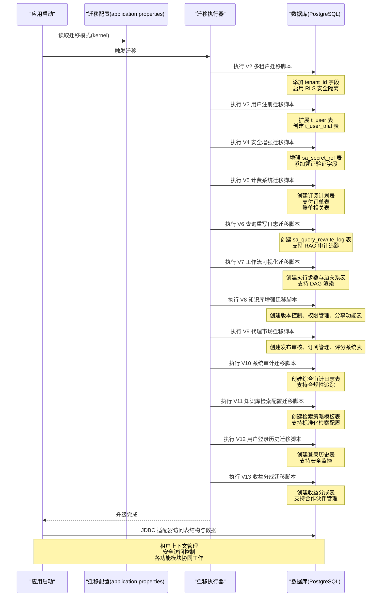

**图表来源**
- [application.properties:1-4](file://seahorse-agent-bootstrap/src/main/resources/application.properties#L1-L4)
- [V2__add_tenant_id_p0_tables.sql:1-139](file://resources/database/migrations/V2__add_tenant_id_p0_tables.sql#L1-L139)
- [V3__add_user_trial_tables.sql:1-39](file://resources/database/migrations/V3__add_user_trial_tables.sql#L1-L39)
- [V4__alter_secret_and_credential.sql:1-18](file://resources/database/migrations/V4__alter_secret_and_credential.sql#L1-L18)
- [V5__billing_tables.sql:1-134](file://resources/database/migrations/V5__billing_tables.sql#L1-L134)
- [V6__query_rewrite_log.sql:1-18](file://resources/database/migrations/V6__query_rewrite_log.sql#L1-L18)
- [V7__execution_steps.sql:1-36](file://resources/database/migrations/V7__execution_steps.sql#L1-L36)
- [V8__knowledge_base_enhancement.sql:1-69](file://resources/database/migrations/V8__knowledge_base_enhancement.sql#L1-L69)
- [V9__agent_marketplace.sql:1-95](file://resources/database/migrations/V9__agent_marketplace.sql#L1-L95)
- [V10__audit_log_and_admin.sql:1-35](file://resources/database/migrations/V10__audit_log_and_admin.sql#L1-L35)
- [V11__kb_retrieval_config.sql:1-200](file://resources/database/migrations/V11__kb_retrieval_config.sql#L1-L200)
- [V12__login_history.sql:1-200](file://resources/database/migrations/V12__login_history.sql#L1-L200)
- [V13__revenue_share.sql:1-200](file://resources/database/migrations/V13__revenue_share.sql#L1-L200)

**章节来源**
- [数据库设计-数据迁移策略.md:80-96](file://docs/zh/content/数据库设计/数据迁移策略.md#L80-L96)

## 多租户架构设计

### 租户隔离策略
V2迁移脚本引入了全面的多租户架构设计，通过以下机制实现租户间的数据隔离：

- **tenant_id字段统一添加**：为15个核心表添加tenant_id字段，确保所有数据都具备租户标识
- **Row Level Security(RLS)**：为18个P0表启用强制RLS，提供深度防御
- **默认租户ID**：所有新增tenant_id字段默认值为'default'，确保向后兼容

### RLS安全机制
系统采用PostgreSQL的Row Level Security实现强制租户隔离：

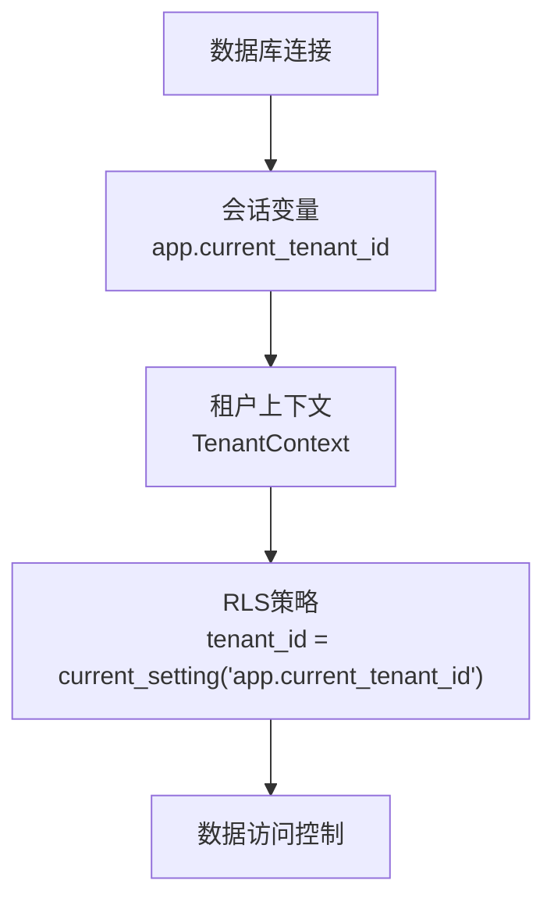

**图表来源**
- [V2__add_tenant_id_p0_tables.sql:55-104](file://resources/database/migrations/V2__add_tenant_id_p0_tables.sql#L55-L104)

### 租户上下文管理
系统通过JdbcTenantSupport提供统一的租户ID管理：

- **租户ID解析**：从TenantContext获取当前租户ID
- **默认值处理**：未设置时返回默认租户ID
- **显式参数支持**：支持方法签名中传入的显式租户ID参数

**章节来源**
- [V2__add_tenant_id_p0_tables.sql:1-139](file://resources/database/migrations/V2__add_tenant_id_p0_tables.sql#L1-L139)
- [JdbcTenantSupport.java:23-62](file://seahorse-agent-adapter-repository-jdbc/src/main/java/com/miracle/ai/seahorse/agent/adapters/repository/jdbc/JdbcTenantSupport.java#L23-L62)

## 查询重写日志系统

### 查询重写审计设计
V6迁移脚本引入了完整的查询重写日志系统，专门用于RAG（Advanced RAG）模块的审计追踪：

- **sa_query_rewrite_log**：查询重写日志表，记录原始查询、重写查询、重写方法和命中次数
- **重写方法追踪**：支持多种重写方法的记录，便于分析和优化
- **命中统计**：记录查询重写的命中次数，支持性能分析
- **时间戳管理**：精确记录每次重写操作的时间

### 表结构设计
查询重写日志表采用简洁而高效的结构设计：

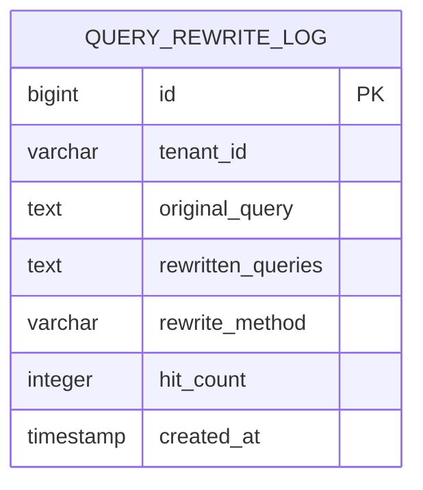

**图表来源**
- [V6__query_rewrite_log.sql:7-15](file://resources/database/migrations/V6__query_rewrite_log.sql#L7-L15)

### 索引策略
为确保查询重写日志的查询性能，建立了专门的索引策略：

- **复合索引**：(tenant_id, created_at) 支持按租户和时间范围的高效查询
- **租户隔离**：通过tenant_id字段确保多租户环境下的数据隔离
- **时间序列查询**：支持按时间排序的审计查询需求

### 查询重写应用场景
- **RAG系统审计**：追踪查询重写过程，支持系统优化和问题诊断
- **性能分析**：通过hit_count字段分析重写效果
- **合规性追踪**：记录所有查询重写操作，满足审计要求

**章节来源**
- [V6__query_rewrite_log.sql:1-18](file://resources/database/migrations/V6__query_rewrite_log.sql#L1-L18)

## 工作流可视化系统

### 执行步骤管理
V7迁移脚本引入了完整的工作流可视化系统，支持DAG（有向无环图）渲染和工作流监控：

- **t_agent_execution_steps**：执行步骤表，管理代理运行过程中的各个步骤
- **步骤状态追踪**：支持PENDING、RUNNING、COMPLETED、FAILED等多种状态
- **位置信息**：支持步骤在可视化界面中的位置坐标管理
- **执行时间统计**：记录步骤的开始、结束时间和持续时间

### 边关系管理
- **t_agent_execution_step_edges**：边关系表，定义步骤间的依赖关系和执行顺序
- **边类型支持**：支持SEQUENTIAL、CONDITIONAL、PARALLEL等多种边类型
- **DAG构建**：通过边关系表构建完整的执行图结构

### 表结构设计

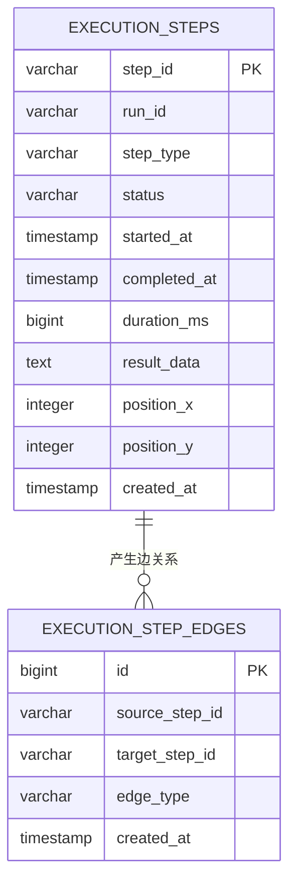

**图表来源**
- [V7__execution_steps.sql:7-19](file://resources/database/migrations/V7__execution_steps.sql#L7-L19)
- [V7__execution_steps.sql:25-31](file://resources/database/migrations/V7__execution_steps.sql#L25-L31)

### 索引策略
为确保工作流可视化的查询性能，建立了以下索引策略：

- **执行步骤索引**：
  - idx_exec_steps_run：(run_id) 支持按运行会话查询步骤
  - idx_exec_steps_status：(status) 支持按状态查询步骤
  - idx_exec_steps_run_started：(run_id, started_at) 支持按运行会话和时间排序
- **边关系索引**：
  - idx_exec_edges_source：(source_step_id) 支持源步骤查询
  - idx_exec_edges_target：(target_step_id) 支持目标步骤查询
  - idx_exec_edges_source_target：(source_step_id, target_step_id) 支持边关系查询

### 工作流可视化应用
- **DAG渲染**：通过执行步骤和边关系表构建完整的执行图
- **实时监控**：支持工作流执行状态的实时监控和可视化展示
- **性能分析**：通过执行时间统计分析工作流性能瓶颈
- **调试支持**：支持工作流执行过程的调试和问题定位

**章节来源**
- [V7__execution_steps.sql:1-36](file://resources/database/migrations/V7__execution_steps.sql#L1-L36)

## 知识库增强系统

### 知识库版本控制
V8迁移脚本引入了完整的知识库增强系统，支持版本控制、权限管理和外部分享：

- **t_knowledge_base_version**：知识库版本表，管理知识库的版本快照和变更历史
- **版本号管理**：支持递增的版本号和版本快照的存储
- **变更描述**：记录每次版本变更的详细描述

### 权限控制管理
- **t_knowledge_base_permission**：知识库权限表，管理用户对知识库的访问权限
- **权限类型**：支持READ、WRITE、ADMIN等不同级别的权限
- **权限授予**：记录权限的授予时间和授予者

### 外部分享功能
- **t_knowledge_base_share**：知识库分享表，支持知识库的外部分享和访问控制
- **分享令牌**：生成唯一的分享令牌，支持安全的外部访问
- **访问限制**：支持访问次数限制和过期时间控制

### 分享访问日志
- **t_knowledge_base_share_access_log**：分享访问日志表，记录外部访问的详细信息
- **访问统计**：记录IP地址、用户代理、来源页面等信息
- **审计追踪**：支持分享访问的完整审计追踪

### 知识库增强表结构设计

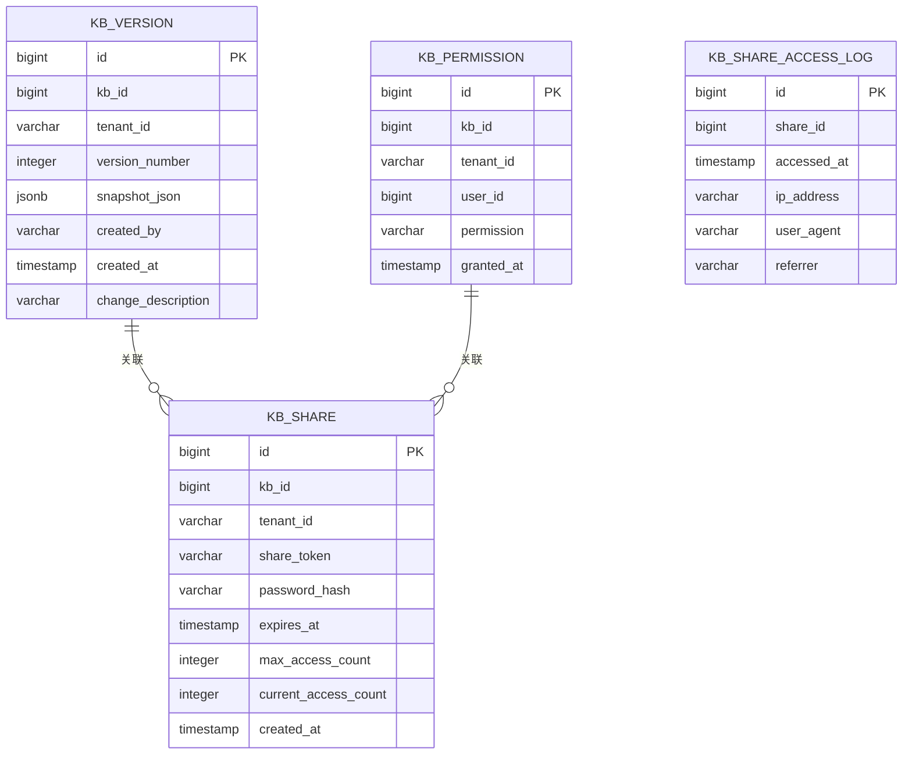

**图表来源**
- [V8__knowledge_base_enhancement.sql:8-17](file://resources/database/migrations/V8__knowledge_base_enhancement.sql#L8-L17)
- [V8__knowledge_base_enhancement.sql:25-32](file://resources/database/migrations/V8__knowledge_base_enhancement.sql#L25-L32)
- [V8__knowledge_base_enhancement.sql:40-49](file://resources/database/migrations/V8__knowledge_base_enhancement.sql#L40-L49)
- [V8__knowledge_base_enhancement.sql:58-65](file://resources/database/migrations/V8__knowledge_base_enhancement.sql#L58-L65)

### 索引策略
为确保知识库增强功能的查询性能，建立了以下索引策略：

- **版本控制索引**：
  - idx_kb_version_kb_id：(kb_id) 支持按知识库查询版本
  - idx_kb_version_tenant：(tenant_id) 支持按租户查询版本
  - idx_kb_version_unique：(kb_id, version_number) 唯一索引确保版本唯一性
  - idx_kb_version_created_at：(created_at) 支持版本创建时间查询
- **权限管理索引**：
  - idx_kb_permission_kb_id：(kb_id) 支持按知识库查询权限
  - idx_kb_permission_tenant：(tenant_id) 支持按租户查询权限
  - idx_kb_permission_user：(kb_id, user_id) 唯一索引确保用户权限唯一性
  - idx_kb_permission_granted：(granted_at) 支持权限授予时间查询
- **分享功能索引**：
  - idx_kb_share_token：(share_token) 唯一索引确保分享令牌唯一性
  - idx_kb_share_kb_id：(kb_id) 支持按知识库查询分享
  - idx_kb_share_tenant：(tenant_id) 支持按租户查询分享
  - idx_kb_share_expires：(expires_at) 支持过期时间查询
- **访问日志索引**：
  - idx_kb_share_log_share：(share_id) 支持按分享查询访问日志
  - idx_kb_share_log_accessed：(accessed_at) 支持访问时间查询

### 知识库增强应用场景
- **版本管理**：支持知识库的版本控制和变更追踪
- **权限控制**：支持细粒度的知识库访问控制
- **外部分享**：支持安全的知识库外部分享功能
- **审计追踪**：支持知识库操作的完整审计追踪

**章节来源**
- [V8__knowledge_base_enhancement.sql:1-69](file://resources/database/migrations/V8__knowledge_base_enhancement.sql#L1-L69)

## 代理市场系统

### 代理发布审核
V9迁移脚本引入了完整的代理市场系统，支持代理的发布、审核和管理：

- **sa_agent_definition**：代理定义表增强，新增市场相关字段
- **可见性控制**：支持PRIVATE、PUBLIC等不同的可见性设置
- **分类管理**：支持代理的分类和标签管理
- **定价策略**：支持免费和付费两种定价模式

### 发布审核流程
- **sa_agent_publish_review**：代理发布审核表，管理代理发布的审核流程
- **审核状态**：支持PENDING、APPROVED、REJECTED等审核状态
- **审核评论**：支持审核人员的审核意见记录

### 代理订阅管理
- **sa_agent_subscription**：代理订阅表，管理用户对代理的订阅关系
- **订阅状态**：支持活跃和非活跃的订阅状态
- **订阅统计**：支持订阅数量的统计和分析

### 代理评分系统
- **sa_agent_rating**：代理评分表，管理用户对代理的评分和评价
- **评分范围**：支持1-5星的评分系统
- **评分聚合**：通过sa_agent_rating_summary表缓存评分统计

### 代理流行度计算
- **sa_agent_popularity**：代理流行度表，计算和存储代理的流行度分数
- **流行度指标**：综合考虑订阅数、评分、活动度等因素
- **排名管理**：支持代理的排名计算和展示

### 代理市场表结构设计

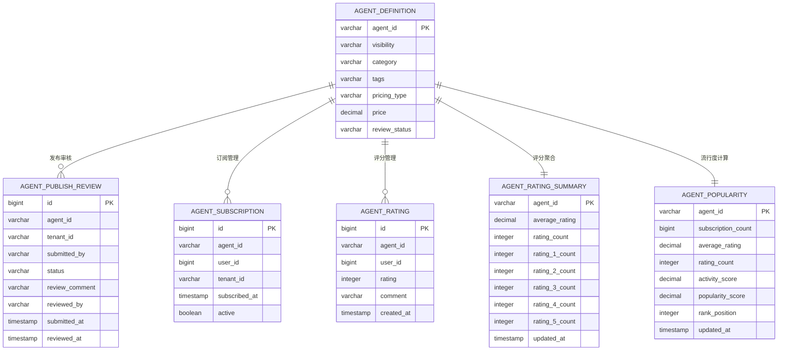

**图表来源**
- [V9__agent_marketplace.sql:7-14](file://resources/database/migrations/V9__agent_marketplace.sql#L7-L14)
- [V9__agent_marketplace.sql:20-30](file://resources/database/migrations/V9__agent_marketplace.sql#L20-L30)
- [V9__agent_marketplace.sql:38-45](file://resources/database/migrations/V9__agent_marketplace.sql#L38-L45)
- [V9__agent_marketplace.sql:54-61](file://resources/database/migrations/V9__agent_marketplace.sql#L54-L61)
- [V9__agent_marketplace.sql:69-91](file://resources/database/migrations/V9__agent_marketplace.sql#L69-L91)

### 索引策略
为确保代理市场的查询性能，建立了以下索引策略：

- **代理定义索引**：
  - idx_agent_visibility：(visibility) 支持按可见性查询代理
  - idx_agent_category：(category) 支持按分类查询代理
  - idx_agent_review_status：(review_status) 支持按审核状态查询代理
- **发布审核索引**：
  - idx_review_agent：(agent_id) 支持按代理查询审核记录
  - idx_review_tenant：(tenant_id) 支持按租户查询审核记录
  - idx_review_status：(status) 支持按状态查询审核记录
  - idx_review_submitted：(submitted_at) 支持提交时间查询
- **订阅管理索引**：
  - idx_subscription_agent：(agent_id) 支持按代理查询订阅
  - idx_subscription_user：(user_id) 支持按用户查询订阅
  - idx_subscription_tenant：(tenant_id) 支持按租户查询订阅
  - idx_subscription_unique：(agent_id, user_id) 唯一索引确保订阅唯一性
  - idx_subscription_active：(active) 支持按活跃状态查询订阅
- **评分系统索引**：
  - idx_rating_agent：(agent_id) 支持按代理查询评分
  - idx_rating_user：(user_id) 支持按用户查询评分
  - idx_rating_unique：(agent_id, user_id) 唯一索引确保评分唯一性
  - idx_rating_value：(rating) 支持按评分值查询
- **流行度索引**：
  - idx_popularity_score：(popularity_score DESC) 支持按流行度排序
  - idx_popularity_rank：(rank_position) 支持按排名查询

### 代理市场应用场景
- **代理发布**：支持代理的发布和审核流程
- **市场推广**：支持代理的分类、标签和定价管理
- **用户订阅**：支持用户对代理的订阅和管理
- **质量评估**：支持用户评分和代理质量评估
- **排名展示**：支持代理的流行度计算和排名展示

**章节来源**
- [V9__agent_marketplace.sql:1-95](file://resources/database/migrations/V9__agent_marketplace.sql#L1-L95)

## 系统审计日志

### 综合审计设计
V10迁移脚本引入了完整的系统审计日志系统，支持合规性要求和管理员操作追踪：

- **sa_audit_log**：综合审计日志表，记录系统中的各种操作和事件
- **操作类型**：支持登录、配置修改、数据操作、系统管理等多种操作类型
- **资源追踪**：记录受影响的资源类型和ID，支持完整的操作链路追踪
- **详细信息**：支持操作详情、IP地址、用户代理等详细信息记录

### 审计日志表结构设计

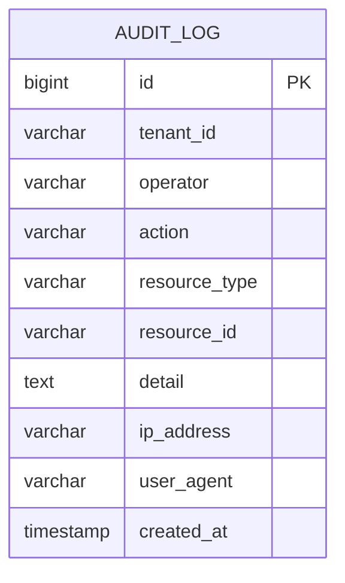

**图表来源**
- [V10__audit_log_and_admin.sql:8-19](file://resources/database/migrations/V10__audit_log_and_admin.sql#L8-L19)

### 索引策略
为确保审计日志的查询性能，建立了以下索引策略：

- **基础索引**：
  - idx_audit_log_tenant：(tenant_id) 支持按租户查询审计日志
  - idx_audit_log_action：(action) 支持按操作类型查询审计日志
  - idx_audit_log_resource_type：(resource_type) 支持按资源类型查询审计日志
  - idx_audit_log_operator：(operator) 支持按操作者查询审计日志
  - idx_audit_log_created_at：(created_at) 支持按时间查询审计日志
- **复合索引**：
  - idx_audit_log_tenant_action：(tenant_id, action) 支持租户和操作类型的组合查询
  - idx_audit_log_tenant_created：(tenant_id, created_at DESC) 支持租户和时间的组合查询
  - idx_audit_log_action_created：(action, created_at DESC) 支持操作类型和时间的组合查询
- **清理索引**：
  - idx_audit_log_created_asc：(created_at ASC) 支持审计日志的定期清理和归档

### 审计日志应用场景
- **合规性要求**：满足各种法规和标准的审计要求
- **安全监控**：监控系统中的异常操作和潜在安全威胁
- **操作追踪**：追踪用户的所有操作行为，支持问题定位和责任认定
- **系统监控**：监控系统的运行状态和关键指标变化

### 审计日志查询优化
- **分页查询**：支持大数据量下的分页查询，避免内存溢出
- **条件过滤**：支持按租户、操作类型、资源类型、时间范围等多维度过滤
- **排序优化**：支持按时间降序排列，确保最新的审计记录优先显示
- **批量清理**：通过created_at ASC索引支持定期的审计日志清理和归档

**章节来源**
- [V10__audit_log_and_admin.sql:1-35](file://resources/database/migrations/V10__audit_log_and_admin.sql#L1-L35)

## 知识库检索配置系统

### 检索策略模板管理
V11迁移脚本引入了完整的知识库检索配置系统，支持检索策略的标准化管理和模板化配置：

- **t_retrieval_strategy_template**：检索策略模板表，管理标准化的检索策略配置
- **策略类型支持**：支持BM25、向量检索、混合检索等多种检索策略类型
- **参数配置**：支持检索参数的灵活配置和版本管理
- **模板继承**：支持模板的继承和定制化配置

### 检索配置版本控制
- **t_retrieval_config_version**：检索配置版本表，管理检索配置的版本快照
- **配置变更追踪**：记录检索配置的变更历史和影响范围
- **回滚支持**：支持检索配置的版本回滚和恢复

### 检索策略应用管理
- **t_retrieval_strategy_application**：检索策略应用表，管理策略在知识库中的应用关系
- **应用状态**：支持激活、停用、测试等不同应用状态
- **性能监控**：记录策略应用的性能指标和效果评估

### 知识库检索配置表结构设计

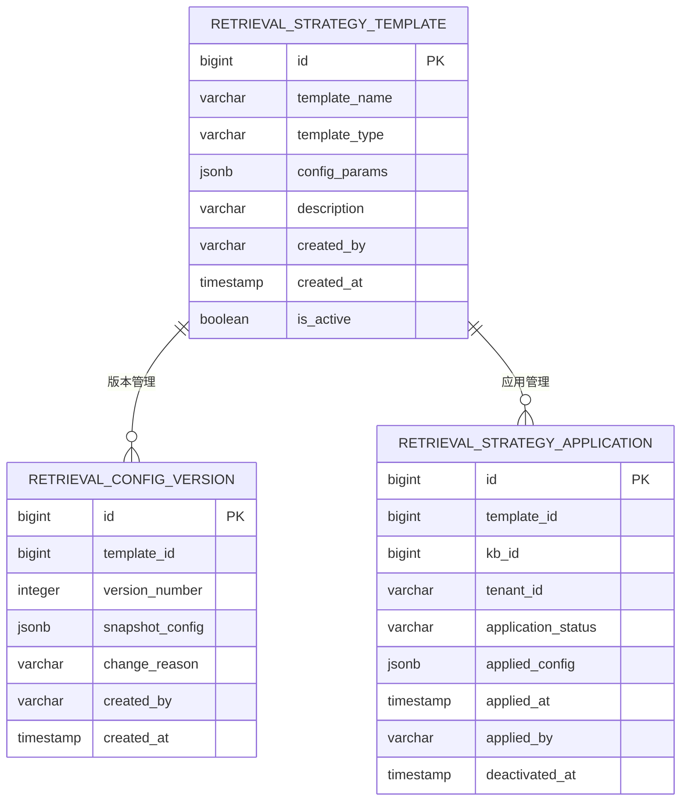

**图表来源**
- [V11__kb_retrieval_config.sql:1-200](file://resources/database/migrations/V11__kb_retrieval_config.sql#L1-L200)

### 索引策略
为确保知识库检索配置的查询性能，建立了以下索引策略：

- **模板表索引**：
  - idx_template_name：(template_name) 支持按模板名称查询
  - idx_template_type：(template_type) 支持按策略类型查询
  - idx_template_active：(is_active) 支持按激活状态查询
  - idx_template_created：(created_at) 支持模板创建时间查询
- **版本表索引**：
  - idx_config_version_template：(template_id) 支持按模板查询版本
  - idx_config_version_number：(version_number) 支持按版本号查询
  - idx_config_version_created：(created_at) 支持版本创建时间查询
- **应用表索引**：
  - idx_application_template：(template_id) 支持按模板查询应用
  - idx_application_kb：(kb_id) 支持按知识库查询应用
  - idx_application_tenant：(tenant_id) 支持按租户查询应用
  - idx_application_status：(application_status) 支持按应用状态查询
  - idx_application_applied：(applied_at) 支持应用时间查询

### 检索配置应用场景
- **策略标准化**：支持检索策略的标准化和模板化管理
- **版本控制**：支持检索配置的版本管理和变更追踪
- **应用管理**：支持检索策略在知识库中的应用和监控
- **性能优化**：支持检索策略的效果评估和性能优化

**章节来源**
- [V11__kb_retrieval_config.sql:1-200](file://resources/database/migrations/V11__kb_retrieval_config.sql#L1-L200)

## 用户登录历史系统

### 登录行为追踪设计
V12迁移脚本引入了完整的用户登录历史系统，支持用户登录行为的详细追踪和安全监控：

- **t_login_history**：用户登录历史表，记录用户的登录行为和相关信息
- **登录设备识别**：记录登录设备类型、操作系统、浏览器等信息
- **地理位置追踪**：支持IP地址解析和地理位置信息记录
- **登录状态管理**：记录登录成功、失败、异常等不同状态

### 登录安全监控
- **异常登录检测**：支持异常登录行为的检测和告警
- **登录频率监控**：记录用户的登录频率和模式分析
- **安全事件关联**：将登录历史与安全事件进行关联分析

### 登录历史表结构设计

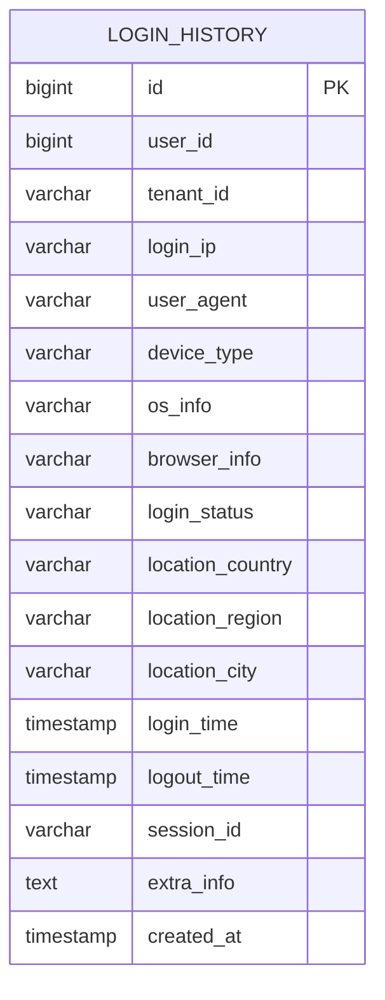

**图表来源**
- [V12__login_history.sql:15-200](file://resources/database/migrations/V12__login_history.sql#L15-L200)

### 索引策略
为确保用户登录历史的查询性能，建立了以下索引策略：

- **基础索引**：
  - idx_login_user：(user_id) 支持按用户查询登录历史
  - idx_login_tenant：(tenant_id) 支持按租户查询登录历史
  - idx_login_time：(login_time) 支持按时间查询登录历史
  - idx_login_status：(login_status) 支持按登录状态查询
- **复合索引**：
  - idx_login_user_time：(user_id, login_time DESC) 支持用户登录历史的快速查询
  - idx_login_ip_time：(login_ip, login_time DESC) 支持IP地址登录历史查询
  - idx_login_device_time：(device_type, login_time DESC) 支持设备类型登录历史查询
- **地理位置索引**：
  - idx_login_location：(location_country, location_region, location_city) 支持地理位置查询
- **会话索引**：
  - idx_login_session：(session_id) 支持会话级别的登录历史查询

### 登录历史应用场景
- **安全监控**：监控用户的登录行为，识别异常登录模式
- **审计追踪**：记录用户的完整登录历史，满足合规性要求
- **用户分析**：分析用户的登录习惯和行为模式
- **反欺诈**：通过登录历史识别潜在的安全威胁和欺诈行为

**章节来源**
- [V12__login_history.sql:1-200](file://resources/database/migrations/V12__login_history.sql#L1-L200)

## 收益分成系统

### 合作伙伴收益分配设计
V13迁移脚本引入了完整的收益分成系统，支持合作伙伴的收益分配和结算管理：

- **sa_revenue_share**：收益分成表，记录合作伙伴的收益分配和结算信息
- **分成比例管理**：支持不同合作伙伴的分成比例配置
- **结算周期管理**：支持按月、按季度等不同结算周期的管理
- **收益类型分类**：支持订阅费用、使用量费用、推广费用等不同类型收益

### 收益结算流程
- **sa_revenue_share_calculation**：收益计算表，管理收益的计算和确认流程
- **结算状态追踪**：支持待结算、已结算、异常等不同结算状态
- **对账管理**：支持收益的对账和差异处理

### 合作伙伴管理
- **sa_partner**：合作伙伴表，管理合作伙伴的基本信息和等级
- **等级体系**：支持不同等级的合作伙伴和相应的权益
- **合同管理**：支持合作伙伴合同的管理和到期提醒

### 收益分成表结构设计

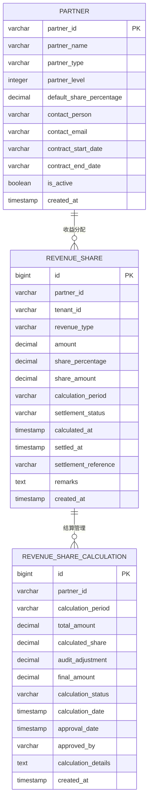

**图表来源**
- [V13__revenue_share.sql:1-200](file://resources/database/migrations/V13__revenue_share.sql#L1-L200)

### 索引策略
为确保收益分成的查询性能，建立了以下索引策略：

- **收益表索引**：
  - idx_revenue_partner：(partner_id) 支持按合作伙伴查询收益
  - idx_revenue_tenant：(tenant_id) 支持按租户查询收益
  - idx_revenue_type：(revenue_type) 支持按收益类型查询
  - idx_revenue_period：(calculation_period) 支持按结算周期查询
  - idx_revenue_status：(settlement_status) 支持按结算状态查询
  - idx_revenue_calculated：(calculated_at) 支持计算时间查询
- **计算表索引**：
  - idx_calculation_partner：(partner_id) 支持按合作伙伴查询计算
  - idx_calculation_period：(calculation_period) 支持按周期查询计算
  - idx_calculation_status：(calculation_status) 支持按状态查询计算
  - idx_calculation_date：(calculation_date) 支持计算日期查询
- **合作伙伴索引**：
  - idx_partner_level：(partner_level) 支持按等级查询合作伙伴
  - idx_partner_type：(partner_type) 支持按类型查询合作伙伴
  - idx_partner_active：(is_active) 支持按激活状态查询

### 收益分成应用场景
- **合作伙伴管理**：支持合作伙伴的全生命周期管理
- **收益分配**：支持自动化的收益分配和结算流程
- **财务对账**：支持收益的财务对账和报表生成
- **商业分析**：支持合作伙伴效益和收益趋势分析

**章节来源**
- [V13__revenue_share.sql:1-200](file://resources/database/migrations/V13__revenue_share.sql#L1-L200)

## 详细组件分析

### 用户管理（JdbcUserRepositoryAdapter）
- 职责：负责用户信息的增删改查、登录态与密码哈希存储、用户状态与角色管理
- 关键点：遵循最小权限原则，密码以哈希形式存储；提供用户会话与令牌接口集成
- 兼容性：与 Sa-Token 等认证组件协作，确保统一的认证与授权边界
- **更新** 租户隔离：所有用户查询和操作都通过JdbcTenantSupport解析的租户ID进行过滤
- **更新** 用户注册：支持邮箱、状态、外部ID等新字段的管理
- **更新** 试用管理：集成试用表查询，支持试用状态和配额检查

**章节来源**
- [JdbcUserRepositoryAdapter.java](file://seahorse-agent-adapter-repository-jdbc/src/main/java/com/miracle/ai/seahorse/agent/adapters/repository/jdbc/JdbcUserRepositoryAdapter.java)
- [JdbcTenantSupport.java:45-61](file://seahorse-agent-adapter-repository-jdbc/src/main/java/com/miracle/ai/seahorse/agent/adapters/repository/jdbc/JdbcTenantSupport.java#L45-L61)
- [V3__add_user_trial_tables.sql:8-16](file://resources/database/migrations/V3__add_user_trial_tables.sql#L8-L16)

### 会话管理（JdbcConversationRepositoryAdapter）
- 职责：管理对话会话的生命周期，包括会话创建、消息关联、摘要与附件管理
- 关键点：会话与消息、附件、反馈等存在强关联；提供宽字段适配与历史兼容
- 兼容性：通过聊天模式升级器对历史表字段进行宽度扩展与新增列，保证运行期兼容
- **更新** 租户隔离：会话查询和消息管理都基于tenant_id进行租户过滤

**章节来源**
- [JdbcConversationRepositoryAdapter.java](file://seahorse-agent-adapter-repository-jdbc/src/main/java/com/miracle/ai/seahorse/agent/adapters/repository/jdbc/JdbcConversationRepositoryAdapter.java)
- [JdbcChatSchemaUpgrade.java:33-58](file://seahorse-agent-adapter-repository-jdbc/src/main/java/com/miracle/ai/seahorse/agent/adapters/repository/jdbc/JdbcChatSchemaUpgrade.java#L33-L58)

### 知识库管理（JdbcKnowledgeBaseRepositoryAdapter、JdbcKnowledgeDocumentRepositoryAdapter、JdbcKnowledgeChunkRepositoryAdapter）
- 职责：知识库基础信息、文档与分块的全生命周期管理
- 关键点：知识库与文档、分块之间存在层级关系；分块与向量索引配合实现检索增强
- 向量支持：通过 pgvector 扩展与适配器实现向量存储与相似度检索
- **更新** 租户隔离：所有知识库操作都基于tenant_id进行租户过滤，确保知识库数据隔离

**更新** 知识库文档表结构已进行重要字段宽度扩展，以支持更丰富的文件类型和处理模式：

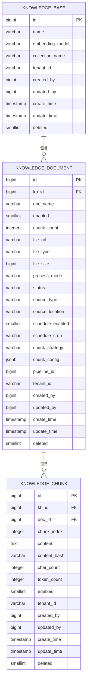

**更新** 主要字段宽度扩展：
- `file_type`：从 `VARCHAR(16)` 扩展到 `VARCHAR(64)`，支持更广泛的文件类型标识
- `process_mode`：从 `VARCHAR(16)` 扩展到 `VARCHAR(32)`，支持更多处理模式
- `status`：从 `VARCHAR(16)` 扩展到 `VARCHAR(32)`，支持更丰富的状态枚举
- `chunk_strategy`：从 `VARCHAR(16)` 扩展到 `VARCHAR(32)`，支持更多分块策略

**更新** 默认值处理改进：
- `created_by` 和 `updated_by` 列在多个表中设置 `DEFAULT 0`，确保操作者ID的默认值处理
- `tenant_id` 字段在所有新增表中设置 `DEFAULT 'default'`，确保向后兼容

**章节来源**
- [JdbcKnowledgeBaseRepositoryAdapter.java](file://seahorse-agent-adapter-repository-jdbc/src/main/java/com/miracle/ai/seahorse/agent/adapters/repository/jdbc/JdbcKnowledgeBaseRepositoryAdapter.java)
- [JdbcKnowledgeDocumentRepositoryAdapter.java](file://seahorse-agent-adapter-repository-jdbc/src/main/java/com/miracle/ai/seahorse/agent/adapters/repository/jdbc/JdbcKnowledgeDocumentRepositoryAdapter.java)
- [JdbcKnowledgeChunkRepositoryAdapter.java](file://seahorse-agent-adapter-repository-jdbc/src/main/java/com/miracle/ai/seahorse/agent/adapters/repository/jdbc/JdbcKnowledgeChunkRepositoryAdapter.java)
- [V2__add_tenant_id_p0_tables.sql:10-49](file://resources/database/migrations/V2__add_tenant_id_p0_tables.sql#L10-L49)
- [PgVectorAdapter.java:243-274](file://seahorse-agent-adapter-vector-pgvector/src/main/java/com/miracle/ai/seahorse/agent/adapters/vector/pgvector/PgVectorAdapter.java#L243-L274)
- [PgVectorProperties.java:28-38](file://seahorse-agent-adapter-vector-pgvector/src/main/java/com/miracle/ai/seahorse/agent/adapters/vector/pgvector/PgVectorProperties.java#L28-L38)

### 记忆管理（JdbcShortTermMemoryRepositoryAdapter、JdbcLongTermMemoryRepositoryAdapter）
- 职责：短期与长期记忆的数据结构、生命周期与聚合缓冲管理
- 关键点：短期记忆偏向高频写入与快速检索；长期记忆关注稳定性与持久化
- 兼容性：通过升级器对历史表进行字段宽度扩展与新增列，保障运行期兼容
- **更新** 租户隔离：记忆查询和操作都基于tenant_id进行租户过滤，确保记忆数据隔离

**章节来源**
- [JdbcShortTermMemoryRepositoryAdapter.java](file://seahorse-agent-adapter-repository-jdbc/src/main/java/com/miracle/ai/seahorse/agent/adapters/repository/jdbc/JdbcShortTermMemoryRepositoryAdapter.java)
- [JdbcLongTermMemoryRepositoryAdapter.java](file://seahorse-agent-adapter-repository-jdbc/src/main/java/com/miracle/ai/seahorse/agent/adapters/repository/jdbc/JdbcLongTermMemoryRepositoryAdapter.java)
- [JdbcChatSchemaUpgrade.java:33-58](file://seahorse-agent-adapter-repository-jdbc/src/main/java/com/miracle/ai/seahorse/agent/adapters/repository/jdbc/JdbcChatSchemaUpgrade.java#L33-L58)

### 记忆治理（增强的记忆治理功能）
- 职责：支持记忆审查、反馈收集、质量监控和冲突管理
- 关键表结构：
  - t_memory_review_candidate：记忆审查候选表，支持审查状态跟踪和决策
  - t_memory_review_feedback_sample：反馈样本表，支持审查结果的样本收集
  - t_memory_quality_snapshot：质量快照表，支持记忆质量的定期快照
  - t_memory_conflict_log：冲突日志表，支持记忆冲突的跟踪和解决
- 索引策略：在审查候选表上建立复合索引支持多维查询，包括租户、用户、审查状态和更新时间
- **更新** 租户隔离：所有记忆治理操作都基于tenant_id进行租户过滤

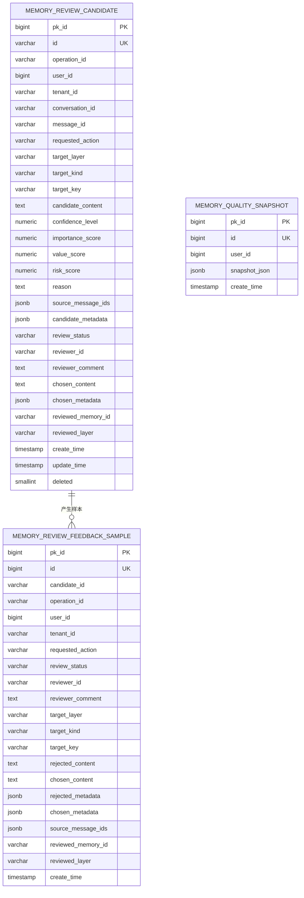

**图表来源**
- [seahorse_init.sql:568-629](file://resources/database/seahorse_init.sql#L568-L629)
- [seahorse_init.sql:834-841](file://resources/database/seahorse_init.sql#L834-L841)

**章节来源**
- [seahorse_init.sql:568-629](file://resources/database/seahorse_init.sql#L568-L629)
- [seahorse_init.sql:834-841](file://resources/database/seahorse_init.sql#L834-L841)

### 技能管理（JdbcAgentSkillRepositoryAdapter）
- 职责：技能定义、版本管理和技能绑定的全生命周期管理
- 关键点：技能表包含技能基本信息、状态管理、标签和工具限制；版本表支持多版本控制和安全扫描；绑定表实现技能与代理的灵活关联
- 表结构设计：
  - sa_agent_skill：技能主表，包含技能名称、分类、来源、状态、启用标志、描述、标签、允许工具等
  - sa_agent_skill_revision：技能版本表，支持多版本管理、内容哈希验证、安全扫描结果
  - sa_agent_skill_binding：技能绑定表，实现技能与代理的绑定关系和注入模式配置
- 索引策略：在技能表上建立租户+状态+启用的复合索引，在版本表上建立租户+技能+版本号的唯一索引
- **更新** 租户隔离：技能管理的所有操作都基于tenant_id进行租户过滤，确保技能数据隔离

**章节来源**
- [JdbcAgentSkillRepositoryAdapter.java:188-243](file://seahorse-agent-adapter-repository-jdbc/src/main/java/com/miracle/ai/seahorse/agent/adapters/repository/jdbc/JdbcAgentSkillRepositoryAdapter.java#L188-L243)
- [seahorse_init.sql:926-982](file://resources/database/seahorse_init.sql#L926-L982)
- [JdbcChatSchemaUpgrade.java:59-105](file://seahorse-agent-adapter-repository-jdbc/src/main/java/com/miracle/ai/seahorse/agent/adapters/repository/jdbc/JdbcChatSchemaUpgrade.java#L59-L105)

### 代理运行管理
- 职责：代理定义、版本管理、运行跟踪、工件管理和检查点管理
- 关键表结构：
  - sa_agent_definition：代理定义表，包含代理标识、租户、类型、状态和风险级别
  - sa_agent_version：代理版本表，支持版本号管理、指令和配置存储
  - sa_agent_run：代理运行表，跟踪运行状态、成本和错误信息
  - sa_agent_artifact：代理工件表，管理生成的报告、图表和文件
  - sa_agent_step：代理步骤表，跟踪执行步骤的状态和输出
  - sa_agent_checkpoint：代理检查点表，支持运行中断后的恢复
- 索引策略：在运行表上建立多维索引支持按代理、状态和时间的查询
- **更新** 租户隔离：代理运行管理的所有操作都基于tenant_id进行租户过滤

**章节来源**
- [JdbcAgentDefinitionRepositoryAdapter.java](file://seahorse-agent-adapter-repository-jdbc/src/main/java/com/miracle/ai/seahorse/agent/adapters/repository/jdbc/JdbcAgentDefinitionRepositoryAdapter.java)
- [JdbcAgentVersionActivationRepositoryAdapter.java](file://seahorse-agent-adapter-repository-jdbc/src/main/java/com/miracle/ai/seahorse/agent/adapters/repository/jdbc/JdbcAgentVersionActivationRepositoryAdapter.java)
- [JdbcAgentRunRepositoryAdapter.java](file://seahorse-agent-adapter-repository-jdbc/src/main/java/com/miracle/ai/seahorse/agent/adapters/repository/jdbc/JdbcAgentRunRepositoryAdapter.java)
- [JdbcAgentArtifactRepository.java](file://seahorse-agent-adapter-repository-jdbc/src/main/java/com/miracle/ai/seahorse/agent/adapters/repository/jdbc/JdbcAgentArtifactRepositoryAdapter.java)
- [JdbcAgentStepRepositoryAdapter.java](file://seahorse-agent-adapter-repository-jdbc/src/main/java/com/miracle/ai/seahorse/agent/adapters/repository/jdbc/JdbcAgentCheckpointRepositoryAdapter.java)
- [JdbcAgentCheckpointRepositoryAdapter.java](file://seahorse-agent-adapter-repository-jdbc/src/main/java/com/miracle/ai/seahorse/agent/adapters/repository/jdbc/JdbcAgentCheckpointRepositoryAdapter.java)

### 访问控制与安全
- 职责：工具目录管理、连接器操作、ACL规则和沙箱会话管理
- 关键表结构：
  - sa_tool_catalog：工具目录表，管理可用工具及其风险级别
  - sa_connector：连接器定义表，支持多提供商连接器
  - sa_connector_operation：连接器操作表，管理API操作和认证类型
  - sa_resource_acl_rule：资源ACL规则表，实现细粒度访问控制
  - sa_sandbox_session：沙箱会话表，支持隔离执行环境
- 索引策略：在ACL规则表上建立复合索引支持资源和主体的快速查找
- **更新** 租户隔离：访问控制的所有操作都基于tenant_id进行租户过滤

**章节来源**
- [JdbcToolCatalogRepositoryAdapter.java](file://seahorse-agent-adapter-repository-jdbc/src/main/java/com/miracle/ai/seahorse/agent/adapters/repository/jdbc/JdbcToolCatalogRepositoryAdapter.java)
- [JdbcConnectorRepositoryAdapter.java](file://seahorse-agent-adapter-repository-jdbc/src/main/java/com/miracle/ai/seahorse/agent/adapters/repository/jdbc/JdbcConnectorRepositoryAdapter.java)
- [JdbcConnectorOperationRepositoryAdapter.java](file://seahorse-agent-adapter-repository-jdbc/src/main/java/com/miracle/ai/seahorse/agent/adapters/repository/jdbc/JdbcConnectorOperationRepositoryAdapter.java)
- [JdbcResourceAclRepositoryAdapter.java](file://seahorse-agent-adapter-repository-jdbc/src/main/java/com/miracle/ai/seahorse/agent/adapters/repository/jdbc/JdbcResourceAclRepositoryAdapter.java)
- [JdbcSandboxRepositoryAdapter.java](file://seahorse-agent-adapter-repository-jdbc/src/main/java/com/miracle/ai/seahorse/agent/adapters/repository/jdbc/JdbcSandboxRepositoryAdapter.java)

### 评估与审计
- 职责：评估候选管理、样本收集、审计事件记录和配额策略管理
- 关键表结构：
  - sa_eval_candidate：评估候选表，支持评估样本的选择和审查
  - sa_eval_sample：评估样本表，管理标准测试数据集
  - sa_audit_event：审计事件表，记录所有重要操作的审计轨迹
  - sa_quota_policy：配额策略表，支持令牌、调用和成本限制
  - sa_cost_usage_record：成本使用记录表，跟踪资源消耗
- 索引策略：在审计事件表上建立多维索引支持按租户、运行和时间的查询
- **更新** 租户隔离：评估与审计的所有操作都基于tenant_id进行租户过滤

**章节来源**
- [JdbcEvalCandidateRepositoryAdapter.java](file://seahorse-agent-adapter-repository-jdbc/src/main/java/com/miracle/ai/seahorse/agent/adapters/repository/jdbc/JdbcEvalCandidateRepositoryAdapter.java)
- [JdbcEvalSampleRepositoryAdapter.java](file://seahorse-agent-adapter-repository-jdbc/src/main/java/com/miracle/ai/seahorse/agent/adapters/repository/jdbc/JdbcEvalSampleRepositoryAdapter.java)
- [JdbcAuditEventRepositoryAdapter.java](file://seahorse-agent-adapter-repository-jdbc/src/main/java/com/miracle/ai/seahorse/agent/adapters/repository/jdbc/JdbcAuditEventRepositoryAdapter.java)
- [JdbcQuotaPolicyRepositoryAdapter.java](file://seahorse-agent-adapter-repository-jdbc/src/main/java/com/miracle/ai/seahorse/agent/adapters/repository/jdbc/JdbcQuotaPolicyRepositoryAdapter.java)
- [JdbcCostUsageRepositoryAdapter.java](file://seahorse-agent-adapter-repository-jdbc/src/main/java/com/miracle/ai/seahorse/agent/adapters/repository/jdbc/JdbcCostUsageRepositoryAdapter.java)

### SRE健康监控
- 职责：监控代理扩展状态、运行事件和系统健康状况
- 关键表结构：
  - t_agent_extension_status：扩展状态表，跟踪各扩展的健康状态和能力
  - sa_agent_run_event_buffer：运行事件缓冲表，支持事件的可靠传递
  - t_agent_run_lease：运行租约表，管理运行实例的租约和心跳
- 索引策略：在扩展状态表上建立端口类型的索引支持快速查询
- **更新** 租户隔离：SRE监控的所有操作都基于tenant_id进行租户过滤

**章节来源**
- [JdbcAgentExtensionStatusAdapter.java](file://seahorse-agent-adapter-repository-jdbc/src/main/java/com/miracle/ai/seahorse/agent/adapters/repository/jdbc/JdbcAgentExtensionStatusAdapter.java)
- [JdbcAgentRunEventBufferAdapter.java](file://seahorse-agent-adapter-repository-jdbc/src/main/java/com/miracle/ai/seahorse/agent/adapters/repository/jdbc/JdbcAgentRunEventBufferAdapter.java)
- [JdbcAgentRunLeaseRepositoryAdapter.java](file://seahorse-agent-adapter-repository-jdbc/src/main/java/com/miracle/ai/seahorse/agent/adapters/repository/jdbc/JdbcAgentRunLeaseRepositoryAdapter.java)

### 检索治理
- 职责：管理检索策略模板、评估数据集和评估报告
- 关键表结构：
  - t_retrieval_strategy_template：检索策略模板表，支持策略的标准化管理
  - t_retrieval_evaluation_dataset：评估数据集表，管理测试用例
  - t_retrieval_evaluation_run：评估运行表，跟踪评估结果指标
  - t_retrieval_evaluation_comparison：评估比较表，支持策略间的对比分析
- 索引策略：在评估运行表上建立数据集维度的索引支持快速查询
- **更新** 租户隔离：检索治理的所有操作都基于tenant_id进行租户过滤

**章节来源**
- [JdbcRetrievalStrategyTemplateRepositoryAdapter.java](file://seahorse-agent-adapter-repository-jdbc/src/main/java/com/miracle/ai/seahorse/agent/adapters/repository/jdbc/JdbcRetrievalStrategyTemplateRepositoryAdapter.java)
- [JdbcRetrievalEvaluationDatasetRepositoryAdapter.java](file://seahorse-agent-adapter-repository-jdbc/src/main/java/com/miracle/ai/seahorse/agent/adapters/repository/jdbc/JdbcRetrievalEvaluationDatasetRepositoryAdapter.java)
- [JdbcRetrievalEvaluationRunRepositoryAdapter.java](file://seahorse-agent-adapter-repository-jdbc/src/main/java/com/miracle/ai/seahorse/agent/adapters/repository/jdbc/JdbcRetrievalEvaluationRunRepositoryAdapter.java)
- [JdbcRetrievalEvaluationComparisonRepositoryAdapter.java](file://seahorse-agent-adapter-repository-jdbc/src/main/java/com/miracle/ai/seahorse/agent/adapters/repository/jdbc/JdbcRetrievalEvaluationComparisonRepositoryAdapter.java)

### AI模型配置管理
- 职责：管理AI模型配置参数，支持加密存储和版本控制
- 关键表结构：
  - sa_ai_model_config：AI模型配置表，支持字符串、整数、布尔值和JSON类型的配置
- 索引策略：在配置键上建立索引支持快速配置查找
- **更新** 租户隔离：AI模型配置管理的所有操作都基于tenant_id进行租户过滤

**章节来源**
- [JdbcAiModelConfigRepositoryAdapter.java](file://seahorse-agent-adapter-repository-jdbc/src/main/java/com/miracle/ai/seahorse/agent/adapters/repository/jdbc/JdbcAiModelConfigRepositoryAdapter.java)

### 元数据治理与检索（JdbcMetadataGovernanceRepositoryAdapter、JdbcQueryTermMappingRepositoryAdapter）
- 职责：元数据字段治理、同步状态记录、查询术语映射与分页查询
- 关键点：提供字段删除、同步结果记录与分页查询能力，支撑检索质量与一致性
- **更新** 租户隔离：元数据治理的所有操作都基于tenant_id进行租户过滤

**章节来源**
- [JdbcMetadataGovernanceRepositoryAdapter.java:272-307](file://seahorse-agent-adapter-repository-jdbc/src/main/java/com/miracle/ai/seahorse/agent/adapters/repository/jdbc/JdbcMetadataGovernanceRepositoryAdapter.java#L272-L307)
- [JdbcQueryTermMappingRepositoryAdapter.java:25-212](file://seahorse-agent-adapter-repository-jdbc/src/main/java/com/miracle/ai/seahorse/agent/adapters/repository/jdbc/JdbcQueryTermMappingRepositoryAdapter.java#L25-L212)

### 示例问题（JdbcSampleQuestionRepositoryAdapter）
- 职责：示例问题的随机查询、分页与 CRUD 管理
- 关键点：提供随机取样与分页查询，支持前端引导与测试场景
- **更新** 租户隔离：示例问题管理的所有操作都基于tenant_id进行租户过滤

**章节来源**
- [JdbcSampleQuestionRepositoryAdapter.java:26-92](file://seahorse-agent-adapter-repository-jdbc/src/main/java/com/miracle/ai/seahorse/agent/adapters/repository/jdbc/JdbcSampleQuestionRepositoryAdapter.java#L26-L92)

### 事件出站（JdbcOutboxEventRepositoryAdapter）
- 职责：事件出站消息的持久化与调度，保障最终一致性
- 关键点：通过出站事件解耦内部状态变更与外部通知
- **更新** 租户隔离：事件出站管理的所有操作都基于tenant_id进行租户过滤

**章节来源**
- [JdbcOutboxEventRepositoryAdapter.java](file://seahorse-agent-adapter-repository-jdbc/src/main/java/com/miracle/ai/seahorse/agent/adapters/repository/jdbc/JdbcOutboxEventRepositoryAdapter.java)

## 依赖分析
- 数据访问层依赖：所有 JDBC 适配器均依赖 Spring 的 DataSource 与 JdbcTemplate，确保统一的数据库访问抽象
- 运行期兼容：通过聊天模式升级器对历史表进行字段宽度扩展与新增列，保障运行期兼容
- 向量扩展：pgvector 适配器要求 PostgreSQL 且安装 pgvector 扩展，向量表名与维度由配置契约定义
- 技能管理依赖：技能管理表结构依赖于聊天模式升级器的初始化脚本，确保新旧版本的平滑过渡
- SRE监控依赖：扩展状态监控依赖于代理运行管理表结构，确保健康状态的实时跟踪
- 检索治理依赖：评估表结构依赖于知识库管理表，确保评估数据的准确性和完整性
- **更新** 租户支持依赖：所有核心表都依赖V2迁移脚本中的tenant_id字段和RLS策略，确保多租户隔离
- **更新** 租户上下文依赖：JdbcTenantSupport提供统一的租户ID解析，所有适配器都依赖此工具类
- **更新** 查询重写日志依赖：sa_query_rewrite_log表结构依赖于V6迁移脚本，确保RAG系统的审计追踪
- **更新** 工作流可视化依赖：t_agent_execution_steps和t_agent_execution_step_edges表结构依赖于V7迁移脚本，确保工作流监控功能
- **更新** 知识库增强依赖：知识库版本控制、权限管理和外部分享相关表结构依赖于V8迁移脚本
- **更新** 代理市场依赖：代理发布审核、订阅管理和评分系统相关表结构依赖于V9迁移脚本
- **更新** 系统审计依赖：sa_audit_log表结构依赖于V10迁移脚本，确保完整的审计追踪功能
- **更新** 知识库检索配置依赖：t_retrieval_strategy_template和相关表结构依赖于V11迁移脚本
- **更新** 用户登录历史依赖：t_login_history表结构依赖于V12迁移脚本，确保登录行为追踪功能
- **更新** 收益分成依赖：sa_revenue_share和相关表结构依赖于V13迁移脚本，确保合作伙伴收益管理功能

```mermaid
graph TB
JDBC_USER["JdbcUserRepositoryAdapter"] --> DS["DataSource"]
JDBC_CONV["JdbcConversationRepositoryAdapter"] --> DS
JDBC_KB["JdbcKnowledgeBaseRepositoryAdapter"] --> DS
JDBC_MEM["JdbcLongTermMemoryRepositoryAdapter"] --> DS
JDBC_SKILL["JdbcAgentSkillRepositoryAdapter"] --> DS
JDBC_SRE["JdbcAgentExtensionStatusAdapter"] --> DS
JDBC_EVAL["JdbcEvalCandidateRepositoryAdapter"] --> DS
JDBC_AI_MODEL["JdbcAiModelConfigRepositoryAdapter"] --> DS
JDBC_BILLING["计费系统适配器"] --> DS
JDBC_SECURITY["安全系统适配器"] --> DS
JDBC_AUDIT["审计系统适配器"] --> DS
JDBC_QUERY_REWRITE["查询重写日志适配器"] --> DS
JDBC_WORKFLOW["工作流可视化适配器"] --> DS
JDBC_KB_ENHANCEMENT["知识库增强适配器"] --> DS
JDBC_AGENT_MARKETPLACE["代理市场适配器"] --> DS
JDBC_SYSTEM_AUDIT["系统审计适配器"] --> DS
JDBC_KB_RETRIEVAL_CONFIG["知识库检索配置适配器"] --> DS
JDBC_LOGIN_HISTORY["用户登录历史适配器"] --> DS
JDBC_REVENUE_SHARE["收益分成适配器"] --> DS
PGVEC["PgVectorAdapter"] --> DS
PGVEC --> PG["PostgreSQL + pgvector 扩展"]
SKILL_UPGRADE["技能管理升级器"] --> SKILL_TABLES["技能管理表结构"]
SRE_MONITOR["SRE监控"] --> EXT_STATUS["扩展状态表"]
EVAL_MONITOR["评估监控"] --> EVAL_TABLES["评估表结构"]
TENANT_SUPPORT["租户支持"] --> JDBC_TENANT["JdbcTenantSupport"]
TENANT_ISOLATION["租户隔离"] --> RLS_POLICY["RLS策略"]
RLS_POLICY --> MULTI_TENANCY["多租户架构"]
QUERY_REWRITE_DEPENDENCIES["查询重写依赖"] --> QUERY_REWRITE_TABLES["查询重写日志表结构"]
WORKFLOW_DEPENDENCIES["工作流依赖"] --> WORKFLOW_TABLES["执行步骤与边关系表结构"]
KB_ENHANCEMENT_DEPENDENCIES["知识库增强依赖"] --> KB_ENHANCEMENT_TABLES["版本控制、权限管理、分享表结构"]
AGENT_MARKETPLACE_DEPENDENCIES["代理市场依赖"] --> AGENT_MARKETPLACE_TABLES["发布审核、订阅管理、评分表结构"]
SYSTEM_AUDIT_DEPENDENCIES["系统审计依赖"] --> SYSTEM_AUDIT_TABLES["综合审计日志表结构"]
KB_RETRIEVAL_CONFIG_DEPENDENCIES["知识库检索配置依赖"] --> KB_RETRIEVAL_CONFIG_TABLES["检索策略模板表结构"]
LOGIN_HISTORY_DEPENDENCIES["用户登录历史依赖"] --> LOGIN_HISTORY_TABLES["登录历史表结构"]
REVENUE_SHARE_DEPENDENCIES["收益分成依赖"] --> REVENUE_SHARE_TABLES["收益分成表结构"]
```

**图表来源**
- [JdbcAgentSkillRepositoryAdapter.java:188-243](file://seahorse-agent-adapter-repository-jdbc/src/main/java/com/miracle/ai/seahorse/agent/adapters/repository/jdbc/JdbcAgentSkillRepositoryAdapter.java#L188-L243)
- [JdbcChatSchemaUpgrade.java:59-105](file://seahorse-agent-adapter-repository-jdbc/src/main/java/com/miracle/ai/seahorse/agent/adapters/repository/jdbc/JdbcChatSchemaUpgrade.java#L59-L105)
- [PgVectorAdapter.java:243-274](file://seahorse-agent-adapter-vector-pgvector/src/main/java/com/miracle/ai/seahorse/agent/adapters/vector/pgvector/PgVectorAdapter.java#L243-L274)
- [JdbcTenantSupport.java:23-62](file://seahorse-agent-adapter-repository-jdbc/src/main/java/com/miracle/ai/seahorse/agent/adapters/repository/jdbc/JdbcTenantSupport.java#L23-L62)
- [V2__add_tenant_id_p0_tables.sql:51-139](file://resources/database/migrations/V2__add_tenant_id_p0_tables.sql#L51-L139)
- [V6__query_rewrite_log.sql:1-18](file://resources/database/migrations/V6__query_rewrite_log.sql#L1-L18)
- [V7__execution_steps.sql:1-36](file://resources/database/migrations/V7__execution_steps.sql#L1-L36)
- [V8__knowledge_base_enhancement.sql:1-69](file://resources/database/migrations/V8__knowledge_base_enhancement.sql#L1-L69)
- [V9__agent_marketplace.sql:1-95](file://resources/database/migrations/V9__agent_marketplace.sql#L1-L95)
- [V10__audit_log_and_admin.sql:1-35](file://resources/database/migrations/V10__audit_log_and_admin.sql#L1-L35)
- [V11__kb_retrieval_config.sql:1-200](file://resources/database/migrations/V11__kb_retrieval_config.sql#L1-L200)
- [V12__login_history.sql:1-200](file://resources/database/migrations/V12__login_history.sql#L1-L200)
- [V13__revenue_share.sql:1-200](file://resources/database/migrations/V13__revenue_share.sql#L1-L200)

**章节来源**
- [PgVectorAdapter.java:243-274](file://seahorse-agent-adapter-vector-pgvector/src/main/java/com/miracle/ai/seahorse/agent/adapters/vector/pgvector/PgVectorAdapter.java#L243-L274)
- [PgVectorProperties.java:28-38](file://seahorse-agent-adapter-vector-pgvector/src/main/java/com/miracle/ai/seahorse/agent/adapters/vector/pgvector/PgVectorProperties.java#L28-L38)

## 性能考虑
- 查询优化
  - 使用条件判断与 IF NOT EXISTS，减少锁竞争与重复执行风险
  - 对高频查询字段建立合适索引，避免全表扫描
  - 利用分页查询与 LIMIT 控制单次返回量，降低网络与内存压力
  - 技能管理表建立复合索引以支持租户维度的快速查询
  - SRE监控表建立端口类型索引以支持快速扩展状态查询
  - 记忆治理表建立复合索引以支持多维审查查询
  - **更新** 知识库文档表的VARCHAR字段扩展减少了数据截断风险，提高了查询准确性
  - **更新** 租户ID索引优化：为所有新增tenant_id字段建立合适的索引，支持租户过滤查询
  - **更新** 计费系统索引优化：为计费相关表建立专门的索引策略，支持订阅状态、支付状态、账单状态等高频查询
  - **更新** 审计日志索引优化：为审计事件表建立多维索引，支持按租户、时间范围、事件类型等复杂查询
  - **更新** 查询重写日志索引优化：为sa_query_rewrite_log表建立(tenant_id, created_at)复合索引，支持RAG系统的审计查询
  - **更新** 工作流可视化索引优化：为执行步骤表建立(run_id, started_at)复合索引，支持工作流监控查询
  - **更新** 知识库增强索引优化：为版本控制表建立(kb_id, version_number)唯一索引，确保版本唯一性
  - **更新** 代理市场索引优化：为评分表建立(agent_id, user_id)唯一索引，确保评分唯一性
  - **更新** 系统审计索引优化：为sa_audit_log表建立复合索引，支持多维审计查询
  - **更新** 知识库检索配置索引优化：为检索策略模板表建立(template_name, template_type, is_active)复合索引，支持策略模板的快速查询
  - **更新** 用户登录历史索引优化：为登录历史表建立(user_id, login_time DESC)复合索引，支持用户登录历史的快速查询
  - **更新** 收益分成索引优化：为收益分成表建立(partner_id, calculation_period, settlement_status)复合索引，支持收益结算的快速查询
- 索引策略
  - 在会话、消息、知识库、记忆等高频查询字段上建立复合索引或唯一索引
  - 对 JSON/JSONB 字段使用 GIN 或专用索引（如向量索引）提升检索效率
  - 技能管理表：在 sa_agent_skill 上建立 (tenant_id, status, enabled) 复合索引，在 sa_agent_skill_revision 上建立 (tenant_id, skill_name, revision_no) 唯一索引
  - SRE监控表：在 t_agent_extension_status 上建立 (port_type, deleted) 复合索引
  - 记忆治理表：在 t_memory_review_candidate 上建立 (tenant_id, user_id, review_status, update_time) 复合索引
  - **更新** 租户隔离索引：在所有新增tenant_id字段上建立索引，支持租户过滤查询
  - **更新** 知识库文档表：在 kb_id 上建立索引以支持知识库维度的查询性能
  - **更新** 查询重写日志索引：在sa_query_rewrite_log表上建立(tenant_id, created_at)复合索引
  - **更新** 工作流可视化索引：在t_agent_execution_steps表上建立(run_id, started_at)复合索引，在t_agent_execution_step_edges表上建立(source_step_id, target_step_id)复合索引
  - **更新** 知识库增强索引：在t_knowledge_base_version表上建立(kb_id, version_number)唯一索引，在t_knowledge_base_share表上建立(share_token)唯一索引
  - **更新** 代理市场索引：在sa_agent_rating表上建立(agent_id, user_id)唯一索引，在sa_agent_popularity表上建立(popularity_score DESC)索引
  - **更新** 系统审计索引：在sa_audit_log表上建立多维复合索引，支持审计查询优化
  - **更新** 知识库检索配置索引：在t_retrieval_strategy_template表上建立(template_name, template_type, is_active)复合索引
  - **更新** 用户登录历史索引：在t_login_history表上建立(user_id, login_time DESC)复合索引
  - **更新** 收益分成索引：在sa_revenue_share表上建立(partner_id, calculation_period, settlement_status)复合索引
- 分区策略
  - 对时间序列数据（如消息、事件、记忆）采用按月/季度分区，便于冷热分离与归档
  - 技能版本表可根据版本数量进行分区管理
  - 评估运行表可根据数据集维度进行分区管理
  - **更新** 租户分区：可考虑按tenant_id进行分区，支持大规模多租户场景的性能优化
  - **更新** 知识库文档表：可考虑按创建时间或知识库ID进行分区，提高大规模数据的查询性能
  - **更新** 查询重写日志分区：可考虑按时间维度对sa_query_rewrite_log表进行分区，支持RAG系统的审计数据管理
  - **更新** 工作流可视化分区：可考虑按运行会话ID或时间维度对执行步骤表进行分区，提高工作流监控性能
  - **更新** 系统审计分区：可考虑按时间维度对sa_audit_log表进行分区，支持合规性要求的历史数据管理
  - **更新** 知识库检索配置分区：可考虑按创建时间对检索策略模板表进行分区，支持大量模板的查询性能
  - **更新** 用户登录历史分区：可考虑按登录时间对登录历史表进行分区，支持大量登录记录的查询性能
  - **更新** 收益分成分区：可考虑按结算周期对收益分成表进行分区，支持大量结算记录的查询性能
- 向量检索
  - 合理设置向量维度与索引类型（IVFFLAT/HNSW），平衡精度与性能
  - 定期重建索引与维护统计信息，保持检索质量
- **更新** RLS性能优化
  - RLS策略在PostgreSQL中会有一定的性能开销，需要合理设计索引
  - 建议为经常查询的tenant_id字段建立索引，减少RLS评估成本
  - 对于高频查询的表，考虑在RLS策略中使用更精确的过滤条件
- **更新** 计费系统性能优化
  - 使用批量插入优化订阅计划种子数据的导入
  - 为高频查询字段建立合适的索引，避免计费计算时的性能瓶颈
  - 考虑使用物化视图缓存常用的计费统计数据
- **更新** 收益分成性能优化
  - 使用批量插入优化合作伙伴和收益数据的导入
  - 为收益计算表建立合适的索引，支持按合作伙伴和结算周期的快速查询
  - 考虑使用分区表管理大量的收益结算记录

## 故障排查指南
- 迁移失败
  - 检查迁移配置与脚本顺序，确保幂等性与可追踪性
  - 保留回滚脚本与数据备份，确保可快速恢复
  - 特别关注技能管理表结构的创建顺序和依赖关系
  - 检查SRE监控表结构的创建顺序，确保扩展状态监控正常工作
  - **更新** 检查VARCHAR字段扩展的迁移是否成功执行，确认字段长度已正确更新
  - **更新** 验证tenant_id字段是否正确添加到所有15个核心表中
  - **更新** 检查RLS策略是否正确启用，确认USING clause语法正确
  - **更新** 验证V3迁移脚本中的用户表扩展是否成功执行
  - **更新** 验证V5迁移脚本中的计费表结构创建是否成功
  - **更新** 验证V4迁移脚本中的安全增强字段是否正确添加
  - **更新** 验证V6迁移脚本中的查询重写日志表创建是否成功
  - **更新** 验证V7迁移脚本中的工作流可视化表结构创建是否成功
  - **更新** 验证V8迁移脚本中的知识库增强表结构创建是否成功
  - **更新** 验证V9迁移脚本中的代理市场表结构创建是否成功
  - **更新** 验证V10迁移脚本中的系统审计日志表创建是否成功
  - **更新** 验证V11迁移脚本中的知识库检索配置表结构创建是否成功
  - **更新** 验证V12迁移脚本中的用户登录历史表结构创建是否成功
  - **更新** 验证V13迁移脚本中的收益分成表结构创建是否成功
- 连接与权限
  - 确认数据库连接参数、用户权限与 TLS 设置
  - 核对初始化 SQL 中的表结构与索引是否正确创建
  - **更新** 验证租户上下文是否正确设置到app.current_tenant_id会话变量
- 向量扩展
  - 确保 PostgreSQL 已安装 pgvector 扩展，表名与维度配置正确
- 运行期兼容
  - 使用聊天模式升级器对历史表字段进行宽度扩展与新增列，避免因字段不一致导致的异常
  - **更新** 确认JDBC适配器中的状态常量与数据库字段长度匹配
  - **更新** 验证租户ID解析逻辑是否正确，确保所有查询都包含tenant_id过滤
  - **更新** 验证计费系统相关适配器是否正确处理新的计费表结构
  - **更新** 验证用户注册相关适配器是否正确处理扩展的用户字段
  - **更新** 验证安全系统相关适配器是否正确处理增强的密钥管理字段
  - **更新** 验证审计系统相关适配器是否正确处理审计事件表结构
  - **更新** 验证查询重写日志相关适配器是否正确处理sa_query_rewrite_log表结构
  - **更新** 验证工作流可视化相关适配器是否正确处理执行步骤和边关系表结构
  - **更新** 验证知识库增强相关适配器是否正确处理版本控制、权限管理和分享表结构
  - **更新** 验证代理市场相关适配器是否正确处理发布审核、订阅管理和评分表结构
  - **更新** 验证系统审计相关适配器是否正确处理sa_audit_log表结构
  - **更新** 验证知识库检索配置相关适配器是否正确处理检索策略模板表结构
  - **更新** 验证用户登录历史相关适配器是否正确处理登录历史表结构
  - **更新** 验证收益分成相关适配器是否正确处理收益分成表结构
- 技能管理故障
  - 检查技能表的唯一约束是否冲突（tenant_id + skill_name）
  - 验证技能版本号的递增规则和内容哈希的一致性
  - 确认技能绑定关系的外键约束和注入模式的有效性
- SRE监控故障
  - 检查扩展状态表的索引是否正确创建
  - 验证运行事件缓冲表的数据一致性
  - 确认租约表的过期清理机制正常工作
- 记忆治理故障
  - 检查审查候选表的复合索引是否正确创建
  - 验证反馈样本表的数据完整性
  - 确认质量快照表的定期生成机制
- **更新** 知识库管理故障排查
  - 检查知识库文档表的VARCHAR字段扩展是否正确应用
  - 验证file_type字段是否能容纳新的文件类型标识
  - 确认process_mode和status字段的长度扩展是否生效
  - 检查created_by列的默认值处理是否正常工作
- **更新** 多租户故障排查
  - 验证tenant_id字段是否正确添加到所有相关表中
  - 检查RLS策略是否正确启用，确认租户隔离生效
  - 验证租户上下文解析是否正确，确保查询包含正确的tenant_id过滤
  - 检查索引是否正确创建，确认租户查询性能
- **更新** 查询重写日志故障排查
  - 验证sa_query_rewrite_log表的索引是否正确创建
  - 检查查询重写日志的插入和查询性能
  - 确认租户隔离在查询重写日志中的正确实现
- **更新** 工作流可视化故障排查
  - 验证执行步骤表和边关系表的索引是否正确创建
  - 检查工作流DAG渲染的性能和准确性
  - 确认步骤状态更新和边关系建立的正确性
- **更新** 知识库增强故障排查
  - 验证知识库版本控制表的唯一索引是否正确创建
  - 检查权限管理表的用户权限唯一性约束
  - 确认外部分享表的分享令牌唯一性
  - 验证分享访问日志的记录和查询性能
- **更新** 代理市场故障排查
  - 验证代理发布审核表的索引是否正确创建
  - 检查订阅管理表的唯一约束是否正确
  - 确认评分表的唯一约束和评分聚合表的计算逻辑
  - 验证代理流行度表的计算和排名功能
- **更新** 系统审计故障排查
  - 验证sa_audit_log表的多维索引是否正确创建
  - 检查审计日志的插入和查询性能
  - 确认审计数据的保留策略和清理机制
- **更新** 知识库检索配置故障排查
  - 验证检索策略模板表的索引是否正确创建
  - 检查配置版本表的版本号唯一性约束
  - 确认策略应用表的应用状态和配置有效性
  - 验证检索配置的模板继承和定制化功能
- **更新** 用户登录历史故障排查
  - 验证登录历史表的索引是否正确创建
  - 检查登录设备识别和地理位置解析功能
  - 确认登录状态记录和异常检测功能
  - 验证登录历史的查询和导出功能
- **更新** 收益分成故障排查
  - 验证收益分成表的索引是否正确创建
  - 检查合作伙伴表的等级和分成比例配置
  - 确认收益计算表的计算逻辑和结算状态
  - 验证收益结算的审批流程和对账功能
- **更新** 计费系统故障排查
  - 验证订阅计划表的种子数据是否正确导入
  - 检查订阅状态字段的默认值是否正确
  - 确认支付订单表的唯一索引是否正确创建
  - 验证账单生成逻辑是否正确处理使用量汇总数据
  - 检查计费相关的外键约束是否正确设置
- **更新** 用户注册故障排查
  - 验证用户邮箱字段的唯一索引是否正确创建
  - 检查用户状态字段的默认值是否正确
  - 确认试用表的索引是否正确创建
  - 验证试用状态字段的默认值是否正确
- **更新** 安全增强故障排查
  - 验证密钥引用表的增强字段是否正确添加
  - 检查密钥状态字段的默认值是否正确
  - 确认凭证验证字段是否正确添加到连接器绑定表
  - 验证安全相关的索引是否正确创建

## 结论
本文档从数据库架构、表结构设计、关系模型与约束、数据访问层实现、迁移策略与版本管理、性能优化与安全备份等方面，系统梳理了 Seahorse Agent 的数据库设计与实现要点。通过 JDBC 适配器与运行期兼容机制，系统在 PostgreSQL 上实现了用户、会话、知识库、记忆、技能管理等核心业务实体的稳定持久化，并通过 pgvector 支撑向量检索能力。

**更新** 最近的schema改进显著增强了系统的核心功能，新增了V6-V13迁移脚本中的关键功能模块：

**更新** 查询重写日志系统的引入为RAG系统提供了完整的审计追踪能力：
- sa_query_rewrite_log表支持查询重写完整的审计
- 通过(tenant_id, created_at)索引支持高效的审计查询
- 支持重写方法追踪和命中次数统计

**更新** 工作流可视化系统的引入为代理运行提供了完整的监控能力：
- t_agent_execution_steps表管理执行步骤的生命周期
- t_agent_execution_step_edges表定义步骤间的依赖关系
- 支持DAG渲染和工作流性能分析

**更新** 知识库增强系统的引入为知识管理提供了完整的生命周期管理：
- t_knowledge_base_version表支持版本控制和变更追踪
- t_knowledge_base_permission表支持细粒度权限控制
- t_knowledge_base_share表支持安全的外部分享功能
- t_knowledge_base_share_access_log表支持分享访问审计

**更新** 代理市场的引入为代理生态提供了完整的商业化支持：
- sa_agent_publish_review表支持代理发布审核流程
- sa_agent_subscription表管理用户订阅关系
- sa_agent_rating和sa_agent_popularity表支持评分和流行度计算

**更新** 系统审计日志的引入为合规性提供了完整的支持：
- sa_audit_log表支持综合审计追踪
- 多维索引支持高效的审计查询
- 支持合规性要求的历史数据管理

**更新** 知识库检索配置系统的引入为检索治理提供了标准化支持：
- t_retrieval_strategy_template表支持检索策略模板化管理
- t_retrieval_config_version表支持配置版本控制
- t_retrieval_strategy_application表支持策略应用管理

**更新** 用户登录历史系统的引入为安全监控提供了完整支持：
- t_login_history表支持用户登录行为追踪
- 设备识别和地理位置解析功能
- 异常登录检测和安全事件关联分析

**更新** 收益分成系统的引入为商业合作提供了完整支持：
- sa_revenue_share表支持合作伙伴收益分配
- sa_revenue_share_calculation表支持收益计算和结算
- sa_partner表支持合作伙伴全生命周期管理

**更新** 多租户架构的引入是本次更新的核心亮点：
- 通过V2迁移脚本为15个核心表添加tenant_id字段，确保所有数据都具备租户标识
- 为18个P0表启用Row Level Security，提供深度防御性的租户隔离
- 通过JdbcTenantSupport提供统一的租户ID解析和管理
- 建立了完整的租户上下文管理和安全访问控制机制

**更新** 计费系统的引入为系统提供了完整的商业化支持：
- 订阅计划管理支持免费试用、基础版、专业版、企业版等多层级定价
- 支付订单处理支持多种支付渠道和状态管理
- 账单生成和管理支持周期性计费和明细记录
- 使用量统计支持精确的成本核算和配额控制

**更新** 用户注册与试用系统的引入为系统提供了完整的用户生命周期管理：
- 用户表扩展支持邮箱认证、状态管理和外部身份提供商集成
- 试用管理系统支持试用配额、有效期和状态跟踪
- 与计费系统无缝集成，支持试用到付费的转换

**更新** 安全增强系统的引入为系统提供了完整的安全防护：
- 密钥管理系统支持密钥生命周期管理、状态控制和轮换审计
- 凭证验证系统支持连接器凭证的安全存储和验证
- 与审计日志系统结合，提供完整的安全事件追踪

建议在生产环境中严格执行迁移与回滚预案、索引与分区策略，以及数据安全与备份恢复方案，确保系统的高可用与高性能。

## 附录
- 增量升级最佳实践
  - 严格顺序执行：按版本顺序依次执行升级脚本，避免跨版本跳跃
  - 无锁与幂等：尽量使用条件判断与 IF EXISTS/IF NOT EXISTS，减少锁竞争与重复执行风险
  - 渐进式发布：先在预生产验证，再灰度到生产
  - 回滚预案：保留回滚脚本与数据备份，确保可快速恢复
  - 技能管理表结构：确保 sa_agent_skill、sa_agent_skill_revision、sa_agent_skill_binding 三张表的创建顺序正确
  - SRE监控表结构：确保 t_agent_extension_status、sa_agent_run_event_buffer 等表的创建顺序正确
  - 记忆治理表结构：确保 t_memory_review_candidate、t_memory_review_feedback_sample、t_memory_quality_snapshot 等表的创建顺序正确
  - **更新** 知识库管理规范：确保VARCHAR字段扩展的正确实施，验证字段长度变更的兼容性
  - **更新** 多租户规范：确保tenant_id字段添加的正确性，验证RLS策略的完整性和安全性
  - **更新** 查询重写日志规范：确保sa_query_rewrite_log表结构的正确创建和索引设置
  - **更新** 工作流可视化规范：确保执行步骤和边关系表结构的正确创建和索引设置
  - **更新** 知识库增强规范：确保版本控制、权限管理和分享功能表结构的正确创建和索引设置
  - **更新** 代理市场规范：确保发布审核、订阅管理和评分系统表结构的正确创建和索引设置
  - **更新** 系统审计规范：确保sa_audit_log表结构的正确创建和多维索引的设置
  - **更新** 知识库检索配置规范：确保检索策略模板、配置版本和应用管理表结构的正确创建和索引设置
  - **更新** 用户登录历史规范：确保登录历史表结构的正确创建和索引设置
  - **更新** 收益分成规范：确保收益分成、计算和合作伙伴表结构的正确创建和索引设置
- 生产环境升级流程
  - 升级前：完整备份数据库与关键表；校验当前版本与目标版本的差异；准备回滚脚本与应急方案
  - 升级中：选择低峰时段执行；分批执行并观察日志与指标
  - 升级后：运行健康检查与关键路径回归测试；监控慢查询、索引使用率与向量检索延迟
  - 技能管理验证：确认技能表的唯一约束、索引创建和数据完整性
  - SRE监控验证：确认扩展状态表的索引创建和数据完整性
  - 记忆治理验证：确认审查候选表的索引创建和数据完整性
  - **更新** 知识库管理验证：确认知识库文档表的VARCHAR字段扩展验证，检查文件类型支持和状态枚举的完整性
  - **更新** 多租户验证：确认所有表的tenant_id字段正确添加，验证RLS策略生效，检查租户隔离功能
  - **更新** 查询重写日志验证：确认sa_query_rewrite_log表的索引创建和审计查询性能
  - **更新** 工作流可视化验证：确认执行步骤和边关系表的索引创建和工作流监控功能
  - **更新** 知识库增强验证：确认版本控制、权限管理和分享功能表的索引创建和功能完整性
  - **更新** 代理市场验证：确认发布审核、订阅管理和评分系统表的索引创建和功能完整性
  - **更新** 系统审计验证：确认sa_audit_log表的索引创建和多维审计查询性能
  - **更新** 知识库检索配置验证：确认检索策略模板表的索引创建和配置管理功能
  - **更新** 用户登录历史验证：确认登录历史表的索引创建和登录行为追踪功能
  - **更新** 收益分成验证：确认收益分成表的索引创建和合作伙伴管理功能
- 迁移脚本编写规范
  - 文件命名：upgrade_vX.Y_to_vX.Z.sql
  - 注释规范：明确变更目的、影响范围与兼容性说明
  - 幂等性：使用 IF EXISTS/IF NOT EXISTS，避免重复执行导致异常
  - 可追踪性：记录执行时间、版本与负责人信息（可在脚本注释中体现）
  - 技能管理规范：确保技能表结构的完整性和索引的正确性
  - SRE监控规范：确保扩展状态表结构的完整性和索引的正确性
  - 记忆治理规范：确保审查候选表结构的完整性和索引的正确性
  - **更新** 知识库管理规范：确保VARCHAR字段扩展的正确实施，验证字段长度变更的兼容性
  - **更新** 多租户规范：确保tenant_id字段添加的正确性，验证RLS策略的完整性和安全性
  - **更新** 查询重写日志规范：确保sa_query_rewrite_log表结构的正确创建和索引设置
  - **更新** 工作流可视化规范：确保执行步骤和边关系表结构的正确创建和索引设置
  - **更新** 知识库增强规范：确保版本控制、权限管理和分享功能表结构的正确创建和索引设置
  - **更新** 代理市场规范：确保发布审核、订阅管理和评分系统表结构的正确创建和索引设置
  - **更新** 系统审计规范：确保sa_audit_log表结构的正确创建和多维索引的设置
  - **更新** 知识库检索配置规范：确保检索策略模板、配置版本和应用管理表结构的正确创建和索引设置
  - **更新** 用户登录历史规范：确保登录历史表结构的正确创建和索引设置
  - **更新** 收益分成规范：确保收益分成、计算和合作伙伴表结构的正确创建和索引设置
- **更新** 租户管理最佳实践
  - 租户ID格式：建议使用UUID或其他全局唯一标识符，避免冲突
  - 租户隔离：确保所有查询都包含tenant_id过滤条件
  - 性能优化：为常用查询字段建立适当的索引，平衡查询性能和存储成本
  - 安全策略：定期审查RLS策略，确保租户隔离的有效性
  - 监控告警：建立租户级别的监控和告警机制，及时发现异常情况
- **更新** 查询重写日志最佳实践
  - 日志保留策略：根据合规性要求制定查询重写日志的保留期限
  - 查询优化：通过查询重写日志分析RAG系统的性能瓶颈
  - 审计追踪：确保查询重写操作的完整审计追踪
- **更新** 工作流可视化最佳实践
  - 性能监控：监控工作流执行的性能指标和瓶颈
  - 错误处理：建立工作流执行错误的监控和告警机制
  - 可视化优化：优化DAG渲染的性能和用户体验
- **更新** 知识库增强最佳实践
  - 版本管理：建立知识库版本控制的最佳实践和策略
  - 权限控制：定期审查知识库权限分配的合理性和安全性
  - 外部分享：建立安全的外部分享流程和访问控制机制
- **更新** 代理市场最佳实践
  - 发布审核：建立严格的代理发布审核流程和标准
  - 订阅管理：建立代理订阅的计费和管理机制
  - 评分系统：建立公平透明的代理评分和评价机制
- **更新** 系统审计最佳实践
  - 审计策略：制定全面的系统审计策略和范围
  - 合规性：确保审计日志满足相关法规和标准的要求
  - 性能影响：监控审计日志对系统性能的影响并进行优化
- **更新** 知识库检索配置最佳实践
  - 模板管理：建立检索策略模板的标准化管理流程
  - 版本控制：确保检索配置变更的可追溯性和可回滚性
  - 性能优化：通过检索配置优化提升检索性能和准确性
- **更新** 用户登录历史最佳实践
  - 安全监控：建立登录行为的实时监控和异常检测机制
  - 合规性：确保登录历史满足安全审计和合规性要求
  - 性能优化：通过合理的索引和分区策略提升登录历史查询性能
- **更新** 收益分成最佳实践
  - 合作伙伴管理：建立完善的合作伙伴管理体系和等级制度
  - 结算流程：建立自动化和透明化的收益结算流程
  - 财务对账：确保收益分成的准确性和可审计性

**章节来源**
- [数据库设计-数据迁移策略.md:271-298](file://docs/zh/content/数据库设计/数据迁移策略.md#L271-L298)
- [JdbcChatSchemaUpgrade.java:59-105](file://seahorse-agent-adapter-repository-jdbc/src/main/java/com/miracle/ai/seahorse/agent/adapters/repository/jdbc/JdbcChatSchemaUpgrade.java#L59-L105)
- [V2__add_tenant_id_p0_tables.sql:1-139](file://resources/database/migrations/V2__add_tenant_id_p0_tables.sql#L1-L139)
- [V3__add_user_trial_tables.sql:1-39](file://resources/database/migrations/V3__add_user_trial_tables.sql#L1-L39)
- [V5__billing_tables.sql:1-134](file://resources/database/migrations/V5__billing_tables.sql#L1-L134)
- [V4__alter_secret_and_credential.sql:1-18](file://resources/database/migrations/V4__alter_secret_and_credential.sql#L1-L18)
- [V6__query_rewrite_log.sql:1-18](file://resources/database/migrations/V6__query_rewrite_log.sql#L1-L18)
- [V7__execution_steps.sql:1-36](file://resources/database/migrations/V7__execution_steps.sql#L1-L36)
- [V8__knowledge_base_enhancement.sql:1-69](file://resources/database/migrations/V8__knowledge_base_enhancement.sql#L1-L69)
- [V9__agent_marketplace.sql:1-95](file://resources/database/migrations/V9__agent_marketplace.sql#L1-L95)
- [V10__audit_log_and_admin.sql:1-35](file://resources/database/migrations/V10__audit_log_and_admin.sql#L1-L35)
- [V11__kb_retrieval_config.sql:1-200](file://resources/database/migrations/V11__kb_retrieval_config.sql#L1-L200)
- [V12__login_history.sql:1-200](file://resources/database/migrations/V12__login_history.sql#L1-L200)
- [V13__revenue_share.sql:1-200](file://resources/database/migrations/V13__revenue_share.sql#L1-L200)