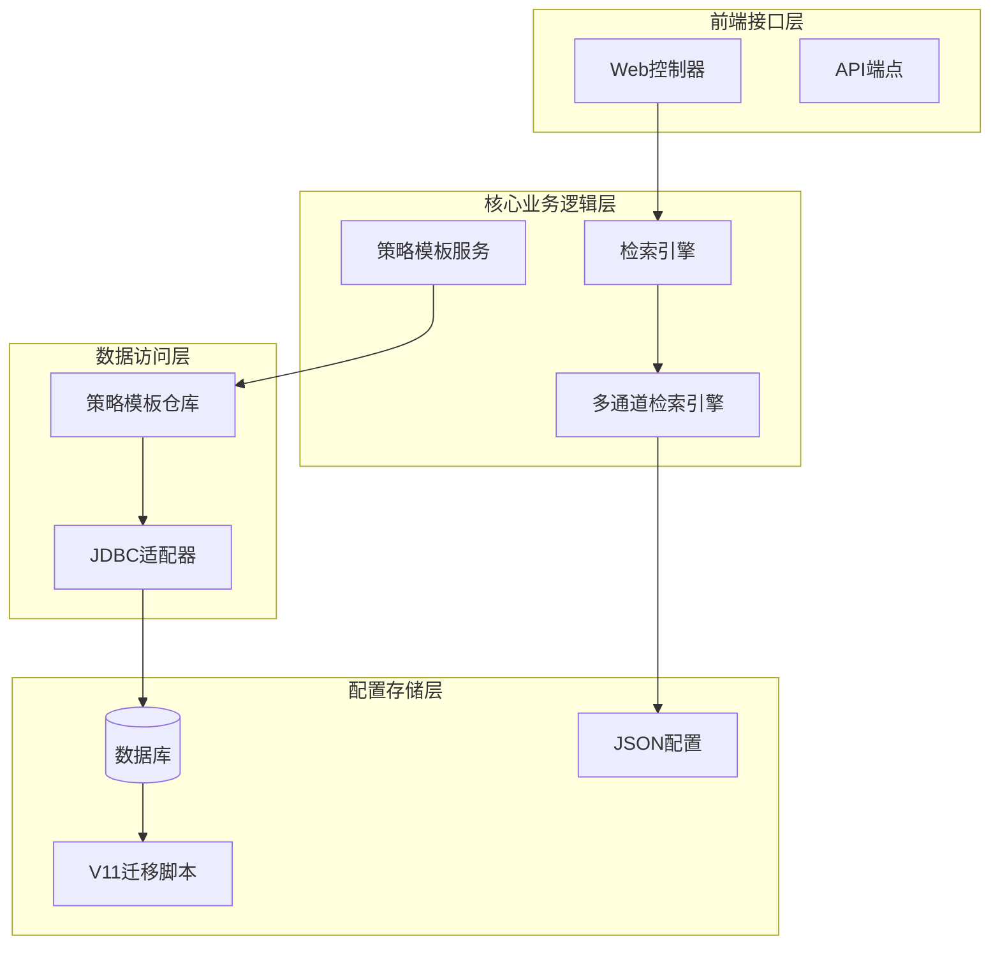
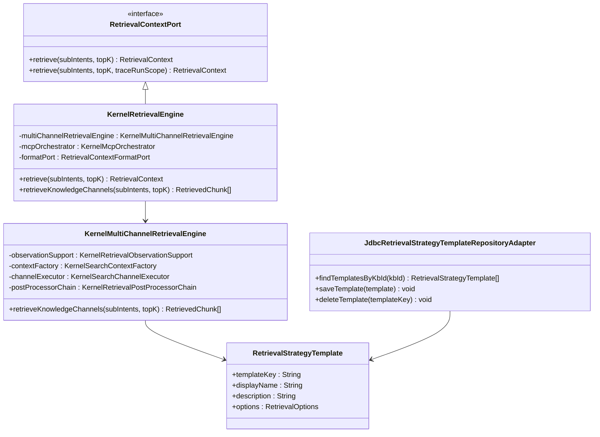
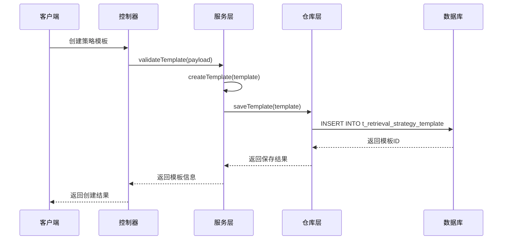
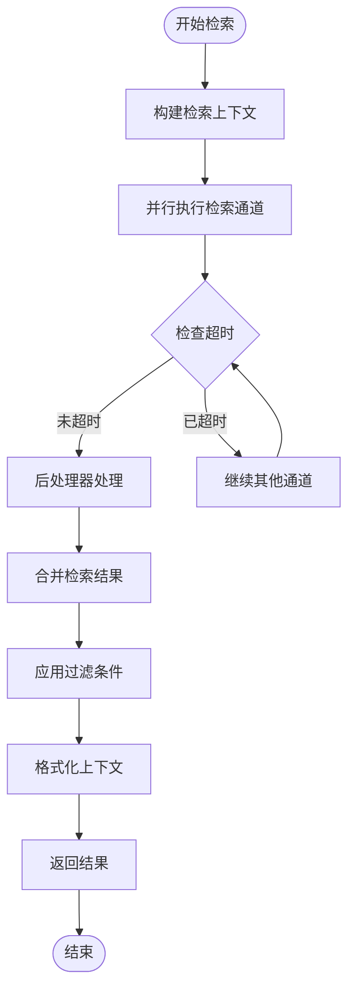
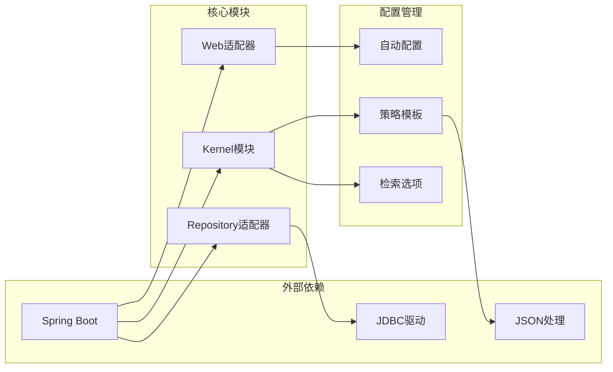

# 知识库检索配置

<cite>
**本文档引用的文件**
- [V11__kb_retrieval_config.sql](file://resources/database/migrations/V11__kb_retrieval_config.sql)
- [KernelRetrievalEngine.java](file://seahorse-agent-kernel/src/main/java/com/miracle/ai/seahorse/agent/kernel/application/retrieval/KernelRetrievalEngine.java)
- [KernelMultiChannelRetrievalEngine.java](file://seahorse-agent-kernel/src/main/java/com/miracle/ai/seahorse/agent/kernel/application/retrieval/KernelMultiChannelRetrievalEngine.java)
- [SeahorseRetrievalEvaluationController.java](file://seahorse-agent-adapter-web/src/main/java/com/miracle/ai/seahorse/agent/adapters/web/SeahorseRetrievalEvaluationController.java)
- [SeahorseAgentKernelRetrievalAutoConfiguration.java](file://seahorse-agent-spring-boot-starter/src/main/java/com/miracle/ai/seahorse/agent/adapters/spring/SeahorseAgentKernelRetrievalAutoConfiguration.java)
- [SearchKnowledgeBaseToolPortAdapter.java](file://seahorse-agent-kernel/src/main/java/com/miracle/ai/seahorse/agent/kernel/application/agent/tool/SearchKnowledgeBaseToolPortAdapter.java)
- [RetrievalStrategyTemplate.java](file://seahorse-agent-kernel/src/main/java/com/miracle/ai/seahorse/agent/ports/inbound/retrieval/RetrievalStrategyTemplate.java)
- [RetrievalStrategyTemplatePayload.java](file://seahorse-agent-kernel/src/main/java/com/miracle/ai/seahorse/agent/ports/inbound/retrieval/RetrievalStrategyTemplatePayload.java)
- [JdbcRetrievalStrategyTemplateRepositoryAdapter.java](file://seahorse-agent-adapter-repository-jdbc/src/main/java/com/miracle/ai/seahorse/agent/adapters/repository/jdbc/JdbcRetrievalStrategyTemplateRepositoryAdapter.java)
- [SystemRetrievalFilter.java](file://seahorse-agent-kernel/src/main/java/com/miracle/ai/seahorse/agent/kernel/domain/retrieval/SystemRetrievalFilter.java)
- [RetrievalFilter.java](file://seahorse-agent-kernel/src/main/java/com/miracle/ai/seahorse/agent/kernel/domain/retrieval/RetrievalFilter.java)
- [RetrievalOptions.java](file://seahorse-agent-kernel/src/main/java/com/miracle/ai/seahorse/agent/kernel/domain/retrieval/RetrievalOptions.java)
</cite>

## 更新摘要
**所做更改**
- 新增数据库迁移V11章节，详细介绍retrieval_config JSONB列的添加
- 更新数据库配置部分，包含V11迁移的具体SQL实现
- 增强检索策略配置的技术细节说明
- 完善知识库表结构的最新状态描述

## 目录
1. [简介](#简介)
2. [项目结构](#项目结构)
3. [核心组件](#核心组件)
4. [架构概览](#架构概览)
5. [详细组件分析](#详细组件分析)
6. [依赖关系分析](#依赖关系分析)
7. [性能考虑](#性能考虑)
8. [故障排除指南](#故障排除指南)
9. [结论](#结论)

## 简介

知识库检索配置是SeaHorse智能体平台的核心功能模块，负责管理知识库的检索策略配置和执行。该系统支持可配置的检索策略，包括Top-K参数、相似度阈值、重排序策略等，为用户提供灵活的知识库检索能力。

系统采用多通道检索架构，支持关键词检索、向量检索等多种检索方式，并提供完整的评估和监控机制。通过数据库迁移脚本V11添加了`retrieval_config`列，用于存储JSON格式的检索配置参数，实现更精细的检索策略控制。

## 项目结构

知识库检索配置涉及多个模块的协作：



**图表来源**
- [KernelRetrievalEngine.java:56-272](file://seahorse-agent-kernel/src/main/java/com/miracle/ai/seahorse/agent/kernel/application/retrieval/KernelRetrievalEngine.java#L56-L272)
- [SeahorseRetrievalEvaluationController.java:34-64](file://seahorse-agent-adapter-web/src/main/java/com/miracle/ai/seahorse/agent/adapters/web/SeahorseRetrievalEvaluationController.java#L34-L64)

**章节来源**
- [KernelRetrievalEngine.java:56-272](file://seahorse-agent-kernel/src/main/java/com/miracle/ai/seahorse/agent/kernel/application/retrieval/KernelRetrievalEngine.java#L56-L272)
- [SeahorseAgentKernelRetrievalAutoConfiguration.java:118-169](file://seahorse-agent-spring-boot-starter/src/main/java/com/miracle/ai/seahorse/agent/adapters/spring/SeahorseAgentKernelRetrievalAutoConfiguration.java#L118-L169)

## 核心组件

### 检索引擎核心类

系统的核心是`KernelRetrievalEngine`类，它实现了`RetrievalContextPort`接口，提供完整的检索功能：

- **多线程处理**：支持并发检索多个子问题
- **上下文合并**：自动合并知识库和MCP上下文
- **错误处理**：优雅降级，确保系统稳定性
- **配置支持**：支持动态检索策略配置

### 多通道检索引擎

`KernelMultiChannelRetrievalEngine`负责管理多个检索通道：

- **通道执行**：并行执行多个检索通道
- **超时控制**：支持通道级超时配置
- **后处理器链**：统一处理检索结果
- **观测记录**：完整的检索过程监控

### 策略模板系统

策略模板系统允许用户定义和管理检索策略：

- **模板定义**：支持命名策略模板
- **选项配置**：灵活的检索选项设置
- **持久化存储**：基于数据库的策略存储
- **版本管理**：支持策略版本控制

**章节来源**
- [KernelRetrievalEngine.java:93-144](file://seahorse-agent-kernel/src/main/java/com/miracle/ai/seahorse/agent/kernel/application/retrieval/KernelRetrievalEngine.java#L93-L144)
- [KernelMultiChannelRetrievalEngine.java:146-202](file://seahorse-agent-kernel/src/main/java/com/miracle/ai/seahorse/agent/kernel/application/retrieval/KernelMultiChannelRetrievalEngine.java#L146-L202)

## 架构概览

知识库检索配置采用分层架构设计，各层职责明确：



**图表来源**
- [KernelRetrievalEngine.java:29-46](file://seahorse-agent-kernel/src/main/java/com/miracle/ai/seahorse/agent/kernel/application/retrieval/KernelRetrievalEngine.java#L29-L46)
- [KernelMultiChannelRetrievalEngine.java:47-144](file://seahorse-agent-kernel/src/main/java/com/miracle/ai/seahorse/agent/kernel/application/retrieval/KernelMultiChannelRetrievalEngine.java#L47-L144)
- [RetrievalStrategyTemplate.java:32-45](file://seahorse-agent-kernel/src/main/java/com/miracle/ai/seahorse/agent/ports/inbound/retrieval/RetrievalStrategyTemplate.java#L32-L45)

## 详细组件分析

### 数据库迁移V11配置

系统通过数据库迁移脚本V11添加了检索配置支持：

```sql
-- V11: Add retrieval_config column to t_knowledge_base for configurable retrieval strategies
-- Supports JSONB storage of retrieval parameters (top-k, threshold, re-ranking config, etc.)

ALTER TABLE t_knowledge_base ADD COLUMN IF NOT EXISTS retrieval_config JSONB;

COMMENT ON COLUMN t_knowledge_base.retrieval_config IS
    '检索策略配置（JSONB），包含 top-k、相似度阈值、重排序策略等参数';
```

这个配置支持存储JSON格式的检索参数，包括：
- **Top-K参数**：控制返回的文档数量
- **相似度阈值**：设置检索相似度的最低标准
- **重排序策略**：定义文档重排序规则
- **通道配置**：控制不同检索通道的启用状态

**更新** 新增V11迁移脚本，为知识库表添加retrieval_config JSONB列，支持可配置的检索策略

**章节来源**
- [V11__kb_retrieval_config.sql:1-7](file://resources/database/migrations/V11__kb_retrieval_config.sql#L1-L7)

### 检索策略模板

策略模板系统提供了灵活的配置管理：



**图表来源**
- [JdbcRetrievalStrategyTemplateRepositoryAdapter.java:146-165](file://seahorse-agent-adapter-repository-jdbc/src/main/java/com/miracle/ai/seahorse/agent/adapters/repository/jdbc/JdbcRetrievalStrategyTemplateRepositoryAdapter.java#L146-L165)

### 检索执行流程

检索执行采用多通道并行处理模式：



**图表来源**
- [KernelMultiChannelRetrievalEngine.java:179-200](file://seahorse-agent-kernel/src/main/java/com/miracle/ai/seahorse/agent/kernel/application/retrieval/KernelMultiChannelRetrievalEngine.java#L179-L200)

### 过滤器系统

系统支持多层次的过滤器配置：

| 过滤器类型 | 描述 | 应用场景 |
|-----------|------|----------|
| 系统过滤器 | 租户、知识库、文档级别的安全过滤 | 基础权限控制 |
| 元数据过滤器 | 基于文档属性的条件过滤 | 内容分类筛选 |
| ACL过滤器 | 基于用户权限的主题过滤 | 细粒度访问控制 |

**章节来源**
- [SystemRetrievalFilter.java:14-42](file://seahorse-agent-kernel/src/main/java/com/miracle/ai/seahorse/agent/kernel/domain/retrieval/SystemRetrievalFilter.java#L14-L42)
- [RetrievalFilter.java:13-31](file://seahorse-agent-kernel/src/main/java/com/miracle/ai/seahorse/agent/kernel/domain/retrieval/RetrievalFilter.java#L13-L31)

## 依赖关系分析

系统采用松耦合的设计，各组件间通过接口进行交互：



**图表来源**
- [SeahorseAgentKernelRetrievalAutoConfiguration.java:118-169](file://seahorse-agent-spring-boot-starter/src/main/java/com/miracle/ai/seahorse/agent/adapters/spring/SeahorseAgentKernelRetrievalAutoConfiguration.java#L118-L169)

**章节来源**
- [SeahorseAgentKernelRetrievalAutoConfiguration.java:150-189](file://seahorse-agent-spring-boot-starter/src/main/java/com/miracle/ai/seahorse/agent/adapters/spring/SeahorseAgentKernelRetrievalAutoConfiguration.java#L150-L189)

## 性能考虑

### 并行处理优化

系统通过以下机制优化检索性能：

- **线程池管理**：可配置的检索线程池
- **通道超时控制**：防止慢查询影响整体性能
- **结果缓存**：重复查询的结果缓存机制
- **资源限制**：最大批量操作和删除比率控制

### 监控和观测

完整的观测系统提供性能监控：

- **检索事件记录**：详细的检索过程跟踪
- **性能指标收集**：延迟、命中率等关键指标
- **异常监控**：通道失败和超时的监控
- **使用统计**：策略模板的使用情况统计

## 故障排除指南

### 常见问题诊断

| 问题类型 | 症状 | 可能原因 | 解决方案 |
|----------|------|----------|----------|
| 检索超时 | 检索响应时间过长 | 通道超时设置过短 | 调整超时参数或优化通道性能 |
| 结果为空 | 检索无匹配文档 | 过滤条件过于严格 | 放宽过滤条件或调整相似度阈值 |
| 系统错误 | 检索过程中出现异常 | 数据库连接问题 | 检查数据库连接和权限 |
| 性能下降 | 检索速度明显变慢 | 索引问题或资源不足 | 重建索引或增加系统资源 |

### 调试建议

1. **启用详细日志**：查看检索过程的详细日志输出
2. **监控性能指标**：关注延迟和命中率的变化
3. **检查配置**：验证检索策略配置的正确性
4. **测试通道**：单独测试各个检索通道的性能

**章节来源**
- [KernelMultiChannelRetrievalEngine.java:54-56](file://seahorse-agent-kernel/src/main/java/com/miracle/ai/seahorse/agent/kernel/application/retrieval/KernelMultiChannelRetrievalEngine.java#L54-L56)

## 结论

知识库检索配置系统提供了完整、灵活且高性能的检索解决方案。通过多通道架构、策略模板管理和完善的监控机制，系统能够满足各种复杂的检索需求。

主要优势包括：
- **灵活性**：支持多种检索策略和配置选项
- **可扩展性**：模块化设计便于功能扩展
- **可观测性**：完整的监控和调试能力
- **稳定性**：优雅的错误处理和降级机制

该系统为SeaHorse智能体平台提供了强大的知识库检索能力，支持企业级的应用场景和高并发的访问需求。

**更新** 新增V11数据库迁移支持，通过retrieval_config JSONB列实现更精细的检索策略配置，为系统的可配置性和扩展性提供了重要基础。