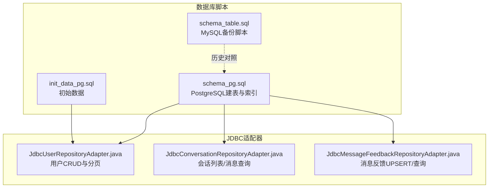
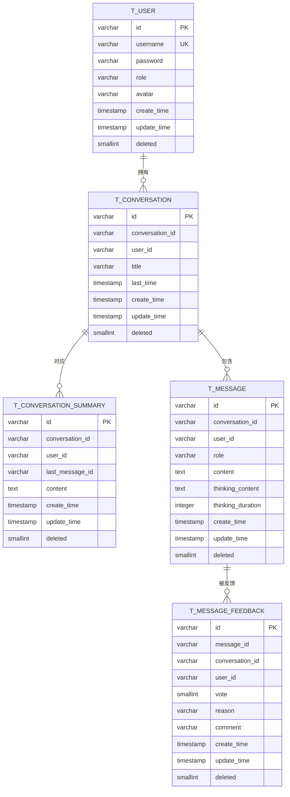
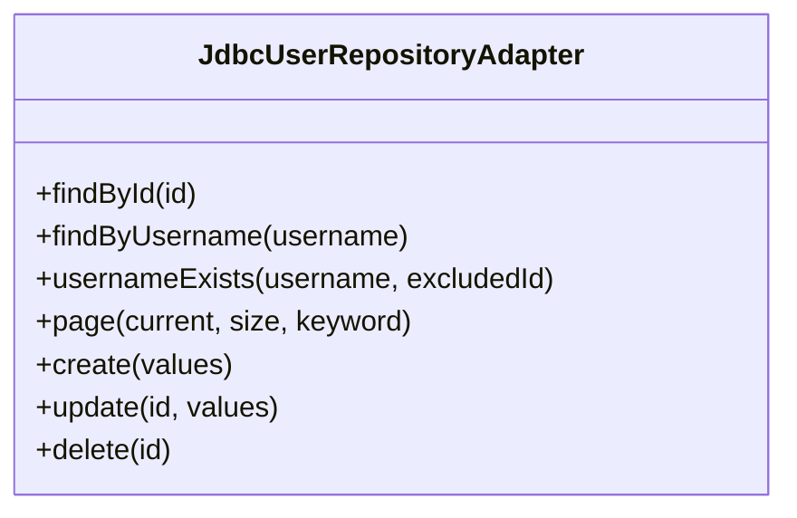
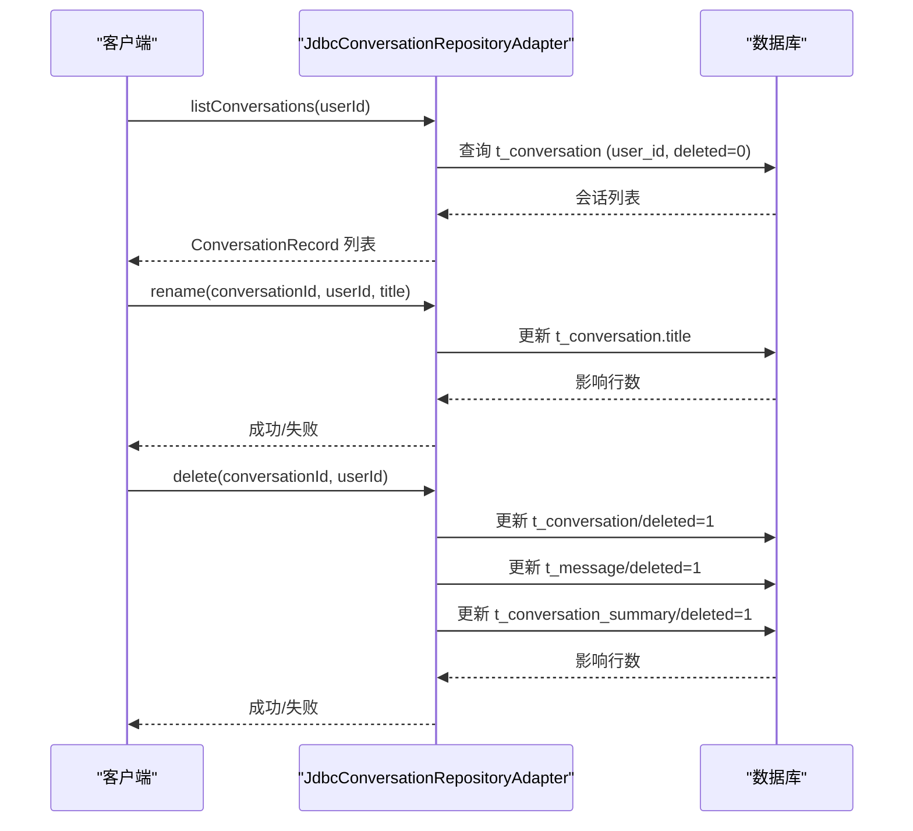
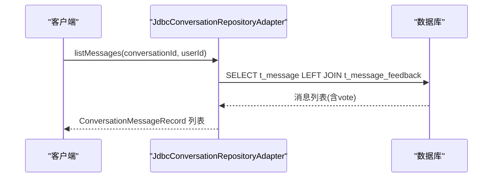
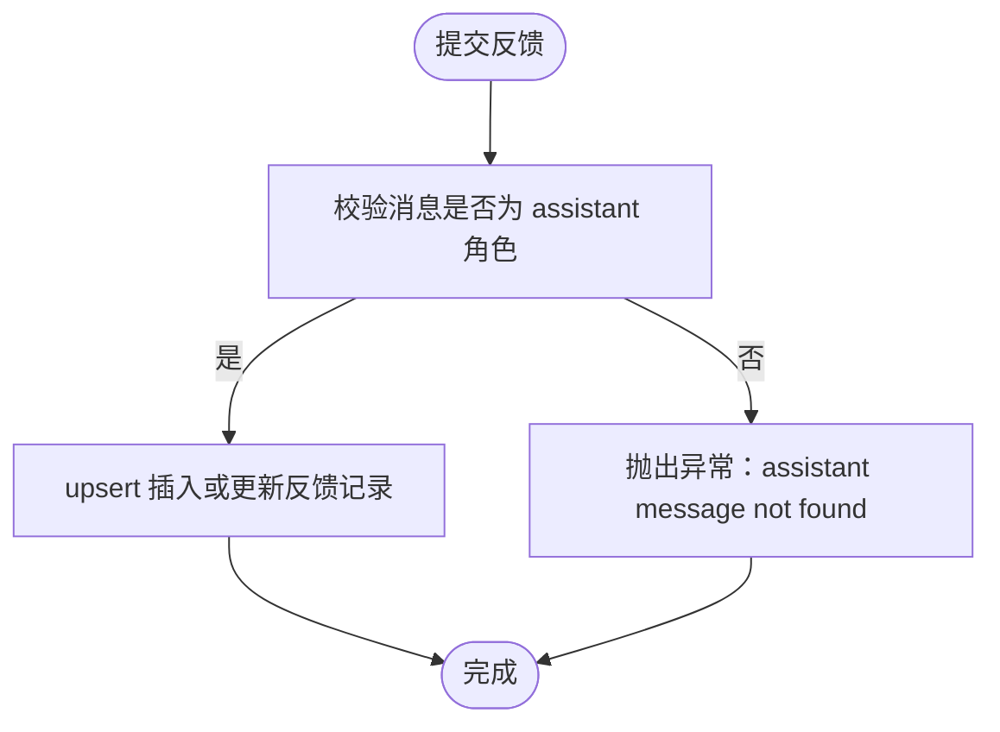
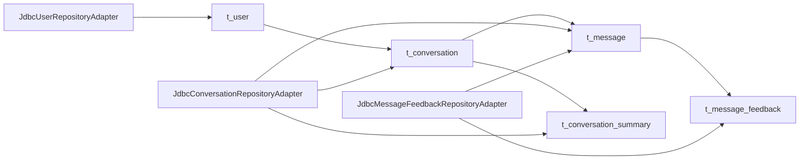

# 用户与会话表

<cite>
**本文档引用的文件**
- [schema_pg.sql](file://resources/database/schema_pg.sql)
- [init_data_pg.sql](file://resources/database/init_data_pg.sql)
- [schema_table.sql](file://resources/database/backups/schema_table.sql)
- [JdbcUserRepositoryAdapter.java](file://seahorse-agent-adapter-repository-jdbc/src/main/java/com/miracle/ai/seahorse/agent/adapters/repository/jdbc/JdbcUserRepositoryAdapter.java)
- [JdbcConversationRepositoryAdapter.java](file://seahorse-agent-adapter-repository-jdbc/src/main/java/com/miracle/ai/seahorse/agent/adapters/repository/jdbc/JdbcConversationRepositoryAdapter.java)
- [JdbcMessageFeedbackRepositoryAdapter.java](file://seahorse-agent-adapter-repository-jdbc/src/main/java/com/miracle/ai/seahorse/agent/adapters/repository/jdbc/JdbcMessageFeedbackRepositoryAdapter.java)
- [JdbcMessageFeedbackRepositoryAdapterTests.java](file://seahorse-agent-adapter-repository-jdbc/src/test/java/com/miracle/ai/seahorse/agent/adapters/repository/jdbc/JdbcMessageFeedbackRepositoryAdapterTests.java)
- [JdbcConversationRepositoryAdapterTests.java](file://seahorse-agent-adapter-repository-jdbc/src/test/java/com/miracle/ai/seahorse/agent/adapters/repository/jdbc/JdbcConversationRepositoryAdapterTests.java)
</cite>

## 目录
1. [简介](#简介)
2. [项目结构](#项目结构)
3. [核心组件](#核心组件)
4. [架构概览](#架构概览)
5. [详细组件分析](#详细组件分析)
6. [依赖分析](#依赖分析)
7. [性能考量](#性能考量)
8. [故障排查指南](#故障排查指南)
9. [结论](#结论)
10. [附录](#附录)

## 简介
本文件聚焦于用户与会话相关的核心数据表设计与实现，涵盖以下关键表：
- t_user：用户表，包含用户标识、认证凭据与角色信息
- t_conversation：会话表，维护用户会话列表与最近消息时间
- t_conversation_summary：会话摘要表，与消息表分离存储以提升读写性能
- t_message：消息表，记录对话消息、思考内容与时间指标
- t_message_feedback：消息反馈表，支持用户对助手消息的点赞/踩反馈

文档将深入解析各表的字段定义、索引策略、外键约束关系、关联查询优化方案、数据一致性设计原则，并结合实际代码实现展示典型工作流。

## 项目结构
围绕用户与会话表的相关文件主要分布在数据库脚本与JDBC适配器层：
- 数据库脚本：PostgreSQL建表语句与注释，包含索引与列注释
- 初始化数据：默认管理员账户初始化
- 备份脚本：MySQL版本的建表语句，便于理解历史演进
- JDBC适配器：用户、会话、消息反馈的持久化实现

**图表来源**
- [schema_pg.sql:11-98](file://resources/database/schema_pg.sql#L11-L98)
- [init_data_pg.sql:1-5](file://resources/database/init_data_pg.sql#L1-L5)
- [schema_table.sql:1-200](file://resources/database/backups/schema_table.sql#L1-L200)
- [JdbcUserRepositoryAdapter.java:39-205](file://seahorse-agent-adapter-repository-jdbc/src/main/java/com/miracle/ai/seahorse/agent/adapters/repository/jdbc/JdbcUserRepositoryAdapter.java#L39-L205)
- [JdbcConversationRepositoryAdapter.java:36-143](file://seahorse-agent-adapter-repository-jdbc/src/main/java/com/miracle/ai/seahorse/agent/adapters/repository/jdbc/JdbcConversationRepositoryAdapter.java#L36-L143)
- [JdbcMessageFeedbackRepositoryAdapter.java:37-168](file://seahorse-agent-adapter-repository-jdbc/src/main/java/com/miracle/ai/seahorse/agent/adapters/repository/jdbc/JdbcMessageFeedbackRepositoryAdapter.java#L37-L168)

**章节来源**
- [schema_pg.sql:1-850](file://resources/database/schema_pg.sql#L1-L850)
- [init_data_pg.sql:1-5](file://resources/database/init_data_pg.sql#L1-L5)
- [schema_table.sql:1-402](file://resources/database/backups/schema_table.sql#L1-L402)

## 核心组件
本节概述用户与会话相关表的设计要点与职责边界：
- t_user：用户身份与权限载体，采用软删除标记，提供按用户名唯一性约束
- t_conversation：会话列表，通过用户+会话组合唯一约束确保多用户隔离；索引支持按用户与最近消息时间排序
- t_conversation_summary：会话摘要，独立存储以降低消息表写放大；索引加速会话维度查询
- t_message：消息明细，支持思考内容与耗时指标；为消息维度建立复合索引以优化查询
- t_message_feedback：反馈记录，基于消息+用户唯一约束，确保单用户对单消息仅一次反馈

**章节来源**
- [schema_pg.sql:11-98](file://resources/database/schema_pg.sql#L11-L98)

## 架构概览
下图展示了用户、会话、消息与反馈之间的关系与典型查询路径：

**图表来源**
- [schema_pg.sql:11-98](file://resources/database/schema_pg.sql#L11-L98)

## 详细组件分析

### 用户表 t_user 设计与实现
- 字段定义与约束
  - 主键：VARCHAR(20)，作为业务主键
  - 唯一约束：username
  - 软删除：deleted 小整型，默认0
  - 时间戳：create_time/update_time 默认当前时间
- 典型操作
  - 按ID/用户名查询
  - 用户名存在性校验（支持排除自身）
  - 分页查询（keyword过滤、按更新时间倒序）
  - 创建/更新/软删除
- 安全与一致性
  - 密码字段未在建表中暴露具体长度限制，实际应用需配合后端加密策略
  - 软删除统一逻辑，避免物理删除造成关联数据不一致

**图表来源**
- [JdbcUserRepositoryAdapter.java:39-205](file://seahorse-agent-adapter-repository-jdbc/src/main/java/com/miracle/ai/seahorse/agent/adapters/repository/jdbc/JdbcUserRepositoryAdapter.java#L39-L205)

**章节来源**
- [schema_pg.sql:11-31](file://resources/database/schema_pg.sql#L11-L31)
- [JdbcUserRepositoryAdapter.java:39-205](file://seahorse-agent-adapter-repository-jdbc/src/main/java/com/miracle/ai/seahorse/agent/adapters/repository/jdbc/JdbcUserRepositoryAdapter.java#L39-L205)

### 会话表 t_conversation 设计与实现
- 字段定义与约束
  - 主键：VARCHAR(20)
  - 组合唯一：(conversation_id, user_id)，确保同一用户下会话ID唯一
  - 索引：(user_id, last_time) 支持按用户与最近消息时间排序
  - 软删除：deleted
- 典型操作
  - 列出用户会话（按最近消息时间降序）
  - 重命名会话
  - 删除会话（同时软删除消息与摘要）

**图表来源**
- [JdbcConversationRepositoryAdapter.java:36-143](file://seahorse-agent-adapter-repository-jdbc/src/main/java/com/miracle/ai/seahorse/agent/adapters/repository/jdbc/JdbcConversationRepositoryAdapter.java#L36-L143)

**章节来源**
- [schema_pg.sql:32-52](file://resources/database/schema_pg.sql#L32-L52)
- [JdbcConversationRepositoryAdapter.java:36-143](file://seahorse-agent-adapter-repository-jdbc/src/main/java/com/miracle/ai/seahorse/agent/adapters/repository/jdbc/JdbcConversationRepositoryAdapter.java#L36-L143)

### 会话摘要表 t_conversation_summary 设计与实现
- 字段定义与约束
  - 主键：VARCHAR(20)
  - 索引：(conversation_id, user_id)，加速会话维度查询
  - 软删除：deleted
- 设计理念
  - 将摘要与消息分离，减少消息写入对摘要查询的影响，提升整体吞吐

**章节来源**
- [schema_pg.sql:54-65](file://resources/database/schema_pg.sql#L54-L65)

### 消息表 t_message 设计与实现
- 字段定义与索引
  - 主键：VARCHAR(20)
  - 复合索引：(conversation_id, user_id, create_time)，支持按会话+用户+时间排序
  - 角色字段：role=user/assistant，用于区分消息来源
  - 思考内容与耗时：thinking_content/thinking_duration
  - 软删除：deleted
- 关联查询
  - 会话消息列表查询时，LEFT JOIN t_message_feedback 获取用户对该消息的投票

**图表来源**
- [JdbcConversationRepositoryAdapter.java:64-72](file://seahorse-agent-adapter-repository-jdbc/src/main/java/com/miracle/ai/seahorse/agent/adapters/repository/jdbc/JdbcConversationRepositoryAdapter.java#L64-L72)

**章节来源**
- [schema_pg.sql:67-81](file://resources/database/schema_pg.sql#L67-L81)
- [JdbcConversationRepositoryAdapter.java:64-72](file://seahorse-agent-adapter-repository-jdbc/src/main/java/com/miracle/ai/seahorse/agent/adapters/repository/jdbc/JdbcConversationRepositoryAdapter.java#L64-L72)

### 消息反馈表 t_message_feedback 设计与实现
- 字段定义与约束
  - 主键：VARCHAR(20)
  - 唯一约束：(message_id, user_id)，确保单用户对单消息仅一次反馈
  - 索引：(conversation_id)、(user_id)，支持按会话与用户查询
  - 投票值：vote=1/-1，reason/comment 提供反馈原因与补充说明
- 业务规则
  - 仅允许对 assistant 角色消息进行反馈
  - upsert 操作自动插入或更新，保持唯一性
  - 查询支持批量获取用户对多个消息的投票

**图表来源**
- [JdbcMessageFeedbackRepositoryAdapter.java:75-84](file://seahorse-agent-adapter-repository-jdbc/src/main/java/com/miracle/ai/seahorse/agent/adapters/repository/jdbc/JdbcMessageFeedbackRepositoryAdapter.java#L75-L84)

**章节来源**
- [schema_pg.sql:83-98](file://resources/database/schema_pg.sql#L83-L98)
- [JdbcMessageFeedbackRepositoryAdapter.java:37-168](file://seahorse-agent-adapter-repository-jdbc/src/main/java/com/miracle/ai/seahorse/agent/adapters/repository/jdbc/JdbcMessageFeedbackRepositoryAdapter.java#L37-L168)
- [JdbcMessageFeedbackRepositoryAdapterTests.java:29-89](file://seahorse-agent-adapter-repository-jdbc/src/test/java/com/miracle/ai/seahorse/agent/adapters/repository/jdbc/JdbcMessageFeedbackRepositoryAdapterTests.java#L29-L89)

## 依赖分析
- 表间依赖
  - t_message 依赖 t_conversation（conversation_id/user_id），用于会话维度查询
  - t_message_feedback 依赖 t_message（message_id），并通过 (conversation_id, user_id) 建立查询索引
- 适配器依赖
  - JdbcUserRepositoryAdapter 依赖 t_user
  - JdbcConversationRepositoryAdapter 依赖 t_conversation、t_message、t_conversation_summary
  - JdbcMessageFeedbackRepositoryAdapter 依赖 t_message、t_message_feedback

**图表来源**
- [schema_pg.sql:11-98](file://resources/database/schema_pg.sql#L11-L98)
- [JdbcUserRepositoryAdapter.java:39-205](file://seahorse-agent-adapter-repository-jdbc/src/main/java/com/miracle/ai/seahorse/agent/adapters/repository/jdbc/JdbcUserRepositoryAdapter.java#L39-L205)
- [JdbcConversationRepositoryAdapter.java:36-143](file://seahorse-agent-adapter-repository-jdbc/src/main/java/com/miracle/ai/seahorse/agent/adapters/repository/jdbc/JdbcConversationRepositoryAdapter.java#L36-L143)
- [JdbcMessageFeedbackRepositoryAdapter.java:37-168](file://seahorse-agent-adapter-repository-jdbc/src/main/java/com/miracle/ai/seahorse/agent/adapters/repository/jdbc/JdbcMessageFeedbackRepositoryAdapter.java#L37-L168)

**章节来源**
- [schema_pg.sql:11-98](file://resources/database/schema_pg.sql#L11-L98)
- [JdbcUserRepositoryAdapter.java:39-205](file://seahorse-agent-adapter-repository-jdbc/src/main/java/com/miracle/ai/seahorse/agent/adapters/repository/jdbc/JdbcUserRepositoryAdapter.java#L39-L205)
- [JdbcConversationRepositoryAdapter.java:36-143](file://seahorse-agent-adapter-repository-jdbc/src/main/java/com/miracle/ai/seahorse/agent/adapters/repository/jdbc/JdbcConversationRepositoryAdapter.java#L36-L143)
- [JdbcMessageFeedbackRepositoryAdapter.java:37-168](file://seahorse-agent-adapter-repository-jdbc/src/main/java/com/miracle/ai/seahorse/agent/adapters/repository/jdbc/JdbcMessageFeedbackRepositoryAdapter.java#L37-L168)

## 性能考量
- 索引策略
  - t_conversation：(user_id, last_time) 支持按用户快速定位最近会话
  - t_conversation_summary：(conversation_id, user_id) 加速摘要查询
  - t_message：(conversation_id, user_id, create_time) 支持消息按时间有序查询
  - t_message_feedback：(conversation_id)、(user_id) 支持按会话与用户维度查询
- 软删除与查询
  - 所有表均使用 deleted 字段进行软删除，查询时需添加 deleted=0 条件，避免扫描已删除记录
- 写入与读取分离
  - t_conversation_summary 与 t_message 分离，降低消息写入对摘要查询的干扰
- JSONB 类型使用
  - 在知识库与向量存储等模块中广泛使用 JSONB 存储元数据与配置，便于灵活扩展与高效查询（见其他表定义）

**章节来源**
- [schema_pg.sql:43-98](file://resources/database/schema_pg.sql#L43-L98)

## 故障排查指南
- 反馈异常
  - 对非 assistant 消息提交反馈会触发异常，提示“assistant message not found”
  - 排查步骤：确认消息角色为 assistant，且消息属于当前用户与会话
- 会话删除副作用
  - 删除会话会同时软删除该会话下的消息与摘要，确认预期行为后再执行
- 用户名冲突
  - 使用 usernameExists 排除特定用户ID后再校验唯一性，避免误判

**章节来源**
- [JdbcMessageFeedbackRepositoryAdapter.java:106-114](file://seahorse-agent-adapter-repository-jdbc/src/main/java/com/miracle/ai/seahorse/agent/adapters/repository/jdbc/JdbcMessageFeedbackRepositoryAdapter.java#L106-L114)
- [JdbcConversationRepositoryAdapter.java:97-107](file://seahorse-agent-adapter-repository-jdbc/src/main/java/com/miracle/ai/seahorse/agent/adapters/repository/jdbc/JdbcConversationRepositoryAdapter.java#L97-L107)
- [JdbcUserRepositoryAdapter.java:78-91](file://seahorse-agent-adapter-repository-jdbc/src/main/java/com/miracle/ai/seahorse/agent/adapters/repository/jdbc/JdbcUserRepositoryAdapter.java#L78-L91)

## 结论
本文档系统梳理了用户与会话相关表的设计理念与实现细节，强调了：
- 以软删除保障数据一致性与审计需求
- 通过索引与查询优化提升高频场景性能
- 通过表分离与角色约束实现清晰的业务边界
- 借助测试用例验证关键流程（如反馈校验、会话删除）

这些设计为后续功能扩展与性能优化提供了坚实基础。

## 附录
- 建表语句分析
  - 用户表：主键、唯一用户名、软删除、时间戳
  - 会话表：组合唯一、索引、软删除
  - 摘要表：独立存储、索引
  - 消息表：角色字段、思考指标、复合索引
  - 反馈表：唯一约束、索引、投票值
- 最佳实践建议
  - 查询时始终包含 deleted=0 条件
  - 对高频查询字段建立合适索引，避免全表扫描
  - 使用软删除替代物理删除，保留审计线索
  - 对 JSONB 字段使用 GIN/HNSW 等索引类型以提升查询效率（参考向量存储表）

**章节来源**
- [schema_pg.sql:11-98](file://resources/database/schema_pg.sql#L11-L98)
- [init_data_pg.sql:1-5](file://resources/database/init_data_pg.sql#L1-L5)
- [schema_table.sql:1-200](file://resources/database/backups/schema_table.sql#L1-L200)