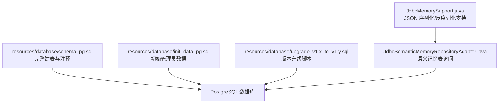
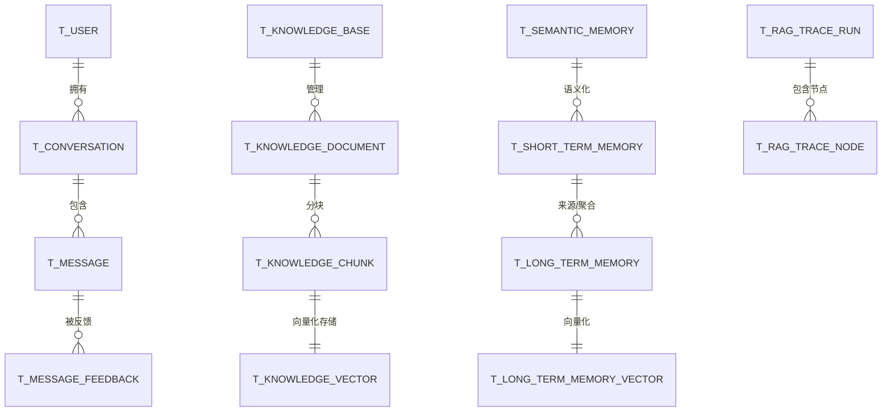
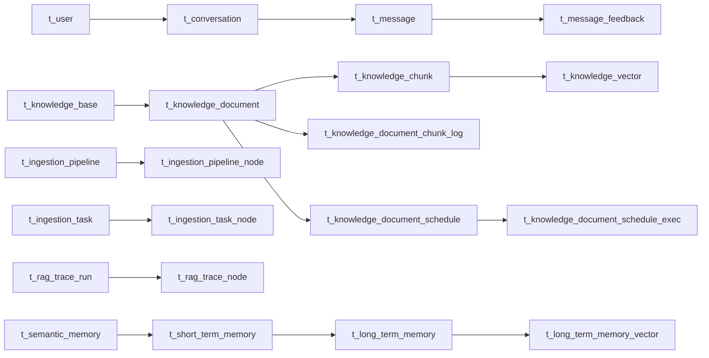

# 表结构设计

<cite>
**本文引用的文件**
- [schema_pg.sql](file://resources/database/schema_pg.sql)
- [init_data_pg.sql](file://resources/database/init_data_pg.sql)
- [upgrade_v1.0_to_v1.1.sql](file://resources/database/upgrade_v1.0_to_v1.1.sql)
- [upgrade_v1.1_to_v1.2.sql](file://resources/database/upgrade_v1.1_to_v1.2.sql)
- [upgrade_v1.2_to_v1.3.sql](file://resources/database/upgrade_v1.2_to_v1.3.sql)
- [JdbcSemanticMemoryRepositoryAdapter.java](file://seahorse-agent-adapter-repository-jdbc/src/main/java/com/miracle/ai/seahorse/agent/adapters/repository/jdbc/JdbcSemanticMemoryRepositoryAdapter.java)
- [JdbcMemorySupport.java](file://seahorse-agent-adapter-repository-jdbc/src/main/java/com/miracle/ai/seahorse/agent/adapters/repository/jdbc/JdbcMemorySupport.java)
</cite>

## 目录
1. [简介](#简介)
2. [项目结构](#项目结构)
3. [核心组件](#核心组件)
4. [架构总览](#架构总览)
5. [详细组件分析](#详细组件分析)
6. [依赖分析](#依赖分析)
7. [性能考量](#性能考量)
8. [故障排查指南](#故障排查指南)
9. [结论](#结论)
10. [附录](#附录)

## 简介
本文件面向 Seahorse Agent 的 PostgreSQL 数据库表结构设计，围绕用户、会话与消息、知识库与文档分块、向量存储、内存与追踪等核心业务域进行系统化梳理。重点阐述：
- 各表字段定义、数据类型选择、约束与索引策略
- 表间关系设计与一致性保障
- JSONB 字段的使用场景与优势
- 版本演进与扩展性设计
- 实际 SQL 建表语句分析与最佳实践建议

## 项目结构
数据库相关资源集中于 resources/database 目录，包含：
- schema_pg.sql：完整建表与注释脚本
- init_data_pg.sql：初始化管理员用户数据
- upgrade_v1.x_to_v1.y.sql：版本升级脚本，体现演进与兼容
- 后端 JDBC 适配器中对部分表（如语义记忆表）的访问逻辑，用于印证表结构与查询模式

图表来源
- [schema_pg.sql:1-850](file://resources/database/schema_pg.sql#L1-L850)
- [init_data_pg.sql:1-5](file://resources/database/init_data_pg.sql#L1-L5)
- [upgrade_v1.0_to_v1.1.sql:1-9](file://resources/database/upgrade_v1.0_to_v1.1.sql#L1-L9)
- [upgrade_v1.1_to_v1.2.sql:1-6](file://resources/database/upgrade_v1.1_to_v1.2.sql#L1-L6)
- [upgrade_v1.2_to_v1.3.sql:1-115](file://resources/database/upgrade_v1.2_to_v1.3.sql#L1-L115)
- [JdbcSemanticMemoryRepositoryAdapter.java:35-147](file://seahorse-agent-adapter-repository-jdbc/src/main/java/com/miracle/ai/seahorse/agent/adapters/repository/jdbc/JdbcSemanticMemoryRepositoryAdapter.java#L35-L147)
- [JdbcMemorySupport.java:33-71](file://seahorse-agent-adapter-repository-jdbc/src/main/java/com/miracle/ai/seahorse/agent/adapters/repository/jdbc/JdbcMemorySupport.java#L33-L71)

章节来源
- [schema_pg.sql:1-850](file://resources/database/schema_pg.sql#L1-L850)
- [init_data_pg.sql:1-5](file://resources/database/init_data_pg.sql#L1-L5)
- [upgrade_v1.0_to_v1.1.sql:1-9](file://resources/database/upgrade_v1.0_to_v1.1.sql#L1-L9)
- [upgrade_v1.1_to_v1.2.sql:1-6](file://resources/database/upgrade_v1.1_to_v1.2.sql#L1-L6)
- [upgrade_v1.2_to_v1.3.sql:1-115](file://resources/database/upgrade_v1.2_to_v1.3.sql#L1-L115)

## 核心组件
本节按业务域划分核心表，并给出字段、类型、约束与索引概览。

- 用户与会话域
  - t_user：用户基本信息与角色管理
  - t_conversation：会话列表，含用户维度唯一约束
  - t_conversation_summary：会话摘要，与消息表分离存储
  - t_message：消息明细，含思考内容与时长字段
  - t_message_feedback：消息反馈，含投票与评论
  - t_sample_question：示例问题

- 知识库与文档域
  - t_knowledge_base：知识库元信息与集合名唯一
  - t_knowledge_document：文档元数据、处理状态、定时刷新配置
  - t_knowledge_chunk：文档分块，含统计与启用标志
  - t_knowledge_document_chunk_log：分块处理日志，拆分耗时字段
  - t_knowledge_document_schedule：定时刷新任务调度
  - t_knowledge_document_schedule_exec：调度执行记录

- 检索意图与查询映射域
  - t_intent_node：意图树节点，含提示词模板与 MCP 工具绑定
  - t_query_term_mapping：关键词归一化映射

- RAG 追踪域
  - t_rag_trace_run：Trace 运行记录
  - t_rag_trace_node：Trace 节点记录

- 摄取流水线域
  - t_ingestion_pipeline：流水线定义
  - t_ingestion_pipeline_node：节点定义与顺序
  - t_ingestion_task：任务实例
  - t_ingestion_task_node：任务节点执行

- 向量存储域
  - t_knowledge_vector：分块向量存储，含元数据 JSONB 与向量索引

- 内存域（v1.3 引入）
  - t_outbox_event：事件出站队列
  - t_short_term_memory：短期记忆，含 JSONB 元数据与衰减评分
  - t_long_term_memory：长期记忆，含标签 JSONB 与重要度评分
  - t_semantic_memory：语义记忆，唯一约束与 JSONB 值
  - t_memory_conflict_log：冲突日志
  - t_memory_quality_snapshot：质量快照
  - t_long_term_memory_vector：长期记忆向量索引

章节来源
- [schema_pg.sql:11-850](file://resources/database/schema_pg.sql#L11-L850)

## 架构总览
下图展示核心表之间的关系与典型查询路径（用户-会话-消息、知识库-文档-分块、向量存储、内存与追踪）：

图表来源
- [schema_pg.sql:11-850](file://resources/database/schema_pg.sql#L11-L850)

## 详细组件分析

### 用户表 t_user
- 设计要点
  - 主键采用短 ID 字符串，用户名唯一，角色字段限定值域
  - 软删除通过 deleted 字段实现
- 关键索引
  - 唯一索引：username
- 复杂度与性能
  - 登录与鉴权查询以 username 为主，唯一索引可确保 O(log n) 查找
- 扩展性
  - 可预留角色扩展枚举；软删除便于审计与恢复

章节来源
- [schema_pg.sql:11-31](file://resources/database/schema_pg.sql#L11-L31)

### 会话表 t_conversation
- 设计要点
  - 会话 ID + 用户 ID 组合唯一，避免跨用户会话冲突
  - 最近消息时间用于排序与筛选
- 关键索引
  - 复合索引：(user_id, last_time)
- 复杂度与性能
  - 列表查询按用户过滤并按时间倒序，复合索引可显著提升性能

章节来源
- [schema_pg.sql:32-52](file://resources/database/schema_pg.sql#L32-L52)

### 会话摘要表 t_conversation_summary
- 设计要点
  - 将摘要与消息明细分离，降低消息大字段对会话列表查询的影响
  - 记录最后消息 ID，便于快速定位
- 关键索引
  - 复合索引：(conversation_id, user_id)

章节来源
- [schema_pg.sql:54-65](file://resources/database/schema_pg.sql#L54-L65)

### 消息表 t_message
- 设计要点
  - 角色字段区分用户与助手；支持“深度思考”内容与时长
  - 三列复合索引支持会话内按时间排序的高效查询
- 关键索引
  - 复合索引：(conversation_id, user_id, create_time)
- 版本演进
  - v1.2 新增 thinking_content 与 thinking_duration 字段

章节来源
- [schema_pg.sql:67-81](file://resources/database/schema_pg.sql#L67-L81)
- [upgrade_v1.1_to_v1.2.sql:4-5](file://resources/database/upgrade_v1.1_to_v1.2.sql#L4-L5)

### 消息反馈表 t_message_feedback
- 设计要点
  - 基于 (message_id, user_id) 唯一，防止重复投票
  - 提供原因与评论字段，便于治理与审计
- 关键索引
  - (conversation_id)、(user_id) 辅助查询

章节来源
- [schema_pg.sql:83-98](file://resources/database/schema_pg.sql#L83-L98)

### 示例问题表 t_sample_question
- 设计要点
  - 展示标题、描述与问题内容，配合 deleted 字段软删除
- 关键索引
  - (deleted) 用于快速筛选有效问题

章节来源
- [schema_pg.sql:100-110](file://resources/database/schema_pg.sql#L100-L110)

### 知识库表 t_knowledge_base
- 设计要点
  - 集合名唯一，确保向量存储命名一致性
  - 记录创建/更新人，便于溯源
- 关键索引
  - (name) 用于名称检索

章节来源
- [schema_pg.sql:116-129](file://resources/database/schema_pg.sql#L116-L129)

### 文档表 t_knowledge_document
- 设计要点
  - 文件类型、大小、来源类型与位置、处理模式与策略、管道 ID
  - 定时刷新开关与 Cron 表达式，chunk_config 使用 JSONB 存储策略配置
- 关键索引
  - (kb_id) 用于按知识库过滤
- 复杂度与性能
  - JSONB 字段支持灵活配置，结合 Gin 索引可加速查询

章节来源
- [schema_pg.sql:131-156](file://resources/database/schema_pg.sql#L131-L156)

### 分块表 t_knowledge_chunk
- 设计要点
  - 分块序号、内容、统计信息（字符数、Token 数）、启用标志
  - 内容哈希用于去重与变更检测
- 关键索引
  - (doc_id) 用于按文档过滤

章节来源
- [schema_pg.sql:158-175](file://resources/database/schema_pg.sql#L158-L175)

### 分块日志表 t_knowledge_document_chunk_log
- 设计要点
  - 拆分处理阶段耗时字段，修正语义与可读性
  - 包含错误信息与时间窗口
- 版本演进
  - v1.0->v1.1：embedding_duration 改为 embed_duration，并新增 persist_duration

章节来源
- [schema_pg.sql:177-197](file://resources/database/schema_pg.sql#L177-L197)
- [upgrade_v1.0_to_v1.1.sql:4-8](file://resources/database/upgrade_v1.0_to_v1.1.sql#L4-L8)

### 文档调度表 t_knowledge_document_schedule
- 设计要点
  - Cron 表达式、运行状态、锁机制（锁持有者与过期时间）
  - 用于控制增量刷新与并发安全
- 关键索引
  - (next_run_time)、(lock_until) 用于调度器高效扫描

章节来源
- [schema_pg.sql:199-221](file://resources/database/schema_pg.sql#L199-L221)

### 调度执行记录表 t_knowledge_document_schedule_exec
- 设计要点
  - 记录每次执行的文件信息、内容哈希、ETag、时间戳与结果
- 关键索引
  - (schedule_id, start_time)、(doc_id) 用于回溯与按文档查询

章节来源
- [schema_pg.sql:223-242](file://resources/database/schema_pg.sql#L223-L242)

### 意图节点表 t_intent_node
- 设计要点
  - 意图树结构（层级、父子关系）、提示词模板、MCP 工具绑定、排序与启用标志
  - 可与知识库集合名关联，支持检索 TopK

章节来源
- [schema_pg.sql:248-272](file://resources/database/schema_pg.sql#L248-L272)

### 查询词映射表 t_query_term_mapping
- 设计要点
  - 领域、源词与目标词、匹配类型与优先级、启用标志
- 关键索引
  - (domain)、(source_term) 用于快速归一化

章节来源
- [schema_pg.sql:274-291](file://resources/database/schema_pg.sql#L274-L291)

### RAG Trace 运行表 t_rag_trace_run
- 设计要点
  - 全局链路 ID、入口方法、会话/任务/用户关联、状态与耗时、扩展数据
- 关键索引
  - (task_id)、(user_id) 用于任务与用户维度查询

章节来源
- [schema_pg.sql:293-314](file://resources/database/schema_pg.sql#L293-L314)

### RAG Trace 节点表 t_rag_trace_node
- 设计要点
  - 节点类型、类名/方法名、状态与耗时、额外数据

章节来源
- [schema_pg.sql:316-337](file://resources/database/schema_pg.sql#L316-L337)

### 摄取流水线表 t_ingestion_pipeline
- 设计要点
  - 流水线名称唯一（结合 deleted），描述与人员信息

章节来源
- [schema_pg.sql:343-354](file://resources/database/schema_pg.sql#L343-L354)

### 摄取流水线节点表 t_ingestion_pipeline_node
- 设计要点
  - 节点类型、顺序、设置与条件 JSONB，唯一约束保证同一流水线内节点唯一

章节来源
- [schema_pg.sql:356-372](file://resources/database/schema_pg.sql#L356-L372)

### 摄取任务表 t_ingestion_task
- 设计要点
  - 来源类型与位置、状态、分块数量、日志与元数据 JSONB、时间窗口
- 关键索引
  - (pipeline_id)、(status) 用于任务监控与调度

章节来源
- [schema_pg.sql:374-395](file://resources/database/schema_pg.sql#L374-L395)

### 摄取任务节点表 t_ingestion_task_node
- 设计要点
  - 节点顺序、状态、耗时、输出 JSON 与时间戳

章节来源
- [schema_pg.sql:397-416](file://resources/database/schema_pg.sql#L397-L416)

### 向量存储表 t_knowledge_vector
- 设计要点
  - 分块 ID、内容、元数据 JSONB、向量 embedding
  - 元数据 Gin 索引与向量 HNSW 索引，支持相似度检索
- 性能
  - 向量索引基于余弦距离，适合大规模相似检索

章节来源
- [schema_pg.sql:422-431](file://resources/database/schema_pg.sql#L422-L431)

### 内存域（v1.3 引入）
- 出站事件表 t_outbox_event
  - JSONB 负载、重试控制、状态扫描索引
- 短期记忆表 t_short_term_memory
  - JSONB 元数据与来源消息 ID，衰减评分与过期时间
  - GIN 索引加速元数据查询
- 长期记忆表 t_long_term_memory
  - 标签 JSONB、重要度与置信度评分
- 语义记忆表 t_semantic_memory
  - 唯一约束 (user_id, semantic_key, semantic_type)，JSONB 值
- 冲突日志表 t_memory_conflict_log
  - 冲突类型、严重级别、解决状态与时间
- 质量快照表 t_memory_quality_snapshot
  - JSONB 快照与用户时间索引
- 长期记忆向量表 t_long_term_memory_vector
  - HNSW 向量索引

章节来源
- [upgrade_v1.2_to_v1.3.sql:4-115](file://resources/database/upgrade_v1.2_to_v1.3.sql#L4-L115)
- [schema_pg.sql:800-850](file://resources/database/schema_pg.sql#L800-L850)

## 依赖分析
- 外键关系
  - 会话与消息：t_conversation.id → t_message.conversation_id
  - 会话与摘要：t_conversation.id → t_conversation_summary.conversation_id
  - 文档与分块：t_knowledge_document.id → t_knowledge_chunk.doc_id
  - 文档与日志/调度：t_knowledge_document.id → t_knowledge_document_chunk_log.doc_id、t_knowledge_document_schedule.doc_id
  - 任务与节点：t_ingestion_task.id → t_ingestion_task_node.task_id
  - 知识库与文档/分块：t_knowledge_base.id → t_knowledge_document.kb_id、t_knowledge_chunk.kb_id
  - 向量存储：t_knowledge_chunk.id → t_knowledge_vector.id
  - 内存：t_user.id → 各记忆表 user_id
  - 追踪：t_rag_trace_run.id → t_rag_trace_node.trace_id
- 关联查询优化
  - 复合索引覆盖常见过滤与排序组合
  - JSONB 字段配合 Gin/HNSW 索引提升检索效率
- 数据一致性
  - 软删除统一字段 deleted，避免物理删除影响历史审计
  - 唯一约束（如 collection_name、(conversation_id,user_id)、(message_id,user_id)、uk_semantic_memory）保障业务唯一性

图表来源
- [schema_pg.sql:11-850](file://resources/database/schema_pg.sql#L11-L850)

## 性能考量
- 索引策略
  - 复合索引：(user_id, last_time)、(conversation_id, user_id, create_time)、(user_id, conversation_id, create_time DESC) 等，覆盖高频查询
  - Gin 索引：t_knowledge_document.chunk_config、t_short_term_memory.metadata_json、t_long_term_memory.tags、t_semantic_memory.value_json
  - 向量索引：hnsw + vector_cosine_ops，支持大规模相似检索
- JSONB 使用
  - 配置与日志类数据采用 JSONB，灵活性高；通过 Gin 索引与条件过滤提升查询效率
- 时间字段
  - 使用高精度时间戳（含毫秒）记录 Trace 节点，便于性能分析
- 软删除
  - 通过 deleted 字段与条件过滤，避免全表扫描，同时保留审计线索

[本节为通用性能讨论，不直接分析具体文件]

## 故障排查指南
- 常见问题与定位
  - 会话列表为空：检查 t_conversation 的 (user_id, last_time) 索引与查询条件
  - 消息查询慢：确认是否命中 (conversation_id, user_id, create_time) 复合索引
  - 向量检索异常：检查向量维度与索引构建是否一致
  - JSONB 查询无结果：确认 Gin 索引是否存在以及查询谓词是否可利用索引
- 版本升级注意事项
  - v1.0->v1.1：embed_duration 与 persist_duration 字段差异，需核对日志统计
  - v1.1->v1.2：新增 thinking_content 与 thinking_duration，旧数据默认为 NULL
  - v1.2->v1.3：新增内存域表，需重建相应索引
- 数据一致性
  - 软删除数据仍占用空间，定期清理或归档策略需结合业务需求

章节来源
- [upgrade_v1.0_to_v1.1.sql:4-8](file://resources/database/upgrade_v1.0_to_v1.1.sql#L4-L8)
- [upgrade_v1.1_to_v1.2.sql:4-5](file://resources/database/upgrade_v1.1_to_v1.2.sql#L4-L5)
- [upgrade_v1.2_to_v1.3.sql:4-115](file://resources/database/upgrade_v1.2_to_v1.3.sql#L4-L115)

## 结论
该数据库设计在以下方面表现突出：
- 明确的业务域划分与清晰的表间关系
- 面向查询的复合索引与 Gin/HNSW 索引策略
- JSONB 的灵活使用与配套索引
- 版本演进脚本体现良好的兼容性与可维护性
- 软删除与唯一约束保障数据一致性与审计能力

建议在生产环境中持续关注：
- 向量索引的维护与重建策略
- JSONB 字段的查询模式与索引覆盖
- 定时刷新与任务调度的可观测性与告警

[本节为总结性内容，不直接分析具体文件]

## 附录

### 建表语句与注释分析
- 建表脚本集中于 schema_pg.sql，包含：
  - 用户与会话相关表（t_user、t_conversation、t_conversation_summary、t_message、t_message_feedback、t_sample_question）
  - 知识库与文档相关表（t_knowledge_base、t_knowledge_document、t_knowledge_chunk、t_knowledge_document_chunk_log、t_knowledge_document_schedule、t_knowledge_document_schedule_exec）
  - 检索意图与查询映射（t_intent_node、t_query_term_mapping）
  - RAG 追踪（t_rag_trace_run、t_rag_trace_node）
  - 摄取流水线（t_ingestion_pipeline、t_ingestion_pipeline_node、t_ingestion_task、t_ingestion_task_node）
  - 向量存储（t_knowledge_vector）
  - 内存域（v1.3 引入，t_outbox_event、t_short_term_memory、t_long_term_memory、t_semantic_memory、t_memory_conflict_log、t_memory_quality_snapshot、t_long_term_memory_vector）

章节来源
- [schema_pg.sql:1-850](file://resources/database/schema_pg.sql#L1-L850)

### 版本升级与兼容性
- v1.0->v1.1：分块日志计时字段拆分，修正语义
- v1.1->v1.2：消息表新增“深度思考”字段
- v1.2->v1.3：引入 Pulsar Outbox 与四层 Memory 表

章节来源
- [upgrade_v1.0_to_v1.1.sql:1-9](file://resources/database/upgrade_v1.0_to_v1.1.sql#L1-L9)
- [upgrade_v1.1_to_v1.2.sql:1-6](file://resources/database/upgrade_v1.1_to_v1.2.sql#L1-L6)
- [upgrade_v1.2_to_v1.3.sql:1-115](file://resources/database/upgrade_v1.2_to_v1.3.sql#L1-L115)

### 初始化数据
- 插入管理员用户，便于系统初始化与测试

章节来源
- [init_data_pg.sql:3-4](file://resources/database/init_data_pg.sql#L3-L4)

### JSONB 使用与最佳实践
- 语义记忆表 t_semantic_memory 的 value_json 字段由后端适配器负责序列化/反序列化，查询时通过 Gin 索引与条件过滤提升性能
- 短期/长期记忆表的 metadata_json 与 tags 字段同样采用 Gin 索引

章节来源
- [JdbcSemanticMemoryRepositoryAdapter.java:118-135](file://seahorse-agent-adapter-repository-jdbc/src/main/java/com/miracle/ai/seahorse/agent/adapters/repository/jdbc/JdbcSemanticMemoryRepositoryAdapter.java#L118-L135)
- [JdbcMemorySupport.java:52-69](file://seahorse-agent-adapter-repository-jdbc/src/main/java/com/miracle/ai/seahorse/agent/adapters/repository/jdbc/JdbcMemorySupport.java#L52-L69)