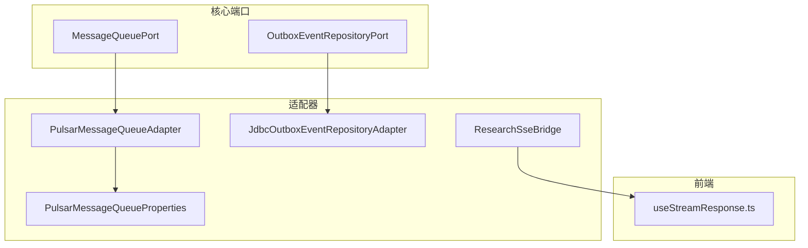
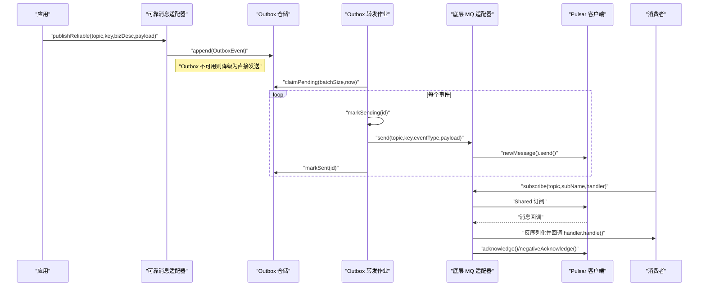
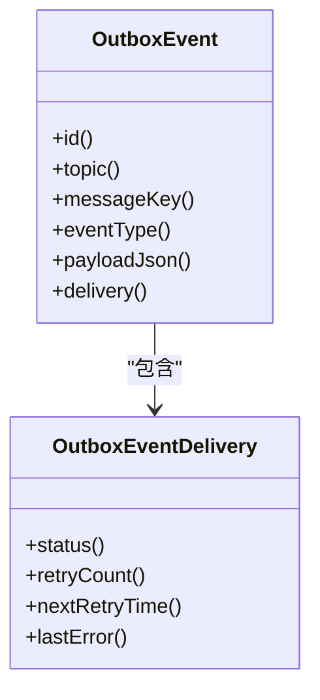
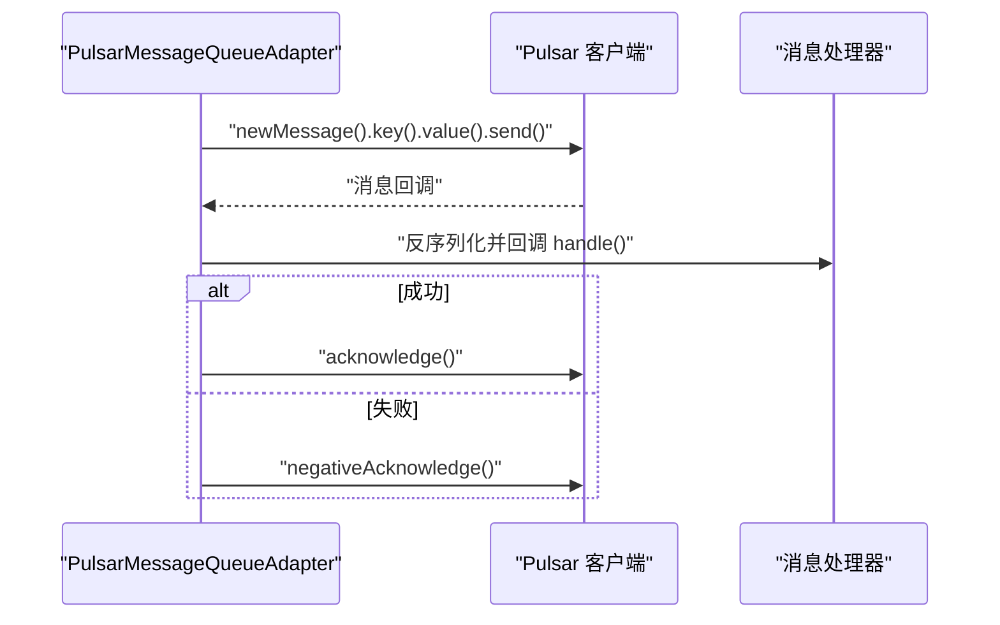
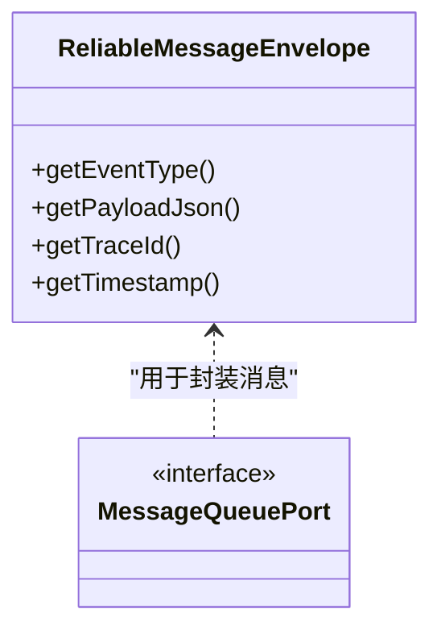
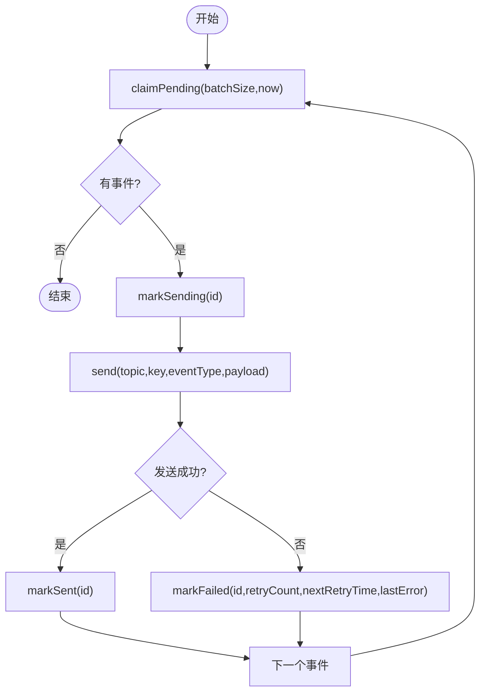
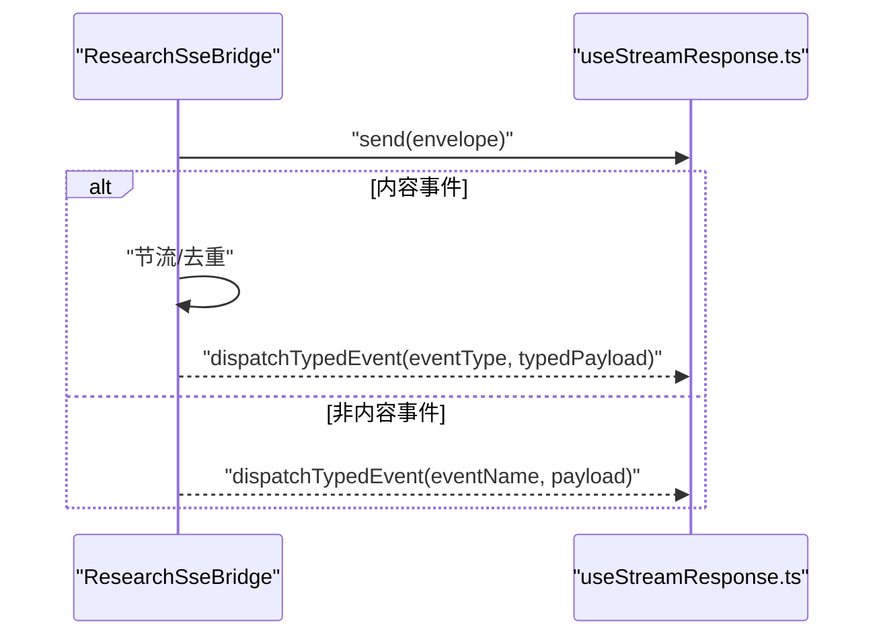
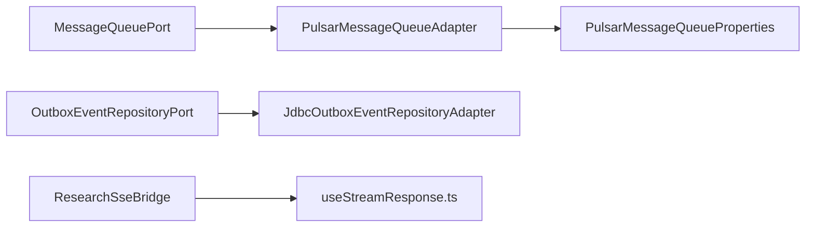

# 事件驱动架构

<cite>
**本文引用的文件**
- [PulsarMessageQueueAdapter.java](file://seahorse-agent-adapter-mq-pulsar/src/main/java/com/miracle/ai/seahorse/agent/adapters/mq/pulsar/PulsarMessageQueueAdapter.java)
- [PulsarMessageQueueProperties.java](file://seahorse-agent-adapter-mq-pulsar/src/main/java/com/miracle/ai/seahorse/agent/adapters/mq/pulsar/PulsarMessageQueueProperties.java)
- [OutboxEvent.java](file://seahorse-agent-kernel/src/main/java/com/miracle/ai/seahorse/agent/ports/outbound/mq/OutboxEvent.java)
- [OutboxEventRepositoryPort.java](file://seahorse-agent-kernel/src/main/java/com/miracle/ai/seahorse/agent/ports/outbound/mq/OutboxEventRepositoryPort.java)
- [JdbcOutboxEventRepositoryAdapter.java](file://seahorse-agent-adapter-repository-jdbc/src/main/java/com/miracle/ai/seahorse/agent/adapters/repository/jdbc/JdbcOutboxEventRepositoryAdapter.java)
- [ReliableMessageEnvelope.java](file://seahorse-agent-kernel/src/main/java/com/miracle/ai/seahorse/agent/ports/outbound/mq/ReliableMessageEnvelope.java)
- [MessageQueuePort.java](file://seahorse-agent-kernel/src/main/java/com/miracle/ai/seahorse/agent/ports/outbound/mq/MessageQueuePort.java)
- [JdbcAgentRunEventBufferAdapter.java](file://seahorse-agent-adapter-repository-jdbc/src/main/java/com/miracle/ai/seahorse/agent/adapters/repository/jdbc/JdbcAgentRunEventBufferAdapter.java)
- [ResearchSseBridge.java](file://seahorse-agent-adapter-web/src/main/java/com/miracle/ai/seahorse/agent/adapters/web/ResearchSseBridge.java)
- [useStreamResponse.ts](file://frontend/src/hooks/useStreamResponse.ts)
- [消息队列适配器.md](file://docs/zh/content/后端系统/适配器模块/消息队列适配器.md)
</cite>

## 目录
1. [引言](#引言)
2. [项目结构](#项目结构)
3. [核心组件](#核心组件)
4. [架构总览](#架构总览)
5. [详细组件分析](#详细组件分析)
6. [依赖关系分析](#依赖关系分析)
7. [性能考量](#性能考量)
8. [故障排查指南](#故障排查指南)
9. [结论](#结论)
10. [附录](#附录)

## 引言
本文件系统性阐述 Seahorse Agent 的事件驱动架构，重点覆盖以下方面：
- 基于消息队列的异步处理模式：事件的产生、传播与消费机制
- Outbox 模式实现：如何确保事件的一致性与可靠传递
- Pulsar 消息队列的选择原因与配置策略（分区、副本、持久化）
- 事件序列化与反序列化机制及事件格式标准
- 事件驱动架构如何支撑水平扩展与高可用
- 事件流图、消息传递流程图与错误处理策略
- 事件监听器开发指南与最佳实践

## 项目结构
围绕事件驱动架构的关键模块与文件如下：
- 适配器层（消息队列与存储）
  - Pulsar 消息队列适配器与属性配置
  - JDBC Outbox 仓储适配器
  - SSE/Web 事件桥接与前端事件处理
- 核心端口与领域模型
  - Outbox 事件与交付状态模型
  - 可靠消息封装体与消息队列端口
- 文档与规范
  - 消息队列适配器文档中的架构总览与序列图

图表来源
- [MessageQueuePort.java](file://seahorse-agent-kernel/src/main/java/com/miracle/ai/seahorse/agent/ports/outbound/mq/MessageQueuePort.java)
- [OutboxEventRepositoryPort.java](file://seahorse-agent-kernel/src/main/java/com/miracle/ai/seahorse/agent/ports/outbound/mq/OutboxEventRepositoryPort.java)
- [PulsarMessageQueueAdapter.java](file://seahorse-agent-adapter-mq-pulsar/src/main/java/com/miracle/ai/seahorse/agent/adapters/mq/pulsar/PulsarMessageQueueAdapter.java)
- [PulsarMessageQueueProperties.java](file://seahorse-agent-adapter-mq-pulsar/src/main/java/com/miracle/ai/seahorse/agent/adapters/mq/pulsar/PulsarMessageQueueProperties.java)
- [JdbcOutboxEventRepositoryAdapter.java](file://seahorse-agent-adapter-repository-jdbc/src/main/java/com/miracle/ai/seahorse/agent/adapters/repository/jdbc/JdbcOutboxEventRepositoryAdapter.java)
- [ResearchSseBridge.java](file://seahorse-agent-adapter-web/src/main/java/com/miracle/ai/seahorse/agent/adapters/web/ResearchSseBridge.java)
- [useStreamResponse.ts](file://frontend/src/hooks/useStreamResponse.ts)

章节来源
- [MessageQueuePort.java](file://seahorse-agent-kernel/src/main/java/com/miracle/ai/seahorse/agent/ports/outbound/mq/MessageQueuePort.java)
- [OutboxEventRepositoryPort.java](file://seahorse-agent-kernel/src/main/java/com/miracle/ai/seahorse/agent/ports/outbound/mq/OutboxEventRepositoryPort.java)
- [PulsarMessageQueueAdapter.java](file://seahorse-agent-adapter-mq-pulsar/src/main/java/com/miracle/ai/seahorse/agent/adapters/mq/pulsar/PulsarMessageQueueAdapter.java)
- [PulsarMessageQueueProperties.java](file://seahorse-agent-adapter-mq-pulsar/src/main/java/com/miracle/ai/seahorse/agent/adapters/mq/pulsar/PulsarMessageQueueProperties.java)
- [JdbcOutboxEventRepositoryAdapter.java](file://seahorse-agent-adapter-repository-jdbc/src/main/java/com/miracle/ai/seahorse/agent/adapters/repository/jdbc/JdbcOutboxEventRepositoryAdapter.java)
- [ResearchSseBridge.java](file://seahorse-agent-adapter-web/src/main/java/com/miracle/ai/seahorse/agent/adapters/web/ResearchSseBridge.java)
- [useStreamResponse.ts](file://frontend/src/hooks/useStreamResponse.ts)

## 核心组件
- Outbox 事件模型：统一表达可靠发布所需的核心字段，不含具体 MQ/数据库绑定
- Outbox 仓储端口：抽象事件的追加、认领、发送中、已发送、失败标记等生命周期操作
- Pulsar 消息队列适配器：实现消息发送、订阅与确认/负确认
- 可靠消息封装体：承载事件类型、负载 JSON、追踪 ID、时间戳等
- SSE/Web 桥接：将后端事件以流式方式推送到前端，前端去重与分发

章节来源
- [OutboxEvent.java](file://seahorse-agent-kernel/src/main/java/com/miracle/ai/seahorse/agent/ports/outbound/mq/OutboxEvent.java)
- [OutboxEventRepositoryPort.java](file://seahorse-agent-kernel/src/main/java/com/miracle/ai/seahorse/agent/ports/outbound/mq/OutboxEventRepositoryPort.java)
- [PulsarMessageQueueAdapter.java](file://seahorse-agent-adapter-mq-pulsar/src/main/java/com/miracle/ai/seahorse/agent/adapters/mq/pulsar/PulsarMessageQueueAdapter.java)
- [ReliableMessageEnvelope.java](file://seahorse-agent-kernel/src/main/java/com/miracle/ai/seahorse/agent/ports/outbound/mq/ReliableMessageEnvelope.java)
- [ResearchSseBridge.java](file://seahorse-agent-adapter-web/src/main/java/com/miracle/ai/seahorse/agent/adapters/web/ResearchSseBridge.java)

## 架构总览
事件驱动的整体流程由“应用 → 可靠消息适配器 → Outbox → 转发作业 → 底层 MQ → 消费者”构成，支持降级与重试、ACK/NACK 与延迟重试。

图表来源
- [消息队列适配器.md](file://docs/zh/content/后端系统/适配器模块/消息队列适配器.md)

## 详细组件分析

### Outbox 模式与事件生命周期
- 事件模型：包含标识、主题、消息键、事件类型、负载 JSON 与交付状态
- 交付状态：包含状态、重试次数、下次重试时间、最后错误
- 仓储接口：追加、认领待处理、标记发送中、标记已发送、标记失败（含重试计数与下次重试时间）

图表来源
- [OutboxEvent.java](file://seahorse-agent-kernel/src/main/java/com/miracle/ai/seahorse/agent/ports/outbound/mq/OutboxEvent.java)

章节来源
- [OutboxEvent.java](file://seahorse-agent-kernel/src/main/java/com/miracle/ai/seahorse/agent/ports/outbound/mq/OutboxEvent.java)
- [OutboxEventRepositoryPort.java](file://seahorse-agent-kernel/src/main/java/com/miracle/ai/seahorse/agent/ports/outbound/mq/OutboxEventRepositoryPort.java)

### Pulsar 消息队列适配器
- 发送：将事件封装为消息并调用 Pulsar 客户端发送
- 订阅：基于共享订阅接收消息，反序列化后回调处理器
- 确认：成功处理后 acknowledge，失败或异常时 negativeAcknowledge，配合 Outbox 失败推进与延迟重试

图表来源
- [PulsarMessageQueueAdapter.java](file://seahorse-agent-adapter-mq-pulsar/src/main/java/com/miracle/ai/seahorse/agent/adapters/mq/pulsar/PulsarMessageQueueAdapter.java)

章节来源
- [PulsarMessageQueueAdapter.java](file://seahorse-agent-adapter-mq-pulsar/src/main/java/com/miracle/ai/seahorse/agent/adapters/mq/pulsar/PulsarMessageQueueAdapter.java)
- [PulsarMessageQueueProperties.java](file://seahorse-agent-adapter-mq-pulsar/src/main/java/com/miracle/ai/seahorse/agent/adapters/mq/pulsar/PulsarMessageQueueProperties.java)

### 可靠消息封装体与消息队列端口
- 可靠消息封装体：统一承载事件类型、负载 JSON、追踪 ID、时间戳等
- 消息队列端口：定义 publish/subscribe 等契约，适配器实现具体 MQ

图表来源
- [ReliableMessageEnvelope.java](file://seahorse-agent-kernel/src/main/java/com/miracle/ai/seahorse/agent/ports/outbound/mq/ReliableMessageEnvelope.java)
- [MessageQueuePort.java](file://seahorse-agent-kernel/src/main/java/com/miracle/ai/seahorse/agent/ports/outbound/mq/MessageQueuePort.java)

章节来源
- [ReliableMessageEnvelope.java](file://seahorse-agent-kernel/src/main/java/com/miracle/ai/seahorse/agent/ports/outbound/mq/ReliableMessageEnvelope.java)
- [MessageQueuePort.java](file://seahorse-agent-kernel/src/main/java/com/miracle/ai/seahorse/agent/ports/outbound/mq/MessageQueuePort.java)

### Outbox 转发作业与 JDBC 仓储
- 认领待处理：按批次从 Outbox 中挑选 NEW 状态事件
- 发送中与已发送：在发送前后更新状态，保证幂等与一致性
- 失败推进：记录重试次数、下次重试时间与最后错误，支持延迟重试

图表来源
- [JdbcOutboxEventRepositoryAdapter.java](file://seahorse-agent-adapter-repository-jdbc/src/main/java/com/miracle/ai/seahorse/agent/adapters/repository/jdbc/JdbcOutboxEventRepositoryAdapter.java)

章节来源
- [JdbcOutboxEventRepositoryAdapter.java](file://seahorse-agent-adapter-repository-jdbc/src/main/java/com/miracle/ai/seahorse/agent/adapters/repository/jdbc/JdbcOutboxEventRepositoryAdapter.java)

### 前端事件流与去重
- SSE 桥接：对内容类事件进行节流与去重，非内容事件立即透传
- 前端钩子：识别流式事件与重复事件，派发到对应处理器

图表来源
- [ResearchSseBridge.java](file://seahorse-agent-adapter-web/src/main/java/com/miracle/ai/seahorse/agent/adapters/web/ResearchSseBridge.java)
- [useStreamResponse.ts](file://frontend/src/hooks/useStreamResponse.ts)

章节来源
- [ResearchSseBridge.java](file://seahorse-agent-adapter-web/src/main/java/com/miracle/ai/seahorse/agent/adapters/web/ResearchSseBridge.java)
- [useStreamResponse.ts](file://frontend/src/hooks/useStreamResponse.ts)

## 依赖关系分析
- 适配器依赖核心端口：消息队列适配器实现 MessageQueuePort；Outbox 适配器实现 OutboxEventRepositoryPort
- Outbox 与转发作业：JDBC 适配器负责持久化与状态管理，作业负责周期性拉取与发送
- 前后端：SSE 桥接与前端事件钩子形成事件推送链路

图表来源
- [MessageQueuePort.java](file://seahorse-agent-kernel/src/main/java/com/miracle/ai/seahorse/agent/ports/outbound/mq/MessageQueuePort.java)
- [OutboxEventRepositoryPort.java](file://seahorse-agent-kernel/src/main/java/com/miracle/ai/seahorse/agent/ports/outbound/mq/OutboxEventRepositoryPort.java)
- [PulsarMessageQueueAdapter.java](file://seahorse-agent-adapter-mq-pulsar/src/main/java/com/miracle/ai/seahorse/agent/adapters/mq/pulsar/PulsarMessageQueueAdapter.java)
- [PulsarMessageQueueProperties.java](file://seahorse-agent-adapter-mq-pulsar/src/main/java/com/miracle/ai/seahorse/agent/adapters/mq/pulsar/PulsarMessageQueueProperties.java)
- [JdbcOutboxEventRepositoryAdapter.java](file://seahorse-agent-adapter-repository-jdbc/src/main/java/com/miracle/ai/seahorse/agent/adapters/repository/jdbc/JdbcOutboxEventRepositoryAdapter.java)
- [ResearchSseBridge.java](file://seahorse-agent-adapter-web/src/main/java/com/miracle/ai/seahorse/agent/adapters/web/ResearchSseBridge.java)
- [useStreamResponse.ts](file://frontend/src/hooks/useStreamResponse.ts)

## 性能考量
- 批量处理：转发作业按批次认领与发送，降低数据库与 MQ 的压力
- 节流与去重：前端对内容事件进行节流与去重，减少重复渲染与网络抖动
- 幂等与重试：Outbox 状态机与延迟重试保障最终一致性，避免重复处理
- 水平扩展：Pulsar 共享订阅与多实例消费者可横向扩展吞吐

## 故障排查指南
- Outbox 状态异常
  - 症状：事件长期停留在 NEW/SENDING
  - 排查：检查转发作业是否运行、数据库连接与事务隔离级别
  - 参考：标记发送中/已发送/失败的方法与状态转换
- MQ 发送失败
  - 症状：消息未送达或消费者未收到
  - 排查：检查 Pulsar 连接参数、主题权限、分区与副本配置
  - 参考：适配器的发送与确认/负确认流程
- 前端事件重复或丢失
  - 症状：界面闪烁或事件不完整
  - 排查：检查节流阈值、去重键生成逻辑、事件类型过滤
  - 参考：SSE 桥接与前端钩子的去重与派发逻辑

章节来源
- [JdbcOutboxEventRepositoryAdapter.java](file://seahorse-agent-adapter-repository-jdbc/src/main/java/com/miracle/ai/seahorse/agent/adapters/repository/jdbc/JdbcOutboxEventRepositoryAdapter.java)
- [PulsarMessageQueueAdapter.java](file://seahorse-agent-adapter-mq-pulsar/src/main/java/com/miracle/ai/seahorse/agent/adapters/mq/pulsar/PulsarMessageQueueAdapter.java)
- [ResearchSseBridge.java](file://seahorse-agent-adapter-web/src/main/java/com/miracle/ai/seahorse/agent/adapters/web/ResearchSseBridge.java)
- [useStreamResponse.ts](file://frontend/src/hooks/useStreamResponse.ts)

## 结论
Seahorse Agent 的事件驱动架构通过 Outbox 模式与 Pulsar 消息队列实现了高可靠、可扩展的消息传递体系。核心端口与适配器解耦，便于替换与扩展；前端 SSE 桥接与去重机制提升了用户体验。结合批量处理、延迟重试与共享订阅，系统具备良好的水平扩展与高可用能力。

## 附录

### 事件序列化与格式标准
- 负载编码：统一采用 JSON 字符串承载事件负载
- 时间字段：建议以毫秒时间戳表示，便于跨语言解析
- 事件类型：字符串枚举，建议前缀化命名以避免冲突
- 追踪 ID：建议沿用请求链路追踪 ID，便于问题定位

章节来源
- [ReliableMessageEnvelope.java](file://seahorse-agent-kernel/src/main/java/com/miracle/ai/seahorse/agent/ports/outbound/mq/ReliableMessageEnvelope.java)
- [JdbcAgentRunEventBufferAdapter.java](file://seahorse-agent-adapter-repository-jdbc/src/main/java/com/miracle/ai/seahorse/agent/adapters/repository/jdbc/JdbcAgentRunEventBufferAdapter.java)

### Pulsar 选择与配置要点
- 选择原因
  - 支持共享订阅与多租户隔离
  - 高吞吐、低延迟与强一致性的事务消息
  - 丰富的分区与副本策略，满足高可用与扩展需求
- 配置策略（示例维度）
  - 分区：根据峰值吞吐与并发消费者数量确定
  - 副本：至少 3 副本以容忍节点故障
  - 持久化：开启磁盘落盘与压缩，平衡性能与成本
  - 命名空间与租户：按业务域划分，限制资源与权限

章节来源
- [PulsarMessageQueueAdapter.java](file://seahorse-agent-adapter-mq-pulsar/src/main/java/com/miracle/ai/seahorse/agent/adapters/mq/pulsar/PulsarMessageQueueAdapter.java)
- [PulsarMessageQueueProperties.java](file://seahorse-agent-adapter-mq-pulsar/src/main/java/com/miracle/ai/seahorse/agent/adapters/mq/pulsar/PulsarMessageQueueProperties.java)

### 事件监听器开发指南与最佳实践
- 订阅与处理
  - 使用共享订阅提高吞吐与容错
  - 在处理器中实现幂等逻辑，避免重复消费
- 错误处理
  - 明确 ACK/NACK 策略；失败时 negativeAcknowledge 并交由 Outbox 延迟重试
- 性能优化
  - 批量消费与批处理提交
  - 控制反序列化开销，必要时缓存常用对象
- 可观测性
  - 为每个事件打上追踪 ID，串联日志与指标
  - 监控延迟、堆积、失败率与重试次数

章节来源
- [PulsarMessageQueueAdapter.java](file://seahorse-agent-adapter-mq-pulsar/src/main/java/com/miracle/ai/seahorse/agent/adapters/mq/pulsar/PulsarMessageQueueAdapter.java)
- [OutboxEventRepositoryPort.java](file://seahorse-agent-kernel/src/main/java/com/miracle/ai/seahorse/agent/ports/outbound/mq/OutboxEventRepositoryPort.java)