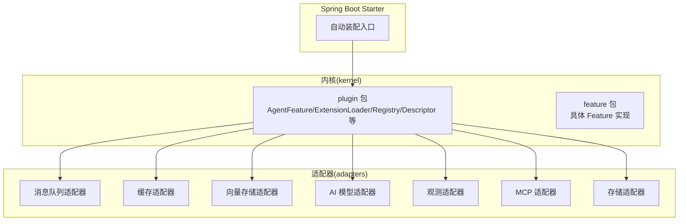
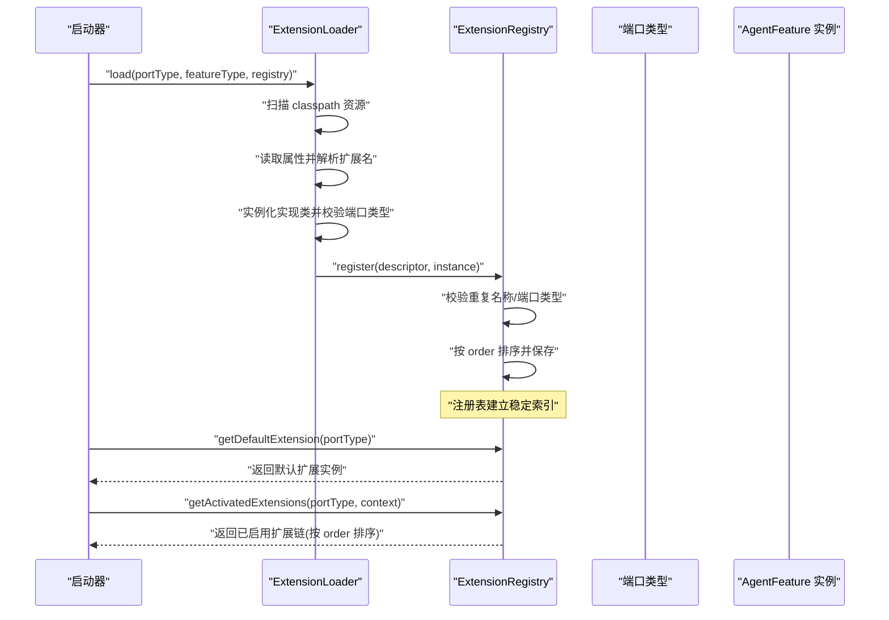
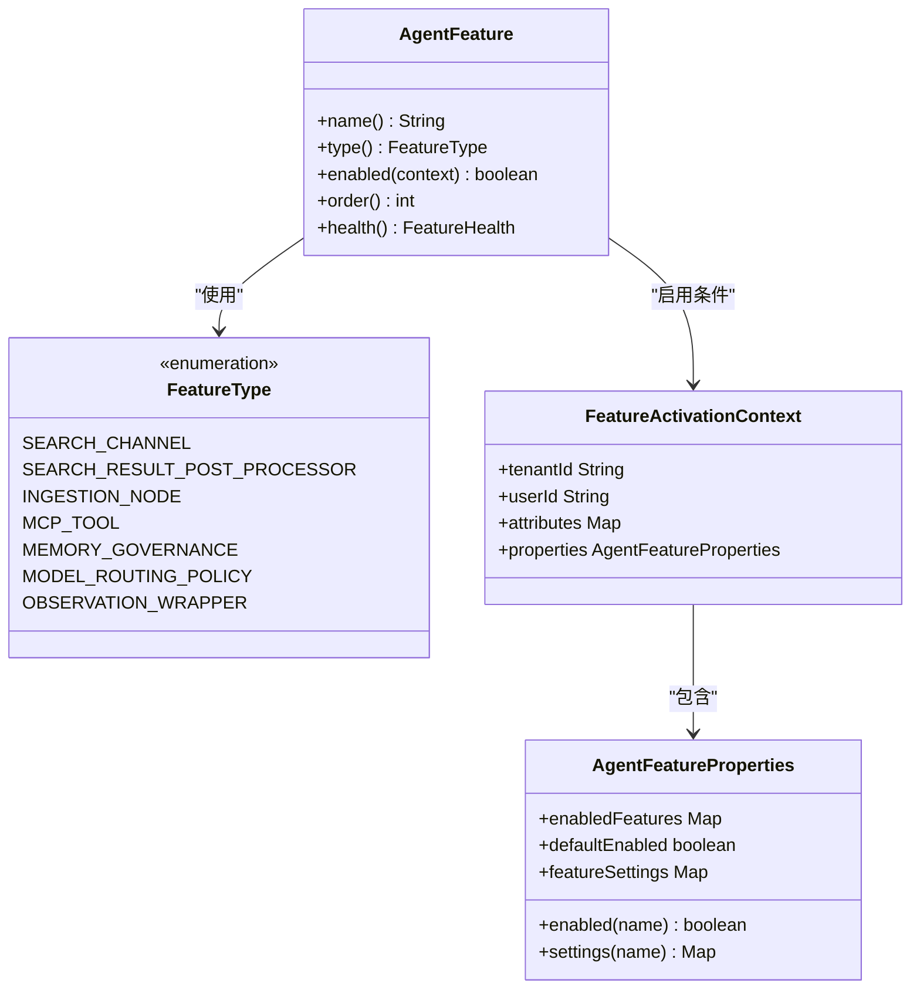
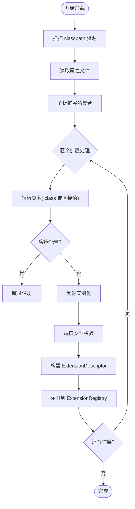
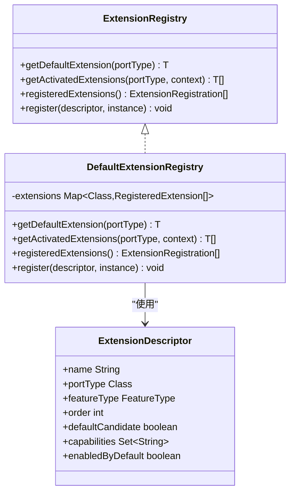
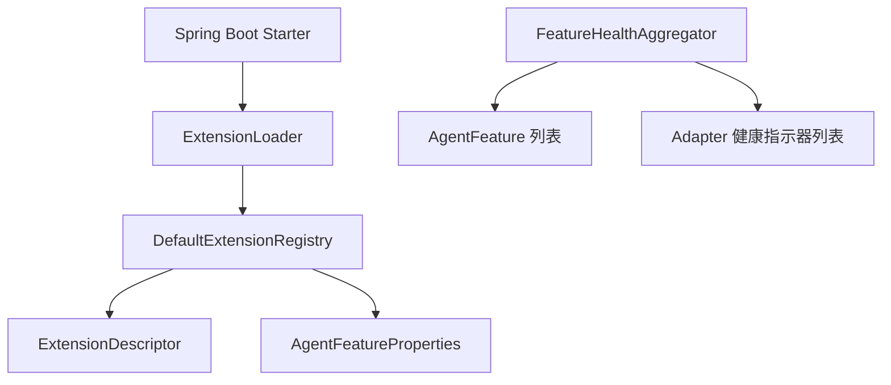

# 插件系统架构

<cite>
**本文引用的文件**
- [AgentFeature.java](file://seahorse-agent-kernel/src/main/java/com/miracle/ai/seahorse/agent/kernel/plugin/AgentFeature.java)
- [ExtensionLoader.java](file://seahorse-agent-kernel/src/main/java/com/miracle/ai/seahorse/agent/kernel/plugin/ExtensionLoader.java)
- [DefaultExtensionRegistry.java](file://seahorse-agent-kernel/src/main/java/com/miracle/ai/seahorse/agent/kernel/plugin/DefaultExtensionRegistry.java)
- [ExtensionDescriptor.java](file://seahorse-agent-kernel/src/main/java/com/miracle/ai/seahorse/agent/kernel/plugin/ExtensionDescriptor.java)
- [ExtensionRegistry.java](file://seahorse-agent-kernel/src/main/java/com/miracle/ai/seahorse/agent/kernel/plugin/ExtensionRegistry.java)
- [FeatureType.java](file://seahorse-agent-kernel/src/main/java/com/miracle/ai/seahorse/agent/kernel/plugin/FeatureType.java)
- [FeatureActivationContext.java](file://seahorse-agent-kernel/src/main/java/com/miracle/ai/seahorse/agent/kernel/plugin/FeatureActivationContext.java)
- [FeatureHealth.java](file://seahorse-agent-kernel/src/main/java/com/miracle/ai/seahorse/agent/kernel/plugin/FeatureHealth.java)
- [ExtensionLoadDiagnostic.java](file://seahorse-agent-kernel/src/main/java/com/miracle/ai/seahorse/agent/kernel/plugin/ExtensionLoadDiagnostic.java)
- [AgentFeatureProperties.java](file://seahorse-agent-kernel/src/main/java/com/miracle/ai/seahorse/agent/kernel/plugin/AgentFeatureProperties.java)
- [ExtensionRegistration.java](file://seahorse-agent-kernel/src/main/java/com/miracle/ai/seahorse/agent/kernel/plugin/ExtensionRegistration.java)
- [FeatureHealthAggregator.java](file://seahorse-agent-kernel/src/main/java/com/miracle/ai/seahorse/agent/kernel/plugin/FeatureHealthAggregator.java)
- [VectorGlobalSearchFeature.java](file://seahorse-agent-kernel/src/main/java/com/miracle/ai/seahorse/agent/kernel/feature/retrieval/VectorGlobalSearchFeature.java)
- [RemoteMcpToolFeature.java](file://seahorse-agent-adapter-mcp-http/src/main/java/com/miracle/ai/seahorse/agent/adapters/mcp/http/RemoteMcpToolFeature.java)
- [SeahorseAgentNativeAdapterAutoConfiguration.java](file://seahorse-agent-spring-boot-starter/src/main/java/com/miracle/ai/seahorse/agent/adapters/spring/SeahorseAgentNativeAdapterAutoConfiguration.java)
- [AutoConfiguration.imports](file://seahorse-agent-adapter-mcp-http/src/main/resources/META-INF/spring/org.springframework.boot.autoconfigure.AutoConfiguration.imports)
- [McpToolRegistryPort](file://seahorse-agent-adapter-mcp-http/src/main/resources/META-INF/seahorse-agent/com.miracle.ai.seahorse.agent.ports.outbound.mcp.McpToolRegistryPort)
- [McpParameterExtractionPort](file://seahorse-agent-adapter-mcp-http/src/main/resources/META-INF/seahorse-agent/com.miracle.ai.seahorse.agent.ports.outbound.mcp.McpParameterExtractionPort)
- [MessageQueuePort](file://seahorse-agent-adapter-mq-pulsar/src/main/resources/META-INF/seahorse-agent/com.miracle.ai.seahorse.agent.ports.outbound.mq.MessageQueuePort)
- [KeyValueCachePort](file://seahorse-agent-adapter-cache-local/src/main/resources/META-INF/seahorse-agent/com.miracle.ai.seahorse.agent.ports.outbound.cache.KeyValueCachePort)
- [ObjectStoragePort](file://seahorse-agent-adapter-storage-local/src/main/resources/META-INF/seahorse-agent/com.miracle.ai.seahorse.agent.ports.outbound.storage.ObjectStoragePort)
- [VectorSearchPort](file://seahorse-agent-adapter-vector-milvus/src/main/resources/META-INF/seahorse-agent/com.miracle.ai.seahorse.agent.ports.outbound.vector.VectorSearchPort)
- [ChatModelPort](file://seahorse-agent-adapter-ai-openai-compatible/src/main/resources/META-INF/seahorse-agent/com.miracle.ai.seahorse.agent.ports.outbound.model.ChatModelPort)
- [ObservationPort](file://seahorse-agent-adapter-observation-micrometer/src/main/resources/META-INF/seahorse-agent/com.miracle.ai.seahorse.agent.ports.outbound.observation.ObservationPort)
- [AgentExtension.java](file://seahorse-agent-kernel/src/main/java/com/miracle/ai/seahorse/agent/kernel/plugin/AgentExtension.java)
</cite>

## 目录
1. [简介](#简介)
2. [项目结构](#项目结构)
3. [核心组件](#核心组件)
4. [架构总览](#架构总览)
5. [详细组件分析](#详细组件分析)
6. [依赖分析](#依赖分析)
7. [性能考量](#性能考量)
8. [故障排查指南](#故障排查指南)
9. [结论](#结论)
10. [附录](#附录)

## 简介
本文件系统性阐述 Seahorse Agent 的插件系统架构，围绕以下目标展开：
- 设计目标与核心价值：通过可插拔的 AgentFeature 接口实现功能的动态扩展与模块化组织；借助 ExtensionLoader 的 SPI 式加载机制与 DefaultExtensionRegistry 的注册表，达成启动期装配、运行期高效访问。
- AgentFeature 接口：定义 Feature 的名称、类型、启用条件、排序与健康状态，确保内核对扩展的统一识别与治理。
- ExtensionLoader 加载机制：基于 classpath 的 META-INF/seahorse-agent/* 端口资源文件进行 SPI 式发现与实例化，支持默认实现、排序、能力标签与启用策略。
- DefaultExtensionRegistry 注册与发现：在启动期完成扩展注册与校验，运行期仅做轻量过滤与类型转换，避免动态扫描带来的性能抖动。
- ExtensionDescriptor 描述符：在启动期固化扩展的元数据（名称、端口类型、Feature 类型、排序、默认候选、能力标签、默认启用），请求期只读使用。
- 最佳实践：接口设计、版本兼容、健康检查与诊断信息，以及如何扩展新适配器、处理器与工具。

## 项目结构
Seahorse Agent 将插件系统的核心能力集中在 kernel 模块的 plugin 包中，并通过各 adapter 模块以 SPI 资源形式提供具体实现。Spring Boot Starter 提供自动装配入口，使原生适配器在启动期被加载。

**图表来源**
- [ExtensionLoader.java:39-262](file://seahorse-agent-kernel/src/main/java/com/miracle/ai/seahorse/agent/kernel/plugin/ExtensionLoader.java#L39-L262)
- [DefaultExtensionRegistry.java:34-124](file://seahorse-agent-kernel/src/main/java/com/miracle/ai/seahorse/agent/kernel/plugin/DefaultExtensionRegistry.java#L34-L124)
- [SeahorseAgentNativeAdapterAutoConfiguration.java](file://seahorse-agent-spring-boot-starter/src/main/java/com/miracle/ai/seahorse/agent/adapters/spring/SeahorseAgentNativeAdapterAutoConfiguration.java)

**章节来源**
- [ExtensionLoader.java:39-262](file://seahorse-agent-kernel/src/main/java/com/miracle/ai/seahorse/agent/kernel/plugin/ExtensionLoader.java#L39-L262)
- [DefaultExtensionRegistry.java:34-124](file://seahorse-agent-kernel/src/main/java/com/miracle/ai/seahorse/agent/kernel/plugin/DefaultExtensionRegistry.java#L34-L124)
- [SeahorseAgentNativeAdapterAutoConfiguration.java](file://seahorse-agent-spring-boot-starter/src/main/java/com/miracle/ai/seahorse/agent/adapters/spring/SeahorseAgentNativeAdapterAutoConfiguration.java)

## 核心组件
- AgentFeature：定义 Feature 的标识、类型、启用条件、排序与健康状态，是所有可插拔扩展的统一抽象。
- ExtensionLoader：基于 classpath 的 SPI 资源加载器，负责发现、读取、实例化并注册扩展。
- ExtensionRegistry/DefaultExtensionRegistry：扩展注册表，启动期注册扩展，运行期提供默认扩展与已启用扩展链。
- ExtensionDescriptor：扩展描述符，承载扩展的元数据并在启动期固化。
- FeatureType：Feature 类型枚举，限定内核认可的稳定扩展点集合。
- FeatureActivationContext/AgentFeatureProperties：Feature 激活上下文与配置快照，驱动启用策略。
- FeatureHealth/FeatureHealthAggregator：健康状态建模与聚合，用于诊断与启动检查。
- ExtensionLoadDiagnostic/ExtensionRegistration：加载诊断与注册快照，便于问题定位与可观测性。

**章节来源**
- [AgentFeature.java:26-80](file://seahorse-agent-kernel/src/main/java/com/miracle/ai/seahorse/agent/kernel/plugin/AgentFeature.java#L26-L80)
- [ExtensionLoader.java:39-262](file://seahorse-agent-kernel/src/main/java/com/miracle/ai/seahorse/agent/kernel/plugin/ExtensionLoader.java#L39-L262)
- [ExtensionRegistry.java:28-84](file://seahorse-agent-kernel/src/main/java/com/miracle/ai/seahorse/agent/kernel/plugin/ExtensionRegistry.java#L28-L84)
- [DefaultExtensionRegistry.java:34-124](file://seahorse-agent-kernel/src/main/java/com/miracle/ai/seahorse/agent/kernel/plugin/DefaultExtensionRegistry.java#L34-L124)
- [ExtensionDescriptor.java:37-66](file://seahorse-agent-kernel/src/main/java/com/miracle/ai/seahorse/agent/kernel/plugin/ExtensionDescriptor.java#L37-L66)
- [FeatureType.java:26-63](file://seahorse-agent-kernel/src/main/java/com/miracle/ai/seahorse/agent/kernel/plugin/FeatureType.java#L26-L63)
- [FeatureActivationContext.java:33-61](file://seahorse-agent-kernel/src/main/java/com/miracle/ai/seahorse/agent/kernel/plugin/FeatureActivationContext.java#L33-L61)
- [AgentFeatureProperties.java:33-95](file://seahorse-agent-kernel/src/main/java/com/miracle/ai/seahorse/agent/kernel/plugin/AgentFeatureProperties.java#L33-L95)
- [FeatureHealth.java:33-68](file://seahorse-agent-kernel/src/main/java/com/miracle/ai/seahorse/agent/kernel/plugin/FeatureHealth.java#L33-L68)
- [FeatureHealthAggregator.java:31-64](file://seahorse-agent-kernel/src/main/java/com/miracle/ai/seahorse/agent/kernel/plugin/FeatureHealthAggregator.java#L31-L64)
- [ExtensionLoadDiagnostic.java:30-45](file://seahorse-agent-kernel/src/main/java/com/miracle/ai/seahorse/agent/kernel/plugin/ExtensionLoadDiagnostic.java#L30-L45)
- [ExtensionRegistration.java:28-36](file://seahorse-agent-kernel/src/main/java/com/miracle/ai/seahorse/agent/kernel/plugin/ExtensionRegistration.java#L28-L36)

## 架构总览
插件系统采用“启动期装配 + 运行期查询”的双阶段设计：
- 启动期：ExtensionLoader 通过 classpath 资源发现扩展，ExtensionRegistry 注册扩展并按 order 排序，生成稳定的扩展索引。
- 运行期：内核仅依据端口类型查询扩展链，不再进行反射扫描，降低主链路延迟与不确定性。

**图表来源**
- [ExtensionLoader.java:79-114](file://seahorse-agent-kernel/src/main/java/com/miracle/ai/seahorse/agent/kernel/plugin/ExtensionLoader.java#L79-L114)
- [DefaultExtensionRegistry.java:39-58](file://seahorse-agent-kernel/src/main/java/com/miracle/ai/seahorse/agent/kernel/plugin/DefaultExtensionRegistry.java#L39-L58)

**章节来源**
- [ExtensionLoader.java:79-114](file://seahorse-agent-kernel/src/main/java/com/miracle/ai/seahorse/agent/kernel/plugin/ExtensionLoader.java#L79-L114)
- [DefaultExtensionRegistry.java:39-58](file://seahorse-agent-kernel/src/main/java/com/miracle/ai/seahorse/agent/kernel/plugin/DefaultExtensionRegistry.java#L39-L58)

## 详细组件分析

### AgentFeature 接口设计
- 唯一名称与类型：name() 与 type() 用于标识与分类扩展，支撑配置开关、日志、监控与冲突检测。
- 启用策略：enabled(FeatureActivationContext) 支持基于租户、用户、灰度属性与配置的细粒度控制，默认启用。
- 排序语义：order() 用于扩展优先级，注册表优先使用描述符中的 order，作为补充语义。
- 健康状态：health() 返回 Feature 自身健康状态，不参与主链路决策，避免增加请求耗时。

**图表来源**
- [AgentFeature.java:26-80](file://seahorse-agent-kernel/src/main/java/com/miracle/ai/seahorse/agent/kernel/plugin/AgentFeature.java#L26-L80)
- [FeatureType.java:26-63](file://seahorse-agent-kernel/src/main/java/com/miracle/ai/seahorse/agent/kernel/plugin/FeatureType.java#L26-L63)
- [FeatureActivationContext.java:33-61](file://seahorse-agent-kernel/src/main/java/com/miracle/ai/seahorse/agent/kernel/plugin/FeatureActivationContext.java#L33-L61)
- [AgentFeatureProperties.java:33-95](file://seahorse-agent-kernel/src/main/java/com/miracle/ai/seahorse/agent/kernel/plugin/AgentFeatureProperties.java#L33-L95)

**章节来源**
- [AgentFeature.java:26-80](file://seahorse-agent-kernel/src/main/java/com/miracle/ai/seahorse/agent/kernel/plugin/AgentFeature.java#L26-L80)
- [FeatureType.java:26-63](file://seahorse-agent-kernel/src/main/java/com/miracle/ai/seahorse/agent/kernel/plugin/FeatureType.java#L26-L63)
- [FeatureActivationContext.java:33-61](file://seahorse-agent-kernel/src/main/java/com/miracle/ai/seahorse/agent/kernel/plugin/FeatureActivationContext.java#L33-L61)
- [AgentFeatureProperties.java:33-95](file://seahorse-agent-kernel/src/main/java/com/miracle/ai/seahorse/agent/kernel/plugin/AgentFeatureProperties.java#L33-L95)

### ExtensionLoader 加载机制
- 资源根路径：META-INF/seahorse-agent/，资源文件名为“端口全限定类名”。
- 属性键约定：
  - 默认实现键：default
  - 类名键：扩展名.class
  - 排序键：扩展名.order
  - 默认候选键：扩展名.default
  - 容器托管键：扩展名.managed
  - 能力标签键：扩展名.capabilities
  - 默认启用键：扩展名.enabled-by-default
- 实例化策略：通过 ClassLoader 查找类并以无参构造函数实例化，随后强制类型转换为端口类型。
- 错误处理：捕获并记录加载诊断信息，便于定位失败原因。

**图表来源**
- [ExtensionLoader.java:95-114](file://seahorse-agent-kernel/src/main/java/com/miracle/ai/seahorse/agent/kernel/plugin/ExtensionLoader.java#L95-L114)
- [ExtensionLoader.java:156-171](file://seahorse-agent-kernel/src/main/java/com/miracle/ai/seahorse/agent/kernel/plugin/ExtensionLoader.java#L156-L171)
- [ExtensionLoader.java:181-190](file://seahorse-agent-kernel/src/main/java/com/miracle/ai/seahorse/agent/kernel/plugin/ExtensionLoader.java#L181-L190)
- [ExtensionLoader.java:227-238](file://seahorse-agent-kernel/src/main/java/com/miracle/ai/seahorse/agent/kernel/plugin/ExtensionLoader.java#L227-L238)

**章节来源**
- [ExtensionLoader.java:39-262](file://seahorse-agent-kernel/src/main/java/com/miracle/ai/seahorse/agent/kernel/plugin/ExtensionLoader.java#L39-L262)

### DefaultExtensionRegistry 注册与发现
- 注册校验：拒绝同一端口下的重复名称，校验端口类型一致性。
- 默认扩展：通过默认候选标记选取默认实现，未找到时报错。
- 已启用扩展链：结合配置快照与 Feature 自身 enabled 方法进行过滤，最终按 order 排序输出。
- 注册快照：提供 registeredExtensions() 输出启动期注册结果，便于诊断与运维。

**图表来源**
- [ExtensionRegistry.java:28-84](file://seahorse-agent-kernel/src/main/java/com/miracle/ai/seahorse/agent/kernel/plugin/ExtensionRegistry.java#L28-L84)
- [DefaultExtensionRegistry.java:34-124](file://seahorse-agent-kernel/src/main/java/com/miracle/ai/seahorse/agent/kernel/plugin/DefaultExtensionRegistry.java#L34-L124)
- [ExtensionDescriptor.java:37-66](file://seahorse-agent-kernel/src/main/java/com/miracle/ai/seahorse/agent/kernel/plugin/ExtensionDescriptor.java#L37-L66)

**章节来源**
- [ExtensionRegistry.java:28-84](file://seahorse-agent-kernel/src/main/java/com/miracle/ai/seahorse/agent/kernel/plugin/ExtensionRegistry.java#L28-L84)
- [DefaultExtensionRegistry.java:34-124](file://seahorse-agent-kernel/src/main/java/com/miracle/ai/seahorse/agent/kernel/plugin/DefaultExtensionRegistry.java#L34-L124)
- [ExtensionDescriptor.java:37-66](file://seahorse-agent-kernel/src/main/java/com/miracle/ai/seahorse/agent/kernel/plugin/ExtensionDescriptor.java#L37-L66)

### ExtensionDescriptor 描述符机制
- 元数据固化：在启动期确定扩展的名称、端口类型、Feature 类型、排序、默认候选、能力标签与默认启用策略。
- 快速失败：对空名称与空端口类型进行校验，确保注册表索引的完整性。
- 能力标签：支持扩展能力的标签化描述，便于按能力筛选与组合。

**章节来源**
- [ExtensionDescriptor.java:37-66](file://seahorse-agent-kernel/src/main/java/com/miracle/ai/seahorse/agent/kernel/plugin/ExtensionDescriptor.java#L37-L66)

### Feature 激活与健康
- FeatureActivationContext：封装租户、用户、灰度属性与配置快照，作为启用策略输入。
- AgentFeatureProperties：将松散配置转换为只读快照，避免请求期频繁解析。
- FeatureHealth/FeatureHealthAggregator：提供 Feature 与 Adapter 的健康状态聚合，用于诊断与启动检查。

**章节来源**
- [FeatureActivationContext.java:33-61](file://seahorse-agent-kernel/src/main/java/com/miracle/ai/seahorse/agent/kernel/plugin/FeatureActivationContext.java#L33-L61)
- [AgentFeatureProperties.java:33-95](file://seahorse-agent-kernel/src/main/java/com/miracle/ai/seahorse/agent/kernel/plugin/AgentFeatureProperties.java#L33-L95)
- [FeatureHealth.java:33-68](file://seahorse-agent-kernel/src/main/java/com/miracle/ai/seahorse/agent/kernel/plugin/FeatureHealth.java#L33-L68)
- [FeatureHealthAggregator.java:31-64](file://seahorse-agent-kernel/src/main/java/com/miracle/ai/seahorse/agent/kernel/plugin/FeatureHealthAggregator.java#L31-L64)

### 典型插件实现示例
- 向量全局检索 Feature：演示如何通过端口组合实现检索通道，体现 Feature 的可插拔性与内核解耦。
- 远程 MCP 工具 Feature：演示如何以最小职责持有工具元数据与客户端，业务编排由内核统一完成。

**章节来源**
- [VectorGlobalSearchFeature.java:42-159](file://seahorse-agent-kernel/src/main/java/com/miracle/ai/seahorse/agent/kernel/feature/retrieval/VectorGlobalSearchFeature.java#L42-L159)
- [RemoteMcpToolFeature.java:33-53](file://seahorse-agent-adapter-mcp-http/src/main/java/com/miracle/ai/seahorse/agent/adapters/mcp/http/RemoteMcpToolFeature.java#L33-L53)

## 依赖分析
插件系统的关键依赖关系如下：
- ExtensionLoader 依赖 ClassLoader 与端口类型，读取 classpath 资源并实例化实现类。
- DefaultExtensionRegistry 依赖 ExtensionDescriptor 与 AgentFeatureProperties，维护扩展注册表并提供查询接口。
- FeatureHealthAggregator 依赖 AgentFeature 与 Adapter 健康指示器，聚合健康状态。
- Spring Boot Starter 通过 AutoConfiguration 导入原生适配器，触发 ExtensionLoader 的装配。

**图表来源**
- [ExtensionLoader.java:39-262](file://seahorse-agent-kernel/src/main/java/com/miracle/ai/seahorse/agent/kernel/plugin/ExtensionLoader.java#L39-L262)
- [DefaultExtensionRegistry.java:34-124](file://seahorse-agent-kernel/src/main/java/com/miracle/ai/seahorse/agent/kernel/plugin/DefaultExtensionRegistry.java#L34-L124)
- [FeatureHealthAggregator.java:31-64](file://seahorse-agent-kernel/src/main/java/com/miracle/ai/seahorse/agent/kernel/plugin/FeatureHealthAggregator.java#L31-L64)
- [SeahorseAgentNativeAdapterAutoConfiguration.java](file://seahorse-agent-spring-boot-starter/src/main/java/com/miracle/ai/seahorse/agent/adapters/spring/SeahorseAgentNativeAdapterAutoConfiguration.java)

**章节来源**
- [ExtensionLoader.java:39-262](file://seahorse-agent-kernel/src/main/java/com/miracle/ai/seahorse/agent/kernel/plugin/ExtensionLoader.java#L39-L262)
- [DefaultExtensionRegistry.java:34-124](file://seahorse-agent-kernel/src/main/java/com/miracle/ai/seahorse/agent/kernel/plugin/DefaultExtensionRegistry.java#L34-L124)
- [FeatureHealthAggregator.java:31-64](file://seahorse-agent-kernel/src/main/java/com/miracle/ai/seahorse/agent/kernel/plugin/FeatureHealthAggregator.java#L31-L64)
- [SeahorseAgentNativeAdapterAutoConfiguration.java](file://seahorse-agent-spring-boot-starter/src/main/java/com/miracle/ai/seahorse/agent/adapters/spring/SeahorseAgentNativeAdapterAutoConfiguration.java)

## 性能考量
- 启动期装配：所有扩展在启动期完成发现与注册，运行期仅做轻量过滤与类型转换，避免反射扫描带来的抖动。
- 描述符排序：注册时按 order 排序，运行期无需再次排序，减少比较开销。
- 健康检查隔离：健康聚合仅在诊断与启动检查场景调用，不进入请求主链路，避免影响在线延迟。
- 资源读取优化：Properties 文件一次性读取并解析，避免重复 IO。

[本节为通用性能建议，不直接分析具体文件]

## 故障排查指南
- 加载失败诊断：ExtensionLoader 在实例化或类型转换失败时会记录 ExtensionLoadDiagnostic，包含资源名、扩展名、实现类与错误消息，便于定位。
- 注册冲突：同一端口下重复名称会导致注册异常，需检查扩展名与端口映射。
- 默认扩展缺失：未找到默认扩展时抛出异常，需确认 default 标记或 .default 属性设置。
- 启用策略问题：若扩展未生效，检查 FeatureActivationContext 与 AgentFeatureProperties 的 enabled 配置。
- 健康状态异常：通过 FeatureHealthAggregator 聚合的健康报告定位具体 Feature 或 Adapter 的异常。

**章节来源**
- [ExtensionLoadDiagnostic.java:30-45](file://seahorse-agent-kernel/src/main/java/com/miracle/ai/seahorse/agent/kernel/plugin/ExtensionLoadDiagnostic.java#L30-L45)
- [ExtensionLoader.java:167-171](file://seahorse-agent-kernel/src/main/java/com/miracle/ai/seahorse/agent/kernel/plugin/ExtensionLoader.java#L167-L171)
- [DefaultExtensionRegistry.java:94-101](file://seahorse-agent-kernel/src/main/java/com/miracle/ai/seahorse/agent/kernel/plugin/DefaultExtensionRegistry.java#L94-L101)
- [FeatureHealthAggregator.java:42-61](file://seahorse-agent-kernel/src/main/java/com/miracle/ai/seahorse/agent/kernel/plugin/FeatureHealthAggregator.java#L42-L61)

## 结论
Seahorse Agent 的插件系统通过 AgentFeature 抽象、ExtensionLoader 的 SPI 式装配与 DefaultExtensionRegistry 的注册表机制，实现了功能的动态扩展与模块化组织。其设计强调启动期装配与运行期高效访问，确保内核对扩展的统一治理与高性能运行。配合健康检查与诊断能力，系统具备良好的可运维性与可演进性。

[本节为总结性内容，不直接分析具体文件]

## 附录

### 插件开发最佳实践
- 接口设计
  - 以 AgentFeature 为核心抽象，明确 name、type、enabled、order、health 等语义。
  - 通过端口类型与 ExtensionDescriptor 的能力标签描述扩展能力，避免硬编码。
- 版本兼容
  - 保持端口类型稳定，新增扩展点时优先复用 FeatureType，避免无限制扩展导致核心能力空心化。
  - 通过 .order 与 .default 控制默认实现与优先级，确保平滑迁移。
- 健康检查
  - 在 health() 中仅做自检，不访问外部服务，避免影响主链路性能。
  - 使用 FeatureHealthAggregator 聚合健康状态，便于集中诊断。
- 诊断信息
  - 在加载失败时利用 ExtensionLoadDiagnostic 提供清晰的错误上下文。
  - 通过 registeredExtensions() 输出注册快照，辅助运维定位。
- 扩展新功能
  - 新适配器：在对应 adapter 模块中实现端口类型，提供 META-INF/seahorse-agent/* 资源文件，声明类名与元数据。
  - 新处理器：实现 AgentFeature 并在内核 feature 包中组织，通过 FeatureType 明确扩展点。
  - 新工具：实现 McpToolFeature 并提供工具元数据与客户端，由内核统一编排。

**章节来源**
- [AgentFeature.java:26-80](file://seahorse-agent-kernel/src/main/java/com/miracle/ai/seahorse/agent/kernel/plugin/AgentFeature.java#L26-L80)
- [ExtensionLoader.java:39-262](file://seahorse-agent-kernel/src/main/java/com/miracle/ai/seahorse/agent/kernel/plugin/ExtensionLoader.java#L39-L262)
- [DefaultExtensionRegistry.java:34-124](file://seahorse-agent-kernel/src/main/java/com/miracle/ai/seahorse/agent/kernel/plugin/DefaultExtensionRegistry.java#L34-L124)
- [FeatureHealthAggregator.java:31-64](file://seahorse-agent-kernel/src/main/java/com/miracle/ai/seahorse/agent/kernel/plugin/FeatureHealthAggregator.java#L31-L64)
- [FeatureType.java:26-63](file://seahorse-agent-kernel/src/main/java/com/miracle/ai/seahorse/agent/kernel/plugin/FeatureType.java#L26-L63)

### SPI 资源示例与集成点
- Spring 自动装配：通过 AutoConfiguration.imports 引导原生适配器加载。
- 端口资源：各 adapter 在 META-INF/seahorse-agent 下提供端口资源文件，声明扩展实现与元数据。

**章节来源**
- [AutoConfiguration.imports](file://seahorse-agent-adapter-mcp-http/src/main/resources/META-INF/spring/org.springframework.boot.autoconfigure.AutoConfiguration.imports)
- [McpToolRegistryPort](file://seahorse-agent-adapter-mcp-http/src/main/resources/META-INF/seahorse-agent/com.miracle.ai.seahorse.agent.ports.outbound.mcp.McpToolRegistryPort)
- [McpParameterExtractionPort](file://seahorse-agent-adapter-mcp-http/src/main/resources/META-INF/seahorse-agent/com.miracle.ai.seahorse.agent.ports.outbound.mcp.McpParameterExtractionPort)
- [MessageQueuePort](file://seahorse-agent-adapter-mq-pulsar/src/main/resources/META-INF/seahorse-agent/com.miracle.ai.seahorse.agent.ports.outbound.mq.MessageQueuePort)
- [KeyValueCachePort](file://seahorse-agent-adapter-cache-local/src/main/resources/META-INF/seahorse-agent/com.miracle.ai.seahorse.agent.ports.outbound.cache.KeyValueCachePort)
- [ObjectStoragePort](file://seahorse-agent-adapter-storage-local/src/main/resources/META-INF/seahorse-agent/com.miracle.ai.seahorse.agent.ports.outbound.storage.ObjectStoragePort)
- [VectorSearchPort](file://seahorse-agent-adapter-vector-milvus/src/main/resources/META-INF/seahorse-agent/com.miracle.ai.seahorse.agent.ports.outbound.vector.VectorSearchPort)
- [ChatModelPort](file://seahorse-agent-adapter-ai-openai-compatible/src/main/resources/META-INF/seahorse-agent/com.miracle.ai.seahorse.agent.ports.outbound.model.ChatModelPort)
- [ObservationPort](file://seahorse-agent-adapter-observation-micrometer/src/main/resources/META-INF/seahorse-agent/com.miracle.ai.seahorse.agent.ports.outbound.observation.ObservationPort)