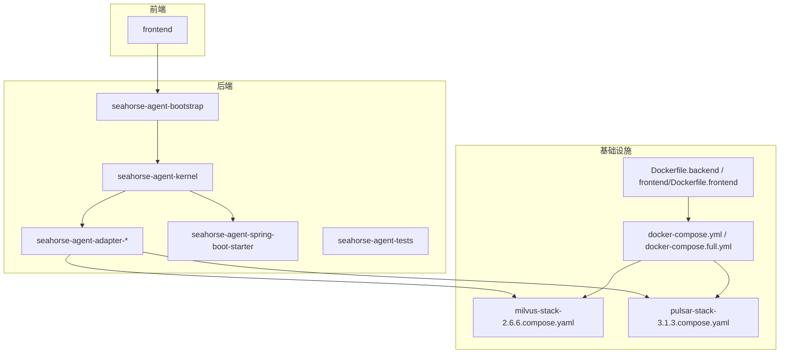
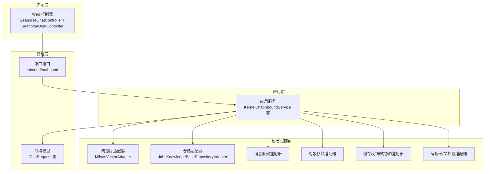
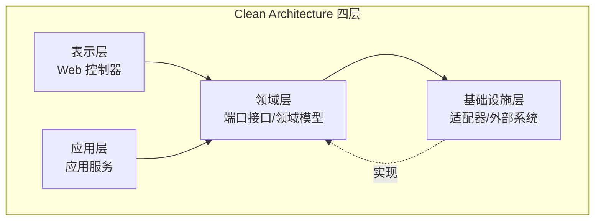
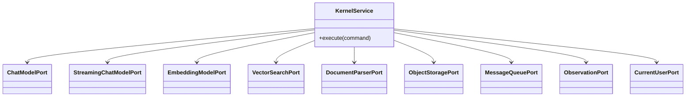
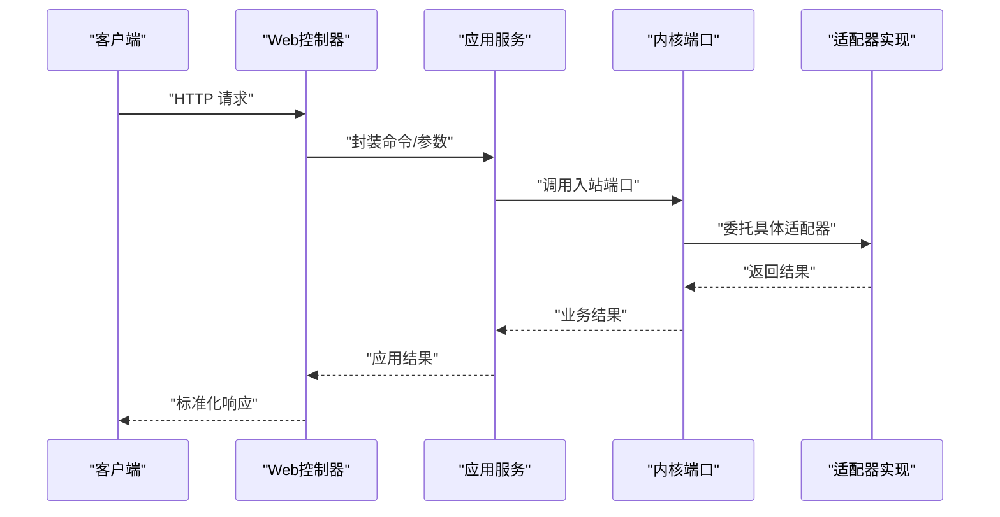
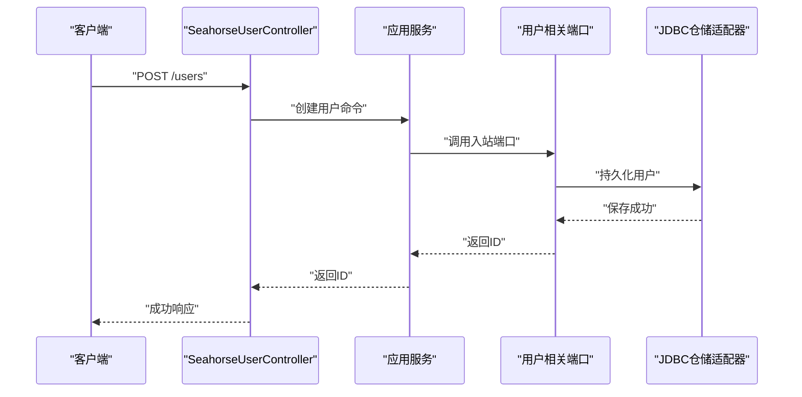
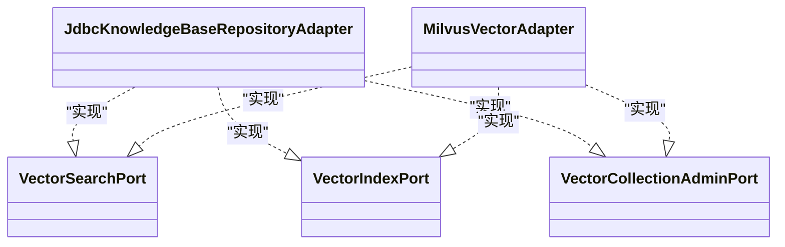
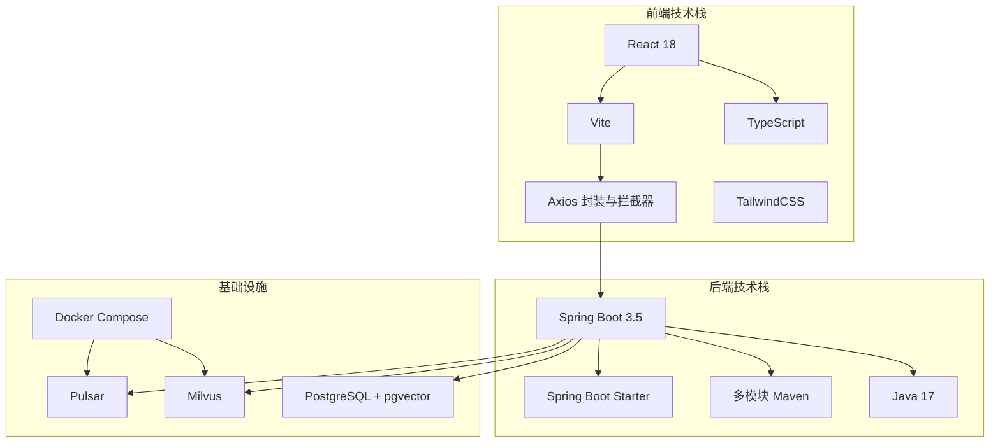
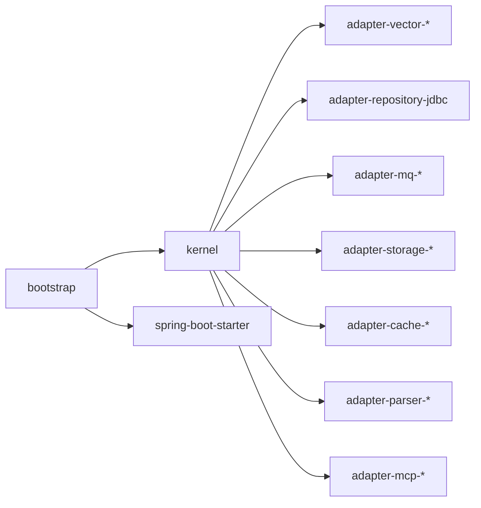

# 整体架构视图

<cite>
**本文引用的文件**
- [SeahorseAgentApplication.java](file://seahorse-agent-bootstrap/src/main/java/com/miracle/ai/seahorse/agent/SeahorseAgentApplication.java)
- [Clean Architecture 模式.md](file://docs/zh/content/架构设计/Clean Architecture 模式.md)
- [企业级可插拔RAG架构设计.md](file://docs/zh/content/架构设计/企业级可插拔RAG架构设计.md)
- [开发环境搭建.md](file://docs/zh/content/部署配置/开发环境搭建.md)
- [2026-05-31-frontend-backend-alignment.md](file://docs/superpowers/plans/2026-05-31-frontend-backend-alignment.md)
- [KernelChatInboundService.java](file://seahorse-agent-kernel/src/main/java/com/miracle/ai/seahorse/agent/kernel/application/chat/KernelChatInboundService.java)
- [SeahorseChatController.java](file://seahorse-agent-adapter-web/src/main/java/com/miracle/ai/seahorse/agent/adapters/web/SeahorseChatController.java)
- [MilvusVectorAdapter.java](file://seahorse-agent-adapter-vector-milvus/src/main/java/com/miracle/ai/seahorse/agent/adapters/vector/milvus/MilvusVectorAdapter.java)
- [JdbcKnowledgeBaseRepositoryAdapter.java](file://seahorse-agent-adapter-repository-jdbc/src/main/java/com/miracle/ai/seahorse/agent/adapters/repository/jdbc/JdbcKnowledgeBaseRepositoryAdapter.java)
- [SeahorseUserController.java](file://seahorse-agent-adapter-web/src/main/java/com/miracle/ai/seahorse/agent/adapters/web/SeahorseUserController.java)
- [pom.xml](file://pom.xml)
- [seahorse-agent-kernel/pom.xml](file://seahorse-agent-kernel/pom.xml)
- [seahorse-agent-adapter-web/pom.xml](file://seahorse-agent-adapter-web/pom.xml)
- [seahorse-agent-spring-boot-starter/pom.xml](file://seahorse-agent-spring-boot-starter/pom.xml)
- [frontend/package.json](file://frontend/package.json)
- [frontend/tailwind.config.cjs](file://frontend/tailwind.config.cjs)
- [frontend/vite.config.js](file://frontend/vite.config.js)
- [frontend/src/services/api.ts](file://frontend/src/services/api.ts)
- [frontend/src/types/index.ts](file://frontend/src/types/index.ts)
- [frontend/Dockerfile.frontend](file://frontend/Dockerfile.frontend)
- [Dockerfile.backend](file://Dockerfile.backend)
- [docker-compose.yml](file://docker-compose.yml)
- [docker-compose.full.yml](file://docker-compose.full.yml)
- [resources/docker/milvus-stack-2.6.6.compose.yaml](file://resources/docker/milvus-stack-2.6.6.compose.yaml)
- [resources/docker/pulsar-stack-3.1.3.compose.yaml](file://resources/docker/pulsar-stack-3.1.3.compose.yaml)
</cite>

## 目录
1. [引言](#引言)
2. [项目结构](#项目结构)
3. [核心组件](#核心组件)
4. [架构总览](#架构总览)
5. [详细组件分析](#详细组件分析)
6. [依赖分析](#依赖分析)
7. [性能考虑](#性能考虑)
8. [故障排查指南](#故障排查指南)
9. [结论](#结论)
10. [附录](#附录)

## 引言
本文件面向Seahorse Agent的整体架构视图，系统性阐述其采用的Clean Architecture分层架构与端口适配器模式，说明如何通过“内核层-适配器层-外部系统层”的职责边界实现业务与技术解耦，并以微服务化理念指导模块化设计与服务边界划分。同时，结合项目实际技术栈（Spring Boot、React、TypeScript、Vite、Docker Compose等）解释架构决策与实施路径，辅以架构图与组件关系图帮助读者快速理解系统全貌。

## 项目结构
Seahorse Agent采用多模块Maven聚合工程组织，后端以Clean Architecture为核心，前端采用现代化前端技术栈，容器化与编排工具支撑本地与生产环境的一致化部署。

- 后端核心模块
  - seahorse-agent-bootstrap：Spring Boot启动入口，负责应用装配与启动。
  - seahorse-agent-kernel：内核层，承载领域模型、应用服务与端口接口定义。
  - seahorse-agent-adapter-*：适配器层，对接外部系统（数据库、向量库、消息队列、对象存储、缓存、解析器、MCP等）。
  - seahorse-agent-spring-boot-starter：自动装配与条件化配置，支撑内核能力的可插拔启用。
  - seahorse-agent-tests：集成测试与端口契约验证。
- 前端模块
  - frontend：基于Vite + React + TypeScript + TailwindCSS的单页应用，通过Axios封装与拦截器统一处理API交互与鉴权。
- 基础设施与部署
  - Dockerfile.backend、frontend/Dockerfile.frontend：后端与前端镜像构建。
  - docker-compose.yml、docker-compose.full.yml：本地开发与完整环境编排。
  - resources/docker/*：Milvus与Pulsar等外部系统栈的Compose编排文件。

**图表来源**
- [开发环境搭建.md:96-116](file://docs/zh/content/部署配置/开发环境搭建.md#L96-L116)
- [pom.xml:15-35](file://pom.xml#L15-L35)
- [frontend/package.json:13-47](file://frontend/package.json#L13-L47)

**章节来源**
- [开发环境搭建.md:80-116](file://docs/zh/content/部署配置/开发环境搭建.md#L80-L116)
- [pom.xml:15-35](file://pom.xml#L15-L35)

## 核心组件
围绕Clean Architecture的四层分层与端口适配器模式，系统的核心组件如下：

- 表示层（Presentation Layer）
  - 责任：接收用户输入，封装HTTP请求，调用内核入站端口，返回标准化响应。
  - 示例：Web控制器SeahorseChatController、SeahorseUserController。
- 应用层（Application Layer）
  - 责任：编排业务用例，协调内核管道、追踪与审计，不包含领域知识。
  - 示例：KernelChatInboundService等应用服务。
- 领域层（Domain Layer）
  - 责任：封装核心业务规则与不变量，定义端口接口（inbound/outbound）与领域模型。
  - 示例：端口接口、领域模型（如ChatRequest）。
- 基础设施层（Infrastructure Layer）
  - 责任：实现各类适配器，对接外部系统（数据库、向量库、消息队列、对象存储、缓存、解析器、MCP等）。
  - 示例：MilvusVectorAdapter、JdbcKnowledgeBaseRepositoryAdapter等。

**图表来源**
- [Clean Architecture 模式.md:42-101](file://docs/zh/content/架构设计/Clean Architecture 模式.md#L42-L101)
- [SeahorseChatController.java:43-133](file://seahorse-agent-adapter-web/src/main/java/com/miracle/ai/seahorse/agent/adapters/web/SeahorseChatController.java#L43-L133)
- [KernelChatInboundService.java:34-94](file://seahorse-agent-kernel/src/main/java/com/miracle/ai/seahorse/agent/kernel/application/chat/KernelChatInboundService.java#L34-L94)
- [MilvusVectorAdapter.java:56-319](file://seahorse-agent-adapter-vector-milvus/src/main/java/com/miracle/ai/seahorse/agent/adapters/vector/milvus/MilvusVectorAdapter.java#L56-L319)
- [JdbcKnowledgeBaseRepositoryAdapter.java:40-251](file://seahorse-agent-adapter-repository-jdbc/src/main/java/com/miracle/ai/seahorse/agent/adapters/repository/jdbc/JdbcKnowledgeBaseRepositoryAdapter.java#L40-L251)

**章节来源**
- [Clean Architecture 模式.md:86-101](file://docs/zh/content/架构设计/Clean Architecture 模式.md#L86-L101)

## 架构总览
Clean Architecture在Seahorse Agent中的落地要点：
- 层间依赖方向：仅允许内核层向外暴露端口接口，外层适配器实现端口并接入外部系统；应用层仅依赖端口接口，不依赖具体实现。
- 依赖倒置：通过端口接口实现依赖倒置，业务逻辑（内核）不被外部技术细节影响，适配器可替换、可插拔。
- 微服务化原则：模块化设计以端口为边界，服务边界由内核能力与适配器组合决定；接口契约通过端口定义与自动装配条件化加载实现。

**图表来源**
- [Clean Architecture 模式.md:42-101](file://docs/zh/content/架构设计/Clean Architecture 模式.md#L42-L101)

**章节来源**
- [Clean Architecture 模式.md:42-101](file://docs/zh/content/架构设计/Clean Architecture 模式.md#L42-L101)

## 详细组件分析

### Clean Architecture 与端口适配器模式
- 内核层（Kernel）
  - 端口接口：定义inbound与outbound两类契约，隔离业务规则与外部实现。
  - 领域模型：封装核心数据结构与访问器。
  - 应用服务：编排一次业务用例的控制流，调用内核管道与追踪记录。
  - 扩展注册表：基于端口类型注册与激活扩展链，支持特性开关与可插拔扩展。
- 适配器层（Adapter）
  - Web适配器：将HTTP/SSE协议转换为内核入站端口调用。
  - 外部系统适配器：实现对应端口接口，如向量库、数据库、消息队列、对象存储、缓存、解析器、MCP等。
- 外部系统层（External Systems）
  - 数据库：关系型数据库（JDBC适配器）。
  - 向量数据库：Milvus等。
  - 消息队列：Pulsar、Direct等。
  - 对象存储：S3、本地存储等。
  - 缓存与分布式协调：Redis、本地实现等。
  - 解析器与文档源：Apache Tika、Feishu文档源等。

**图表来源**
- [企业级可插拔RAG架构设计.md:159-187](file://docs/zh/content/架构设计/企业级可插拔RAG架构设计.md#L159-L187)

**章节来源**
- [Clean Architecture 模式.md:86-101](file://docs/zh/content/架构设计/Clean Architecture 模式.md#L86-L101)
- [企业级可插拔RAG架构设计.md:159-187](file://docs/zh/content/架构设计/企业级可插拔RAG架构设计.md#L159-L187)

### Web适配器与应用服务交互
Web控制器作为表示层入口，将HTTP请求转换为内核入站命令，应用服务编排业务流程并调用相应端口实现。

**图表来源**
- [SeahorseChatController.java:43-133](file://seahorse-agent-adapter-web/src/main/java/com/miracle/ai/seahorse/agent/adapters/web/SeahorseChatController.java#L43-L133)
- [KernelChatInboundService.java:34-94](file://seahorse-agent-kernel/src/main/java/com/miracle/ai/seahorse/agent/kernel/application/chat/KernelChatInboundService.java#L34-L94)

**章节来源**
- [SeahorseChatController.java:43-133](file://seahorse-agent-adapter-web/src/main/java/com/miracle/ai/seahorse/agent/adapters/web/SeahorseChatController.java#L43-L133)
- [KernelChatInboundService.java:34-94](file://seahorse-agent-kernel/src/main/java/com/miracle/ai/seahorse/agent/kernel/application/chat/KernelChatInboundService.java#L34-L94)

### 用户管理端到端流程
用户管理控制器演示了完整的Clean Architecture调用链：表示层接收请求，应用服务编排，端口接口隔离，适配器实现外部系统交互。

**图表来源**
- [SeahorseUserController.java:57-91](file://seahorse-agent-adapter-web/src/main/java/com/miracle/ai/seahorse/agent/adapters/web/SeahorseUserController.java#L57-L91)
- [JdbcKnowledgeBaseRepositoryAdapter.java:40-251](file://seahorse-agent-adapter-repository-jdbc/src/main/java/com/miracle/ai/seahorse/agent/adapters/repository/jdbc/JdbcKnowledgeBaseRepositoryAdapter.java#L40-L251)

**章节来源**
- [SeahorseUserController.java:57-91](file://seahorse-agent-adapter-web/src/main/java/com/miracle/ai/seahorse/agent/adapters/web/SeahorseUserController.java#L57-L91)

### 外部系统适配器与端口契约
- 向量库适配器：实现向量搜索、索引与集合管理端口，对接Milvus等外部向量数据库。
- 仓储适配器：实现知识库、对话、用户等实体的持久化端口，对接关系型数据库。
- 其他适配器：消息队列、对象存储、缓存、分布式协调、解析器、MCP等，均通过端口契约与内核解耦。

**图表来源**
- [企业级可插拔RAG架构设计.md:159-187](file://docs/zh/content/架构设计/企业级可插拔RAG架构设计.md#L159-L187)
- [MilvusVectorAdapter.java:56-319](file://seahorse-agent-adapter-vector-milvus/src/main/java/com/miracle/ai/seahorse/agent/adapters/vector/milvus/MilvusVectorAdapter.java#L56-L319)
- [JdbcKnowledgeBaseRepositoryAdapter.java:40-251](file://seahorse-agent-adapter-repository-jdbc/src/main/java/com/miracle/ai/seahorse/agent/adapters/repository/jdbc/JdbcKnowledgeBaseRepositoryAdapter.java#L40-L251)

**章节来源**
- [企业级可插拔RAG架构设计.md:159-187](file://docs/zh/content/架构设计/企业级可插拔RAG架构设计.md#L159-L187)

### 技术栈与架构决策
- 后端：Spring Boot 3.5 + Java 17，统一依赖管理与自动装配，模块化多适配器实现，确保业务逻辑与外部技术解耦。
- 前端：React 18 + TypeScript + Vite + TailwindCSS，Axios封装与拦截器统一处理鉴权与错误，类型系统降低运行时风险。
- 数据库：PostgreSQL + pgvector扩展，提供向量检索能力。
- 容器化：Docker Compose用于Milvus与Pulsar的快速部署，支持本地与生产环境一致性。

**图表来源**
- [开发环境搭建.md:80-116](file://docs/zh/content/部署配置/开发环境搭建.md#L80-L116)
- [frontend/package.json:13-47](file://frontend/package.json#L13-L47)
- [frontend/tailwind.config.cjs:1-83](file://frontend/tailwind.config.cjs#L1-L83)

**章节来源**
- [开发环境搭建.md:80-116](file://docs/zh/content/部署配置/开发环境搭建.md#L80-L116)
- [frontend/package.json:13-47](file://frontend/package.json#L13-L47)
- [frontend/tailwind.config.cjs:1-83](file://frontend/tailwind.config.cjs#L1-L83)

## 依赖分析
- 模块依赖
  - seahorse-agent-bootstrap依赖kernel与starter模块，负责装配与启动。
  - kernel模块不依赖任何适配器，仅定义端口与领域模型。
  - adapter-*模块实现端口接口，依赖kernel提供的端口契约。
  - starter模块根据条件装配内核能力，避免硬编码依赖。
- 外部依赖
  - 数据库：JDBC适配器对接PostgreSQL。
  - 向量库：Milvus适配器对接向量检索。
  - 消息队列：Pulsar适配器对接异步任务。
  - 对象存储：S3/本地适配器对接文件存储。
  - 缓存与分布式协调：Redis/本地适配器对接缓存与锁。
  - 解析器与文档源：Tika/Feishu适配器对接文档解析与抓取。

**图表来源**
- [pom.xml:15-35](file://pom.xml#L15-L35)
- [seahorse-agent-kernel/pom.xml:1-67](file://seahorse-agent-kernel/pom.xml#L1-L67)
- [seahorse-agent-adapter-web/pom.xml:1-64](file://seahorse-agent-adapter-web/pom.xml#L1-L64)
- [seahorse-agent-spring-boot-starter/pom.xml:1-142](file://seahorse-agent-spring-boot-starter/pom.xml#L1-L142)

**章节来源**
- [pom.xml:15-35](file://pom.xml#L15-L35)
- [seahorse-agent-kernel/pom.xml:1-67](file://seahorse-agent-kernel/pom.xml#L1-L67)
- [seahorse-agent-adapter-web/pom.xml:1-64](file://seahorse-agent-adapter-web/pom.xml#L1-L64)
- [seahorse-agent-spring-boot-starter/pom.xml:1-142](file://seahorse-agent-spring-boot-starter/pom.xml#L1-L142)

## 性能考虑
- 适配器可替换性：通过端口契约实现外部系统替换，便于在不同环境选择最优实现（如向量库、缓存、消息队列）。
- 条件化装配：starter模块按需启用内核能力，减少不必要的初始化开销。
- 前后端分离：前端通过Axios统一处理鉴权与错误，减少重复逻辑与网络往返。
- 容器化部署：Docker Compose统一编排外部系统，提升部署效率与一致性。

## 故障排查指南
- 前后端联调
  - 前端通过Vite代理到后端API，若出现跨域或路由问题，检查代理配置与后端端口映射。
  - Axios拦截器统一处理鉴权与错误，若登录失败或权限不足，检查Token生成与刷新逻辑。
- 端口契约验证
  - 通过单元测试与集成测试验证端口契约是否满足预期，确保适配器实现符合内核接口。
- 外部系统连通性
  - 检查Docker Compose编排的Milvus与Pulsar状态，确认端口开放与健康检查通过。
- 日志与追踪
  - 应用服务记录业务追踪与审计，定位问题时结合日志与追踪ID快速定位。

**章节来源**
- [frontend/vite.config.js:1-22](file://frontend/vite.config.js#L1-L22)
- [frontend/src/services/api.ts:1-66](file://frontend/src/services/api.ts#L1-L66)
- [docker-compose.yml](file://docker-compose.yml)
- [docker-compose.full.yml](file://docker-compose.full.yml)

## 结论
Seahorse Agent以Clean Architecture为核心，通过端口适配器模式实现业务逻辑与外部技术的彻底解耦，配合模块化设计与自动装配机制，达成可插拔、可替换、可扩展的微服务化目标。前后端分离与容器化部署进一步提升了开发效率与运维一致性。该架构既满足当前业务需求，也为未来能力演进提供了清晰的扩展路径。

## 附录
- 前后端对齐与能力契约
  - 后端通过新契约提供特性能力清单，前端在启动时加载并据此控制UI可用性，减少API漂移风险。
- 开发与构建质量保障
  - 前端：ESLint + Prettier + React/TS规则，Axios封装与拦截器统一处理鉴权与错误。
  - 后端：Spotless注入版权头，Lombok减少样板代码，统一异常响应与日志规范。

**章节来源**
- [2026-05-31-frontend-backend-alignment.md:7-11](file://docs/superpowers/plans/2026-05-31-frontend-backend-alignment.md#L7-L11)
- [开发环境搭建.md:98-112](file://docs/zh/content/开发指南/代码规范.md#L98-L112)
- [frontend/src/services/api.ts:1-66](file://frontend/src/services/api.ts#L1-L66)
- [frontend/src/types/index.ts:1-50](file://frontend/src/types/index.ts#L1-L50)