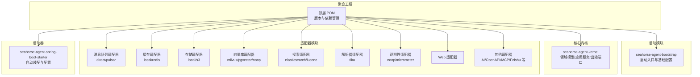
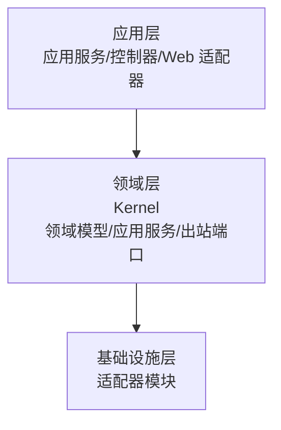
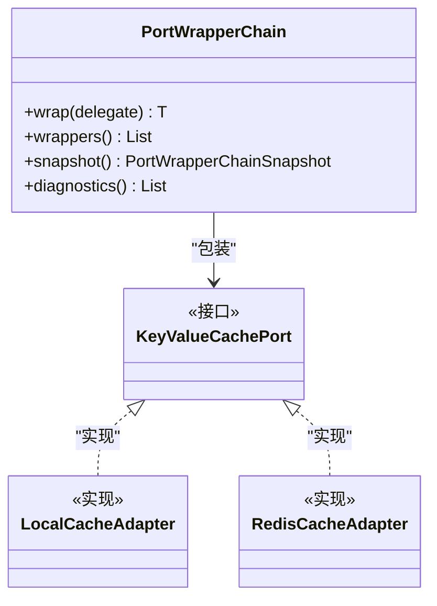
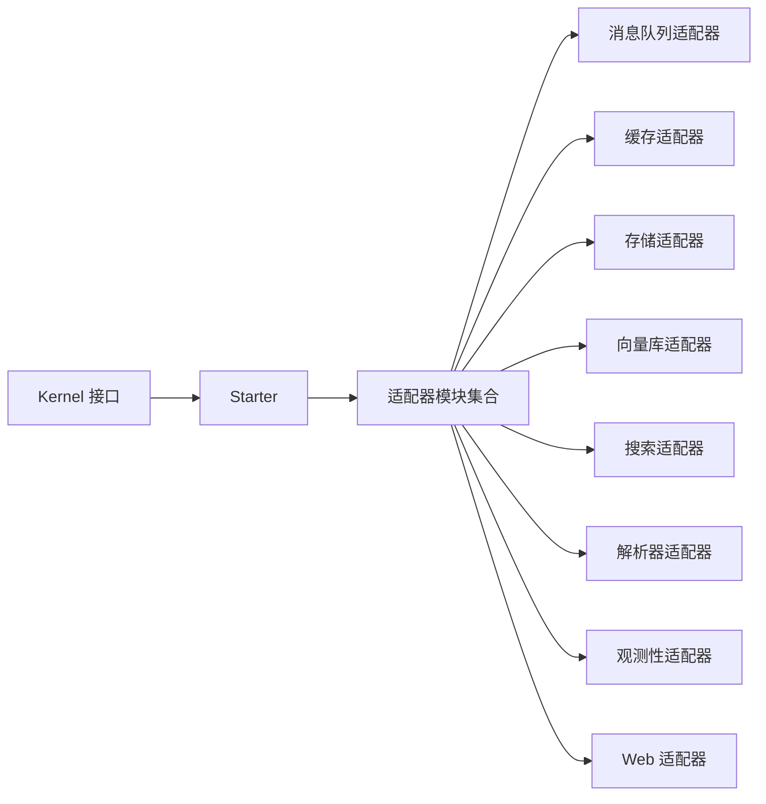
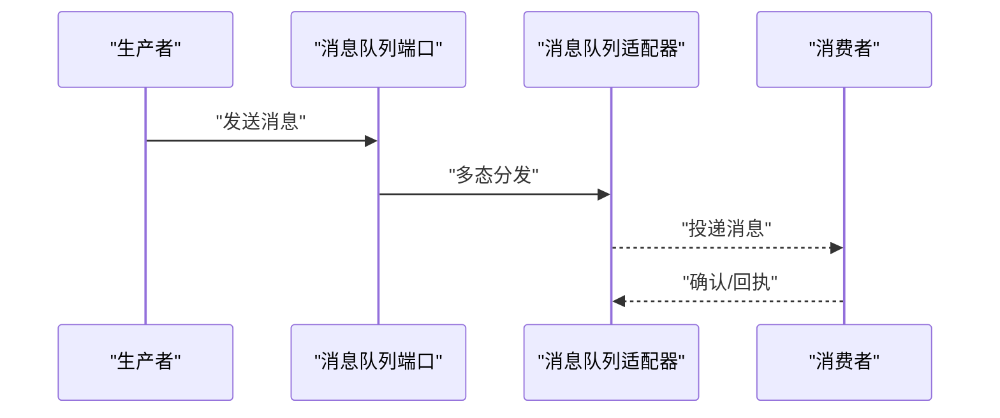
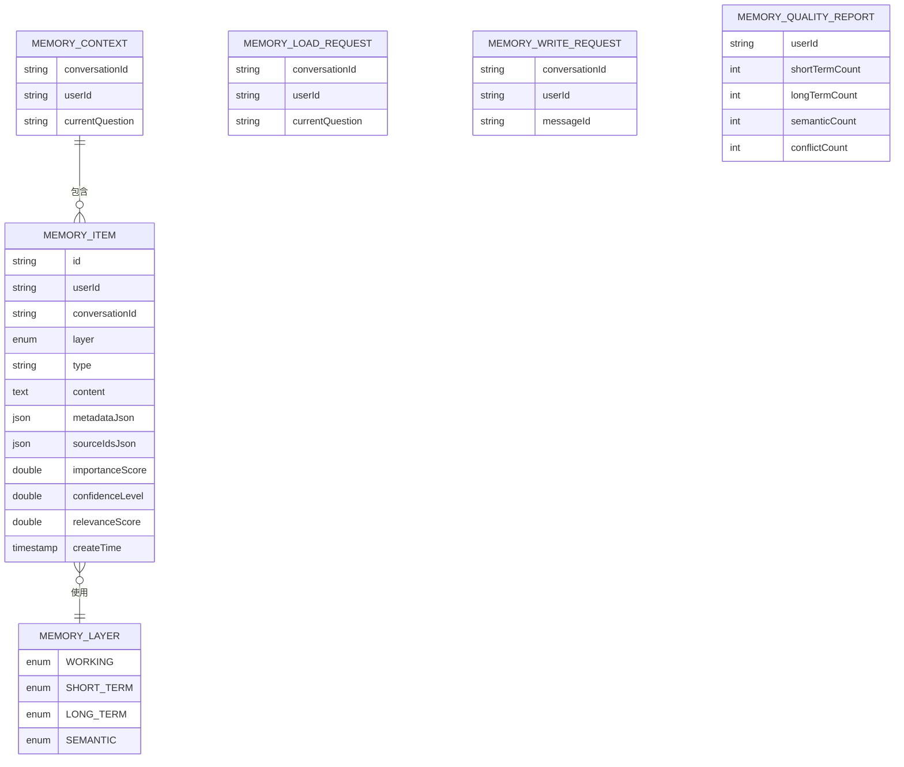
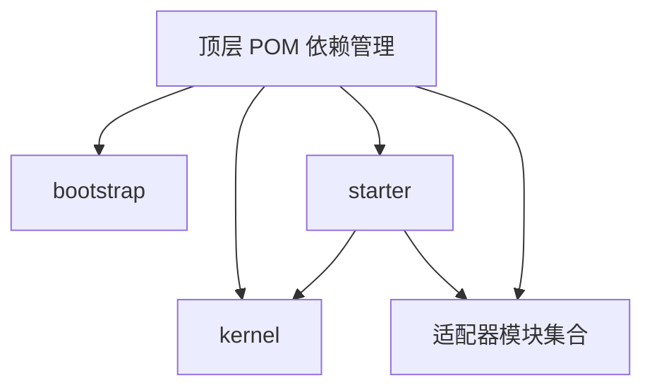

# 架构设计

<cite>
**本文引用的文件**
- [pom.xml](file://pom.xml)
- [SeahorseAgentApplication.java](file://seahorse-agent-bootstrap/src/main/java/com/miracle/ai/seahorse/agent/SeahorseAgentApplication.java)
- [seahorse-agent-kernel 模块 pom.xml](file://seahorse-agent-kernel/pom.xml)
- [seahorse-agent-spring-boot-starter 模块 pom.xml](file://seahorse-agent-spring-boot-starter/pom.xml)
- [application.properties](file://seahorse-agent-spring-boot-starter/src/main/resources/application.properties)
- [package-info.java（内核领域包）](file://seahorse-agent-kernel/src/main/java/com/miracle/ai/seahorse/agent/kernel/domain/agent/approval/package-info.java)
- [package-info.java（内核领域包）](file://seahorse-agent-kernel/src/main/java/com/miracle/ai/seahorse/agent/kernel/domain/agent/context/package-info.java)
- [package-info.java（内核领域包）](file://seahorse-agent-kernel/src/main/java/com/miracle/ai/seahorse/agent/kernel/domain/agent/runtime/package-info.java)
- [PortWrapperChain.java](file://seahorse-agent-kernel/src/main/java/com/miracle/ai/seahorse/agent/kernel/plugin/wrapper/PortWrapperChain.java)
- [JdbcShortTermMemoryRepositoryAdapter.java](file://seahorse-agent-adapter-repository-jdbc/src/main/java/com/miracle/ai/seahorse/agent/adapters/repository/jdbc/JdbcShortTermMemoryRepositoryAdapter.java)
- [JdbcMemoryGraphRepositoryAdapter.java](file://seahorse-agent-adapter-repository-jdbc/src/main/java/com/miracle/ai/seahorse/agent/adapters/repository/jdbc/JdbcMemoryGraphRepositoryAdapter.java)
- [内存管理领域模型.md](file://docs/zh/content/后端系统/核心内核/领域模型/内存管理领域模型.md)
- [端口适配器模式.md](file://docs/zh/content/架构设计/端口适配器模式.md)
- [出站端口.md](file://docs/zh/content/后端系统/核心内核/端口接口/出站端口/出站端口.md)
- [缓存出站端口.md](file://docs/zh/content/后端系统/核心内核/端口接口/出站端口/缓存出站端口.md)
- [出站端口-时序图](file://docs/zh/content/后端系统/核心内核/端口接口/出站端口/其他出站端口.md)
</cite>

## 目录
1. [引言](#引言)
2. [项目结构](#项目结构)
3. [核心组件](#核心组件)
4. [架构总览](#架构总览)
5. [详细组件分析](#详细组件分析)
6. [依赖分析](#依赖分析)
7. [性能考虑](#性能考虑)
8. [故障排查指南](#故障排查指南)
9. [结论](#结论)
10. [附录](#附录)

## 引言
本文件面向 Seahorse Agent 的架构设计，系统性阐述 Clean Architecture 在项目中的落地实践，包括分层架构、端口适配器模式、插件化设计与 Spring Boot Starter 机制。文档同时解释微服务化设计原则、模块间依赖关系与通信机制，以及事件驱动架构与消息队列的异步处理模式。通过对内核 Kernel、适配器 Adapter 与启动器 Starter 的职责划分，帮助读者建立对系统边界、组件交互与数据流向的完整认知。

## 项目结构
Seahorse Agent 采用多模块 Maven 聚合工程组织，顶层 pom.xml 定义版本与依赖管理，核心模块包括：
- 启动模块：seahorse-agent-bootstrap，负责应用启动入口与基础配置
- 内核模块：seahorse-agent-kernel，提供领域模型、应用服务与出站端口接口
- 适配器模块：覆盖 MQ、缓存、存储、向量库、搜索、解析器、观察等多类外部系统
- 启动器模块：seahorse-agent-spring-boot-starter，整合内核与适配器，提供自动装配与配置



图表来源
- [pom.xml:38-66](file://pom.xml#L38-L66)
- [seahorse-agent-spring-boot-starter 模块 pom.xml:18-137](file://seahorse-agent-spring-boot-starter/pom.xml#L18-L137)

章节来源
- [pom.xml:38-66](file://pom.xml#L38-L66)
- [seahorse-agent-bootstrap 模块 pom.xml](file://seahorse-agent-bootstrap/pom.xml)

## 核心组件
- 启动入口与扫描范围
  - 启动类限定扫描包与排除特定自动配置，确保应用启动路径可控
- 内核 Kernel
  - 提供领域模型、应用服务与出站端口接口，屏蔽外部系统差异
  - 插件化包装链 PortWrapperChain 支持对端口实现进行装饰与增强
- 适配器 Adapters
  - 通过 SPI/META-INF 配置实现与接口解耦，支持本地与远端实现切换
  - 覆盖缓存、消息队列、存储、向量检索、搜索、解析、观测、MCP 等
- 启动器 Starter
  - 将内核与常用适配器打包，提供自动装配与默认配置

章节来源
- [SeahorseAgentApplication.java:31-35](file://seahorse-agent-bootstrap/src/main/java/com/miracle/ai/seahorse/agent/SeahorseAgentApplication.java#L31-L35)
- [PortWrapperChain.java:37-76](file://seahorse-agent-kernel/src/main/java/com/miracle/ai/seahorse/agent/kernel/plugin/wrapper/PortWrapperChain.java#L37-L76)
- [seahorse-agent-kernel 模块 pom.xml:25-47](file://seahorse-agent-kernel/pom.xml#L25-L47)
- [seahorse-agent-spring-boot-starter 模块 pom.xml:18-137](file://seahorse-agent-spring-boot-starter/pom.xml#L18-L137)

## 架构总览
Clean Architecture 在本项目中的体现：
- 分层职责
  - 应用层：应用服务编排业务流程，调用领域服务与出站端口
  - 领域层：内核 Kernel 定义领域模型与不变规则，保持与外部系统解耦
  - 基础设施层：适配器模块对接外部系统，通过端口接口向上提供能力
- 端口适配器模式
  - 出站端口抽象外部依赖域，适配器实现通过 SPI 注入，实现配置驱动的替换
- 插件化设计
  - 通过 PortWrapperChain 对端口实现进行包装，支持诊断、排序与链式增强
- 微服务化原则
  - 以端口为边界，模块间通过接口契约通信，避免直接耦合
  - 适配器模块可独立演进与替换，便于水平扩展

```mermaid
graph TB
subgraph "应用层"
APP["应用服务/控制器"]
END
subgraph "领域层"
KERNEL["内核 Kernel<br/>领域模型/应用服务/出站端口"]
END
subgraph "基础设施层"
MQ["消息队列适配器"]
CACHE["缓存适配器"]
STORAGE["存储适配器"]
VECTOR["向量库适配器"]
SEARCH["搜索适配器"]
PARSER["解析器适配器"]
OBS["观测性适配器"]
WEB["Web 适配器"]
END
APP --> KERNEL
KERNEL --> MQ
KERNEL --> CACHE
KERNEL --> STORAGE
KERNEL --> VECTOR
KERNEL --> SEARCH
KERNEL --> PARSER
KERNEL --> OBS
KERNEL --> WEB
```

图表来源
- [出站端口.md:58-81](file://docs/zh/content/后端系统/核心内核/端口接口/出站端口/出站端口.md#L58-L81)
- [seahorse-agent-spring-boot-starter 模块 pom.xml:18-137](file://seahorse-agent-spring-boot-starter/pom.xml#L18-L137)

## 详细组件分析

### Clean Architecture 层次与职责
- 应用层
  - 负责编排业务流程，接收用户输入，调用领域服务与出站端口
  - 通过 Web 适配器对外提供 HTTP 接口
- 领域层
  - Kernel 定义领域模型与不变规则，提供应用服务与出站端口接口
  - 通过包结构体现领域子域：审批、上下文、运行时等
- 基础设施层
  - 适配器模块对接外部系统，实现端口接口
  - 通过 SPI/META-INF 配置实现与接口解耦



图表来源
- [出站端口.md:52-56](file://docs/zh/content/后端系统/核心内核/端口接口/出站端口/出站端口.md#L52-L56)
- [package-info.java（内核领域包）:18-21](file://seahorse-agent-kernel/src/main/java/com/miracle/ai/seahorse/agent/kernel/domain/agent/approval/package-info.java#L18-L21)
- [package-info.java（内核领域包）:18-21](file://seahorse-agent-kernel/src/main/java/com/miracle/ai/seahorse/agent/kernel/domain/agent/context/package-info.java#L18-L21)
- [package-info.java（内核领域包）:18-21](file://seahorse-agent-kernel/src/main/java/com/miracle/ai/seahorse/agent/kernel/domain/agent/runtime/package-info.java#L18-L21)

章节来源
- [出站端口.md:52-56](file://docs/zh/content/后端系统/核心内核/端口接口/出站端口/出站端口.md#L52-L56)
- [package-info.java（内核领域包）:18-21](file://seahorse-agent-kernel/src/main/java/com/miracle/ai/seahorse/agent/kernel/domain/agent/approval/package-info.java#L18-L21)
- [package-info.java（内核领域包）:18-21](file://seahorse-agent-kernel/src/main/java/com/miracle/ai/seahorse/agent/kernel/domain/agent/context/package-info.java#L18-L21)
- [package-info.java（内核领域包）:18-21](file://seahorse-agent-kernel/src/main/java/com/miracle/ai/seahorse/agent/kernel/domain/agent/runtime/package-info.java#L18-L21)

### 端口适配器模式与插件化设计
- 端口接口
  - 出站端口抽象外部依赖域，如缓存、消息队列、存储、向量检索、MCP 等
  - 入站端口负责协议转换与编排转发
- 适配器实现
  - 通过 SPI/META-INF 配置注册，运行时按需加载
  - 支持本地与远端实现并存，实现配置驱动的替换
- 插件化包装链
  - PortWrapperChain 支持对端口实现进行装饰与增强，提供诊断与排序能力



图表来源
- [PortWrapperChain.java:37-76](file://seahorse-agent-kernel/src/main/java/com/miracle/ai/seahorse/agent/kernel/plugin/wrapper/PortWrapperChain.java#L37-L76)
- [缓存出站端口.md:374-378](file://docs/zh/content/后端系统/核心内核/端口接口/出站端口/缓存出站端口.md#L374-L378)

章节来源
- [端口适配器模式.md:125-139](file://docs/zh/content/架构设计/端口适配器模式.md#L125-L139)
- [缓存出站端口.md:364-378](file://docs/zh/content/后端系统/核心内核/端口接口/出站端口/缓存出站端口.md#L364-L378)
- [PortWrapperChain.java:37-76](file://seahorse-agent-kernel/src/main/java/com/miracle/ai/seahorse/agent/kernel/plugin/wrapper/PortWrapperChain.java#L37-L76)

### Spring Boot Starter 机制
- 组合与装配
  - Starter 将内核与常用适配器作为依赖，提供自动装配入口
  - 默认配置通过 application.properties 提供，支持开关与参数控制
- 依赖管理
  - 顶层 POM 管理 Spring Boot 版本与第三方依赖，确保一致性
  - 各适配器模块独立构建，通过 Starter 聚合使用



图表来源
- [seahorse-agent-spring-boot-starter 模块 pom.xml:18-137](file://seahorse-agent-spring-boot-starter/pom.xml#L18-L137)
- [application.properties:1-8](file://seahorse-agent-spring-boot-starter/src/main/resources/application.properties#L1-L8)

章节来源
- [seahorse-agent-spring-boot-starter 模块 pom.xml:18-137](file://seahorse-agent-spring-boot-starter/pom.xml#L18-L137)
- [application.properties:1-8](file://seahorse-agent-spring-boot-starter/src/main/resources/application.properties#L1-L8)
- [pom.xml:68-189](file://pom.xml#L68-L189)

### 事件驱动架构与消息队列异步处理
- 端口抽象
  - MessageQueuePort 抽象消息队列能力，适配器实现支持直连与 Pulsar
- 异步处理
  - 通过消息队列实现生产者与消费者解耦，支持任务投递、事件广播与后台处理
- 配置与选择
  - 适配器通过 SPI 注册，运行时根据配置选择具体实现



图表来源
- [出站端口-时序图:149-167](file://docs/zh/content/后端系统/核心内核/端口接口/出站端口/其他出站端口.md#L149-L167)
- [seahorse-agent-spring-boot-starter 模块 pom.xml:30-39](file://seahorse-agent-spring-boot-starter/pom.xml#L30-L39)

章节来源
- [出站端口-时序图:149-167](file://docs/zh/content/后端系统/核心内核/端口接口/出站端口/其他出站端口.md#L149-L167)
- [seahorse-agent-spring-boot-starter 模块 pom.xml:30-39](file://seahorse-agent-spring-boot-starter/pom.xml#L30-L39)

### 数据模型与内存管理
- 领域模型
  - MemoryContext、MemoryItem、MemoryLayer、MemoryLoadRequest、MemoryWriteRequest、MemoryQualityReport 等
- 关系与约束
  - MemoryContext 聚合多种内存层，MemoryItem 使用枚举标识层别
- 存储适配
  - JDBC 适配器实现内存读写、图谱关联与租户隔离逻辑



图表来源
- [内存管理领域模型.md:218-276](file://docs/zh/content/后端系统/核心内核/领域模型/内存管理领域模型.md#L218-L276)

章节来源
- [内存管理领域模型.md:218-276](file://docs/zh/content/后端系统/核心内核/领域模型/内存管理领域模型.md#L218-L276)
- [JdbcShortTermMemoryRepositoryAdapter.java:162-195](file://seahorse-agent-adapter-repository-jdbc/src/main/java/com/miracle/ai/seahorse/agent/adapters/repository/jdbc/JdbcShortTermMemoryRepositoryAdapter.java#L162-L195)
- [JdbcMemoryGraphRepositoryAdapter.java:313-355](file://seahorse-agent-adapter-repository-jdbc/src/main/java/com/miracle/ai/seahorse/agent/adapters/repository/jdbc/JdbcMemoryGraphRepositoryAdapter.java#L313-L355)

## 依赖分析
- 顶层依赖管理
  - 通过 Spring Boot BOM 与 Tika BOM 管理版本，统一第三方依赖
- 模块间依赖
  - Starter 依赖 Kernel 与各类适配器，形成“内核 + 外部系统”的组合
  - Bootstrap 仅引入 Starter 与基础依赖，避免扫描无关包
- 运行时装配
  - 适配器通过 SPI/META-INF 注册，运行时按需加载



图表来源
- [pom.xml:68-189](file://pom.xml#L68-L189)
- [seahorse-agent-spring-boot-starter 模块 pom.xml:18-137](file://seahorse-agent-spring-boot-starter/pom.xml#L18-L137)

章节来源
- [pom.xml:68-189](file://pom.xml#L68-L189)
- [seahorse-agent-spring-boot-starter 模块 pom.xml:18-137](file://seahorse-agent-spring-boot-starter/pom.xml#L18-L137)

## 性能考虑
- 端口实现的可观测性
  - 观测性适配器提供指标采集与告警，建议为关键端口启用
- 缓存与限流
  - 缓存适配器支持本地与 Redis 实现，结合速率限制端口提升吞吐
- 异步与解耦
  - 消息队列适配器支持异步处理，降低请求延迟与峰值压力
- 存储与索引
  - 向量库与搜索适配器的选择需结合数据规模与查询复杂度评估

## 故障排查指南
- 端口实现缺失或加载失败
  - 检查 SPI/META-INF 注册文件是否存在，确认适配器模块已加入 Starter 依赖
- 端口包装链诊断
  - 利用 PortWrapperChain 的诊断能力，定位包装器顺序与透传配置问题
- 数据访问异常
  - JDBC 适配器涉及租户隔离与字段映射，检查元数据与租户 ID 规范

章节来源
- [缓存出站端口.md:364-378](file://docs/zh/content/后端系统/核心内核/端口接口/出站端口/缓存出站端口.md#L364-L378)
- [PortWrapperChain.java:64-71](file://seahorse-agent-kernel/src/main/java/com/miracle/ai/seahorse/agent/kernel/plugin/wrapper/PortWrapperChain.java#L64-L71)
- [JdbcMemoryGraphRepositoryAdapter.java:351-355](file://seahorse-agent-adapter-repository-jdbc/src/main/java/com/miracle/ai/seahorse/agent/adapters/repository/jdbc/JdbcMemoryGraphRepositoryAdapter.java#L351-L355)

## 结论
Seahorse Agent 通过 Clean Architecture 与端口适配器模式实现了内核与外部系统的高内聚低耦合；Spring Boot Starter 将内核与适配器组合，简化了配置与依赖管理；插件化包装链进一步增强了可扩展性与可观测性。消息队列与 JDBC 等适配器展示了事件驱动与持久化的异步处理能力。该架构在保证系统可维护性的同时，提供了灵活的替换与扩展能力，适合在企业级 AI 基础设施场景中持续演进。

## 附录
- 启动入口与扫描范围
  - 启动类限定扫描包与排除特定自动配置，确保应用启动路径可控
- 配置要点
  - Starter 提供默认配置项，可通过 application.properties 调整行为

章节来源
- [SeahorseAgentApplication.java:31-35](file://seahorse-agent-bootstrap/src/main/java/com/miracle/ai/seahorse/agent/SeahorseAgentApplication.java#L31-L35)
- [application.properties:1-8](file://seahorse-agent-spring-boot-starter/src/main/resources/application.properties#L1-L8)