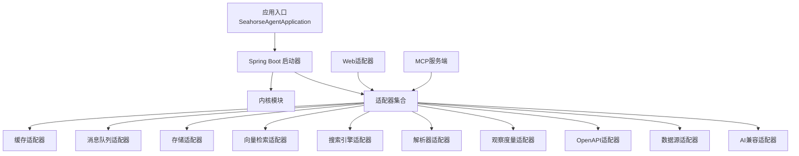
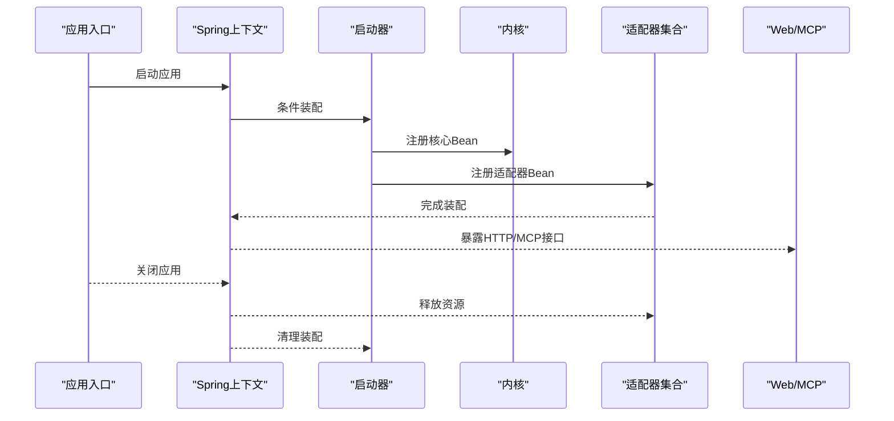
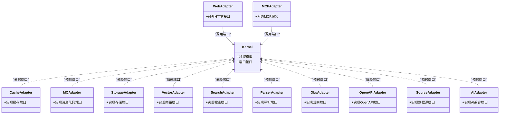
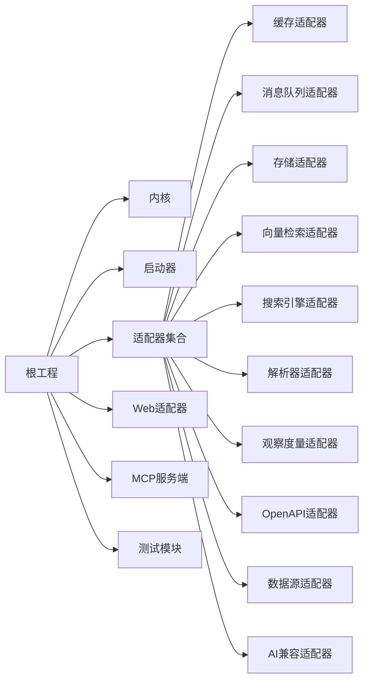

# 模块化设计

<cite>
**本文引用的文件**
- [pom.xml](file://pom.xml)
- [seahorse-agent-spring-boot-starter-all/pom.xml](file://seahorse-agent-spring-boot-starter-all/pom.xml)
- [seahorse-agent-spring-boot-starter-core/pom.xml](file://seahorse-agent-spring-boot-starter-core/pom.xml)
- [seahorse-agent-bootstrap/src/main/java/com/miracle/ai/seahorse/agent/SeahorseAgentApplication.java](file://seahorse-agent-bootstrap/src/main/java/com/miracle/ai/seahorse/agent/SeahorseAgentApplication.java)
- [seahorse-agent-spring-boot-starter/pom.xml](file://seahorse-agent-spring-boot-starter/pom.xml)
- [seahorse-agent-kernel/pom.xml](file://seahorse-agent-kernel/pom.xml)
- [seahorse-agent-adapter-web/pom.xml](file://seahorse-agent-adapter-web/pom.xml)
- [seahorse-agent-adapter-ai-openai-compatible/pom.xml](file://seahorse-agent-adapter-ai-openai-compatible/pom.xml)
- [seahorse-agent-adapter-cache-local/pom.xml](file://seahorse-agent-adapter-cache-local/pom.xml)
- [seahorse-agent-adapter-cache-redis/pom.xml](file://seahorse-agent-adapter-cache-redis/pom.xml)
- [seahorse-agent-adapter-mcp-http/pom.xml](file://seahorse-agent-adapter-mcp-http/pom.xml)
- [seahorse-agent-adapter-mq-direct/pom.xml](file://seahorse-agent-adapter-mq-direct/pom.xml)
- [seahorse-agent-adapter-mq-pulsar/pom.xml](file://seahorse-agent-adapter-mq-pulsar/pom.xml)
- [seahorse-agent-adapter-observation-micrometer/pom.xml](file://seahorse-agent-adapter-observation-micrometer/pom.xml)
- [seahorse-agent-adapter-observation-noop/pom.xml](file://seahorse-agent-adapter-observation-noop/pom.xml)
- [seahorse-agent-adapter-openapi/pom.xml](file://seahorse-agent-adapter-openapi/pom.xml)
- [seahorse-agent-adapter-parser-tika/pom.xml](file://seahorse-agent-adapter-parser-tika/pom.xml)
- [seahorse-agent-adapter-repository-jdbc/pom.xml](file://seahorse-agent-adapter-repository-jdbc/pom.xml)
- [seahorse-agent-adapter-search-elasticsearch/pom.xml](file://seahorse-agent-adapter-search-elasticsearch/pom.xml)
- [seahorse-agent-adapter-search-lucene/pom.xml](file://seahorse-agent-adapter-search-lucene/pom.xml)
- [seahorse-agent-adapter-source-feishu/pom.xml](file://seahorse-agent-adapter-source-feishu/pom.xml)
- [seahorse-agent-adapter-storage-local/pom.xml](file://seahorse-agent-adapter-storage-local/pom.xml)
- [seahorse-agent-adapter-storage-s3/pom.xml](file://seahorse-agent-adapter-storage-s3/pom.xml)
- [seahorse-agent-adapter-vector-milvus/pom.xml](file://seahorse-agent-adapter-vector-milvus/pom.xml)
- [seahorse-agent-adapter-vector-noop/pom.xml](file://seahorse-agent-adapter-vector-noop/pom.xml)
- [seahorse-agent-adapter-vector-pgvector/pom.xml](file://seahorse-agent-adapter-vector-pgvector/pom.xml)
- [seahorse-agent-mcp-server/pom.xml](file://seahorse-agent-mcp-server/pom.xml)
- [seahorse-agent-tests/pom.xml](file://seahorse-agent-tests/pom.xml)
</cite>

## 目录
1. [引言](#引言)
2. [项目结构](#项目结构)
3. [核心组件](#核心组件)
4. [架构总览](#架构总览)
5. [详细组件分析](#详细组件分析)
6. [依赖分析](#依赖分析)
7. [性能考虑](#性能考虑)
8. [故障排查指南](#故障排查指南)
9. [结论](#结论)
10. [附录](#附录)

## 引言
本文件围绕Seahorse Agent的模块化设计展开，目标是系统性梳理66个子模块的组织结构、命名规范、依赖关系与层次结构；阐明Spring Boot Starter机制如何简化模块组合与配置管理（重点对比starter-all与starter-core）；解释模块化带来的独立开发、测试与部署能力；详述模块生命周期（加载顺序、初始化过程、销毁机制）；说明按需启用/禁用功能的实现方式；并提供模块依赖图与模块间通信机制的说明。

## 项目结构
该项目采用多模块Maven工程组织，根pom统一管理版本与插件，各功能域以“适配器”“内核”“启动器”等维度拆分模块。典型模块命名遵循“seahorse-agent-适配器类别-具体实现”的模式，便于识别职责边界与可替换性。

- 根工程：统一版本与插件管理，聚合所有子模块。
- 内核模块：seahorse-agent-kernel，承载核心领域模型与端口定义。
- 适配器模块：覆盖缓存、消息队列、存储、向量检索、观察度量、解析、搜索、OpenAPI、Feishu数据源、Web适配等。
- 启动器模块：seahorse-agent-spring-boot-starter，提供自动装配与条件装配；starter-all与starter-core用于不同装配粒度。
- 其他：bootstrap应用入口、mcp-server、tests等。

```mermaid
graph TB
Root["根工程<br/>pom.xml"] --> Kernel["内核模块<br/>seahorse-agent-kernel"]
Root --> Starter["启动器模块<br/>seahorse-agent-spring-boot-starter"]
Root --> StarterAll["starter-all<br/>聚合装配"]
Root --> StarterCore["starter-core<br/>核心装配"]
Root --> WebAdapter["Web适配器<br/>seahorse-agent-adapter-web"]
Root --> MCP["MCP服务端<br/>seahorse-agent-mcp-server"]
Root --> Tests["测试模块<br/>seahorse-agent-tests"]
subgraph "适配器模块"
CacheLocal["缓存本地<br/>seahorse-agent-adapter-cache-local"]
CacheRedis["缓存Redis<br/>seahorse-agent-adapter-cache-redis"]
MQDirect["消息队列直连<br/>seahorse-agent-adapter-mq-direct"]
MQPulsar["消息队列Pulsar<br/>seahorse-agent-adapter-mq-pulsar"]
StorageLocal["对象存储本地<br/>seahorse-agent-adapter-storage-local"]
StorageS3["对象存储S3<br/>seahorse-agent-adapter-storage-s3"]
VectorMilvus["向量Milvus<br/>seahorse-agent-adapter-vector-milvus"]
VectorPg["向量PgVector<br/>seahorse-agent-adapter-vector-pgvector"]
SearchES["搜索引擎Elasticsearch<br/>seahorse-agent-adapter-search-elasticsearch"]
SearchLucene["搜索引擎Lucene<br/>seahorse-agent-adapter-search-lucene"]
ParserTika["文档解析Tika<br/>seahorse-agent-adapter-parser-tika"]
ObservationMicrometer["观察Micrometer<br/>seahorse-agent-adapter-observation-micrometer"]
ObservationNoop["观察Noop<br/>seahorse-agent-adapter-observation-noop"]
OpenAPI["OpenAPI解析<br/>seahorse-agent-adapter-openapi"]
SourceFeishu["飞书数据源<br/>seahorse-agent-adapter-source-feishu"]
AICompat["AI兼容OpenAI<br/>seahorse-agent-adapter-ai-openai-compatible"]
end
Root --> CacheLocal
Root --> CacheRedis
Root --> MQDirect
Root --> MQPulsar
Root --> StorageLocal
Root --> StorageS3
Root --> VectorMilvus
Root --> VectorPg
Root --> SearchES
Root --> SearchLucene
Root --> ParserTika
Root --> ObservationMicrometer
Root --> ObservationNoop
Root --> OpenAPI
Root --> SourceFeishu
Root --> AICompat
```

图表来源
- [pom.xml](file://pom.xml)
- [seahorse-agent-kernel/pom.xml](file://seahorse-agent-kernel/pom.xml)
- [seahorse-agent-spring-boot-starter/pom.xml](file://seahorse-agent-spring-boot-starter/pom.xml)
- [seahorse-agent-adapter-web/pom.xml](file://seahorse-agent-adapter-web/pom.xml)
- [seahorse-agent-mcp-server/pom.xml](file://seahorse-agent-mcp-server/pom.xml)
- [seahorse-agent-adapter-cache-local/pom.xml](file://seahorse-agent-adapter-cache-local/pom.xml)
- [seahorse-agent-adapter-cache-redis/pom.xml](file://seahorse-agent-adapter-cache-redis/pom.xml)
- [seahorse-agent-adapter-mq-direct/pom.xml](file://seahorse-agent-adapter-mq-direct/pom.xml)
- [seahorse-agent-adapter-mq-pulsar/pom.xml](file://seahorse-agent-adapter-mq-pulsar/pom.xml)
- [seahorse-agent-adapter-storage-local/pom.xml](file://seahorse-agent-adapter-storage-local/pom.xml)
- [seahorse-agent-adapter-storage-s3/pom.xml](file://seahorse-agent-adapter-storage-s3/pom.xml)
- [seahorse-agent-adapter-vector-milvus/pom.xml](file://seahorse-agent-adapter-vector-milvus/pom.xml)
- [seahorse-agent-adapter-vector-pgvector/pom.xml](file://seahorse-agent-adapter-vector-pgvector/pom.xml)
- [seahorse-agent-adapter-search-elasticsearch/pom.xml](file://seahorse-agent-adapter-search-elasticsearch/pom.xml)
- [seahorse-agent-adapter-search-lucene/pom.xml](file://seahorse-agent-adapter-search-lucene/pom.xml)
- [seahorse-agent-adapter-parser-tika/pom.xml](file://seahorse-agent-adapter-parser-tika/pom.xml)
- [seahorse-agent-adapter-observation-micrometer/pom.xml](file://seahorse-agent-adapter-observation-micrometer/pom.xml)
- [seahorse-agent-adapter-observation-noop/pom.xml](file://seahorse-agent-adapter-observation-noop/pom.xml)
- [seahorse-agent-adapter-openapi/pom.xml](file://seahorse-agent-adapter-openapi/pom.xml)
- [seahorse-agent-adapter-source-feishu/pom.xml](file://seahorse-agent-adapter-source-feishu/pom.xml)
- [seahorse-agent-adapter-ai-openai-compatible/pom.xml](file://seahorse-agent-adapter-ai-openai-compatible/pom.xml)

章节来源
- [pom.xml](file://pom.xml)

## 核心组件
- 内核模块（kernel）：定义领域模型与端口接口，作为所有适配器的契约层，确保业务逻辑与外部实现解耦。
- 启动器模块（spring-boot-starter）：提供自动装配与条件装配，封装常见配置与Bean注册，降低接入成本。
- starter-all：聚合装配所有常用适配器，适合快速集成与演示。
- starter-core：仅装配核心必需组件，适合按需裁剪与最小化依赖。
- Bootstrap应用：应用入口类，负责引导Spring Boot上下文与模块加载。

章节来源
- [seahorse-agent-kernel/pom.xml](file://seahorse-agent-kernel/pom.xml)
- [seahorse-agent-spring-boot-starter/pom.xml](file://seahorse-agent-spring-boot-starter/pom.xml)
- [seahorse-agent-spring-boot-starter-all/pom.xml](file://seahorse-agent-spring-boot-starter-all/pom.xml)
- [seahorse-agent-spring-boot-starter-core/pom.xml](file://seahorse-agent-spring-boot-starter-core/pom.xml)
- [seahorse-agent-bootstrap/src/main/java/com/miracle/ai/seahorse/agent/SeahorseAgentApplication.java](file://seahorse-agent-bootstrap/src/main/java/com/miracle/ai/seahorse/agent/SeahorseAgentApplication.java)

## 架构总览
下图展示模块化架构中各层的职责与交互关系：Bootstrap负责应用启动；Kernel提供领域与端口；Starter负责装配；各Adapter实现端口契约；Web/MCP作为对外接口层。

图表来源
- [seahorse-agent-bootstrap/src/main/java/com/miracle/ai/seahorse/agent/SeahorseAgentApplication.java](file://seahorse-agent-bootstrap/src/main/java/com/miracle/ai/seahorse/agent/SeahorseAgentApplication.java)
- [seahorse-agent-spring-boot-starter/pom.xml](file://seahorse-agent-spring-boot-starter/pom.xml)
- [seahorse-agent-kernel/pom.xml](file://seahorse-agent-kernel/pom.xml)
- [seahorse-agent-adapter-web/pom.xml](file://seahorse-agent-adapter-web/pom.xml)
- [seahorse-agent-mcp-server/pom.xml](file://seahorse-agent-mcp-server/pom.xml)

## 详细组件分析

### Spring Boot Starter机制与装配策略
- 自动装配原理：通过条件注解与META-INF/spring配置，按需注册Bean，避免硬编码配置。
- starter-all：聚合装配常见适配器，适合快速搭建原型或演示环境。
- starter-core：仅装配核心必要组件，适合生产环境按需裁剪，减少依赖与攻击面。
- 使用建议：
  - 新项目或Demo：优先选择starter-all，快速验证功能。
  - 生产部署：基于starter-core，结合实际需求引入特定适配器，控制依赖范围。

章节来源
- [seahorse-agent-spring-boot-starter/pom.xml](file://seahorse-agent-spring-boot-starter/pom.xml)
- [seahorse-agent-spring-boot-starter-all/pom.xml](file://seahorse-agent-spring-boot-starter-all/pom.xml)
- [seahorse-agent-spring-boot-starter-core/pom.xml](file://seahorse-agent-spring-boot-starter-core/pom.xml)

### 模块命名规范与职责划分
- 命名规范：seahorse-agent-适配器类别-具体实现，例如“adapter-cache-redis”“adapter-vector-milvus”“adapter-repository-jdbc”等。
- 职责划分：
  - 缓存：Local/Redis，提供键值缓存、发布订阅、限流、分布式锁/信号量等端口实现。
  - 消息队列：Direct/Pulsar，提供消息队列端口实现。
  - 存储：Local/S3，提供对象存储端口实现。
  - 向量检索：Milvus/PgVector/Noop，提供向量集合管理、索引、检索端口实现。
  - 搜索引擎：Elasticsearch/Lucene，提供关键词索引与搜索端口实现。
  - 解析器：Tika，提供文档解析端口实现。
  - 观察度量：Micrometer/Noop，提供观测端口实现。
  - OpenAPI：提供规范解析与工具注册支持。
  - 数据源：Feishu，提供文档抓取与数据源装配。
  - AI兼容：OpenAI兼容，提供LLM与工具调用适配。
  - Web/MCP：对外HTTP接口与MCP服务端。

章节来源
- [seahorse-agent-adapter-cache-local/pom.xml](file://seahorse-agent-adapter-cache-local/pom.xml)
- [seahorse-agent-adapter-cache-redis/pom.xml](file://seahorse-agent-adapter-cache-redis/pom.xml)
- [seahorse-agent-adapter-mq-direct/pom.xml](file://seahorse-agent-adapter-mq-direct/pom.xml)
- [seahorse-agent-adapter-mq-pulsar/pom.xml](file://seahorse-agent-adapter-mq-pulsar/pom.xml)
- [seahorse-agent-adapter-storage-local/pom.xml](file://seahorse-agent-adapter-storage-local/pom.xml)
- [seahorse-agent-adapter-storage-s3/pom.xml](file://seahorse-agent-adapter-storage-s3/pom.xml)
- [seahorse-agent-adapter-vector-milvus/pom.xml](file://seahorse-agent-adapter-vector-milvus/pom.xml)
- [seahorse-agent-adapter-vector-pgvector/pom.xml](file://seahorse-agent-adapter-vector-pgvector/pom.xml)
- [seahorse-agent-adapter-vector-noop/pom.xml](file://seahorse-agent-adapter-vector-noop/pom.xml)
- [seahorse-agent-adapter-search-elasticsearch/pom.xml](file://seahorse-agent-adapter-search-elasticsearch/pom.xml)
- [seahorse-agent-adapter-search-lucene/pom.xml](file://seahorse-agent-adapter-search-lucene/pom.xml)
- [seahorse-agent-adapter-parser-tika/pom.xml](file://seahorse-agent-adapter-parser-tika/pom.xml)
- [seahorse-agent-adapter-observation-micrometer/pom.xml](file://seahorse-agent-adapter-observation-micrometer/pom.xml)
- [seahorse-agent-adapter-observation-noop/pom.xml](file://seahorse-agent-adapter-observation-noop/pom.xml)
- [seahorse-agent-adapter-openapi/pom.xml](file://seahorse-agent-adapter-openapi/pom.xml)
- [seahorse-agent-adapter-source-feishu/pom.xml](file://seahorse-agent-adapter-source-feishu/pom.xml)
- [seahorse-agent-adapter-ai-openai-compatible/pom.xml](file://seahorse-agent-adapter-ai-openai-compatible/pom.xml)
- [seahorse-agent-adapter-web/pom.xml](file://seahorse-agent-adapter-web/pom.xml)
- [seahorse-agent-mcp-server/pom.xml](file://seahorse-agent-mcp-server/pom.xml)

### 模块生命周期管理
- 加载顺序：由Spring容器根据依赖与条件装配顺序加载。通常遵循“内核→启动器→适配器→Web/MCP”的顺序。
- 初始化过程：启动器通过条件装配注册Bean；适配器根据端口契约绑定实现；Web/MCP在上下文就绪后暴露接口。
- 销毁机制：Spring容器关闭时，按相反顺序销毁Bean与资源，确保连接释放与清理。

图表来源
- [seahorse-agent-bootstrap/src/main/java/com/miracle/ai/seahorse/agent/SeahorseAgentApplication.java](file://seahorse-agent-bootstrap/src/main/java/com/miracle/ai/seahorse/agent/SeahorseAgentApplication.java)
- [seahorse-agent-spring-boot-starter/pom.xml](file://seahorse-agent-spring-boot-starter/pom.xml)
- [seahorse-agent-kernel/pom.xml](file://seahorse-agent-kernel/pom.xml)
- [seahorse-agent-adapter-web/pom.xml](file://seahorse-agent-adapter-web/pom.xml)
- [seahorse-agent-mcp-server/pom.xml](file://seahorse-agent-mcp-server/pom.xml)

### 模块间通信机制
- 端口契约：Kernel定义端口接口，适配器实现端口，实现“面向接口编程”，屏蔽实现细节。
- 依赖注入：通过Spring容器注入端口实例，适配器实现可热替换。
- 事件与消息：消息队列适配器提供异步通信通道；缓存适配器提供发布订阅与分布式协调能力。
- 外部协议：MCP服务端与HTTP/Web适配器提供对外接口，适配器内部通过端口与内核交互。

图表来源
- [seahorse-agent-kernel/pom.xml](file://seahorse-agent-kernel/pom.xml)
- [seahorse-agent-adapter-cache-local/pom.xml](file://seahorse-agent-adapter-cache-local/pom.xml)
- [seahorse-agent-adapter-mq-direct/pom.xml](file://seahorse-agent-adapter-mq-direct/pom.xml)
- [seahorse-agent-adapter-storage-local/pom.xml](file://seahorse-agent-adapter-storage-local/pom.xml)
- [seahorse-agent-adapter-vector-milvus/pom.xml](file://seahorse-agent-adapter-vector-milvus/pom.xml)
- [seahorse-agent-adapter-search-elasticsearch/pom.xml](file://seahorse-agent-adapter-search-elasticsearch/pom.xml)
- [seahorse-agent-adapter-parser-tika/pom.xml](file://seahorse-agent-adapter-parser-tika/pom.xml)
- [seahorse-agent-adapter-observation-micrometer/pom.xml](file://seahorse-agent-adapter-observation-micrometer/pom.xml)
- [seahorse-agent-adapter-openapi/pom.xml](file://seahorse-agent-adapter-openapi/pom.xml)
- [seahorse-agent-adapter-source-feishu/pom.xml](file://seahorse-agent-adapter-source-feishu/pom.xml)
- [seahorse-agent-adapter-ai-openai-compatible/pom.xml](file://seahorse-agent-adapter-ai-openai-compatible/pom.xml)
- [seahorse-agent-adapter-web/pom.xml](file://seahorse-agent-adapter-web/pom.xml)
- [seahorse-agent-mcp-server/pom.xml](file://seahorse-agent-mcp-server/pom.xml)

### 按需启用/禁用功能
- 通过starter-core与starter-all选择装配范围。
- 在应用配置中开启/关闭特定适配器（如禁用某些观察或存储适配器）。
- 使用条件装配与Profile隔离不同环境下的功能集。

章节来源
- [seahorse-agent-spring-boot-starter-all/pom.xml](file://seahorse-agent-spring-boot-starter-all/pom.xml)
- [seahorse-agent-spring-boot-starter-core/pom.xml](file://seahorse-agent-spring-boot-starter-core/pom.xml)

## 依赖分析
- 组织结构：根pom统一管理版本与插件；各模块独立打包，通过依赖声明建立模块间关系。
- 依赖方向：适配器依赖内核端口；启动器聚合适配器；Web/MCP依赖适配器与内核。
- 可能的循环依赖：通过端口契约与分层设计避免循环依赖；若出现，应调整端口边界或拆分模块。

图表来源
- [pom.xml](file://pom.xml)
- [seahorse-agent-kernel/pom.xml](file://seahorse-agent-kernel/pom.xml)
- [seahorse-agent-spring-boot-starter/pom.xml](file://seahorse-agent-spring-boot-starter/pom.xml)
- [seahorse-agent-adapter-web/pom.xml](file://seahorse-agent-adapter-web/pom.xml)
- [seahorse-agent-mcp-server/pom.xml](file://seahorse-agent-mcp-server/pom.xml)
- [seahorse-agent-tests/pom.xml](file://seahorse-agent-tests/pom.xml)

章节来源
- [pom.xml](file://pom.xml)

## 性能考虑
- 模块化带来的收益：按需装配减少内存占用与启动时间；适配器可替换便于针对性能瓶颈进行优化。
- 依赖裁剪：生产环境建议使用starter-core，仅保留必要适配器。
- 并发与限流：缓存与限流适配器提供并发控制与流量治理能力。
- 观测与指标：Micrometer适配器提供性能指标采集，便于定位性能问题。

## 故障排查指南
- 启动失败：检查启动器装配是否正确、端口实现是否齐全、配置文件是否缺失。
- 适配器不生效：确认条件装配与Profile设置、依赖是否正确引入。
- 运行时异常：查看观察度量输出与日志，定位具体适配器实现的问题。
- 测试验证：利用各适配器对应的测试模块验证功能与边界行为。

章节来源
- [seahorse-agent-tests/pom.xml](file://seahorse-agent-tests/pom.xml)

## 结论
Seahorse Agent通过清晰的模块化设计实现了高内聚、低耦合的系统架构。内核端口契约确保实现可替换，Spring Boot Starter简化了装配与配置，按需启用/禁用机制提升了灵活性与可维护性。配合完善的生命周期管理与通信机制，模块化设计为独立开发、测试与部署提供了坚实基础。

## 附录
- 66个子模块清单（按模块类型分类）
  - 缓存适配器：local、redis
  - 消息队列适配器：direct、pulsar
  - 存储适配器：local、s3
  - 向量检索适配器：milvus、pgvector、noop
  - 搜索引擎适配器：elasticsearch、lucene
  - 解析器适配器：tika
  - 观察度量适配器：micrometer、noop
  - OpenAPI适配器：openapi
  - 数据源适配器：feishu
  - AI兼容适配器：ai-openai-compatible
  - Web适配器：web
  - MCP服务端：mcp-server
  - 内核模块：kernel
  - 启动器：spring-boot-starter、starter-all、starter-core
  - 测试模块：tests
  - Bootstrap应用：bootstrap

章节来源
- [pom.xml](file://pom.xml)
- [seahorse-agent-adapter-cache-local/pom.xml](file://seahorse-agent-adapter-cache-local/pom.xml)
- [seahorse-agent-adapter-cache-redis/pom.xml](file://seahorse-agent-adapter-cache-redis/pom.xml)
- [seahorse-agent-adapter-mq-direct/pom.xml](file://seahorse-agent-adapter-mq-direct/pom.xml)
- [seahorse-agent-adapter-mq-pulsar/pom.xml](file://seahorse-agent-adapter-mq-pulsar/pom.xml)
- [seahorse-agent-adapter-storage-local/pom.xml](file://seahorse-agent-adapter-storage-local/pom.xml)
- [seahorse-agent-adapter-storage-s3/pom.xml](file://seahorse-agent-adapter-storage-s3/pom.xml)
- [seahorse-agent-adapter-vector-milvus/pom.xml](file://seahorse-agent-adapter-vector-milvus/pom.xml)
- [seahorse-agent-adapter-vector-pgvector/pom.xml](file://seahorse-agent-adapter-vector-pgvector/pom.xml)
- [seahorse-agent-adapter-vector-noop/pom.xml](file://seahorse-agent-adapter-vector-noop/pom.xml)
- [seahorse-agent-adapter-search-elasticsearch/pom.xml](file://seahorse-agent-adapter-search-elasticsearch/pom.xml)
- [seahorse-agent-adapter-search-lucene/pom.xml](file://seahorse-agent-adapter-search-lucene/pom.xml)
- [seahorse-agent-adapter-parser-tika/pom.xml](file://seahorse-agent-adapter-parser-tika/pom.xml)
- [seahorse-agent-adapter-observation-micrometer/pom.xml](file://seahorse-agent-adapter-observation-micrometer/pom.xml)
- [seahorse-agent-adapter-observation-noop/pom.xml](file://seahorse-agent-adapter-observation-noop/pom.xml)
- [seahorse-agent-adapter-openapi/pom.xml](file://seahorse-agent-adapter-openapi/pom.xml)
- [seahorse-agent-adapter-source-feishu/pom.xml](file://seahorse-agent-adapter-source-feishu/pom.xml)
- [seahorse-agent-adapter-ai-openai-compatible/pom.xml](file://seahorse-agent-adapter-ai-openai-compatible/pom.xml)
- [seahorse-agent-adapter-web/pom.xml](file://seahorse-agent-adapter-web/pom.xml)
- [seahorse-agent-mcp-server/pom.xml](file://seahorse-agent-mcp-server/pom.xml)
- [seahorse-agent-kernel/pom.xml](file://seahorse-agent-kernel/pom.xml)
- [seahorse-agent-spring-boot-starter/pom.xml](file://seahorse-agent-spring-boot-starter/pom.xml)
- [seahorse-agent-spring-boot-starter-all/pom.xml](file://seahorse-agent-spring-boot-starter-all/pom.xml)
- [seahorse-agent-spring-boot-starter-core/pom.xml](file://seahorse-agent-spring-boot-starter-core/pom.xml)
- [seahorse-agent-tests/pom.xml](file://seahorse-agent-tests/pom.xml)