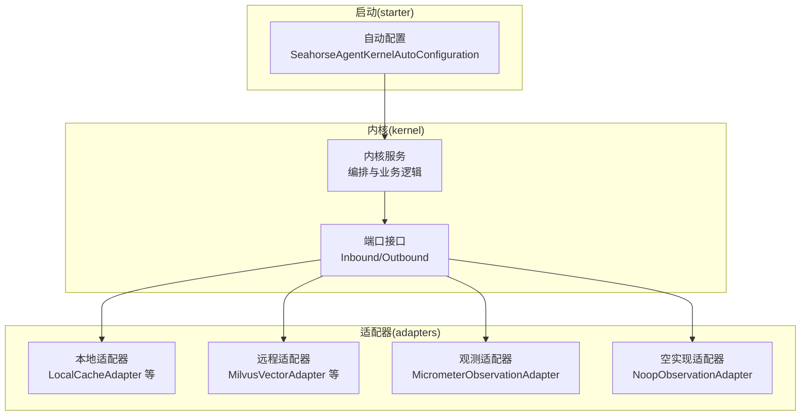
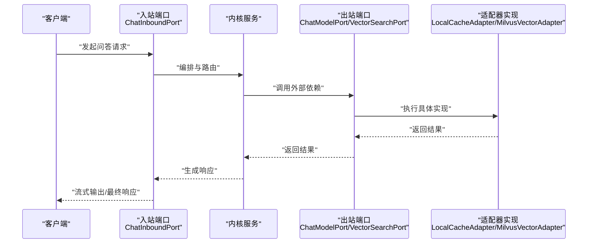
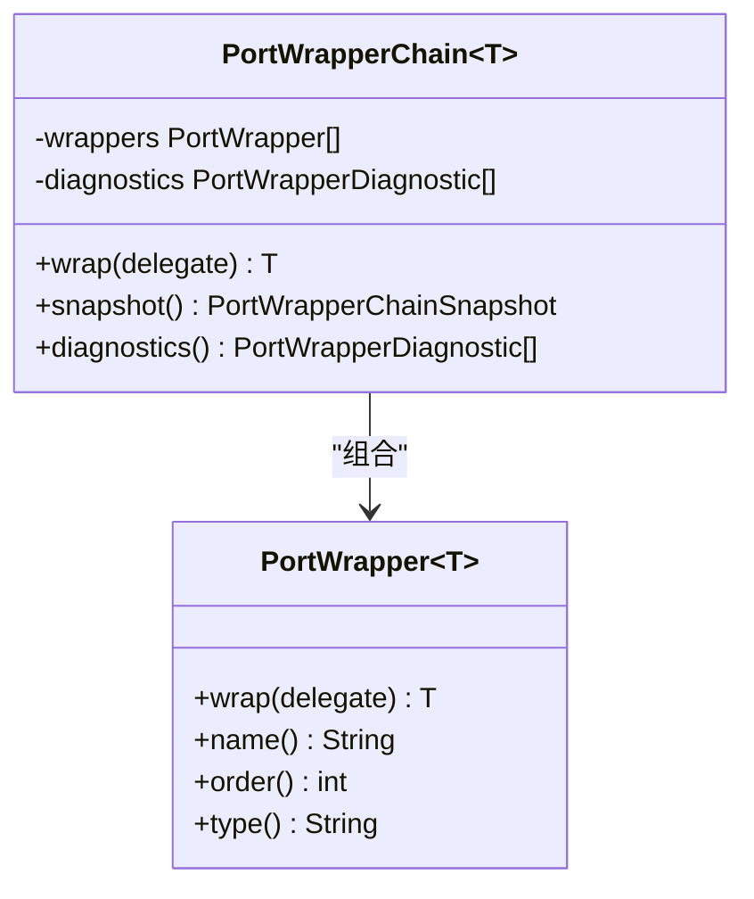
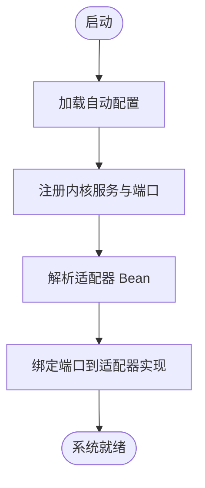
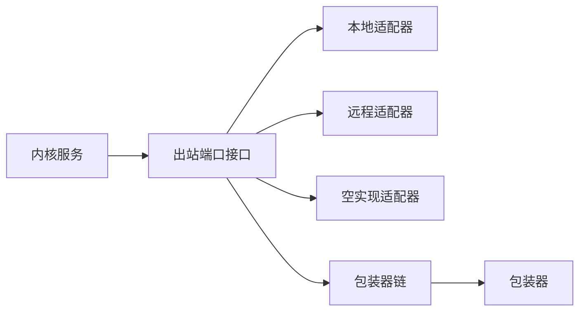

# 端口适配器模式

<cite>
**本文引用的文件**
- [PortWrapperChain.java](file://seahorse-agent-kernel/src/main/java/com/miracle/ai/seahorse/agent/kernel/plugin/wrapper/PortWrapperChain.java)
- [PortWrapper.java](file://seahorse-agent-kernel/src/main/java/com/miracle/ai/seahorse/agent/kernel/plugin/wrapper/PortWrapper.java)
- [ChatInboundPort.java](file://seahorse-agent-kernel/src/main/java/com/miracle/ai/seahorse/agent/ports/inbound/chat/ChatInboundPort.java)
- [ChatModelPort.java](file://seahorse-agent-kernel/src/main/java/com/miracle/ai/seahorse/agent/ports/outbound/model/ChatModelPort.java)
- [KeyValueCachePort.java](file://seahorse-agent-kernel/src/main/java/com/miracle/ai/seahorse/agent/ports/outbound/cache/KeyValueCachePort.java)
- [VectorSearchPort.java](file://seahorse-agent-kernel/src/main/java/com/miracle/ai/seahorse/agent/ports/outbound/vector/VectorSearchPort.java)
- [LocalCacheAdapter.java](file://seahorse-agent-adapter-cache-local/src/main/java/com/miracle/ai/seahorse/agent/adapters/cache/local/LocalCacheAdapter.java)
- [MilvusVectorAdapter.java](file://seahorse-agent-adapter-vector-milvus/src/main/java/com/miracle/ai/seahorse/agent/adapters/vector/milvus/MilvusVectorAdapter.java)
- [MicrometerObservationAdapter.java](file://seahorse-agent-adapter-observation-micrometer/src/main/java/com/miracle/ai/seahorse/agent/adapters/observation/micrometer/MicrometerObservationAdapter.java)
- [NoopObservationAdapter.java](file://seahorse-agent-adapter-observation-noop/src/main/java/com/miracle/ai/seahorse/agent/adapters/observation/noop/NoopObservationAdapter.java)
- [SeahorseAgentKernelAutoConfiguration.java](file://seahorse-agent-spring-boot-starter/src/main/java/com/miracle/ai/seahorse/agent/adapters/spring/SeahorseAgentKernelAutoConfiguration.java)
</cite>

## 目录
1. [引言](#引言)
2. [项目结构](#项目结构)
3. [核心组件](#核心组件)
4. [架构总览](#架构总览)
5. [详细组件分析](#详细组件分析)
6. [依赖关系分析](#依赖关系分析)
7. [性能考量](#性能考量)
8. [故障排查指南](#故障排查指南)
9. [结论](#结论)
10. [附录](#附录)

## 引言
本文件系统化阐述 Seahorse Agent 的“端口适配器模式”，围绕端口（Port）与适配器（Adapter）的概念、设计原则、实现方式与扩展方法进行深入解析。重点包括：
- 端口接口设计：入站端口（Inbound Port）与出站端口（Outbound Port）的职责边界与使用场景
- 适配器实现形态：本地适配器、远程适配器、空实现适配器
- 包装器链机制：通过 PortWrapperChain 与 PortWrapper 实现装饰器模式，为端口调用叠加横切关注点（如观察性、限流、重试、熔断）
- 扩展新适配器：如何基于现有端口接口对接新的外部系统

## 项目结构
Seahorse Agent 将“内核”与“适配器”分层组织：
- kernel 模块：定义领域内核与所有端口接口（入站/出站），以及核心业务编排服务
- adapter-* 模块：面向不同外部系统的适配器实现，遵循同一端口契约
- spring-boot-starter 模块：自动装配内核与适配器，形成可运行的微内核入口

图示来源
- [SeahorseAgentKernelAutoConfiguration.java:175-819](file://seahorse-agent-spring-boot-starter/src/main/java/com/miracle/ai/seahorse/agent/adapters/spring/SeahorseAgentKernelAutoConfiguration.java#L175-L819)
- [LocalCacheAdapter.java:39-167](file://seahorse-agent-adapter-cache-local/src/main/java/com/miracle/ai/seahorse/agent/adapters/cache/local/LocalCacheAdapter.java#L39-L167)
- [MilvusVectorAdapter.java:50-319](file://seahorse-agent-adapter-vector-milvus/src/main/java/com/miracle/ai/seahorse/agent/adapters/vector/milvus/MilvusVectorAdapter.java#L50-L319)
- [MicrometerObservationAdapter.java:36-137](file://seahorse-agent-adapter-observation-micrometer/src/main/java/com/miracle/ai/seahorse/agent/adapters/observation/micrometer/MicrometerObservationAdapter.java#L36-L137)
- [NoopObservationAdapter.java:25-55](file://seahorse-agent-adapter-observation-noop/src/main/java/com/miracle/ai/seahorse/agent/adapters/observation/noop/NoopObservationAdapter.java#L25-L55)

章节来源
- [SeahorseAgentKernelAutoConfiguration.java:175-819](file://seahorse-agent-spring-boot-starter/src/main/java/com/miracle/ai/seahorse/agent/adapters/spring/SeahorseAgentKernelAutoConfiguration.java#L175-L819)

## 核心组件
- 端口接口
  - 入站端口（Inbound Port）：面向外部入口（Web/RPC/CLI），负责协议转换与编排转发
  - 出站端口（Outbound Port）：面向内部内核，封装对外部依赖的访问（缓存、存储、向量检索、模型推理等）
- 适配器
  - 本地适配器：单机内存/本地文件系统实现，适合开发与单节点部署
  - 远程适配器：对接远端服务（如 Milvus、Pulsar、S3 等）
  - 空实现适配器：无操作实现，用于占位或测试
- 包装器链
  - PortWrapperChain：按顺序应用多个 PortWrapper，实现装饰器模式
  - PortWrapper：定义包装器名称、顺序与类型，wrap 方法返回被包装后的端口实例

章节来源
- [ChatInboundPort.java:22-44](file://seahorse-agent-kernel/src/main/java/com/miracle/ai/seahorse/agent/ports/inbound/chat/ChatInboundPort.java#L22-L44)
- [ChatModelPort.java:25-59](file://seahorse-agent-kernel/src/main/java/com/miracle/ai/seahorse/agent/ports/outbound/model/ChatModelPort.java#L25-L59)
- [KeyValueCachePort.java:23-34](file://seahorse-agent-kernel/src/main/java/com/miracle/ai/seahorse/agent/ports/outbound/cache/KeyValueCachePort.java#L23-L34)
- [VectorSearchPort.java:24-40](file://seahorse-agent-kernel/src/main/java/com/miracle/ai/seahorse/agent/ports/outbound/vector/VectorSearchPort.java#L24-L40)
- [PortWrapperChain.java:26-95](file://seahorse-agent-kernel/src/main/java/com/miracle/ai/seahorse/agent/kernel/plugin/wrapper/PortWrapperChain.java#L26-L95)
- [PortWrapper.java:20-58](file://seahorse-agent-kernel/src/main/java/com/miracle/ai/seahorse/agent/kernel/plugin/wrapper/PortWrapper.java#L20-L58)

## 架构总览
下图展示了端口适配器模式在系统中的位置与交互：外部入口通过入站端口进入内核，内核通过出站端口调用适配器；适配器实现对具体外部系统的访问；包装器链为端口调用增加横切关注点。

图示来源
- [ChatInboundPort.java:22-44](file://seahorse-agent-kernel/src/main/java/com/miracle/ai/seahorse/agent/ports/inbound/chat/ChatInboundPort.java#L22-L44)
- [ChatModelPort.java:25-59](file://seahorse-agent-kernel/src/main/java/com/miracle/ai/seahorse/agent/ports/outbound/model/ChatModelPort.java#L25-L59)
- [VectorSearchPort.java:24-40](file://seahorse-agent-kernel/src/main/java/com/miracle/ai/seahorse/agent/ports/outbound/vector/VectorSearchPort.java#L24-L40)
- [LocalCacheAdapter.java:39-167](file://seahorse-agent-adapter-cache-local/src/main/java/com/miracle/ai/seahorse/agent/adapters/cache/local/LocalCacheAdapter.java#L39-L167)
- [MilvusVectorAdapter.java:50-319](file://seahorse-agent-adapter-vector-milvus/src/main/java/com/miracle/ai/seahorse/agent/adapters/vector/milvus/MilvusVectorAdapter.java#L50-L319)

## 详细组件分析

### 入站端口与出站端口设计
- 入站端口（Inbound Port）
  - 示例：问答入站端口定义了流式问答与任务取消能力，职责是协议转换与编排转发
- 出站端口（Outbound Port）
  - 示例：对话模型端口抽象了不同模型 Provider 的统一调用；缓存端口抽象了键值缓存；向量检索端口抽象了不同向量库的检索能力
- 设计原则
  - 单一职责：每个端口聚焦一个外部依赖域
  - 接口最小化：仅暴露必要方法，避免泄露实现细节
  - 可替换性：通过 Spring Bean 替换不同适配器，实现配置驱动的外部系统切换

章节来源
- [ChatInboundPort.java:22-44](file://seahorse-agent-kernel/src/main/java/com/miracle/ai/seahorse/agent/ports/inbound/chat/ChatInboundPort.java#L22-L44)
- [ChatModelPort.java:25-59](file://seahorse-agent-kernel/src/main/java/com/miracle/ai/seahorse/agent/ports/outbound/model/ChatModelPort.java#L25-L59)
- [KeyValueCachePort.java:23-34](file://seahorse-agent-kernel/src/main/java/com/miracle/ai/seahorse/agent/ports/outbound/cache/KeyValueCachePort.java#L23-L34)
- [VectorSearchPort.java:24-40](file://seahorse-agent-kernel/src/main/java/com/miracle/ai/seahorse/agent/ports/outbound/vector/VectorSearchPort.java#L24-L40)

### 适配器实现形态
- 本地适配器
  - 示例：本地缓存适配器实现了键值缓存、发布订阅、分布式锁、ID 生成等能力，适合单机开发与测试
- 远程适配器
  - 示例：Milvus 向量适配器封装了 Milvus 客户端，屏蔽底层 SDK 差异，提供统一的检索、索引与集合管理能力
- 空实现适配器
  - 示例：空观测适配器与 Micrometer 观测适配器分别提供无操作与指标上报两种策略，便于在不同环境选择

章节来源
- [LocalCacheAdapter.java:39-167](file://seahorse-agent-adapter-cache-local/src/main/java/com/miracle/ai/seahorse/agent/adapters/cache/local/LocalCacheAdapter.java#L39-L167)
- [MilvusVectorAdapter.java:50-319](file://seahorse-agent-adapter-vector-milvus/src/main/java/com/miracle/ai/seahorse/agent/adapters/vector/milvus/MilvusVectorAdapter.java#L50-L319)
- [NoopObservationAdapter.java:25-55](file://seahorse-agent-adapter-observation-noop/src/main/java/com/miracle/ai/seahorse/agent/adapters/observation/noop/NoopObservationAdapter.java#L25-L55)
- [MicrometerObservationAdapter.java:36-137](file://seahorse-agent-adapter-observation-micrometer/src/main/java/com/miracle/ai/seahorse/agent/adapters/observation/micrometer/MicrometerObservationAdapter.java#L36-L137)

### 包装器链机制与装饰器模式
- PortWrapperChain
  - 负责收集、排序与诊断包装器列表，按 order 从小到大依次应用 wrap，最终返回被完整包装的端口实例
  - 提供诊断能力：检测重复名称与顺序冲突
- PortWrapper
  - 定义包装器的名称、顺序与类型，并提供 wrap 方法
- 应用场景
  - 观察性：记录耗时、事件与标签
  - 限流/重试/熔断：在 wrap 中插入策略控制逻辑

图示来源
- [PortWrapper.java:20-58](file://seahorse-agent-kernel/src/main/java/com/miracle/ai/seahorse/agent/kernel/plugin/wrapper/PortWrapper.java#L20-L58)
- [PortWrapperChain.java:26-95](file://seahorse-agent-kernel/src/main/java/com/miracle/ai/seahorse/agent/kernel/plugin/wrapper/PortWrapperChain.java#L26-L95)

章节来源
- [PortWrapper.java:20-58](file://seahorse-agent-kernel/src/main/java/com/miracle/ai/seahorse/agent/kernel/plugin/wrapper/PortWrapper.java#L20-L58)
- [PortWrapperChain.java:26-95](file://seahorse-agent-kernel/src/main/java/com/miracle/ai/seahorse/agent/kernel/plugin/wrapper/PortWrapperChain.java#L26-L95)

### 自动装配与端口绑定
- 自动配置类集中装配内核服务与默认适配器，同时为各端口提供默认实现（如空实现）以保证系统可用
- 通过条件化 Bean 与对象提供者，允许上层替换为更合适的适配器（如本地/远程）

图示来源
- [SeahorseAgentKernelAutoConfiguration.java:175-819](file://seahorse-agent-spring-boot-starter/src/main/java/com/miracle/ai/seahorse/agent/adapters/spring/SeahorseAgentKernelAutoConfiguration.java#L175-L819)

章节来源
- [SeahorseAgentKernelAutoConfiguration.java:175-819](file://seahorse-agent-spring-boot-starter/src/main/java/com/miracle/ai/seahorse/agent/adapters/spring/SeahorseAgentKernelAutoConfiguration.java#L175-L819)

### 适配器扩展流程（对接新外部系统）
- 步骤
  - 定义新的出站端口接口，明确方法签名与语义
  - 实现适配器类，实现该端口接口，封装外部系统 SDK/协议
  - 在自动配置中提供该适配器 Bean，或通过 Spring 条件化装配
  - 如需横切关注点，编写 PortWrapper 并加入 PortWrapperChain
- 示例参考
  - 新增缓存/存储/消息队列等适配器时，遵循现有 KeyValueCachePort/ObjectStoragePort 等接口风格
  - 新增观测适配器时，遵循 ObservationPort 接口风格

章节来源
- [KeyValueCachePort.java:23-34](file://seahorse-agent-kernel/src/main/java/com/miracle/ai/seahorse/agent/ports/outbound/cache/KeyValueCachePort.java#L23-L34)
- [MicrometerObservationAdapter.java:36-137](file://seahorse-agent-adapter-observation-micrometer/src/main/java/com/miracle/ai/seahorse/agent/adapters/observation/micrometer/MicrometerObservationAdapter.java#L36-L137)
- [NoopObservationAdapter.java:25-55](file://seahorse-agent-adapter-observation-noop/src/main/java/com/miracle/ai/seahorse/agent/adapters/observation/noop/NoopObservationAdapter.java#L25-L55)

## 依赖关系分析
- 内核对端口的依赖：内核服务通过出站端口访问外部依赖，避免直接依赖具体 SDK
- 适配器对端口的实现：适配器实现端口接口，屏蔽外部差异
- 包装器链对端口的增强：通过装饰器模式在不修改原实现的情况下叠加横切能力

图示来源
- [LocalCacheAdapter.java:39-167](file://seahorse-agent-adapter-cache-local/src/main/java/com/miracle/ai/seahorse/agent/adapters/cache/local/LocalCacheAdapter.java#L39-L167)
- [MilvusVectorAdapter.java:50-319](file://seahorse-agent-adapter-vector-milvus/src/main/java/com/miracle/ai/seahorse/agent/adapters/vector/milvus/MilvusVectorAdapter.java#L50-L319)
- [NoopObservationAdapter.java:25-55](file://seahorse-agent-adapter-observation-noop/src/main/java/com/miracle/ai/seahorse/agent/adapters/observation/noop/NoopObservationAdapter.java#L25-L55)
- [PortWrapperChain.java:26-95](file://seahorse-agent-kernel/src/main/java/com/miracle/ai/seahorse/agent/kernel/plugin/wrapper/PortWrapperChain.java#L26-L95)
- [PortWrapper.java:20-58](file://seahorse-agent-kernel/src/main/java/com/miracle/ai/seahorse/agent/kernel/plugin/wrapper/PortWrapper.java#L20-L58)

## 性能考量
- 端口调用链路尽量短，避免不必要的序列化与网络往返
- 使用本地适配器进行开发与压测，远程适配器用于生产
- 包装器顺序影响性能：将高频但轻量的包装器置于靠前位置，减少包裹成本
- 观测指标建议：结合 Micrometer 记录关键路径耗时与事件，辅助定位瓶颈

## 故障排查指南
- 端口未生效
  - 检查自动配置是否正确装配了适配器 Bean
  - 确认端口实现类已声明为 Spring Bean
- 包装器冲突
  - 查看包装器链诊断结果，修正重复名称或顺序冲突
- 观测指标缺失
  - 确认已启用 Micrometer 观测适配器或至少保留空实现适配器
- 远程适配器异常
  - 检查外部系统连接参数与权限配置，确认端口实现对异常的处理与回退策略

章节来源
- [PortWrapperChain.java:77-93](file://seahorse-agent-kernel/src/main/java/com/miracle/ai/seahorse/agent/kernel/plugin/wrapper/PortWrapperChain.java#L77-L93)
- [MicrometerObservationAdapter.java:36-137](file://seahorse-agent-adapter-observation-micrometer/src/main/java/com/miracle/ai/seahorse/agent/adapters/observation/micrometer/MicrometerObservationAdapter.java#L36-L137)
- [NoopObservationAdapter.java:25-55](file://seahorse-agent-adapter-observation-noop/src/main/java/com/miracle/ai/seahorse/agent/adapters/observation/noop/NoopObservationAdapter.java#L25-L55)

## 结论
Seahorse Agent 的端口适配器模式通过清晰的接口抽象与可替换的适配器实现，有效解耦了业务逻辑与外部依赖。借助包装器链机制，系统可在不侵入核心逻辑的前提下，灵活叠加观察性、限流、重试与熔断等横切能力。该模式为扩展新外部系统提供了标准化路径，既保障了可维护性，也提升了系统的可演进性与可测试性。

## 附录
- 端口接口清单（示例）
  - 入站端口：问答入站端口
  - 出站端口：对话模型端口、缓存端口、向量检索端口等
- 适配器实现清单（示例）
  - 本地适配器：本地缓存适配器
  - 远程适配器：Milvus 向量适配器
  - 观测适配器：Micrometer 观测适配器、空观测适配器
- 扩展新适配器步骤
  - 定义端口 → 实现适配器 → 自动装配 → 可选：添加包装器