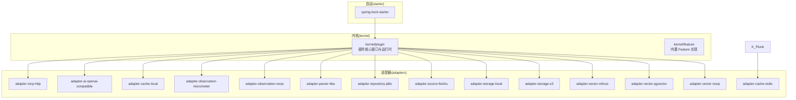
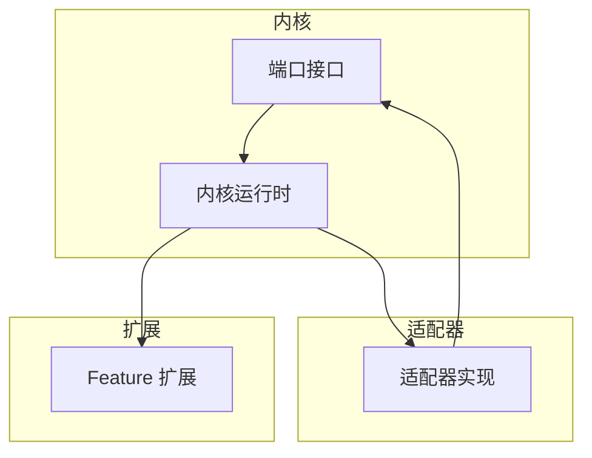
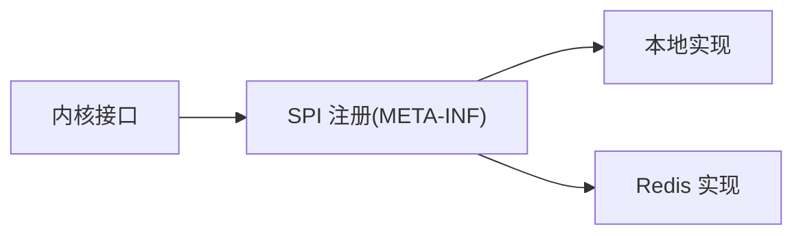
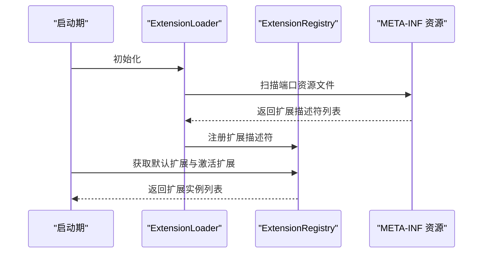
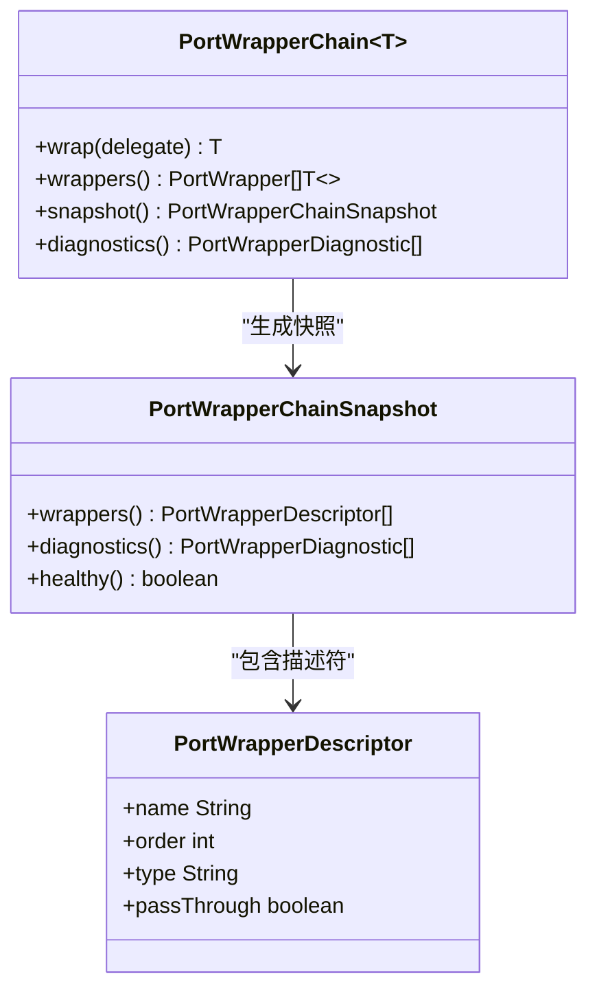
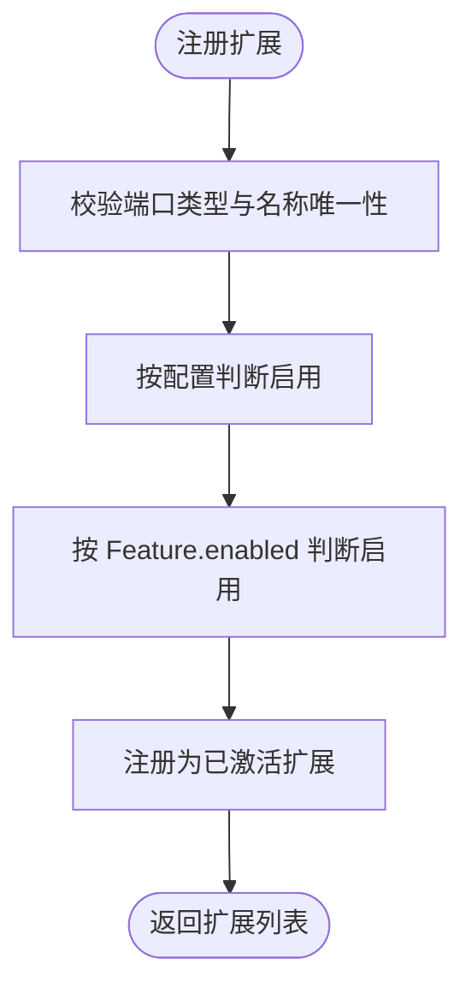
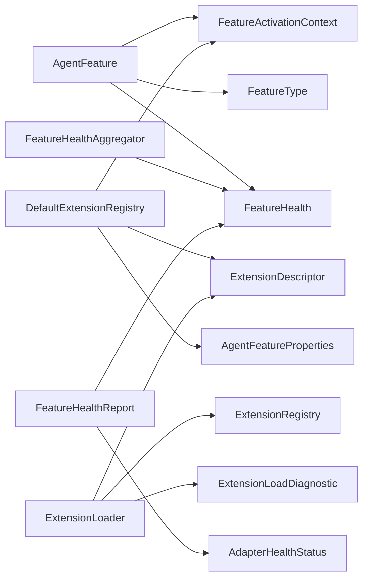

# 设计模式应用

<cite>
**本文引用的文件**
- [ExtensionLoader.java](file://seahorse-agent-kernel/src/main/java/com/miracle/ai/seahorse/agent/kernel/plugin/ExtensionLoader.java)
- [DefaultExtensionRegistry.java](file://seahorse-agent-kernel/src/main/java/com/miracle/ai/seahorse/agent/kernel/plugin/DefaultExtensionRegistry.java)
- [AgentFeature.java](file://seahorse-agent-kernel/src/main/java/com/miracle/ai/seahorse/agent/kernel/plugin/AgentFeature.java)
- [AgentExtension.java](file://seahorse-agent-kernel/src/main/java/com/miracle/ai/seahorse/agent/kernel/plugin/AgentExtension.java)
- [AgentSPI.java](file://seahorse-agent-kernel/src/main/java/com/miracle/ai/seahorse/agent/kernel/plugin/AgentSPI.java)
- [PortWrapperChain.java](file://seahorse-agent-kernel/src/main/java/com/miracle/ai/seahorse/agent/kernel/plugin/wrapper/PortWrapperChain.java)
- [PortWrapperChainSnapshot.java](file://seahorse-agent-kernel/src/main/java/com/miracle/ai/seahorse/agent/kernel/plugin/wrapper/PortWrapperChainSnapshot.java)
- [缓存出站端口.md](file://docs/zh/content/后端系统/核心内核/端口接口/出站端口/缓存出站端口.md)
- [插件架构设计.md](file://docs/zh/content/后端系统/插件系统/插件架构设计.md)
- [核心组件.md](file://docs/zh/content/后端系统/核心内核/插件系统/核心组件.md)
- [PortWrapperChainTests.java](file://seahorse-agent-tests/src/test/java/com/miracle/ai/seahorse/agent/kernel/plugin/wrapper/PortWrapperChainTests.java)
- [DefaultExtensionRegistryTests.java](file://seahorse-agent-tests/src/test/java/com/miracle/ai/seahorse/agent/kernel/plugin/DefaultExtensionRegistryTests.java)
- [SeahorsePluginController.java](file://seahorse-agent-adapter-web/src/main/java/com/miracle/ai/seahorse/agent/adapters/web/SeahorsePluginController.java)
</cite>

## 目录
1. [引言](#引言)
2. [项目结构](#项目结构)
3. [核心组件](#核心组件)
4. [架构总览](#架构总览)
5. [详细组件分析](#详细组件分析)
6. [依赖关系分析](#依赖关系分析)
7. [性能考量](#性能考量)
8. [故障排查指南](#故障排查指南)
9. [结论](#结论)
10. [附录](#附录)

## 引言
本文件系统性阐述 Seahorse Agent 中的设计模式应用，重点聚焦以下方面：
- 端口适配器模式（Port Adapter Pattern）：Inbound Ports 与 Outbound Ports 的设计理念、边界划分与使用场景。
- 插件化架构（Plugin Architecture）：SPI 机制、扩展点定义、动态加载与运行期治理。
- 典型设计模式在项目中的落地：工厂模式、策略模式、观察者模式等。
- 关注点分离、代码复用性与低耦合的实现路径。
- 技术选型考量与权衡决策，并给出最佳实践与排错建议。

## 项目结构
Seahorse Agent 采用 Clean Architecture 分层与端口适配器模式，结合插件化扩展机制，形成“内核边界 + 适配器实现 + 动态扩展”的稳定架构：
- kernel/plugin：定义插件核心接口与运行时基础设施（AgentFeature、AgentExtension、AgentSPI、ExtensionLoader、ExtensionRegistry 等）。
- adapter-*：实现具体技术能力的适配器，通过 META-INF/seahorse-agent 下的端口资源文件声明扩展。
- starter：提供自动装配与运行时集成。
- web 适配器：对外暴露插件状态与治理接口。

图表来源
- [插件架构设计.md:72-111](file://docs/zh/content/后端系统/插件系统/插件架构设计.md#L72-L111)

章节来源
- [插件架构设计.md:66-111](file://docs/zh/content/后端系统/插件系统/插件架构设计.md#L66-L111)

## 核心组件
- AgentFeature：扩展能力的统一抽象，负责启停判断、排序与健康检查。
- AgentExtension：注解式声明扩展元数据（名称、顺序、能力标签），支持显式注册与自动发现。
- AgentSPI：标记端口是否参与扩展加载，仅承载契约元数据，避免运行期反射开销。
- ExtensionLoader：启动期扫描 classpath 资源，构建 ExtensionRegistry。
- DefaultExtensionRegistry：运行期扩展注册与查询，支持默认扩展解析、启用条件与健康诊断。
- PortWrapperChain：端口包装链，按顺序应用包装器，支持快照与诊断。
- 端口（Port）：位于内核边界，定义抽象能力契约；适配器实现具体技术细节。

章节来源
- [插件架构设计.md:57-66](file://docs/zh/content/后端系统/插件系统/插件架构设计.md#L57-L66)
- [核心组件.md:408-433](file://docs/zh/content/后端系统/核心内核/插件系统/核心组件.md#L408-L433)

## 架构总览
Seahorse Agent 的插件架构采用“端口驱动 + 适配器实现 + Feature 扩展”的 Clean Architecture 分层模式：
- 端口（Port）：位于内核边界，定义抽象能力契约（如模型、缓存、消息队列、存储、向量检索等）。
- 适配器（Adapter）：实现具体技术细节，通过 AgentSPI 标记端口并提供默认实现或可选实现。
- Feature：实现业务扩展能力，实现 AgentFeature 接口，通过 AgentExtension 注解声明元数据。
- 扩展加载：ExtensionLoader 在启动期扫描 classpath 资源，构建 ExtensionRegistry；运行期通过注册表获取默认扩展与按上下文激活的扩展链。

图表来源
- [插件架构设计.md:189-194](file://docs/zh/content/后端系统/插件系统/插件架构设计.md#L189-L194)

章节来源
- [插件架构设计.md:189-194](file://docs/zh/content/后端系统/插件系统/插件架构设计.md#L189-L194)

## 详细组件分析

### 端口适配器模式（Inbound/Outbound Ports）
- Inbound Ports：面向外部系统的入口端口，负责接收请求、参数校验与协议转换，再调用内核业务逻辑。
- Outbound Ports：面向内部系统的出口端口，负责将内核业务逻辑与外部基础设施（缓存、存储、消息队列、向量库等）解耦。
- SPI 与 META-INF 配置：各端口在不同适配器中提供实现映射，运行时通过 SPI 自动注入，降低耦合度。

图表来源
- [缓存出站端口.md:364-378](file://docs/zh/content/后端系统/核心内核/端口接口/出站端口/缓存出站端口.md#L364-L378)

章节来源
- [缓存出站端口.md:364-378](file://docs/zh/content/后端系统/核心内核/端口接口/出站端口/缓存出站端口.md#L364-L378)

### 插件化架构（SPI、扩展点与动态加载）
- AgentSPI：标记端口是否参与扩展加载，避免运行期反射开销。
- AgentExtension：声明扩展元数据（名称、顺序、能力标签），支持显式注册与自动发现。
- AgentFeature：扩展能力的统一抽象，负责启停判断、排序与健康检查。
- ExtensionLoader：启动期扫描 classpath 资源，构建 ExtensionRegistry。
- DefaultExtensionRegistry：运行期扩展注册与查询，支持默认扩展解析、启用条件与健康诊断。

图表来源
- [插件架构设计.md:189-194](file://docs/zh/content/后端系统/插件系统/插件架构设计.md#L189-L194)

章节来源
- [插件架构设计.md:57-66](file://docs/zh/content/后端系统/插件系统/插件架构设计.md#L57-L66)
- [插件架构设计.md:189-194](file://docs/zh/content/后端系统/插件系统/插件架构设计.md#L189-L194)

### 端口包装链（Port Wrapper Chain）
- PortWrapperChain：按顺序应用包装器，支持快照与诊断，便于运行期可观测与健康检查。
- PortWrapperChainSnapshot：提供包装器链的只读视图，包含名称、顺序、类型与透传标记。

图表来源
- [PortWrapperChain.java:37-76](file://seahorse-agent-kernel/src/main/java/com/miracle/ai/seahorse/agent/kernel/plugin/wrapper/PortWrapperChain.java#L37-L76)
- [PortWrapperChainSnapshot.java:36-50](file://seahorse-agent-kernel/src/main/java/com/miracle/ai/seahorse/agent/kernel/plugin/wrapper/PortWrapperChainSnapshot.java#L36-L50)

章节来源
- [PortWrapperChain.java:37-76](file://seahorse-agent-kernel/src/main/java/com/miracle/ai/seahorse/agent/kernel/plugin/wrapper/PortWrapperChain.java#L37-L76)
- [PortWrapperChainSnapshot.java:36-50](file://seahorse-agent-kernel/src/main/java/com/miracle/ai/seahorse/agent/kernel/plugin/wrapper/PortWrapperChainSnapshot.java#L36-L50)

### 扩展注册与激活（DefaultExtensionRegistry）
- 支持默认扩展解析、启用条件（配置与 Feature 自身 enabled 判断）、重复名称校验与端口类型一致性校验。
- 运行期返回按顺序激活的扩展列表，请求期无需额外查表。

图表来源
- [DefaultExtensionRegistry.java:88-114](file://seahorse-agent-kernel/src/main/java/com/miracle/ai/seahorse/agent/kernel/plugin/DefaultExtensionRegistry.java#L88-L114)

章节来源
- [DefaultExtensionRegistry.java:82-123](file://seahorse-agent-kernel/src/main/java/com/miracle/ai/seahorse/agent/kernel/plugin/DefaultExtensionRegistry.java#L82-L123)
- [DefaultExtensionRegistryTests.java:41-56](file://seahorse-agent-tests/src/test/java/com/miracle/ai/seahorse/agent/kernel/plugin/DefaultExtensionRegistryTests.java#L41-L56)

### Web 控制面（插件状态与治理）
- SeahorsePluginController：对外暴露插件状态、能力、健康度与更新信息，便于运行期治理与可观测。

章节来源
- [SeahorsePluginController.java:86-109](file://seahorse-agent-adapter-web/src/main/java/com/miracle/ai/seahorse/agent/adapters/web/SeahorsePluginController.java#L86-L109)

## 依赖关系分析
- 组件耦合
  - AgentFeature 依赖 FeatureActivationContext 与 FeatureType；通过 ExtensionDescriptor 与注册表交互。
  - DefaultExtensionRegistry 依赖 ExtensionDescriptor、AgentFeatureProperties 与 FeatureActivationContext。
  - ExtensionLoader 依赖 ExtensionDescriptor、ExtensionRegistry 与 ExtensionLoadDiagnostic。
  - FeatureHealthAggregator 依赖 FeatureHealth 与 Adapter 健康指标端口。
- 外部依赖
  - Spring 配置类可将配置转换为 AgentFeatureProperties，注入到 FeatureActivationContext。
- 循环依赖
  - 未发现循环依赖：接口契约清晰，加载器与注册表职责分离。

图表来源
- [核心组件.md:408-433](file://docs/zh/content/后端系统/核心内核/插件系统/核心组件.md#L408-L433)

章节来源
- [核心组件.md:408-433](file://docs/zh/content/后端系统/核心内核/插件系统/核心组件.md#L408-L433)

## 性能考量
- 启动期治理：通过 ExtensionLoader 与 ExtensionRegistry 在启动期完成扩展注册与索引，运行期直接查询，避免运行期反射与动态绑定开销。
- 端口包装链：PortWrapperChain 在构造时排序并诊断，运行期以常数时间顺序应用包装器，减少链路延迟。
- 健康检查与可观测：通过 PortWrapperChainSnapshot 与 FeatureHealthAggregator 提供运行期健康视图，便于快速定位问题。
- 适配器选择：通过 SPI 与端口资源文件实现，默认实现与可选实现清晰分离，避免不必要的实现加载。

## 故障排查指南
- 扩展名称冲突：注册时会校验名称唯一性，若出现重复名称需调整扩展元数据。
- 端口类型不匹配：实例必须满足端口类型约束，否则抛出异常，需检查适配器实现与端口契约。
- 启用条件不满足：检查配置与 Feature.enabled 的组合，确认扩展是否被激活。
- 包装链健康状态：通过 PortWrapperChainSnapshot.health() 与诊断信息定位包装器链问题。
- 插件状态查询：通过 SeahorsePluginController 获取插件状态、能力与最后错误信息，辅助定位问题。

章节来源
- [DefaultExtensionRegistry.java:94-101](file://seahorse-agent-kernel/src/main/java/com/miracle/ai/seahorse/agent/kernel/plugin/DefaultExtensionRegistry.java#L94-L101)
- [PortWrapperChainSnapshot.java:36-50](file://seahorse-agent-kernel/src/main/java/com/miracle/ai/seahorse/agent/kernel/plugin/wrapper/PortWrapperChainSnapshot.java#L36-L50)
- [SeahorsePluginController.java:86-109](file://seahorse-agent-adapter-web/src/main/java/com/miracle/ai/seahorse/agent/adapters/web/SeahorsePluginController.java#L86-L109)

## 结论
Seahorse Agent 的设计模式通过“端口 + 适配器 + Feature”的 Clean Architecture 分层，结合 AgentFeature、AgentExtension、AgentSPI、FeatureType、ExtensionRegistry 与 ExtensionLoader 等核心组件，实现了：
- 清晰的扩展点划分与稳定的类型体系；
- 启动期可治理、运行期高性能的扩展加载与选择；
- 基于上下文的细粒度启用控制与健康状态报告；
- 与 Clean Architecture 的深度契合，既保证了内核的稳定性，又提供了强大的动态扩展能力。

## 附录
- 插件开发最佳实践
  - 使用 AgentSPI 标记端口，明确 defaultName 与 required。
  - 使用 AgentExtension 声明扩展元数据，确保 name 唯一、order 合理、capabilities 清晰。
  - 实现 AgentFeature 时，enabled() 与 health() 应尽量无副作用，避免阻塞请求链路。
  - 适配器通过 META-INF/seahorse-agent/{port-fqcn} 资源文件声明扩展，遵循 Properties 格式约定。
  - 在启动期完成扩展注册，运行期仅使用 ExtensionRegistry 的查询结果。
- 端口包装链测试要点
  - 验证包装器按顺序应用与重复名称、顺序冲突的诊断。
  - 验证快照中透传包装器的标识与健康状态。

章节来源
- [插件架构设计.md:552-558](file://docs/zh/content/后端系统/插件系统/插件架构设计.md#L552-L558)
- [PortWrapperChainTests.java:32-64](file://seahorse-agent-tests/src/test/java/com/miracle/ai/seahorse/agent/kernel/plugin/wrapper/PortWrapperChainTests.java#L32-L64)
- [DefaultExtensionRegistryTests.java:41-56](file://seahorse-agent-tests/src/test/java/com/miracle/ai/seahorse/agent/kernel/plugin/DefaultExtensionRegistryTests.java#L41-L56)