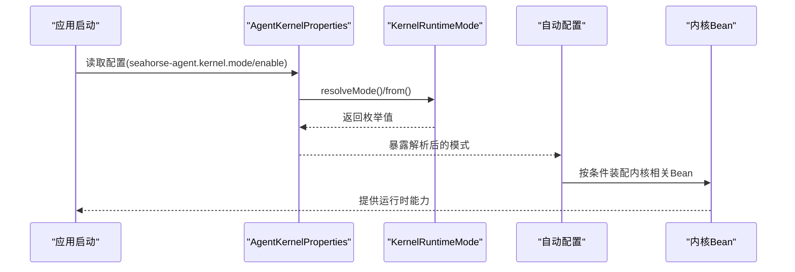
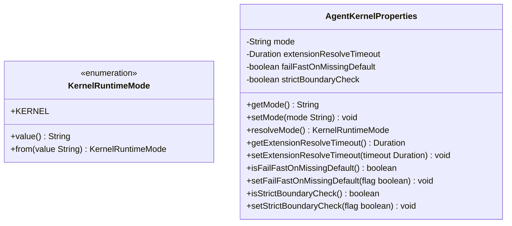
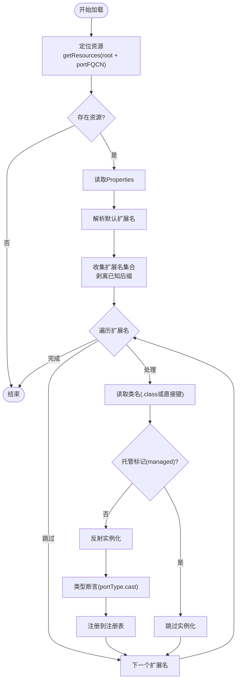
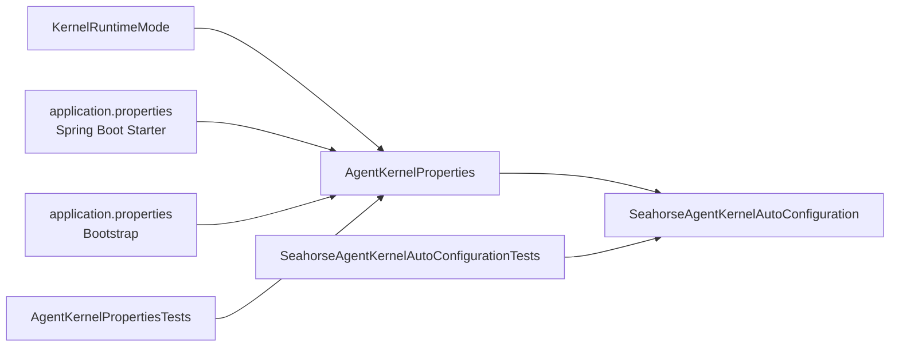

# 运行时模式

<cite>
**本文档引用的文件**
- [KernelRuntimeMode.java](file://seahorse-agent-kernel/src/main/java/com/miracle/ai/seahorse/agent/kernel/config/KernelRuntimeMode.java)
- [AgentKernelProperties.java](file://seahorse-agent-spring-boot-starter/src/main/java/com/miracle/ai/seahorse/agent/adapters/spring/config/AgentKernelProperties.java)
- [SeahorseAgentKernelAutoConfiguration.java](file://seahorse-agent-spring-boot-starter/src/main/java/com/miracle/ai/seahorse/agent/adapters/spring/SeahorseAgentKernelAutoConfiguration.java)
- [application.properties（Spring Boot Starter）](file://seahorse-agent-spring-boot-starter/src/main/resources/application.properties)
- [application.properties（Bootstrap）](file://seahorse-agent-bootstrap/src/main/resources/application.properties)
- [AgentKernelPropertiesTests.java](file://seahorse-agent-tests/src/test/java/com/miracle/ai/seahorse/agent/kernel/config/AgentKernelPropertiesTests.java)
- [ExtensionLoader.java](file://seahorse-agent-kernel/src/main/java/com/miracle/ai/seahorse/agent/kernel/plugin/ExtensionLoader.java)
- [运行时模式配置.md](file://docs/zh/content/架构设计/运行时模式配置.md)
- [运行时配置.md](file://docs/zh/content/后端系统/核心内核/运行时配置.md)
</cite>

## 目录
1. [简介](#简介)
2. [项目结构](#项目结构)
3. [核心组件](#核心组件)
4. [架构总览](#架构总览)
5. [详细组件分析](#详细组件分析)
6. [依赖分析](#依赖分析)
7. [性能考虑](#性能考虑)
8. [故障排除指南](#故障排除指南)
9. [结论](#结论)
10. [附录](#附录)

## 简介
本文件聚焦"运行时配置"，围绕 KernelRuntimeMode 的运行模式配置与切换机制展开，系统阐述：
- 运行模式的定义、解析与默认行为
- 不同运行模式下的行为差异与适用场景
- 在开发、测试、生产等环境中的配置策略与最佳实践
- 运行时参数的设置方法、配置优先级与覆盖规则
- 如何根据业务需求选择合适的运行模式，并在运行时动态调整配置参数
- 配置故障排除与性能优化建议

## 项目结构
运行时配置相关的核心代码分布在以下模块中：
- kernel 模块：定义运行时模式枚举与插件特性上下文
- spring-boot-starter 模块：提供 Spring Boot 配置绑定模型与自动装配
- bootstrap 模块：应用启动时的基础配置
- tests 模块：对配置解析与默认行为进行验证

```mermaid
graph TB
subgraph "内核配置层"
KR["KernelRuntimeMode<br/>定义运行模式"]
END
subgraph "属性绑定层"
AKP["AgentKernelProperties<br/>配置绑定与解析"]
END
subgraph "自动配置层"
SAKAC["SeahorseAgentKernelAutoConfiguration<br/>按模式装配Bean"]
END
subgraph "默认配置"
APP_S["application.properties<br/>Spring Boot Starter"]
APP_B["application.properties<br/>Bootstrap"]
END
subgraph "测试"
AKPT["AgentKernelPropertiesTests"]
END
KR --> AKP
AKP --> SAKAC
APP_S --> AKP
APP_B --> AKP
AKPT --> AKP
```

**图表来源**
- [KernelRuntimeMode.java:25-46](file://seahorse-agent-kernel/src/main/java/com/miracle/ai/seahorse/agent/kernel/config/KernelRuntimeMode.java#L25-L46)
- [AgentKernelProperties.java:29-50](file://seahorse-agent-spring-boot-starter/src/main/java/com/miracle/ai/seahorse/agent/adapters/spring/config/AgentKernelProperties.java#L29-L50)
- [SeahorseAgentKernelAutoConfiguration.java:182-188](file://seahorse-agent-spring-boot-starter/src/main/java/com/miracle/ai/seahorse/agent/adapters/spring/SeahorseAgentKernelAutoConfiguration.java#L182-L188)
- [application.properties（Spring Boot Starter）:1-2](file://seahorse-agent-spring-boot-starter/src/main/resources/application.properties#L1-L2)
- [application.properties（Bootstrap）:1-4](file://seahorse-agent-bootstrap/src/main/resources/application.properties#L1-L4)
- [AgentKernelPropertiesTests.java:31-55](file://seahorse-agent-tests/src/test/java/com/miracle/ai/seahorse/agent/kernel/config/AgentKernelPropertiesTests.java#L31-L55)

**章节来源**
- [运行时模式配置.md:29-36](file://docs/zh/content/架构设计/运行时模式配置.md#L29-L36)

## 核心组件
- KernelRuntimeMode：当前版本仅定义 KERNEL 模式，提供字符串值与从任意输入解析为枚举的能力，包含空值与空白值的默认回退策略。
- AgentKernelProperties：将 seahorse-agent.kernel.* 前缀的配置绑定到对象，提供默认模式、超时、严格边界检查等配置项，并负责将字符串模式解析为枚举。
- 自动配置条件：SeahorseAgentKernelAutoConfiguration 以 seahorse-agent.kernel.enabled 为开关，且在模式为 kernel 时装配内核基础设施与本地流式回调等 Bean。

**章节来源**
- [KernelRuntimeMode.java:25-46](file://seahorse-agent-kernel/src/main/java/com/miracle/ai/seahorse/agent/kernel/config/KernelRuntimeMode.java#L25-L46)
- [AgentKernelProperties.java:29-76](file://seahorse-agent-spring-boot-starter/src/main/java/com/miracle/ai/seahorse/agent/adapters/spring/config/AgentKernelProperties.java#L29-L76)
- [SeahorseAgentKernelAutoConfiguration.java:182-188](file://seahorse-agent-spring-boot-starter/src/main/java/com/miracle/ai/seahorse/agent/adapters/spring/SeahorseAgentKernelAutoConfiguration.java#L182-L188)

## 架构总览
运行时模式通过"配置 → 绑定 → 解析 → 条件装配"的链路影响系统行为。下图展示了关键交互：



**图表来源**
- [AgentKernelProperties.java:48-50](file://seahorse-agent-spring-boot-starter/src/main/java/com/miracle/ai/seahorse/agent/adapters/spring/config/AgentKernelProperties.java#L48-L50)
- [KernelRuntimeMode.java:39-45](file://seahorse-agent-kernel/src/main/java/com/miracle/ai/seahorse/agent/kernel/config/KernelRuntimeMode.java#L39-L45)
- [SeahorseAgentKernelAutoConfiguration.java:182-188](file://seahorse-agent-spring-boot-starter/src/main/java/com/miracle/ai/seahorse/agent/adapters/spring/SeahorseAgentKernelAutoConfiguration.java#L182-L188)

## 详细组件分析

### KernelRuntimeMode 设计理念
KernelRuntimeMode 当前版本仅定义 KERNEL 模式，体现了"单一核心模式 + 可扩展设计"的理念：
- 简洁性：只定义一个核心模式，降低复杂度
- 兼容性：提供从任意字符串解析的能力，支持多种输入格式
- 健壮性：对空值和空白值提供明确的默认回退策略



**图表来源**
- [KernelRuntimeMode.java:25-46](file://seahorse-agent-kernel/src/main/java/com/miracle/ai/seahorse/agent/kernel/config/KernelRuntimeMode.java#L25-L46)
- [AgentKernelProperties.java:30-76](file://seahorse-agent-spring-boot-starter/src/main/java/com/miracle/ai/seahorse/agent/adapters/spring/config/AgentKernelProperties.java#L30-L76)

**章节来源**
- [KernelRuntimeMode.java:25-46](file://seahorse-agent-kernel/src/main/java/com/miracle/ai/seahorse/agent/kernel/config/KernelRuntimeMode.java#L25-L46)

### 配置解析与默认行为
AgentKernelProperties 提供了完整的配置绑定机制：
- 默认模式：KERNEL（通过静态常量定义）
- 模式解析：resolveMode() 方法将字符串转换为枚举
- 空值处理：setMode() 对空值使用默认值回退
- 配置项：扩展解析超时、严格边界检查、缺失默认值时的快速失败策略

**章节来源**
- [AgentKernelProperties.java:30-76](file://seahorse-agent-spring-boot-starter/src/main/java/com/miracle/ai/seahorse/agent/adapters/spring/config/AgentKernelProperties.java#L30-L76)
- [AgentKernelPropertiesTests.java:34-56](file://seahorse-agent-tests/src/test/java/com/miracle/ai/seahorse/agent/kernel/config/AgentKernelPropertiesTests.java#L34-L56)

### 自动配置条件与装配逻辑
SeahorseAgentKernelAutoConfiguration 实现了基于运行时模式的条件装配：
- 开关控制：seahorse-agent.kernel.enabled
- 模式判断：仅在模式为 kernel 时装配
- Bean 装配：内核基础设施与本地流式回调等

**章节来源**
- [SeahorseAgentKernelAutoConfiguration.java:182-188](file://seahorse-agent-spring-boot-starter/src/main/java/com/miracle/ai/seahorse/agent/adapters/spring/SeahorseAgentKernelAutoConfiguration.java#L182-L188)

### 插件系统与扩展加载
扩展加载机制支持运行时模式下的动态功能装配：
- 基于 classpath 的 SPI 资源发现
- 扩展名解析与后缀剥离
- 托管标记与实例化控制
- 注册表管理与诊断功能



**图表来源**
- [ExtensionLoader.java:95-114](file://seahorse-agent-kernel/src/main/java/com/miracle/ai/seahorse/agent/kernel/plugin/ExtensionLoader.java#L95-L114)
- [ExtensionLoader.java:156-171](file://seahorse-agent-kernel/src/main/java/com/miracle/ai/seahorse/agent/kernel/plugin/ExtensionLoader.java#L156-L171)
- [ExtensionLoader.java:227-238](file://seahorse-agent-kernel/src/main/java/com/miracle/ai/seahorse/agent/kernel/plugin/ExtensionLoader.java#L227-L238)

**章节来源**
- [ExtensionLoader.java:166-170](file://seahorse-agent-kernel/src/main/java/com/miracle/ai/seahorse/agent/kernel/plugin/ExtensionLoader.java#L166-L170)

## 依赖分析
- 组件耦合
  - AgentKernelProperties 依赖 KernelRuntimeMode 进行模式解析
  - 自动配置类依赖 AgentKernelProperties 的解析结果决定 Bean 装配
- 外部依赖
  - Spring Boot 配置绑定与条件装配机制
  - 测试框架验证默认值与解析行为



**图表来源**
- [KernelRuntimeMode.java:25-46](file://seahorse-agent-kernel/src/main/java/com/miracle/ai/seahorse/agent/kernel/config/KernelRuntimeMode.java#L25-L46)
- [AgentKernelProperties.java:29-50](file://seahorse-agent-spring-boot-starter/src/main/java/com/miracle/ai/seahorse/agent/adapters/spring/config/AgentKernelProperties.java#L29-L50)
- [SeahorseAgentKernelAutoConfiguration.java:182-188](file://seahorse-agent-spring-boot-starter/src/main/java/com/miracle/ai/seahorse/agent/adapters/spring/SeahorseAgentKernelAutoConfiguration.java#L182-L188)

**章节来源**
- [运行时模式配置.md:218-234](file://docs/zh/content/架构设计/运行时模式配置.md#L218-L234)

## 性能考虑
- 模式解析成本极低：字符串标准化与枚举查找为常数时间复杂度
- 自动配置按需装配：仅在模式为 kernel 且开关开启时加载内核相关 Bean，避免不必要的初始化开销
- 扩展解析超时：可通过 extensionResolveTimeout 调整扩展加载等待时间，平衡启动时间与稳定性

## 故障排除指南
- 模式未生效
  - 检查 seahorse-agent.kernel.enabled 是否为 true
  - 确认 seahorse-agent.kernel.mode 设置为 kernel
- 默认值与空值
  - 若未设置 mode，将回退到 KERNEL
  - 测试用例验证了默认值与空字符串的行为
- 自动配置未装配
  - 确认已引入 Spring Boot Starter 并正确加载 application.properties
  - 使用集成测试断言验证模式为 kernel 时的 Bean 存在性

**章节来源**
- [AgentKernelPropertiesTests.java:34-56](file://seahorse-agent-tests/src/test/java/com/miracle/ai/seahorse/agent/kernel/config/AgentKernelPropertiesTests.java#L34-L56)
- [运行时配置.md:337-351](file://docs/zh/content/后端系统/核心内核/运行时配置.md#L337-L351)

## 结论
当前版本的运行时模式以 KERNEL 为核心，通过 KernelRuntimeMode 与 AgentKernelProperties 的组合实现了简洁可靠的模式解析与默认回退；配合自动配置的条件装配，确保在正确模式下按需加载内核能力。未来若扩展新模式，可在不破坏现有配置的前提下平滑演进。

## 附录

### 配置文件优先级与覆盖规则
- 配置文件优先级：Bootstrap > Spring Boot Starter
- 环境变量覆盖：Spring Boot 支持标准的环境变量覆盖机制
- 命令行参数：支持通过 --spring.config.location 等参数指定配置位置

**章节来源**
- [application.properties（Spring Boot Starter）:1-2](file://seahorse-agent-spring-boot-starter/src/main/resources/application.properties#L1-L2)
- [application.properties（Bootstrap）:1-4](file://seahorse-agent-bootstrap/src/main/resources/application.properties#L1-L4)

### 不同环境的配置策略与最佳实践
- 开发环境
  - 启用严格边界检查与快速失败，便于早期发现问题
  - 适度放宽超时阈值，提升调试体验
- 测试环境
  - 显式设置 mode 与关键开关，确保测试一致性
  - 使用最小化配置，减少外部依赖
- 生产环境
  - 明确声明默认扩展，避免随机选择
  - 合理设置超时与失败策略，保障稳定性
  - 监控扩展加载诊断信息，及时发现异常

**章节来源**
- [运行时配置.md:337-351](file://docs/zh/content/后端系统/核心内核/运行时配置.md#L337-L351)

### 运行时模式切换的最佳实践
- 在不重启系统的情况下动态切换模式的方法论
- 功能动态开关与性能调优的实现策略
- 配置变更的监控与回滚机制

**章节来源**
- [运行时模式配置.md:26-27](file://docs/zh/content/架构设计/运行时模式配置.md#L26-L27)