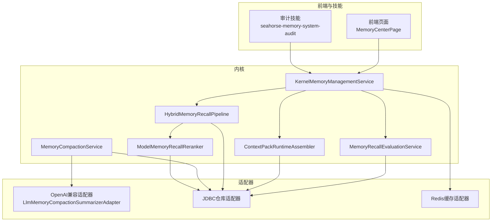
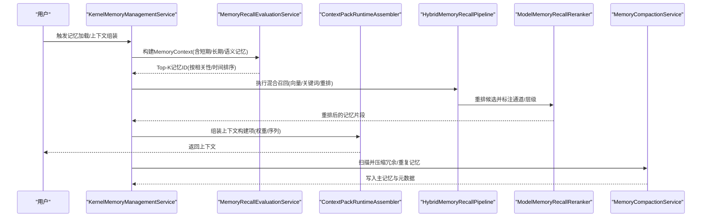
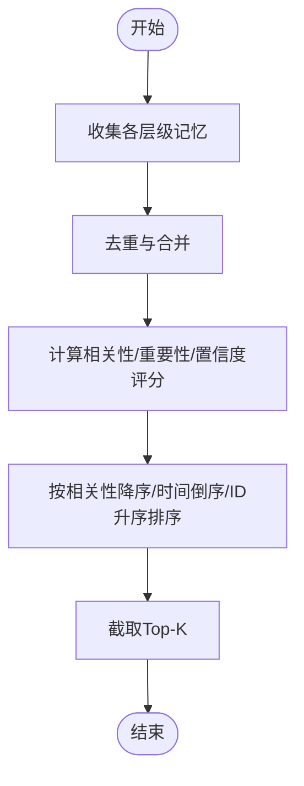
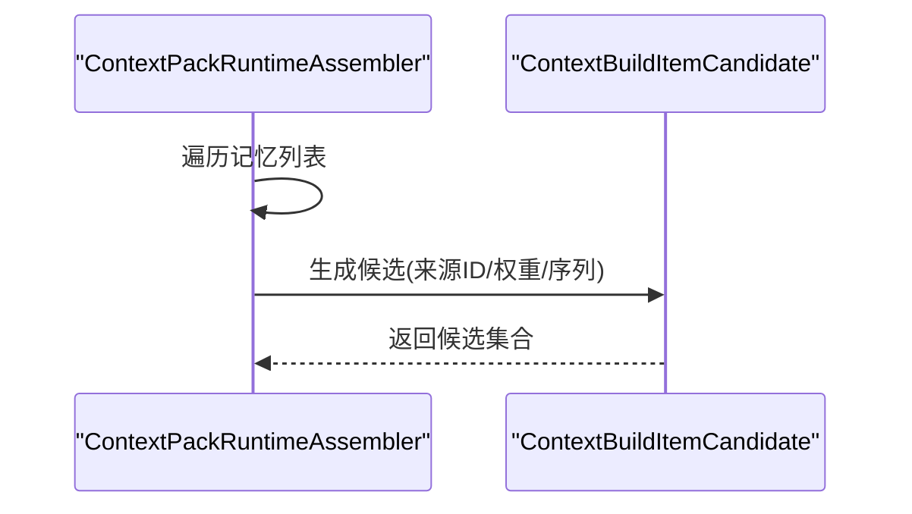
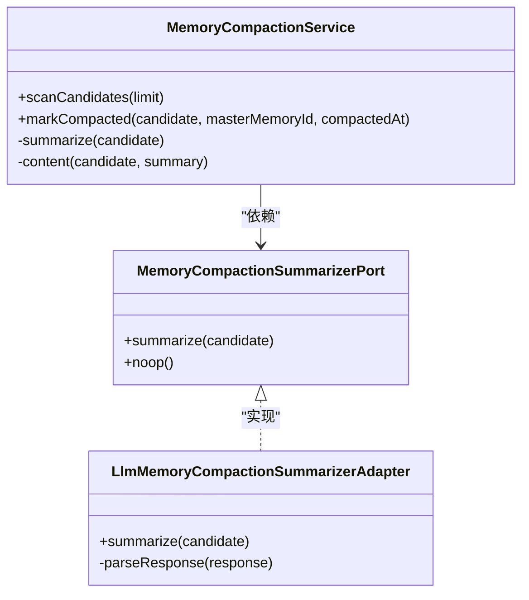
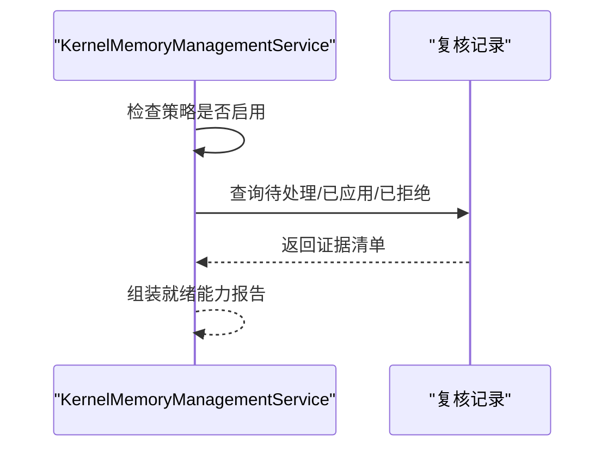
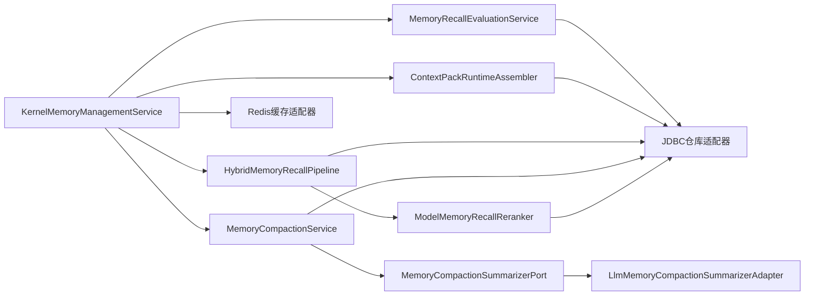

# 会话记忆系统

<cite>
**本文引用的文件**
- [MemoryRecallEvaluationService.java](file://seahorse-agent-kernel/src/main/java/com/miracle/ai/seahorse/agent/kernel/application/memory/retrieval/MemoryRecallEvaluationService.java)
- [ContextPackRuntimeAssembler.java](file://seahorse-agent-kernel/src/main/java/com/miracle/ai/seahorse/agent/kernel/application/chat/ContextPackRuntimeAssembler.java)
- [ModelMemoryRecallReranker.java](file://seahorse-agent-kernel/src/main/java/com/miracle/ai/seahorse/agent/kernel/application/memory/retrieval/ModelMemoryRecallReranker.java)
- [HybridMemoryRecallPipeline.java](file://seahorse-agent-kernel/src/main/java/com/miracle/ai/seahorse/agent/kernel/application/memory/retrieval/HybridMemoryRecallPipeline.java)
- [MemoryCompactionService.java](file://seahorse-agent-kernel/src/main/java/com/miracle/ai/seahorse/agent/kernel/application/memory/maintenance/MemoryCompactionService.java)
- [MemoryCompactionSummarizerPort.java](file://seahorse-agent-kernel/src/main/java/com/miracle/ai/seahorse/agent/ports/outbound/memory/MemoryCompactionSummarizerPort.java)
- [MemoryCompactionPort.java](file://seahorse-agent-kernel/src/main/java/com/miracle/ai/seahorse/agent/ports/outbound/memory/MemoryCompactionPort.java)
- [LlmMemoryCompactionSummarizerAdapter.java](file://seahorse-agent-adapter-ai-openai-compatible/src/main/java/com/miracle/ai/seahorse/agent/adapters/ai/openai/LlmMemoryCompactionSummarizerAdapter.java)
- [KernelMemoryManagementService.java](file://seahorse-agent-kernel/src/main/java/com/miracle/ai/seahorse/agent/kernel/application/memory/KernelMemoryManagementService.java)
- [MEMORY-FIX-TODO.md](file://docs/MEMORY-FIX-TODO.md)
- [内存管理领域模型.md](file://docs/zh/content/后端系统/核心内核/领域模型/内存管理领域模型.md)
- [内存管理应用服务.md](file://docs/zh/content/后端系统/核心内核/应用服务层/内存管理应用服务.md)
- [DefaultMemoryEnginePortTests.java](file://seahorse-agent-tests/src/test/java/com/miracle/ai/seahorse/agent/kernel/application/memory/DefaultMemoryEnginePortTests.java)
- [JdbcMemoryLifecycleRepositoryAdapter.java](file://seahorse-agent-adapter-repository-jdbc/src/main/java/com/miracle/ai/seahorse/agent/adapters/repository/jdbc/JdbcMemoryLifecycleRepositoryAdapter.java)
- [JdbcMemoryConflictLogRepositoryAdapter.java](file://seahorse-agent-adapter-repository-jdbc/src/main/java/com/miracle/ai/seahorse/agent/adapters/repository/jdbc/JdbcMemoryConflictLogRepositoryAdapter.java)
- [JdbcMemoryGraphRepositoryAdapter.java](file://seahorse-agent-adapter-repository-jdbc/src/main/java/com/miracle/ai/seahorse/agent/adapters/repository/jdbc/JdbcMemoryGraphRepositoryAdapter.java)
- [JdbcMemoryAggregationBufferAdapter.java](file://seahorse-agent-adapter-repository-jdbc/src/main/java/com/miracle/ai/seahorse/agent/adapters/repository/jdbc/JdbcMemoryAggregationBufferAdapter.java)
- [RedisMemoryAggregationBufferPort.java](file://seahorse-agent-adapter-cache-redis/src/main/java/com/miracle/ai/seahorse/agent/adapters/cache/redis/RedisMemoryAggregationBufferPort.java)
- [RedisMemoryAggregationSchedulerPort.java](file://seahorse-agent-adapter-cache-redis/src/main/java/com/miracle/ai/seahorse/agent/adapters/cache/redis/RedisMemoryAggregationSchedulerPort.java)
- [SKILL.md](file://.skills/seahorse-memory-system-audit/SKILL.md)
</cite>

## 目录
1. [引言](#引言)
2. [项目结构](#项目结构)
3. [核心组件](#核心组件)
4. [架构总览](#架构总览)
5. [详细组件分析](#详细组件分析)
6. [依赖关系分析](#依赖关系分析)
7. [性能考量](#性能考量)
8. [故障排查指南](#故障排查指南)
9. [结论](#结论)
10. [附录](#附录)

## 引言
本文件系统性梳理“会话记忆系统”的设计与实现，覆盖长期记忆、短期记忆与语义记忆的分层架构，记忆检索与上下文组装流程，以及记忆聚合压缩、治理审计与合规能力。文档以代码为依据，结合领域模型与应用服务说明，帮助读者快速理解并正确使用该记忆体系。

## 项目结构
记忆系统由“内核应用服务”“适配器实现”“持久化与缓存”“前端与技能”等模块协同构成。核心逻辑集中在内核模块的应用服务包中，通过端口接口解耦具体实现；适配器模块提供向量化、缓存、存储等外部能力；前端与技能模块负责交互与审计。

图表来源
- [KernelMemoryManagementService.java:396-424](file://seahorse-agent-kernel/src/main/java/com/miracle/ai/seahorse/agent/kernel/application/memory/KernelMemoryManagementService.java#L396-L424)
- [MemoryRecallEvaluationService.java:213-243](file://seahorse-agent-kernel/src/main/java/com/miracle/ai/seahorse/agent/kernel/application/memory/retrieval/MemoryRecallEvaluationService.java#L213-L243)
- [ContextPackRuntimeAssembler.java:227-253](file://seahorse-agent-kernel/src/main/java/com/miracle/ai/seahorse/agent/kernel/application/chat/ContextPackRuntimeAssembler.java#L227-L253)
- [HybridMemoryRecallPipeline.java:907-934](file://seahorse-agent-kernel/src/main/java/com/miracle/ai/seahorse/agent/kernel/application/memory/retrieval/HybridMemoryRecallPipeline.java#L907-L934)
- [ModelMemoryRecallReranker.java:83-107](file://seahorse-agent-kernel/src/main/java/com/miracle/ai/seahorse/agent/kernel/application/memory/retrieval/ModelMemoryRecallReranker.java#L83-L107)
- [MemoryCompactionService.java:146-196](file://seahorse-agent-kernel/src/main/java/com/miracle/ai/seahorse/agent/kernel/application/memory/maintenance/MemoryCompactionService.java#L146-L196)
- [LlmMemoryCompactionSummarizerAdapter.java:134-167](file://seahorse-agent-adapter-ai-openai-compatible/src/main/java/com/miracle/ai/seahorse/agent/adapters/ai/openai/LlmMemoryCompactionSummarizerAdapter.java#L134-L167)

章节来源
- [内存管理领域模型.md:215-276](file://docs/zh/content/后端系统/核心内核/领域模型/内存管理领域模型.md#L215-L276)
- [内存管理应用服务.md:280-322](file://docs/zh/content/后端系统/核心内核/应用服务层/内存管理应用服务.md#L280-L322)

## 核心组件
- 记忆上下文与条目
  - MemoryContext：包含会话ID、用户ID、当前问题、工作记忆、短期/长期/语义记忆列表与提示消息。
  - MemoryItem：包含记忆ID、用户/会话归属、层级、类型、内容、元数据JSON、重要性/置信度/相关性评分、创建时间等。
- 记忆加载与检索
  - MemoryRecallEvaluationService：按层级收集候选，基于相关性与时间排序，输出Top-K记忆ID。
  - HybridMemoryRecallPipeline：混合召回流水线，支持向量化检索、重排与回填。
  - ModelMemoryRecallReranker：对召回结果进行重排，合并候选并标注通道与层级信息。
- 上下文组装
  - ContextPackRuntimeAssembler：将短期/长期/语义/业务文档记忆按权重与序列组装为上下文构建项。
- 记忆聚合与压缩
  - MemoryCompactionService：扫描待压缩组，调用摘要器生成主记忆，写入元数据与评分。
  - MemoryCompactionSummarizerPort/LlmMemoryCompactionSummarizerAdapter：摘要器端口与LLM摘要适配器。
- 生命周期与治理
  - KernelMemoryManagementService：审查能力、复核状态与证据链，输出就绪能力报告。
  - JDBC与Redis适配器：提供生命周期、冲突日志、图谱、聚合缓冲等持久化与缓存能力。

章节来源
- [内存管理领域模型.md:215-276](file://docs/zh/content/后端系统/核心内核/领域模型/内存管理领域模型.md#L215-L276)
- [MemoryRecallEvaluationService.java:213-243](file://seahorse-agent-kernel/src/main/java/com/miracle/ai/seahorse/agent/kernel/application/memory/retrieval/MemoryRecallEvaluationService.java#L213-L243)
- [ContextPackRuntimeAssembler.java:227-253](file://seahorse-agent-kernel/src/main/java/com/miracle/ai/seahorse/agent/kernel/application/chat/ContextPackRuntimeAssembler.java#L227-L253)
- [ModelMemoryRecallReranker.java:83-107](file://seahorse-agent-kernel/src/main/java/com/miracle/ai/seahorse/agent/kernel/application/memory/retrieval/ModelMemoryRecallReranker.java#L83-L107)
- [MemoryCompactionService.java:146-196](file://seahorse-agent-kernel/src/main/java/com/miracle/ai/seahorse/agent/kernel/application/memory/maintenance/MemoryCompactionService.java#L146-L196)
- [MemoryCompactionSummarizerPort.java:1-42](file://seahorse-agent-kernel/src/main/java/com/miracle/ai/seahorse/agent/ports/outbound/memory/MemoryCompactionSummarizerPort.java#L1-L42)
- [LlmMemoryCompactionSummarizerAdapter.java:134-167](file://seahorse-agent-adapter-ai-openai-compatible/src/main/java/com/miracle/ai/seahorse/agent/adapters/ai/openai/LlmMemoryCompactionSummarizerAdapter.java#L134-L167)
- [KernelMemoryManagementService.java:396-424](file://seahorse-agent-kernel/src/main/java/com/miracle/ai/seahorse/agent/kernel/application/memory/KernelMemoryManagementService.java#L396-L424)

## 架构总览
记忆系统采用“分层记忆 + 多路召回 + 上下文组装 + 聚合压缩 + 治理审计”的闭环架构。上层通过KernelMemoryManagementService协调各子系统，底层通过JDBC/Redis/OA兼容适配器落地具体能力。

图表来源
- [KernelMemoryManagementService.java:396-424](file://seahorse-agent-kernel/src/main/java/com/miracle/ai/seahorse/agent/kernel/application/memory/KernelMemoryManagementService.java#L396-L424)
- [MemoryRecallEvaluationService.java:213-243](file://seahorse-agent-kernel/src/main/java/com/miracle/ai/seahorse/agent/kernel/application/memory/retrieval/MemoryRecallEvaluationService.java#L213-L243)
- [ContextPackRuntimeAssembler.java:227-253](file://seahorse-agent-kernel/src/main/java/com/miracle/ai/seahorse/agent/kernel/application/chat/ContextPackRuntimeAssembler.java#L227-L253)
- [HybridMemoryRecallPipeline.java:907-934](file://seahorse-agent-kernel/src/main/java/com/miracle/ai/seahorse/agent/kernel/application/memory/retrieval/HybridMemoryRecallPipeline.java#L907-L934)
- [ModelMemoryRecallReranker.java:83-107](file://seahorse-agent-kernel/src/main/java/com/miracle/ai/seahorse/agent/kernel/application/memory/retrieval/ModelMemoryRecallReranker.java#L83-L107)
- [MemoryCompactionService.java:146-196](file://seahorse-agent-kernel/src/main/java/com/miracle/ai/seahorse/agent/kernel/application/memory/maintenance/MemoryCompactionService.java#L146-L196)

## 详细组件分析

### 记忆检索与排序
- 收集与排序
  - 从Profile/Correction/ShortTerm/LongTerm/Semantic/BusinessDocument等多源收集记忆，去重后按相关性降序、创建时间倒序、ID升序排序，限制Top-K输出。
- 重排与归一
  - 对候选进行归一化处理，合并相同memoryId的候选，补充rerank分数与通道/层级元数据，形成最终检索结果。

图表来源
- [MemoryRecallEvaluationService.java:213-243](file://seahorse-agent-kernel/src/main/java/com/miracle/ai/seahorse/agent/kernel/application/memory/retrieval/MemoryRecallEvaluationService.java#L213-L243)
- [ModelMemoryRecallReranker.java:83-107](file://seahorse-agent-kernel/src/main/java/com/miracle/ai/seahorse/agent/kernel/application/memory/retrieval/ModelMemoryRecallReranker.java#L83-L107)

章节来源
- [MemoryRecallEvaluationService.java:213-243](file://seahorse-agent-kernel/src/main/java/com/miracle/ai/seahorse/agent/kernel/application/memory/retrieval/MemoryRecallEvaluationService.java#L213-L243)
- [ModelMemoryRecallReranker.java:83-107](file://seahorse-agent-kernel/src/main/java/com/miracle/ai/seahorse/agent/kernel/application/memory/retrieval/ModelMemoryRecallReranker.java#L83-L107)

### 上下文组装与历史维护
- 组装策略
  - 按顺序添加业务文档、长期记忆、语义记忆、短期记忆，计算来源ID、所有者用户ID与综合得分，保持序列号连续。
- 历史维护
  - 通过JDBC仓库维护记忆生命周期、冲突日志与图谱，确保历史可追溯与一致性。

图表来源
- [ContextPackRuntimeAssembler.java:227-253](file://seahorse-agent-kernel/src/main/java/com/miracle/ai/seahorse/agent/kernel/application/chat/ContextPackRuntimeAssembler.java#L227-L253)

章节来源
- [ContextPackRuntimeAssembler.java:227-253](file://seahorse-agent-kernel/src/main/java/com/miracle/ai/seahorse/agent/kernel/application/chat/ContextPackRuntimeAssembler.java#L227-L253)
- [JdbcMemoryLifecycleRepositoryAdapter.java](file://seahorse-agent-adapter-repository-jdbc/src/main/java/com/miracle/ai/seahorse/agent/adapters/repository/jdbc/JdbcMemoryLifecycleRepositoryAdapter.java)
- [JdbcMemoryConflictLogRepositoryAdapter.java](file://seahorse-agent-adapter-repository-jdbc/src/main/java/com/miracle/ai/seahorse/agent/adapters/repository/jdbc/JdbcMemoryConflictLogRepositoryAdapter.java)
- [JdbcMemoryGraphRepositoryAdapter.java](file://seahorse-agent-adapter-repository-jdbc/src/main/java/com/miracle/ai/seahorse/agent/adapters/repository/jdbc/JdbcMemoryGraphRepositoryAdapter.java)

### 记忆聚合与压缩
- 扫描与汇总
  - 扫描待压缩组，调用摘要器生成主记忆，写入来源ID、策略、评分与生成ID等元数据。
- 适配器集成
  - 通过LLM摘要适配器解析响应，回填内容与策略，保证压缩过程可观察与可回溯。

图表来源
- [MemoryCompactionService.java:146-196](file://seahorse-agent-kernel/src/main/java/com/miracle/ai/seahorse/agent/kernel/application/memory/maintenance/MemoryCompactionService.java#L146-L196)
- [MemoryCompactionSummarizerPort.java:1-42](file://seahorse-agent-kernel/src/main/java/com/miracle/ai/seahorse/agent/ports/outbound/memory/MemoryCompactionSummarizerPort.java#L1-L42)
- [LlmMemoryCompactionSummarizerAdapter.java:134-167](file://seahorse-agent-adapter-ai-openai-compatible/src/main/java/com/miracle/ai/seahorse/agent/adapters/ai/openai/LlmMemoryCompactionSummarizerAdapter.java#L134-L167)

章节来源
- [MemoryCompactionService.java:146-196](file://seahorse-agent-kernel/src/main/java/com/miracle/ai/seahorse/agent/kernel/application/memory/maintenance/MemoryCompactionService.java#L146-L196)
- [MemoryCompactionSummarizerPort.java:1-42](file://seahorse-agent-kernel/src/main/java/com/miracle/ai/seahorse/agent/ports/outbound/memory/MemoryCompactionSummarizerPort.java#L1-L42)
- [LlmMemoryCompactionSummarizerAdapter.java:134-167](file://seahorse-agent-adapter-ai-openai-compatible/src/main/java/com/miracle/ai/seahorse/agent/adapters/ai/openai/LlmMemoryCompactionSummarizerAdapter.java#L134-L167)

### 记忆治理与审计
- 审查能力
  - 根据策略启用/禁用审查，统计待处理/已应用/已拒绝的复核记录，输出就绪能力报告与证据链。
- 审计守则
  - 审计技能强调不重写架构、不放宽范围、不误判无适配器实现为生产证据等原则。

图表来源
- [KernelMemoryManagementService.java:396-424](file://seahorse-agent-kernel/src/main/java/com/miracle/ai/seahorse/agent/kernel/application/memory/KernelMemoryManagementService.java#L396-L424)
- [SKILL.md:100-106](file://.skills/seahorse-memory-system-audit/SKILL.md#L100-L106)

章节来源
- [KernelMemoryManagementService.java:396-424](file://seahorse-agent-kernel/src/main/java/com/miracle/ai/seahorse/agent/kernel/application/memory/KernelMemoryManagementService.java#L396-L424)
- [SKILL.md:100-106](file://.skills/seahorse-memory-system-audit/SKILL.md#L100-L106)

### 记忆过滤与去重（实现要点与待办）
- 过滤与去重思路
  - 基于相关性/重要性/置信度评分进行排序与裁剪；在存储细化记忆时引入generationId与下一代标签，用于代际追踪与去重。
  - 可选地利用向量库进行相似度搜索，避免重复细化。
- 待办事项
  - 在存储细化记忆时设置nextGeneration；在shouldSkipRefinementDueToGeneration中调用相似度检查以跳过重复细化。

章节来源
- [MEMORY-FIX-TODO.md:97-150](file://docs/MEMORY-FIX-TODO.md#L97-L150)

## 依赖关系分析
- 内核应用服务依赖端口接口，通过适配器实现具体能力。
- JDBC适配器提供生命周期、冲突日志、图谱、聚合缓冲等持久化能力。
- Redis适配器提供聚合缓冲与调度端口，支撑高并发场景。
- OA兼容适配器提供LLM摘要能力，作为压缩摘要器实现。

图表来源
- [KernelMemoryManagementService.java:396-424](file://seahorse-agent-kernel/src/main/java/com/miracle/ai/seahorse/agent/kernel/application/memory/KernelMemoryManagementService.java#L396-L424)
- [MemoryRecallEvaluationService.java:213-243](file://seahorse-agent-kernel/src/main/java/com/miracle/ai/seahorse/agent/kernel/application/memory/retrieval/MemoryRecallEvaluationService.java#L213-L243)
- [ContextPackRuntimeAssembler.java:227-253](file://seahorse-agent-kernel/src/main/java/com/miracle/ai/seahorse/agent/kernel/application/chat/ContextPackRuntimeAssembler.java#L227-L253)
- [HybridMemoryRecallPipeline.java:907-934](file://seahorse-agent-kernel/src/main/java/com/miracle/ai/seahorse/agent/kernel/application/memory/retrieval/HybridMemoryRecallPipeline.java#L907-L934)
- [ModelMemoryRecallReranker.java:83-107](file://seahorse-agent-kernel/src/main/java/com/miracle/ai/seahorse/agent/kernel/application/memory/retrieval/ModelMemoryRecallReranker.java#L83-L107)
- [MemoryCompactionService.java:146-196](file://seahorse-agent-kernel/src/main/java/com/miracle/ai/seahorse/agent/kernel/application/memory/maintenance/MemoryCompactionService.java#L146-L196)
- [MemoryCompactionSummarizerPort.java:1-42](file://seahorse-agent-kernel/src/main/java/com/miracle/ai/seahorse/agent/ports/outbound/memory/MemoryCompactionSummarizerPort.java#L1-L42)
- [LlmMemoryCompactionSummarizerAdapter.java:134-167](file://seahorse-agent-adapter-ai-openai-compatible/src/main/java/com/miracle/ai/seahorse/agent/adapters/ai/openai/LlmMemoryCompactionSummarizerAdapter.java#L134-L167)

## 性能考量
- 排序与Top-K
  - 在MemoryRecallEvaluationService中对候选进行排序并限制Top-K，减少后续上下文组装的输入规模。
- 重排与归一
  - ModelMemoryRecallReranker对候选进行归一化与合并，降低重复与冗余，提升上下文质量。
- 缓存与调度
  - 使用Redis聚合缓冲与调度端口，缓解高并发下的存储压力，提高吞吐。
- 压缩与精简
  - MemoryCompactionService通过摘要器将碎片化记忆合并为主记忆，降低存储与检索成本。

章节来源
- [MemoryRecallEvaluationService.java:213-243](file://seahorse-agent-kernel/src/main/java/com/miracle/ai/seahorse/agent/kernel/application/memory/retrieval/MemoryRecallEvaluationService.java#L213-L243)
- [ModelMemoryRecallReranker.java:83-107](file://seahorse-agent-kernel/src/main/java/com/miracle/ai/seahorse/agent/kernel/application/memory/retrieval/ModelMemoryRecallReranker.java#L83-L107)
- [RedisMemoryAggregationBufferPort.java](file://seahorse-agent-adapter-cache-redis/src/main/java/com/miracle/ai/seahorse/agent/adapters/cache/redis/RedisMemoryAggregationBufferPort.java)
- [RedisMemoryAggregationSchedulerPort.java](file://seahorse-agent-adapter-cache-redis/src/main/java/com/miracle/ai/seahorse/agent/adapters/cache/redis/RedisMemoryAggregationSchedulerPort.java)
- [MemoryCompactionService.java:146-196](file://seahorse-agent-kernel/src/main/java/com/miracle/ai/seahorse/agent/kernel/application/memory/maintenance/MemoryCompactionService.java#L146-L196)

## 故障排查指南
- 记忆为空或缺失
  - 当userId为空或请求为空时，加载返回空上下文。请检查请求参数与用户认证状态。
- 审计与合规
  - 审计技能强调不放宽范围与不误判无适配器实现为生产证据，排查时需确认运行时装配与侧效应顺序。
- 冲突与日志
  - 使用JDBC冲突日志与图谱适配器定位冲突来源与传播路径，辅助复核与修正。

章节来源
- [DefaultMemoryEnginePortTests.java:110-139](file://seahorse-agent-tests/src/test/java/com/miracle/ai/seahorse/agent/kernel/application/memory/DefaultMemoryEnginePortTests.java#L110-L139)
- [SKILL.md:100-106](file://.skills/seahorse-memory-system-audit/SKILL.md#L100-L106)
- [JdbcMemoryConflictLogRepositoryAdapter.java](file://seahorse-agent-adapter-repository-jdbc/src/main/java/com/miracle/ai/seahorse/agent/adapters/repository/jdbc/JdbcMemoryConflictLogRepositoryAdapter.java)
- [JdbcMemoryGraphRepositoryAdapter.java](file://seahorse-agent-adapter-repository-jdbc/src/main/java/com/miracle/ai/seahorse/agent/adapters/repository/jdbc/JdbcMemoryGraphRepositoryAdapter.java)

## 结论
该会话记忆系统以清晰的分层与端口解耦实现了从检索、排序、上下文组装到聚合压缩与治理审计的全链路能力。通过JDBC/Redis/OA适配器，系统具备良好的扩展性与可运维性。建议在生产环境中结合Redis缓存、向量相似度去重与严格的治理策略，持续优化性能与稳定性。

## 附录
- 实际使用场景与最佳实践
  - 场景一：长对话上下文管理
    - 使用MemoryRecallEvaluationService与ContextPackRuntimeAssembler，按层级与相关性组装上下文，确保历史对话连贯性。
  - 场景二：知识检索增强
    - 通过HybridMemoryRecallPipeline与ModelMemoryRecallReranker，结合向量与关键词检索，提升召回质量与重排效果。
  - 场景三：记忆压缩与成本优化
    - 利用MemoryCompactionService与LLM摘要适配器，定期压缩碎片化记忆，降低存储与检索开销。
  - 场景四：治理与审计
    - 启用KernelMemoryManagementService的审查能力，结合JDBC冲突日志与图谱，建立完整的变更追踪与合规报告。