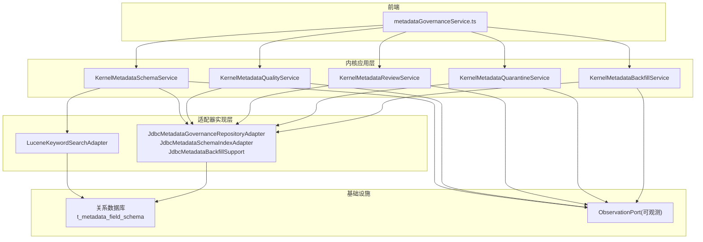
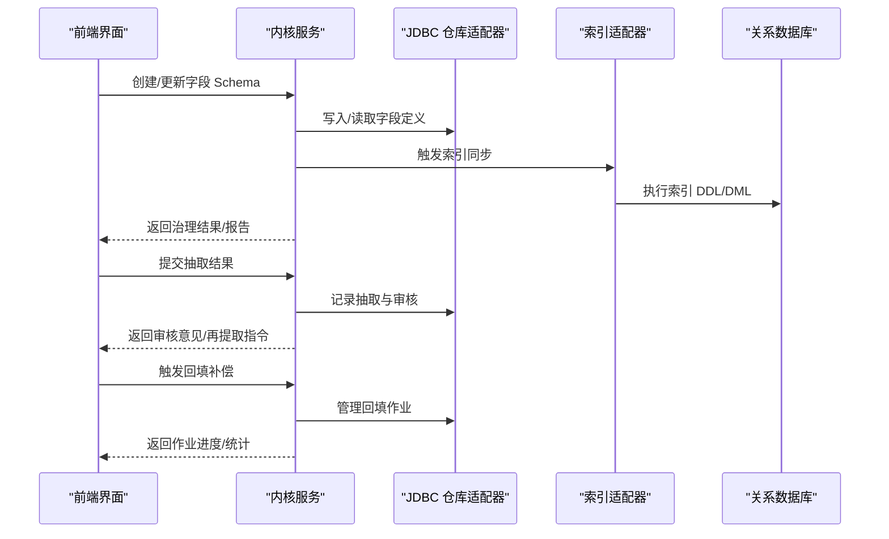
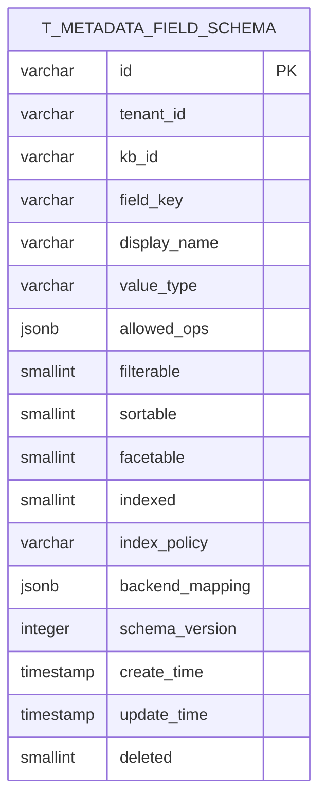
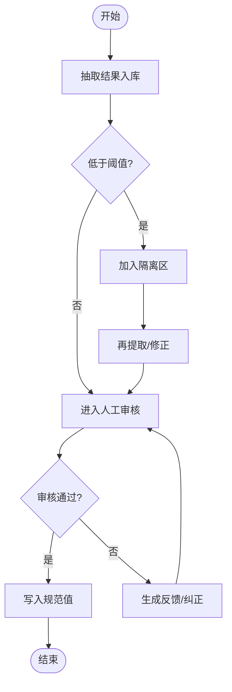
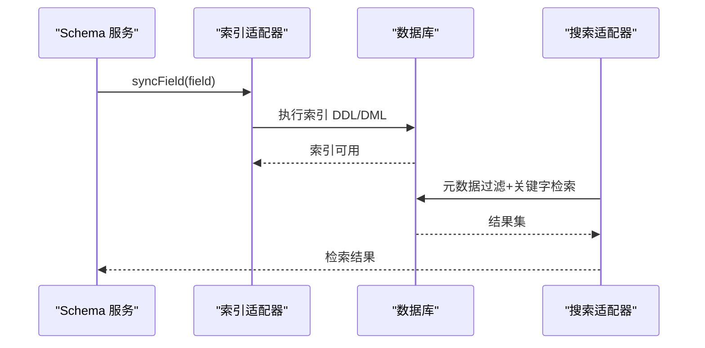
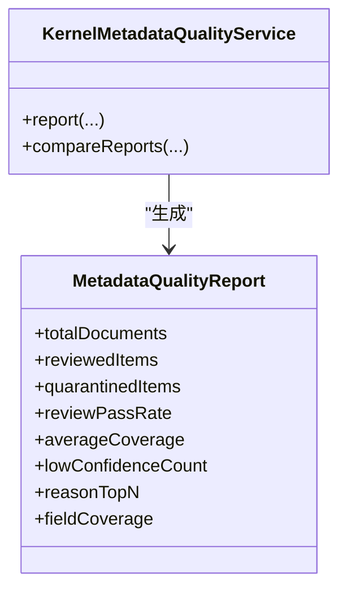
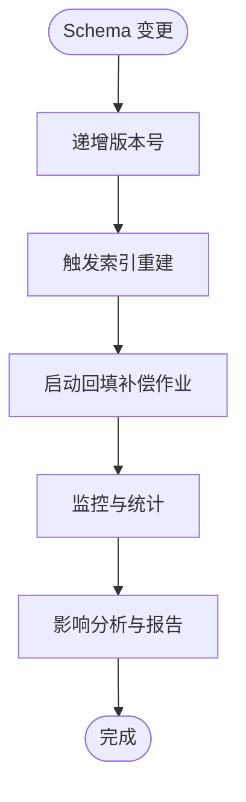
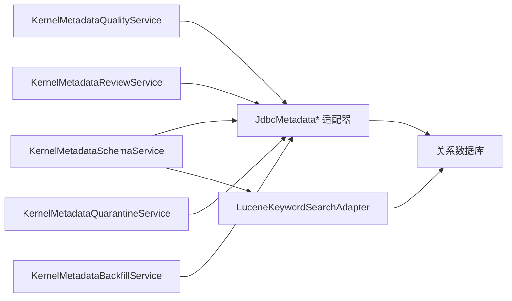

# 元数据治理

<cite>
**本文引用的文件**
- [JdbcMetadataSchemaIndexAdapter.java](file://seahorse-agent-adapter-repository-jdbc/src/main/java/com/miracle/ai/seahorse/agent/adapters/repository/jdbc/JdbcMetadataSchemaIndexAdapter.java)
- [JdbcMetadataGovernanceRepositoryAdapter.java](file://seahorse-agent-adapter-repository-jdbc/src/main/java/com/miracle/ai/seahorse/agent/adapters/repository/jdbc/JdbcMetadataGovernanceRepositoryAdapter.java)
- [JdbcMetadataBackfillSupport.java](file://seahorse-agent-adapter-repository-jdbc/src/main/java/com/miracle/ai/seahorse/agent/adapters/repository/jdbc/JdbcMetadataBackfillSupport.java)
- [LuceneKeywordSearchAdapter.java](file://seahorse-agent-adapter-search-lucene/src/main/java/com/miracle/ai/seahorse/agent/adapters/search/lucene/LuceneKeywordSearchAdapter.java)
- [MetadataIndexPolicy.java](file://seahorse-agent-kernel/src/main/java/com/miracle/ai/seahorse/agent/kernel/domain/metadata/MetadataIndexPolicy.java)
- [KernelMetadataSchemaService.java](file://seahorse-agent-kernel/src/main/java/com/miracle/ai/seahorse/agent/kernel/application/metadata/KernelMetadataSchemaService.java)
- [KernelMetadataQualityService.java](file://seahorse-agent-kernel/src/main/java/com/miracle/ai/seahorse/agent/kernel/application/metadata/KernelMetadataQualityService.java)
- [KernelMetadataReviewService.java](file://seahorse-agent-kernel/src/main/java/com/miracle/ai/seahorse/agent/kernel/application/metadata/KernelMetadataReviewService.java)
- [KernelMetadataQuarantineService.java](file://seahorse-agent-kernel/src/main/java/com/miracle/ai/seahorse/agent/kernel/application/metadata/KernelMetadataQuarantineService.java)
- [KernelMetadataBackfillService.java](file://seahorse-agent-kernel/src/main/java/com/miracle/ai/seahorse/agent/kernel/application/metadata/KernelMetadataBackfillService.java)
- [SeahorseAgentKernelMetadataAutoConfiguration.java](file://seahorse-agent-spring-boot-starter/src/main/java/com/miracle/ai/seahorse/agent/adapters/spring/SeahorseAgentKernelMetadataAutoConfiguration.java)
- [metadataGovernanceService.ts](file://frontend/src/services/metadataGovernanceService.ts)
- [混合检索与重排完善设计方案.md](file://docs/zh/content/架构设计/混合检索与重排完善设计方案.md)
- [t_metadata_field_schema.sql](file://resources/database/seahorse_init.sql)
</cite>

## 目录
1. [简介](#简介)
2. [项目结构](#项目结构)
3. [核心组件](#核心组件)
4. [架构总览](#架构总览)
5. [详细组件分析](#详细组件分析)
6. [依赖分析](#依赖分析)
7. [性能考虑](#性能考虑)
8. [故障排查指南](#故障排查指南)
9. [结论](#结论)
10. [附录](#附录)

## 简介
本文件面向元数据治理系统，系统性梳理字段定义、类型约束与关系模型；阐述元数据提取与标准化（自动识别、人工审核、质量控制）；说明索引与搜索能力（全文检索、结构化查询、高级过滤）；介绍质量管理（完整性、一致性、异常处理）；说明版本控制与变更追踪（历史记录、回滚、影响分析）；并提供治理策略、实施流程与效果评估方法，以及合规与最佳实践建议。

## 项目结构
元数据治理相关能力由“内核应用层”“适配器实现层”“前端服务层”“数据库脚本”等组成，围绕“模式管理、抽取与标准化、索引同步、搜索、质量与合规、回填补偿”六大闭环展开。

图表来源
- [SeahorseAgentKernelMetadataAutoConfiguration.java:74-121](file://seahorse-agent-spring-boot-starter/src/main/java/com/miracle/ai/seahorse/agent/adapters/spring/SeahorseAgentKernelMetadataAutoConfiguration.java#L74-L121)
- [KernelMetadataSchemaService.java:14-25](file://seahorse-agent-kernel/src/main/java/com/miracle/ai/seahorse/agent/kernel/application/metadata/KernelMetadataSchemaService.java#L14-L25)
- [KernelMetadataQualityService.java:75-94](file://seahorse-agent-kernel/src/main/java/com/miracle/ai/seahorse/agent/kernel/application/metadata/KernelMetadataQualityService.java#L75-L94)
- [KernelMetadataReviewService.java:1-25](file://seahorse-agent-kernel/src/main/java/com/miracle/ai/seahorse/agent/kernel/application/metadata/KernelMetadataReviewService.java#L1-L25)
- [KernelMetadataQuarantineService.java:1-25](file://seahorse-agent-kernel/src/main/java/com/miracle/ai/seahorse/agent/kernel/application/metadata/KernelMetadataQuarantineService.java#L1-L25)
- [KernelMetadataBackfillService.java:1-25](file://seahorse-agent-kernel/src/main/java/com/miracle/ai/seahorse/agent/kernel/application/metadata/KernelMetadataBackfillService.java#L1-L25)
- [JdbcMetadataSchemaIndexAdapter.java:65-77](file://seahorse-agent-adapter-repository-jdbc/src/main/java/com/miracle/ai/seahorse/agent/adapters/repository/jdbc/JdbcMetadataSchemaIndexAdapter.java#L65-L77)
- [JdbcMetadataGovernanceRepositoryAdapter.java:815-842](file://seahorse-agent-adapter-repository-jdbc/src/main/java/com/miracle/ai/seahorse/agent/adapters/repository/jdbc/JdbcMetadataGovernanceRepositoryAdapter.java#L815-L842)
- [JdbcMetadataBackfillSupport.java:100-128](file://seahorse-agent-adapter-repository-jdbc/src/main/java/com/miracle/ai/seahorse/agent/adapters/repository/jdbc/JdbcMetadataBackfillSupport.java#L100-L128)
- [LuceneKeywordSearchAdapter.java:272-295](file://seahorse-agent-adapter-search-lucene/src/main/java/com/miracle/ai/seahorse/agent/adapters/search/lucene/LuceneKeywordSearchAdapter.java#L272-L295)
- [t_metadata_field_schema.sql](file://resources/database/seahorse_init.sql)

章节来源
- [SeahorseAgentKernelMetadataAutoConfiguration.java:74-121](file://seahorse-agent-spring-boot-starter/src/main/java/com/miracle/ai/seahorse/agent/adapters/spring/SeahorseAgentKernelMetadataAutoConfiguration.java#L74-L121)
- [KernelMetadataSchemaService.java:14-25](file://seahorse-agent-kernel/src/main/java/com/miracle/ai/seahorse/agent/kernel/application/metadata/KernelMetadataSchemaService.java#L14-L25)
- [KernelMetadataQualityService.java:75-94](file://seahorse-agent-kernel/src/main/java/com/miracle/ai/seahorse/agent/kernel/application/metadata/KernelMetadataQualityService.java#L75-L94)
- [KernelMetadataReviewService.java:1-25](file://seahorse-agent-kernel/src/main/java/com/miracle/ai/seahorse/agent/kernel/application/metadata/KernelMetadataReviewService.java#L1-L25)
- [KernelMetadataQuarantineService.java:1-25](file://seahorse-agent-kernel/src/main/java/com/miracle/ai/seahorse/agent/kernel/application/metadata/KernelMetadataQuarantineService.java#L1-L25)
- [KernelMetadataBackfillService.java:1-25](file://seahorse-agent-kernel/src/main/java/com/miracle/ai/seahorse/agent/kernel/application/metadata/KernelMetadataBackfillService.java#L1-L25)
- [JdbcMetadataSchemaIndexAdapter.java:65-77](file://seahorse-agent-adapter-repository-jdbc/src/main/java/com/miracle/ai/seahorse/agent/adapters/repository/jdbc/JdbcMetadataSchemaIndexAdapter.java#L65-L77)
- [JdbcMetadataGovernanceRepositoryAdapter.java:815-842](file://seahorse-agent-adapter-repository-jdbc/src/main/java/com/miracle/ai/seahorse/agent/adapters/repository/jdbc/JdbcMetadataGovernanceRepositoryAdapter.java#L815-L842)
- [JdbcMetadataBackfillSupport.java:100-128](file://seahorse-agent-adapter-repository-jdbc/src/main/java/com/miracle/ai/seahorse/agent/adapters/repository/jdbc/JdbcMetadataBackfillSupport.java#L100-L128)
- [LuceneKeywordSearchAdapter.java:272-295](file://seahorse-agent-adapter-search-lucene/src/main/java/com/miracle/ai/seahorse/agent/adapters/search/lucene/LuceneKeywordSearchAdapter.java#L272-L295)
- [t_metadata_field_schema.sql](file://resources/database/seahorse_init.sql)

## 核心组件
- 模式管理与索引同步
  - KernelMetadataSchemaService：负责字段 Schema 的注册、能力描述与索引同步触发。
  - JdbcMetadataSchemaIndexAdapter：根据字段策略生成并执行索引 DDL/DML，记录同步状态与观测事件。
- 抽取与标准化
  - KernelMetadataReviewService：抽取结果的人工审核、决策与再提取。
  - KernelMetadataQuarantineService：异常项隔离与重试控制。
  - KernelMetadataBackfillService：基于规则的回填补偿与作业管理。
- 质量与报告
  - KernelMetadataQualityService：生成质量报告、对比报告与差异分析。
- 搜索与过滤
  - LuceneKeywordSearchAdapter：基于 Lucene 的关键字/文本检索，支持元数据过滤。
- 前端治理服务
  - metadataGovernanceService.ts：前端治理界面的数据访问与交互封装。

章节来源
- [KernelMetadataSchemaService.java:14-25](file://seahorse-agent-kernel/src/main/java/com/miracle/ai/seahorse/agent/kernel/application/metadata/KernelMetadataSchemaService.java#L14-L25)
- [JdbcMetadataSchemaIndexAdapter.java:65-77](file://seahorse-agent-adapter-repository-jdbc/src/main/java/com/miracle/ai/seahorse/agent/adapters/repository/jdbc/JdbcMetadataSchemaIndexAdapter.java#L65-L77)
- [KernelMetadataReviewService.java:1-25](file://seahorse-agent-kernel/src/main/java/com/miracle/ai/seahorse/agent/kernel/application/metadata/KernelMetadataReviewService.java#L1-L25)
- [KernelMetadataQuarantineService.java:1-25](file://seahorse-agent-kernel/src/main/java/com/miracle/ai/seahorse/agent/kernel/application/metadata/KernelMetadataQuarantineService.java#L1-L25)
- [KernelMetadataBackfillService.java:1-25](file://seahorse-agent-kernel/src/main/java/com/miracle/ai/seahorse/agent/kernel/application/metadata/KernelMetadataBackfillService.java#L1-L25)
- [KernelMetadataQualityService.java:75-94](file://seahorse-agent-kernel/src/main/java/com/miracle/ai/seahorse/agent/kernel/application/metadata/KernelMetadataQualityService.java#L75-L94)
- [LuceneKeywordSearchAdapter.java:272-295](file://seahorse-agent-adapter-search-lucene/src/main/java/com/miracle/ai/seahorse/agent/adapters/search/lucene/LuceneKeywordSearchAdapter.java#L272-L295)
- [metadataGovernanceService.ts:52-61](file://frontend/src/services/metadataGovernanceService.ts#L52-L61)

## 架构总览
系统围绕“Schema 定义—抽取与标准化—索引同步—搜索—质量与合规—回填补偿”的闭环运行，通过 JDBC 适配器持久化与可观测事件贯穿各环节。

图表来源
- [KernelMetadataSchemaService.java:14-25](file://seahorse-agent-kernel/src/main/java/com/miracle/ai/seahorse/agent/kernel/application/metadata/KernelMetadataSchemaService.java#L14-L25)
- [JdbcMetadataSchemaIndexAdapter.java:65-77](file://seahorse-agent-adapter-repository-jdbc/src/main/java/com/miracle/ai/seahorse/agent/adapters/repository/jdbc/JdbcMetadataSchemaIndexAdapter.java#L65-L77)
- [JdbcMetadataGovernanceRepositoryAdapter.java:815-842](file://seahorse-agent-adapter-repository-jdbc/src/main/java/com/miracle/ai/seahorse/agent/adapters/repository/jdbc/JdbcMetadataGovernanceRepositoryAdapter.java#L815-L842)
- [KernelMetadataBackfillService.java:1-25](file://seahorse-agent-kernel/src/main/java/com/miracle/ai/seahorse/agent/kernel/application/metadata/KernelMetadataBackfillService.java#L1-L25)

## 详细组件分析

### 字段定义、类型约束与关系模型
- 字段模型
  - 字段键、显示名、值类型、允许操作符、必填、可过滤、可排序、可聚合、是否索引、索引策略、最小置信度、可信来源、抽取提示、后端映射、Schema 版本、时间戳与软删标记。
- 关系模型
  - 租户级与知识库级字段作用域；唯一键约束保证同租户/知识库下字段键唯一；版本号用于索引重建与补偿。
- 索引策略枚举
  - 支持 NONE、JSON_GIN、EXPRESSION_INDEX、SEARCH_KEYWORD、SEARCH_TEXT、MILVUS_JSON、MILVUS_SCALAR 等策略。

图表来源
- [混合检索与重排完善设计方案.md:265-308](file://docs/zh/content/架构设计/混合检索与重排完善设计方案.md#L265-L308)
- [t_metadata_field_schema.sql](file://resources/database/seahorse_init.sql)

章节来源
- [混合检索与重排完善设计方案.md:257-308](file://docs/zh/content/架构设计/混合检索与重排完善设计方案.md#L257-L308)
- [t_metadata_field_schema.sql](file://resources/database/seahorse_init.sql)
- [MetadataIndexPolicy.java:3-11](file://seahorse-agent-kernel/src/main/java/com/miracle/ai/seahorse/agent/kernel/domain/metadata/MetadataIndexPolicy.java#L3-L11)

### 元数据提取与标准化
- 自动识别与抽取
  - 通过抽取结果记录与阈值控制（如最小置信度）进行初筛。
- 人工审核与再提取
  - 审核反馈汇总、纠正率统计、待审数量与问题归因。
- 质量控制
  - 低置信度、缺失 Schema、字段覆盖率等指标纳入质量报告。

图表来源
- [KernelMetadataReviewService.java:1-25](file://seahorse-agent-kernel/src/main/java/com/miracle/ai/seahorse/agent/kernel/application/metadata/KernelMetadataReviewService.java#L1-L25)
- [KernelMetadataQualityService.java:75-94](file://seahorse-agent-kernel/src/main/java/com/miracle/ai/seahorse/agent/kernel/application/metadata/KernelMetadataQualityService.java#L75-L94)

章节来源
- [KernelMetadataReviewService.java:1-25](file://seahorse-agent-kernel/src/main/java/com/miracle/ai/seahorse/agent/kernel/application/metadata/KernelMetadataReviewService.java#L1-L25)
- [KernelMetadataQualityService.java:75-94](file://seahorse-agent-kernel/src/main/java/com/miracle/ai/seahorse/agent/kernel/application/metadata/KernelMetadataQualityService.java#L75-L94)

### 元数据索引与搜索
- 索引同步
  - 根据字段策略生成索引，记录同步状态与观测事件，失败时回退与告警。
- 搜索能力
  - Lucene 关键字/文本搜索，支持基于元数据的过滤与排序；后端映射将业务字段映射到具体存储字段。
- 结构化查询与高级过滤
  - 通过字段能力描述与策略组合，构建可过滤、可排序、可聚合的查询条件。

图表来源
- [JdbcMetadataSchemaIndexAdapter.java:65-77](file://seahorse-agent-adapter-repository-jdbc/src/main/java/com/miracle/ai/seahorse/agent/adapters/repository/jdbc/JdbcMetadataSchemaIndexAdapter.java#L65-L77)
- [LuceneKeywordSearchAdapter.java:272-295](file://seahorse-agent-adapter-search-lucene/src/main/java/com/miracle/ai/seahorse/agent/adapters/search/lucene/LuceneKeywordSearchAdapter.java#L272-L295)

章节来源
- [JdbcMetadataSchemaIndexAdapter.java:65-77](file://seahorse-agent-adapter-repository-jdbc/src/main/java/com/miracle/ai/seahorse/agent/adapters/repository/jdbc/JdbcMetadataSchemaIndexAdapter.java#L65-L77)
- [LuceneKeywordSearchAdapter.java:272-295](file://seahorse-agent-adapter-search-lucene/src/main/java/com/miracle/ai/seahorse/agent/adapters/search/lucene/LuceneKeywordSearchAdapter.java#L272-L295)

### 元数据质量管理
- 指标体系
  - 文档总数、已审项、隔离数、审核通过率、平均覆盖率、低置信度比例、待审与未决隔离数、索引同步失败数、字段覆盖率与问题 TopN。
- 报告生成与对比
  - 对比基线与候选版本的质量差异，辅助变更影响评估。

图表来源
- [KernelMetadataQualityService.java:75-94](file://seahorse-agent-kernel/src/main/java/com/miracle/ai/seahorse/agent/kernel/application/metadata/KernelMetadataQualityService.java#L75-L94)
- [metadataGovernanceService.ts:52-61](file://frontend/src/services/metadataGovernanceService.ts#L52-L61)

章节来源
- [KernelMetadataQualityService.java:75-94](file://seahorse-agent-kernel/src/main/java/com/miracle/ai/seahorse/agent/kernel/application/metadata/KernelMetadataQualityService.java#L75-L94)
- [metadataGovernanceService.ts:52-61](file://frontend/src/services/metadataGovernanceService.ts#L52-L61)

### 元数据版本控制与变更追踪
- 版本号与索引重建
  - 字段 Schema 带版本号，索引策略变更需重建索引。
- 回填补偿与作业管理
  - 基于规则的批量回填、暂停/恢复、失败重试与统计概览。
- 影响分析
  - 通过质量报告对比与字段覆盖率变化，评估 Schema 变更的影响范围。

图表来源
- [JdbcMetadataSchemaIndexAdapter.java:65-77](file://seahorse-agent-adapter-repository-jdbc/src/main/java/com/miracle/ai/seahorse/agent/adapters/repository/jdbc/JdbcMetadataSchemaIndexAdapter.java#L65-L77)
- [JdbcMetadataBackfillSupport.java:100-128](file://seahorse-agent-adapter-repository-jdbc/src/main/java/com/miracle/ai/seahorse/agent/adapters/repository/jdbc/JdbcMetadataBackfillSupport.java#L100-L128)

章节来源
- [JdbcMetadataSchemaIndexAdapter.java:65-77](file://seahorse-agent-adapter-repository-jdbc/src/main/java/com/miracle/ai/seahorse/agent/adapters/repository/jdbc/JdbcMetadataSchemaIndexAdapter.java#L65-L77)
- [JdbcMetadataBackfillSupport.java:100-128](file://seahorse-agent-adapter-repository-jdbc/src/main/java/com/miracle/ai/seahorse/agent/adapters/repository/jdbc/JdbcMetadataBackfillSupport.java#L100-L128)

### 治理策略、实施流程与效果评估
- 策略制定
  - 明确字段命名规范、值类型与操作符集合、索引策略选择原则、阈值设定与可信来源清单。
- 实施流程
  - 字段注册→策略生效→索引同步→抽取与审核→质量报告→回填补偿→持续优化。
- 效果评估
  - 以覆盖率、通过率、纠正率、隔离率、对比报告为指标，定期复盘与迭代。

章节来源
- [混合检索与重排完善设计方案.md:257-308](file://docs/zh/content/架构设计/混合检索与重排完善设计方案.md#L257-L308)
- [KernelMetadataQualityService.java:75-94](file://seahorse-agent-kernel/src/main/java/com/miracle/ai/seahorse/agent/kernel/application/metadata/KernelMetadataQualityService.java#L75-L94)

### 合规要求与最佳实践
- 合规要点
  - 数据最小化、可追溯、可审计；字段定义与策略符合组织安全与隐私政策。
- 最佳实践
  - 统一字段命名与值域；为关键字段启用索引与可排序；设置合理的置信度阈值；定期回填补偿与质量评估；版本化变更与影响分析。

## 依赖分析
- 组件耦合
  - 内核服务通过端口与适配器解耦；JDBC 适配器承担持久化与索引状态记录；搜索适配器依赖后端字段映射。
- 外部依赖
  - 关系数据库承载 Schema 与治理作业状态；Lucene 提供全文检索能力；可观测端口记录同步与异常事件。

图表来源
- [SeahorseAgentKernelMetadataAutoConfiguration.java:74-121](file://seahorse-agent-spring-boot-starter/src/main/java/com/miracle/ai/seahorse/agent/adapters/spring/SeahorseAgentKernelMetadataAutoConfiguration.java#L74-L121)
- [JdbcMetadataSchemaIndexAdapter.java:65-77](file://seahorse-agent-adapter-repository-jdbc/src/main/java/com/miracle/ai/seahorse/agent/adapters/repository/jdbc/JdbcMetadataSchemaIndexAdapter.java#L65-L77)
- [LuceneKeywordSearchAdapter.java:272-295](file://seahorse-agent-adapter-search-lucene/src/main/java/com/miracle/ai/seahorse/agent/adapters/search/lucene/LuceneKeywordSearchAdapter.java#L272-L295)

章节来源
- [SeahorseAgentKernelMetadataAutoConfiguration.java:74-121](file://seahorse-agent-spring-boot-starter/src/main/java/com/miracle/ai/seahorse/agent/adapters/spring/SeahorseAgentKernelMetadataAutoConfiguration.java#L74-L121)
- [JdbcMetadataSchemaIndexAdapter.java:65-77](file://seahorse-agent-adapter-repository-jdbc/src/main/java/com/miracle/ai/seahorse/agent/adapters/repository/jdbc/JdbcMetadataSchemaIndexAdapter.java#L65-L77)
- [LuceneKeywordSearchAdapter.java:272-295](file://seahorse-agent-adapter-search-lucene/src/main/java/com/miracle/ai/seahorse/agent/adapters/search/lucene/LuceneKeywordSearchAdapter.java#L272-L295)

## 性能考虑
- 索引策略选择
  - 关键字/文本检索优先使用 SEARCH_KEYWORD/SEARCH_TEXT；复杂表达式使用 EXPRESSION_INDEX；JSON 结构化查询使用 JSON_GIN；向量场景使用 MILVUS_*。
- 查询优化
  - 合理利用可过滤/可排序/可聚合字段；避免全表扫描；对高基数字段谨慎开启聚合。
- 批处理与回填
  - 控制批次大小与并发度；失败重试与断点续跑；观测事件辅助定位瓶颈。

## 故障排查指南
- 索引同步失败
  - 查看同步状态记录与观测事件；确认策略与后端映射；核对权限与资源配额。
- 搜索无结果
  - 校验字段是否索引、策略是否匹配；检查后端映射与字段键拼接；确认文档是否已写入。
- 质量报告异常
  - 校验阈值与字段覆盖率计算；检查隔离原因与再提取作业状态。
- 回填作业卡住
  - 查看作业分页与断点；核对暂停原因与失败摘要；必要时手动干预或重试。

章节来源
- [JdbcMetadataSchemaIndexAdapter.java:231-242](file://seahorse-agent-adapter-repository-jdbc/src/main/java/com/miracle/ai/seahorse/agent/adapters/repository/jdbc/JdbcMetadataSchemaIndexAdapter.java#L231-L242)
- [JdbcMetadataBackfillSupport.java:100-128](file://seahorse-agent-adapter-repository-jdbc/src/main/java/com/miracle/ai/seahorse/agent/adapters/repository/jdbc/JdbcMetadataBackfillSupport.java#L100-L128)
- [KernelMetadataQualityService.java:75-94](file://seahorse-agent-kernel/src/main/java/com/miracle/ai/seahorse/agent/kernel/application/metadata/KernelMetadataQualityService.java#L75-L94)

## 结论
该元数据治理系统以 Schema 为中心，结合抽取、审核、索引、搜索、质量与回填补偿形成闭环，具备版本化演进与可观测能力。通过统一的字段模型、策略与报告体系，可有效支撑企业级知识库的检索质量与合规运营。

## 附录
- 前端治理服务接口定义
  - 包含质量报告字段结构，便于前端展示与交互。

章节来源
- [metadataGovernanceService.ts:52-61](file://frontend/src/services/metadataGovernanceService.ts#L52-L61)