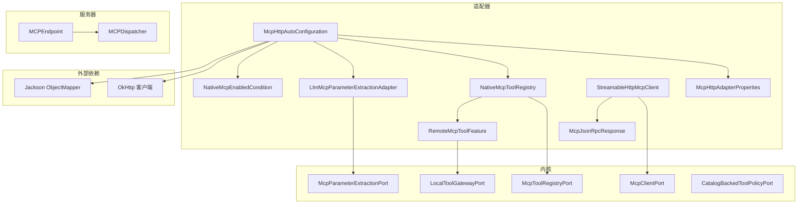
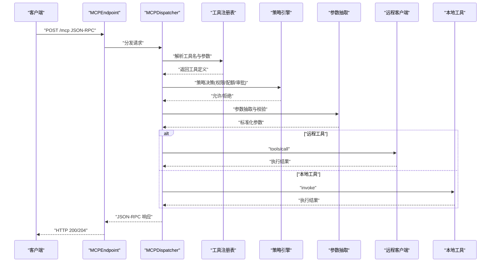
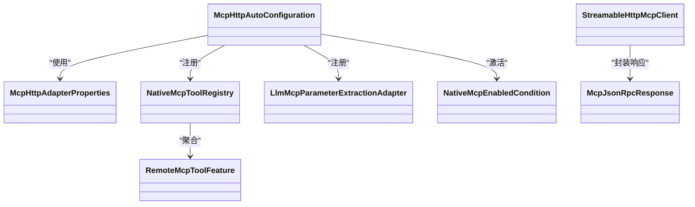
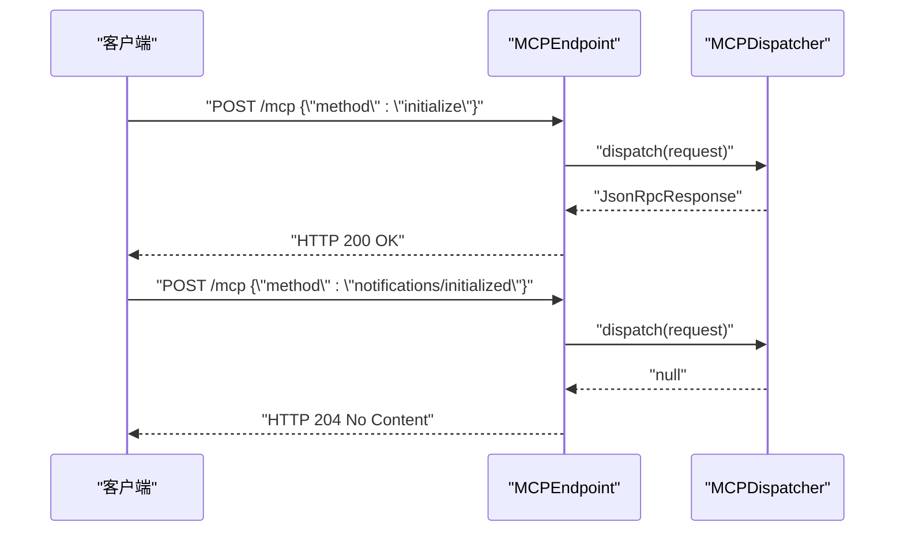
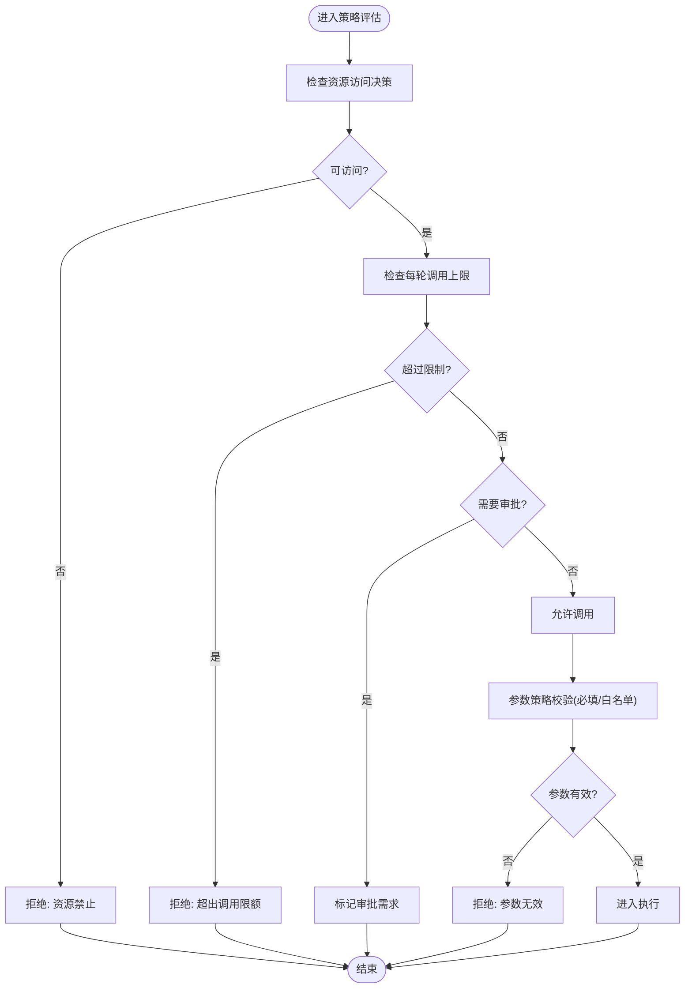
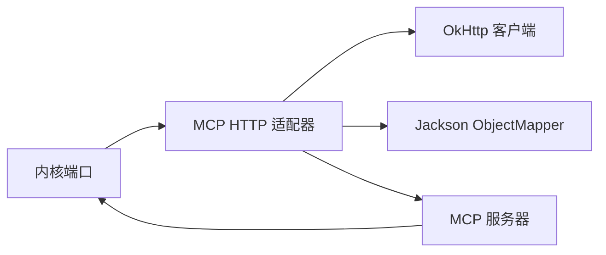

# 工具调用系统

<cite>
**本文档引用的文件**
- [MCP 适配器.md](file://docs/zh/content/后端系统/适配器模块/MCP 适配器.md)
- [McpHttpAutoConfiguration.java](file://seahorse-agent-adapter-mcp-http/src/main/java/com/miracle/ai/seahorse/agent/adapters/mcp/http/McpHttpAutoConfiguration.java)
- [McpHttpAdapterProperties.java](file://seahorse-agent-adapter-mcp-http/src/main/java/com/miracle/ai/seahorse/agent/adapters/mcp/http/McpHttpAdapterProperties.java)
- [NativeMcpToolRegistry.java](file://seahorse-agent-adapter-mcp-http/src/main/java/com/miracle/ai/seahorse/agent/adapters/mcp/http/NativeMcpToolRegistry.java)
- [LlmMcpParameterExtractionAdapter.java](file://seahorse-agent-adapter-mcp-http/src/main/java/com/miracle/ai/seahorse/agent/adapters/mcp/http/LlmMcpParameterExtractionAdapter.java)
- [StreamableHttpMcpClient.java](file://seahorse-agent-adapter-mcp-http/src/main/java/com/miracle/ai/seahorse/agent/adapters/mcp/http/StreamableHttpMcpClient.java)
- [RemoteMcpToolFeature.java](file://seahorse-agent-adapter-mcp-http/src/main/java/com/miracle/ai/seahorse/agent/adapters/mcp/http/RemoteMcpToolFeature.java)
- [McpJsonRpcResponse.java](file://seahorse-agent-adapter-mcp-http/src/main/java/com/miracle/ai/seahorse/agent/adapters/mcp/http/McpJsonRpcResponse.java)
- [NativeMcpEnabledCondition.java](file://seahorse-agent-adapter-mcp-http/src/main/java/com/miracle/ai/seahorse/agent/adapters/mcp/http/NativeMcpEnabledCondition.java)
- [McpToolRegistryPort.java](file://seahorse-agent-kernel/src/main/java/com/miracle/ai/seahorse/agent/kernel/ports/outbound/mcp/McpToolRegistryPort.java)
- [McpParameterExtractionPort.java](file://seahorse-agent-kernel/src/main/java/com/miracle/ai/seahorse/agent/kernel/ports/outbound/mcp/McpParameterExtractionPort.java)
- [McpClientPort.java](file://seahorse-agent-kernel/src/main/java/com/miracle/ai/seahorse/agent/kernel/ports/outbound/mcp/McpClientPort.java)
- [McpToolFeature.java](file://seahorse-agent-kernel/src/main/java/com/miracle/ai/seahorse/agent/kernel/ports/outbound/mcp/McpToolFeature.java)
- [LocalToolGatewayPort.java](file://seahorse-agent-kernel/src/main/java/com/miracle/ai/seahorse/agent/kernel/application/agent/LocalToolGatewayPort.java)
- [CatalogBackedToolPolicyPort.java](file://seahorse-agent-kernel/src/main/java/com/miracle/ai/seahorse/agent/kernel/application/agent/CatalogBackedToolPolicyPort.java)
- [ToolPolicyReasonCodes.java](file://seahorse-agent-kernel/src/main/java/com/miracle/ai/seahorse/agent/kernel/domain/agent/policy/ToolPolicyReasonCodes.java)
- [ToolArgumentPolicy.java](file://seahorse-agent-kernel/src/main/java/com/miracle/ai/seahorse/agent/kernel/application/agent/ToolArgumentPolicy.java)
- [LocalToolGatewayPortAuditTests.java](file://seahorse-agent-kernel/src/test/java/com/miracle/ai/seahorse/agent/kernel/application/agent/LocalToolGatewayPortAuditTests.java)
- [CatalogBackedToolPolicyPortTests.java](file://seahorse-agent-kernel/src/test/java/com/miracle/ai/seahorse/agent/kernel/application/agent/CatalogBackedToolPolicyPortTests.java)
- [MCPEndpoint.java](file://seahorse-agent-mcp-server/src/main/java/com/miracle/ai/seahorse/agent/adapters/mcp/server/endpoint/MCPEndpoint.java)
- [MCPDispatcher.java](file://seahorse-agent-mcp-server/src/main/java/com/miracle/ai/seahorse/agent/adapters/mcp/server/endpoint/MCPDispatcher.java)
- [MCPEndpointContractTests.java](file://seahorse-agent-mcp-server/src/test/java/com/miracle/ai/seahorse/agent/adapters/mcp/server/endpoint/MCPEndpointContractTests.java)
- [McpToolAllowlistRegistrar.java](file://seahorse-agent-spring-boot-starter/src/main/java/com/miracle/ai/seahorse/agent/adapters/spring/McpToolAllowlistRegistrar.java)
- [JdbcToolCatalogRepositoryAdapterTests.java](file://seahorse-agent-adapter-repository-jdbc/src/test/java/com/miracle/ai/seahorse/agent/adapters/repository/jdbc/JdbcToolCatalogRepositoryAdapterTests.java)
- [SeahorseQuotaController.java](file://seahorse-agent-adapter-web/src/main/java/com/miracle/ai/seahorse/agent/adapter/web/SeahorseQuotaController.java)
</cite>

## 目录
1. [引言](#引言)
2. [项目结构](#项目结构)
3. [核心组件](#核心组件)
4. [架构总览](#架构总览)
5. [详细组件分析](#详细组件分析)
6. [依赖分析](#依赖分析)
7. [性能考虑](#性能考虑)
8. [故障排查指南](#故障排查指南)
9. [结论](#结论)
10. [附录](#附录)

## 引言
本文件系统性阐述工具调用系统中的 MCP（模型控制协议）支持，覆盖协议规范、工具注册与调用机制、本地与远程工具集成、HTTP 适配器、本地执行器与安全控制、权限管理、参数验证与错误处理、执行监控、开发指南与最佳实践，以及安全配置与性能优化策略。

## 项目结构
工具调用系统围绕“内核 + 适配器 + 服务器”的分层组织：
- 内核层：定义工具调用的端口与策略，负责策略决策、参数校验、审计与输出脱敏。
- 适配器层：提供 MCP HTTP 客户端、参数抽取、原生工具注册表、远程工具 Feature 等实现。
- 服务器层：提供 MCP 服务器端点，接收 JSON-RPC 请求并分发到工具执行器。
- Web 层：提供配额与审计等运营能力的 HTTP 接口。

图表来源
- [MCP 适配器.md](file://docs/zh/content/后端系统/适配器模块/MCP 适配器.md)
- [McpHttpAutoConfiguration.java](file://seahorse-agent-adapter-mcp-http/src/main/java/com/miracle/ai/seahorse/agent/adapters/mcp/http/McpHttpAutoConfiguration.java)
- [MCPEndpoint.java](file://seahorse-agent-mcp-server/src/main/java/com/miracle/ai/seahorse/agent/adapters/mcp/server/endpoint/MCPEndpoint.java)
- [MCPDispatcher.java](file://seahorse-agent-mcp-server/src/main/java/com/miracle/ai/seahorse/agent/adapters/mcp/server/endpoint/MCPDispatcher.java)

章节来源
- [MCP 适配器.md](file://docs/zh/content/后端系统/适配器模块/MCP 适配器.md)
- [McpHttpAutoConfiguration.java](file://seahorse-agent-adapter-mcp-http/src/main/java/com/miracle/ai/seahorse/agent/adapters/mcp/http/McpHttpAutoConfiguration.java)

## 核心组件
- 自动装配与条件激活：根据配置决定是否启用 HTTP MCP 适配器，整合本地与远程工具特性。
- 配置属性：集中管理适配器开关、调用超时与远程服务器列表。
- 原生工具注册表：聚合本地与远程工具特性，向内核暴露统一注册端口。
- 参数抽取适配器：基于模型端口进行参数抽取，失败时回退默认参数。
- HTTP JSON-RPC 客户端：封装 initialize、tools/list、tools/call 等方法，处理响应与错误。
- 远程工具 Feature：持有工具描述与远程客户端引用，执行时委托客户端调用。
- 激活条件：控制适配器是否参与 Bean 注册。
- 服务器端点与分发器：提供 /mcp 端点接收 JSON-RPC 请求，分发到对应处理器。

章节来源
- [MCP 适配器.md](file://docs/zh/content/后端系统/适配器模块/MCP 适配器.md)
- [McpHttpAutoConfiguration.java](file://seahorse-agent-adapter-mcp-http/src/main/java/com/miracle/ai/seahorse/agent/adapters/mcp/http/McpHttpAutoConfiguration.java)
- [MCPEndpoint.java](file://seahorse-agent-mcp-server/src/main/java/com/miracle/ai/seahorse/agent/adapters/mcp/server/endpoint/MCPEndpoint.java)
- [MCPDispatcher.java](file://seahorse-agent-mcp-server/src/main/java/com/miracle/ai/seahorse/agent/adapters/mcp/server/endpoint/MCPDispatcher.java)

## 架构总览
下图展示 MCP 工具调用从请求进入、策略决策、参数校验、工具执行到响应返回的全链路：

图表来源
- [MCPEndpoint.java](file://seahorse-agent-mcp-server/src/main/java/com/miracle/ai/seahorse/agent/adapters/mcp/server/endpoint/MCPEndpoint.java)
- [MCPDispatcher.java](file://seahorse-agent-mcp-server/src/main/java/com/miracle/ai/seahorse/agent/adapters/mcp/server/endpoint/MCPDispatcher.java)
- [McpToolRegistryPort.java](file://seahorse-agent-kernel/src/main/java/com/miracle/ai/seahorse/agent/kernel/ports/outbound/mcp/McpToolRegistryPort.java)
- [CatalogBackedToolPolicyPort.java](file://seahorse-agent-kernel/src/main/java/com/miracle/ai/seahorse/agent/kernel/application/agent/CatalogBackedToolPolicyPort.java)
- [LlmMcpParameterExtractionAdapter.java](file://seahorse-agent-adapter-mcp-http/src/main/java/com/miracle/ai/seahorse/agent/adapters/mcp/http/LlmMcpParameterExtractionAdapter.java)
- [StreamableHttpMcpClient.java](file://seahorse-agent-adapter-mcp-http/src/main/java/com/miracle/ai/seahorse/agent/adapters/mcp/http/StreamableHttpMcpClient.java)
- [LocalToolGatewayPort.java](file://seahorse-agent-kernel/src/main/java/com/miracle/ai/seahorse/agent/kernel/application/agent/LocalToolGatewayPort.java)

## 详细组件分析

### MCP HTTP 适配器
- 自动装配与条件：通过条件类控制是否注册 Bean；属性对象承载配置项。
- 原生注册表：聚合本地与远程工具 Feature，统一暴露注册端口。
- 参数抽取：从模型输出中抽取工具参数，失败时回退默认策略。
- HTTP 客户端：封装 JSON-RPC 调用，处理初始化、工具清单与调用流程。
- 远程工具 Feature：持有工具描述与远程客户端，执行时委派调用。
- 响应封装：统一封装 JSON-RPC 响应，便于上层处理。

图表来源
- [McpHttpAutoConfiguration.java](file://seahorse-agent-adapter-mcp-http/src/main/java/com/miracle/ai/seahorse/agent/adapters/mcp/http/McpHttpAutoConfiguration.java)
- [McpHttpAdapterProperties.java](file://seahorse-agent-adapter-mcp-http/src/main/java/com/miracle/ai/seahorse/agent/adapters/mcp/http/McpHttpAdapterProperties.java)
- [NativeMcpToolRegistry.java](file://seahorse-agent-adapter-mcp-http/src/main/java/com/miracle/ai/seahorse/agent/adapters/mcp/http/NativeMcpToolRegistry.java)
- [LlmMcpParameterExtractionAdapter.java](file://seahorse-agent-adapter-mcp-http/src/main/java/com/miracle/ai/seahorse/agent/adapters/mcp/http/LlmMcpParameterExtractionAdapter.java)
- [StreamableHttpMcpClient.java](file://seahorse-agent-adapter-mcp-http/src/main/java/com/miracle/ai/seahorse/agent/adapters/mcp/http/StreamableHttpMcpClient.java)
- [RemoteMcpToolFeature.java](file://seahorse-agent-adapter-mcp-http/src/main/java/com/miracle/ai/seahorse/agent/adapters/mcp/http/RemoteMcpToolFeature.java)
- [McpJsonRpcResponse.java](file://seahorse-agent-adapter-mcp-http/src/main/java/com/miracle/ai/seahorse/agent/adapters/mcp/http/McpJsonRpcResponse.java)
- [NativeMcpEnabledCondition.java](file://seahorse-agent-adapter-mcp-http/src/main/java/com/miracle/ai/seahorse/agent/adapters/mcp/http/NativeMcpEnabledCondition.java)

章节来源
- [MCP 适配器.md](file://docs/zh/content/后端系统/适配器模块/MCP 适配器.md)
- [McpHttpAutoConfiguration.java](file://seahorse-agent-adapter-mcp-http/src/main/java/com/miracle/ai/seahorse/agent/adapters/mcp/http/McpHttpAutoConfiguration.java)

### MCP 服务器端点与分发
- 端点：提供 /mcp 接收 JSON-RPC 请求，区分请求与通知（无响应体）。
- 分发器：根据方法名分发到对应处理器，如 initialize、notifications/initialized、tools/list、tools/call 等。
- 合同测试：确保与 Streamable HTTP JSON-RPC 的契约一致。

图表来源
- [MCPEndpoint.java](file://seahorse-agent-mcp-server/src/main/java/com/miracle/ai/seahorse/agent/adapters/mcp/server/endpoint/MCPEndpoint.java)
- [MCPDispatcher.java](file://seahorse-agent-mcp-server/src/main/java/com/miracle/ai/seahorse/agent/adapters/mcp/server/endpoint/MCPDispatcher.java)
- [MCPEndpointContractTests.java](file://seahorse-agent-mcp-server/src/test/java/com/miracle/ai/seahorse/agent/adapters/mcp/server/endpoint/MCPEndpointContractTests.java)

章节来源
- [MCPEndpoint.java](file://seahorse-agent-mcp-server/src/main/java/com/miracle/ai/seahorse/agent/adapters/mcp/server/endpoint/MCPEndpoint.java)
- [MCPDispatcher.java](file://seahorse-agent-mcp-server/src/main/java/com/miracle/ai/seahorse/agent/adapters/mcp/server/endpoint/MCPDispatcher.java)
- [MCPEndpointContractTests.java](file://seahorse-agent-mcp-server/src/test/java/com/miracle/ai/seahorse/agent/adapters/mcp/server/endpoint/MCPEndpointContractTests.java)

### 权限管理与策略
- 策略决策：基于资源访问决策、调用次数限制、风险等级与操作类型判断是否需要审批。
- 参数策略：校验必填参数与参数白名单，拒绝不合法参数。
- 审计与输出脱敏：记录调用决策与完成状态，敏感输出在返回前进行脱敏。

图表来源
- [CatalogBackedToolPolicyPort.java](file://seahorse-agent-kernel/src/main/java/com/miracle/ai/seahorse/agent/kernel/application/agent/CatalogBackedToolPolicyPort.java)
- [ToolArgumentPolicy.java](file://seahorse-agent-kernel/src/main/java/com/miracle/ai/seahorse/agent/kernel/application/agent/ToolArgumentPolicy.java)
- [ToolPolicyReasonCodes.java](file://seahorse-agent-kernel/src/main/java/com/miracle/ai/seahorse/agent/kernel/domain/agent/policy/ToolPolicyReasonCodes.java)

章节来源
- [CatalogBackedToolPolicyPort.java](file://seahorse-agent-kernel/src/main/java/com/miracle/ai/seahorse/agent/kernel/application/agent/CatalogBackedToolPolicyPort.java)
- [ToolArgumentPolicy.java](file://seahorse-agent-kernel/src/main/java/com/miracle/ai/seahorse/agent/kernel/application/agent/ToolArgumentPolicy.java)
- [ToolPolicyReasonCodes.java](file://seahorse-agent-kernel/src/main/java/com/miracle/ai/seahorse/agent/kernel/domain/agent/policy/ToolPolicyReasonCodes.java)
- [LocalToolGatewayPortAuditTests.java](file://seahorse-agent-kernel/src/test/java/com/miracle/ai/seahorse/agent/kernel/application/agent/LocalToolGatewayPortAuditTests.java)

### 参数验证与错误处理
- 输入校验：参数策略强制必填与白名单，缺失或非法参数直接拒绝。
- 异常捕获：工具执行异常被捕获并转换为失败状态，同时记录审计事件。
- 重试机制：HTTP 客户端封装 JSON-RPC 调用，结合超时与重试策略提升稳定性（由具体实现决定）。

章节来源
- [ToolArgumentPolicy.java](file://seahorse-agent-kernel/src/main/java/com/miracle/ai/seahorse/agent/kernel/application/agent/ToolArgumentPolicy.java)
- [LocalToolGatewayPortAuditTests.java](file://seahorse-agent-kernel/src/test/java/com/miracle/ai/seahorse/agent/kernel/application/agent/LocalToolGatewayPortAuditTests.java)
- [StreamableHttpMcpClient.java](file://seahorse-agent-adapter-mcp-http/src/main/java/com/miracle/ai/seahorse/agent/adapters/mcp/http/StreamableHttpMcpClient.java)

### 执行监控与审计
- 审计事件：记录决策与完成状态，支持结果摘要与敏感信息脱敏。
- 配额统计：Web 控制器提供按用户、工具、模型、运行 ID 等维度的用量统计接口。
- 工具目录：工具目录持久化支持启用/禁用、审批需求与风险等级变更。

章节来源
- [LocalToolGatewayPortAuditTests.java](file://seahorse-agent-kernel/src/test/java/com/miracle/ai/seahorse/agent/kernel/application/agent/LocalToolGatewayPortAuditTests.java)
- [SeahorseQuotaController.java](file://seahorse-agent-adapter-web/src/main/java/com/miracle/ai/seahorse/agent/adapter/web/SeahorseQuotaController.java)
- [JdbcToolCatalogRepositoryAdapterTests.java](file://seahorse-agent-adapter-repository-jdbc/src/test/java/com/miracle/ai/seahorse/agent/adapters/repository/jdbc/JdbcToolCatalogRepositoryAdapterTests.java)

### 工具开发指南与最佳实践
- 工具注册：通过原生注册表聚合本地与远程工具，统一暴露给内核。
- 参数抽取：优先从模型输出抽取参数，失败时采用默认策略，保证鲁棒性。
- 远程工具：使用 HTTP 客户端与 JSON-RPC 协议对接远端 MCP 服务。
- 安全控制：启用审批流程、风险等级与资源访问控制，必要时开启输出脱敏。
- 最佳实践：为工具定义清晰的风险等级与操作类型，合理设置调用限额与审批阈值。

章节来源
- [NativeMcpToolRegistry.java](file://seahorse-agent-adapter-mcp-http/src/main/java/com/miracle/ai/seahorse/agent/adapters/mcp/http/NativeMcpToolRegistry.java)
- [LlmMcpParameterExtractionAdapter.java](file://seahorse-agent-adapter-mcp-http/src/main/java/com/miracle/ai/seahorse/agent/adapters/mcp/http/LlmMcpParameterExtractionAdapter.java)
- [StreamableHttpMcpClient.java](file://seahorse-agent-adapter-mcp-http/src/main/java/com/miracle/ai/seahorse/agent/adapters/mcp/http/StreamableHttpMcpClient.java)
- [McpToolAllowlistRegistrar.java](file://seahorse-agent-spring-boot-starter/src/main/java/com/miracle/ai/seahorse/agent/adapters/spring/McpToolAllowlistRegistrar.java)

## 依赖分析
- 组件耦合：适配器层通过端口与内核解耦；服务器层与适配器层通过 JSON-RPC 协议交互。
- 外部依赖：OkHttp 用于 HTTP 通信，Jackson 用于 JSON 序列化与反序列化。
- 条件装配：通过条件类避免未配置时的 Bean 注册，降低启动成本。

图表来源
- [McpHttpAutoConfiguration.java](file://seahorse-agent-adapter-mcp-http/src/main/java/com/miracle/ai/seahorse/agent/adapters/mcp/http/McpHttpAutoConfiguration.java)
- [MCPEndpoint.java](file://seahorse-agent-mcp-server/src/main/java/com/miracle/ai/seahorse/agent/adapters/mcp/server/endpoint/MCPEndpoint.java)

章节来源
- [McpHttpAutoConfiguration.java](file://seahorse-agent-adapter-mcp-http/src/main/java/com/miracle/ai/seahorse/agent/adapters/mcp/http/McpHttpAutoConfiguration.java)
- [MCPEndpoint.java](file://seahorse-agent-mcp-server/src/main/java/com/miracle/ai/seahorse/agent/adapters/mcp/server/endpoint/MCPEndpoint.java)

## 性能考虑
- 连接复用：使用连接池减少 TCP 握手开销。
- 超时与重试：合理设置超时与指数退避重试，避免阻塞影响整体吞吐。
- 流式传输：利用 Streamable HTTP JSON-RPC 支持流式响应，降低延迟。
- 负载均衡：多实例部署时通过负载均衡分散请求压力。
- 监控指标：结合 Micrometer 观测关键指标（请参考相关适配器模块）。

## 故障排查指南
- 协议契约：使用合同测试验证 /mcp 端点行为，确保 initialize 与 notifications/initialized 的正确性。
- 审计与日志：通过审计事件定位拒绝原因与失败节点，结合输出脱敏确认敏感信息处理。
- 配额与审批：检查工具目录启用状态、审批需求与风险等级，确认策略引擎判定逻辑。
- 参数问题：核对参数策略（必填/白名单），修正非法参数导致的拒绝。

章节来源
- [MCPEndpointContractTests.java](file://seahorse-agent-mcp-server/src/test/java/com/miracle/ai/seahorse/agent/adapters/mcp/server/endpoint/MCPEndpointContractTests.java)
- [LocalToolGatewayPortAuditTests.java](file://seahorse-agent-kernel/src/test/java/com/miracle/ai/seahorse/agent/kernel/application/agent/LocalToolGatewayPortAuditTests.java)
- [CatalogBackedToolPolicyPortTests.java](file://seahorse-agent-kernel/src/test/java/com/miracle/ai/seahorse/agent/kernel/application/agent/CatalogBackedToolPolicyPortTests.java)

## 结论
该工具调用系统以 MCP 为核心协议，通过 HTTP 适配器与服务器端点实现本地与远程工具的统一编排。内核层提供策略、参数与审计能力，适配器层负责协议与外部系统对接，形成高内聚、低耦合的工具执行体系。配合严格的权限管理、参数校验与审计脱敏，系统在安全性与可观测性方面具备良好基础。

## 附录
- 安全配置建议：启用审批流程、严格参数白名单、输出脱敏、最小权限原则与资源访问控制。
- 性能优化策略：连接池、超时与重试、流式传输、负载均衡与指标观测。
- 扩展开发指导：新增工具通过注册表接入，遵循参数策略与风险等级标注，必要时实现远程工具 Feature。