# 市场功能

<cite>
**本文档引用的文件**
- [MarketplacePage.tsx](file://frontend/src/pages/MarketplacePage.tsx)
- [marketplaceService.ts](file://frontend/src/services/marketplaceService.ts)
- [SeahorseMarketplaceController.java](file://seahorse-agent-adapter-web/src/main/java/com/miracle/ai/seahorse/agent/adapters/web/SeahorseMarketplaceController.java)
- [SeahorseRevenueController.java](file://seahorse-agent-adapter-web/src/main/java/com/miracle/ai/seahorse/agent/adapters/web/SeahorseRevenueController.java)
- [KernelAgentMarketplaceService.java](file://seahorse-agent-kernel/src/main/java/com/miracle/ai/seahorse/agent/kernel/application/agent/marketplace/KernelAgentMarketplaceService.java)
- [RevenueService.java](file://seahorse-agent-kernel/src/main/java/com/miracle/ai/seahorse/agent/kernel/application/agent/marketplace/RevenueService.java)
- [RevenueShare.java](file://seahorse-agent-kernel/src/main/java/com/miracle/ai/seahorse/agent/kernel/domain/agent/marketplace/RevenueShare.java)
- [RevenueShareRepositoryPort.java](file://seahorse-agent-kernel/src/main/java/com/miracle/ai/seahorse/agent/ports/outbound/agent/marketplace/RevenueShareRepositoryPort.java)
- [V13__revenue_share.sql](file://resources/database/migrations/V13__revenue_share.sql)
- [07-agent-marketplace.md](file://docs/aegis/plans/saas-mvp-impl/07-agent-marketplace.md)
- [AgentPublishReview.java](file://seahorse-agent-kernel/src/main/java/com/miracle/ai/seahorse/agent/kernel/domain/agent/marketplace/AgentPublishReview.java)
- [AgentRating.java](file://seahorse-agent-kernel/src/main/java/com/miracle/ai/seahorse/agent/kernel/domain/agent/marketplace/AgentRating.java)
- [AgentSubscription.java](file://seahorse-agent-kernel/src/main/java/com/miracle/ai/seahorse/agent/kernel/domain/agent/marketplace/AgentSubscription.java)
- [AgentPublishReviewRepositoryPort.java](file://seahorse-agent-kernel/src/main/java/com/miracle/ai/seahorse/agent/ports/outbound/agent/marketplace/AgentPublishReviewRepositoryPort.java)
- [AgentRatingRepositoryPort.java](file://seahorse-agent-kernel/src/main/java/com/miracle/ai/seahorse/agent/ports/outbound/agent/marketplace/AgentRatingRepositoryPort.java)
- [AgentSubscriptionRepositoryPort.java](file://seahorse-agent-kernel/src/main/java/com/miracle/ai/seahorse/agent/ports/outbound/agent/marketplace/AgentSubscriptionRepositoryPort.java)
- [AgentCatalogQueryPort.java](file://seahorse-agent-kernel/src/main/java/com/miracle/ai/seahorse/agent/ports/outbound/agent/AgentCatalogQueryPort.java)
- [AgentCatalogQuery.java](file://seahorse-agent-kernel/src/main/java/com/miracle/ai/seahorse/agent/ports/inbound/agent/AgentCatalogQuery.java)
- [JdbcAgentCatalogQueryAdapter.java](file://seahorse-agent-adapter-repository-jdbc/src/main/java/com/miracle/ai/seahorse/agent/adapters/repository/jdbc/JdbcAgentCatalogQueryAdapter.java)
</cite>

## 更新摘要
**所做更改**
- 新增收入分成系统，通过V13数据库迁移和RevenueService实现20/80平台到创作者收益分配机制
- 新增收入分成Web控制器，提供创作者收益查询和管理员月度结算功能
- 系统支持月度结算周期、自动平台费用计算和完整的状态管理流程
- 在Agent Marketplace文档中添加了收入分成相关的实现说明
- 增强了市场功能的商业化能力，支持创作者经济模式

## 目录
1. [简介](#简介)
2. [项目结构](#项目结构)
3. [核心组件](#核心组件)
4. [架构概览](#架构概览)
5. [详细组件分析](#详细组件分析)
6. [收入分成系统](#收入分成系统)
7. [前端市场页面](#前端市场页面)
8. [前端服务层](#前端服务层)
9. [依赖关系分析](#依赖关系分析)
10. [性能考虑](#性能考虑)
11. [故障排除指南](#故障排除指南)
12. [结论](#结论)

## 简介

市场功能是 Seahorse Agent 平台的核心商业功能模块，提供了一个完整的 Agent 市场生态系统。该功能允许用户浏览、订阅、评价和管理 Agent，同时为 Agent 开发者提供发布和审核机制。系统支持多租户架构，确保不同组织间的隔离性和安全性。

**更新** 新增了完整的收入分成系统，通过V13数据库迁移和RevenueService实现20/80平台到创作者收益分配机制。系统支持月度结算周期、自动平台费用计算和完整的状态管理流程，为平台的商业化运营奠定了坚实基础。新增的收入分成Web控制器提供了创作者收益查询和管理员月度结算功能，进一步完善了商业化能力。

市场功能包含四个主要子系统：Agent 发布审核系统、订阅管理系统、评分评价系统和收入分成系统。这些系统协同工作，为用户提供完整的 Agent 市场体验。前端新增的MarketplacePage.tsx组件提供了现代化的用户界面，支持多种筛选和排序选项。

## 项目结构

市场功能在代码库中的分布遵循清晰的分层架构，现已扩展为前后端协同的完整实现，新增了收入分成系统的支持：

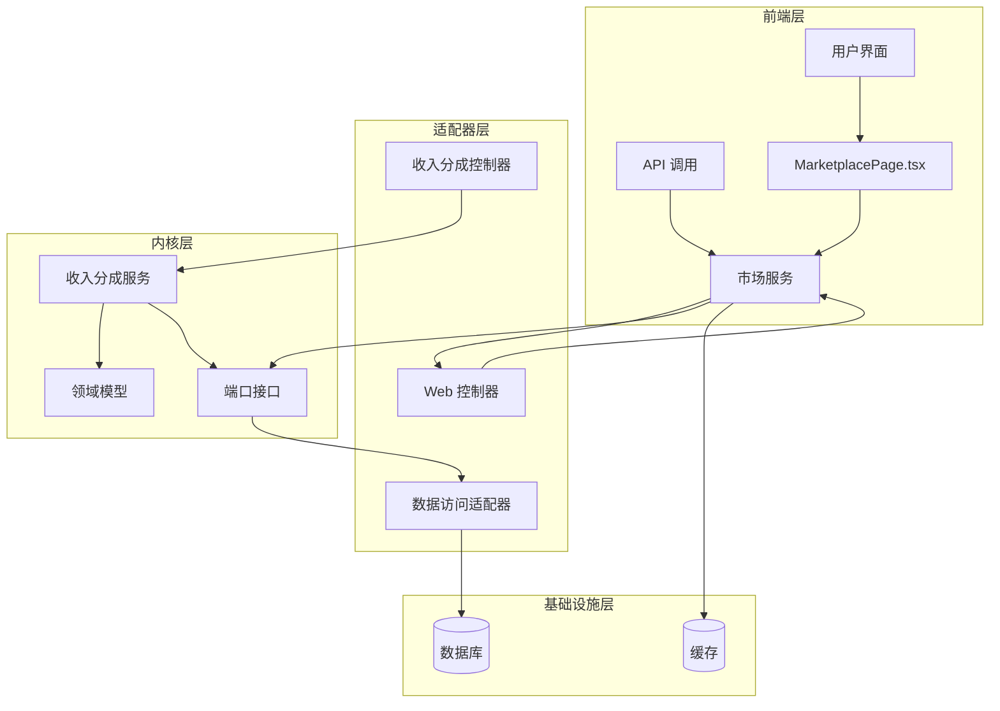

**图表来源**
- [MarketplacePage.tsx:31-82](file://frontend/src/pages/MarketplacePage.tsx#L31-L82)
- [marketplaceService.ts:44-81](file://frontend/src/services/marketplaceService.ts#L44-L81)
- [SeahorseMarketplaceController.java:43-160](file://seahorse-agent-adapter-web/src/main/java/com/miracle/ai/seahorse/agent/adapters/web/SeahorseMarketplaceController.java#L43-L160)
- [SeahorseRevenueController.java:34-98](file://seahorse-agent-adapter-web/src/main/java/com/miracle/ai/seahorse/agent/adapters/web/SeahorseRevenueController.java#L34-L98)
- [KernelAgentMarketplaceService.java:17-262](file://seahorse-agent-kernel/src/main/java/com/miracle/ai/seahorse/agent/kernel/application/agent/marketplace/KernelAgentMarketplaceService.java#L17-L262)
- [RevenueService.java:30-131](file://seahorse-agent-kernel/src/main/java/com/miracle/ai/seahorse/agent/kernel/application/agent/marketplace/RevenueService.java#L30-L131)

**章节来源**
- [MarketplacePage.tsx:31-82](file://frontend/src/pages/MarketplacePage.tsx#L31-L82)
- [marketplaceService.ts:44-81](file://frontend/src/services/marketplaceService.ts#L44-L81)
- [SeahorseMarketplaceController.java:43-160](file://seahorse-agent-adapter-web/src/main/java/com/miracle/ai/seahorse/agent/adapters/web/SeahorseMarketplaceController.java#L43-L160)
- [SeahorseRevenueController.java:34-98](file://seahorse-agent-adapter-web/src/main/java/com/miracle/ai/seahorse/agent/adapters/web/SeahorseRevenueController.java#L34-L98)
- [KernelAgentMarketplaceService.java:17-262](file://seahorse-agent-kernel/src/main/java/com/miracle/ai/seahorse/agent/kernel/application/agent/marketplace/KernelAgentMarketplaceService.java#L17-L262)
- [RevenueService.java:30-131](file://seahorse-agent-kernel/src/main/java/com/miracle/ai/seahorse/agent/kernel/application/agent/marketplace/RevenueService.java#L30-L131)

## 核心组件

市场功能由以下核心组件构成，现已扩展为完整的前后端实现，包含新增的收入分成系统：

### 1. 前端组件层
- **MarketplacePage**: 主要的市场页面组件，提供Agent浏览、筛选、排序和订阅功能
- **marketplaceService**: 前端服务层，封装所有市场相关的API调用

### 2. Web 控制器层
- **SeahorseMarketplaceController**: 提供 RESTful API 接口，处理所有市场相关请求
- **SeahorseRevenueController**: 新增的收入分成控制器，处理创作者收益查询和管理员结算操作
- 支持 Agent 发布申请、审核操作、订阅管理和评分评价

### 3. 应用服务层
- **KernelAgentMarketplaceService**: 核心业务逻辑实现，协调各个市场功能
- **RevenueService**: 收入分成应用服务，处理收益计算、月度结算和创作者收益查询

### 4. 领域模型层
- **AgentPublishReview**: 发布审核实体
- **AgentRating**: 评分评价实体  
- **AgentSubscription**: 订阅管理实体
- **RevenueShare**: 收入分成实体，跟踪平台20%和创作者80%的收益分配

### 5. 数据访问层
- **AgentPublishReviewRepositoryPort**: 发布审核数据访问接口
- **AgentRatingRepositoryPort**: 评分数据访问接口
- **AgentSubscriptionRepositoryPort**: 订阅数据访问接口
- **RevenueShareRepositoryPort**: 收入分成数据访问接口

**章节来源**
- [MarketplacePage.tsx:31-82](file://frontend/src/pages/MarketplacePage.tsx#L31-L82)
- [marketplaceService.ts:3-81](file://frontend/src/services/marketplaceService.ts#L3-L81)
- [SeahorseMarketplaceController.java:43-160](file://seahorse-agent-adapter-web/src/main/java/com/miracle/ai/seahorse/agent/adapters/web/SeahorseMarketplaceController.java#L43-L160)
- [SeahorseRevenueController.java:34-98](file://seahorse-agent-adapter-web/src/main/java/com/miracle/ai/seahorse/agent/adapters/web/SeahorseRevenueController.java#L34-L98)
- [KernelAgentMarketplaceService.java:17-262](file://seahorse-agent-kernel/src/main/java/com/miracle/ai/seahorse/agent/kernel/application/agent/marketplace/KernelAgentMarketplaceService.java#L17-L262)
- [RevenueService.java:30-131](file://seahorse-agent-kernel/src/main/java/com/miracle/ai/seahorse/agent/kernel/application/agent/marketplace/RevenueService.java#L30-L131)

## 架构概览

市场功能采用七层架构设计，确保关注点分离和可维护性，现已扩展为前后端协同架构，包含收入分成系统的支持：

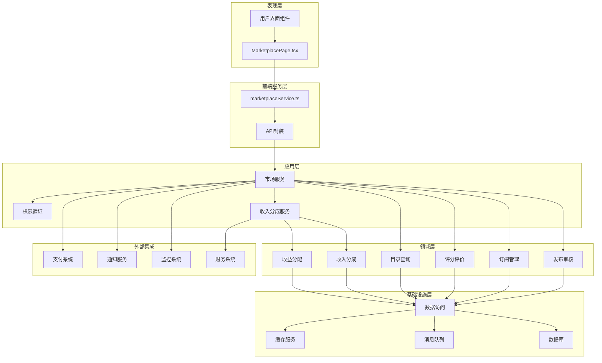

**图表来源**
- [MarketplacePage.tsx:154-421](file://frontend/src/pages/MarketplacePage.tsx#L154-L421)
- [marketplaceService.ts:44-81](file://frontend/src/services/marketplaceService.ts#L44-L81)
- [SeahorseMarketplaceController.java:43-160](file://seahorse-agent-adapter-web/src/main/java/com/miracle/ai/seahorse/agent/adapters/web/SeahorseMarketplaceController.java#L43-L160)
- [SeahorseRevenueController.java:34-98](file://seahorse-agent-adapter-web/src/main/java/com/miracle/ai/seahorse/agent/adapters/web/SeahorseRevenueController.java#L34-L98)
- [KernelAgentMarketplaceService.java:17-262](file://seahorse-agent-kernel/src/main/java/com/miracle/ai/seahorse/agent/kernel/application/agent/marketplace/KernelAgentMarketplaceService.java#L17-L262)
- [RevenueService.java:30-131](file://seahorse-agent-kernel/src/main/java/com/miracle/ai/seahorse/agent/kernel/application/agent/marketplace/RevenueService.java#L30-L131)

## 详细组件分析

### Web 控制器组件

Web 控制器提供 RESTful API 接口，处理市场功能的所有外部交互：

#### 主要 API 端点

| 端点 | 方法 | 功能描述 | 权限要求 |
|------|------|----------|----------|
| `/api/marketplace/agents/{agentId}/publish` | POST | 提交 Agent 发布申请 | 用户 |
| `/api/marketplace/reviews/{reviewId}/approve` | PUT | 审核通过发布申请 | 审核员 |
| `/api/marketplace/reviews/{reviewId}/reject` | PUT | 拒绝发布申请 | 审核员 |
| `/api/marketplace/agents` | GET | 获取 Agent 列表 | 用户 |
| `/api/marketplace/agents/{agentId}/subscribe` | POST | 订阅 Agent | 用户 |
| `/api/marketplace/agents/{agentId}/subscribe` | DELETE | 取消订阅 | 用户 |
| `/api/marketplace/agents/my-subscriptions` | GET | 获取我的订阅 | 用户 |
| `/api/marketplace/agents/{agentId}/ratings` | POST | 评分 Agent | 用户 |
| `/api/marketplace/revenue/my-earnings` | GET | 获取创作者收益汇总 | 用户 |
| `/api/marketplace/revenue/my-earnings/{period}` | GET | 获取指定期间收益 | 用户 |
| `/api/admin/marketplace/revenue/settle/{period}` | POST | 触发月度结算 | 管理员 |

#### 请求响应模型

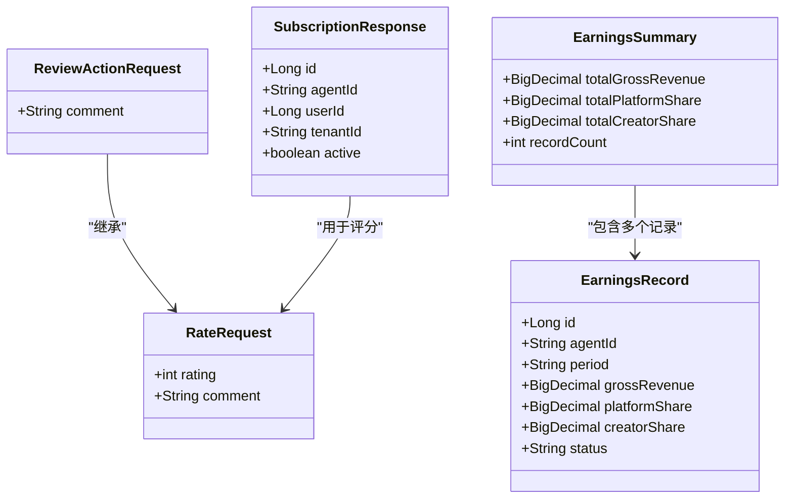

**图表来源**
- [SeahorseMarketplaceController.java:140-158](file://seahorse-agent-adapter-web/src/main/java/com/miracle/ai/seahorse/agent/adapters/web/SeahorseMarketplaceController.java#L140-L158)
- [SeahorseRevenueController.java:103-138](file://seahorse-agent-adapter-web/src/main/java/com/miracle/ai/seahorse/agent/adapters/web/SeahorseRevenueController.java#L103-L138)

**章节来源**
- [SeahorseMarketplaceController.java:58-138](file://seahorse-agent-adapter-web/src/main/java/com/miracle/ai/seahorse/agent/adapters/web/SeahorseMarketplaceController.java#L58-L138)
- [SeahorseRevenueController.java:58-98](file://seahorse-agent-adapter-web/src/main/java/com/miracle/ai/seahorse/agent/adapters/web/SeahorseRevenueController.java#L58-L98)

### 应用服务组件

应用服务层实现核心业务逻辑，协调各个市场功能：

#### 核心业务流程

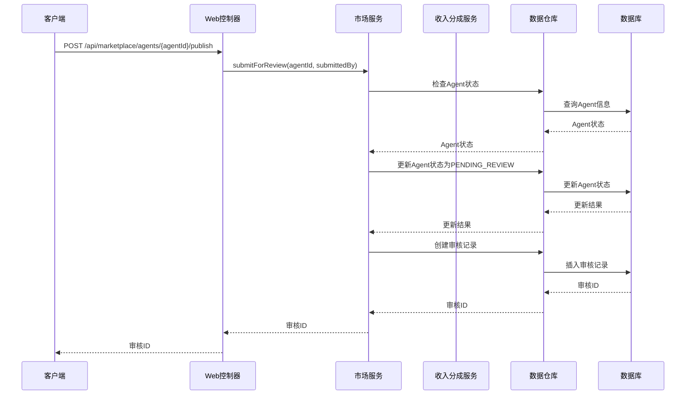

**图表来源**
- [KernelAgentMarketplaceService.java:55-76](file://seahorse-agent-kernel/src/main/java/com/miracle/ai/seahorse/agent/kernel/application/agent/marketplace/KernelAgentMarketplaceService.java#L55-L76)

#### 发布审核流程

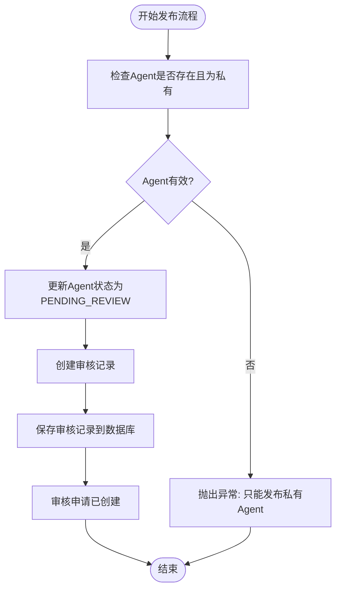

**图表来源**
- [KernelAgentMarketplaceService.java:55-76](file://seahorse-agent-kernel/src/main/java/com/miracle/ai/seahorse/agent/kernel/application/agent/marketplace/KernelAgentMarketplaceService.java#L55-L76)

**章节来源**
- [KernelAgentMarketplaceService.java:50-127](file://seahorse-agent-kernel/src/main/java/com/miracle/ai/seahorse/agent/kernel/application/agent/marketplace/KernelAgentMarketplaceService.java#L50-L127)

### 领域模型组件

领域模型定义了市场功能的核心数据结构和业务规则：

#### 发布审核实体

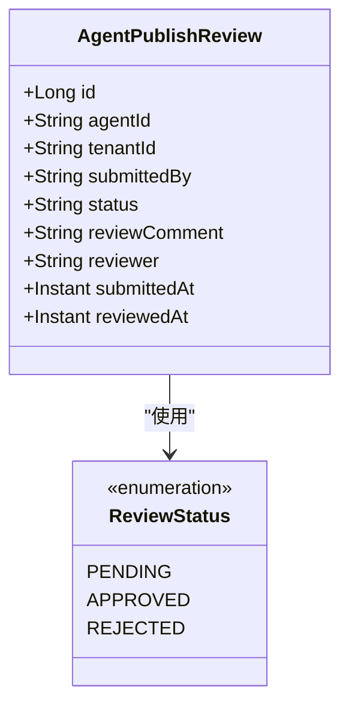

**图表来源**
- [AgentPublishReview.java:36-90](file://seahorse-agent-kernel/src/main/java/com/miracle/ai/seahorse/agent/kernel/domain/agent/marketplace/AgentPublishReview.java#L36-L90)

#### 订阅管理实体

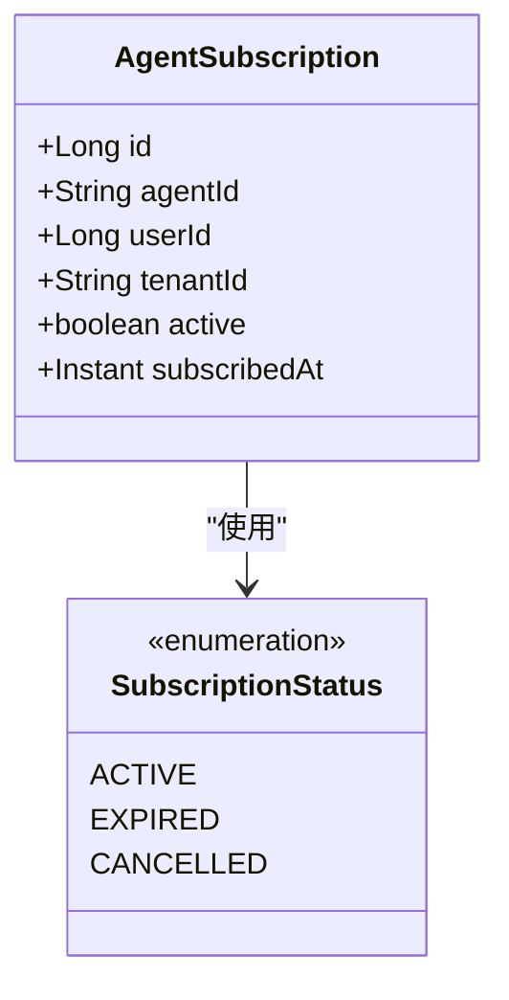

**图表来源**
- [AgentSubscription.java:33-66](file://seahorse-agent-kernel/src/main/java/com/miracle/ai/seahorse/agent/kernel/domain/agent/marketplace/AgentSubscription.java#L33-L66)

#### 评分评价实体

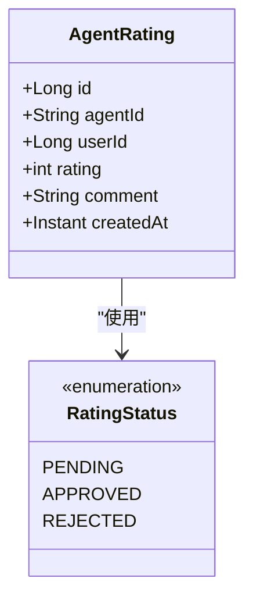

**图表来源**
- [AgentRating.java:33-63](file://seahorse-agent-kernel/src/main/java/com/miracle/ai/seahorse/agent/kernel/domain/agent/marketplace/AgentRating.java#L33-L63)

#### 收入分成实体

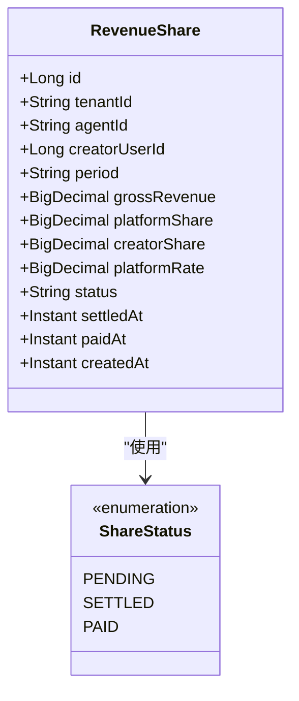

**图表来源**
- [RevenueShare.java:29-86](file://seahorse-agent-kernel/src/main/java/com/miracle/ai/seahorse/agent/kernel/domain/agent/marketplace/RevenueShare.java#L29-L86)

**章节来源**
- [AgentPublishReview.java:23-90](file://seahorse-agent-kernel/src/main/java/com/miracle/ai/seahorse/agent/kernel/domain/agent/marketplace/AgentPublishReview.java#L23-L90)
- [AgentSubscription.java:23-66](file://seahorse-agent-kernel/src/main/java/com/miracle/ai/seahorse/agent/kernel/domain/agent/marketplace/AgentSubscription.java#L23-L66)
- [AgentRating.java:23-63](file://seahorse-agent-kernel/src/main/java/com/miracle/ai/seahorse/agent/kernel/domain/agent/marketplace/AgentRating.java#L23-L63)
- [RevenueShare.java:23-86](file://seahorse-agent-kernel/src/main/java/com/miracle/ai/seahorse/agent/kernel/domain/agent/marketplace/RevenueShare.java#L23-L86)

### 数据访问组件

数据访问层提供对市场数据的持久化操作：

#### 目录查询适配器

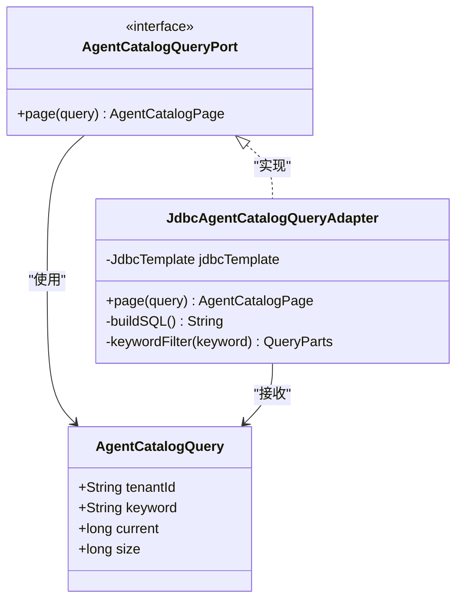

**图表来源**
- [AgentCatalogQueryPort.java:23-26](file://seahorse-agent-kernel/src/main/java/com/miracle/ai/seahorse/agent/ports/outbound/agent/AgentCatalogQueryPort.java#L23-L26)
- [AgentCatalogQuery.java:20-38](file://seahorse-agent-kernel/src/main/java/com/miracle/ai/seahorse/agent/ports/inbound/agent/AgentCatalogQuery.java#L20-L38)
- [JdbcAgentCatalogQueryAdapter.java:64-84](file://seahorse-agent-adapter-repository-jdbc/src/main/java/com/miracle/ai/seahorse/agent/adapters/repository/jdbc/JdbcAgentCatalogQueryAdapter.java#L64-L84)

#### 收入分成数据访问接口

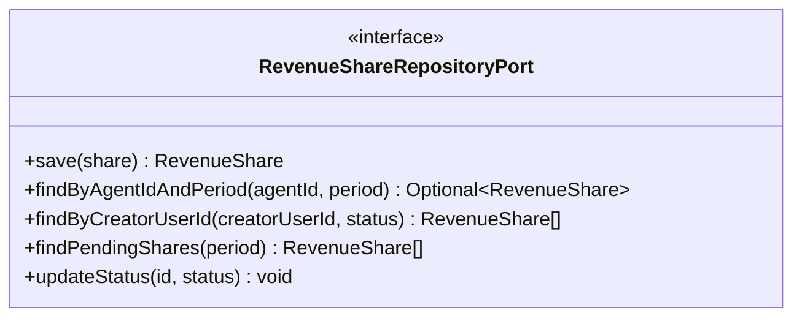

**图表来源**
- [RevenueShareRepositoryPort.java:28-72](file://seahorse-agent-kernel/src/main/java/com/miracle/ai/seahorse/agent/ports/outbound/agent/marketplace/RevenueShareRepositoryPort.java#L28-L72)

**章节来源**
- [AgentCatalogQueryPort.java:23-26](file://seahorse-agent-kernel/src/main/java/com/miracle/ai/seahorse/agent/ports/outbound/agent/AgentCatalogQueryPort.java#L23-L26)
- [AgentCatalogQuery.java:20-38](file://seahorse-agent-kernel/src/main/java/com/miracle/ai/seahorse/agent/ports/inbound/agent/AgentCatalogQuery.java#L20-L38)
- [JdbcAgentCatalogQueryAdapter.java:64-84](file://seahorse-agent-adapter-repository-jdbc/src/main/java/com/miracle/ai/seahorse/agent/adapters/repository/jdbc/JdbcAgentCatalogQueryAdapter.java#L64-L84)
- [RevenueShareRepositoryPort.java:28-72](file://seahorse-agent-kernel/src/main/java/com/miracle/ai/seahorse/agent/ports/outbound/agent/marketplace/RevenueShareRepositoryPort.java#L28-L72)

## 收入分成系统

**新增** 收入分成系统是市场功能的重要组成部分，实现了平台20%和创作者80%的收益分配机制：

### 数据库设计

V13数据库迁移引入了sa_revenue_share表，支持月度结算和状态管理：

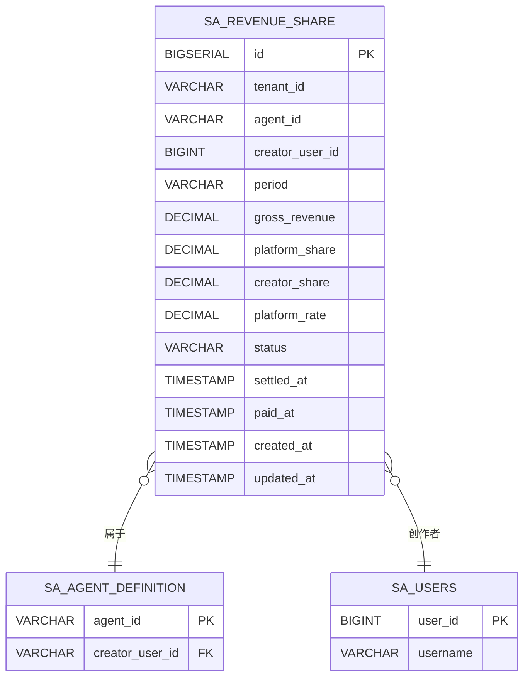

**图表来源**
- [V13__revenue_share.sql:1-21](file://resources/database/migrations/V13__revenue_share.sql#L1-L21)

### 核心业务流程

#### 收益计算流程

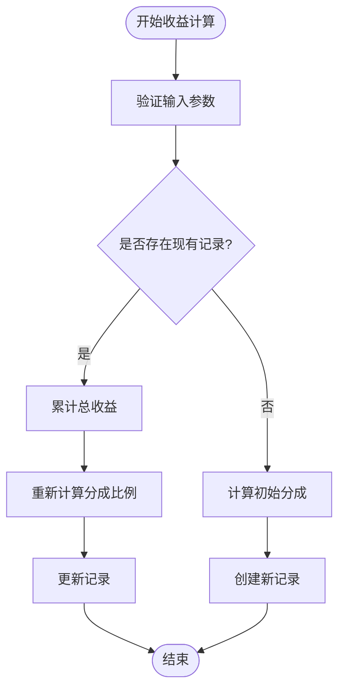

#### 月度结算流程

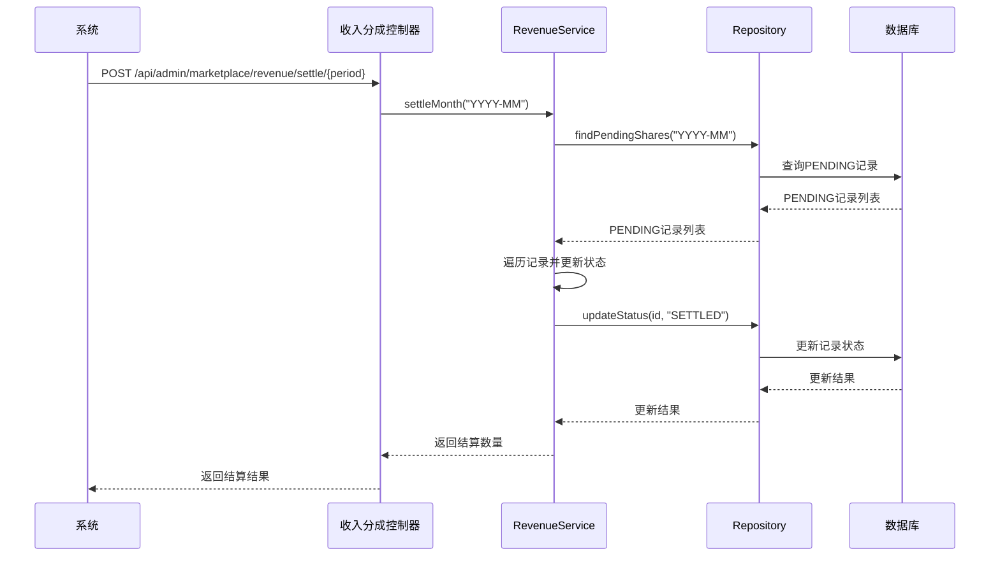

**图表来源**
- [SeahorseRevenueController.java:89-98](file://seahorse-agent-adapter-web/src/main/java/com/miracle/ai/seahorse/agent/adapters/web/SeahorseRevenueController.java#L89-L98)
- [RevenueService.java:103-115](file://seahorse-agent-kernel/src/main/java/com/miracle/ai/seahorse/agent/kernel/application/agent/marketplace/RevenueService.java#L103-L115)

### 业务规则

- **平台费率**: 默认20%（0.2000），创作者80%（0.8000）
- **结算周期**: 月度（yyyy-MM格式）
- **状态流转**: PENDING → SETTLED → PAID
- **多租户支持**: 通过tenant_id隔离不同组织的数据
- **唯一约束**: agent_id + period组合唯一，防止重复结算

### API 集成

在Agent Marketplace文档中可以看到收入分成的集成示例：

```java
// 分成：平台 20%，创作者 80%
revenueService.distributeRevenue(callback.orderId(), 0.8);
```

**章节来源**
- [V13__revenue_share.sql:1-21](file://resources/database/migrations/V13__revenue_share.sql#L1-L21)
- [RevenueService.java:30-131](file://seahorse-agent-kernel/src/main/java/com/miracle/ai/seahorse/agent/kernel/application/agent/marketplace/RevenueService.java#L30-L131)
- [RevenueShare.java:29-86](file://seahorse-agent-kernel/src/main/java/com/miracle/ai/seahorse/agent/kernel/domain/agent/marketplace/RevenueShare.java#L29-L86)
- [SeahorseRevenueController.java:34-98](file://seahorse-agent-adapter-web/src/main/java/com/miracle/ai/seahorse/agent/adapters/web/SeahorseRevenueController.java#L34-L98)
- [07-agent-marketplace.md:421-422](file://docs/aegis/plans/saas-mvp-impl/07-agent-marketplace.md#L421-L422)

## 前端市场页面

**新增** 前端市场页面组件提供了现代化的用户界面和交互体验：

### 页面组件特性

MarketplacePage.tsx 组件包含了以下核心功能：

#### 界面布局
- **Hero 区域**: 渐变背景的标题区域，包含搜索输入框
- **过滤器区域**: 类别标签页和排序选择器
- **Agent 网格**: 响应式的卡片布局展示 Agent 信息
- **分页导航**: 支持多页浏览
- **对话框**: 订阅确认和评分提交对话框

#### 状态管理
- **agents**: 存储从API获取的Agent列表
- **subscriptions**: 存储用户的订阅信息
- **loading**: 加载状态指示
- **filters**: 类别和排序状态
- **pagination**: 分页状态

#### 交互功能
- **分类筛选**: 支持全部、效率工具、数据分析、内容创作、开发工具、其他分类
- **排序机制**: 支持热度排序、最新上架、评分最高
- **订阅管理**: 支持订阅和取消订阅操作
- **评分系统**: 支持星级评分和文本评价

**章节来源**
- [MarketplacePage.tsx:16-329](file://frontend/src/pages/MarketplacePage.tsx#L16-L329)

### 组件交互流程

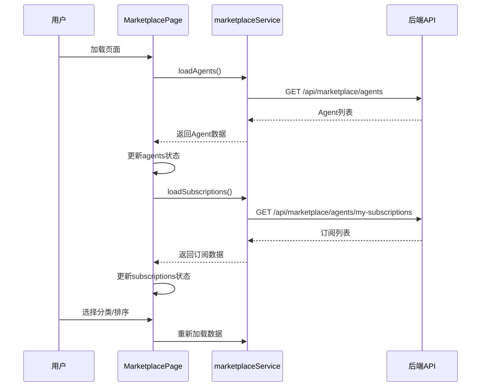

**图表来源**
- [MarketplacePage.tsx:52-82](file://frontend/src/pages/MarketplacePage.tsx#L52-L82)

**章节来源**
- [MarketplacePage.tsx:52-134](file://frontend/src/pages/MarketplacePage.tsx#L52-L134)

## 前端服务层

**新增** marketplaceService.ts 提供了统一的API调用封装：

### 服务接口定义

#### MarketpaceAgent 接口
```typescript
export interface MarketplaceAgent {
  agentId: string;
  name: string;
  description: string;
  category: string;
  iconUrl?: string;
  pricingType: string;
  price: number;
  avgRating: number;
  ratingCount: number;
  subscriptionCount: number;
  popularityScore: number;
  publisherName: string;
  tags: string[];
}
```

#### 订阅管理接口
```typescript
export interface MySubscription {
  agentId: string;
  agentName: string;
  subscribedAt: string;
  active: boolean;
}
```

### API 调用方法

#### 市场浏览
- `listMarketplaceAgents(params)`: 获取Agent列表，支持分类、排序、分页参数

#### 订阅管理
- `subscribeAgent(agentId)`: 订阅指定Agent
- `unsubscribeAgent(agentId)`: 取消订阅Agent
- `getMySubscriptions()`: 获取用户订阅列表

#### 评分功能
- `rateAgent(agentId, rating, comment)`: 为Agent评分

#### 发布审核（管理员）
- `submitForPublish(agentId)`: 提交Agent发布申请
- `approvePublish(reviewId)`: 审核通过
- `rejectPublish(reviewId, comment)`: 审核拒绝
- `listPendingReviews()`: 获取待审核列表

#### 收入分成（创作者）
- `getCreatorEarnings(creatorUserId, status)`: 获取创作者收益明细

**章节来源**
- [marketplaceService.ts:3-81](file://frontend/src/services/marketplaceService.ts#L3-L81)

## 依赖关系分析

市场功能的依赖关系体现了清晰的分层架构，现已扩展为前后端协同，包含收入分成系统的支持：

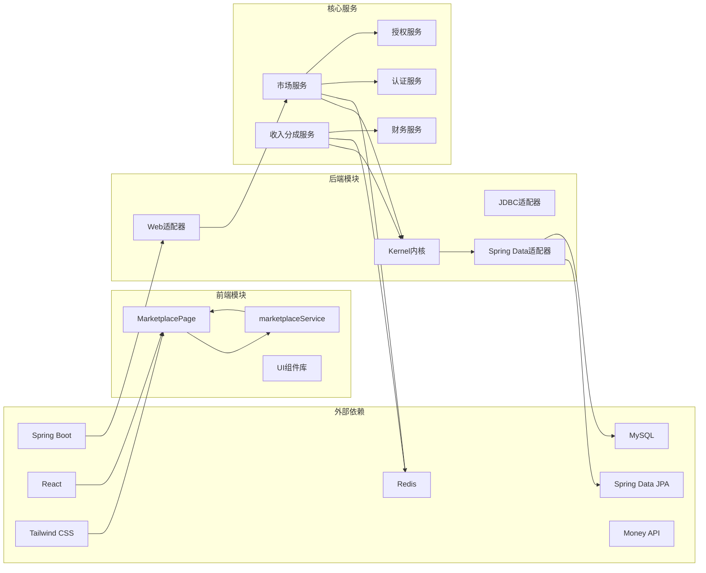

**图表来源**
- [MarketplacePage.tsx:1-15](file://frontend/src/pages/MarketplacePage.tsx#L1-L15)
- [marketplaceService.ts:1](file://frontend/src/services/marketplaceService.ts#L1)
- [SeahorseMarketplaceController.java:43-56](file://seahorse-agent-adapter-web/src/main/java/com/miracle/ai/seahorse/agent/adapters/web/SeahorseMarketplaceController.java#L43-L56)
- [SeahorseRevenueController.java:46-53](file://seahorse-agent-adapter-web/src/main/java/com/miracle/ai/seahorse/agent/adapters/web/SeahorseRevenueController.java#L46-L53)
- [KernelAgentMarketplaceService.java:36-48](file://seahorse-agent-kernel/src/main/java/com/miracle/ai/seahorse/agent/kernel/application/agent/marketplace/KernelAgentMarketplaceService.java#L36-L48)
- [RevenueService.java:36-43](file://seahorse-agent-kernel/src/main/java/com/miracle/ai/seahorse/agent/kernel/application/agent/marketplace/RevenueService.java#L36-L43)

### 组件耦合度分析

市场功能实现了低耦合高内聚的设计原则：

- **前端页面组件**仅负责UI渲染和用户交互
- **前端服务层**封装API调用和数据处理
- **Web 控制器**仅负责请求处理和响应封装
- **应用服务**封装核心业务逻辑
- **领域模型**独立于数据访问实现
- **数据访问**通过接口抽象与具体实现解耦

这种设计使得各组件可以独立测试和维护，提高了系统的可扩展性。

**章节来源**
- [MarketplacePage.tsx:1-15](file://frontend/src/pages/MarketplacePage.tsx#L1-L15)
- [marketplaceService.ts:1](file://frontend/src/services/marketplaceService.ts#L1)
- [SeahorseMarketplaceController.java:43-56](file://seahorse-agent-adapter-web/src/main/java/com/miracle/ai/seahorse/agent/adapters/web/SeahorseMarketplaceController.java#L43-L56)
- [SeahorseRevenueController.java:46-53](file://seahorse-agent-adapter-web/src/main/java/com/miracle/ai/seahorse/agent/adapters/web/SeahorseRevenueController.java#L46-L53)
- [KernelAgentMarketplaceService.java:36-48](file://seahorse-agent-kernel/src/main/java/com/miracle/ai/seahorse/agent/kernel/application/agent/marketplace/KernelAgentMarketplaceService.java#L36-L48)
- [RevenueService.java:36-43](file://seahorse-agent-kernel/src/main/java/com/miracle/ai/seahorse/agent/kernel/application/agent/marketplace/RevenueService.java#L36-L43)

## 性能考虑

市场功能在设计时充分考虑了性能优化，新增的前端组件和收入分成系统也体现了相应的优化策略：

### 前端性能优化
- **状态管理**: 使用React Hooks进行高效的状态管理
- **懒加载**: 图标资源按需加载
- **虚拟滚动**: 对于大量Agent时可考虑实现虚拟滚动
- **缓存策略**: 前端缓存热门Agent数据

### 收入分成系统优化
- **批量结算**: 支持按月批量结算PENDING记录
- **索引优化**: 为tenant_id、creator_user_id、period建立复合索引
- **状态查询**: 支持按状态过滤创作者收益
- **金额精度**: 使用DECIMAL(12,2)确保财务计算精度

### 缓存策略
- 使用 Redis 缓存热门 Agent 信息
- 订阅状态和评分数据进行缓存
- 目录查询结果缓存以减少数据库压力
- 收入分成计算结果缓存

### 数据库优化
- 为常用查询字段建立索引
- 实现分页查询避免大数据集加载
- 使用连接池管理数据库连接
- 收入分成表使用复合主键优化查询

### 异步处理
- 审核通知异步发送
- 评分统计异步计算
- 订阅状态变更异步更新
- 收入分成结算异步执行

## 故障排除指南

### 前端常见问题及解决方案

#### 1. 市场页面加载失败
**症状**: 页面显示加载中但长时间无响应
**可能原因**:
- API接口不可用
- 网络连接异常
- 前端状态管理错误

**解决步骤**:
1. 检查网络连接状态
2. 验证API接口可用性
3. 查看浏览器控制台错误信息
4. 清除浏览器缓存后重试

#### 2. 订阅功能异常
**症状**: 订阅按钮点击无反应或订阅失败
**可能原因**:
- 用户未登录
- API调用失败
- 前端状态更新错误

**解决步骤**:
1. 确认用户登录状态
2. 检查网络请求状态码
3. 验证API响应格式
4. 查看前端错误日志

#### 3. 评分功能异常
**症状**: 无法提交评分或评分显示错误
**可能原因**:
- 评分范围超出限制 (1-5)
- 重复评分
- 前端状态管理问题

**解决步骤**:
1. 验证评分值在有效范围内
2. 检查用户是否已评分
3. 清除相关缓存后重试
4. 检查前端状态更新逻辑

### 后端常见问题及解决方案

#### 1. 发布申请失败
**症状**: 提交发布申请时报错
**可能原因**:
- Agent 状态不是 PRIVATE
- 数据库连接异常
- 权限不足

**解决步骤**:
1. 检查 Agent 状态是否为 PRIVATE
2. 验证数据库连接配置
3. 确认用户具有发布权限

#### 2. 订阅管理异常
**症状**: 订阅或取消订阅失败
**可能原因**:
- 用户未登录
- Agent 不存在
- 数据库事务冲突

**解决步骤**:
1. 确认用户会话有效性
2. 验证 Agent ID 存在性
3. 检查数据库锁状态

#### 3. 评分功能异常
**症状**: 无法提交评分或评分显示错误
**可能原因**:
- 评分范围超出限制 (1-5)
- 重复评分
- 缓存同步延迟

**解决步骤**:
1. 验证评分值在有效范围内
2. 检查用户是否已评分
3. 清除相关缓存后重试

#### 4. 收入分成系统异常
**症状**: 收益计算不准确或结算失败
**可能原因**:
- 数据库连接异常
- 金额精度问题
- 状态流转错误
- 多租户隔离失效

**解决步骤**:
1. 检查数据库连接和事务配置
2. 验证DECIMAL精度设置
3. 确认状态流转顺序正确
4. 验证tenant_id隔离机制
5. 检查复合索引是否正常工作

**章节来源**
- [KernelAgentMarketplaceService.java:134-193](file://seahorse-agent-kernel/src/main/java/com/miracle/ai/seahorse/agent/kernel/application/agent/marketplace/KernelAgentMarketplaceService.java#L134-L193)
- [MarketplacePage.tsx:88-134](file://frontend/src/pages/MarketplacePage.tsx#L88-L134)
- [RevenueService.java:57-95](file://seahorse-agent-kernel/src/main/java/com/miracle/ai/seahorse/agent/kernel/application/agent/marketplace/RevenueService.java#L57-L95)

## 结论

市场功能作为 Seahorse Agent 平台的核心商业模块，展现了优秀的软件架构设计。通过清晰的分层结构、完善的领域建模和灵活的扩展机制，系统能够有效支撑复杂的市场运营需求。

**更新** 新增的收入分成系统为市场功能带来了显著的商业化能力提升。通过V13数据库迁移和RevenueService实现，系统成功构建了20/80平台到创作者收益分配机制，支持月度结算周期、自动平台费用计算和完整的状态管理流程。新增的收入分成Web控制器进一步完善了商业化能力，提供了创作者收益查询和管理员月度结算功能。

该功能的主要优势包括：
- **模块化设计**: 前后端组件职责明确，便于维护和扩展
- **多租户支持**: 确保不同组织间的完全隔离
- **性能优化**: 通过缓存和异步处理提升用户体验
- **安全可靠**: 完善的权限控制和数据验证机制
- **现代化界面**: 提供直观易用的用户交互体验
- **商业化能力**: 收入分成系统支持创作者经济模式
- **财务精确**: 使用DECIMAL类型确保收益计算精度
- **管理员支持**: 提供月度结算等后台管理功能

未来可以进一步增强的功能包括：
- 支付集成的完善
- 更丰富的分析报表
- 智能推荐算法
- 移动端适配
- 实时搜索和过滤功能
- 收入分成的自动化结算流程
- 创作者收益的可视化展示

市场功能的成功实施为 Seahorse Agent 平台奠定了坚实的商业化基础，为后续的功能扩展和业务发展提供了良好的技术支撑。收入分成系统的加入更是为平台的长期可持续发展提供了重要的商业模式保障。