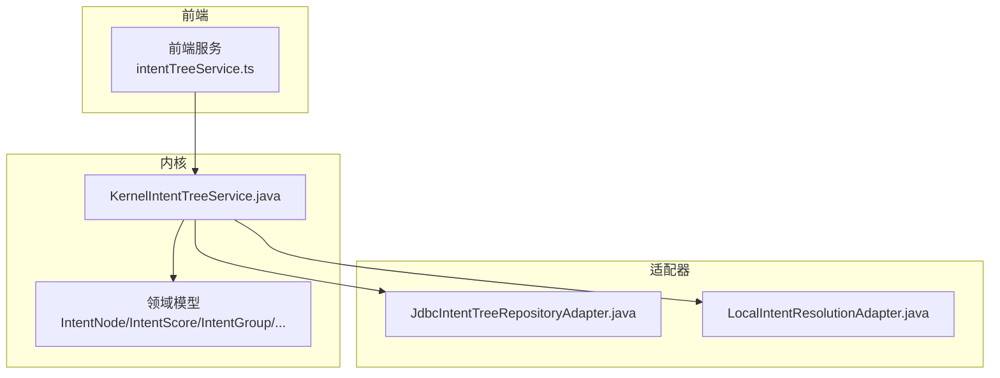
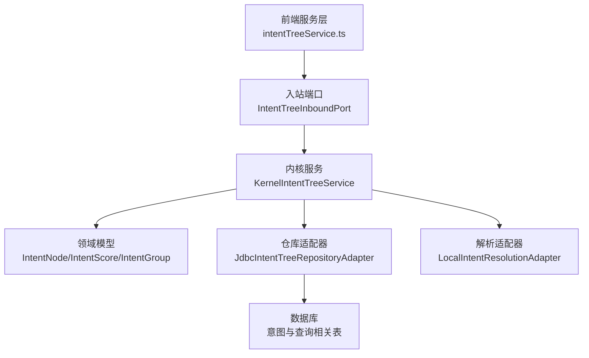
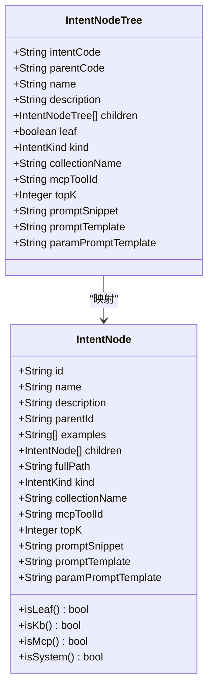
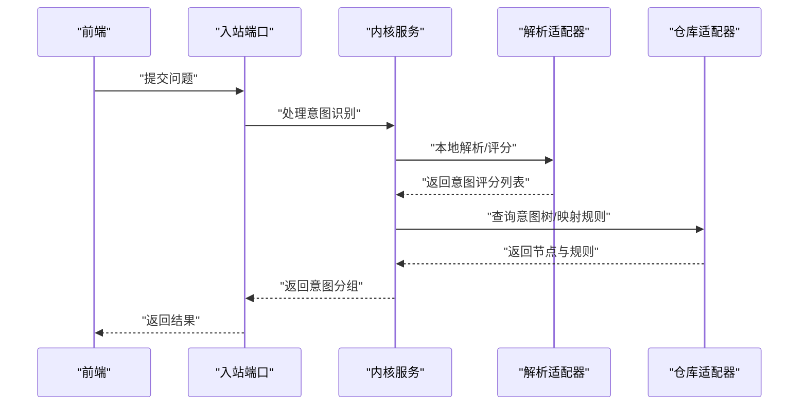
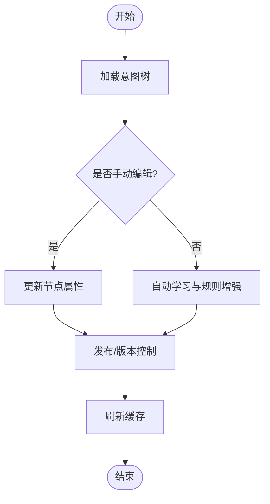
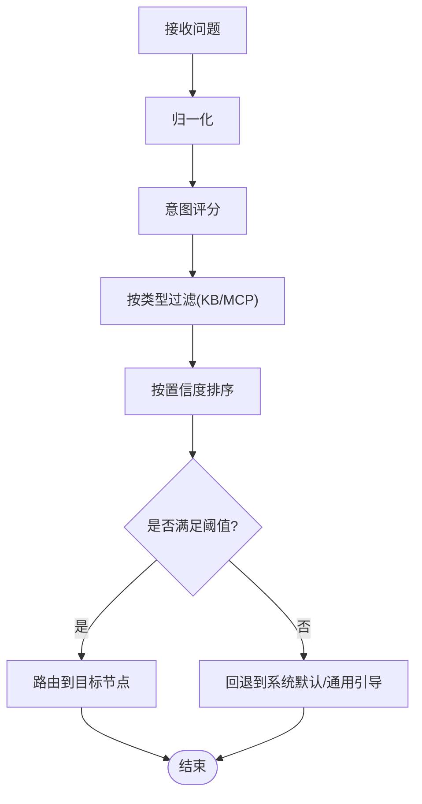
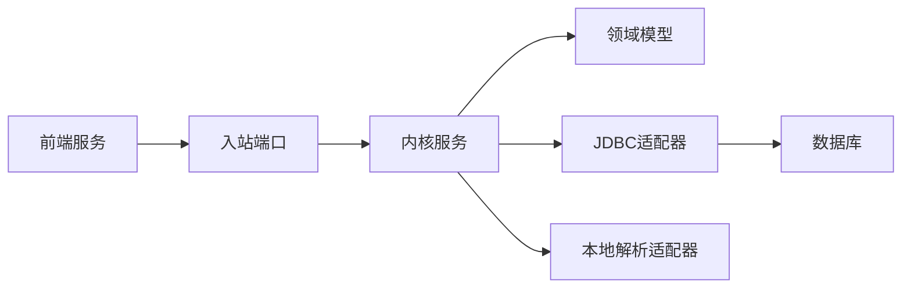

# 意图树系统

<cite>
**本文引用的文件**
- [KernelIntentTreeService.java](file://seahorse-agent-kernel/src/main/java/com/miracle/ai/seahorse/agent/kernel/application/intent/KernelIntentTreeService.java)
- [IntentNode.java](file://seahorse-agent-kernel/src/main/java/com/miracle/ai/seahorse/agent/kernel/domain/intent/IntentNode.java)
- [IntentNodeTree.java](file://seahorse-agent-kernel/src/main/java/com/miracle/ai/seahorse/agent/ports/outbound/intent/IntentNodeTree.java)
- [IntentScore.java](file://seahorse-agent-kernel/src/main/java/com/miracle/ai/seahorse/agent/kernel/domain/intent/IntentScore.java)
- [IntentGroup.java](file://seahorse-agent-kernel/src/main/java/com/miracle/ai/seahorse/agent/kernel/domain/intent/IntentGroup.java)
- [SubQuestionIntent.java](file://seahorse-agent-kernel/src/main/java/com/miracle/ai/seahorse/agent/kernel/domain/intent/SubQuestionIntent.java)
- [IntentScoreFilters.java](file://seahorse-agent-kernel/src/main/java/com/miracle/ai/seahorse/agent/kernel/domain/intent/IntentScoreFilters.java)
- [IntentTreeInboundPort.java](file://seahorse-agent-kernel/src/main/java/com/miracle/ai/seahorse/agent/ports/inbound/intent/IntentTreeInboundPort.java)
- [LocalIntentResolutionAdapter.java](file://seahorse-agent-adapter-web/src/main/java/com/miracle/ai/seahorse/agent/adapters/local/LocalIntentResolutionAdapter.java)
- [JdbcIntentTreeRepositoryAdapter.java](file://seahorse-agent-adapter-repository-jdbc/src/main/java/com/miracle/ai/seahorse/agent/adapters/repository/jdbc/JdbcIntentTreeRepositoryAdapter.java)
- [intentTreeService.ts](file://frontend/src/services/intentTreeService.ts)
- [意图领域模型.md](file://docs/zh/content/后端系统/核心内核/领域模型/意图领域模型.md)
- [意图与查询相关表.md](file://docs/zh/content/数据库设计/表结构设计/意图与查询相关表.md)
- [seahorse_init.sql](file://resources/database/seahorse_init.sql)
</cite>

## 目录
1. [简介](#简介)
2. [项目结构](#项目结构)
3. [核心组件](#核心组件)
4. [架构总览](#架构总览)
5. [详细组件分析](#详细组件分析)
6. [依赖分析](#依赖分析)
7. [性能考虑](#性能考虑)
8. [故障排除指南](#故障排除指南)
9. [结论](#结论)
10. [附录](#附录)

## 简介
本文件系统性阐述意图树（Intent Tree）的设计与实现，覆盖节点类型与层级关系、分支策略、意图识别算法（自然语言理解、分类模型、置信度评估）、意图树构建与维护（手动编辑、自动学习、版本管理）、意图匹配与路由机制（模糊匹配、优先级排序、回退策略），以及应用场景（对话引导、功能导航、个性化推荐）。同时提供配置参数说明、训练数据准备与效果评估方法，并给出实际应用案例与优化建议。

## 项目结构
意图树系统由“内核领域模型”“适配器层”“前端服务层”三部分组成：
- 内核领域模型：定义意图节点、评分、分组、子问题意图等核心数据结构与算法入口。
- 适配器层：负责持久化（JDBC）、本地解析（LocalIntentResolutionAdapter）、Web适配等。
- 前端服务层：提供意图树相关的前端调用封装。

图表来源
- [KernelIntentTreeService.java:56-134](file://seahorse-agent-kernel/src/main/java/com/miracle/ai/seahorse/agent/kernel/application/intent/KernelIntentTreeService.java#L56-L134)
- [JdbcIntentTreeRepositoryAdapter.java:80-182](file://seahorse-agent-adapter-repository-jdbc/src/main/java/com/miracle/ai/seahorse/agent/adapters/repository/jdbc/JdbcIntentTreeRepositoryAdapter.java#L80-L182)
- [LocalIntentResolutionAdapter.java:59-92](file://seahorse-agent-adapter-web/src/main/java/com/miracle/ai/seahorse/agent/adapters/local/LocalIntentResolutionAdapter.java#L59-L92)
- [intentTreeService.ts](file://frontend/src/services/intentTreeService.ts)

章节来源
- [KernelIntentTreeService.java:56-134](file://seahorse-agent-kernel/src/main/java/com/miracle/ai/seahorse/agent/kernel/application/intent/KernelIntentTreeService.java#L56-L134)
- [JdbcIntentTreeRepositoryAdapter.java:80-182](file://seahorse-agent-adapter-repository-jdbc/src/main/java/com/miracle/ai/seahorse/agent/adapters/repository/jdbc/JdbcIntentTreeRepositoryAdapter.java#L80-L182)
- [LocalIntentResolutionAdapter.java:59-92](file://seahorse-agent-adapter-web/src/main/java/com/miracle/ai/seahorse/agent/adapters/local/LocalIntentResolutionAdapter.java#L59-L92)
- [intentTreeService.ts](file://frontend/src/services/intentTreeService.ts)

## 核心组件
- 意图节点（IntentNode）：描述意图的基本单元，包含标识、父节点、示例、类型（知识库KB、系统SYSTEM、MCP工具）、集合名、TopK、提示词模板等。
- 节点树（IntentNodeTree）：对外暴露的树形结构载体，用于序列化/传输。
- 意图评分（IntentScore）：节点与匹配分数的组合，用于排序与筛选。
- 意图分组（IntentGroup）：将意图按类型（KB/MCP）分组，便于后续路由。
- 子问题意图（SubQuestionIntent）：针对复杂问题拆分后的子意图结果。
- 评分过滤器（IntentScoreFilters）：按类型过滤评分列表。
- 入站端口（IntentTreeInboundPort）：对外暴露的意图树操作接口。
- 解析适配器（LocalIntentResolutionAdapter）：本地意图解析与合并逻辑。
- 仓库适配器（JdbcIntentTreeRepositoryAdapter）：意图树持久化与查询。

章节来源
- [IntentNode.java](file://seahorse-agent-kernel/src/main/java/com/miracle/ai/seahorse/agent/kernel/domain/intent/IntentNode.java)
- [IntentNodeTree.java](file://seahorse-agent-kernel/src/main/java/com/miracle/ai/seahorse/agent/ports/outbound/intent/IntentNodeTree.java)
- [IntentScore.java](file://seahorse-agent-kernel/src/main/java/com/miracle/ai/seahorse/agent/kernel/domain/intent/IntentScore.java)
- [IntentGroup.java](file://seahorse-agent-kernel/src/main/java/com/miracle/ai/seahorse/agent/kernel/domain/intent/IntentGroup.java)
- [SubQuestionIntent.java](file://seahorse-agent-kernel/src/main/java/com/miracle/ai/seahorse/agent/kernel/domain/intent/SubQuestionIntent.java)
- [IntentScoreFilters.java](file://seahorse-agent-kernel/src/main/java/com/miracle/ai/seahorse/agent/kernel/domain/intent/IntentScoreFilters.java)
- [IntentTreeInboundPort.java](file://seahorse-agent-kernel/src/main/java/com/miracle/ai/seahorse/agent/ports/inbound/intent/IntentTreeInboundPort.java)
- [LocalIntentResolutionAdapter.java:59-92](file://seahorse-agent-adapter-web/src/main/java/com/miracle/ai/seahorse/agent/adapters/local/LocalIntentResolutionAdapter.java#L59-L92)
- [JdbcIntentTreeRepositoryAdapter.java:80-182](file://seahorse-agent-adapter-repository-jdbc/src/main/java/com/miracle/ai/seahorse/agent/adapters/repository/jdbc/JdbcIntentTreeRepositoryAdapter.java#L80-L182)

## 架构总览
意图树系统采用“内核领域模型 + 多适配器 + 前端服务”的分层架构。前端通过服务封装调用内核，内核通过适配器访问存储与外部能力，最终完成意图识别、匹配与路由。

图表来源
- [KernelIntentTreeService.java:56-134](file://seahorse-agent-kernel/src/main/java/com/miracle/ai/seahorse/agent/kernel/application/intent/KernelIntentTreeService.java#L56-L134)
- [IntentTreeInboundPort.java](file://seahorse-agent-kernel/src/main/java/com/miracle/ai/seahorse/agent/ports/inbound/intent/IntentTreeInboundPort.java)
- [JdbcIntentTreeRepositoryAdapter.java:80-182](file://seahorse-agent-adapter-repository-jdbc/src/main/java/com/miracle/ai/seahorse/agent/adapters/repository/jdbc/JdbcIntentTreeRepositoryAdapter.java#L80-L182)
- [LocalIntentResolutionAdapter.java:59-92](file://seahorse-agent-adapter-web/src/main/java/com/miracle/ai/seahorse/agent/adapters/local/LocalIntentResolutionAdapter.java#L59-L92)
- [意图与查询相关表.md](file://docs/zh/content/数据库设计/表结构设计/意图与查询相关表.md)

## 详细组件分析

### 组件一：意图节点与树结构
- 节点类型与属性
  - 基本属性：id、name、description、parentId、fullPath、examples。
  - 业务属性：kind（KB/SYSTEM/MCP）、collectionName、mcpToolId、topK。
  - 提示词属性：promptSnippet、promptTemplate、paramPromptTemplate。
  - 判定方法：isLeaf、isKb、isMcp、isSystem。
- 树构建流程
  - 从节点列表构建“父子映射”，根节点以父码为空或不存在时视为ROOT。
  - 使用递归将子节点挂载到父节点，形成完整的树结构。
  - 支持后代收集（广度/深度遍历），用于统计与校验。
- 层级关系与分支策略
  - 通过parentId建立层级；children为数组，支持多分支。
  - 叶子节点用于最终动作（KB检索/MCP工具调用），非叶子节点用于引导与聚合。

图表来源
- [IntentNode.java](file://seahorse-agent-kernel/src/main/java/com/miracle/ai/seahorse/agent/kernel/domain/intent/IntentNode.java)
- [IntentNodeTree.java](file://seahorse-agent-kernel/src/main/java/com/miracle/ai/seahorse/agent/ports/outbound/intent/IntentNodeTree.java)

章节来源
- [IntentNode.java](file://seahorse-agent-kernel/src/main/java/com/miracle/ai/seahorse/agent/kernel/domain/intent/IntentNode.java)
- [IntentNodeTree.java](file://seahorse-agent-kernel/src/main/java/com/miracle/ai/seahorse/agent/ports/outbound/intent/IntentNodeTree.java)
- [KernelIntentTreeService.java:178-196](file://seahorse-agent-kernel/src/main/java/com/miracle/ai/seahorse/agent/kernel/application/intent/KernelIntentTreeService.java#L178-L196)

### 组件二：意图识别与评分
- 意图识别流程
  - 输入：用户问题（可包含子问题）。
  - 归一化：去除空白字符，空输入返回空结果。
  - 评分：对每个候选意图计算匹配分数（IntentScore），包含节点与分数。
  - 过滤：按类型过滤（KB/MCP）。
  - 合并：将多个子问题的意图评分合并为意图分组（IntentGroup）。
- 置信度评估
  - 将分数映射为置信度等级（高/中/低/未知），用于路由与回退策略。

图表来源
- [KernelIntentTreeService.java:56-134](file://seahorse-agent-kernel/src/main/java/com/miracle/ai/seahorse/agent/kernel/application/intent/KernelIntentTreeService.java#L56-L134)
- [LocalIntentResolutionAdapter.java:59-92](file://seahorse-agent-adapter-web/src/main/java/com/miracle/ai/seahorse/agent/adapters/local/LocalIntentResolutionAdapter.java#L59-L92)
- [JdbcIntentTreeRepositoryAdapter.java:80-182](file://seahorse-agent-adapter-repository-jdbc/src/main/java/com/miracle/ai/seahorse/agent/adapters/repository/jdbc/JdbcIntentTreeRepositoryAdapter.java#L80-L182)

章节来源
- [LocalIntentResolutionAdapter.java:59-92](file://seahorse-agent-adapter-web/src/main/java/com/miracle/ai/seahorse/agent/adapters/local/LocalIntentResolutionAdapter.java#L59-L92)
- [IntentScore.java](file://seahorse-agent-kernel/src/main/java/com/miracle/ai/seahorse/agent/kernel/domain/intent/IntentScore.java)
- [IntentGroup.java](file://seahorse-agent-kernel/src/main/java/com/miracle/ai/seahorse/agent/kernel/domain/intent/IntentGroup.java)
- [SubQuestionIntent.java](file://seahorse-agent-kernel/src/main/java/com/miracle/ai/seahorse/agent/kernel/domain/intent/SubQuestionIntent.java)
- [IntentScoreFilters.java](file://seahorse-agent-kernel/src/main/java/com/miracle/ai/seahorse/agent/kernel/domain/intent/IntentScoreFilters.java)

### 组件三：意图树构建与维护
- 手动编辑
  - 通过管理界面或API更新节点属性（名称、描述、示例、类型、提示词模板等）。
  - 更新后刷新缓存，确保新规则生效。
- 自动学习
  - 基于用户交互与反馈（点击、收藏、评分）动态调整节点权重与示例。
  - 结合查询映射表（t_query_term_mapping）进行规则增强。
- 版本管理
  - 为意图树引入版本号与发布状态，支持灰度发布与回滚。
  - 通过数据库表记录变更历史，保证可追溯性。

图表来源
- [KernelIntentTreeService.java:56-134](file://seahorse-agent-kernel/src/main/java/com/miracle/ai/seahorse/agent/kernel/application/intent/KernelIntentTreeService.java#L56-L134)
- [意图与查询相关表.md](file://docs/zh/content/数据库设计/表结构设计/意图与查询相关表.md)

章节来源
- [KernelIntentTreeService.java:56-134](file://seahorse-agent-kernel/src/main/java/com/miracle/ai/seahorse/agent/kernel/application/intent/KernelIntentTreeService.java#L56-L134)
- [意图与查询相关表.md](file://docs/zh/content/数据库设计/表结构设计/意图与查询相关表.md)

### 组件四：意图匹配与路由机制
- 模糊匹配
  - 查询映射表支持精确匹配与模糊匹配（LIKE模式），按优先级排序。
  - 结合节点示例与提示词模板进行语义近似匹配。
- 优先级排序
  - 按置信度等级（高/中/低）与TopK参数排序，优先返回高质量意图。
- 回退策略
  - 当无高置信度意图时，回退到系统默认意图或通用引导节点。
  - 若为系统意图，可直接执行；否则进入下一步路由或提示澄清。

图表来源
- [LocalIntentResolutionAdapter.java:59-92](file://seahorse-agent-adapter-web/src/main/java/com/miracle/ai/seahorse/agent/adapters/local/LocalIntentResolutionAdapter.java#L59-L92)
- [意图与查询相关表.md](file://docs/zh/content/数据库设计/表结构设计/意图与查询相关表.md)

章节来源
- [LocalIntentResolutionAdapter.java:59-92](file://seahorse-agent-adapter-web/src/main/java/com/miracle/ai/seahorse/agent/adapters/local/LocalIntentResolutionAdapter.java#L59-L92)
- [意图与查询相关表.md](file://docs/zh/content/数据库设计/表结构设计/意图与查询相关表.md)

### 组件五：应用场景与最佳实践
- 对话引导：通过叶子节点引导用户完成复杂任务，提升对话效率。
- 功能导航：将意图树作为导航骨架，帮助用户快速定位功能入口。
- 个性化推荐：结合用户画像与历史行为，动态调整TopK与提示词模板，实现个性化推荐。

章节来源
- [IntentNode.java](file://seahorse-agent-kernel/src/main/java/com/miracle/ai/seahorse/agent/kernel/domain/intent/IntentNode.java)
- [IntentNodeTree.java](file://seahorse-agent-kernel/src/main/java/com/miracle/ai/seahorse/agent/ports/outbound/intent/IntentNodeTree.java)

## 依赖分析
- 内核服务依赖领域模型与适配器，适配器依赖数据库与外部能力。
- 前端通过服务封装调用内核，降低耦合度。
- 评分与过滤器解耦，便于扩展新的评分策略。

图表来源
- [KernelIntentTreeService.java:56-134](file://seahorse-agent-kernel/src/main/java/com/miracle/ai/seahorse/agent/kernel/application/intent/KernelIntentTreeService.java#L56-L134)
- [JdbcIntentTreeRepositoryAdapter.java:80-182](file://seahorse-agent-adapter-repository-jdbc/src/main/java/com/miracle/ai/seahorse/agent/adapters/repository/jdbc/JdbcIntentTreeRepositoryAdapter.java#L80-L182)
- [LocalIntentResolutionAdapter.java:59-92](file://seahorse-agent-adapter-web/src/main/java/com/miracle/ai/seahorse/agent/adapters/local/LocalIntentResolutionAdapter.java#L59-L92)

章节来源
- [KernelIntentTreeService.java:56-134](file://seahorse-agent-kernel/src/main/java/com/miracle/ai/seahorse/agent/kernel/application/intent/KernelIntentTreeService.java#L56-L134)
- [JdbcIntentTreeRepositoryAdapter.java:80-182](file://seahorse-agent-adapter-repository-jdbc/src/main/java/com/miracle/ai/seahorse/agent/adapters/repository/jdbc/JdbcIntentTreeRepositoryAdapter.java#L80-L182)
- [LocalIntentResolutionAdapter.java:59-92](file://seahorse-agent-adapter-web/src/main/java/com/miracle/ai/seahorse/agent/adapters/local/LocalIntentResolutionAdapter.java#L59-L92)

## 性能考虑
- 缓存策略：对常用意图树与查询映射规则进行缓存，设置失效时间与统一清理策略。
- 分页与索引：查询映射表按domain/source_term/target_term建立索引，支持分页查询。
- 并行评分：在解析适配器中对多个子问题并行评分，减少总体延迟。
- TopK裁剪：根据业务需求限制返回数量，避免过度输出。

章节来源
- [意图与查询相关表.md](file://docs/zh/content/数据库设计/表结构设计/意图与查询相关表.md)
- [LocalIntentResolutionAdapter.java:59-92](file://seahorse-agent-adapter-web/src/main/java/com/miracle/ai/seahorse/agent/adapters/local/LocalIntentResolutionAdapter.java#L59-L92)

## 故障排除指南
- 输入为空：归一化后若为空，直接返回空结果，避免无效计算。
- 无匹配意图：检查映射规则与节点配置，确认是否需要增加示例或调整阈值。
- 系统意图误判：通过isSystem判定，确保系统意图不被错误路由到其他分支。
- 置信度异常：检查评分逻辑与阈值设置，必要时调整置信度等级划分。

章节来源
- [LocalIntentResolutionAdapter.java:59-92](file://seahorse-agent-adapter-web/src/main/java/com/miracle/ai/seahorse/agent/adapters/local/LocalIntentResolutionAdapter.java#L59-L92)
- [KernelIntentTreeService.java:178-196](file://seahorse-agent-kernel/src/main/java/com/miracle/ai/seahorse/agent/kernel/application/intent/KernelIntentTreeService.java#L178-L196)

## 结论
意图树系统通过清晰的领域模型、灵活的适配器架构与完善的前端服务封装，实现了从意图识别、匹配到路由的全链路能力。配合查询映射表与缓存策略，系统具备良好的扩展性与性能表现。建议在实际部署中重视规则治理、版本管理与效果评估，持续优化置信度阈值与TopK参数，以获得更佳的用户体验。

## 附录

### 配置参数说明
- 节点属性
  - kind：意图类型（KB/SYSTEM/MCP）
  - collectionName：知识库集合名
  - mcpToolId：MCP工具标识
  - topK：返回候选数量
  - promptSnippet/promptTemplate/paramPromptTemplate：提示词模板
- 查询映射表字段
  - domain、source_term、target_term、match_type（精确/模糊）、priority、enabled

章节来源
- [IntentNode.java](file://seahorse-agent-kernel/src/main/java/com/miracle/ai/seahorse/agent/kernel/domain/intent/IntentNode.java)
- [意图与查询相关表.md](file://docs/zh/content/数据库设计/表结构设计/意图与查询相关表.md)

### 训练数据准备
- 示例收集：为每个意图节点补充高质量示例，覆盖常见表达与变体。
- 规则标注：在查询映射表中标注domain/source_term/target_term及匹配类型。
- 人工校验：定期抽样验证匹配质量，修正误标与漏标。

章节来源
- [意图与查询相关表.md](file://docs/zh/content/数据库设计/表结构设计/意图与查询相关表.md)

### 效果评估方法
- 准确率：高置信度命中率与误报率。
- 召回率：覆盖所有意图类型的召回情况。
- 用户反馈：点击率、满意度评分、重试次数。
- A/B测试：对比不同阈值与TopK设置下的整体效果。

章节来源
- [IntentScore.java](file://seahorse-agent-kernel/src/main/java/com/miracle/ai/seahorse/agent/kernel/domain/intent/IntentScore.java)
- [LocalIntentResolutionAdapter.java:59-92](file://seahorse-agent-adapter-web/src/main/java/com/miracle/ai/seahorse/agent/adapters/local/LocalIntentResolutionAdapter.java#L59-L92)

### 实际应用案例
- 案例一：财务报销流程引导
  - 通过叶子节点逐步引导用户填写发票信息与费用类型。
  - 系统意图用于快速跳转到常用功能入口。
- 案例二：知识检索与工具调用
  - KB意图触发知识库检索，MCP意图触发外部工具调用。
  - 通过TopK与提示词模板提升检索质量与工具调用成功率。

章节来源
- [IntentNode.java](file://seahorse-agent-kernel/src/main/java/com/miracle/ai/seahorse/agent/kernel/domain/intent/IntentNode.java)
- [IntentNodeTree.java](file://seahorse-agent-kernel/src/main/java/com/miracle/ai/seahorse/agent/ports/outbound/intent/IntentNodeTree.java)